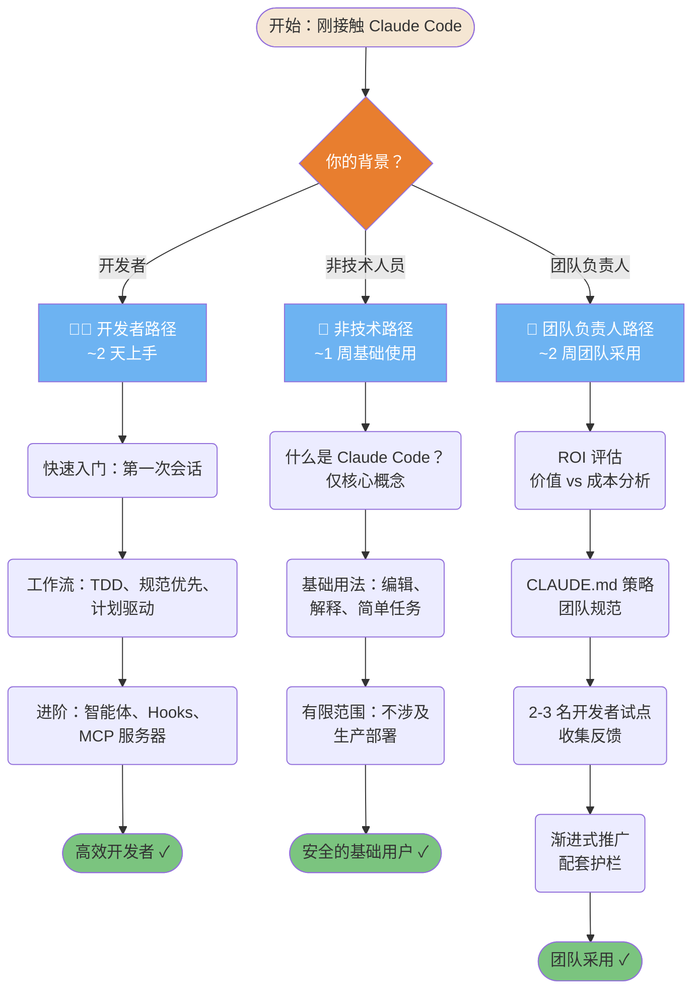
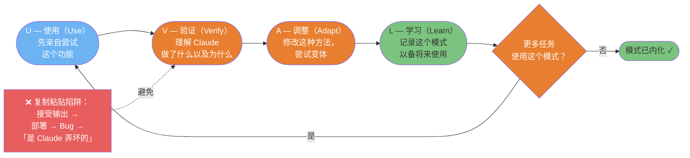
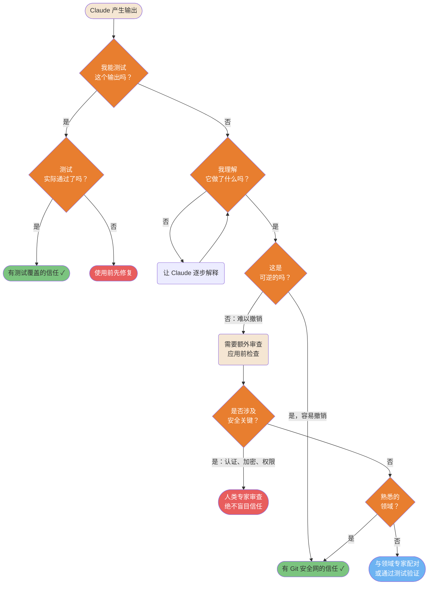

# 采用与学习

个人和团队如何成功采用 Claude Code，同时不丧失技能或控制权。

---

### 入门自适应学习路径

不同背景需要不同的入门方式。强迫开发者走新手路径会浪费时间；把非技术用户直接扔进高级功能会让人沮丧。



ASCII 版本

```Plain Text
你的背景？
├─ 开发者（~2 天）：
│  快速入门 → 工作流（TDD/规范/计划）→ 进阶（智能体/Hooks/MCP）
│
├─ 非技术人员（~1 周）：
│  什么是 Claude Code？→ 基础用法 → 有限范围（不涉及生产部署）
│
└─ 团队负责人（~2 周）：
   ROI 评估 → CLAUDE.md 策略 → 2-3 名开发者试点 → 渐进式推广

```

> **来源**：「采用方法」

---

### UVAL 学习协议

UVAL 协议可以防止「复制粘贴陷阱」——在不理解 Claude Code 做了什么的情况下直接使用。每个循环都建立真正的能力，即便工具不可用时也能保留。



ASCII 版本

```Plain Text
使用 → 验证 → 调整 → 学习 → （下一个任务重复）

U：先亲自尝试这个功能
V：理解 Claude 做了什么以及为什么 ← （反面：只是复制粘贴）
A：修改方法，进行实验
L：记录模式以备将来使用

反模式（避免）：接受输出 → 部署 → Bug → 「是 Claude 弄坏的」

```

> **来源**：「与 AI 共同学习」 — 第 ~127 行

---

### 信任校准矩阵

知道何时信任 Claude 的输出，何时需要验证，是 AI 辅助开发中最重要的技能。过度信任会导致 Bug；过度不信任则消除了生产力提升。



ASCII 版本

```Plain Text
我能测试它吗？
├─ 是 → 测试通过？ → 是 → 有测试覆盖的信任 ✓
│                  → 否  → 使用前先修复
└─ 否  → 我理解它做了什么吗？
         ├─ 否  → 让 Claude 解释 → 理解后继续
         └─ 是 → 这是可逆的吗？
                  ├─ 是     → 有 Git 安全网的信任 ✓
                  └─ 否     → 涉及安全关键？
                               ├─ 是 → 人类专家审查（绝不跳过）
                               └─ 否  → 熟悉的领域？
                                        ├─ 是 → 谨慎信任 ✓
                                        └─ 否  → 与专家配对

```

> **来源**：「信任与验证」 — 第 ~1039 行

---

*返回 「diagrams/README.md」 | 下一节：「成本优化」*

---

## 相关文章

- [安装与环境配置](../../零到精通：七步上手路径/安装与环境配置.md)
- [核心工作循环](../../零到精通：七步上手路径/核心工作循环.md)
- [记忆与配置](../../零到精通：七步上手路径/记忆与配置.md)
- [开发方法论](../开发方法论.md)

---

> 来源：飞书 · AI Spark 知识库 ｜ 原文（最新版）：<https://lcnniolukk80.feishu.cn/wiki/GNWjwd6JniW9iikDT1NchNzMn3d> ｜ 归档：2026-06-04
