# Claudian × opencode 全网首发：用国产模型给 Obsidian 接上一条免费 AI 通道

这是 「Obsidian + AI」 系列第三篇，依旧图文保姆级教程，手把手教学。 上一篇《Claudian 双模型完整配置教程》打通了 Claude Code + Codex 双通道。

Claude 又封号了？订阅、账号、中转站，**没一个真正稳的**。

这一篇教你在 Claudian 里接上第三条 AI 通道：**opencode**。挂个国产模型或免费模型当备胎，Claude 那边万一抽风，你的 Obsidian 还有腿能跑。

承接上一篇双通道（Claude + Codex），加上 opencode 之后打开 Claudian 对话框，左下角点一下，下拉菜单里**三组模型同时挂着**：CLAUDE、CODEX、OPENCODE，想用哪个点哪个。

**Claude 的钱我已经付了，那它就专心跑 Claude 模型；Codex 我有 ChatGPT 账号，那它就跑 GPT-5；opencode 这条新通道挂个国产模型或者免费模型，干日常杂活，一分钱不花。**

三条通道，三种模型，各司其职。

**全文 5 节，目录：**

**一、动手前的准备**（含 OpenRouter Key + Ling 模型 ID 获取，新读者必看） **二、装 opencode CLI**（3 步） **三、CC Switch 里配 opencode 通道**（核心 5 步） **四、把 opencode 接入 Claudian** **五、三模型切换：左下角一键选**

跟着做大概 12 - 15 分钟。

## 一、动手前你需要先有的东西

这篇是系列第三篇，**默认你已经走完了上一篇**。如果还没看，其实也可以继续往下走，不影响，只是需要保证你的 Obsidian 和 Claudian 都安装了，不然的话还是建议看下这篇文章。

> 4月28日

下面这 5 样东西，前 4 样都是上一篇的产物：

✅ **Obsidian + Claudian 已装好并更新到最新版**（上一篇 第二节） ✅ **Node.js 已装好**（上一篇 1.1） ✅ **OpenRouter API Key 一把 + Ling 模型 ID**（下面 1.1 / 1.2 重写一遍流程，3 分钟搞定） ✅ **CC Switch 已装好**（上一篇 番外 Step 3） ✅ **一个能用的终端**（Mac Terminal / Windows PowerShell）

> ⚠️ **Claudian 必须更新到最新版**。Codex 支持是某个版本加的，**opencode 支持是更后面的版本才加进来的**。版本旧一点，Claudian 设置里根本看不到 Opencode tab。怎么更新？打开 Obsidian 设置 → BRAT → Beta plugin list → 找到 YishenTu/claudian → 点旁边的 🔄 刷新图标，更新完重启 Obsidian。

下面 1.1 / 1.2 是给新读者准备的 OpenRouter Key 获取流程，**已经存了 Key 和模型 ID 的老读者直接跳到第二节**开装 opencode CLI。

**𝟭.𝟭 在 OpenRouter 拿 API Key（新读者必看）**

**先说一下今天演示用的模型：** OpenRouter 上的 **Ling-2.6-1T (free)**。

**为什么选它？** 三个原因：

• **免费**：输入输出都不计费，跑教程不用心疼 token（免费截止日期到 26.05.07） • **不弱**：1T 参数规模，日常对话 / 翻译 / 总结这些活儿够用 • **稳定**：当前免费模型里访问稳定性算靠前的一档，即便免费期结束也不会很贵，钱包兜得住

> 💡 **手头已经有国产模型 Key 的同学**（DeepSeek / Kimi / Qwen / 智谱 GLM 任意一家），**完全可以用自己的**。流程一模一样，**唯一变的就是这一节的「模型 ID」和「API Key」换成你自己的那家**，CC Switch 后面的步骤不变。本文用 Ling 是为了让没 Key 的读者也能直接跟着跑。

下面正式开始拿 OpenRouter Key。

访问 [openrouter.ai](https://openrouter.ai/) → 用 Google 账号或邮箱注册 → 进入 [openrouter.ai/keys](https://openrouter.ai/keys) → 点「**Create Key**」。

弹窗里**只需要填 Name 一个字段**（随便起，比如 **Obsidian Use Key**，方便以后认），下面的 **Credit limit** / **Reset limit every** / **Expiration** 全部留默认即可。点「**Create**」 → **完整复制生成的 Key**。

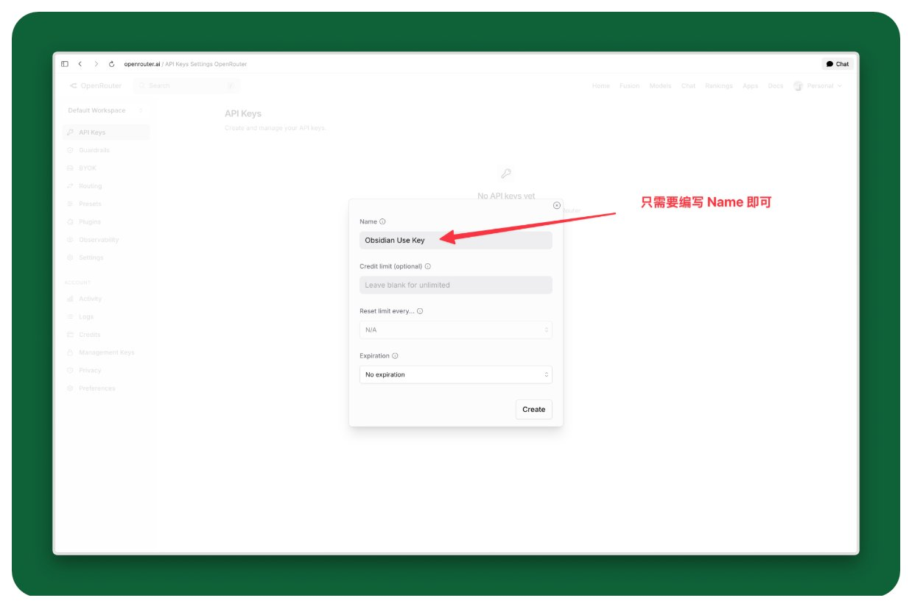

> ⚠️ API Key 只显示一次，务必保存好。丢了得重新生成。

**𝟭.𝟮 找到免费模型 Ling-2.6-1T 并复制模型 ID（新读者必看）**

❶ OpenRouter 顶部菜单点进 **Models** 页面 ❷ 搜索框输入 **ling** → 第一个结果就是 **inclusionAI: Ling-2.6-1T (free)**（标记 **Free**，输入输出都不计费） ❸ 点模型名右边的 **复制图标** → 复制下来的模型 ID 就是：

> inclusionai/ling-2.6-1t:free

> 💡 OpenRouter 上有不少免费模型，Ling-2.6-1T 是其中表现不错的一个。就算免费期结束，按当前公开价格看也属于很便宜的一档。

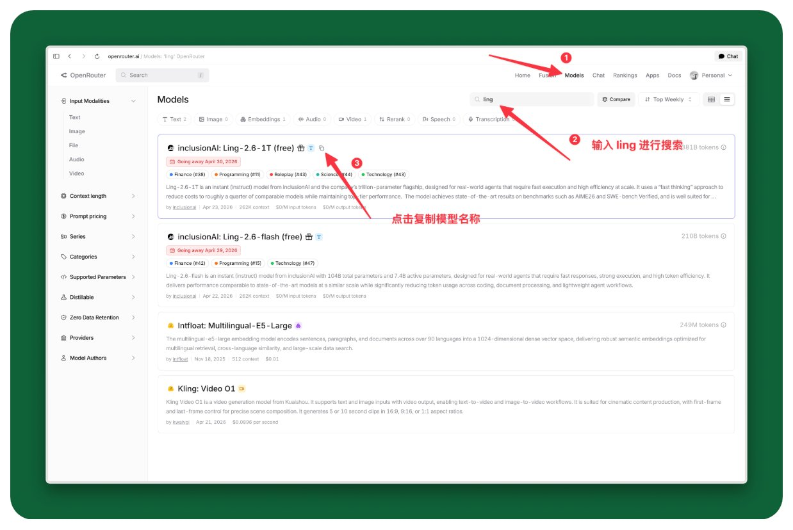

Key + 模型 ID 都拿到，进第二节开装 opencode CLI。

## 二、装 opencode CLI

opencode 是一个开源的命令行 AI 编程工具

**一句话定位：** 它是 Claude Code 和 Codex 之外的第三条独立通道，最大特点是**能挂任何 OpenAI 兼容的模型端点**，这意味着我们可以把免费模型、国产模型、自建模型，全都接进来。

**𝗦𝘁𝗲𝗽 𝟭：安装 opencode CLI**

打开终端，三选一跑下面这条命令。

**Mac / Linux 推荐用 curl 一行装：**

> curl -fsSL [https://opencode.ai/install](https://opencode.ai/install) | bash

**或者用 npm 装（前提是 Node.js 已就位）：**

> npm install -g opencode-ai

**Mac 也可以用 Homebrew：**

> brew install anomalyco/tap/opencode

**Windows** 推荐 Scoop / Chocolatey / npm 三选一，跟着 [opencode.ai](https://opencode.ai/) 首页给的命令走。

跑完看到光标重新回到 **$** 提示符，就是装好了。

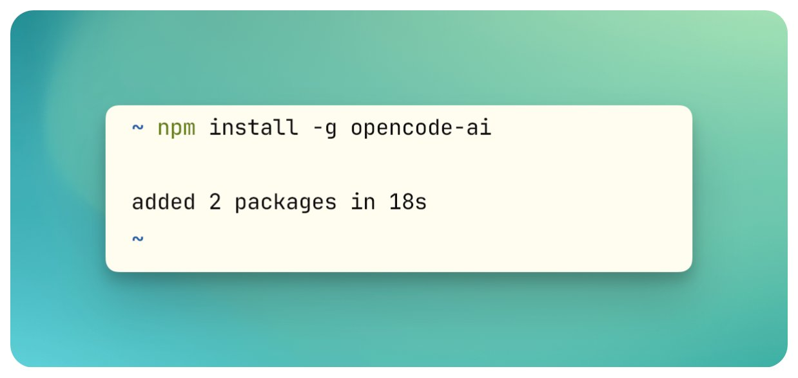

**𝗦𝘁𝗲𝗽 𝟮：首次启动初始化**

opencode 是一个 TUI（终端图形界面）工具，**第一次必须跑一遍让它生成配置目录**，不然后面 CC Switch 写配置会找不到落点。

终端跑：

> opencode

会弹出一个全屏的终端 UI 界面，顶部显示 opencode 的 logo。

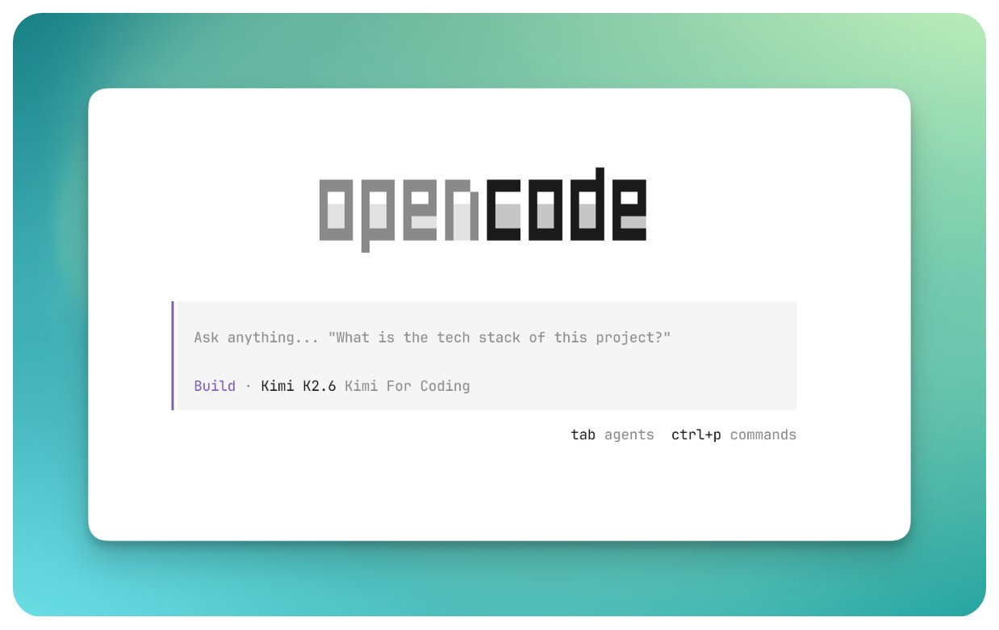

这一步**不用登录、不用配模型**，只是为了让它生成 **~/.config/opencode/** 这个目录。**直接 Ctrl+C 退出**就行。

> 💡 **为什么要先跑一次？** opencode 安装完不会自动建配置目录，要等第一次启动时才生成。CC Switch 后面要往这个目录写文件，得先有目录才行。跳过这一步，CC Switch 启用 provider 时大概率会报错。

**𝗦𝘁𝗲𝗽 𝟯：拿 opencode CLI 路径**

终端跑：

> where opencode

会输出一行路径（可能是 **/usr/local/bin/opencode** 或者 **~/.local/bin/opencode**，每个人不一样）。

**完整复制这一行**，待会要粘到 Claudian 设置里。

> ⚠️ **没输出？** 关掉终端窗口重开一个再敲（PATH 没刷新）。Linux 上 **where** 找不到改用 **which opencode**。win用户建议通过AI获取自己的opencode路径

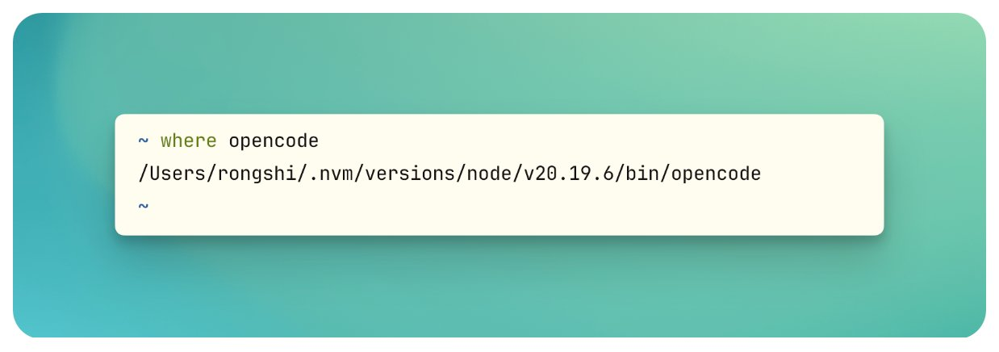

## 三、CC Switch 里配 opencode 通道

这一节是全篇核心。流程和上一篇 Claude tab 几乎一模一样，**只有一个地方要特别注意**：表单里默认会塞一堆模型行，我们要把它们全删掉，只留 Ling 这一行。Step 3 重点讲。

**𝗦𝘁𝗲𝗽 𝟭：切到「OpenCode 供应商」tab**

打开 CC Switch，**顶部 tab 栏**从左到右依次是：「Claude 供应商」「Codex 供应商」「**OpenCode 供应商**」「OpenClaw」「Gemini CLI」。

**点「OpenCode 供应商」**。

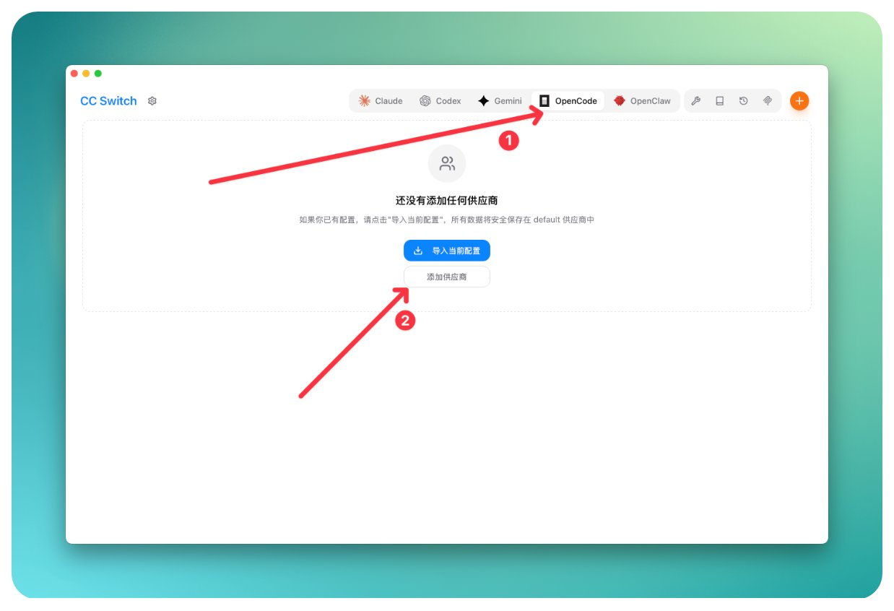

> 💡 **看不到 OpenCode tab？** CC Switch 版本太旧。去 [CC Switch Releases](https://github.com/farion1231/cc-switch/releases) 下最新版覆盖装一下。

**𝗦𝘁𝗲𝗽 𝟮：点「添加新供应商」→ 预设选 OpenRouter**

OpenCode tab 下点「**添加新供应商**」按钮。

预设列表里选 **OpenRouter**，选完后表单里的「供应商名称」「官网链接」「**接口格式**」「**Base URL**」**全部会自动填好**。

**𝗦𝘁𝗲𝗽 𝟯：按红框 ❶❷❸❹ 填 4 个东西**

进入表单后，**只需要动这 4 个地方**：

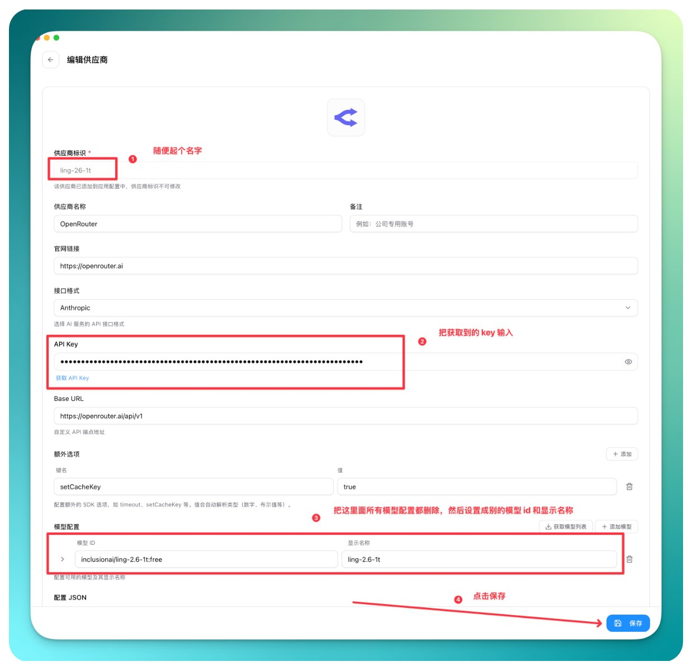

❶ **「供应商标识」字段**：随便起个名字，比如 **ling-2.6-1t**。这只是本地标识，方便以后在卡片列表里认，不影响调用。

❷ **「API Key」字段**：粘 1.1 节拿到的那把 OpenRouter Key。

> 💡 CC Switch 不会跨 tab 同步 Key。如果你上一篇已经在 Claude tab 粘过同一把 Key，**这里仍然要再粘一次**。一把 Key，每个 tab 各用各的。

❸ **「模型配置」区域**（关键步骤）：默认会塞一堆 OpenRouter 预设模型行，**全部删掉**，然后点「**+ 添加模型**」加一行：

• **模型 ID**：**inclusionai/ling-2.6-1t:free** • **显示名称**：**ling-2.6-1t**（自己看着舒服就行）

> ⚠️ **不删默认模型行，opencode 启动后会塞一长串你用不到的模型选项进来**，列表又乱又难找。教程级洁癖：只留你真正要用的那一行。

❹ **点右下角「保存」按钮**。

**𝗦𝘁𝗲𝗽 𝟰：启用 OpenRouter 卡片**

回到 OpenCode tab 主界面，能看到刚加的 **OpenRouter** 卡片，右边有「**▶** **启用**」按钮，**点它**。

**𝗦𝘁𝗲𝗽 𝟱：★ 在 opencode CLI 里先验证一遍（再去配 Claudian）**

接下来这一段**非常关键**，决定了下一节你在 Claudian 设置里能不能看到 ling 模型。

**先在 opencode CLI 里跑通一次**，让它把 OpenRouter 的模型列表加载到本地，这样下一节 Claudian 才能从同一个 opencode 实例里把模型抓出来。

打开终端跑：

> opencode

进入 opencode TUI 主界面后，**在底部输入框里输入 /models 命令**：

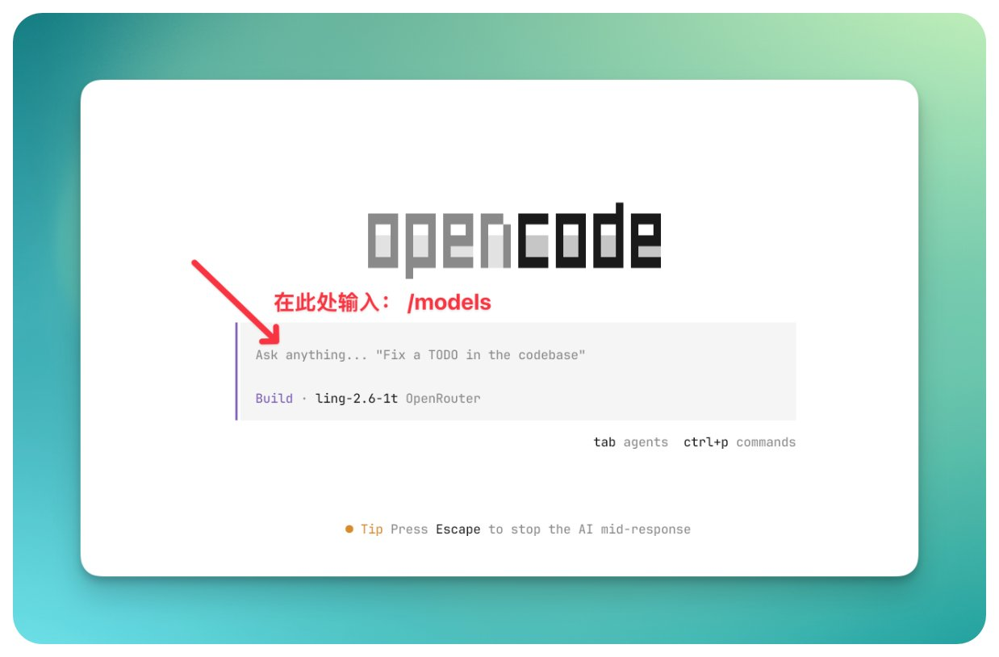

回车之后会弹出模型选择列表，**最上面 Recent 区域第一个就是刚配的 ling-2.6-1t OpenRouter**：

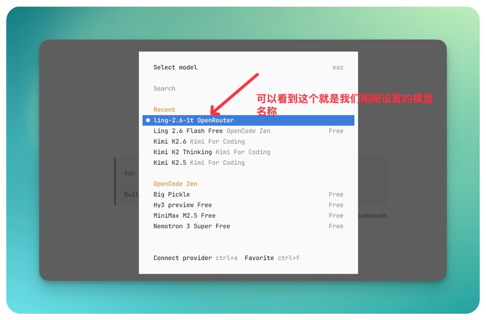

回车选中它。回到对话框，**发一句「你好，你是什么模型」**：

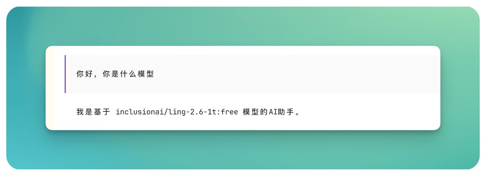

只要正常回答就证明 **opencode CLI 通道打通**了。

> ⚠️ **这一步搞完，opencode 这个终端窗口先放着不要关。** 下一节 Claudian 加载模型列表会从同一个 opencode 进程里读，提前关掉的话 Claudian 设置里的 Models 区域可能拉不到 ling。

## 四、把 opencode 接入 Claudian

CC Switch 那边搞定，opencode CLI 自己已经能跑了。但还要把它接进 Claudian，左下角才会出现 OPENCODE 这一组。

**𝗦𝘁𝗲𝗽 𝟭：打开 Claudian 设置 → Opencode tab**

回到 Obsidian → 左下角齿轮 ⚙️ → 左侧菜单滑到底找到 **Claudian** → 点进去。

进入 Claudian 设置后，**留意顶部 tab**：「通用」「Claude」「Codex」「**Opencode**」。**切到「Opencode」tab**。

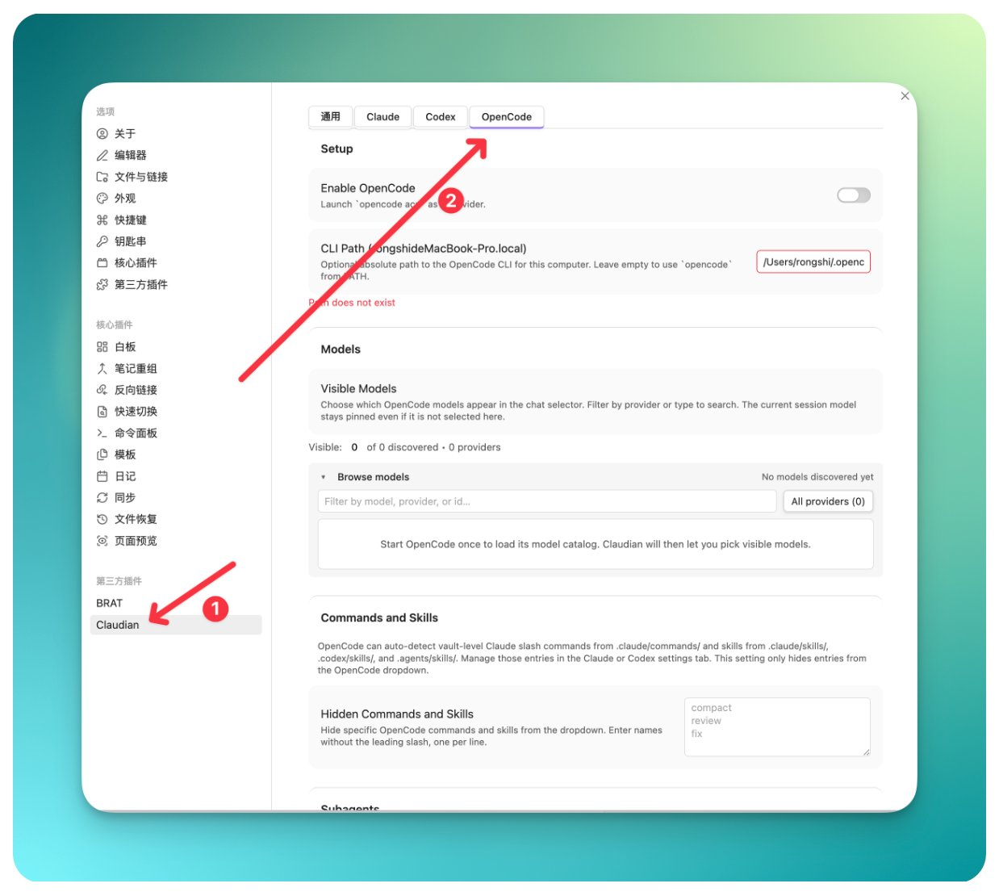

> ⚠️ **没看到 Opencode tab？** Claudian 版本太旧。回第一节末尾按提示更新一下。

**𝗦𝘁𝗲𝗽 𝟮：按红框 ❷❸❹ 三步配好 Opencode tab**

进入 Opencode tab 后，**只需要按截图里 ❷❸❹ 顺序操作**：

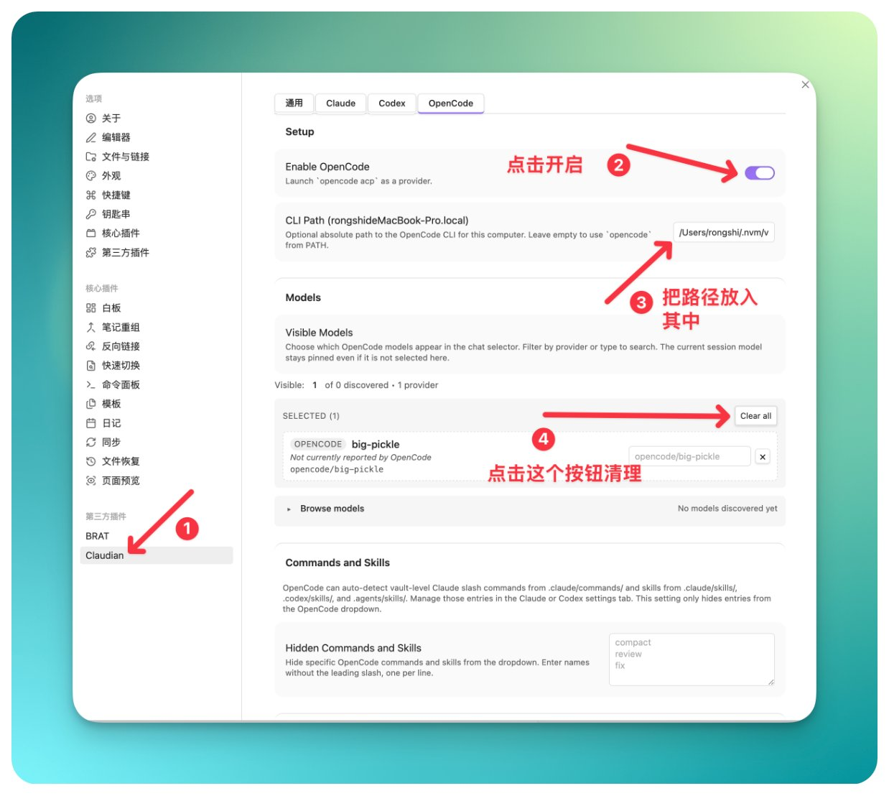

❷ **点开「Enable OpenCode」开关**：默认是关的，打开后 opencode 才会被注册成 provider。

> ⚠️ **这一步不打开，opencode 永远不会出现在左下角切换菜单里。** 和 Codex 一样，这是总闸。99% 的「下拉里看不到 OPENCODE 组」都是这里没开。

❸ **「CLI Path」字段**：把第二节 Step 3 复制的 opencode 路径**完整粘进去**。

❹ **拉到「Visible Models」区域 → 点右上角「Clear all」按钮**：默认会预选一个 **OPENCODE ZEN big-pickle** 在那占位，**清掉它**。不清的话，左下角下拉里 OPENCODE 组只会出现这个占位模型，看不到我们刚配的 ling。

页面下面其他选项**全部保持默认**即可。

**𝗦𝘁𝗲𝗽 𝟯：第一次验证，左下角下拉先看 OPENCODE 组出来没**

回到 Obsidian 主界面，点左侧 🤖 图标打开 Claudian 主面板 → **左下角模型选择器**点一下。

下拉菜单里现在应该出现**第三组 OPENCODE**：

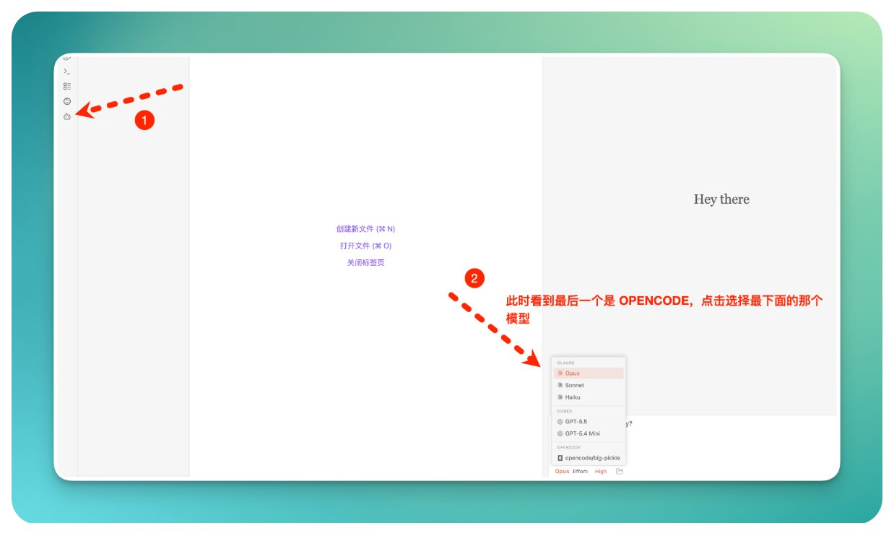

> ⚠️ **下拉里只有 CLAUDE / CODEX 两组，没出现 OPENCODE？检查 Step 2 ❷ 那个开关是不是打开了 检查 Step 2 ❸ CLI Path 是不是粘对了 关闭 Obsidian 之后重新启动 在 Claudian 中新建一个对话框**（旧对话框不会刷新模型列表）

**注意：** 这一步 OPENCODE 组下面可能**还看不到 ling-2.6-1t**，只有一个默认占位项。这是正常的。Claudian 加载模型有点延迟，第一次进设置时列表还没完全同步，得先去主面板「唤醒」一下，再回设置就能看到 ling 了。下一步去解决。

**𝗦𝘁𝗲𝗽 𝟰：回 Claudian 设置，把 ling 模型勾上**

回到 Obsidian 设置 → Claudian → Opencode tab → 拉到「**Visible Models**」区域。

**这次你会发现，模型列表里多了一长串可选项**：OpenCode Zen 默认那一串，加上**最下面 OPENROUTER 那一行 ling-2.6-1t**：

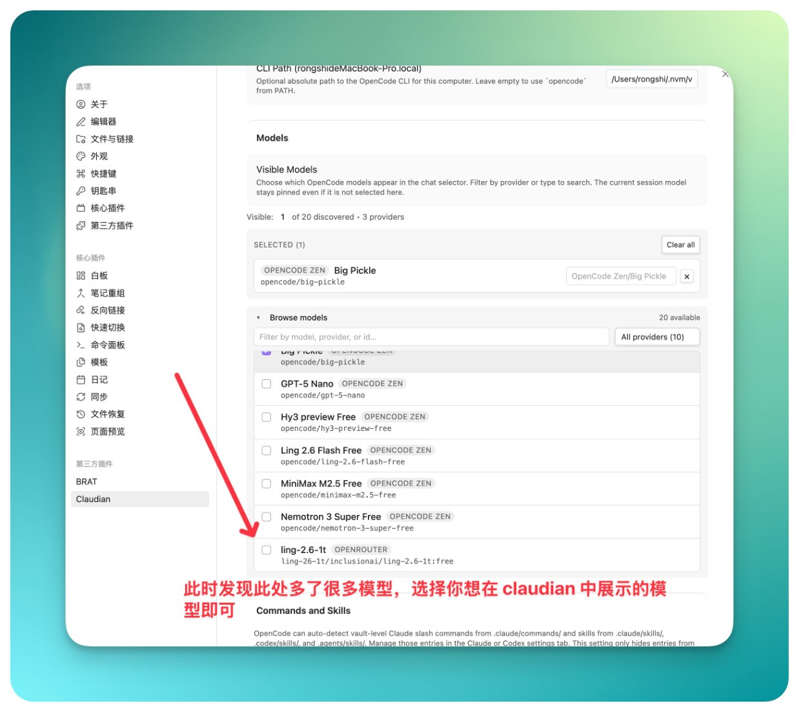

这是因为我们刚才在第三节 Step 5 跑 opencode CLI 拉过 **/models** 列表，Claudian 现在能从 opencode 进程里读到这些模型了。

**勾选 OPENROUTER ling-2.6-1t**（其他你看着想用的也可以勾，不想用的就别勾）。

**𝗦𝘁𝗲𝗽 𝟱：第二次验证，这次能切到 ling 了**

再次打开 Claudian 主面板，**左下角下拉点开**：

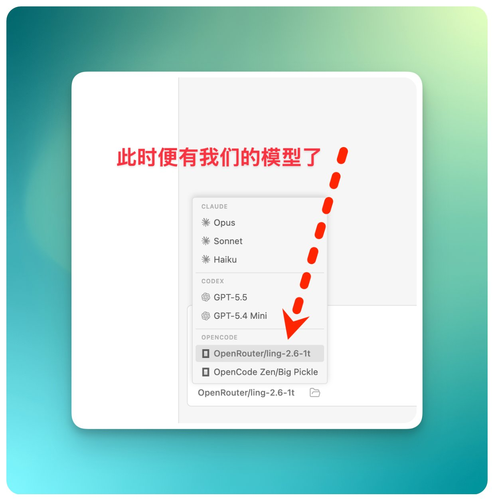

OPENCODE 组下面现在应该出现 **OpenRouter/ling-2.6-1t**。**点它切过去**，发一句「**你好，你是什么模型**」：

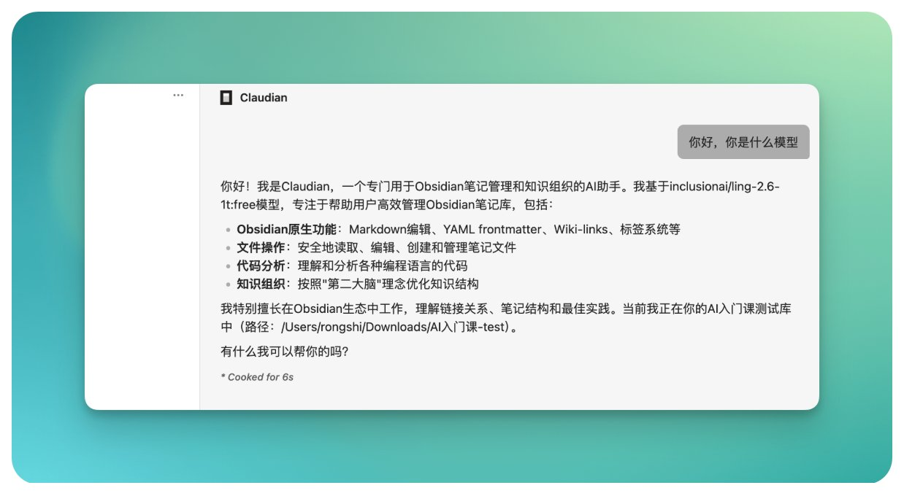

只要回答里包含 **inclusionai/ling-2.6-1t:free**，**Claudian × opencode 通道全线打通，三模型架构完成**。

## 五、三模型切换：左下角一键选

到这一步，**Claudian 对话框左下角的模型选择器**点一下，下拉菜单里会出现**三组模型**：

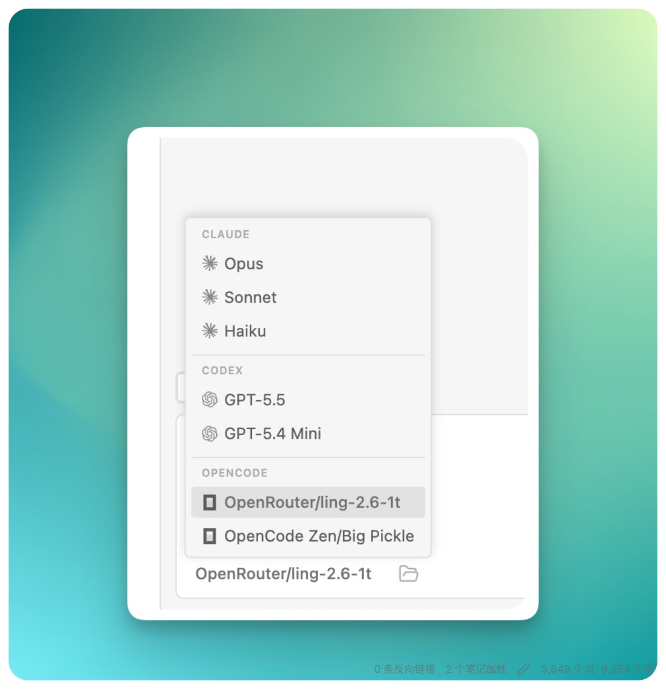

• **CLAUDE 组**：Opus / Sonnet / Haiku，你已订阅的官方 Claude 或者中转站，写作、思考、复杂推理 • **CODEX 组**：GPT-5.5 / GPT-5.4 Mini，ChatGPT 账号，通用编程、对话 • **OPENCODE 组**：opencode（底下跑 Ling 免费模型），日常杂活、备份通道、不烧美元

**关键体感：三条通道的对话历史完全隔离。** 你切到 CLAUDE 组聊到一半，再切到 OPENCODE 组开新对话，两边历史互不干扰。等你回来 CLAUDE 那边的上下文还在原地。

> 💡 **怎么决定哪条用哪个？** 我自己的用法：• **写文章 / 整理思路** → CLAUDE Sonnet（语感好） • **写代码 / 改 bug** → CODEX GPT-5（编程稳） • **总结链接 / 翻译 / 杂活** → OPENCODE Ling（免费，跑个轻活儿不心疼）

未来想给 OPENCODE 这条通道**换个国产模型**？回 CC Switch 的 OpenCode tab，把模型字段从 Ling 改成 DeepSeek / Kimi / 智谱 GLM 任意一家就行。**Claudian 这边一行都不用动。**

这就是三通道架构的真正价值。**通道是稳定的，模型是可替换的。**

## 写在最后

到这一步，你的 Obsidian 已经同时挂上了 **Claude / Codex / opencode 三条 AI 通道**，目前 Claudian 支持的所有通道都挂齐了。

每条通道挂自己最适合的模型，已订阅的不浪费，不烧钱的随便用。

---

> 来源：飞书 · AI Spark 知识库 ｜ 原文（最新版）：<https://lcnniolukk80.feishu.cn/wiki/WECkwsrDmiDYHoktwFSc3aDhnib> ｜ 归档：2026-06-04
