# Codex 移动端配置，保姆级教程带你 5 分钟搞定

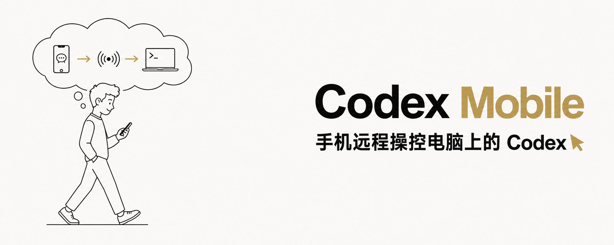

🔥首发！codex 移动端连接配置保姆级教程奉上 今天 Codex 上线了移动端远程控制功能，我第一时间配好试了一下，人不在电脑前，手机也能给 Codex 下指令、看结果、接着之前的对话继续聊。

配置流程不复杂，但步骤比较多。我走了一遍完整流程，15 张截图全记下来了，跟着做就行。

总共分三大块：

- 更新客户端，2 分钟
- 开启 MFA 安全验证，2 分钟
- 手机授权绑定，1 分钟

## 准备工作

开始之前，确认你有这些东西：

- 一台装了 ChatGPT 桌面客户端的 **Mac**（Windows 版暂不支持，官方标注 Coming Soon）
- ChatGPT Plus / Pro / Team 账号（需要有 Codex 权限）
- 手机上装好 ChatGPT App（需更新到最新版）
- 一个验证器应用（Google Authenticator、1Password 等都行）

## 操作流程

## 1️⃣ 更新 Codex 桌面客户端

打开 Codex 桌面端，点击左上角菜单，右上角会有一个蓝色的「更新」按钮。点它，等更新完。

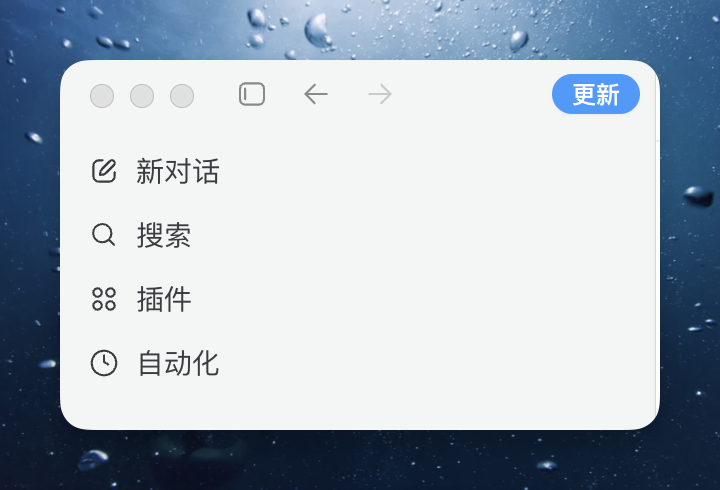

更新前菜单里只有「新对话」「搜索」「插件」「自动化」四个选项，看不到「设置 Codex 移动版」。更新后才会出现。

## 2️⃣ 进入「设置 Codex 移动版」

更新完重新打开左上角菜单，多了一个「设置 Codex 移动版」。点进去。

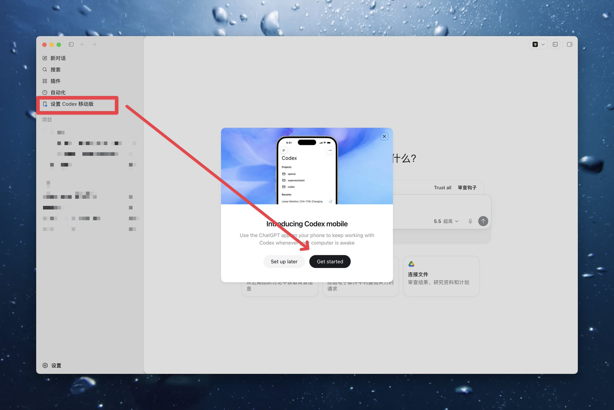

会弹出一个「Introducing Codex mobile」的介绍弹窗，点「Get started」。

## 3️⃣ 功能说明页

进来之后会展示 Codex 移动版的三个能力：

- **Pick up where you left off**，手机上继续电脑的 Codex 对话
- **Stay in the loop**，Codex 完成任务时手机收到通知
- **Start something new**，直接从手机发消息让电脑上的 Codex 开始工作

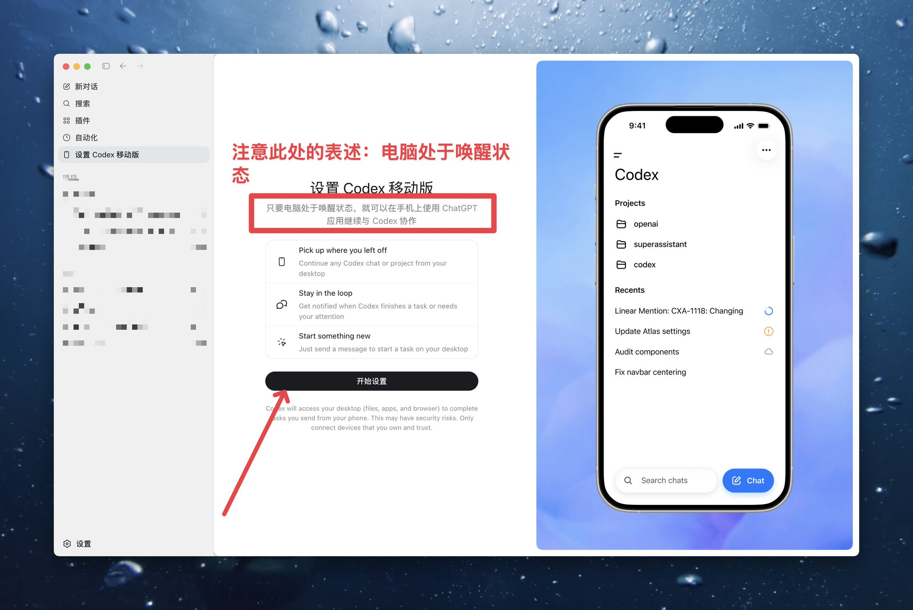

⚠️ 注意页面顶部那行字：**电脑必须处于唤醒状态**。电脑睡眠了手机就连不上，这个后面还会提到。

点「开始设置」继续。

## 4️⃣ 开启多重身份验证（MFA）

> 💡 如果你之前已经为 ChatGPT 账户开启过 MFA，这一步会自动跳过，直接到第 7 步。没开过的才会看到下面的流程。

这是 OpenAI 为远程控制功能设的安全门槛，必须开。

页面提示「启用多重身份验证」，点「前往 [chatgpt.com](https://chatgpt.com/) 继续」，浏览器会自动打开。

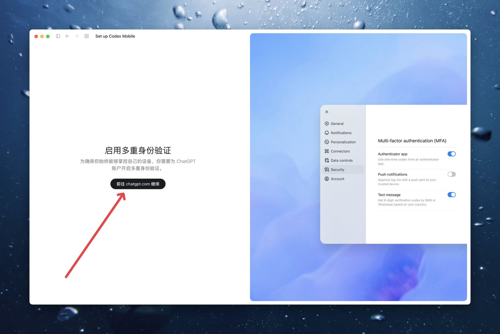

## 5️⃣ 在网页端配置 MFA

浏览器打开 ChatGPT 设置页面，进入「安全」选项卡。

找到「多因素身份验证 (MFA)」区域，把 Authenticator app（验证器应用）右边的开关打开。

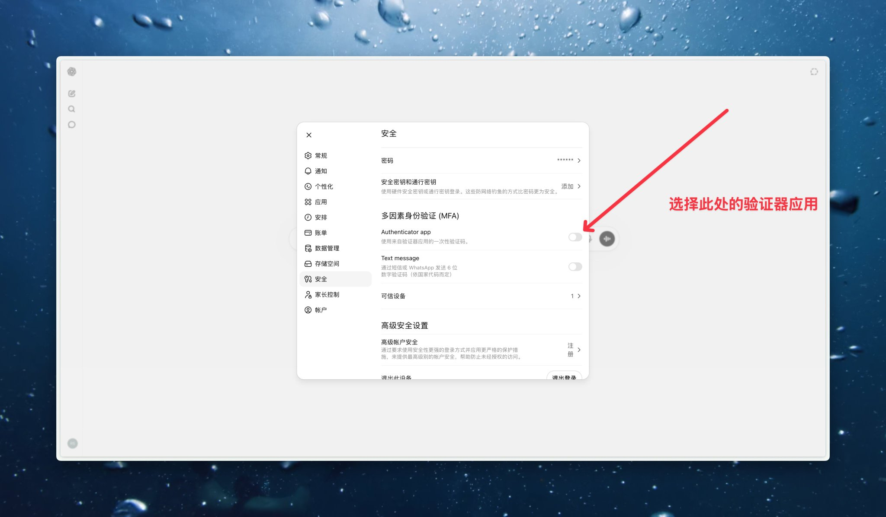

## 6️⃣ 绑定验证器应用

开关打开后弹出「关联验证器应用」窗口，两步搞定：

**❶ 扫码** 打开手机上的 Google Authenticator（或其他验证器），点右下角加号，扫页面上的二维码。

**❷ 填验证码** 扫完之后验证器会生成一个 6 位数字，填回网页的输入框，点确认。

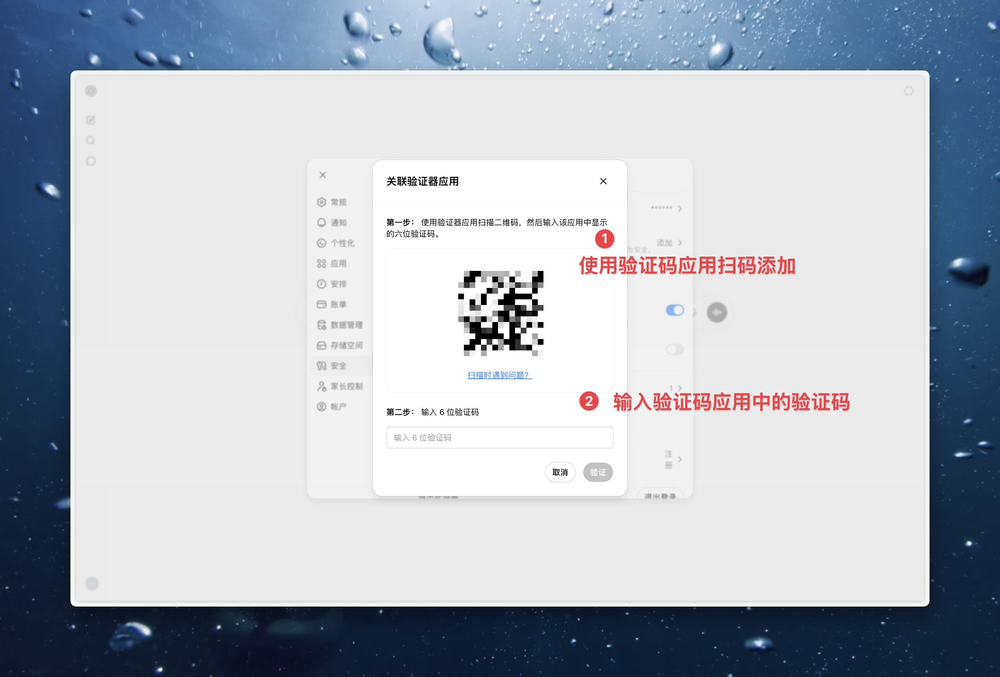

手机上找到刚添加的 OpenAI 条目，把验证码填回去就行。

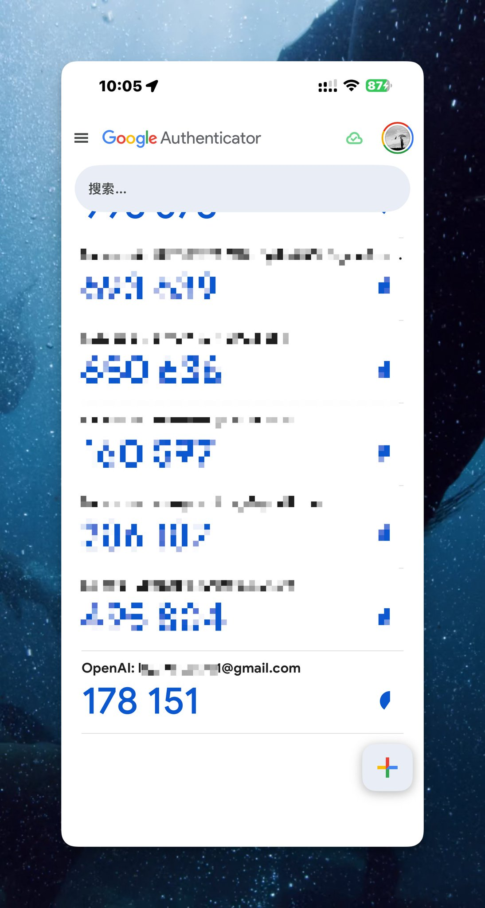

## 7️⃣ 手机端更新 ChatGPT 并授权

先去应用商店把手机上的 ChatGPT App 更新到最新版。这步别跳，旧版本看不到 Codex 入口。

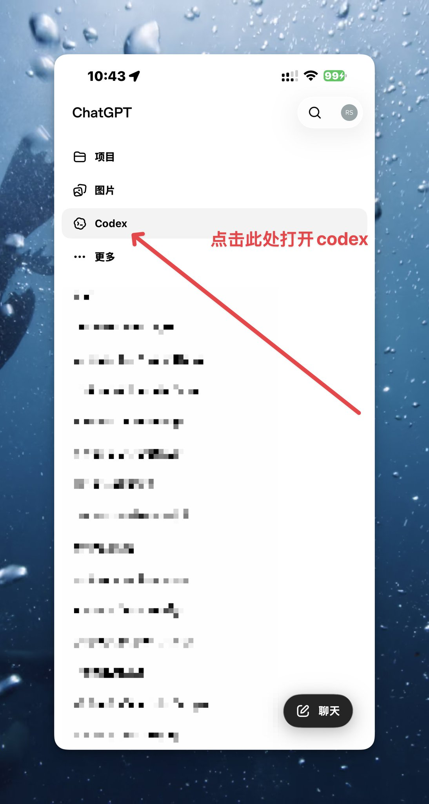

更新完打开 App，侧边栏会多一个「Codex」入口，点进去。

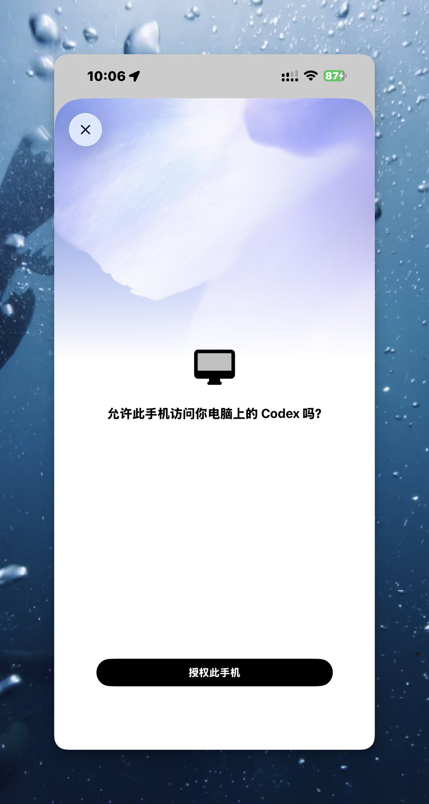

手机端弹出授权页面：「允许此手机访问你电脑上的 Codex 吗？」点「授权此手机」。

授权完成后你会看到 Codex 的主界面，顶部显示你电脑的名称，说明连上了。

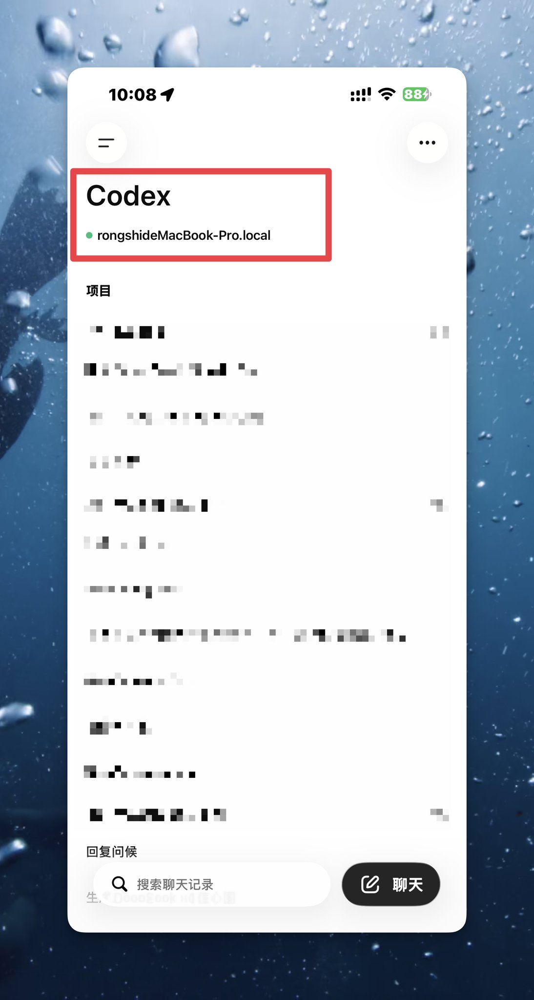

## 8️⃣ 电脑端确认允许

回到电脑，会弹出「允许您的手机控制这台电脑」的确认页面。

点「允许」。

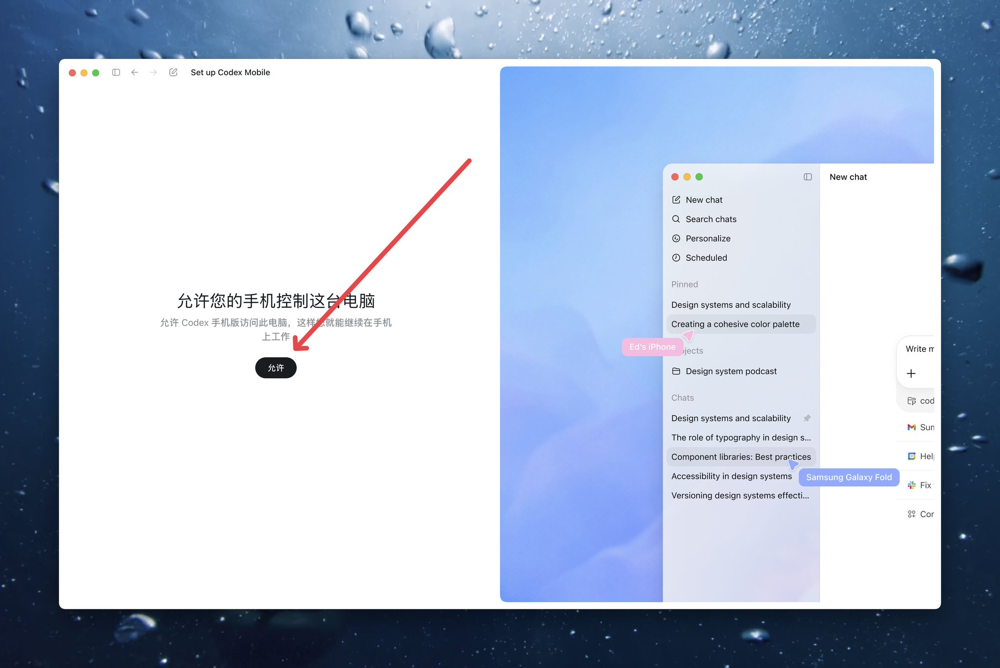

## 9️⃣ 配置完成，选择附加功能

看到「已连接」就说明搞定了。

页面列了三个附加选项，按需开启：

**❶ 让电脑保持唤醒状态** 想远程操作的话，这项必须打开。不然电脑自动休眠了手机就断了。

**❷ 启用 Computer Use** 让 Codex 用鼠标和键盘操作你 Mac 上的应用。相当于手机远程操作电脑桌面。

**❸ 安装 Chrome 扩展程序** 让 Codex 能操作浏览器页面内容。装了之后手机可以通过 Codex 控制浏览器。

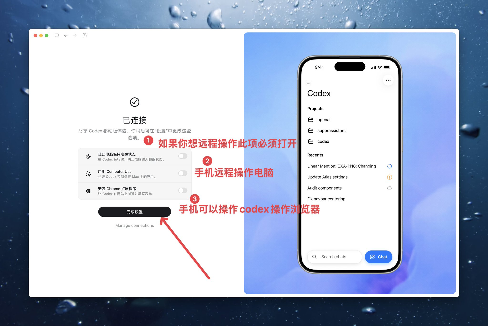

点「完成设置」。

## 🔟 实际使用

打开手机 ChatGPT App，进入 Codex，顶部显示已连接的电脑名称（比如 rongshideMacBook-Pro.local）。

直接发消息试试。我发了一句「你好 你在哪」，电脑上的 Codex 回复了工作区路径，双向通信正常。

**手机端：**

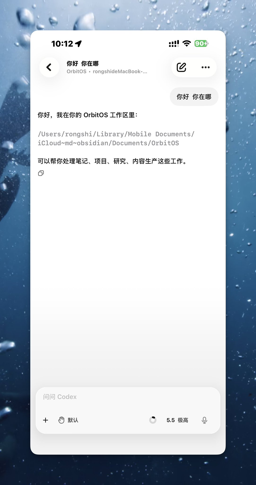

**电脑端同步显示：**

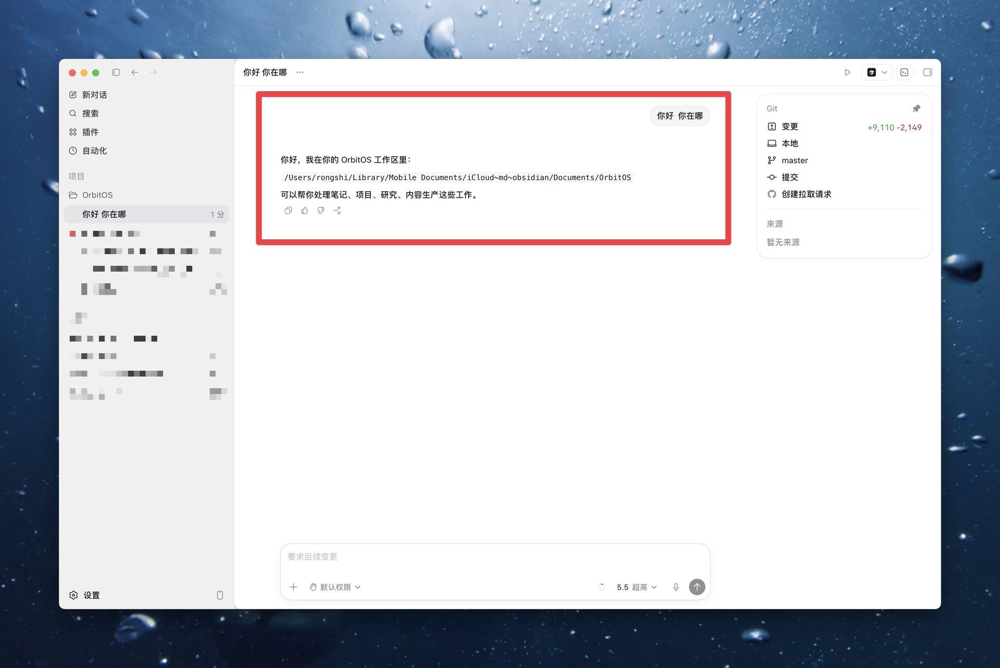

手机发的消息电脑实时同步，反过来也一样。

## 小结

整个流程 5 分钟左右，核心就三件事：

❶ 更新桌面端 + 手机端到最新版 ❷ 开启 MFA（已开过的自动跳过） ❸ 手机授权 + 电脑确认

配完之后，只要电脑保持唤醒，你随时能用手机远程操控 Codex。

⚠️ 几个注意点：

- 电脑睡眠了手机就连不上，建议开「保持唤醒」
- MFA 是强制的，没开过就得配一下
- 手机 App 必须最新版才能看到 Codex 入口

## 补充：扫码快捷连接

配好之后如果你要连新手机，或者重新绑定，有个更快的入口：

Codex 桌面端**左下角**有个手机图标，点一下会弹出二维码（区分 iOS 和 Android）。用手机自带扫码功能扫一下，自动打开 ChatGPT App 引导授权，省去在 App 里找入口的步骤。

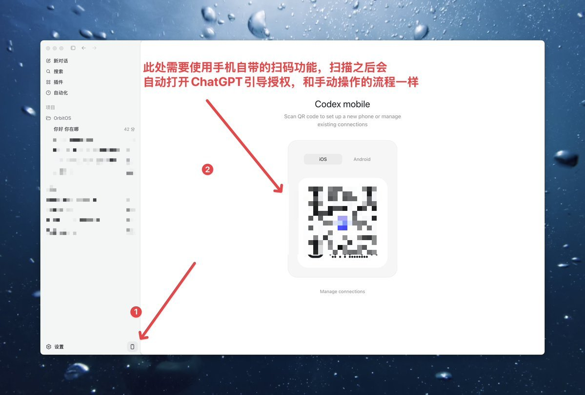

---

> 来源：飞书 · AI Spark 知识库 ｜ 原文（最新版）：<https://lcnniolukk80.feishu.cn/wiki/E17KwdJNriVFKNkd48qcNEaznAd> ｜ 归档：2026-06-04
