# Codex 重新登录总弹手机号验证？我用 Cockpit Tools 把账号本地管起来

如果你最近重新登录 Codex，经常遇到手机号认证，那这篇教程你一定要看一下。

我开始用 Cockpit Tools，主要就是为了解决这个问题。

现在 ChatGPT / Codex 的账号风控比以前更敏感，有时候只是重新登录一下，就会弹出手机号验证。对经常切账号、换环境、用多个 AI 编程工具的人来说，这件事非常烦。

所以我的思路很简单：能不反复重新登录，就尽量不重新登录。把 Codex 账号在本地管理起来，需要的时候直接切换，这样更稳，也更省心。

Cockpit Tools 就是用来做这件事的。

## 1. Cockpit Tools 是什么？

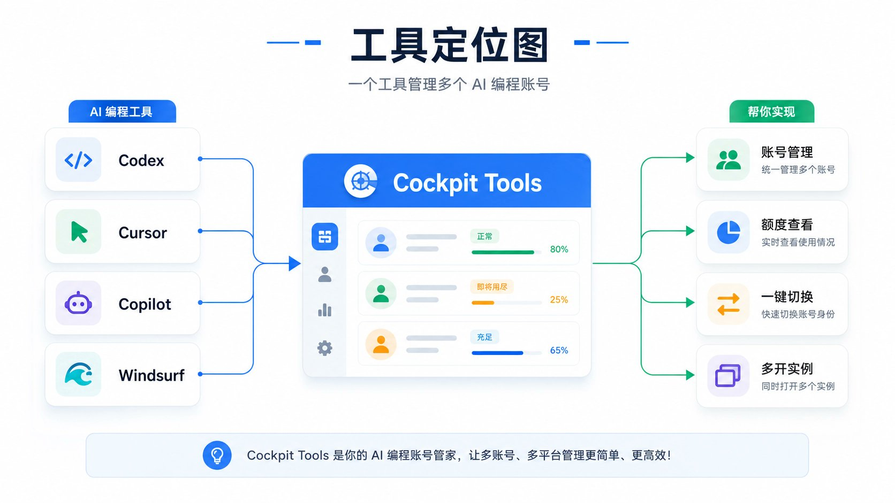

Cockpit Tools 是一个 AI 编程账号管理工具。

你可以把它理解成一个“AI 编程账号管家”。

它可以帮你统一管理 Codex、Cursor、GitHub Copilot、Windsurf、Kiro、Gemini CLI 等工具的账号。平时你不需要在每个工具里反复登录、退出、再登录，而是把账号集中放在一个地方管理。

它主要能做这些事：

- 管理多个账号
- 查看账号额度
- 一键切换账号
- 同时打开多个工具窗口
- 管理不同工具的登录状态

对我来说，最实用的点就是：把 Codex 账号本地管理起来，减少反复登录带来的手机号验证风险。

如果你只有一个账号，也很少切换工具，那它对你的价值可能没那么大。可如果你经常用 Codex、Cursor、Copilot、Windsurf，或者手里有多个账号需要切换，这个工具会很省事。

## 2. 下载地址

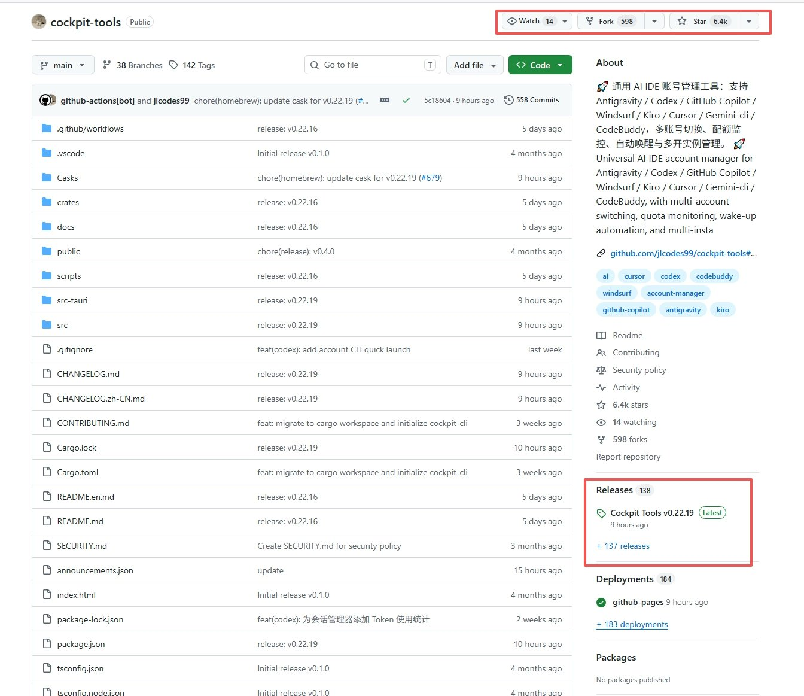

官方 GitHub 地址：

[https://github.com/jlcodes99/cockpit-tools](https://github.com/jlcodes99/cockpit-tools)

下载页面：

[https://github.com/jlcodes99/cockpit-tools/releases](https://github.com/jlcodes99/cockpit-tools/releases)

我核对时，最新版是 **v0.22.19，发布时间是 2026-05-05**。

这里提醒一句：一定要从官方 GitHub 下载。这个工具会接触账号登录信息，别用别人转发的安装包。

## 3. Windows 怎么下载？

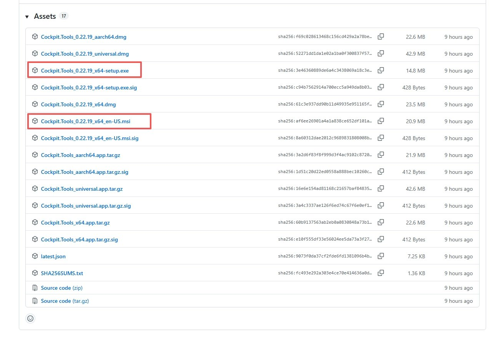

打开下载页面后，找到最新版本。

Windows 用户一般下载这两个里面的一个：

[Cockpit.Tools](https://cockpit.tools/)**_xxx_x64_en-US.msi**

或者：

[Cockpit.Tools](https://cockpit.tools/)**_xxx_x64-setup.exe**

普通用户建议优先选 .msi，安装过程更省心。

下载后双击安装，一路下一步就可以。

## 4. macOS 怎么下载？

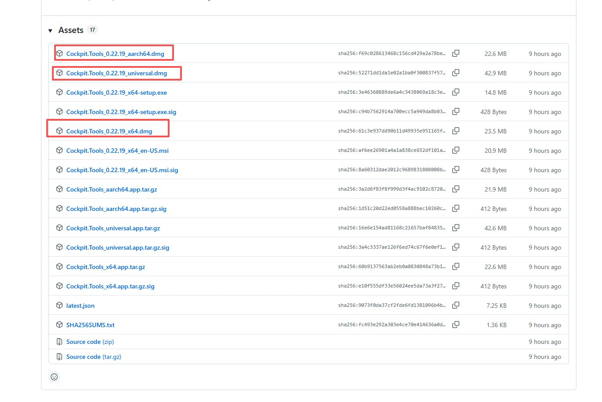

macOS 用户下载 .dmg 文件。

如果你不确定自己的电脑是 Intel 芯片还是 Apple Silicon，可以下载：

**universal.dmg**

这个兼容性更好。

下载后打开 .dmg，把 Cockpit Tools 拖到应用程序里就可以。

## 5. 第一次打开，先别急着导入所有账号

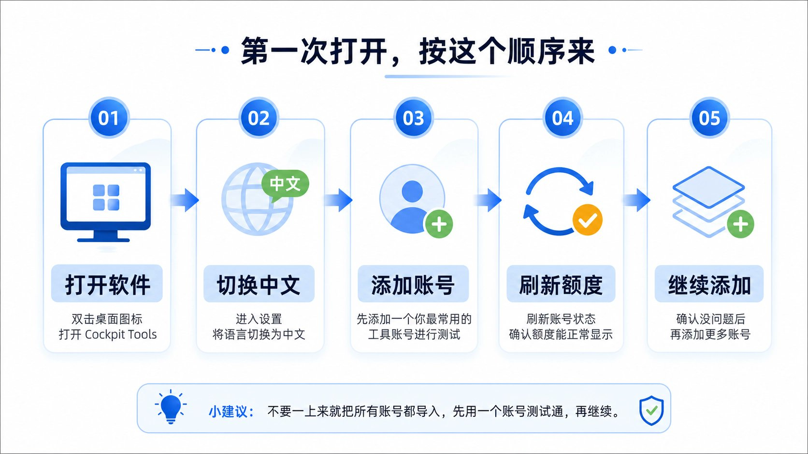

打开 Cockpit Tools 后，建议先慢一点。

别一上来就把所有账号都导进去。账号管理工具最怕一开始操作太多，最后你自己也分不清哪个账号是什么状态。

推荐按这个顺序来：

1. 先打开设置，看语言能不能切成中文
2. 看首页有没有正常显示
3. 先只添加一个你最常用的 Codex 账号
4. 确认能读取账号状态和额度
5. 确认切换正常后，再添加其他账号

先用一个账号跑通，再继续加第二个、第三个。

这样最稳。

## 6. 怎么用它管理 Codex？

进入 Codex 相关页面后，你主要会用到几个动作：导入账号、查看额度、切换账号、管理实例、查看历史会话。

如果你的核心诉求和我一样，是为了减少 Codex 反复登录，那这一节最重要。

先点击添加按钮，导入 Codex 账号。

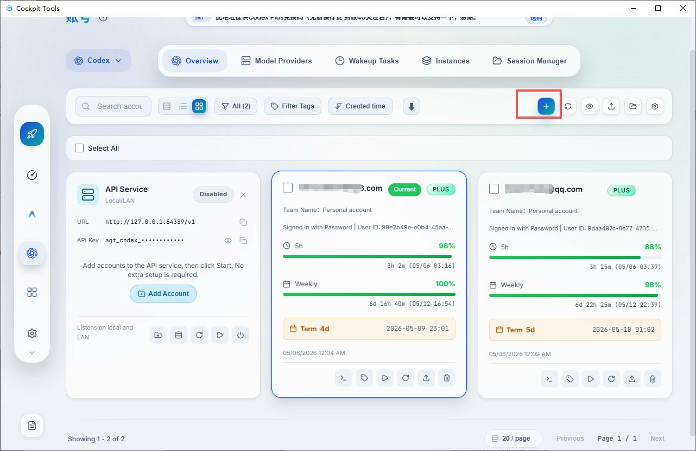

导入方式一般有两种：auth 认证和本地导入。

第一次添加账号时，可以先用 auth 认证方式。点击添加后，把生成的链接复制到浏览器里完成认证。

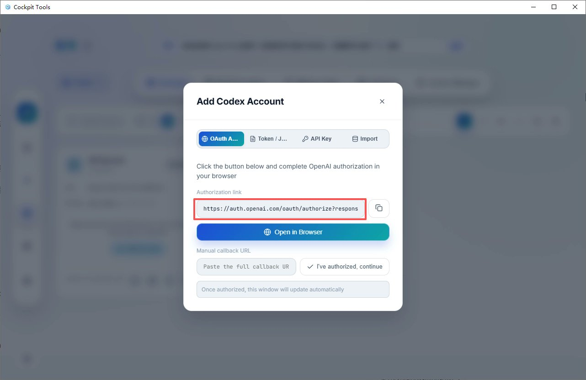

页面提示授权成功后，回到 Cockpit Tools，就能看到账号信息了。

如果你本地已经有 Codex 的认证信息，也可以用本地加载。直接点击加载按钮，把本地认证信息导入进来。

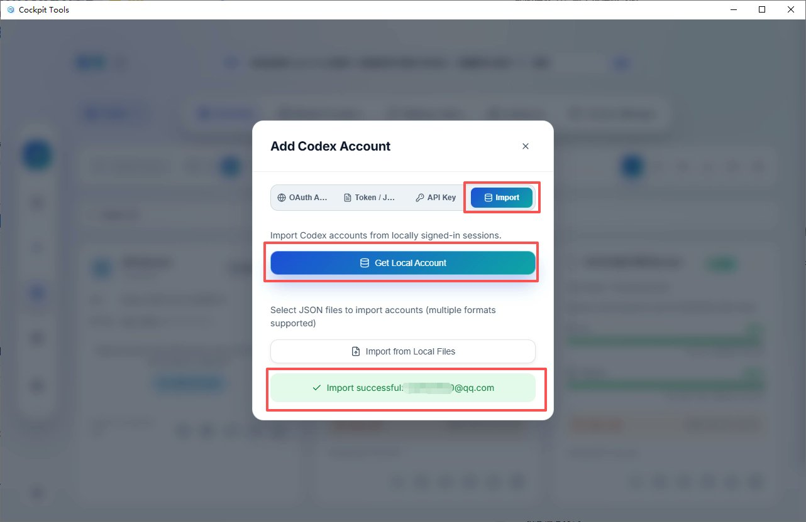

导入成功后，可以查看账号套餐和额度。

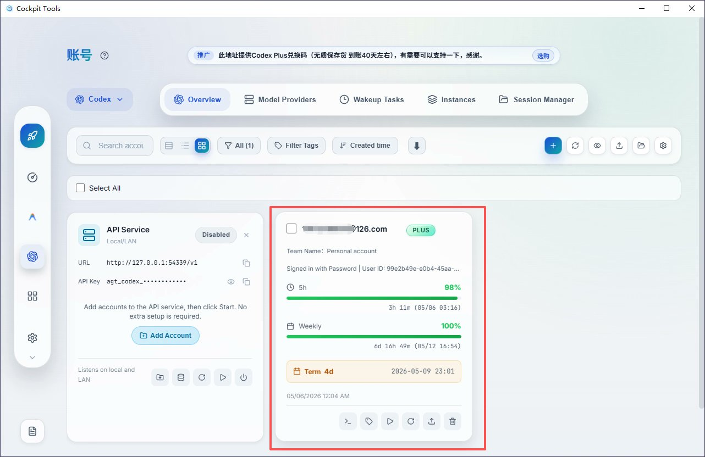

这一步很关键。你至少要确认两件事：

- 账号状态能正常显示
- 额度信息能正常读取

确认没问题后，再去测试切换账号。

切换时，建议先关闭 Codex，再在 Cockpit Tools 里点击切换按钮。切换完成后，重新打开 Codex。

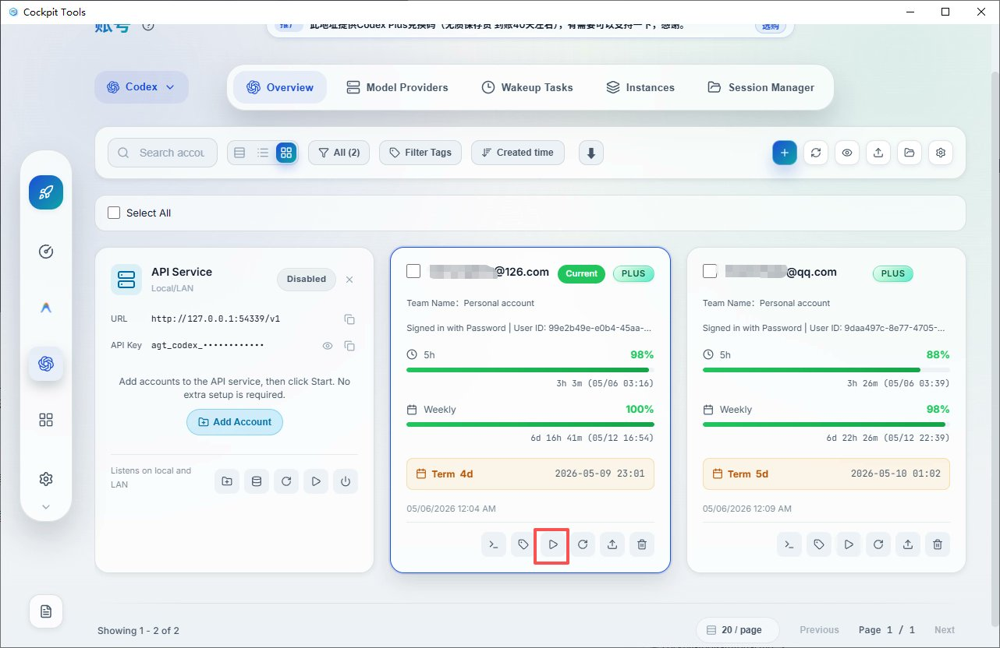

我不建议在 Codex 正在运行的时候频繁切号。这样更容易出现状态没刷新、切换不生效、甚至报错的问题。

如果你用的是 macOS，还可以尝试管理多个 Codex 实例。目前这个功能主要支持 macOS。

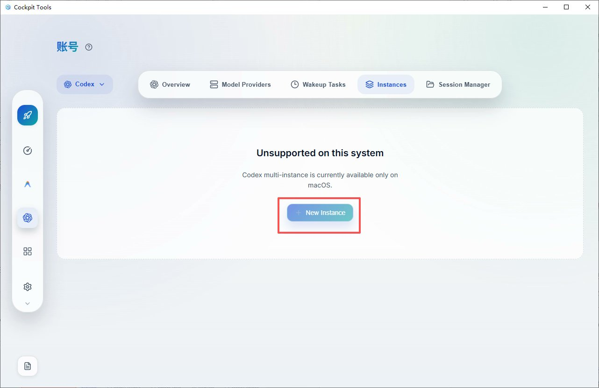

另外，它也能管理历史会话。

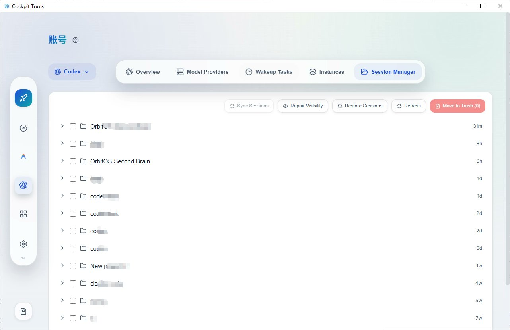

这一套跑通以后，你就可以把常用 Codex 账号放在本地管理。以后需要切换账号时，直接从 Cockpit Tools 里切，尽量少走重新登录流程。

## 7. 怎么用它管理 Cursor / Windsurf / Copilot？

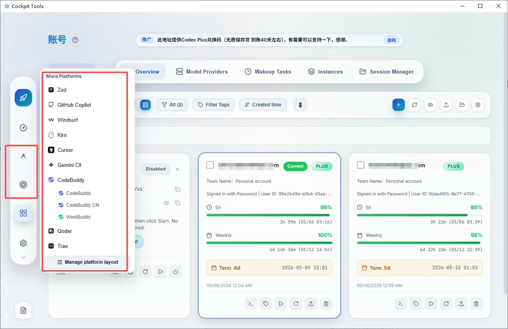

其他工具的思路也差不多。

这里以反重力为例。

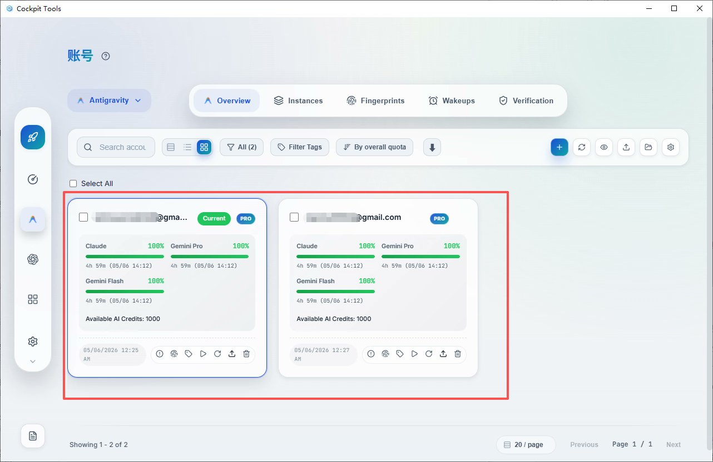

大致流程是：

1. 进入对应工具页面
2. 导入账号
3. 刷新账号状态
4. 查看额度是否正常
5. 需要时点击切换账号

不同工具支持的功能不完全一样。有些支持多开，有些只支持账号切换或额度查看。

所以不要把它当成所有工具都完全一致的万能入口。更稳的做法是：先把你最常用的工具接上，再慢慢扩展。

## 8. 使用前一定要注意安全问题

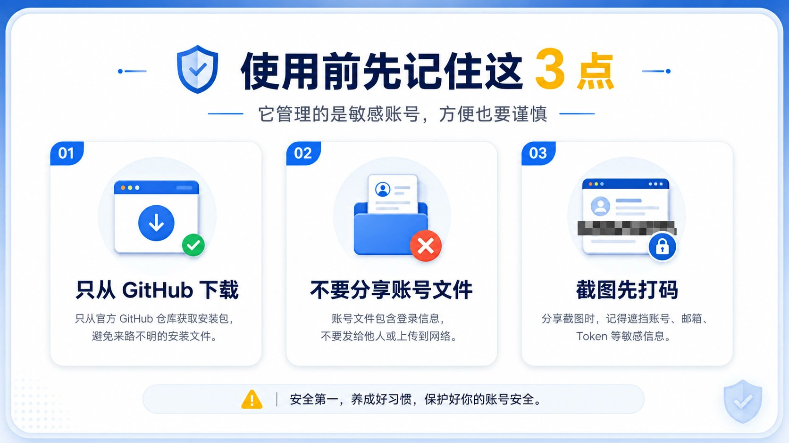

这个工具很方便，但它管理的是账号登录信息，所以安全问题一定要放在前面。

我建议记住这几条：

- 只从官方 GitHub 下载
- 不要下载别人转发的安装包
- 不要把导出的账号文件发给别人
- 不要在不信任的电脑上导入账号
- 不懂的功能先别乱开，尤其是账号导入、导出、本地服务相关功能
- 截图发出来之前，记得把邮箱、token、账号名等敏感信息打码

一句话：它能帮你少折腾登录，但账号安全还是要自己守住。

## 9. 常见问题

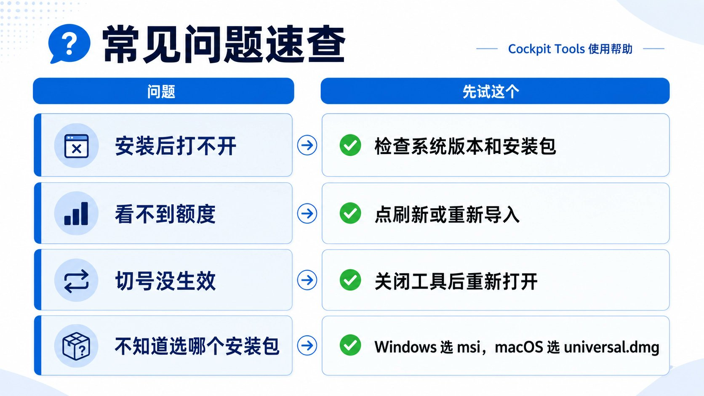

## 安装后打不开怎么办？

先确认下载的是适合自己系统的版本。

Windows 用 .msi 或 .exe。 macOS 用 .dmg。

如果 macOS 提示无法打开，可以到系统设置里的安全选项允许打开。

## 看不到额度怎么办？

可能是账号没有登录好，也可能是对应平台接口暂时读取失败。

可以先点刷新，再等一会儿。如果还是不行，重新导入账号。

## 切号后工具没变化怎么办？

先彻底关闭对应的 AI 编程工具，再用 Cockpit Tools 切换账号，然后重新打开工具。

有些工具需要重启后才会生效。

## 为什么我切换 Codex 前建议先关闭 Codex？

因为 Codex 正在运行时，账号状态可能还停留在旧会话里。

先关闭，再切换，再重新打开，成功率更高，也更不容易报错。

## 能不能用来管理所有 AI 工具？

不能。

它支持很多主流工具，但不是所有工具都支持。具体以 GitHub 页面写的为准。

## 10. 我建议的使用方式

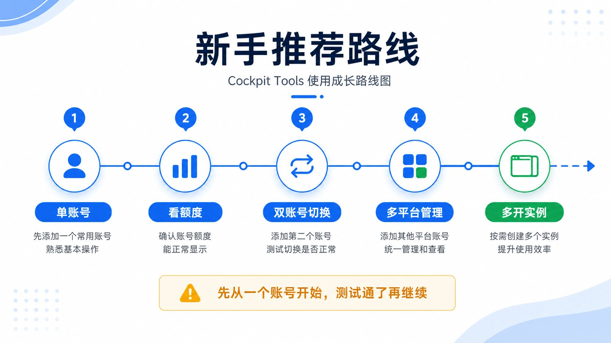

新手别一开始就追求复杂玩法。

我的建议是：

第一步：只管理一个 Codex 或 Cursor 账号。 第二步：确认账号状态和额度能正常显示。 第三步：再添加第二个账号，测试切换。 第四步：熟悉后再尝试多工具管理。 第五步：真的需要时，再研究多开实例。

这样最稳。

尤其是 Codex 账号，别频繁登录退出。能本地管理就本地管理，能少触发一次验证，就少一次麻烦。

## 11. 总结

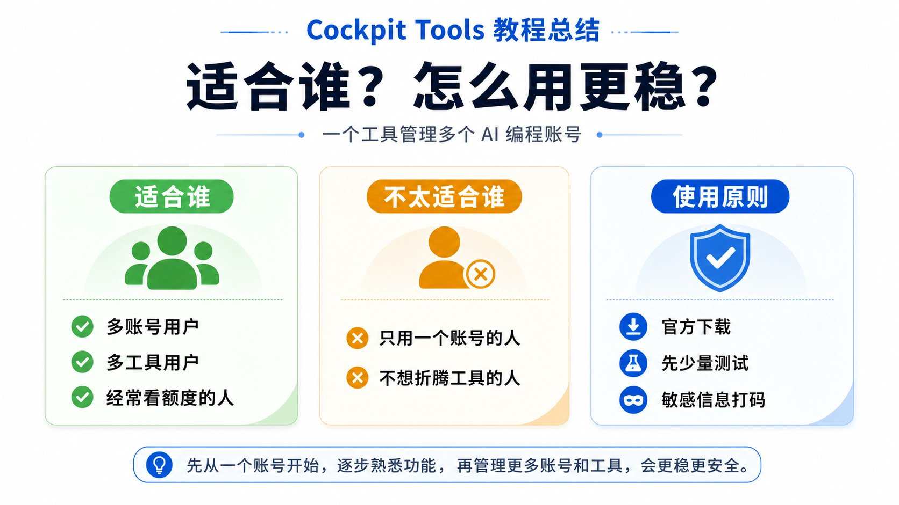

Cockpit Tools 最适合三类人：

- 经常用多个 AI 编程工具的人
- 手里有多个账号需要切换的人
- 不想频繁重新登录 Codex 的人

它最大的价值，是让你少花时间在登录、切号、看额度、多开这些琐事上。

尤其是最近 Codex 重新登录更容易遇到手机号验证，把账号提前在本地管理好，会舒服很多。

如果你只用一个账号、一个工具，而且很少切换，其实可以先不用折腾。

但如果你每天都在 Codex、Cursor、Copilot、Windsurf 之间来回切，这个工具值得装一下。

最后一句话总结：

**别等账号登录开始折腾你了，再想起来做账号管理。**

**更多 AI 干货同步更新公众号：雨哥聊AI，关注我带你玩转 AI 时代！**

---

> 来源：飞书 · AI Spark 知识库 ｜ 原文（最新版）：<https://lcnniolukk80.feishu.cn/wiki/VN4owKKB0ibbDEkHKfNcx7fDnCf> ｜ 归档：2026-06-04
