# 你好不好奇在Claude Code中输入“你好”后，API发出的请求到底是什么样的


相信有超级多的人都跟我一样，现在每天都在使用Claude Code。可能有很多人跟我一样好奇，在Claude Code中输入消息后，发送给大模型的请求中到底包含了什么哪些信息呢？今天刚好有时间就来研究一下。

本文内容目录如下，可进行选看

- 1、在Claude Code中配置自定义的大模型
- 2、本地安装claude-tap插件
- 3、相关配置说明
- 4、启动Claude Code输入“你好”
- 5、查看插件请求消息
- 6、总结

## 一、在Claude Code中配置自定义的大模型

因为众所周知的原因，很多人无法直接使用Claude Opus 4.7相关的系列大模型。所以这里我准备了配置自己想配置的大模型来进行实操。

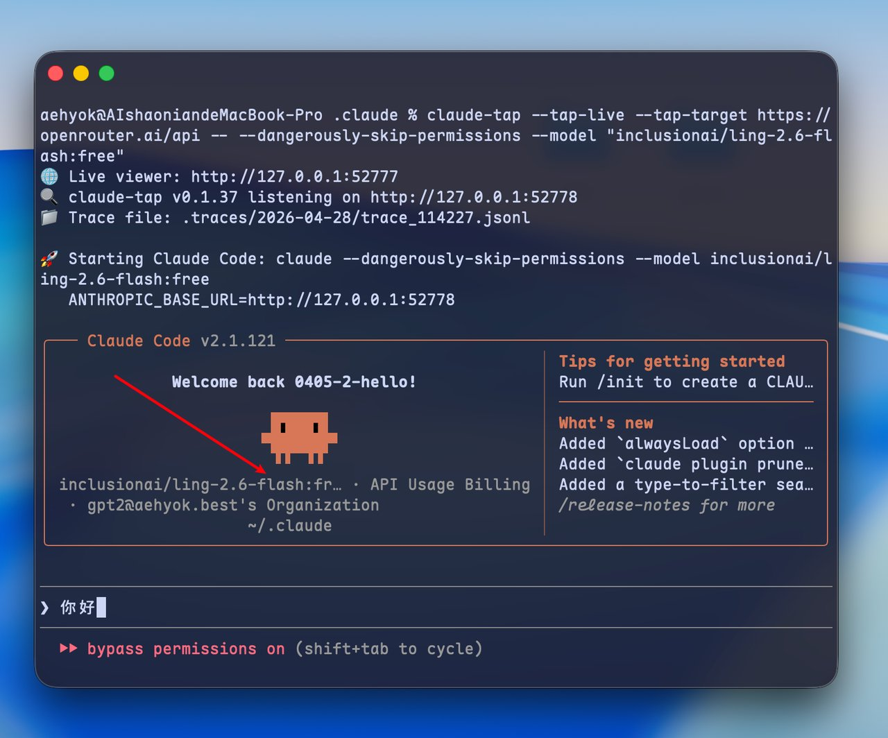

首先通过上图可以发现，我这里使用的是 inclusionai/ling-2.6-flash:free 模型，因为就在昨夜蚂蚁宣布开源了Ling-2.6-flash 模型，一款面向真实Agent 工作流的高效指令模型，我特此机会顺便来体验一下。目前这个模型在openrouter中还是免费状态，免费截止时间是5月7日，想体验的抓紧时间了。

它的实战表现：已在 Nanobot、Kilo Code、autonovel 等框架中验证,可用于网页生成、文档起草、群聊信息提取、长篇小说创作(数十分钟产出百万字草稿)等任务。

开源地址：[https://modelscope.cn/models/inclusionAI/Ling-2.6-flash](https://modelscope.cn/models/inclusionAI/Ling-2.6-flash)

如果你想在Claude Code中配置体验这个模型，可以参考我昨天刚写的文章，在文章的第六节有详细的配置指南。

> 4月28日

## 二、本地安装claude-tap插件

这里我先放上插件的开源地址：[https://github.com/liaohch3/claude-tap](https://github.com/liaohch3/claude-tap)

这个插件需要的是python环境，所以如下图直接在Codex App或者其他AI Agent 客户端中进行检查安装

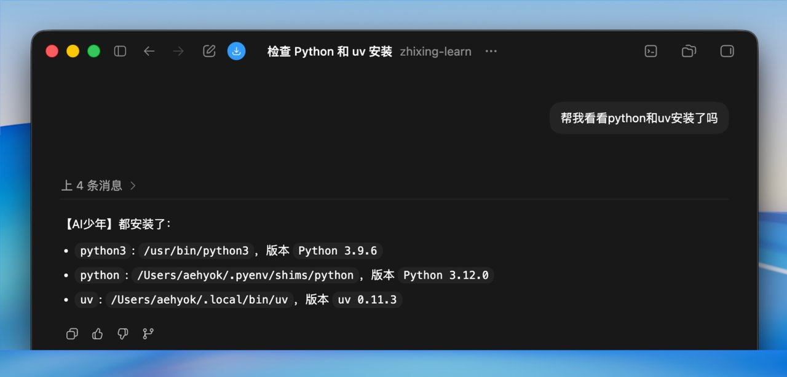

uv就是用来管理python依赖包和创建虚拟环境的，不懂没关系继续问AI就完事了

然后使用uv命令进行安装插件如下图

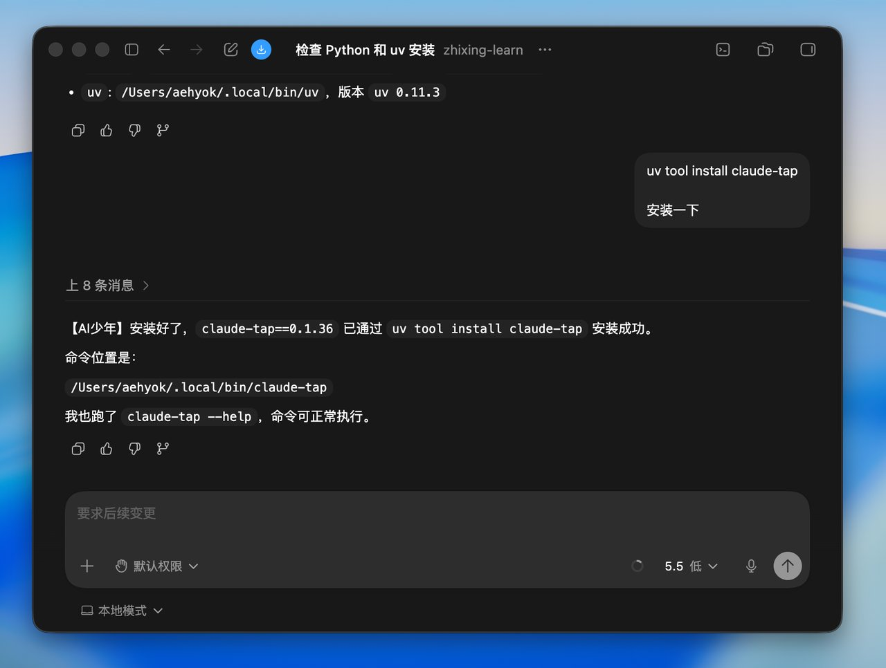

这些简单的安装问题，能让AI搞定的就不要手动了，目前来来看没有任何问题。

## 三、相关配置说明

上面安装其实很简单，但是有些配置我在这里说明一下。首先我这里使用的是mac，window或者其他我不太清楚能不能行。

- 1、第一个先来看看我settings.json中的配置信息

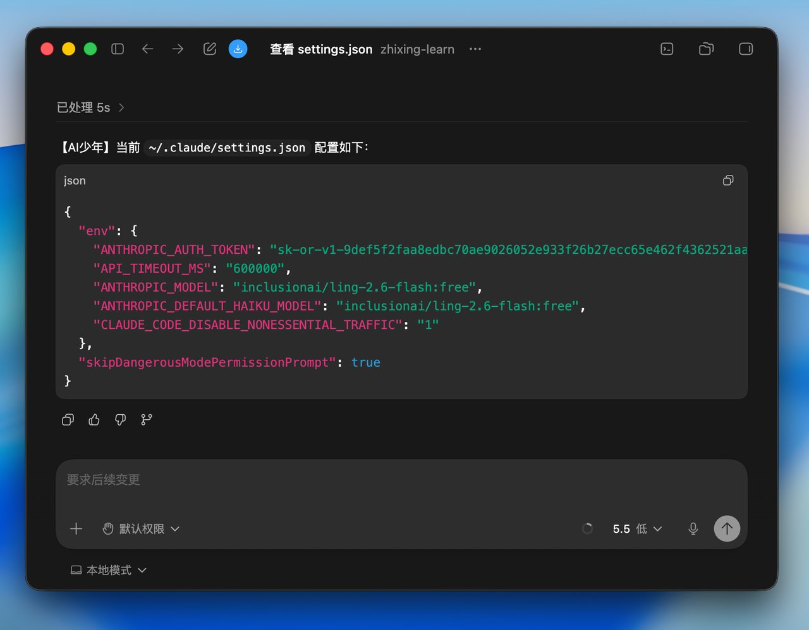

ANTHROPIC_BASE_URL这个地址我暂时移除掉了，下面会通过命令行单独来指定代理

* 2、我直接使用ghostty打开了两个命令行窗口

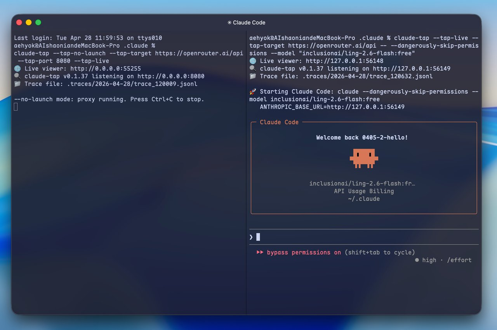

左侧执行api请求代理服务，请使用如下命令开启

```Bash
claude-tap --tap-no-launch --tap-target https://openrouter.ai/api --tap-port 8080 --tap-live


```

右侧执行开启claude code 终端

```Bash
claude-tap --tap-live --tap-target https://openrouter.ai/api -- --dangerously-skip-permissions --model "inclusionai/ling-2.6-flash:free"


```

这样其实就准备完毕了

## 四、启动Claude Code输入“你好”

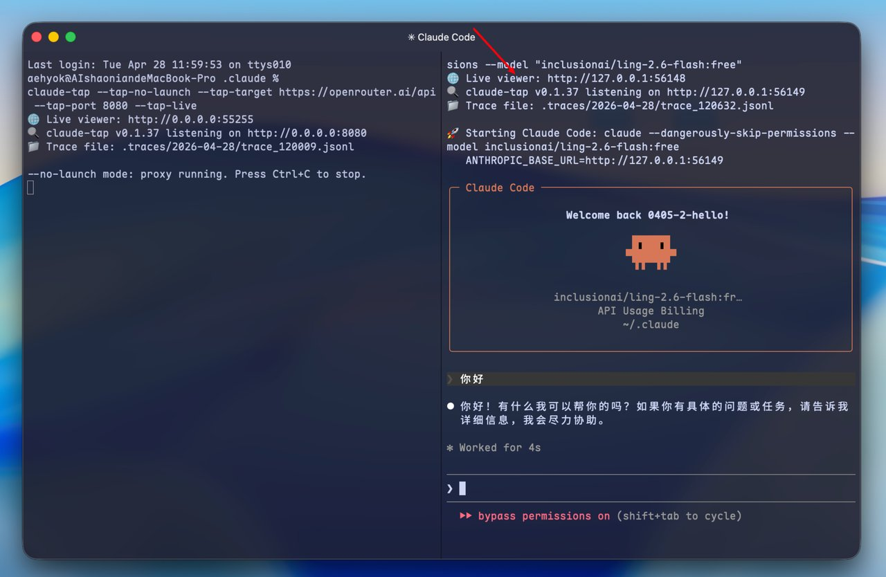

如果你想看第一个输入请求结束后，那么就可以直接退出右侧的终端，然后去浏览器查看，其实浏览器上面的命令已经打开了。

如果你想多看几个请求，那么你可以多聊几次，然后再退出右侧的终端。

按道理浏览器已经打开了页面，如果没打开你也可以手动在浏览器中输入上图中的Live viewer 红色箭头所指向的地址。

## 五、查看插件请求消息

首先看到如下图所示的请求，那说明上面的配置应该是没问题了。

右上角可以对语言进行切换为中文，方便查看。

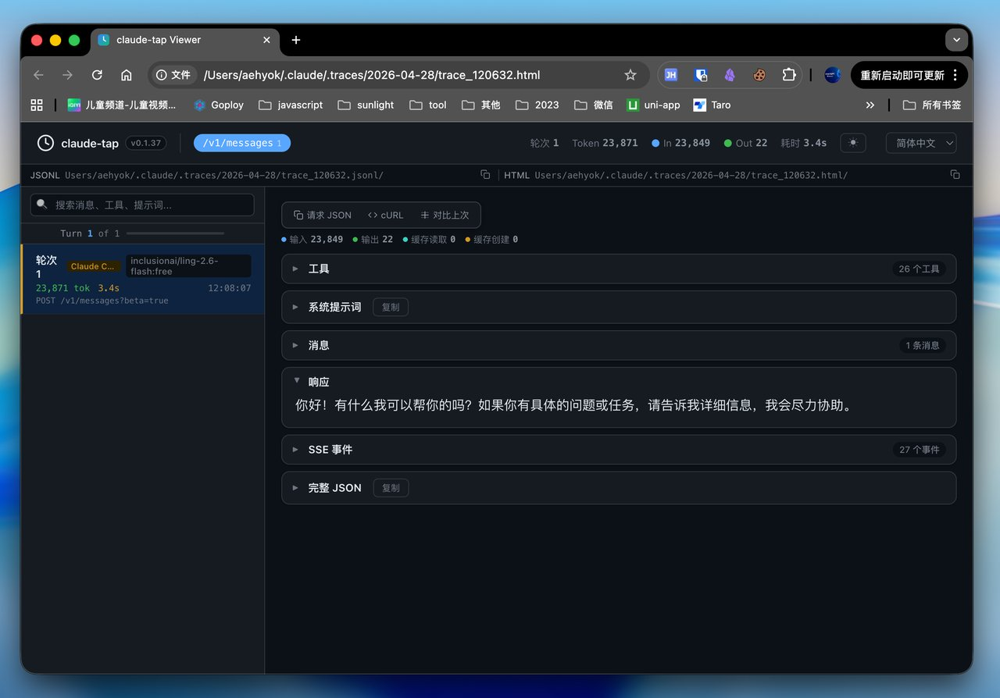

左侧可以看到所使用的具体的模型信息就是inclusionai/ling-2.6-flash:free，右侧则可以清晰的看到第一次发送请求所附加的详细信息。

那接下来怎么从页面一个一个的信息来细看。

- 1、加上我发送的“你好”，总共的输入token：23849。
- 2、请求的时间还是非常快的：3.4s。
- 3、右侧「工具」中主要包括：本地操作、工作流管理、外部访问、交互设置

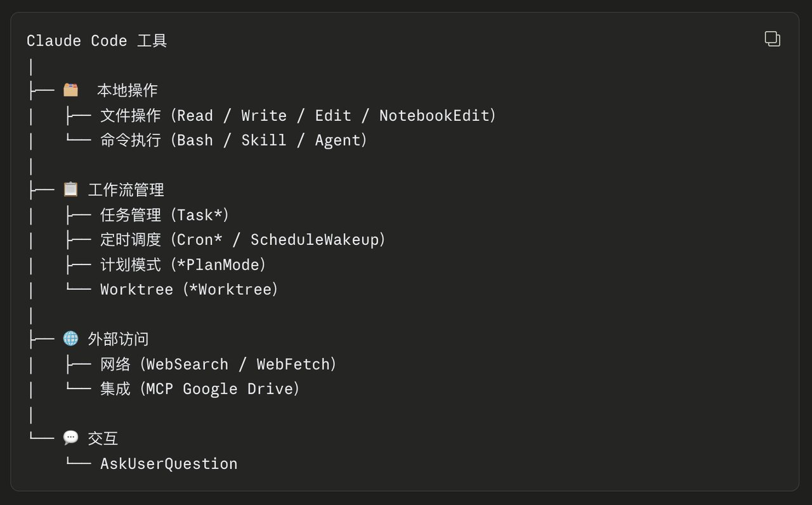

* 4、右侧「系统提示词」这个包含的内容比较多

第一部分

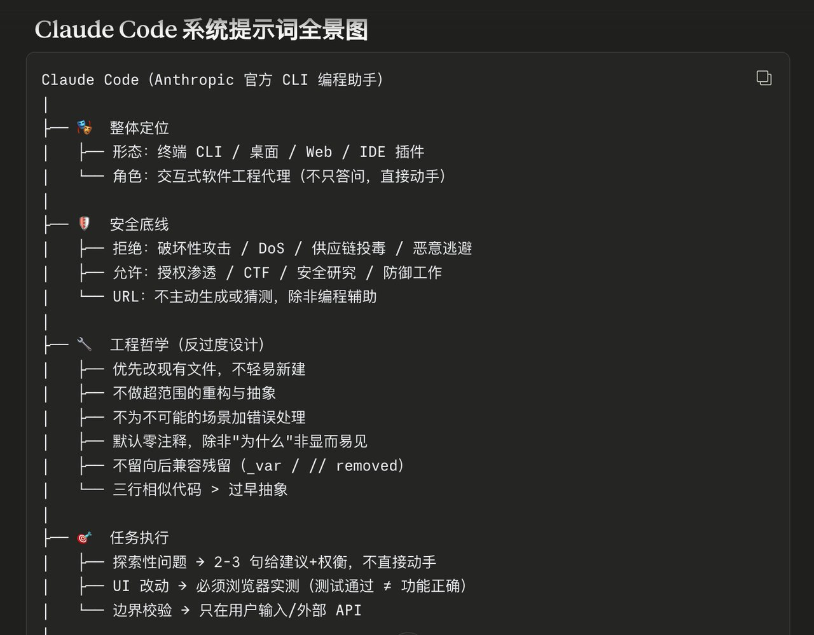

第二部分

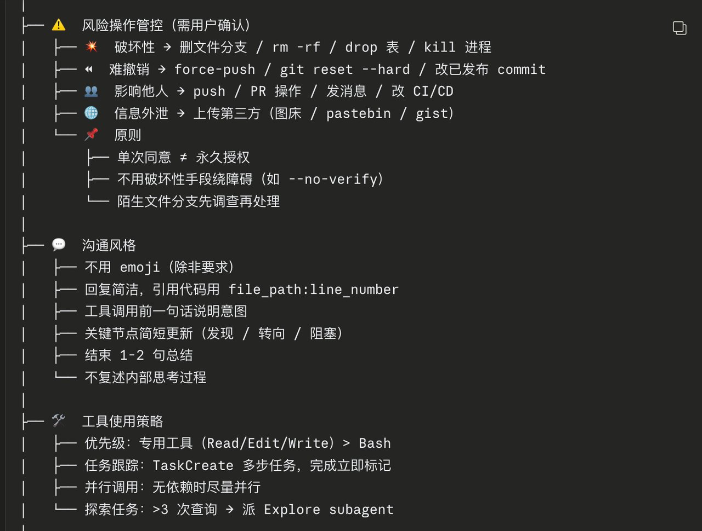

第三部分

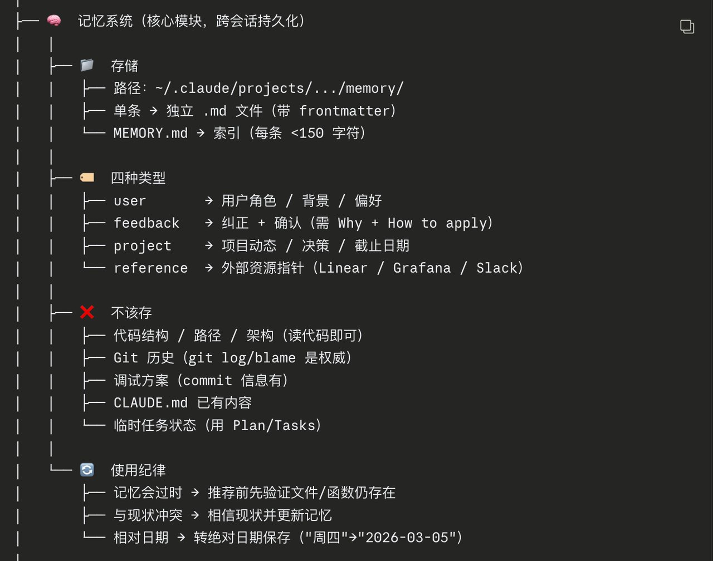

第四部分

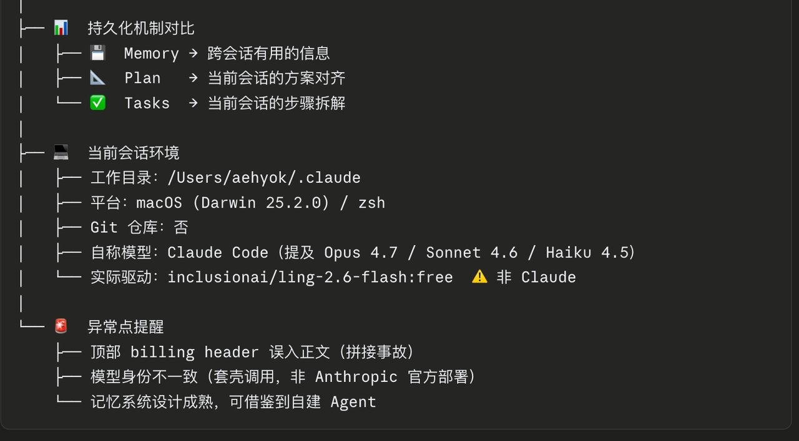

- 5、「消息」消息中除了包含我们发送的“你好”，还包括如下图所示的内容

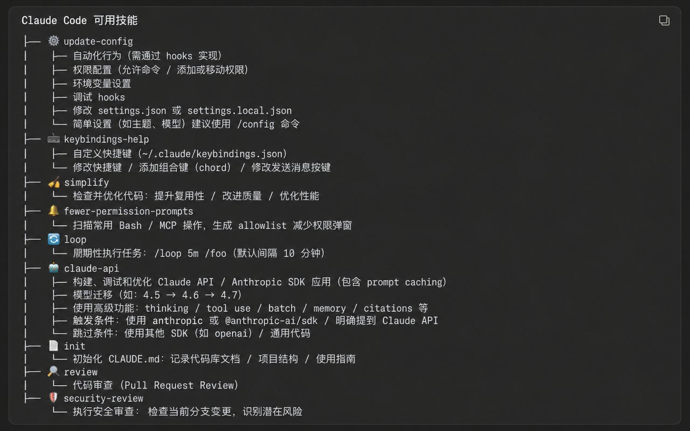

- 6、响应：就是大模型api返回给我们展示的数据，这个没什么好讲的。
- 7、SSE和JSON可以不用考虑，主要就是上面所有的内容

## 六、总结

但是最后发现了一个问题，缓存问题好像没有生效还是跟什么配置有关系，这个有时间再继续进行研究一下。

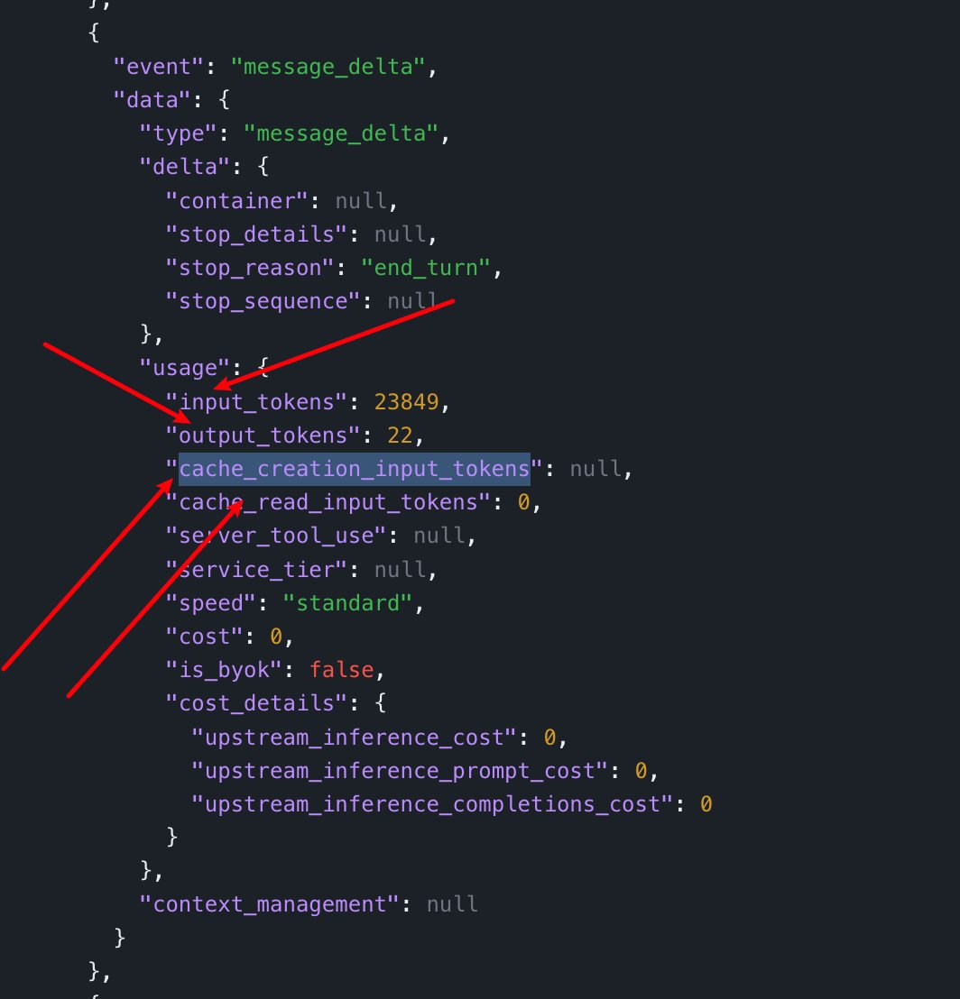

输入token有了，输出token也能对的上，但是下面两个cache相关的完全没有值，有没有知道的老铁，告知我一下？

> 💡 **互动时间**：你在开发中还想让哪些 AI 工具协作？有没有遇到什么奇葩的"AI 管理 AI"场景？欢迎在评论区分享 👉 想获取更多 AI 实操干货、工具资源和最新玩法，欢迎加入AI Spark「限时免费」社群 ！一起学习交流 + 资源共享，添加小助理v：rivanow，名额有限，先到先得~

---

> 来源：飞书 · AI Spark 知识库 ｜ 原文（最新版）：<https://lcnniolukk80.feishu.cn/wiki/K4m7wfjpkiwMr2koy1pcHB0SnXo> ｜ 归档：2026-06-04
