# 可能是全网最全的 Claudian 配置教程了Claude Code + Codex 双模型实战

**装完 Claudian 还在只跑 Claude Code?**

全网搜不到完整教程,这篇我把它补完。配完之后你的 Obsidian 能同时挂 Claude 和 Codex,对话框左下角点一下随便切。

顺便,文末番外讲怎么白嫖，**不花一分钱**让 Claude Code 跑起来,不用订阅、不用信用卡。

依旧图文教程，不要怕，跟着做 10 分钟双模型双开。

**这篇文章你会做的事**:

① 准备前置 — 1 分钟 ② 装 Claudian 插件 — 3 分钟 ③ 配 Claude Code 通道 — 3 分钟 ④ ★ 配 Codex 通道(本文核心) — 3 分钟 ⑤ 双模型切换 — 即时

⭐ 番外:不花钱让 Claude Code 跑起来(可选 5 分钟)

## 一、动手前你需要先有的东西

打开终端开装之前,先把下面这 5 样准备好。

- ✅ **Obsidian** 已装好(v1.4.5+)。没装的话看下面这篇文章,只关注安装 Obsidian 部分,claudian 部分回到本篇操作即可
- ✅ **Node.js** 已装好(用来跑 npm 命令)
- ✅ **一个 ChatGPT 账号**(用来登录 Codex)
- ✅ **Claude Code 的"AI 来源"**,三选一:① 官方 Claude / Anthropic 订阅,② 第三方中转站 API Key,③ **什么都没有也行,看本文末尾「番外」用免费 Ling 模型白嫖**
- ✅ **一个能用的终端**(Mac 用 Terminal,Windows 用 PowerShell)

> 2月9日

下面 1.1 / 1.2 是给完全没碰过 Node.js / 终端的同学准备的,老手直接跳到第二节。

## 1.1 装 Node.js(小白专用 · 老手跳过)

Node.js 是后面所有 npm install 命令的前提。**没装的话敲命令会报 command not found: npm。**

**Mac**:终端跑 brew install node(没装 Homebrew 的先去 [brew.sh](https://brew.sh/) 一行命令装上)

**Windows**:去 [nodejs.org](https://nodejs.org/) 下 LTS 版的 Windows Installer (.msi),双击装,**装完重启电脑**。

**验证装好没**

打开终端,依次跑:

> node -v npm -v

各自能看到一行版本号(比如 v20.11.0、10.2.4),就是装好了。

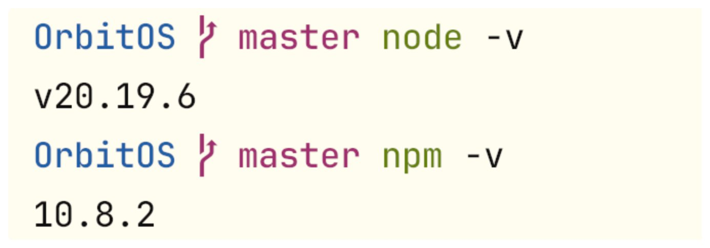

⚠️ **跑命令报 command not found?** 99% 是没重启终端 / Windows 没重启电脑。重启一下再敲。

## 1.2 打开终端(小白专用 · 老手跳过)

**Mac**:按 **⌘ + 空格** 打开 Spotlight 搜索 → 输入 Terminal → 回车。黑底白字那个窗口就是终端。

**Windows**:按 **Win 键** → 输入 PowerShell → 回车。别用旧的 CMD,PowerShell 更稳。

> 💡 **粘贴命令到终端**:直接 ⌘V(Mac)/ Ctrl+V(Windows PowerShell)就行,PowerShell 也支持右键粘贴。

## 二、装 Claudian 本体

Claudian 还没上架 Obsidian 官方插件市场,得靠 **BRAT** 这个"中转工具"装。

下面分两种情况。

## 🔄 老读者:已经装过 Claudian?先把它更新一下

> ⚠️ **Codex 支持是 Claudian 后来才加的,旧版本看不到 Codex tab、配置里也找不到 Codex 选项**。看完入门篇就装好的老读者,**这一步必做**,更新到最新版才能用上 Codex。

操作就在 BRAT 里点一下:

打开 Obsidian 设置 → 左侧菜单滑到底找到 **BRAT** 点进去 → 右侧滑到「**Beta plugin list**」区域 → 找到 **YishenTu/claudian** 那一行 → 点旁边的 **🔄** **刷新图标**(一个圆形箭头按钮),BRAT 会拉取最新版本覆盖装上。

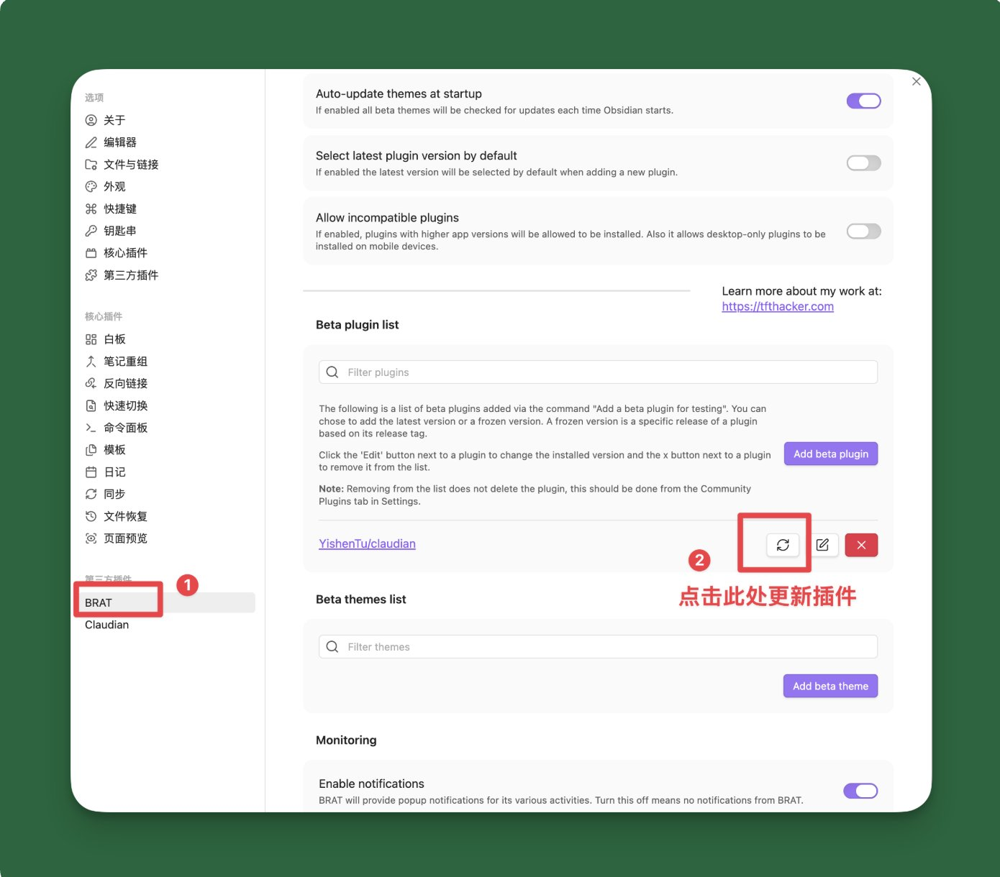

更新完**重启 Obsidian**,然后直接跳到第三节配 Claude Code,下面的全新安装流程不用看了。

> 💡 **想看版本号确认有没有更新成功?** Claudian 的 Codex 支持是 v2.0.x 才加的,更新后回到「第三方插件 → 已安装插件」看 Claudian 那一栏的版本号就行。

## 🆕 新读者:从零安装 Claudian

下面 5 步带截图,跟着做就行。

## Step 1:打开 Obsidian 设置

打开 Obsidian,看 **左下角**,有个 **齿轮图标** **⚙️**,点它。弹出来的就是设置面板。

## Step 2:关掉"安全模式"

设置面板左侧菜单往下滑 → 找到「**第三方插件**」→ 点进去。

最上面那一栏就是「**安全模式**」,**默认是开启状态**,开着的时候 Obsidian 不让你装任何第三方插件。点右边的开关把它关掉,弹出提示问你确不确定,点确认。

关掉之后,紧跟着一栏「**社区插件市场**」就可用了,右边那个「**浏览**」按钮就是插件市场入口(截图里红框那个)。

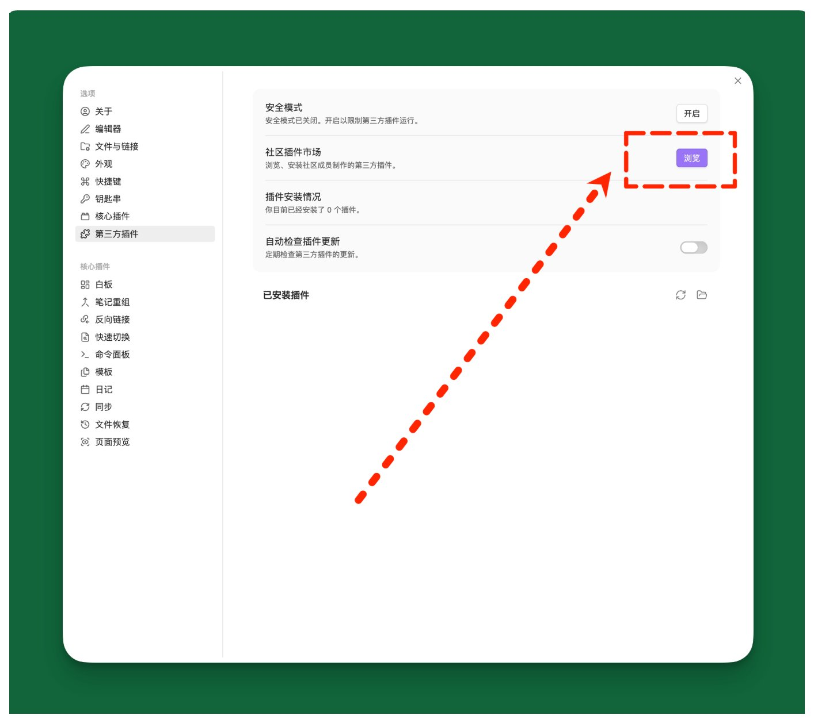

## Step 3:装 BRAT

点「**浏览**」→ 进入插件市场。

搜索框里输入 brat → 第一个结果就是。名字 **BRAT**,作者 **TfTHacker**,下载量 **68 万+**,认准它别装错。

点进去 → 右侧详情页点「**安装**」→ 装完按钮会变成「**启用**」,再点一下。

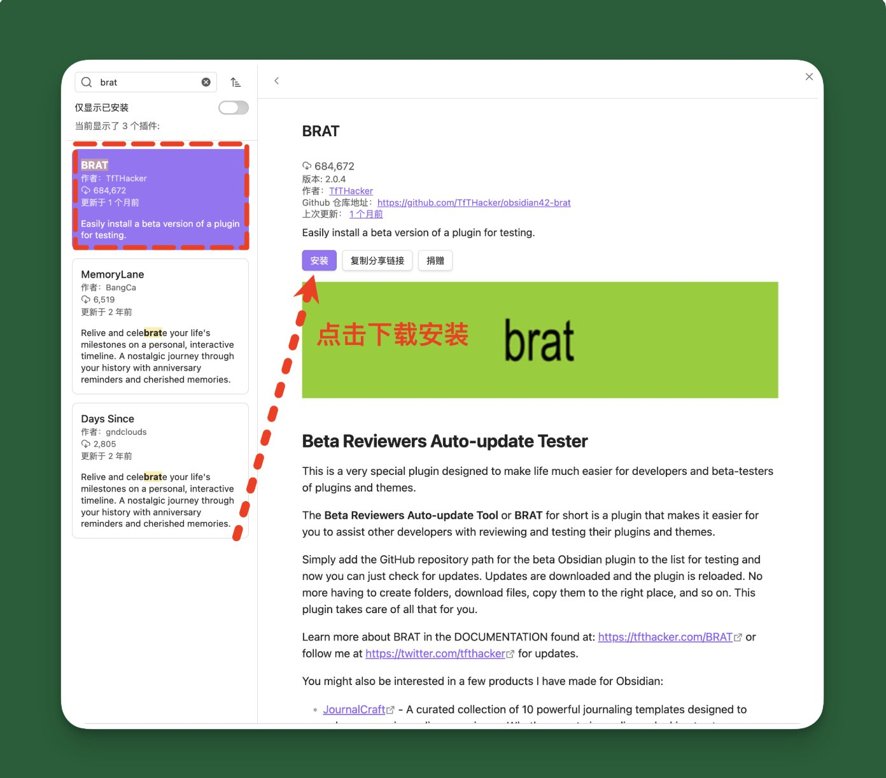

## Step 4:用 BRAT 添加 Claudian

回到设置页面,左侧菜单**滑到最底下**,「**第三方插件**」分类下面会列出所有已装的插件,**找到 BRAT 点进去**。

> ⚠️ **BRAT 自己的设置页是英文 UI**,不像 Obsidian 主设置是中文。看到一屏英文不要慌,跟着下面四步走就行。

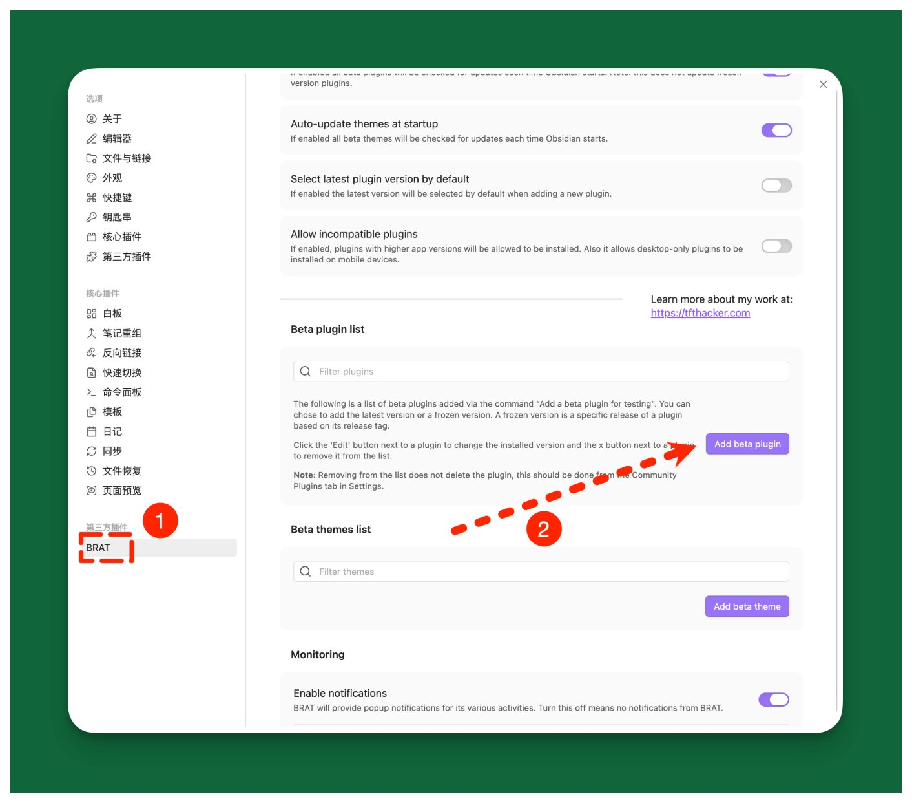

❶ 左侧菜单底部找到 **BRAT** 点进去 ❷ 右侧滑到「**Beta plugin list**」区域,点紫色按钮「**Add beta plugin**」

弹出来一个 Github repository for beta plugin 窗口,按 ❸❹ 走。

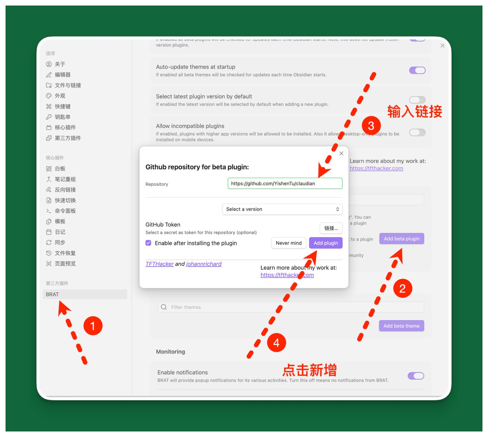

❸ 在 Repository 输入框里**完整粘贴**这个地址:

> [https://github.com/YishenTu/claudian](https://github.com/YishenTu/claudian)

❹ 点紫色按钮「**Add plugin**」 → 等几秒。屏幕上会冒出一条绿色提示,Claudian 自动装好并启用。

## Step 5:验证 Claudian 已启用

回到「**第三方插件**」页面(注意:是上面那个**总开关页面**,不是底下分类下的 BRAT),滑到「**已安装插件**」区域,能看到刚装好的 **Claudian**,右边开关亮着,就是装好并启用了。

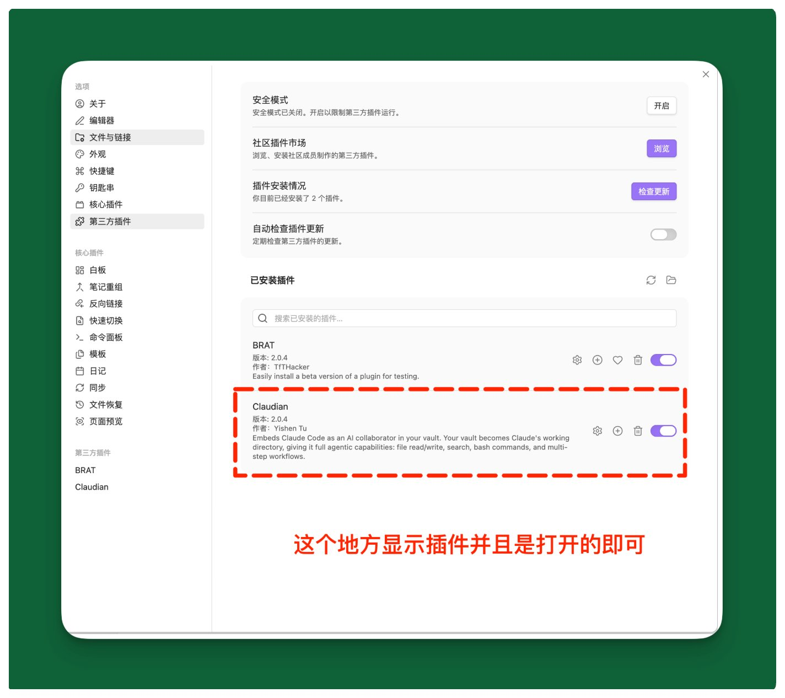

> 顺便看一眼官方对 Claudian 的介绍: "Embeds Claude Code as an AI collaborator in your vault. Your vault becomes Claude's working directory, giving it full agentic capabilities: file read/write, search, bash commands, and multi-step workflows."翻译:**把 Claude Code 嵌进你的笔记仓库,vault 直接变成 Claude 的工作目录,它能读写文件、搜索、跑命令、执行多步骤工作流**。一句话:你的笔记自己会动了。

启用之后看 Obsidian **最左边的侧边栏**(图标那一列),应该多出一个 🤖 机器人图标,这就是 Claudian 的对话面板入口。

> ⚠️ **没看到** **🤖** **图标?** 退出 Obsidian(Mac ⌘Q / Windows 关掉窗口)重新打开就行。

到这一步 Claudian 这个"壳子"就装好了。**但它现在还不能聊天**,因为还没接 AI 模型。

下面分两节,分别把 Claude Code 和 Codex 接上。

## 三、通道一:配 Claude Code

Claude Code 是 Anthropic 官方的命令行工具,它是 Claudian 跑 Claude(Sonnet / Opus)模型的"底层引擎"。

## Step 1:装 Claude Code CLI

打开终端(不知道在哪打开看 1.2),跑这条命令:

> npm install -g [@anthropic](https://x.com/@anthropic)-ai/claude-code

装的时候会跑一会儿,光标重新回到 $ 提示符就是装完了。

## Step 2:处理 Claude Code 的登录和使用

Claude Code 怎么"接到 AI 模型",根据你手里的资源分三条路。**选一条适合你的就行,Step 3 / 4 / 5 主线通用**。

**路线 A:有官方 Claude / Anthropic 订阅** **✅**

终端直接跑:

> claude

第一次启动会弹出登录引导:浏览器自动打开 Claude 官网 → 用你的账号登录 → 授权 → 自动跳回终端,看到欢迎界面就是登好了。凭证存在本地 ~/.claude/,以后调用直接复用。

> 💡 **没自动开浏览器?** 终端会输出一行授权链接,复制到浏览器手动打开就行。

走完按 Ctrl+C 或 /exit 退出 CLI 交互界面,继续 Step 3。

**路线 B:用第三方 API 中转站 / 聚合平台** **✅**

如果你手上已经有某家中转站或聚合平台的 API Key,**按那家平台的文档**配 ANTHROPIC_BASE_URL 和 ANTHROPIC_API_KEY 环境变量即可。每家平台字段不太一样,跟着官方文档走最稳,**本文不展开**。配完直接进 Step 3。

**路线 C:什么都没有?看本节末尾的「番外」** **⭐**

**没官方订阅、也不打算找中转站**?没关系。

本节末尾有一节 **「番外:白嫖玩法 — 用免费模型 Ling 跑 Claude Code」**:通过 OpenRouter 的免费模型 **Ling-2.6-1T** + CC Switch 一键切换,**完全不花钱、不用信用卡、跟着教程 5 分钟搞定**就能让 Claude Code 跑起来。（注意，当前模型目前免费使用，大家使劲蹬就完事了，注意一下到期时间是 26.04.30，然后免费期之后费用也不会特别贵，大家按需购买使用即可，适合自己的才是最好的）

国产开源模型,访问稳定,日常编程辅助和写作够用。

**预算紧张、暂时没订阅、或者想先试试水的同学,推荐走这条路**:直接往下翻到番外,配完再回 Step 3 继续,Step 2 你就不用做了。

> ⚠️ **报错 command not found: claude?** 这说明 Step 1 的 CLI 没装好,或者新 CLI 还没进当前终端的 PATH。**关掉终端窗口重开一个**再试。

## Step 3:拿 CLI 路径

终端跑:

> where claude

会输出一行路径:

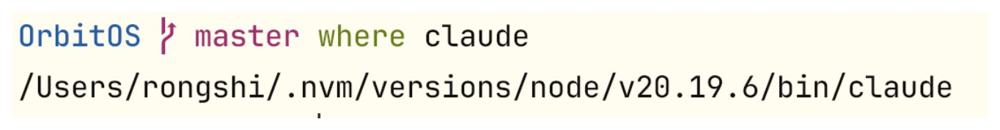

你的输出会和我不一样(路径长得像不像没关系),**完整复制这一行**,待会要粘到 Claudian 设置里。

> ⚠️ **没输出?** 重开终端再试一次;Linux 上 where 找不到的话改用 which claude。

## Step 4:填到 Claudian 设置

回到 Obsidian → 左下角齿轮 ⚙️ → 左侧菜单滑到底找到 **Claudian** → 点进去。

进入 Claudian 设置后,先把语言切成中文,然后**留意顶部有 3 个 tab**:「**通用**」「**Claude**」「**Codex**」。**先切到「Claude」tab**。

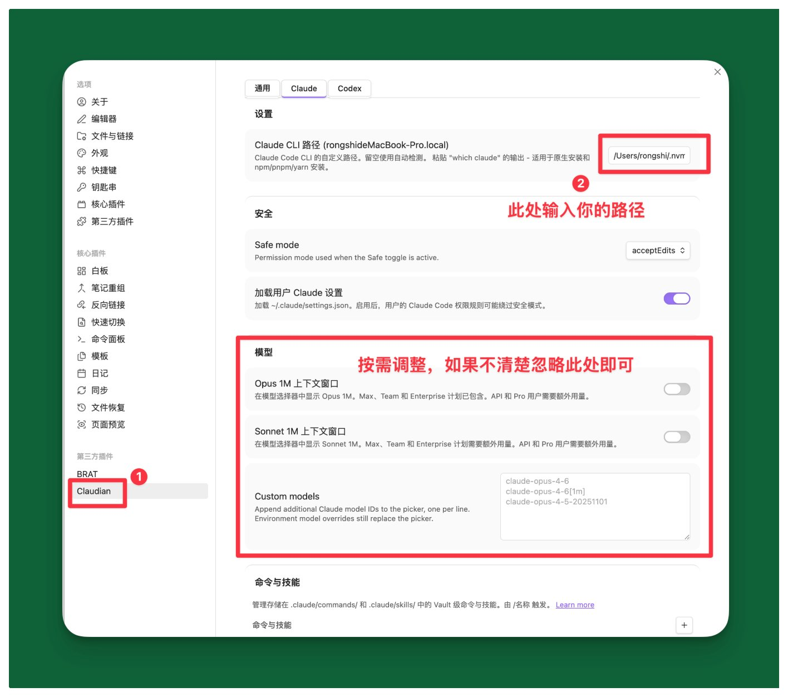

**「设置」区域第一栏「Claude CLI 路径」**,把刚才 Step 3 复制的路径**完整粘进去**。

页面下面还有「安全」「模型」「命令与技能」几个区域,**全部保持默认即可**。下面这几项只针对特定用户:

- **「加载用户 Claude 设置」**:已经在终端配过 ~/.claude/settings.json 的用户打开
- **「模型」区域**(截图红框):**Max / Team / Enterprise 套餐用户**按需调整 1M 上下文 / Custom models,普通用户全部忽略

## Step 5:★ 验证能跑

回到 Obsidian 主界面 → 点左侧 🤖 图标打开 Claudian 主面板 → 发一句"**你好**"。

只要 AI 回复了就代表 **Claude Code 通道打通**。

## 番外:用免费模型 Ling 跑 Claude Code(白嫖玩法)

主线走完,Claude Code 默认按你的 Claude / Anthropic 订阅扣费。如果你想**先白嫖一下试水**,或者预算紧张、暂时没订阅,可以走这条路:通过 **OpenRouter** 上的免费模型 **Ling-2.6-1T**,配合 **CC Switch** 一键切换 API 提供商。Claude Code 还是那个 Claude Code,**底下烧的是免费 token**。

> 💡 **CC Switch** 是一款跨平台桌面应用,专门用来管理 Claude Code、Codex、Gemini CLI、OpenCode、OpenClaw 等 AI 编程工具的 API 提供商。好处是**不用手动编辑配置文件,所有操作都通过可视化界面完成**。

**Step 1:在 OpenRouter 拿 API Key**

访问 [openrouter.ai](https://openrouter.ai/) → 用 Google 账号或邮箱注册 → 进入 [openrouter.ai/keys](https://openrouter.ai/keys) → 点「**Create Key**」。

弹窗里**只需要填 Name 一个字段**(随便起,比如 Obsidian Use Key,方便以后认),下面的 Credit limit / Reset limit every / Expiration 全部留默认即可。点 「**Create**」 → **完整复制生成的 Key**。

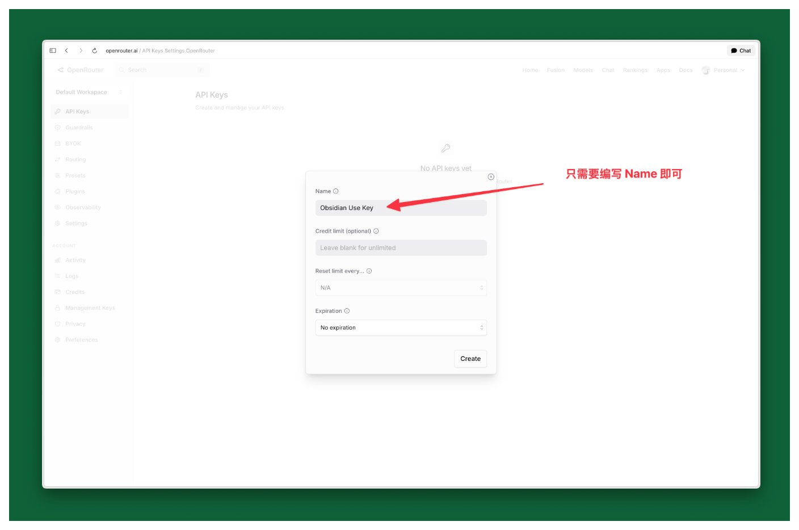

> ⚠️ API Key 只显示一次,务必保存好。丢了得重新生成。

**Step 2:找到免费模型 Ling-2.6-1T 并复制模型 ID**

❶ OpenRouter 顶部菜单点进 **Models** 页面 ❷ 搜索框输入 ling → 第一个结果就是 **inclusionAI: Ling-2.6-1T (free)**(标记 **Free**,输入输出都不计费) ❸ 点模型名右边的 **复制图标** → 复制下来的模型 ID 就是:

> inclusionai/ling-2.6-1t:free

> 💡 OpenRouter 上有不少免费模型,Ling-2.6-1T 是其中表现不错的一个。就算免费期结束,按当前公开价格看也属于很便宜的一档。

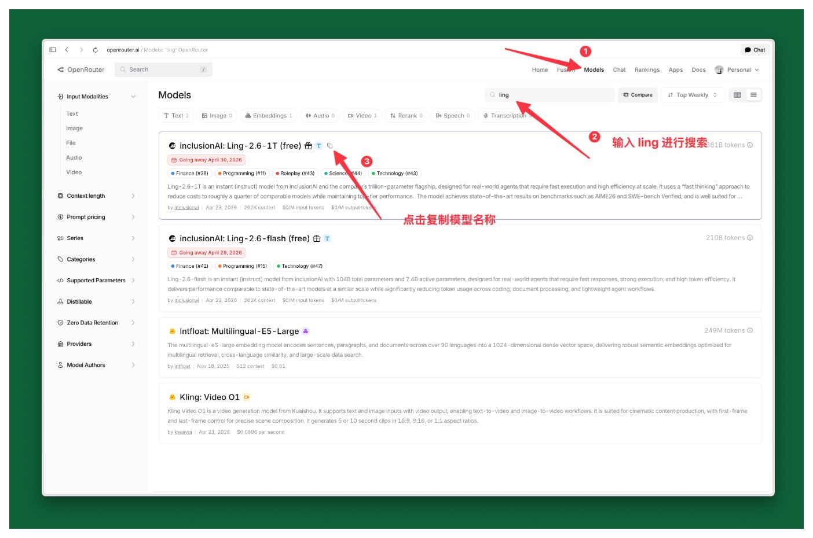

**Step 3:装 CC Switch**

**Mac** 终端依次跑:

> brew tap farion1231/ccswitch brew install --cask cc-switch

**Windows**:去 [CC Switch Releases](https://github.com/farion1231/cc-switch/releases) 下 .msi 安装包双击装。

**Step 4:CC Switch 里添加 OpenRouter**

打开 CC Switch → 顶部 tab 选 「**Claude 供应商**」 → 点「**添加新供应商**」(CC Switch 内置 50+ 提供商预设)。

❶ **预设列表里选 OpenRouter**(在第二行靠右),选完上面的「**供应商名称**」「**实际地址**」会自动填好([https://openrouter.ai](https://openrouter.ai/)),不用改。

❷ **API Key** 字段 → 粘上一步复制的 OpenRouter Key。

❸ **把模型名 inclusionai/ling-2.6-1t:free 填到下面这 5 个字段里**(每个都填同一个):

- **主模型**
- **推理模型 (Thinking)**
- **Haiku 默认模型**
- **Sonnet 默认模型**
- **Opus 默认模型**

> ⚠️ **这一步是关键**:CC Switch 把 Claude Code 内部用的所有模型角色都映射给底层 provider 处理,所以 Haiku / Sonnet / Opus 三档全部得指向 Ling 这一个模型。少填一个,对应那档调用就会失败。

❹ 点右下角蓝色「**添加**」按钮。

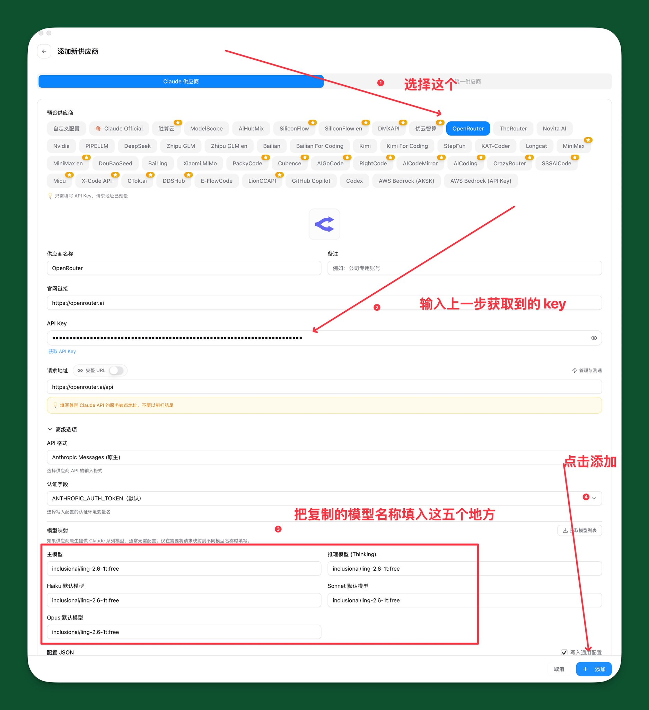

**Step 5:启用 OpenRouter**

回到 CC Switch 主界面,能看到刚加的 **OpenRouter** provider 卡片,右边有蓝色「**▶** **启用**」按钮,**点它**。

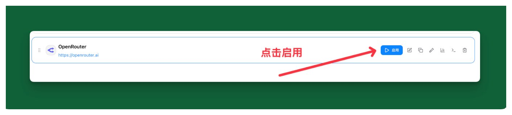

> 💡 **Claude Code 切换提供商后不需要重启**,直接生效。也可以从系统托盘右键直接切换。

**Step 6:★ 验证白嫖通道**

回 Claudian 主面板 → 用 Claude 组的任意模型(Opus / Sonnet / Haiku 都行,反正底下都走 Ling)→ 发一句"**你好**"。

只要 AI 回复就说明**白嫖通道打通**。此时你跑的就是 Ling-2.6-1T,**完全不产生费用**。

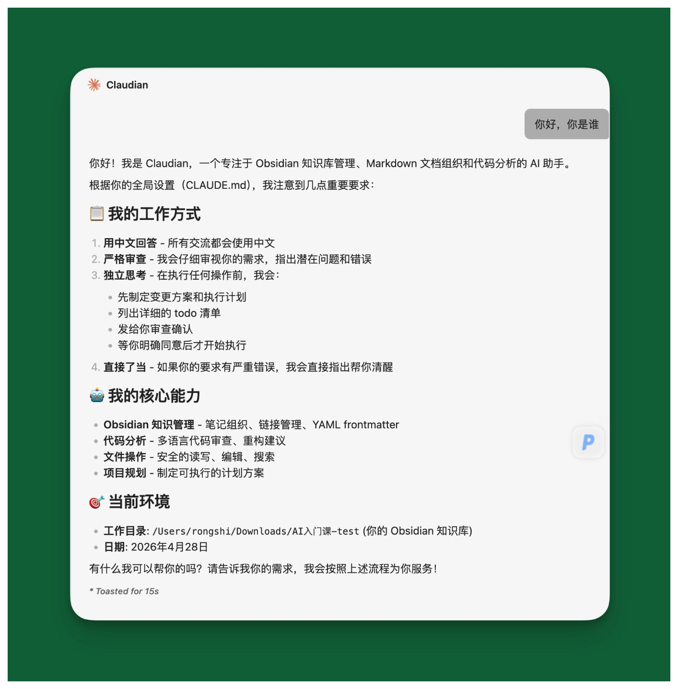

## 四、通道二:配 Codex(本文核心增量)

不管你走的是主线官方登录,还是番外白嫖路线,到这一步 Claude Code 都能用了。如果你只想用 Claude,到这就可以收工。

但 Claudian 还有一手玩法:**再挂一条 Codex 通道,两边随时切换**。这一节官方 README 几乎没写、网上也搜不到完整教程。下面是我实测可跑的全流程。

## Step 1:装 Codex CLI

终端跑:

> npm install -g [@openai/codex](https://x.com/@openai/codex)

> 💡 **已经装了 OpenAI 的 Codex 桌面 app?** 也可以直接对它说"**帮我安装 codex cli**",它会替你跑这条命令,适合不想碰命令行的同学。

## Step 2:用 ChatGPT 登录鉴权

> 这一步是 Codex CLI 和 Claude Code 体验差异最大的地方:**Codex 用的是 ChatGPT 官方授权**,你不需要单独申请 OpenAI API Key,有 ChatGPT 账号就行。

和上一节一样,先把 CLI 登好再去配 Claudian。终端跑:

> codex login

进入交互界面后,选 「**Sign in with ChatGPT**」。

它会自动开浏览器 → 用你的 ChatGPT 账号登录 → 授权 → 跳回终端,看到 Sign in successful 就是登好了。

## Step 3:拿 CLI 路径

终端跑:

> where codex

输出一行路径:

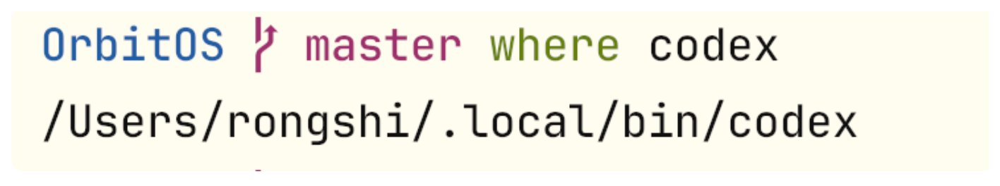

我这里是 /Users/rongshi/.local/bin/codex,和 Claude 一样,你看到的具体路径会和我不同,**完整复制下来**就行。

## Step 4:填到 Claudian 设置(关键)

回到 Obsidian → Claudian 设置 → 顶部 tab **切到「Codex」**。

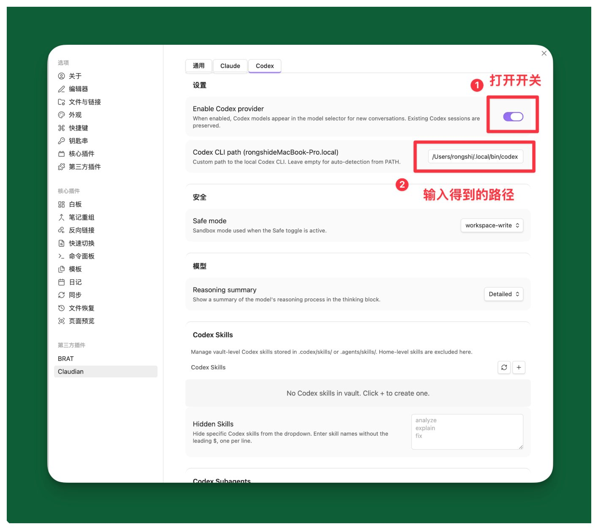

这一步**有两个动作必须都做,少一个 Codex 都不会出现在切换菜单里**:

❶ **打开「Enable Codex provider」开关**(截图里红框 ❶)

> ⚠️ 这是 Codex 通道的总闸,**默认是关的**。打开之后 Codex 模型才会出现在 Claudian 的模型选择器里。这一步全网教程没人提到,是真正的"踩坑陷阱"。如果你最后切换菜单里看不到 Codex,99% 是这个开关没打开。

❷ **在「Codex CLI path」字段**,把刚才 Step 3 复制的 codex 路径**完整粘进去**(截图里红框 ❷)

## Step 5:★ 验证能跑

回到 Claudian 主面板 → **切换到 Codex**→ 发一句"**你好**"。

只要 AI 回复了,就是**Codex 通道打通**。

> ⚠️ **切换菜单里看不到 Codex?** 1️⃣ 检查 Step 4 那个 Enable Codex provider 开关是不是打开了 2️⃣关闭 Obsidian 之后重新启动 3️⃣在 claudian 中新建一个对话框即可

## 五、双模型切换:左下角一键选

两条通道都配好之后,切换位置是 **Claudian 对话框左下角的模型选择器**。点一下弹出下拉菜单,里面**分两组**:

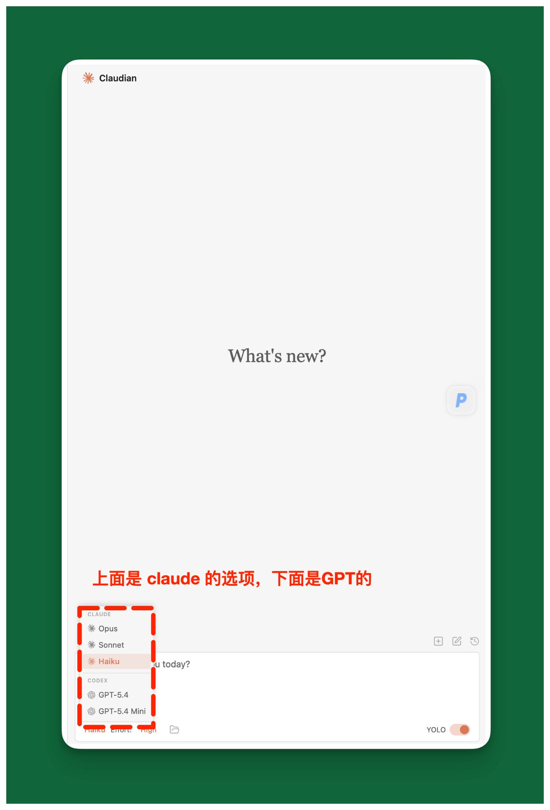

- **CLAUDE 组**:Opus / Sonnet / Haiku
- **CODEX 组**:GPT-5.4 / GPT-5.4 Mini

> ⚠️ **下拉菜单里只看到 CLAUDE 组,没 CODEX 组?** 1️⃣检查 Step 4 ❶ 那个 Enable Codex provider 开关是不是打开了 2️⃣关闭 Obsidian 之后重新启动 3️⃣在 claudian 中新建一个对话框即可

## 写在最后

到这一步,你的 Obsidian 已经同时挂上了 Claude 和 Codex 两条 AI 通道,按自己的需要切着用就行。

**Codex 这部分,我搜了全网没看到一篇完整的,这是这篇我自己最在意的部分。** 收藏起来,以后想给同事或朋友安利双模型双开,把这一篇丢过去就行。

---

> 来源：飞书 · AI Spark 知识库 ｜ 原文（最新版）：<https://lcnniolukk80.feishu.cn/wiki/HS0TwZXbAiezPPkUznScjJpfn7e> ｜ 归档：2026-06-04
