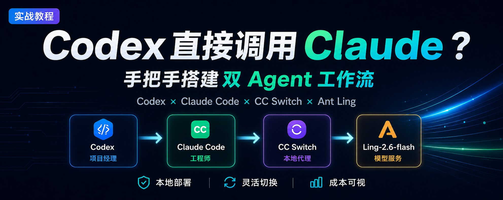
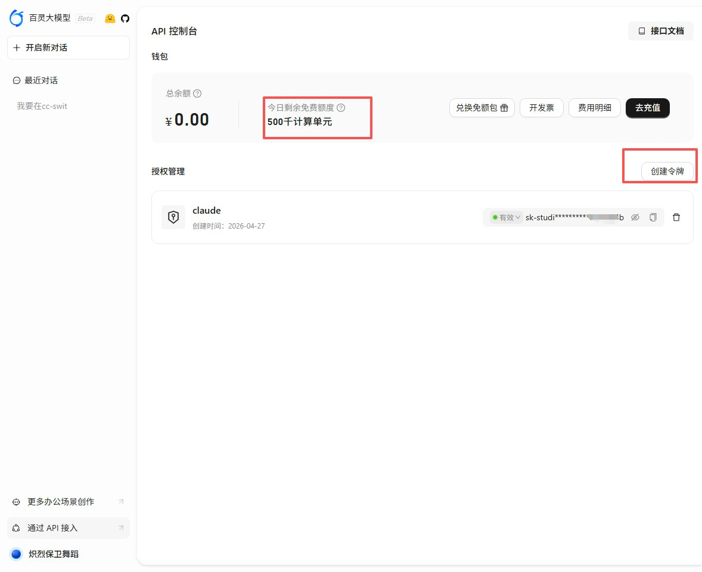
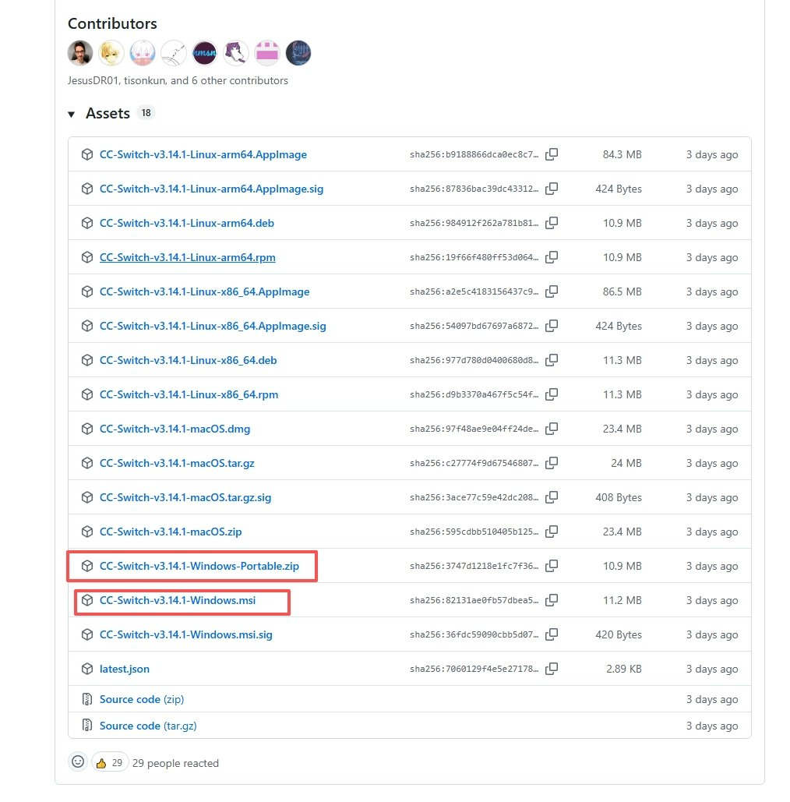
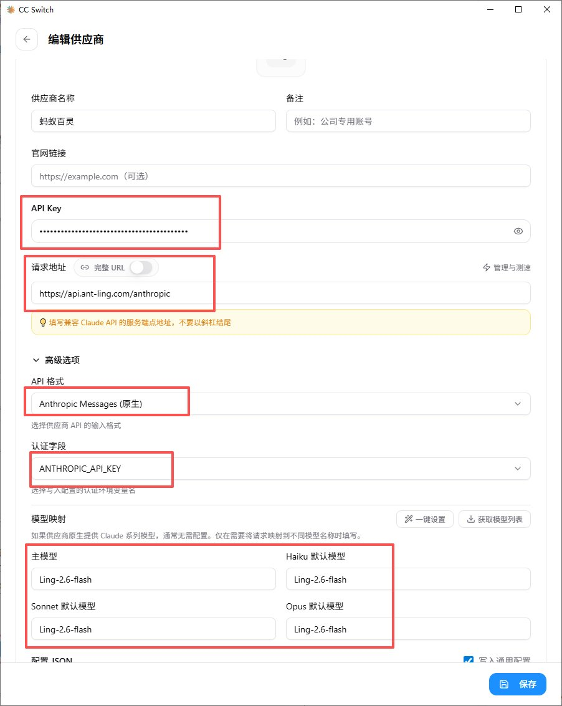
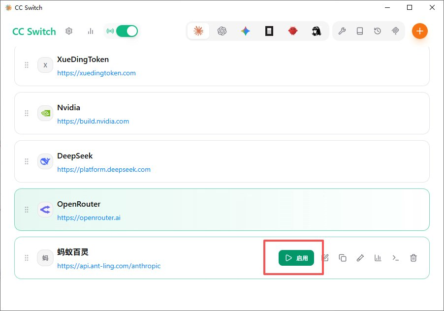
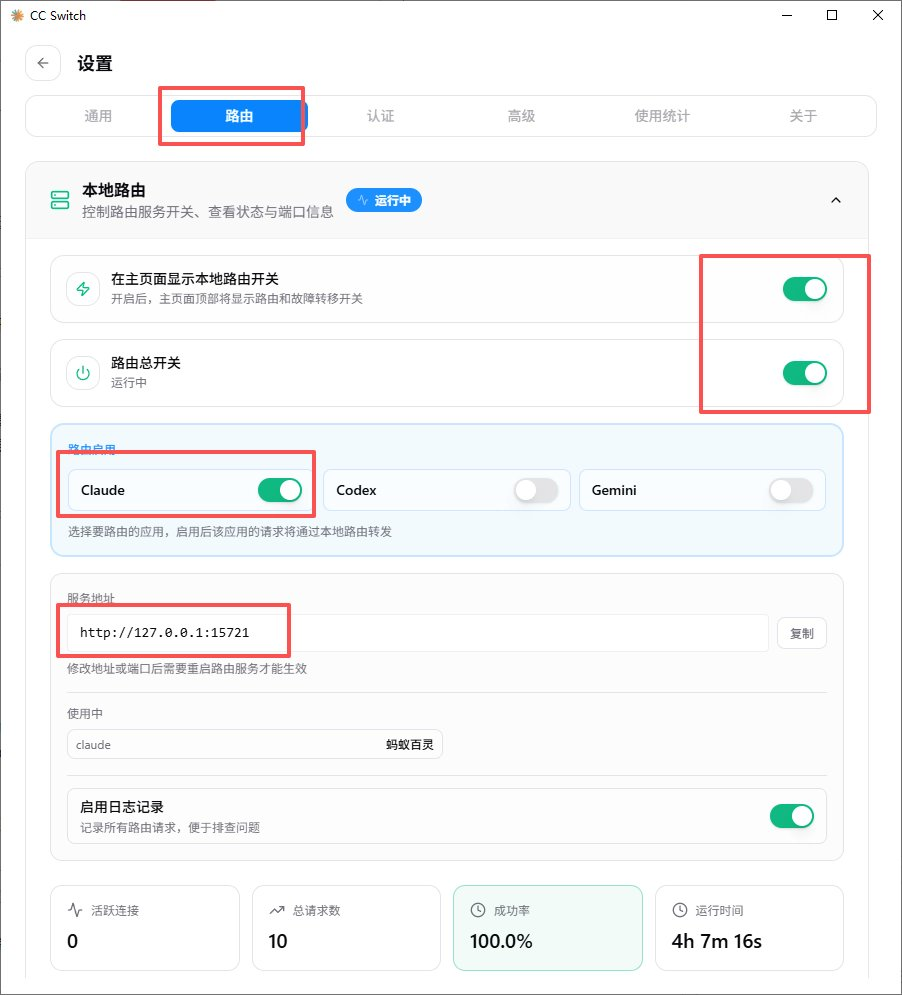
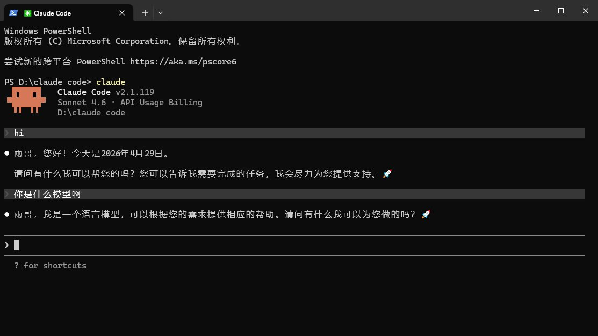
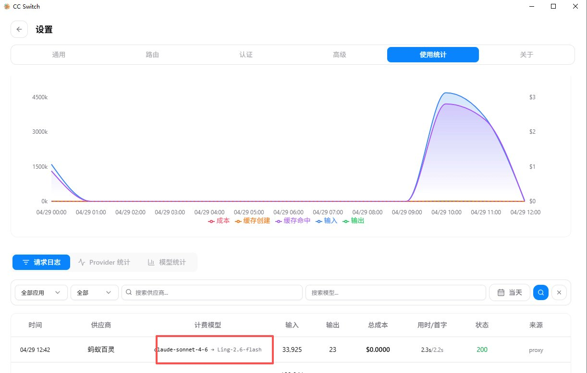
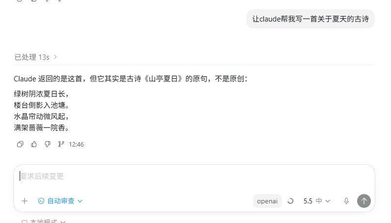

# 啊？Codex 可以直接调用 Claude 了！手把手教你搭建双 Agent 工作流



今年 3 月，OpenAI 干了一件挺有意思的事——他们给 Claude Code 开发了一个官方的 **Codex 插件**。装上之后，Claude Code 可以直接在工作流里调用 OpenAI 的 Codex 来做代码审查、安全审计这些活。说白了，就是**让 Claude 指挥 Codex 干活**。

等等，既然 Claude 能调 Codex，那反过来呢？

**Codex 能不能调 Claude Code？**

答案是：能。而且不需要等官方出插件，你现在就能搭出来。

正好，蚂蚁百灵的 **Ling-2.6-flash** 刚刚正式开源。这个模型之前就在 Agent、代码和工具调用场景里刷过一波存在感，现在又开放了官方 API 和每日免费额度。既然它支持 Anthropic 兼容接口，那就很适合拿来试一件事：让 Codex 通过 Claude Code 间接调它。

本文要教你的就是这件事：让 Codex 当项目经理负责拆活，Claude Code 当资深工程师负责干活，中间用一个叫 **CC Switch** 的本地代理做调度，背后接上 Ant Ling 的 Ling-2.6-flash。整个流程在你本机跑，不依赖任何外部编排平台。

## 先搞懂：这三层到底是什么？

直接上图：

```Plain Text
你（人类）
  ↓ 下达任务
Codex —— 主控 AI Agent（项目经理）
  ↓ 判断哪部分可以外包
  ↓ 通过 claude.cmd 发任务
Claude Code —— 执行 AI Agent（资深工程师）
  ↓ 发 API 请求
CC Switch（本地 127.0.0.1:15721）—— 代理/调度中心
  ↓ 转发到你选的供应商
Ant Ling（Ling-2.6-flash）
  ↓ 返回结果
  ↑ 逐层回传 → Codex 检查合并 → 交付给你

```

用人话翻译一下每层的角色：

- **Codex = 项目经理**：理解你的需求，拆分任务，质检最终结果
- **Claude Code = 资深工程师**：接到具体任务后，独立完成代码编写、分析等工作
- **CC Switch = 调度中心**：在你本机跑的代理服务，决定 Claude 的请求走哪条线路（哪个供应商）
- **Ant Ling = 实际干活的模型服务**：本文推荐先用 Ling-2.6-flash 跑通整条链路

**一句话总结**：Codex 调 Claude Code，Claude Code 走 CC Switch，CC Switch 把请求转给 Ant Ling 的 Ling-2.6-flash。

## 为什么要这么折腾？

你可能会想：我直接用一个 AI 不就行了，搞这么复杂干嘛？

好问题。几个实打实的好处：

## 🎯 扬长避短，各干各的擅长

Codex 强在全局规划、浏览器操作、项目级任务编排。Claude Code 强在深度代码推理、长上下文分析、精准的代码生成。让它们各干自己最擅长的事，比逼着一个全干效果好得多。

## 💰 省钱，灵活切供应商

通过 CC Switch，你可以随时切换 Claude 的供应商。本文先用 Ant Ling 跑通，后面如果你想换别的模型服务，也不用改 Codex 的使用方式，只需要在 CC Switch 里切换。

## 📊 花多少钱，一目了然

CC Switch 内置 Token 统计和请求日志。每次调用花了多少 Token、走了哪个模型，打开面板就能看到。再也不用月底收到账单才发现"钱怎么没了"。

## 🛡️ 自动故障转移

CC Switch 支持配置多个供应商。如果当前供应商挂了或者限流了，它能自动切到备用线路，你的工作流不会因为某一家服务出问题而中断。

## 🛠️ 保姆级部署教程

**前置条件：** 你的 Windows 机器上已经装好了 Claude Code（能跑 claude --version 就行）。如果还没装，去 [官方文档](https://docs.anthropic.com/en/docs/agents-and-tools/claude-code/overview) 跟着装一下，两分钟的事。

准备好了？下面三步搞定。

## Step 1：去 Ant Ling 官网注册并获取 API Key

CC Switch 可以接不同供应商，但如果你只是想把这条链路稳定跑通，建议先走 **Ant Ling 官网**。原因很简单：我们已经实测 Ling-2.6-flash 可以正常被 Claude Code 调用，而且官方目前给每个账号每天 50 万免费计算单元，输入和输出都包含在内。

Ling-2.6-flash 是蚂蚁集团 inclusionAI 的模型，不是 Anthropic Claude，但提供 Anthropic 兼容接口，所以 Claude Code 可以通过 CC Switch 调用它。更重要的是，它已经正式开源，官方 API 也能直接申请使用，用来搭这个双 Agent 工作流刚好合适。每个账号每天 50 万免费计算单元，输入和输出都算；当天未使用完不会结转。

注册流程：

1. 打开 [https://ling.tbox.cn/open](https://ling.tbox.cn/open)
2. 注册并登录账号
3. 按提示绑定支付宝账号
4. 进入 API Key 管理页面，创建一个新的 API Key
5. 复制并保存好这个 Key，后面填到 CC Switch 里



## Step 2：安装并配置 CC Switch

CC Switch 是一个开源的桌面应用，专门用来管理 Claude Code 等 AI 编程工具的供应商配置。它的核心能力是在你本机启动一个**本地代理**，自动接管 Claude Code 的请求路由——你只需要在 CC Switch 里配好供应商，**Claude Code 那边不用动任何配置**，CC Switch 会自动帮你搞定。

**下载安装：**

1. 打开 [github.com/farion1231/cc-switch/releases](https://github.com/farion1231/cc-switch/releases)
2. 找到最新版本，下载 **.msi** 安装包（Windows 用户）
3. 双击安装，一路下一步



**配置供应商：**

API 格式：Anthropic Message Base URL：[https://api.ant-ling.com/anthropic](https://api.ant-ling.com/anthropic) Model：Ling-2.6-flash Haiku/Sonnet/Opus：都填 Ling-2.6-flash 完整 URL：关闭 API Key：填百灵官网 Key



回到主界面，选中刚配置好的供应商，点 **Enable**（启用）



**开启本地代理：**

供应商配好之后，还需要手动开启本地代理，让 CC Switch 真正接管 Claude Code 的请求：

1. 点击 CC Switch 界面上的 **设置**（Settings）
2. 找到 **路由**（Routing）选项
3. 打开 **本地路由**（Local Routing）的开关



开启后，CC Switch 会在本地启动代理服务（默认监听 127.0.0.1:15721），并**自动把 Claude Code 的请求指向这个本地代理**。你不需要手动去改 Claude Code 的 settings.json 或设环境变量——CC Switch 全部帮你处理好了。

## Step 3：验证连通性

两步配完，测试一下整条链路是否通畅。

直接打开 Claude Code，随便跟它聊一句，比如"你好"。如果 Claude Code 能正常回复，说明整条链路已经通了：你的请求从 Claude Code 出发，经过 CC Switch 本地代理，转发到 Ant Ling，再拿到结果返回给你。

再去 CC Switch 的面板看一眼，应该能看到刚才那条请求的日志——双重确认，稳了。





到这里，你的三层架构就搭好了。剩下的就是让 Codex 来调用它。

## 🎬 在 Codex 里调用 Claude Code

架构搭好了，接下来就是重头戏：**让 Codex 实际调用 Claude Code 干活。**

配置好之后，你不需要每次都手写命令。更自然的用法是：直接用中文告诉 Codex，哪一部分交给 Claude 看一下。

## 实际操作

你只需要在跟 Codex 对话的时候，说类似这样的话：

> “这段代码的逻辑审查交给 Claude 看一下，把结果整合后告诉我。”

或者：

> “这个方案让 Claude 给个第二意见。”

再或者：

> “这部分文档让 Claude 先起草一版，你来检查和整理。”

Codex 就会：

1. 判断这个任务适合交给 Claude
2. 把适合独立处理的部分发给 Claude Code
3. Claude Code 的请求经过 CC Switch → Ant Ling → 返回结果
4. Codex 拿到 Claude 的输出，检查后合并到最终工作中



背后的实现仍然是 Claude Code 的命令行能力，但日常使用时你不需要关心命令细节。你只要把意图说清楚，Codex 会负责调度、检查和整合。

## 💡 实战场景

光说不练假把式。来看几个真实好用的场景：

## 场景一：交叉代码审查

你让 Codex 写完一段代码后，不急着提交，先让 Claude Code 做个"第二意见"审查：

> “把刚才写的 authMiddleware.js 发给 Claude，让它从安全角度审查一下有没有漏洞。”

两个 AI 从不同角度看同一段代码，问题暴露的概率大大提高。

## 场景二：分工并行

你有个大任务——“重构整个项目的错误处理机制”。Codex 负责制定重构方案和改主要代码，同时把"写单元测试"这个独立子任务甩给 Claude Code：

> “错误处理的重构我来做，测试部分交给 Claude，让它根据新的错误类型生成对应的 Jest 测试用例。”

## 场景三：文档生成

Codex 做完架构设计后，让 Claude Code 负责写详细的 API 文档：

> “把 routes/ 下的所有接口定义提取出来，交给 Claude 生成 Markdown 格式的 API 文档。”

## ⚠️ 防踩坑指南

## 1. Windows 下 claude 和 claude.cmd 的区别

如果你通过官方安装脚本装的，可执行文件一般是 claude.cmd。如果通过 npm 装的，可能是 claude。两者功能一样，只是名字不同。不确定的话，在 PowerShell 里分别试一下就知道了。

## 2. CC Switch 端口被占用

如果 15721 端口被其他程序占了，CC Switch 会启动失败。去 CC Switch 设置里改个端口就行，CC Switch 会自动更新 Claude Code 的代理指向。

## 3. Token 消耗控制

每次 Codex 调 Claude Code，都是一次独立的 API 调用，会产生 Token 消耗。建议：

- **任务描述尽量精确**，避免 Claude Code 花大量 Token 在"理解你到底想干嘛"上
- **把任务边界说清楚**，比如只让 Claude 做审查、起草或第二意见，不要把整个项目一股脑丢过去
- **定期去 CC Switch 面板看统计**，及时发现异常消耗

## 4. PowerShell 执行策略拦截 claude

Windows 下直接跑 claude 有时会触发 claude.ps1，然后被 PowerShell 执行策略拦住。遇到这种情况，不是 Claude Code 坏了，改用 claude.cmd 就行。

## 5. API Key 安全

你的 Ant Ling API Key 保存在 CC Switch 的本地数据库里，**确保不要把 CC Switch 的配置目录（~/.cc-switch/）上传到 GitHub 或任何公开位置**。

## 🧩 整体架构一览

最后再拉回来看一眼全景：

```Plain Text
┌─────────────────────────────────────────────────┐
│                    你（人类）                      │
│               下达任务 / 审核结果                   │
└────────────────────┬────────────────────────────┘
                     │
                     ▼
┌─────────────────────────────────────────────────┐
│              Codex（主控 Agent）                   │
│                                                   │
│  • 理解需求，拆分任务                              │
│  • 自己执行擅长的部分                              │
│  • 用自然语言调度 Claude Code                    │
│  • 检查 Claude 的结果，合并交付                    │
└────────────────────┬────────────────────────────┘
                     │ 把子任务交给 Claude
                     ▼
┌─────────────────────────────────────────────────┐
│            Claude Code（执行 Agent）               │
│                                                   │
│  • 接收 Prompt，独立完成任务                       │
│  • 深度代码推理 / 分析 / 生成                      │
│  • API 请求发往本地代理                            │
└────────────────────┬────────────────────────────┘
                     │ HTTP → 127.0.0.1:15721
                     ▼
┌─────────────────────────────────────────────────┐
│          CC Switch（本地代理/路由）                 │
│                                                   │
│  • 转发请求到当前启用的供应商                      │
│  • Token 统计 / 请求日志                           │
│  • 自动故障转移                                    │
└────────────────────┬────────────────────────────┘
                     │ HTTPS
                     ▼
┌─────────────────────────────────────────────────┐
│              Ant Ling（Ling-2.6-flash）             │
│                                                   │
│  • 提供真正执行任务的模型算力                      │
│  • 每天免费额度适合先跑通流程                      │
└─────────────────────────────────────────────────┘

```

## 💬 结语

说到底，这不是在"折腾工具"，而是在**给自己组建一个 AI 工作团队**。

Codex 是你的项目经理，Claude Code 是你的资深工程师，CC Switch 是调度中心，Ant Ling 负责真正产出结果。你要做的只是"当老板"——下达需求，审核结果。

以后再有人问你"AI 编程工具那么多，到底选哪个？"，你可以告诉他：

**不用选，全都要。让它们一起给你打工。**

> 💡 **互动时间**：你在开发中还想让哪些 AI 工具协作？有没有遇到什么奇葩的"AI 管理 AI"场景？欢迎在评论区分享 👉 想获取更多 AI 实操干货、工具资源和最新玩法，欢迎加入AI Spark「限时免费」社群 ！一起学习交流 + 资源共享，添加小助理v：rivanow，名额有限，先到先得~

**更多 AI 干货同步更新公众号：雨哥聊AI，关注我带你玩转 AI 时代**

---

> 来源：飞书 · AI Spark 知识库 ｜ 原文（最新版）：<https://lcnniolukk80.feishu.cn/wiki/GFzGwAxTCijC4qk50b3cwktSnvb> ｜ 归档：2026-06-04
