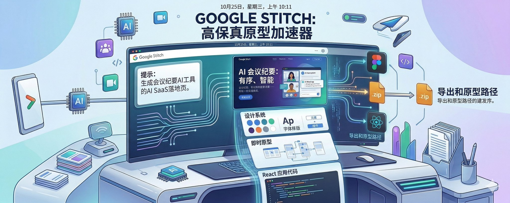
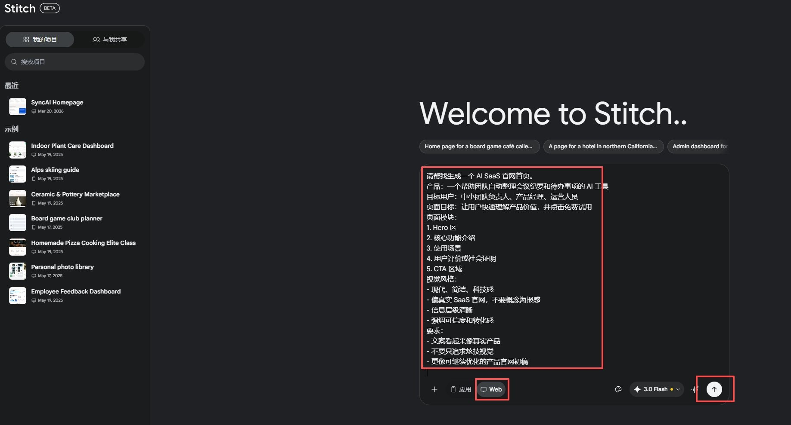
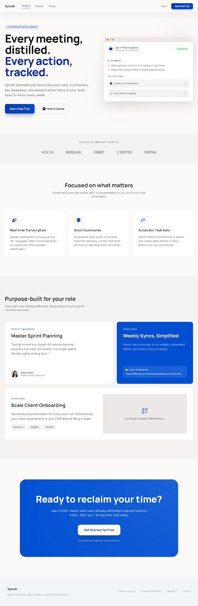
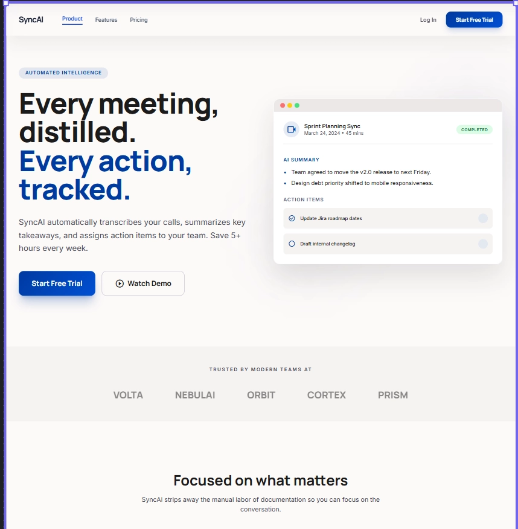
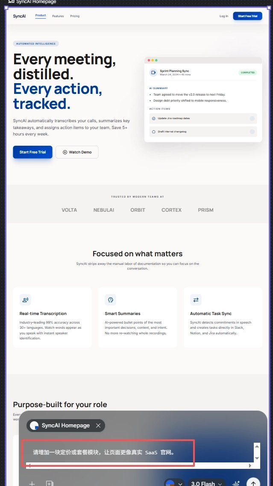
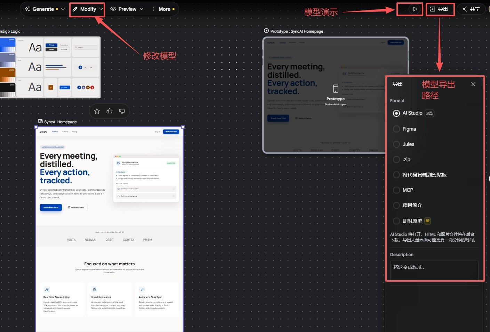
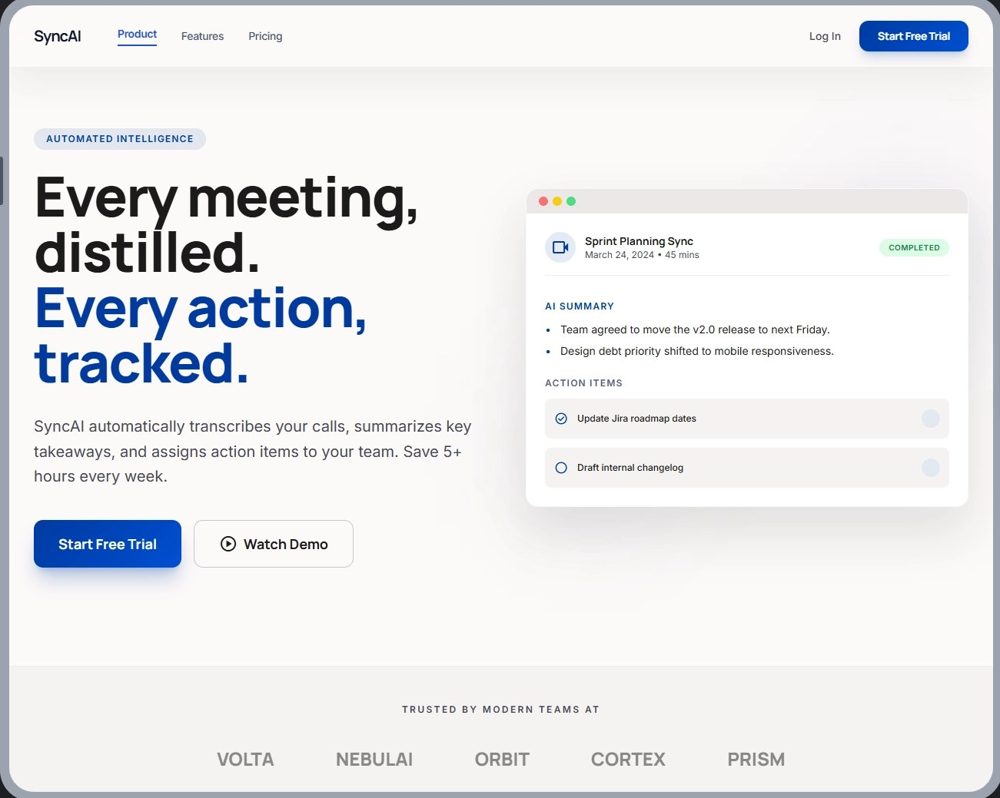

# 我用 Google Stitch 做了一个 SaaS 官网，发现它真正强在这一步



我拿 Google Stitch 做了一个真实的 AI SaaS 官网首页。最有意思的点在于它已经开始把“从需求到前端原型”的一段过程压缩到一起。

最近我又重新看了一遍 Google Stitch，想验证一件更实际的事：

它到底只是一个会出界面图的工具，还是已经能把一个产品想法更快地推到前端原型这一步？

为了避免空谈，我先给了它一个真实任务：做一个 AI SaaS 官网首页，先把具体问题跑一遍。这个产品的核心价值很明确，就是自动整理会议纪要、提炼摘要、跟踪待办事项。

换句话说，我更关心的是它能不能把一个具体需求，比较快地变成一个足够像样、足够可讨论、甚至能继续往前端原型推进的初稿。

这篇文章我就按真实使用过程来写：我当时是怎么描述需求的，它第一版给了我什么结果，哪些地方已经很有价值，哪些地方还只是方向稿，以及页面出来之后下一步到底该怎么处理。

## 一、我先把需求说清楚



很多人第一次用 Stitch，最容易做的一件事，就是输入一句：

“帮我做一个 AI SaaS 官网。”

这样当然也能出结果，但大概率只会得到一张“像官网”的图，不一定是一个真的能继续往下做的页面。

我这次没有这么写。

因为我真正想验证的是，它能不能把一个真实产品需求更快地推到“前端已经能开始还原”的程度。

所以我先把需求拆开了说。大概是这样：

```Plain Text
请帮我生成一个 AI SaaS 官网首页。

产品：一个帮助团队自动整理会议纪要和待办事项的 AI 工具
目标用户：中小团队负责人、产品经理、运营人员
页面目标：让用户快速理解产品价值，并点击免费试用

页面模块：
1. Hero 区
2. 核心功能介绍
3. 使用场景
4. 用户评价或社会证明
5. CTA 区域

视觉风格：
- 现代、简洁、科技感
- 偏真实 SaaS 官网，不要概念海报感
- 信息层级清晰
- 强调可信度和转化感

要求：
- 文案看起来像真实产品
- 不要只追求炫技视觉
- 更像可继续优化的产品官网初稿

```

这段话看起来有点长，但重点是把几件关键的事一次讲清楚：

- 这是什么产品
- 这是给谁看的
- 我希望页面先解决什么问题
- 页面至少要有哪些部分
- 我不想要什么样的结果

我现在越来越觉得，这类工具更吃“清楚的表达”，灵感反倒没那么关键。

你说得越像一个真实产品需求，它给你的结果就越可能像一个真实项目的起点；你说得越模糊，它给你的就越像一张好看的演示图。

## 二、第一版结果出来后，我最意外的是它已经像个页面了



实际生成出来之后，我最意外的点不在于它有多炫，而在于它已经具备了比较明确的产品页结构。

先看首页最上面的 Hero 区。标题和画面没有停在“概念感”，直接把产品价值放到了第一屏：会议内容被提炼、行动项被跟踪、信息被自动整理。对于一个 AI SaaS 来说，这种表达方式是成立的，因为用户第一眼最关心的是“你到底帮我省了什么事”。

再往下看，功能区、角色区和底部 CTA 也都已经出现了。这意味着 Stitch 给出的不止是一张首屏图，更像一套带有基本转化思路的 landing page 骨架。它已经在尝试组织页面节奏：先讲核心价值，再讲功能，再讲适用场景，最后给出转化按钮。

这种结构不一定完美，但已经远远超过“只会拼一个漂亮页面”的层面了。

更有意思的是，项目里并不只有这一个页面。除了首页画板，我还看到了设计系统板和 Prototype 板。前者更像是在交代这个页面的视觉语言和组件方向，后者则说明它并不只是在出静态结果，而是在往“可演示原型”这一步多走一点。

这也是我觉得它值得认真看的地方：它给你的不止是一张结果图，而是一套更接近实际工作过程的内容。你可以把它理解成一个高保真起稿包，而不是一张终稿。

## 三、怎么判断这版结果值不值得继续做



当然，第一版生成得“像样”，不等于它已经可以直接上线。

判断一版 Stitch 结果值不值得继续推进，我现在会重点看 4 件事。

第一，信息层级是不是清楚。比如 Hero 区里，标题有没有直接讲清产品价值，按钮是不是能承担转化作用，右侧示意图是不是在支持核心卖点，而不是只当装饰。如果第一屏讲不清楚，后面再好看也很难救回来。

第二，模块完整度够不够。一个真实 SaaS 官网通常不会只有 Hero 和几个卡片，它还需要功能拆解、适用场景、信任背书、转化收口等部分。Stitch 这次已经把其中大部分骨架搭出来了，所以它是“可继续推进”的，而不是“需要推倒重来”的。

第三，页面是不是有真实业务感。很多这类工具生成出来的问题，往往不是不好看，更多是太像模板。标题很大、配色很顺、按钮很亮，但内容看完以后你不知道这个产品到底解决什么问题。相对来说，这次的页面已经有了比较明确的产品语境，所以它更像真实产品页，而不只是演示稿。

第四，能不能很自然地进入下一轮修改。这是最关键的一点。因为它的价值并不只在“第一次生成”，而在于你能不能基于这版结果继续改：改 Hero、补模块、增强转化、提高真实产品感。如果一版稿子虽然好看，但完全没有办法接着往下推，那它对真实工作就还是有限的。

从这个角度看，这次生成结果是过关的。它还不是生产级设计稿，但已经是一个前端可以开始还原、产品和设计可以一起讨论、团队可以围绕它继续迭代的起点。

## 四、第一版出来之后，我没有急着导出，而是先想清楚还差什么



我觉得这里特别像真实工作里会发生的事情。

因为第一版页面出来之后，最自然的反应通常是：这玩意能不能直接用？能不能导出？能不能交给前端？

但我这次用下来，反而更强烈的感受是：先别急着导出，先想清楚还要改什么。

第一版再完整，也只是方向正确的高保真初稿，离最后答案还有距离。这个阶段最值钱的是继续顺着它往下推。

比如这次如果我要继续改，我大概会这样说：

```Plain Text
请增加一块定价或套餐模块，让页面更像真实 SaaS 官网。

```

你会发现，这一步其实已经从“让它帮我画图”，变成了“拿着一个已成型的页面继续往真实产品页推进”。

这也是我觉得 Stitch 真正有意思的地方：它最有价值的时刻，在于你开始围绕结果继续修改。

换句话说，生成只是开始，修改才是实操价值所在。

## 五、页面出来之后，下一步到底怎么处理



这一步我也专门看了它的后续路径，结论比我预期里更清楚一些：它提供的是几条完全不同的往下走的方式。

目前比较值得关注的几类出口，大致可以这样理解：

- 项目简介：更像生成项目说明或产品需求文档
- 即时原型：更偏演示和验证用途
- Figma：更适合设计协作链路
- Stitch React 应用：更接近前端继续落地
- .zip / 将代码复制到剪贴板：更适合把结果直接交给前端处理

这意味着，页面出来之后，最先要做的其实是想清楚“我接下来想把它推进到哪一步”。

如果你只是想快速演示一个产品方向，那 即时原型 就已经很有意义。它更像一个帮助你展示流程、讲产品故事、做内部评审的出口。



我自己点开之后的感受是：页面可以上下滑动，按钮也有颜色和触觉反馈，但不会真的跳转。这让我更确定它的定位——即时原型更像“可演示的高保真预览”，适合评审节奏和结构，但不等于完整交互稿。

如果你还在设计协作阶段，那 Figma 会更顺，因为它方便继续走熟悉的设计工作流。

但如果你的目标已经很明确，就是“我想把这版设计尽快推进成一个前端可跑原型”，那最值得关注的其实是 Stitch React 应用、.zip 和 复制代码 这几条路径。

更准确地说，这里是一套“生成之后往哪走”的分流选择。

## 六、它能不能直接变成前端原型

我的判断是：可以，而且这正是它现在最有现实价值的地方之一。

但这里要说清楚，“可以做前端原型”和“可以直接当生产代码”完全不是一回事。

为什么说它适合做前端原型？因为它已经把几个最耗时间的前置环节压缩掉了：

- 页面结构先搭出来了
- 视觉层级已经有了
- 模块节奏已经开始形成
- 文案方向也不是完全空白
- 甚至连原型和设计系统线索都一起给出来了

这对前端来说很有用。很多时候前端不缺实现能力，缺的是一个足够清晰、足够完整、足够像样的起点。Stitch 恰好能把那个起点更快给出来。

但为什么又不能直接把它当生产交付？

因为它通常还缺很多真实上线必须补的东西：

- 响应式细节未必完整
- 组件规范不一定统一
- 状态、交互、异常场景常常没补全
- 可访问性、语义化、性能都没校验
- 真正复杂的业务逻辑仍然是空的

所以更准确地说，Stitch 最适合承接的是这一步：

模糊需求 -> 高保真页面草案 -> 前端可还原原型

而不是：

模糊需求 -> 一步到位生产代码

如果拿它来做 landing page demo、内部评审原型、产品方向验证，甚至是静态前端展示页的起稿，我觉得都很合适；但如果你想让它直接替代完整设计与工程交付，那就会高估它了。

## 七、我的结论：它最值得看的，是它压缩了哪一段过程

用完这一轮之后，我对 Stitch 最大的感受反而是：它把以前很分散的一段过程收拢到了一起。

以前从一个产品想法到前端原型，中间通常要经过很多跳板：文档、线框图、方向讨论、视觉草稿、页面结构梳理、原型演示。现在 Stitch 正在尝试把其中相当一段压缩成一个连续动作：

说清需求 -> 生成高保真页面 -> 继续修改 -> 变成可演示原型 -> 继续往前端推进

这也是我觉得它真正值得关注的地方。

它谈不上是在替代设计师或前端，更像是在加速“从想法到可讨论界面”这段流程。对于产品经理来说，它能更快把抽象需求变成具体页面；对于设计师来说，它能更快试方向、出高保真起稿；对于前端来说，它能给出一个远比空白文档更容易接手的原型起点。

所以如果一定要给 Stitch 一个现在最准确的位置，我会这么定义：

**它还不是生产级交付工具，但它已经是一个很强的高保真原型加速器。**

而这，已经足够有用了。

> 你怎么看这类工具？你觉得它更像设计助手，还是更像原型加速器？欢迎留言聊聊。

---

> 来源：飞书 · AI Spark 知识库 ｜ 原文（最新版）：<https://lcnniolukk80.feishu.cn/wiki/GotdwPnBeidfzhkGypkck3mznic> ｜ 归档：2026-06-04
