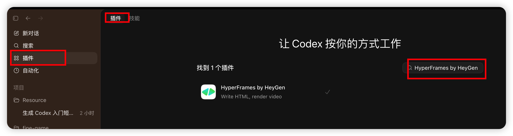
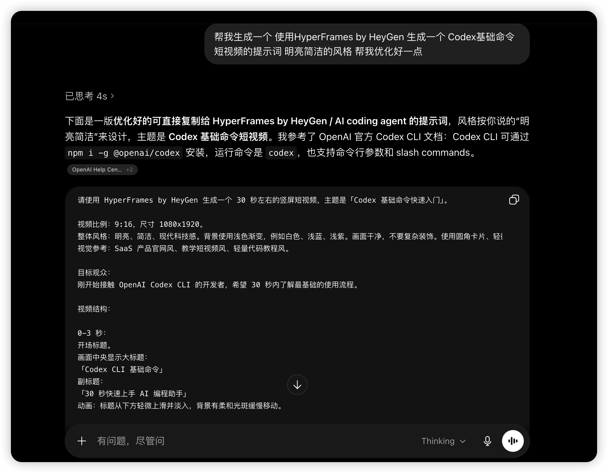
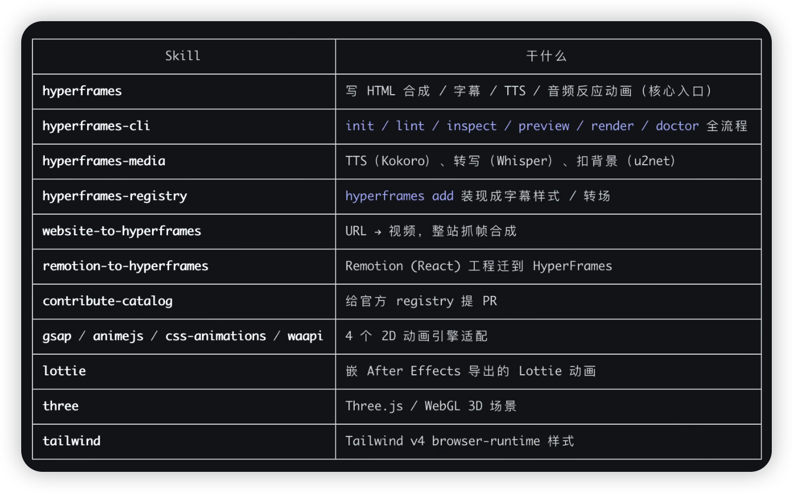
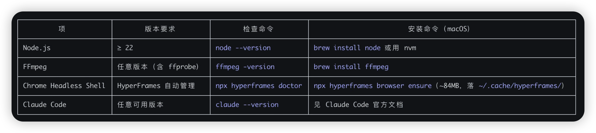

# 找不到高颜值视频素材？我用 Codex 与 Claude Code 跑通了 HyperFrames

做自媒体一直缺素材是不是一直都缺素材？。我也有一样的困扰，但是前几天我在网上刷到有人用 Codex + HyperFrames by HeyGen 生成视频，看起来效果还不错，于是好奇心一上来我马上自己也去试一遍。

HyperFrames by HeyGen 其实不复杂，它只是把 AI 写的 HTML/CSS/JS 直接渲染成 mp4 的工具——你给它一段详细的提示词，它会把每一帧的页面布局、动画、字幕都生成好，然后用一个无头浏览器抓帧合成视频。在自己的电脑就能跑，不依赖 HeyGen 自己的云端服务。

一开始我看视频，是使用 Codex APP+HyperFrames by HeyGen跑的，我也学着跑了一条 30 秒的成片，效果直接惊艳到我了。后面我也突发奇想，既然Codex可以跑不妨试试Claude Code是不是也可以跑呢？毕竟Claude的强度还要高于GPT的，想到马上就开干。

这也就是我为什么要写这篇文章的原因，记录一下自己的踩坑记录还有就是遇到的问题，让大家也可以再也不用为了素材发愁。

---

## Codex APP 这条路：插件菜单点一下就跑起来了

我这里演示和讲解的都是桌面端的 App ，主要是很顺手和方便，全程界面操作就完事了。

第一步：打开 Codex APP，进应用内的**插件菜单**

第二步：搜 `HyperFrames by HeyGen`，点击安装就完事了。不用重启 App、不用重载会话，下一句对话就能调用。



主要是一开始我也没使用过HyperFrames by HeyGen这个插件，直接去网页跟GPT了解了一下，直接就询问GPT要了一份提示词，发现生成的效果很好，大家没思路的时候也可以直接询问AI要提示词。

```
帮我生成一个 使用 HyperFrames by HeyGen 生成一个 Codex 基础命令短视频的提示词，明亮简洁的风格，帮我优化好一点
```

这里GPT 会输出一整段排版好的提示词。把里面的「Codex 基础命令」和「明亮简洁的风格」换成你自己想做的题材和风格关键词，剩下的 GPT 都帮你写好。完整提示词太长我这里就没有复制过来，其实参考的一样不大，你可以自己询问GPT然后跟着他的反馈提示词去优化就好了。



> 注意：用 GPT 写提示词这一步不是必须的，但 HyperFrames 对画面节奏、字幕、转场的描述很吃细节，自己手写大概率会漏，让 GPT 帮你把这一层补齐效率高很多。

后面就是把提示词复制到Codex的聊天窗口，按下回车以后 Codex APP 自己跑 HyperFrames 全流程：init 项目 → 写 HTML/CSS/GSAP → lint → render，整套下来 10 多分钟，输出一条 30 秒 1080×1920 的竖屏 mp4。


说实话第一看到的时候惊艳到我了，因为成片不管是节奏、转场、还是颜色搭配都没崩，如果是对一般的自媒体创作者来说这个素材已经够用。下面就是 Codex APP 跑出来的那条 30 秒成片：


---

## Claude Code 这条路：没插件市场就本地装 skill

当Codex APP 那条片跑出来，其实我脑子里出现了一个新的想法，能不能把 Claude Code 也拉进来跑了一遍。

因为在我自己的主观意识里面，Claude是比GPT更强大的那跑出来的效果是不是更好呢？

我就马上开始了尝试，结果卡的就一个点：Claude Code 官方还没给做集中的插件市场，所以 HyperFrames 这一套 skill 没法在 App 内一键装，只能命令行本地装。

> 延伸阅读：还没装 Claude Code 的看这篇 [Claude Code 安装教程：Mac、Windows、Linux 从 0 到跑通](../../02｜AI%20工具与大模型/AI%20工具教程.md)

如果是Claude Code去运行的时候，你要在你要创作的项目目录下面跑这个：

```bash
GIT_LFS_SKIP_SMUDGE=1 npx skills add heygen-com/hyperframes
```

> 避坑提示：前面那个 `GIT_LFS_SKIP_SMUDGE=1` 环境变量一定要带上。HyperFrames 仓库里有大概 240MB 的 mp4 测试基线走 Git LFS，使用方用不到那些文件，不带这个环境变量会卡在拉 LFS 那一步。

跑完这条命令会把 15 个 skill 全部装进当前项目的 `.agents/skills/` 下（项目级；加 `-g` 才装到全局位置）。这样你的skill 一进来 Claude Code 就可以立即识别到了。装完后能看到这一整套：



接下来按 Claude Code 的提示去完成基础环境的安装。完整清单是：

- Node.js ≥ 22（旧版会在合成器阶段直接报错）
- FFmpeg（含 ffprobe）
- Chrome Headless Shell（HyperFrames 自管理那一份，84MB，不动系统 Chrome）

也可以照着这张表格逐项查检查命令和 macOS 安装命令：



如果担心安装前会不会出问题，可以先来一遍环境装自检：

```bash
npx hyperframes doctor
```

大家的的电脑不一样，但是第一次跑大概率会看见这样差不多的输出：

```text
hyperframes doctor

  ✓ Version          0.6.52 (latest)
  ✓ Node.js          v24.14.1 (darwin arm64)
  ✓ CPU              10 cores · Apple M4 @ 2400MHz
  ✗ Memory           16.0 GB total · 0.3 GB free
                     Low memory — renders may fail. Close other apps or increase RAM.
  ✓ Disk             600.5 GB free
  ✓ FFmpeg           ffmpeg version 8.1.1
  ✗ Chrome           Not found
                     Run: npx hyperframes browser ensure
```

> 风险提示：如果Memory 那一行如果黄字提醒 Low memory，可以先关一波后台的应用释放内存——不然渲染的时候容易 OOM。我这台 16GB Mac 我是留了 2GB 以上的内存空间。

然后就可以再跑一次 doctor，应该就没有问题了。这个时候就帮你刚才的提示词，原原本本的在丢给Claude Code跑一变全流程，我这里Claude Code 跑完整流程比Codex快了几分钟，也是输出了一个30s的视频。


如果你能跟着走到这里，基本上你也和我一样两条路线都跑通了，其实过程并不复杂。Claude Code 那条卡了一下——主要是官方没有给 Claude Code 用的插件市场，但是 skill 可以直接复制过来本地装。

Claude Code生成的视频还是不错的，甚至有一些页面比 Codex 原版生成的还要好。

---

## 两条片放一起看，Claude Code 有几页反而更出彩

其实整体看完两条片，你会发现Codex APP 生成的那条视频节奏更稳，Claude Code 那条是在某些页面的视觉表达上更出彩。这不是说 Claude Code 全面更好——只是在我跑的这两条同主题的对照里，确实有几页 Claude Code 写出来的 HTML 排版我更喜欢。

尤其是开头的处理，会让我感觉到更高级，但是在一些页面文字的细节处理上Claude生成的就没有GPT生成的那么好了。

但是这两个都是只跑了一遍的结果，Claude Code跑完是给了一些建议的，如果根据建议再跑一轮我相信效果会更好。

---

## 跟下来其实就这么简单：新工具就值得不同平台都试一遍

如果你也想跑一条试试，我这里整理了最小起步清单就这三步，不需要你手动完成，直接丢给AI就好，毕竟现在很多事情我没问都不需要自己动手了：

```bash
# 1. 自检环境（Node 22+ / FFmpeg / Chrome Headless Shell）
npx hyperframes doctor

# 2. 缺 Chrome 时补一句
npx hyperframes browser ensure

# 3. Claude Code 路线装 skill（Codex APP 走应用内插件菜单就行）
GIT_LFS_SKIP_SMUDGE=1 npx skills add heygen-com/hyperframes
```

提示词这一步我也建议偷个懒，可以直接问网页版 GPT：

```
帮我生成一个 使用 HyperFrames by HeyGen 生成一个 <你的主题> 短视频的提示词，<你想要的风格>，帮我优化好一点
```

其实整体跑下来，你会发现其实很简单。我也建议你和我一样看到新鲜的东西就去试，而且最好不同平台都试一遍——因为核心其实就是 AI 智能体。跟着教程做一遍，你也可以完成自己的小作品。

我也希望你的自媒体道路，永远不缺素材！

---

## 延伸阅读

- [Claude Code 安装教程：Mac、Windows、Linux 从 0 到跑通](../../02｜AI%20工具与大模型/AI%20工具教程/Claude%20Code%20安装教程：Mac、Windows、Linux%20从%200%20到跑通.md) — 前置环境
- [GitHub 狂揽 10.7k Star！这款飞书神器配合 AI Agent](../智能体应用案例/GitHub%20狂揽%2010.7k%20Star！这款飞书神器配合%20AI%20Agent，工作流彻底起飞了.md) — 另一条 AI Agent 实战
- [高强度实测 6 大 AI 模型：Claude 写文最强，但我写代码不选它](../../02｜AI%20工具与大模型/工具测评/高强度实测%206%20大%20AI%20模型：Claude%20写文最强，但我写代码不选它.md) — Codex 跟 Claude 拉开了哪些差距

## HyperFrames 渲染流水线


---

> 来源：飞书 · AI Spark 知识库 ｜ 原文（最新版）：<https://lcnniolukk80.feishu.cn/wiki/VBmUwo60IiYeDDkbAaZciEiPnYe> ｜ 归档：2026-06-04
