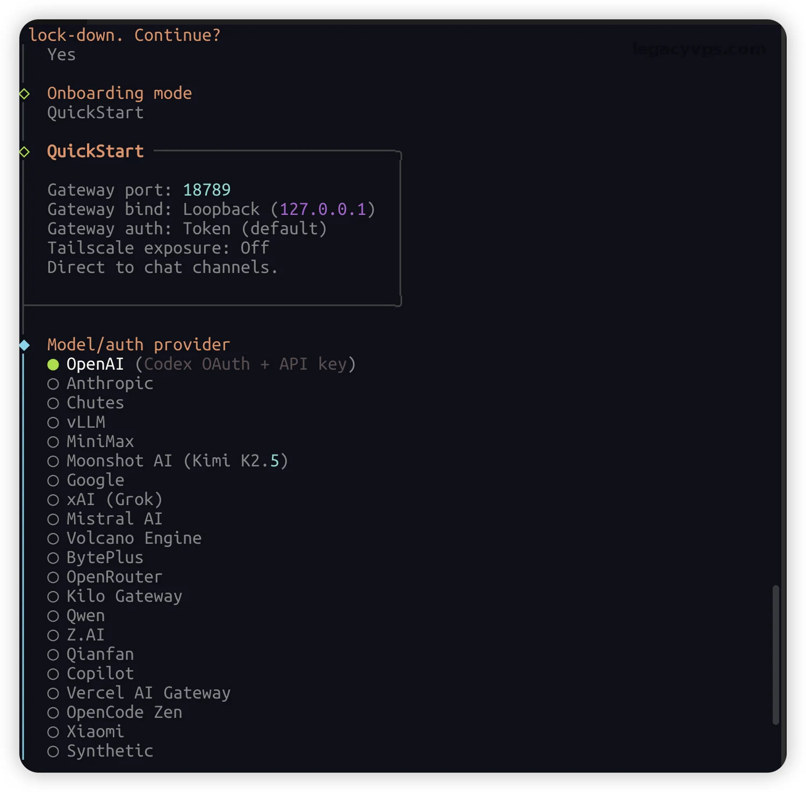
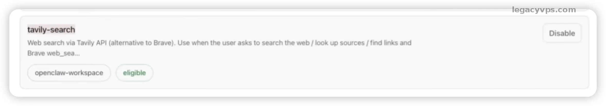

# OpenClaw 初级到高级完整教程

> **导语**：时间来到2026年，如果你还没有听过OpenClaw的大名，那你可能说明你已经和AI社会脱节了。今年GitHub上狂飙6.8万Star的 **OpenClaw**（曾用名ClawdBot），超越了Linux和React登顶第一的位置。今天这篇文章，我将手把手原生的安装和一些玩法。

## 一、 OpenClaw和普通AI的区别？

你可能听过MCP和Skills的这些概念，但是在实际过程还是对这些东西没有概念，今天我也不讲概念直接实操安装几个有趣的Skills就可以让你体验到它们有什么区别。

OpenClaw 最大的区别是拥有你服务器的所有权限，可以直接调用系统权限进行你的指令，完成你的需求。比如整理文件、查看网络网站。

OpenClaw的核心在于它拥有真实的**行动力**，以下就是它的优点：

1. **真·本地执行**：私人的数据，比如API KEY、Skills、提示词全留在你自己的硬盘里，不用担心云端泄露。
2. **多端无缝接入**：现在腾讯亲自下场可以对接微信、QQ、Telegram、Discord、飞书等软件，一个入口就能发号施令（国内用户我还是推荐对接QQ、飞书）。
3. **长期记忆系统**：它会自主保存你的习惯信息，逐渐摸清你的作息、说话语气和工作流，用得越久越顺手。
4. **绝对的开源自由**：框架完全免费，你只需要自己出点API的过路费（这也是最贵的地方，服务器都不是最主要的，消耗的Token才是最主要的事情，因为会存储上下文越使用上下文会越大）。

## VPS的选择

很多人问我运行OpenClaw的最低配置是多少，我的建议是如果是简单运行最低只需2GB内存就足够了，但是果然喜欢折腾我建议还是在8GB或者以上，在足够应付。

因为有的人会安装很多的Skills或者浏览器等软件，内存越大折腾的空间肯定也是越大。

---

## 二、 基础篇：OpenClaw安装

OpenClaw现在的安装门槛已经很低了但是我这里还是提供了两种安装方式。不管你是Mac、Linux还是Windows（需装WSL），只要跟着走就行。

### 1. 踩坑第一步：环境准备

它依赖 Node.js 运行。打开你的终端（Terminal），敲入：

```Plaintext
node --version
```

如果版本号低于 `v22.0.0`，赶紧去官网升个级（老手建议直接用 `nvm use 22`）。

> 如果不会使用nvm的可以参考教程安装：[nvm安装教程](https://geek-blogs.com/blog/linux-install-nvm/)

### 2. 极简安装与初始化

小白我强烈建议直接用 npm 全局安装，干净利落：

```Plaintext
npm install -g openclaw
openclaw --version # 检查是否安装成功
```

如果你有代码洁癖，或者是Docker老鸟，直接拉镜像跑容器是最稳的：

```Plaintext
docker run -d --name openclaw -v ~/.openclaw:/root/.openclaw openclaw/openclaw:latest
```


安装完后，执行初始化向导：

```Plaintext
openclaw onboard
```

这时候屏幕上会跳出几个选项，主要是让你绑定大模型的API Key（推荐 Claude Pro 或 GPT，如果想省钱可以用 起因的第三方聚合服务）。**注意：新手在配置系统权限时，最好还是先选择“沙盒模式（Sandbox）”**，别一上来就给最高权限，以防它把你的系统文件给误删了。



### 3. 对接上聊天软件

OpenClaw 本身没有花哨的UI（虽然可以输入 `openclaw dashboard` 看网页端），但是我还是推荐他绑定到你常用的聊天软件上，我这里嫌麻烦直接使用已经设置好的Telegram。

以 Telegram 为例： 去找 `@BotFather` 申请一个新机器人的 Token，然后在终端里绑定：

```Plaintext
openclaw config set channels.telegram.botToken "你的_BOT_TOKEN"
openclaw config set channels.telegram.enabled true
```

现在，打开TG，对它说一句：“你好”如果它秒回你，恭喜，你的私人助理正式上线。


---

## 三、 进阶篇：安装Skills

OpenClaw 的强大在于它的 **Skills（技能机制）**。你可以把它理解为微信小程序，缺什么功能就装什么，但是也要注意Skills的安全，尤其是你看到别人推荐的Skills感觉很好玩，就直接安装。

我的建议是，可以先让AI去审查Skills里面包含的代码和信息，看看是干嘛的而且最主要的是否安全，因为Skills投毒已经是一个安全隐患了，所以在使用过程中还是需要有一定的安全意识。

### 1. 玩转技能市场

这里推荐几个我经常使用的Skills，你自己根据实际情况去安装：

```Plaintext
# 邮件、日历、文件整理、联网搜索
openclaw skills install @openclaw/email-manager
openclaw skills install @openclaw/calendar
openclaw skills install @openclaw/file-organizer
openclaw skills install @openclaw/tavily-search
```

> 在页面菜单上，也可以使用一些OpenClaw内置的Skills，但是一般都和Mac 深度绑定，如果你的不是Mac电脑可能就没那么多玩法，这也就是上面最近Mac Mini卖的那么火的一个原因。



### 2. 打通谷歌全家桶（生产力暴增）

如果你你想玩 Google Workspace或者其他谷歌的生态，那这一步你就肯定需要去做。注册Google Cloud 然后在后台开个服务账号，拿到 JSON 凭证文件后执行：

```Plaintext
openclaw config set integrations.google.enabled true
openclaw config set integrations.google.credentialsPath "/你的路径/credentials.json"
openclaw integrations google authorize
```

> 教程可以参考谷歌官方文档：[文档地址](https://docs.cloud.google.com/iam/docs/service-account-creds?hl=zh-cn)

**爽感体验**：设置完成之后，你可以直接在手机TG上给它发语音：“帮我查下明天的日历，如果没有冲突，下午3点约张三开个项目复盘会，顺便用Docs建个会议记录模板。”它会立刻在后台把邀请发出去、文档建好，并把链接扔回给你，你就完美的嵌入了谷歌的生态当中了是不是很完美？。

### 3. 定时任务

我最比较喜欢使用的功能，你不需要额外的配置，因为他是OpenClaw内置的功能，你只需要对话的方式告诉他就可以： 列子：*“从今天起，每天早上8点给我发一份简报，包含今天天气。”*

OpenClaw 会自动把这段话转化为底层的 Cron Job 并在后台静默运行。你可以随时用 `openclaw cron list` 查看它后台有多少定时任务在运行，也可以直接通过UI查看就在定时任务的菜单里面。

---

## 四、 高级玩法指南

其实上面的内容你可以掌握已经超越了很多人了，但是你不满足于此的话，可以玩一些高级的方式。

### 1. 手搓自定义技能 (YAML编写)

举个例子，你想搞个“每日科技新闻摘要”。去 `~/.openclaw/skills/` 目录下建个 `news.yaml`：

```Plaintext
name: "每日新闻摘要"
triggers: ["今日新闻", "科技新闻"]
steps:
  - action: web_search
    query: "latest tech news today"
    max_results: 5
  - action: summarize
    content: "{{search_results}}"
  - action: respond
    message: "📰 今日科技摘要：\n{{summary}}"
```

跑一下 `openclaw skills reload`，你的专属技能就生效了，下次你如果需要新闻直接唤醒它让他告诉你今日新闻摘要，他就会自己找到相对于的Skills，然后搜索修改内容然后输出一份简报了。

### 2. 小龙虾多开模式（我还没折腾成功）

如果你想有多个身份的小龙虾来帮你处理不同的工作或者事情。你就可以通过以下命令来设置多个小龙虾来帮你干活，每一个OpenClaw都有不同的身份和性格：

```Plaintext
openclaw create-agent work      # 工作号，连公司邮箱，用聪明的 Claude 模型
openclaw create-agent personal  # 生活号，管家庭账单，用便宜的普通模型
```

通过 `openclaw switch-agent` 随时切换，互不干扰。

---

## 五、 踩坑的建议

根据我自己在一些技术群和自己的小群里面了解的看到过很多的翻车案例，所以我强烈建议做好以下几个方面：

*1. API频率限制* 如果你让它使用的是OpenRouter之类的充值类第三方API，你不设置API的限制可能在执行某些长任务的时候你忘记了停止，又或者任务实在是太大了。OpenClaw的上下文是会累加的如果不给予限制。到时候你账户里面的几十几百美刀可能就没了，更可怕的是云厂商的计费滞后性可能出现天价账单，所以如果有能力请务必在配置里设个上限：

```Plaintext
openclaw config set ai.dailyLimit 1000  # 限制每日请求次数
openclaw config set ai.monthlyBudget 50 # 设定月度预算50刀
```

*(注：轻度使用每月大概5-10刀，重度折腾准备50刀起步。如果本地硬件性能足够可以配合 Ollama 本地跑 Llama3.2，只需配置* `ai.provider "ollama"`*，缺点是复杂指令理解不是很好这个就看个人的取舍了。)*

**2. 核心数据安全** OpenClaw的权限其实就是一把双刃剑，因为权限足够大所以可以帮你完成任何你想做的事情，但恰恰是因为权限太大，所以如果出现安全问题或者给一个不懂网络和服务器管理的人手里，容易出现大问题。

**建议**比建议在自己的或者公司的主力电脑上运行OpenClaw并且开启Full Access模式。，我更建议使用VPS或者一台单独的电脑去运行OpenClaw，能不暴露在公网尽量就不要暴露在公网上面。

其实默认沙盒模型就很好：配置 Docker 沙盒模式（`openclaw config set sandbox.mode "docker"`）。即便AI抽风想格式化硬盘，也只是在自己的容器里面折腾，对于宿主机来说基本上是没有影响的。

**3. 随时备份，有备无患** 千万别忘了备份你的记忆库和配置文件：

```Plaintext
cd ~/.openclaw
git init && git add . && git commit -m "backup"
```

最好还是把它推送到你的私有Git仓库里或者云盘里面去，因为很多时候我都喜欢把需求直接交给OpenClaw自己去处理，但是如果模型不够聪明，或者获取的文档内容没得到更新，就容易把自己折腾挂掉。

所以最好还是多备份，实在不行也要让他在修改自己的配置文件的时候备份，如果出问题我们只需要手动的恢复备份如果重启OpenClaw就可以了。这可是我的血与泪的教训。

---

## 写在最后

其实很多技术没有你想象的那么复杂，只要你肯花时间就肯定可以学会。再加上现在有AI的支持，学习东西就更简单了。现在国内也在大力发展OpenClaw的生态，深圳已经推出了相关的福利政策以后肯定也是大力发展的一个方向。

我们也不需要害怕，很多时候不会其实也可以让AI自行解决，我们只需要把文档的链接丢给他他就可以自动配置了，但是前提是你的模型足够的聪明。