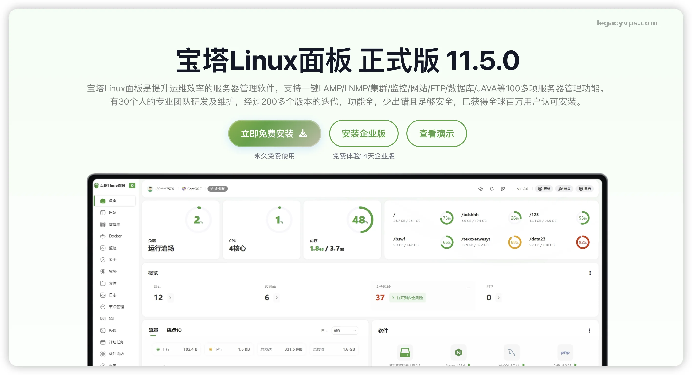
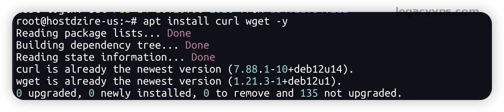
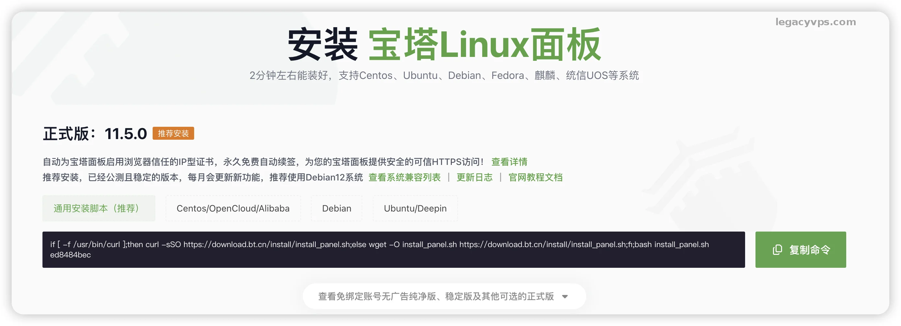
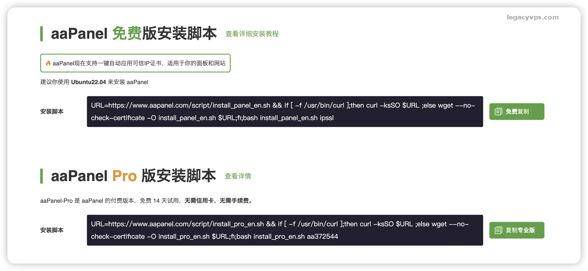
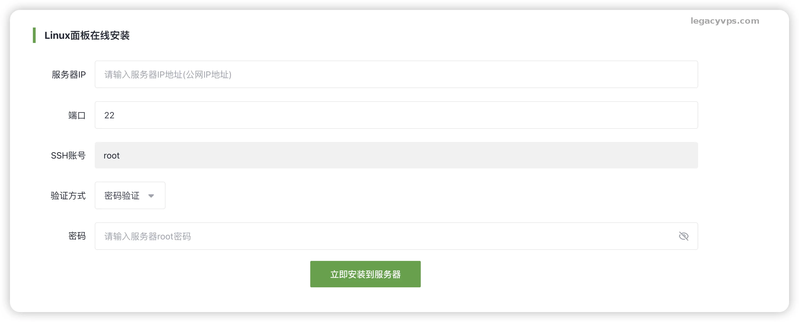
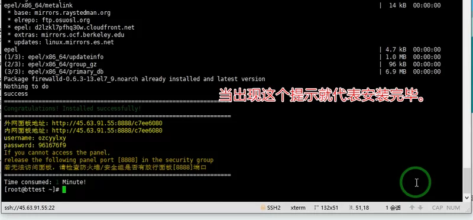
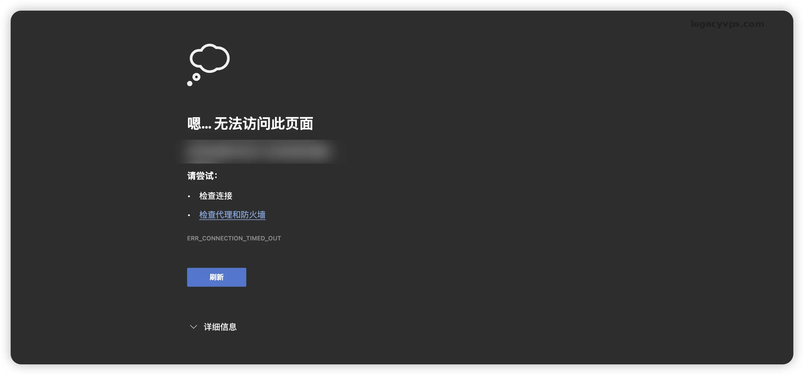
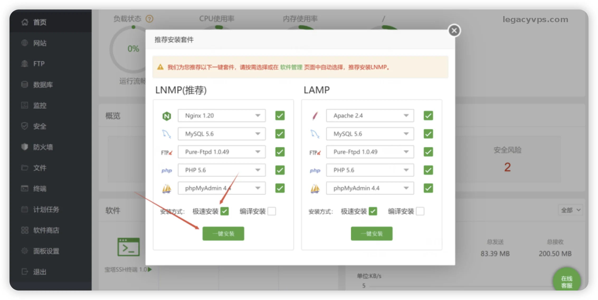
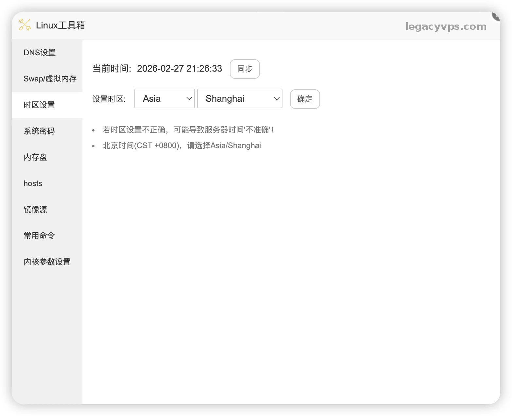

# 【2026保姆级】手把手教你在VPS上搭建宝塔面板

最近一段时间很久没发VPS相关的内容了，因为在折腾新网站。很多兄弟都开始说我“不务正业”了😂，其实是想写点不一样的，但是也不会忘记一开始的目标写一些小白也能看懂的VPS文章。这次写的是我自己比较常用的宝塔面板安装和简单的配置教程。

可能有人会觉得安装宝塔很简单的事情，但是总是会有人不会，而且一些细节问题我想也不是所有人知道。我的教程也是面向小白的，所以我希望我写的每篇教程都能成为小白路上的助力。



## 一、 准备工作

因为使用宝塔面板一般是为了建站，所以需要在开始之前，你得先确认手头有这些东西是不是满足最基本的要求：

1. **一台 VPS 服务器**：

   - **配置建议**：内存最好 **1G 以上**。虽然 512M 也能跑，但如果服务器需要安装 MySQL 之类的数据库的时候就容易因为内存不足而报错，所以建议使用符合要求的服务器配置。
   - **系统要求**：这里的系统没有要求，但是演示的命令都是使用Debian12演示的，确保安装成功我还是建议使用Debian12系统安装。
2. **SSH 连接工具**：

   - Windows 用户推荐 **FinalShell**（免费、好用、自带文件上传）或者 Xshell。
   - Mac 用户直接用终端或者 Termius。

> 这部分就是因人而异了，上面顺手用什么。

## 二、 第一步：连接与系统初始化

拿到 VPS 的 IP、root 账号和密码后，打开你的 SSH 工具连上去。

连上服务器的第一件事，**不是别急着的装面板**。有的Debian 12 安装版本有时候“太纯净了”，连最基本的`curl`命令都没有，所以我建议先把软件源更新一下，避免后续报错。

在终端里依次复制执行下面的命令：

```Plaintext
# 1. 切换到 root 用户（如果你默认不是 root 登录的话，如果是 root 可跳过）
sudo -i

# 2. 更新系统软件包列表（这步很重要，不更可能装不上软件）
apt update && apt upgrade -y

# 3. 安装 curl 和 wget
# Debian 12 精简版经常不带这俩货，不装的话后面脚本跑不起来
apt install curl wget -y
```

看到满屏代码跑完，没报错，我们就准备好了。



> 服务器到手第一件事可以参考：[从零到一：我的 VPS 标准化开荒 SOP，五步打造稳定、安全、高性能的服务器](https://www.legacyvps.com/archives/vps-initial-setup-guide-benchmark-dd-security-optimization)

## 三、 第二步：一键安装宝塔面板

官网上有多个Linux操作系的安装命令，我最建议直接使用通用脚本安装。

复制下面这行命令，粘贴到终端里，按回车：

```Plaintext
if [ -f /usr/bin/curl ];then curl -sSO https://download.bt.cn/install/install_panel.sh;else wget -O install_panel.sh https://download.bt.cn/install/install_panel.sh;fi;bash install_panel.sh ed8484bec
```



*注：如果你的服务器在国外（比如美国、香港），且觉得下载慢，可以考虑用宝塔国际版（aaPanel），或者上面的命令通常会自动选择合适的节点，耐心等待即可。*

**aaPanel的安装命令**

```Plaintext
URL=https://www.aapanel.com/script/install_panel_en.sh && if [ -f /usr/bin/curl ];then curl -ksSO $URL ;else wget --no-check-certificate -O install_panel_en.sh $URL;fi;bash install_panel_en.sh ipssl
```



还有一种安装方式是通过ssh的链接，通过官网的ssh链接安装，我一般不推荐这种方式安装，因为不清楚是不是有ssh泄露的风险。



填入服务器的IP、ssh端口号、密码，就可以自动化安装了。

> 最后一种就是比如腾讯云、阿里云其实都已经内置了宝塔的安装系统，直接选择就可以安装了。但是我一般喜欢自己用纯净的系统重新安装，这个地方也是因人而异了。

**安装过程：**

1. 确保服务器感觉的情况下，系统会问你是否确要安装，输入 `y` 然后回车。
2. 接下来就是跑进度条，根据你的机器性能，大概需要 **2 到 5 分钟**。
3. **【关键时刻】**：当命令跑完，停下来的时候，屏幕上会显示出 **面板地址**、**username（用户名）** 和 **password（密码）**。

⚠️ **一定要把这部分信息截图或者复制保存到记事本里！** 关了窗口就找不到了（虽然能重置，但很麻烦）。



## 四、 第三步：放行端口（很多新手的坑）

很多新手遇到过这种情况：**“明明安装成功了，但给的地址死活打不开！”**,能看到浏览器显示拒绝访问或者等半天都没没有反应。

要不就是你的IP被封锁了，但是99% 的原因是被 VPS 厂商的防火墙挡住了。

- **如果你用的是阿里云、腾讯云、华为云**：去控制台找到“安全组”，放行 **8888** 端口（或者安装完成时显示的那个端口）。
- **如果你用的是 AWS、Vultr、Google Cloud**：去后台找到 Network / Firewall 设置，Inbound Rules（入站规则）放行对应端口。



## 五、 第四步：面板初始化与环境配置

在浏览器输入刚才保存的面板地址（通常是 `http://你的IP:8888/安全入口字符串`）。

1. **登录**：输入刚才给的账号密码。
2. **协议与绑定**：国内版宝塔现在已经不需要绑定手机号，这一点我还是很喜欢的，以前国内版本的宝塔是需要强制绑定宝塔账号的，现在取消了舒服多了，国际版本的就没有这个烦恼但是现在都差不多了，国内版本更新还会快一点。
3. **选择套件**： 登录进去后，会弹出一个“推荐安装套件”的窗口。这里有两个选择：LNMP 和 LAMP。
4. **老司机建议选择：LNMP（Nginx 套件）**

   - **Nginx**：选 1.22 或更高版本（性能好，并发高）。
   - **MySQL**：内存小于 2G 选 **5.7**；内存大于 2G 可以尝试 **8.0**。千万别在 512M 内存机器上装 MySQL 8.0，会炸。
   - **PHP**：推荐安装 **7.4** 和 **8.2** 两个版本（有的老程序依赖 7.4，新程序用 8.2 速度快）。
   - **安装方式**：选 **“极速安装”**（Fast）。编译安装太慢了，要跑几十分钟，没必要。但是如果你是想追求稳定服务器的性能也能跟得上，使用编译安装也是没问题。

点击“一键安装”，然后等待十几分钟就可以安装成功了，这个时间就看服务器的带宽和cup的性能。



## 六、 第五步：额外配置

这一部分就是看你自己需不需要了，因为我建站都是面向大陆用户，所以我会去设置时区和swap的大小。

1. 点击左侧菜单的 **“软件商店”**。
2. **选择搜索框**：填入**Linux工具箱**，然后选择安装
3. **修改默认dns**：1.1.1.1、8.8.8.8。
4. **修改Swap/虚拟内存**：看情况而定，一般是真实内存的1.5倍-2倍。
5. **修改时区**：选择 **Asia Shanghai** 也就是亚洲上海。



> 还有一步至关重要服务器搭建好了，最重要的习惯是 **备份**，所以选择左侧菜单**计划任务**，设置网站和数据库的定时任务，完成自动备份。

---

**最后唠叨一句：** 我知道宝塔安装对绝大部分人来说，都是很简单的，但是很多应用安装的第一步就是安装面板。有了面板和基础环境我们做后续的操作肯定会事半功倍。

肯定也有大神喜欢手搓命令行或者使用docker或者1Panel，这也是一种选择。后续我也会出和1Panel相关的部署和安装教程，先请大家别急。