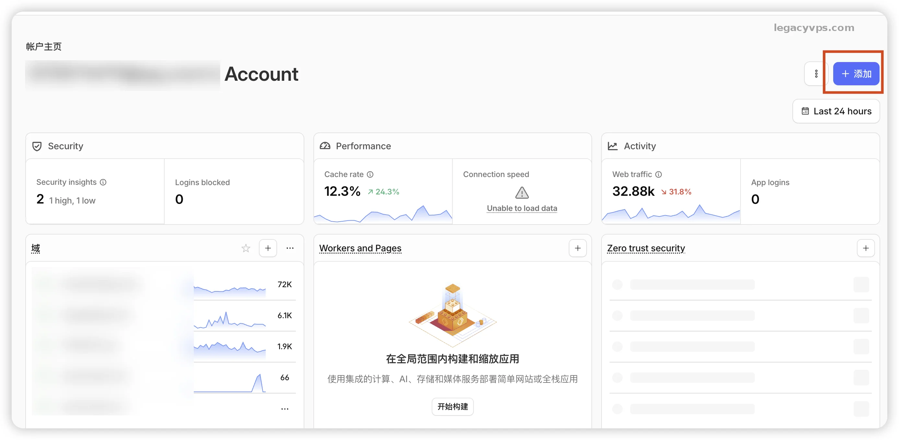
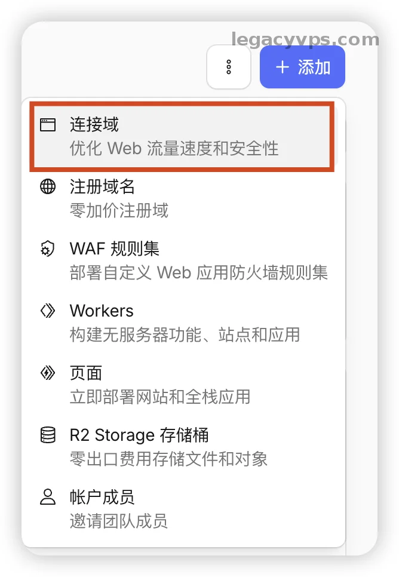
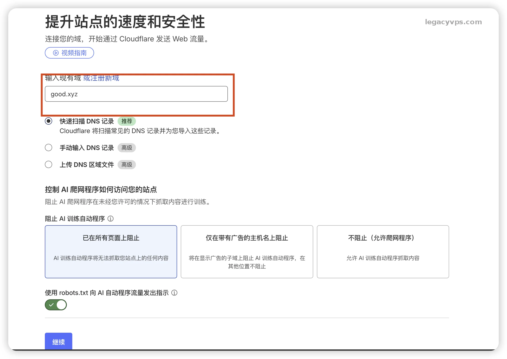
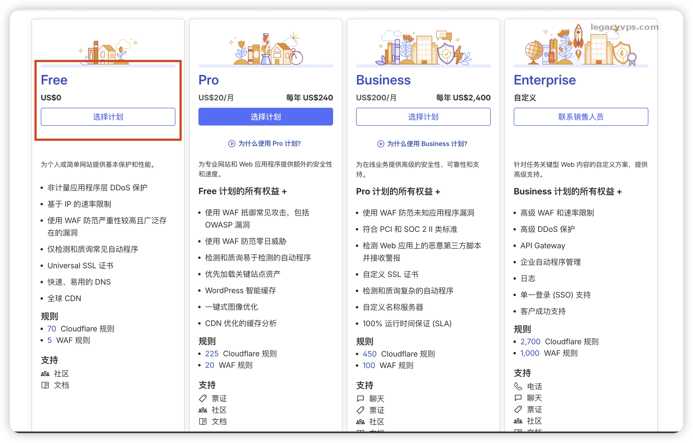
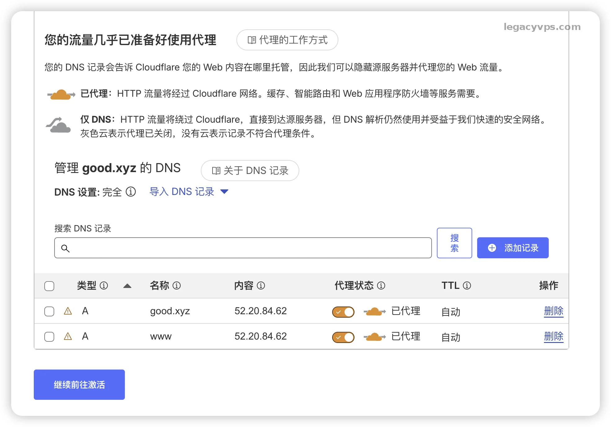
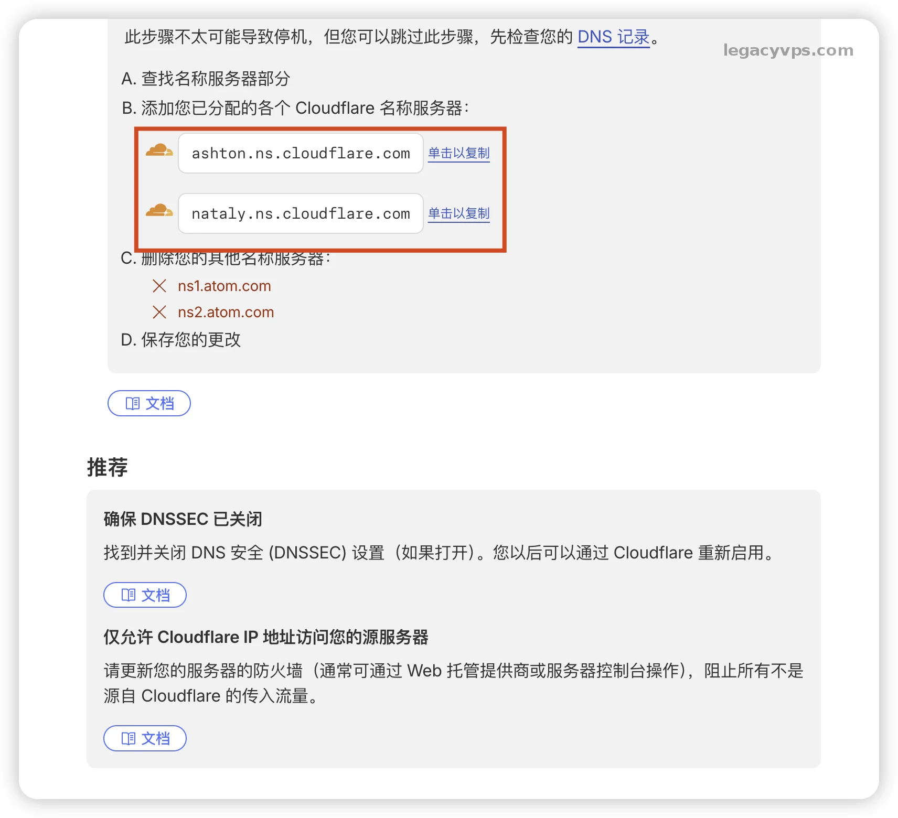
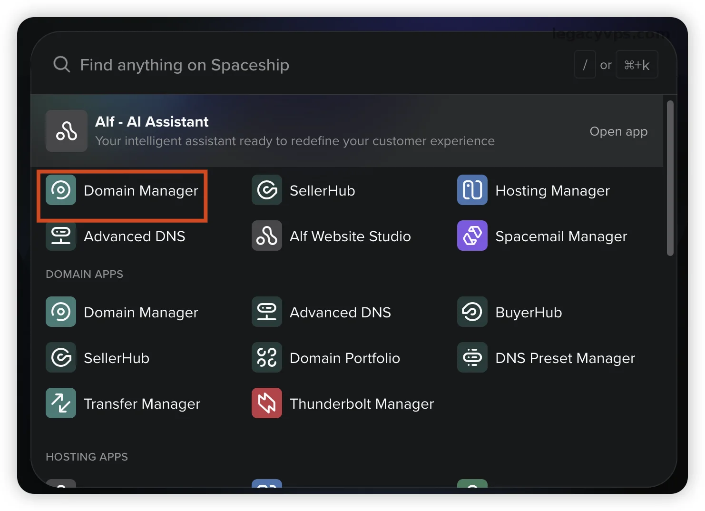
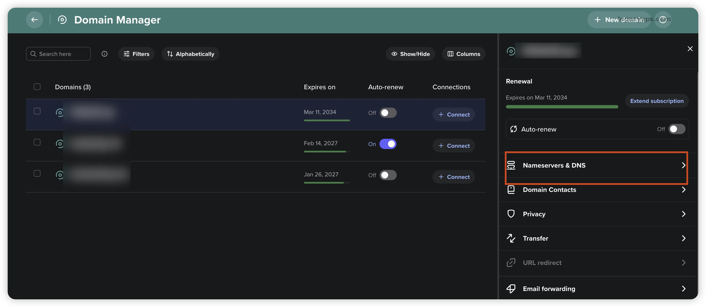
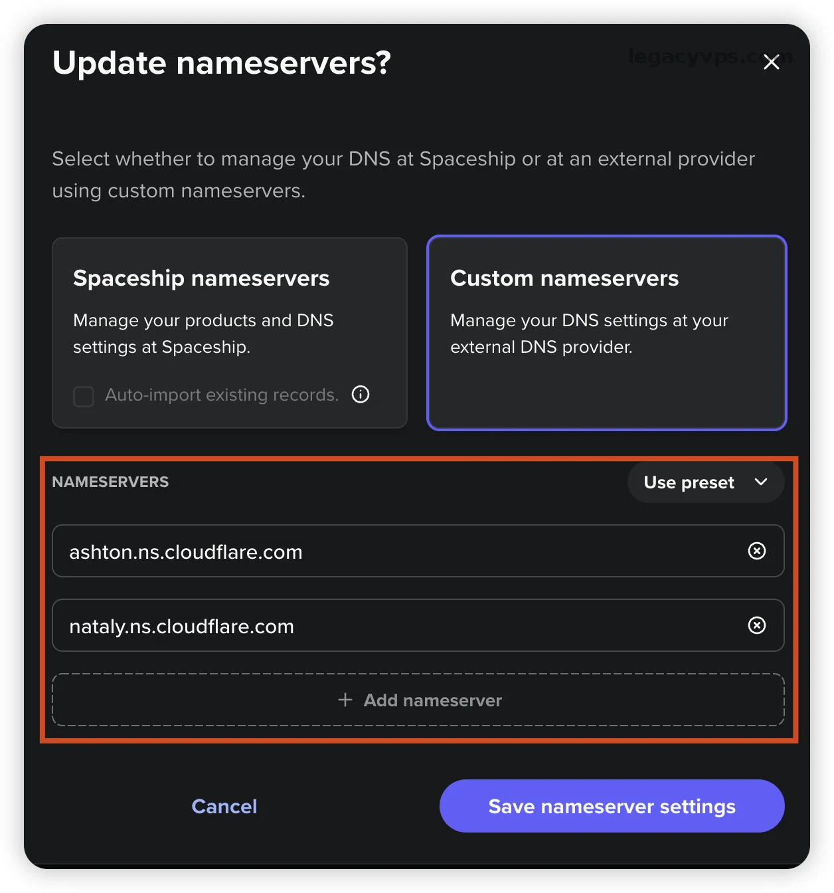
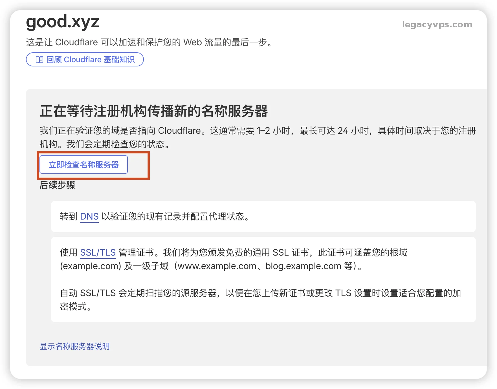

# 保姆级教程：如何将域名无缝托管到 Cloudflare

很多人都想使用CloudFlare，但是第一步是需要把域名托管到CloudFlare。我以为是很正常很简单的操作，但是后面发现其实很多人的是不会的。

今天就以我自己最常用的域名注册商 **Spaceship** 为例，手把手的教你一遍怎么把域名接入 Cloudflare。整个过程如果NS解析生效快的话，大概只需要 5 分钟操作，一杯咖啡的时间就能完成。

## 第一阶段：在 Cloudflare 添加你的域名

**1. 添加域名** 打开 Cloudflare 后台，在账户主页右上角，找到那 **[ 添加 ]** 按钮。然后再弹出的菜单里选择 **[ 连接域 ]**，就这么简单两部。

**2. 输入域名** 输入框里输入你的域名（我这里随便拿了一个域名测试，因为我的域名都托管在了CloudFlare，就写了个假的域名 `good.xyz`）。

> 需要注意前面不需要加 `www` 或者 `http://`，直接填根域名就行，别填错了否则绑定不上去。

**3. 套餐选择** 如果你有钱可以考虑Pro或者其他套餐，但是我们作为白嫖党直接选择 **Free (\$0)** 免费计划已经完全够用了。

**4. 检查 DNS 记录** 这里有一个点要注意，CF托管域名的时候会自动扫描你域名现有的 DNS 记录。直接点第一个方式就好了，会把旧的DNS记录继承过了，就可以无缝的在CloudFlare上托管域名不需要修改其他的内容了。

> 但是需要注意的里面的的“代理状态”。如果你看到**橙色的云朵**（已代理），如果你没有准备好接入CloudFlare CDN的准备，建议不开启，否则容易出现网站无法打开的问题，等你准备好了在开启也不迟。

**可以参考的我教程：**[**Cloudflare CDN 部署教程**](https://www.legacyvps.com/archives/cloudflare-cdn-setup-tutorial)

**5. 获取NS记录 (最主要的一部)** 这一步是这里面最重要的一步。CF 会给你分配两个专用的名称服务器地址（比如图中的 `ashton.ns.cloudflare.com` 和 `nataly.ns.cloudflare.com`），这里只是做演示，每个域名分配的NS记录都不一定一样所以以实际为准。 **把这两个NS记录复制下来，网页也先别关**。

---

## 第二阶段：Spaceship 修改NS记录

Spaceship是我最常用的域名购买平台，新人首次优惠还是很香的。所以如果你不知道在哪里购买域名的话，你也可以考虑使用Spaceship平台购买域名。

如果你是国内的平台，比如阿里云、腾讯云还是西部数码。其实本质都是更改`Nameserve`，所以你只需要找到修改`Nameserve`的位置也是一样的操作，我这里也只是演示了Spaceship平台的修改方式。

**Spaceship购买域名可以参考：**[**Spaceship域名注册优惠购买使用教程**](https://www.legacyvps.com/archives/spaceship)

**1. 进入域名管理器** 登入Spaceship 找到 **[ Domain Manager ]**，这里是管理域名的地方，可能你的是中文不一定一样。

**2. 找到对应的域名** 你可能有多个域名，只需要在域名列表中，找到你要托管到CloudFlare的域名，点击显示设置面板。

**3. 修改 Nameservers** 点击 **[ Nameservers & DNS ]** 这一项点进去。 然后选择Custom nameservers（自定义名称服务器）输入你刚才在CloudFlare那里获得的两个NS记录，输入进去如果点保存即可。

> 因为我演示的域名已经托管到了CloudFlare所以显示的是已经修改后的样子，如果你的域名未被托管到CloudFlare，显示的可能不一样，但是不需要管其他的只需要把CloudFlare获取的NS记录替换即可。

---

## 第三阶段：耐心等待

后面就是耐心等待了，因为每个域名尝试的DNS分发能力不一样，快的话10-15分钟就能搞定。CloudFlare那边就能显示域名托管成功，但是有的域名厂商或者是TTL时间设置的不一样，可能需要等几个小时不等。我自己遇到最长的是花了12个小时才成功托管到CloudFlare上去。

> 如果等不及可以点击CloudFlare页面的 **[ 立即检查名称服务器 ]** 按钮，不过短时间只能点击一次，最好的就是别管他等待邮件，成功托管CloudFlare会发送一封邮件给你。

这里在增加一点，删除操作。如果你后续不想把域名托管到CloudFlare直接找到右下角的**Cloudflare 删除**按钮，然后点击删除即可。那你的域名将不再受CloudFlare托管，但是别忘了更新对应新平台的NS记录，防止DNS记录失效。