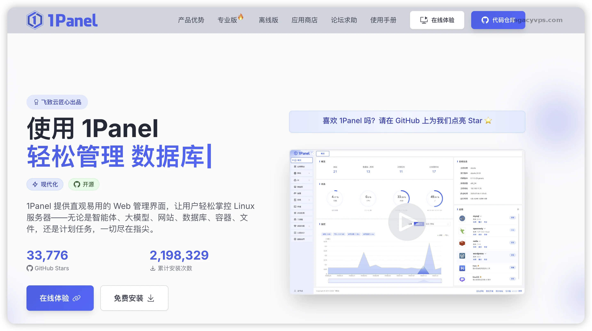
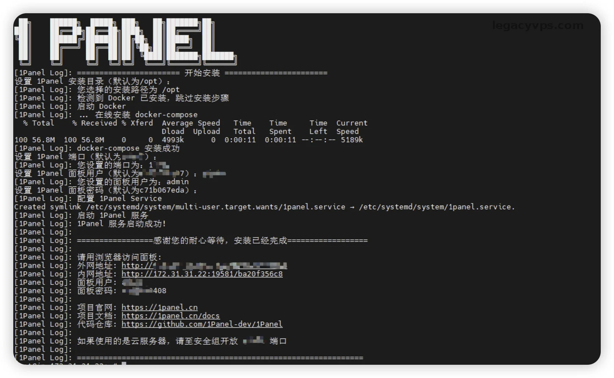
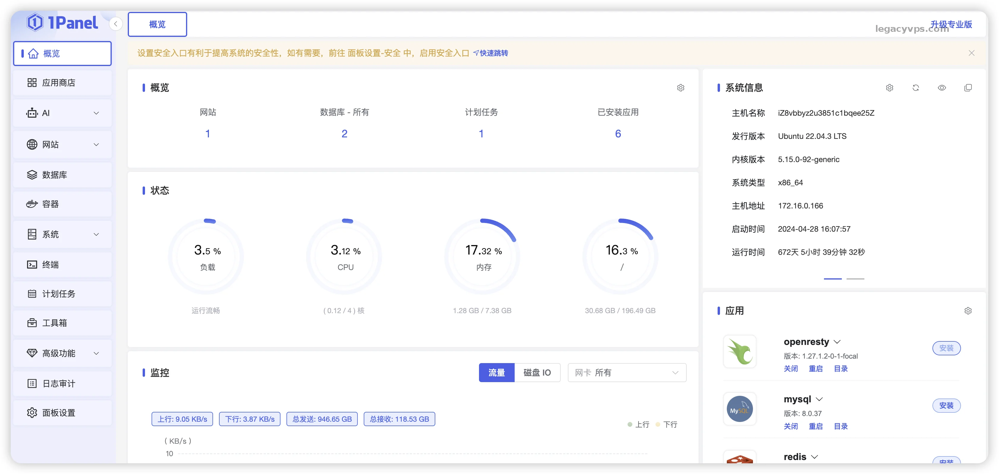
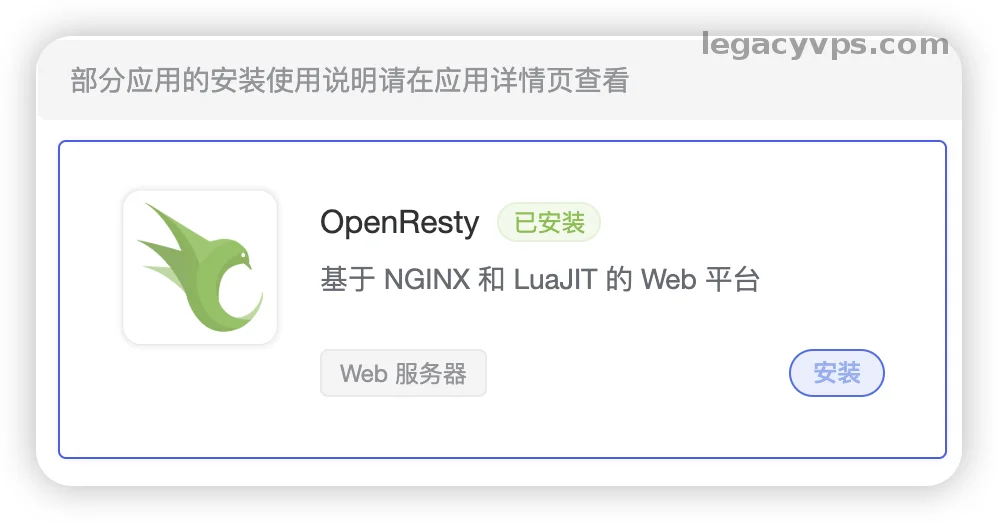
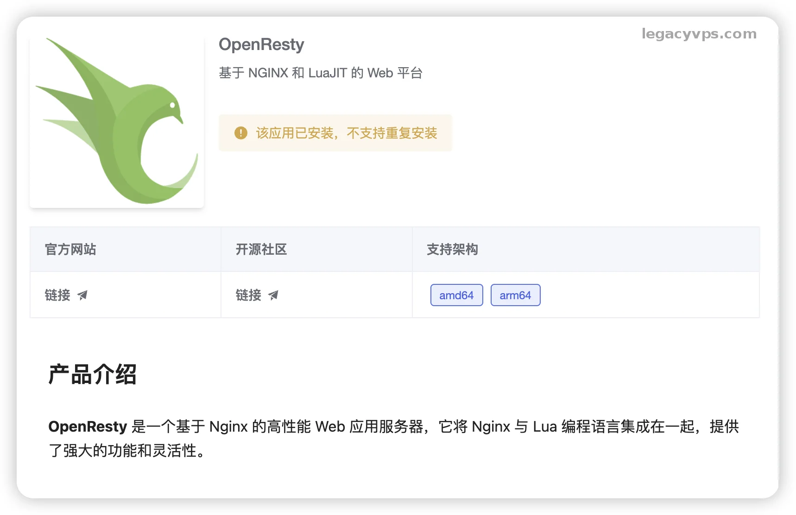
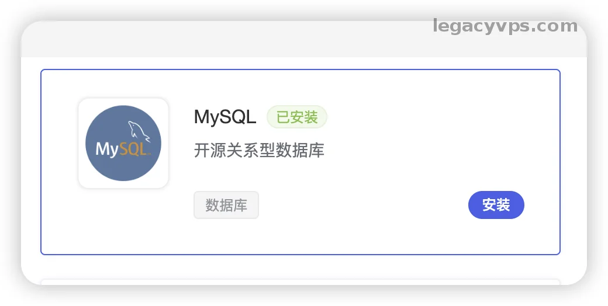
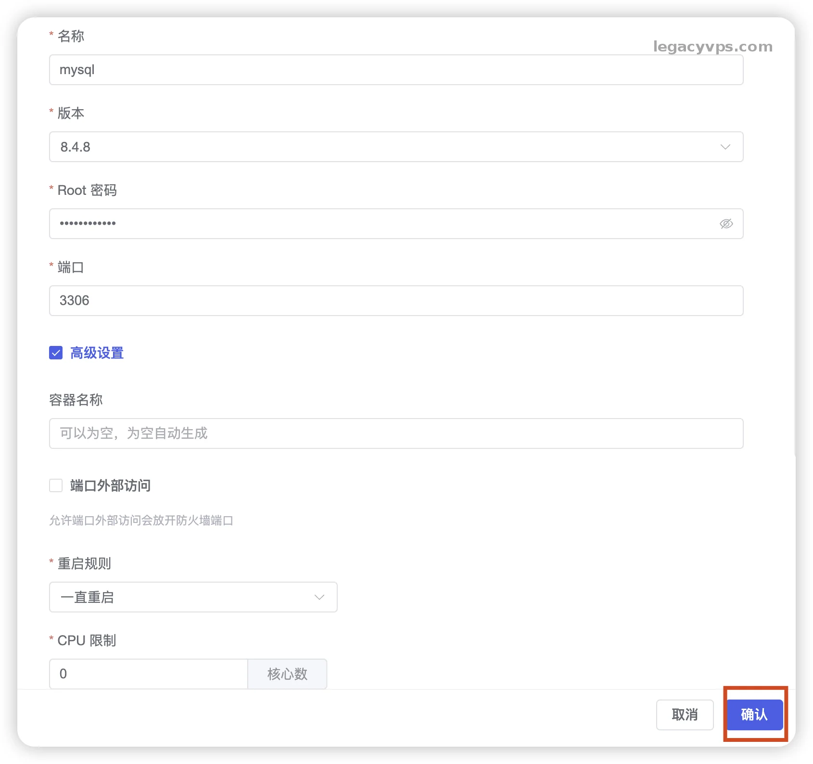
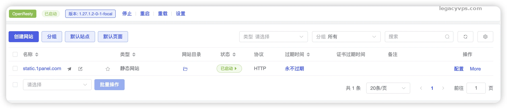
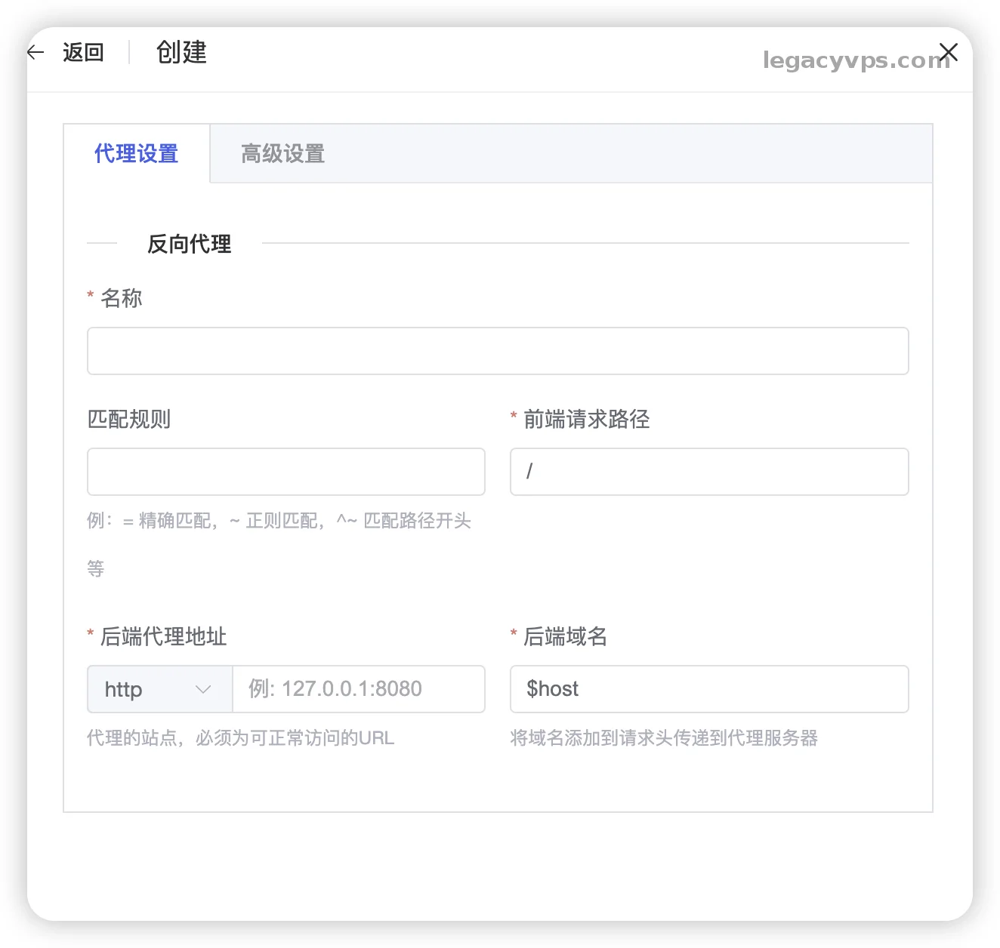

# 告别“环境污染”！Debian 服务器安装 1Panel 面板教程：专治 Docker 困难户

上期介绍了vps安装宝塔面板，但是对于一些有vps‘洁癖’的人来说想要一个干净的服务器，影响服务器越少越好，或者是针对环境隔离和安全性考虑也会选择docker。

但是国内对docker的支持都很差，dockerhub等网站基本上是不可用的状态，在这种时候1Panel就是另一种选择，设置了docker镜像的加速地址和全套的安装适配，很适合“国内宝宝”的体质，不需要折腾过多的配置。

**1Panel** 就是那个完美的替代方案。它主打“全容器化”管理，最关键的是，它**自带了 Docker 镜像加速和全套适配**，完美适合国内体质，不需要你再去改什么 `daemon.json` 配置文件，开箱即用。



## 一、 宝塔和1Panel的区别是什么？

在开始安装前，我先简单的说一下它和宝塔最大的区别，为什么那么多人喜欢用它：

- **宝塔**：像是一个装修队，进驻你的房子（操作系统）然后在里面操作安装，留下一堆依赖、日志或者其他临时文件，在你想安装其他东西的时候可能就会出现其他的依赖问题、端口冲突、软件版本混乱等问题。如果处理不当可能会把你VPS搞得一团。
- **1Panel**：像是买家具。它基于 **Docker**，你装的 MySQL、Nginx、WordPress 全都是一个个独立的“箱子”（容器）。你不想要了？直接把对应的容器卸载就好了不会影响到系统和其他的容器，你的房子（操作系统）依然干干净净，没有任何残留。

> 而且，如果只是谈 1Panel 的 UI 方面设计非常有极客感，我看着还是比较就舒服。

## 二、 准备工作

还是老规矩，准备一台 VPS。

- **系统**：推荐 因为是我自己的习惯问题还是最喜欢使用**Debian 12**（稳定、轻量），也可以选择其他的操作系统，只需要更换对应的脚本就好了。
- **内存**：建议 **1G 以上**。因为 Docker 相比原生安装会稍微多吃一点点内存，但是为了它的优点方便和干净，这点损耗是值得的。实在不行还可以开启swap，使用存储当内存使用。

先用 SSH 连上服务器，更新一下系统，装个 curl：

```Plaintext
# 1. 切换到 root 用户（如果你默认不是 root 登录的话，如果是 root 可跳过）
sudo -i

# 2. 更新系统软件包列表（这步很重要，不更可能装不上软件）
apt update && apt upgrade -y

# 3. 安装 curl 和 wget
# Debian 12 精简版经常不带这俩货，不装的话后面脚本跑不起来
apt install curl wget -y
```

## 三、 一键安装 1Panel

以前如果你想在国内的服务器上装 Docker，得先敲一堆命令，然后还得配置国内的镜像源，最主要的还不一定能有导致自己浪费大量的时间。现在直接使用 1Panel，一行命令全搞定。

复制下面的官方安装脚本，粘贴到终端回车：

```Plaintext
bash -c "$(curl -sSL https://resource.fit2cloud.com/1panel/package/v2/quick_start.sh)"
```

**【安装过程中的交互重点】**

脚本运行起来后，会问你几个问题，这里有几个坑要注意：

1. **设置安装目录**：默认是 `/opt/1panel`，直接回车就行。
2. **设置端口**：默认通常是 `****`（随机的），你可以改个自己喜欢的，比如 `10086`，但要记住。
3. **设置安全入口**：为了防止被扫，通常会让你设个后缀，比如 `entropy`。
4. **【关键点】Docker 设置**： 脚本检测到你没装 Docker 会自动帮你装。如果你的服务器在**国内**，它通常会提示是否使用镜像加速，或者它内置的配置已经优化好了国内的拉取网络。这是 1Panel 最核心的优势之一，**它帮你解决了“拉取镜像超时”的千古难题。**

等待大概 2-3 分钟，看到满屏的 Success，并输出了面板地址、账号和密码，就算大功告成了。



## 四、 放行防火墙与初次体验

和宝塔一样，别忘了去你的 VPS 服务商（阿里云、腾讯云等）后台的**安全组/防火墙**，放行你刚才设置的端口（比如 10086）。

在浏览器输入 `http://IP:端口/安全入口`，登录进去。



> **第一眼的感觉：** 其实感觉蛮干净的，但是我更喜欢以前的版本，因为更简洁只保留相对的核心功能，但是现在因为越做越大慢慢的界面也多出了很多冗余，不过说到底也还是一款不错的面板

## 五、 实战：用“应用商店”部署环境

在 1Panel 里，你找不到“软件管理”，取而代之的是 **“应用商店”**。

这里的每一个应用，本质上都是一个 Docker 容器。

### 1. 安装 OpenResty (Nginx 的增强版)

不管你跑什么网站，Web 服务器是必须的。

- 点击“应用商店” -> “OpenResty” -> “安装”。
- 你会发现，它可以选择版本，而且**秒装**。因为它只需要拉取一个 Docker 镜像，不需要像宝塔那样编译半小时。
- 一定要勾选 **“端口对外暴露”**（80 和 443），否则外网访问不了你的网站。





### 2. 安装 MySQL

- 同样在应用商店搜索 MySQL。
- 点击安装，设置好 root 密码。
- **注意**：1Panel 会自动创建一个内部网络，让 OpenResty 和 MySQL 可以在内部互通，非常安全。

> 这个内部网络的设置对小白很友好，不需要配置网络分离和其他的设置，端口默认也不暴露在外非常安全。





### 3. 建个网站试试

- 点击左侧 **“网站”** -> **“创建网站”**。
- **运行环境**：选择“反向代理”（这是 1Panel 的逻辑，或者选择“运行环境”配合 PHP 容器）。
- 如果是部署静态网页或简单的 Docker 应用（比如 Halo 博客、Alist 网盘），1Panel 的逻辑是：**应用商店一键部署应用 -> 网站功能做反向代理域名**。流程非常顺滑。





## 六、 总结：宝塔 vs 1Panel，怎么选？

写到最后，给没有体验过1Panel还在纠结的朋友们一个建议：

- **选宝塔面板**：如果你是**纯新手**，或者你要跑的是那种很老的 PHP 源码（比如几年前的企业站），或者你需要极其丰富的插件生态（比如各种一键挂载、系统优化插件）。宝塔的原生安装依然是兼容性之王，在适配性和稳定性上面还是更胜一筹的。如果你已经在使用宝塔面板，也可以有时间尝尝鲜体验一下在五分钟备份恢复网站重建的快感。
- **选 1Panel**：如果你有一点点极客精神，对自己的**系统有洁癖**，或者你的服务器主要用来跑各种好玩的 Docker 项目（比如搭建自己的 ChatGPT 镜像、Bitwarden 密码库、青龙面板等）。尤其是喜欢经常折腾更换服务器，更换框架，体验最新的东西。想几分钟就完成数据的迁移和站点的重建。那你一定要试试1Panel的爽感

尤其是对于**国内服务器用户**，1Panel 自带的 Docker 优化能帮你省下大把找镜像源的时间。服务器干干净净，看着就舒心！

这就是今天的教程，如果有遇到 Docker 拉取失败或者端口不通的问题，欢迎在评论区留言交流！