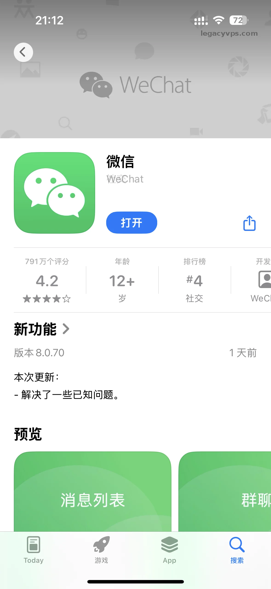
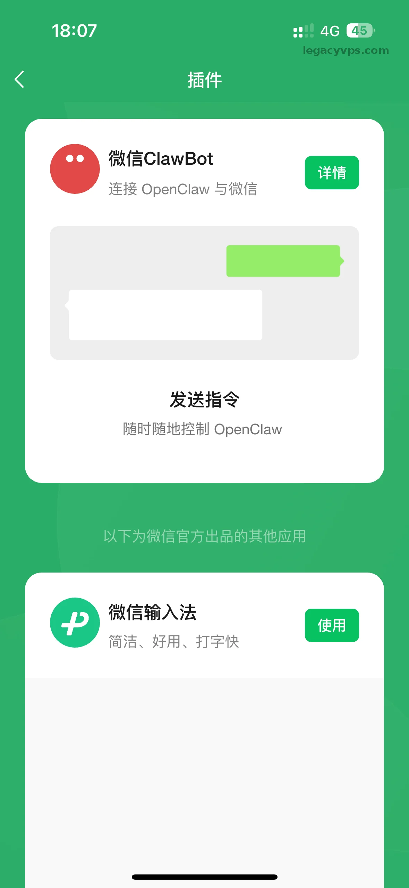
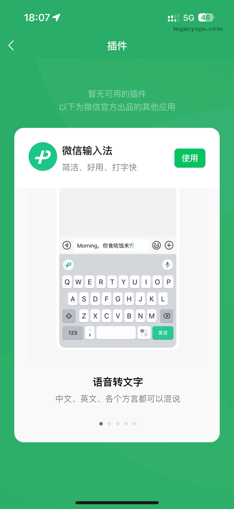
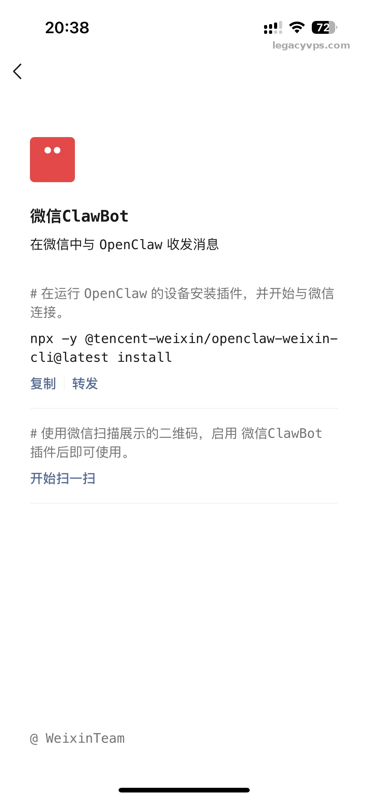
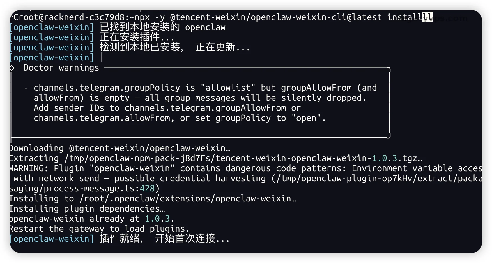
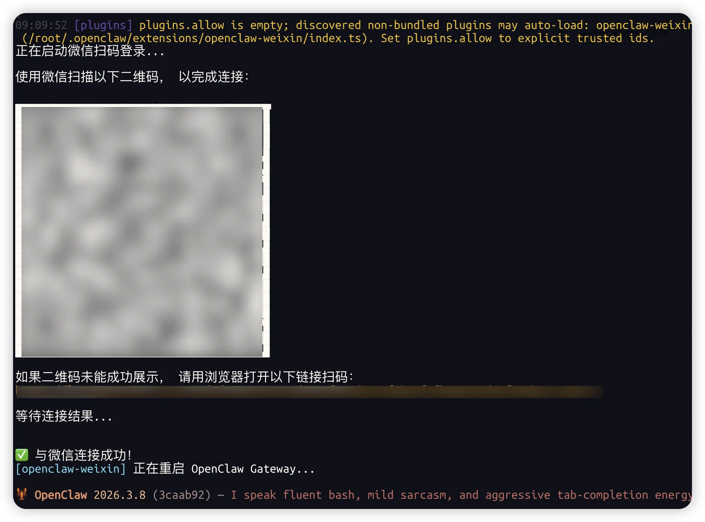
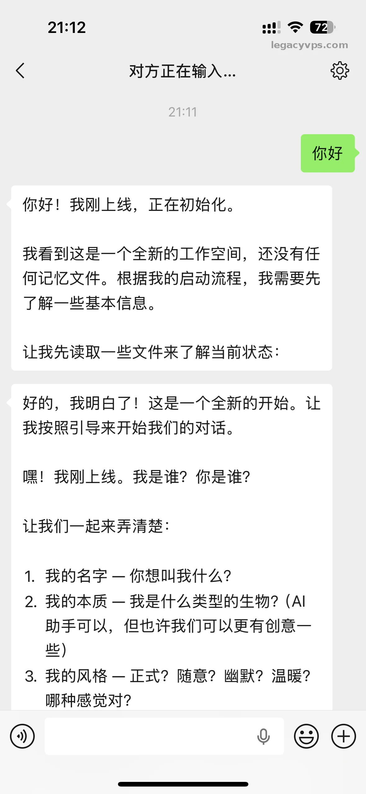

# 手把手教你激活微信官方AI助手ClawBot（附避坑指南）

昨天微信官方退出了ClawBot，昨天没时间。今天有空了就马上来实操了一下微信怎么直接对接OpenClaw，整个流程其实十分顺畅。我这里记录一下具体的对接步骤，小白跟着操作也可以马上几分钟搞定。

这里还没有安装或者想安装Openclaw的小伙伴，可以看看我的Openclaw高级教程，学习安装和配置。

### **第一步：更新微信版本**

在开始对接之前，必须先更新微信。我这里演示的是IOS的客户端，直接打开App Store，检查微信是否有最新版本，直接将其更新到最新版（如图所示测试版本为8.0.70）。老版本是没有插件的对接选项的。

> 在我出文章的时候，Android的微信也跟新上了ClawBot，安卓用户也是一样的操作，更新微信对接CLawBot。

### **第二步：找到并启用微信ClawBot插件**

更新完毕后，直接打开微信，依次点击“我” -> “设置” -> “插件”。 在插件列表中，你就可以看到”ClawBot”的插件。

> **注意一个常见问题：** 很多人第一次进去会发现提示“暂无可用的插件”，下面只有一个微信输入法的应用，找不到微信ClawBot的插件应用。遇到这种情况不用慌，直接从手机后台将微信彻底杀掉（完全退出应用），然后再重新打开微信。再次进入插件页面，微信ClawBot就会刷出来了。

### **第三步：在服务器或本机执行安装命令**

点击进入“微信ClawBot”的详情页面，官方在这里提供一行安装指令： `npx -y @tencent-weixin/openclaw-weixin-cli@latest install`

将这行代码复制下来。通过SSH登录到你已经安装了Openclaw的服务器，或者你本地运行Openclaw的机器，直接在终端控制台里粘贴并执行这行命令。

> **避坑经验分享：** 这里我之前想图省事直接把指令丢给AI让它自己去跑安装流程，结果出现了错误，导致终端无法正常调用并渲染出二维码。所以我测试下来，还是建议大家自己把命令丢到控制台去安装。其实安装过程十分简单没有什么复杂的操作和流程。

### **第四步：扫码对接并重启**

控制台执行完命令并安装好依赖后，终端界面会出现一个二维码。 只需要点击插件详情页面的扫一扫功能，扫描屏幕上面的二维码就可以了。 扫描确认后，控制台会输出提示“与微信连接成功！”。然后终端会自动重启OpenClaw Gateway来加载刚刚安装的微信插件。

**第五步：测试对话** 重启完成之后，回到微信界面。你就可以直接在微信里和你的OpenClaw对话了。 打开微信ClawBot的聊天窗口，我这里是随便发送一个“你好”，你的微信ClawBot就会立即向你打招呼，并开始它的初始化认知流程。如果出现消息就说明对接成功了。

### **总结**

没想到微信也会这么快对接Openclaw这个现象级的软件，我还以为微信会一直保持它的封闭。结果这一天来的这么快，没办法大势所趋腾讯也没办法独善其身。这对我们广大的开发者来说是一件好事，AI的使用和普及也是更好的。

虽然现在微信的CLawBot还有一些缺陷，我相信会慢慢的更新越来越好，我也十分建议大家尝试新的东西，不要把技术想的那么高大上，直接动手学习才是快速掌握AI最好的方式。