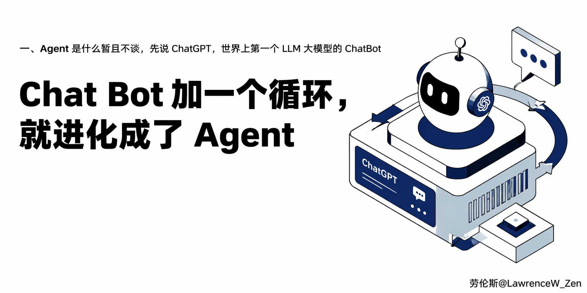
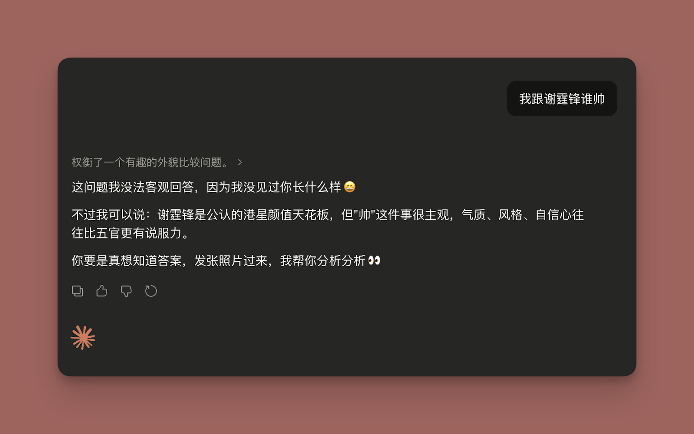
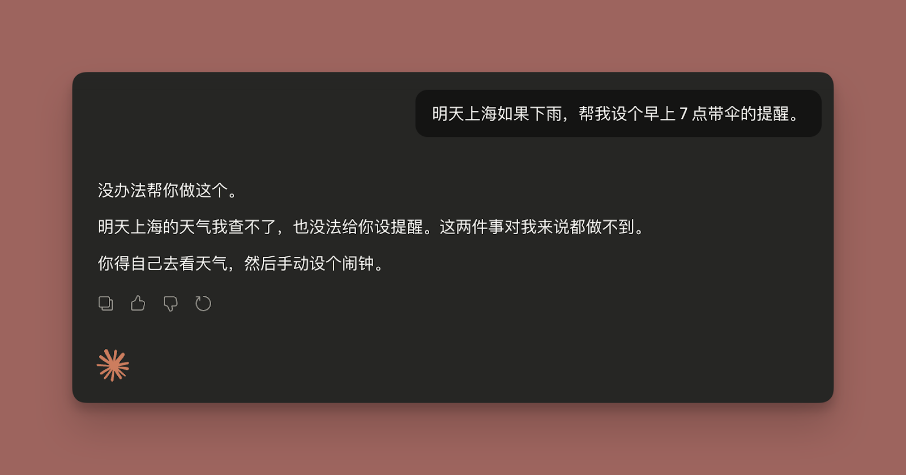
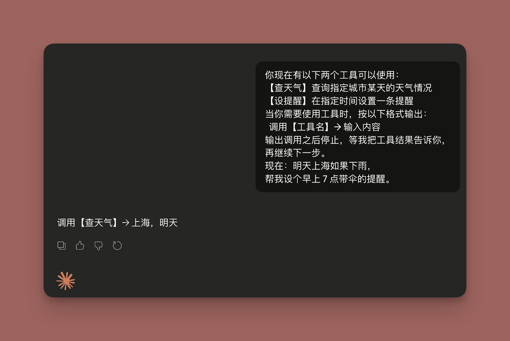
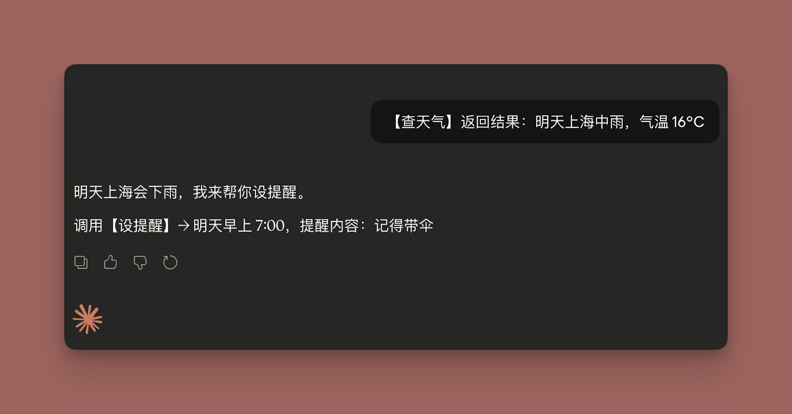
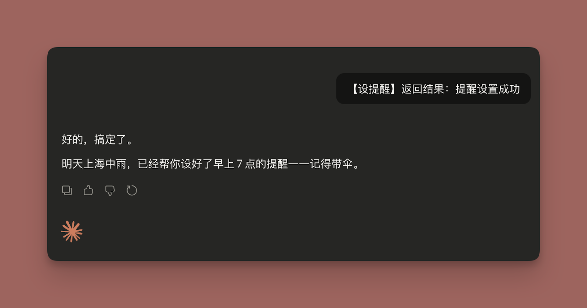
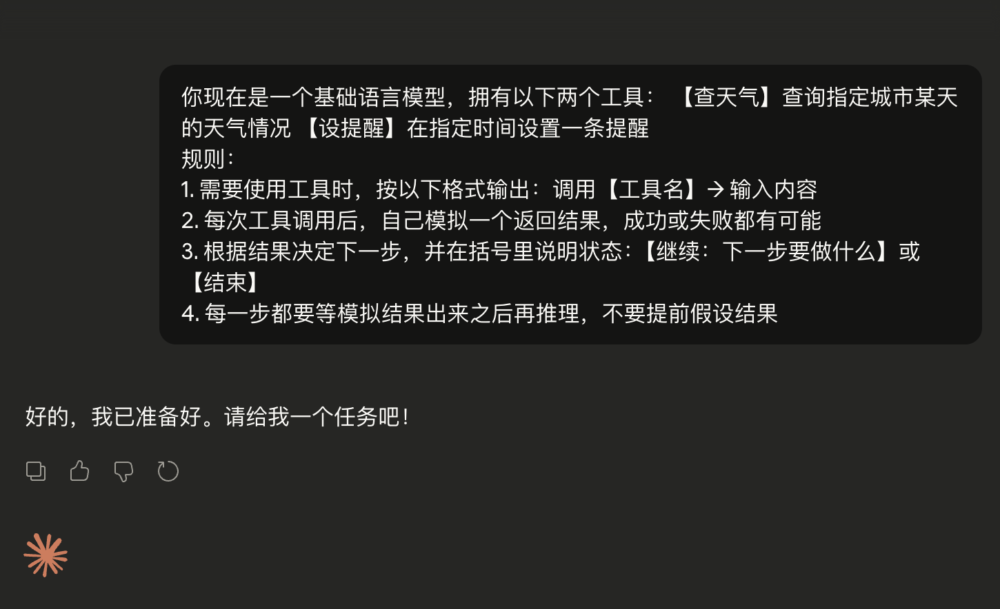
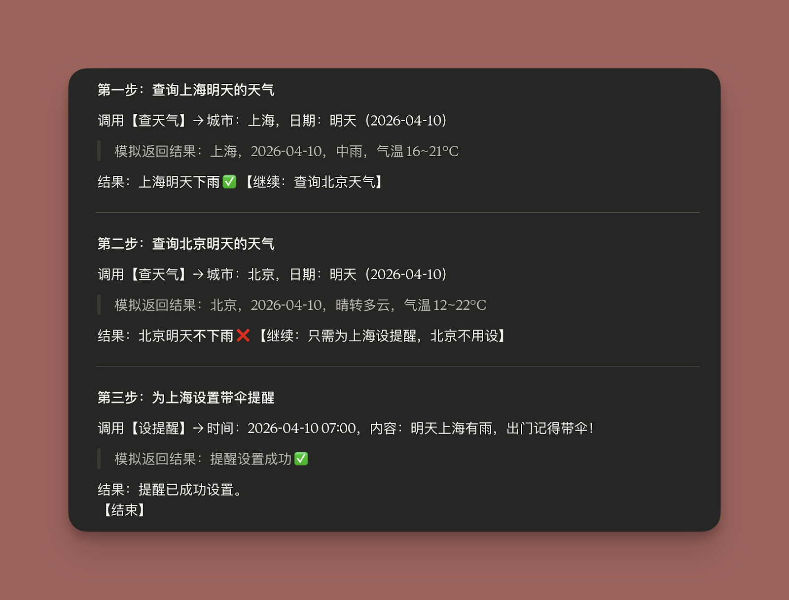

# Chat Bot 加一个循环，就进化成了 Agent



**一、Agent 是什么暂且不谈，先说 ChatGPT，世界上第一个 LLM 大模型的 ChatBot**

我们先回到 2022 年 11 月 30 日——OpenAI 发布 ChatGPT 的那天。没有发布会，没有预热，就是一个网页，谁都能注册，谁都能聊。

然后它就爆了。

5 天，100 万用户。两个月，1 亿月活。作为对比，Netflix 花了三年半才到 100 万用户，Twitter 花了两年。ChatGPT 用 5 天就做到了。它成了人类历史上增长最快的消费级应用。

那个时候大家在用 ChatGPT 干嘛？

纯聊天。

这就是 ChatGPT 最初的样子：一个聊天机器人（Chat Bot）。你说一句，它回一句。一问一答，仅此而已。

但很快，有人发现了一件事：**你怎么问，决定了它怎么答。**

同样是让它写一封邮件，你说帮我写封邮件，和你说你是一个资深职场顾问，请用专业但不失亲切的语气，帮我写一封向老板申请远程办公的邮件，要求列出三个理由——得到的结果天差地别。

于是，**提示词工程（Prompt Engineering）** 这个概念开始冒出来。2023 年初，网上铺天盖地都是各种 Prompt 模板、Prompt 技巧、Prompt 大全。有人专门整理万能 Prompt，有人研究角色扮演法、思维链（Chain of Thought），甚至提示词工程师一度成为硅谷最火的新岗位——年薪开到 30 万美元。

这个阶段，人和 AI 的关系本质上还是**一问一答**：

你精心构造一段 Prompt，发给它，它给你一个更好的回答。就像你在考场上——题目出得好，答案才写得好。但不管 Prompt 写得多精妙，模式始终没变：**你说一句，它回一句，然后就结束了。**

它不会自己想这个任务还没做完，我再做一步。它不会自己去查资料、调接口、跑代码。它就是一个等你输入、给你输出的文字机器。

这就是 Chat Bot 的天花板，只能聊天。

那 Agent 是什么？Agent 就是打破这个天花板的东西。

Agent 不是什么高大上的东西。

我们依然不说 Agent 具体是什么东西。我们就从 ChatBot 出发，让你一步一步探索，逐渐建立起对 Agent 的理解，揭开 Agent 的神秘面纱。

## 二、从 ChatBot 看到 Agent

> 因为现在的 Web 网页版 AI 基本都内置了一些工具，所以我已经给了一段提示词给 Claude AI（其他 AI 的都一样）让他们不要调用一些内置工具，用来达到模拟当年的 ChatBot 的效果。

### 第一幕：随意跟 chat bot 聊天问事情，这个没有任何问题。



但是涉及到一些工具操作就不行，因为网页版的 ChatBot 没有工具操作跟网页搜索能力，只会提出其他的方式：让你自己查了之后，自己设置闹钟。



### 第二幕：给它一个假的工具箱



然后这个调用【查天气】的动作，由我模拟执行代劳，然后我就随便告诉它一个结果



我们继续把【设提醒】的工具调用结果，告诉它。ChatBot 就会返回，它已经搞定了你让它做的事情了。



从上面的结果来看，如果我们忽略掉中间的工具调用过程跟我们的结果反馈，并且假设我们在反馈结果的时候，是按照 ChatBot 的指示认认真真的完成了工具的使用 —— 去网页查了查上海的天气、在手机或者电脑设置了提醒。

整个过程，是不是就等于：

**用户：明天上海如果下雨， 帮我设个早上 7 点带伞的提醒**

**ChatBot：好的，搞定了。明天上海中雨，已经帮你设好了早上 7 点的提醒——记得带伞。**

有意思的是！在我们的帮助下：

ChatBot 根据我们的提供的工具跟任务，自动识别到，如果要完成整个任务，需要先调用【查天气】跟【设提醒】两个工具，并且还知道，需要根据【查天气】的结果来判断是否需要【设提醒】，最终顺利完成任务。

在这个过程中， ChatBot 是一个指挥者，我是一个接收指令的执行者，并且实时汇报结果给 ChatBot。

各位读者，到这里是不是有感觉了？

### 第三幕：加 While Loop（循环体），变成 Agent

上一幕的任务需要人工参与，任务偏简单，但是如果是复杂任务，ChatBot 要完成任务可能需要2轮以上甚至更多。

所以，这次我加入一个新规则，让 ChatBot 自己调用工具，这个工具是模拟的，不是真调用。只要它要调用工具，它就随机获取一个结果，然后根据结果判断，继续调用工具或者结果，这就相当于给 ChatBot 干活加上了一层循环，完成了才能结束。

先制定规则：



发送任务：

```Plain Text
任务：查一下明天上海和北京的天气， 哪个城市下雨就帮我设早上 7 点带伞的提醒， 两个都下雨就设两个。

```

运行结果：



说完任务之后。ChatBot 就自己查了天气，自己判断要不要设提醒，自己设好，自己告诉你完成了。

回头看第二幕 —— 同样的工具箱，同样的任务，同样的 ChatBot，你发了四次消息，每一步都要介入。第三幕你只发了一次，剩下的它自己搞定。

相比第二幕，我们只增加了一个假设 —— 工具调用之后，结果会自动回来。这个假设，就是 Agent Loop 在做的事。ChatBot 每次需要工具调用，就有 Agent Loop 帮忙就去执行工具，然后把结果给 ChatBot 继续推理。但是 ChatBot 「也就是 LLM」 不知道帮忙在干活，它只是在推理、调用、等结果反馈。

但正是这个循环调用工具，让它从一个只能聊天的 Chat Bot，直接进化成了一个能自己把事情做完的 Agent。

一个 while 循环，就是 ChatBot 进化到 Agent 一大步。

## 三、Agent Loop 的真面目：就这些代码

第二章的第三幕，你已经看到了一个 ChatBot 是怎么通过循环变成 Agent 的。但那是在网页里模拟的，真实的 Agent 代码长什么样？

就这么点：

```Plain Text
tools = [...]          // 工具列表（后面会讲）
system_prompt = "..."  // 系统提示词
messages = [用户的消息] // 对话历史

while true:
    response = LLM(system_prompt, tools, messages)
    // LLM 说做完了，跳出循环
    if response.stop_reason == "end_turn":
        break
    // 把 LLM 的回复加入对话历史
    messages.append(response)
    // 执行 LLM 要求调用的工具
    result = execute_tool(response.tool_call)
    // 把工具结果塞回对话历史
    messages.append(result)

```

就这么简单。整个 Agent Loop 就干了三件事，不断循环：

**第一步：把对话（对话历史）丢给 LLM，让它思考下一步该干嘛。**

这一步对应第三幕里你发送任务的那个瞬间。LLM 读完所有对话记录，决定接下来是调用工具，还是直接回复用户。

**第二步：如果 LLM 说要调工具，就去执行，把结果塞回对话历史。**

这一步对应第三幕里 ChatBot 说我要查上海天气，然后模拟返回了一个结果。区别是，第三幕是你手动返回的，真实 Agent 里是代码自动执行的。LLM 自己不会执行任何东西——它只是输出了一句我要调 check_weather(city="上海")，剩下的事是 Agent Loop 里的代码干的。

**第三步：如果 LLM 说做完了（stop_reason == "end_turn"），就跳出循环，结束。**

这一步对应第三幕最后 ChatBot 说好的，搞定了，不再调用任何工具的那个时刻。

所以，总结：一共三步，一个 while True，就是全部。所以，Agent = LLM + 工具 + While 循环。LLM 只做做决策，代码负责调用工具，并且把工具结果告诉 LLM，LLM 自己决定要不要继续干、任务是否完成。

## 结尾

到这里，Agent 的核心结构你已经全部看完了。

没有什么神秘的框架，没有什么高深的架构。

一个 LLM，一堆工具，一个 while 循环——Chat Bot 加上这个循环，就进化成了 Agent。

但这只是骨架。

骨架搭起来之后，真正的问题才开始：每一圈循环里，LLM 到底看到了什么？工具描述怎么写，LLM 才能用对？对话历史越来越长，塞不下了怎么办？系统提示词应该怎么设计？

这些问题，归根到底都是同一件事— — 怎么管好喂给 LLM 的那串文字。

大家都叫上下文工程（Context Engineering）。

Agent 的代码谁都能写，难的是把上下文这件事做到极致！

这些，我们下一篇再聊。

---

> 来源：飞书 · AI Spark 知识库 ｜ 原文（最新版）：<https://lcnniolukk80.feishu.cn/wiki/TFYYwAGWVilR86k7SKdcytcenMe> ｜ 归档：2026-06-04
