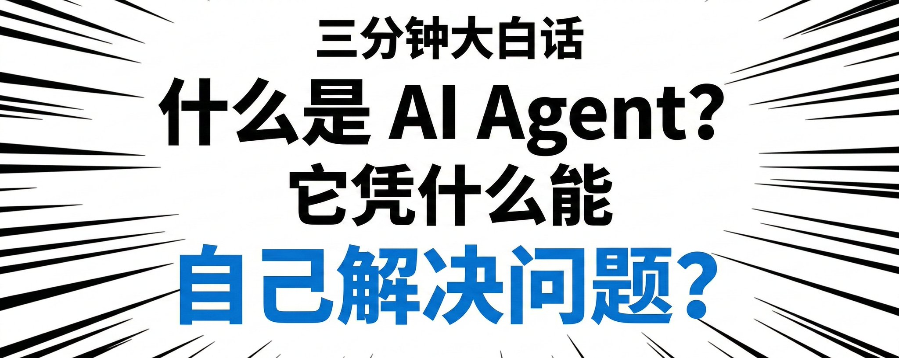

# 三分钟大白话：什么是 AI Agent？它凭什么能自己解决问题？

在 AI 的世界里，“Agent（智能体）”这两年几乎成了高频词。 但有意思的是——很多人其实每天都在用 Agent，却没意识到自己在用。

比如你在用 **Claude Code、Codex、Gemini CLI、OpenCode** 写代码； 或者用 **Cursor、VSCode 插件、Google Antigravity** 辅助开发； 甚至像 OpenClaw、CoClaw、LobsterAI 这类自动执行任务的工具……

这些工具的背后，其实都在运行着 AI Agent。

很多人会觉得： “哦，不就是更聪明一点的聊天机器人吗？”

其实不是。

ChatBot 只会“回答问题”， 而 Agent 不仅会思考，还会行动。

简单说—— ChatBot 像一个会聊天的人， Agent 更像一个能帮你干活的同事。

这就是它们真正的区别。

真正的 AI Agent 不仅会说话，它还能**思考、行动、总结，再继续思考**。如果把AI Agent 比做成一个人的话：

> **会思考的大脑 + 能行动的双手 + 会规划的神经系统 + 稳定运行的身体**

我将用最通俗的比喻来给大家梳理清楚。

## 一、AI Agent 的四个核心部分

1️⃣ 模型（会思考的大脑）

模型是AI Agent的大脑。它就像人类的大脑一样，负责：

- 理解问题
- 分析信息
- 做出决策
- 给出回答

大模型是一个行动无能的天才，而Agent 则通过软件开发的方式，将大模型封装成一个可以自行处理某项任务的软件。

Agent 让行动无能的天才也能行动进行调用工具。

2️⃣ 工具（能行动的双手）

工具就像是AI Agent的双手，让它能跟外界互动。常见的工具有：

- 调用API接口
- 查询数据库
- 运行代码
- 访问文件
- 搜索信息
- 执行各种脚本

**没有工具，模型只能“思考”；有了工具，它才能“做”。**

3️⃣ 编排层（会规划的神经系统）

编排层就像AI Agent的神经系统。它负责：

- 规划下一步做什么（规划）
- 管理记忆（短期记忆、长期记忆）
- 上下文工程（管理输入给模型的Prompt的动态管理）
- 决定什么时候调用工具
- 组织和安排每一步的推理过程

简单来说，编排层就是决定“下一步该做什么”的控制中心。

4️⃣ 部署（稳定运行的身体）

部署层是AI Agent的“身体”。它包括：

- 服务器托管
- 权限控制
- 日志监控
- 安全机制

它确保AI Agent能**稳定运行**，不像临时的实验脚本。

## 二、AI Agent 是怎么解决问题的？

AI Agent 解决问题的过程不是简单的直线执行，而是一个“思考—行动—再思考”的循环。

通常，AI Agent 这样工作：

第一步：接收任务

用户提问，比如：

> “帮我分析一下英伟达的股价走势”

第二步：组装上下文

系统会把所有相关的信息整理给模型，包括：

- 用户的请求
- 历史对话
- 可用的工具
- 相关数据
- 系统的指令

这一环非常重要，它帮助模型了解问题的背景。

第三步：模型做判断

接下来，模型会思考：

- 我能直接回答问题吗？
- 还是需要调用工具？

如果模型觉得需要更多的信息，它可能会说：

> 我要调用API查询工具：查询英伟达历史K线，并通过Web实时搜索工具查询近期重大事件对英伟达的利好利空程度。

第四步：执行工具

编排层拦截这个“工具调用请求”，并执行真实的操作，像调用专用的API、Web实时查询、执行代码、执行脚本等。

得到结果后，系统不会立刻展示，而是继续……

第五步：回填结果，再思考

工具执行的结果会被添加到上下文中，模型再重新思考：

> 现在有数据了，能回答了吗？

如果还不够，它可能会继续使用其他工具进行补充。

第六步：输出最终答案

当模型确认信息足够时，它才会生成最终的回答。

整个过程像这样：

思考 → 行动 → 观察 → 再思考 → 再行动 → 输出

这就是AI Agent的闭环机制。

## 三、为什么 AI Agent 比普通提示词（Prompt）强？

传统的方式是：

> 写一个提示词（Prompt） → 得到一个回答 → 结束

而 AI Agent 是：

> 管理动态的上下文 → 进行多轮推理 → 主动调用工具 → 完成目标

传统方法注重的是优化单一的提示词，而 AI Agent 强调的是**构建一个智能系统**，不断根据上下文动态调整和优化过程。

这就是从**提示词工程（Prompt Engineering）的演变，变成了上下文工程（Context Engineering）**。

## 四、一个简单的类比

想象一下，传统程序就像是：

> 你写好每一步的代码，机器照着严格执行。

而构建 AI Agent 更像是：

> 你设定目标和规则，AI自己去规划路径。

你不再是那个“写流程的人”，而变成了“导演”，引导AI完成任务。

## 五、总结一句话

AI Agent 是一个**能够在循环中自主完成任务的智能系统**，它通过：

- 明确的目标
- 可调用的工具
- 稳定的记忆
- 合理的编排机制

不仅能思考，还能够做并能不断优化。

因此，它不再只是一个聊天机器人，而是一个能解决实际问题的“数字员工”。

如果说大模型是大脑，那么 AI Agent 就是一个**完整的、能够解决问题的人**。

真正的挑战，不是让模型变得更聪明，而是**如何构建一个合理的上下文和行动系统**，让它能够高效地替代我们现有的工作。

好了，你现在搞明白什么是AI Agent了吗？

如果有不理解的地方，欢迎留言，一起讨论。

---

> 来源：飞书 · AI Spark 知识库 ｜ 原文（最新版）：<https://lcnniolukk80.feishu.cn/wiki/Z4o7wlGcii6B02kzPrTcooGTnsb> ｜ 归档：2026-06-04
