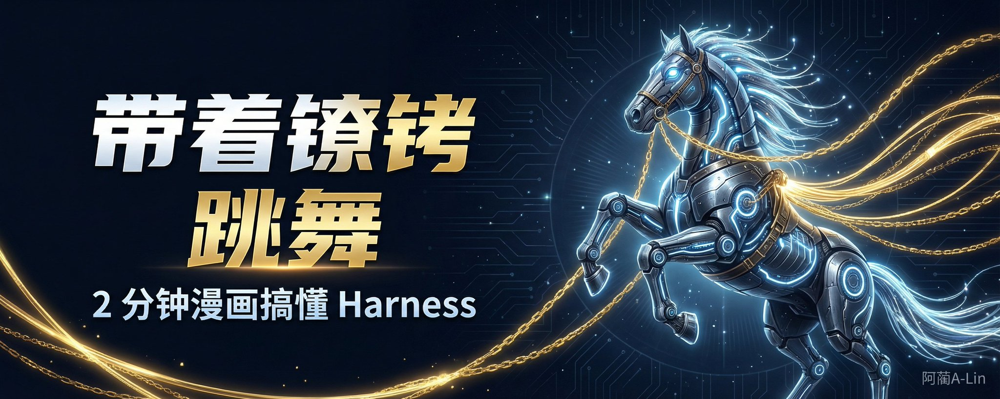
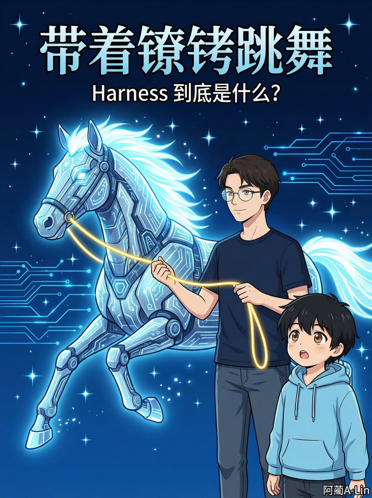
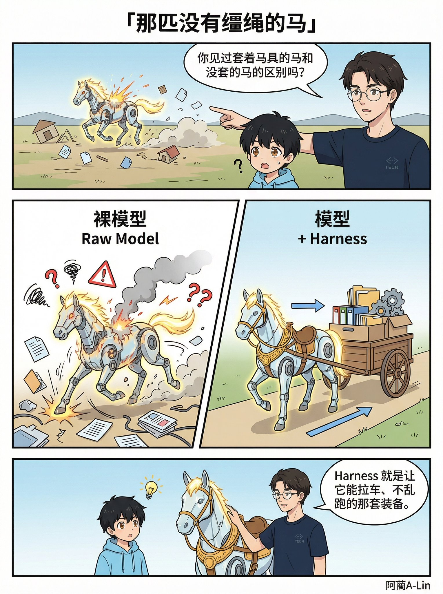
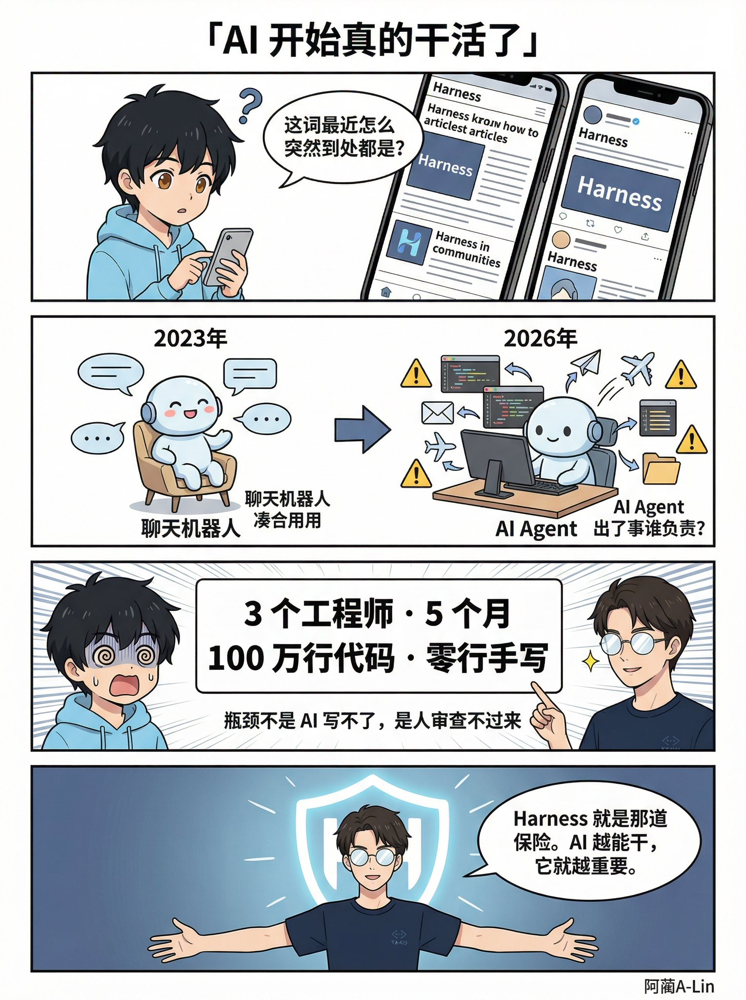
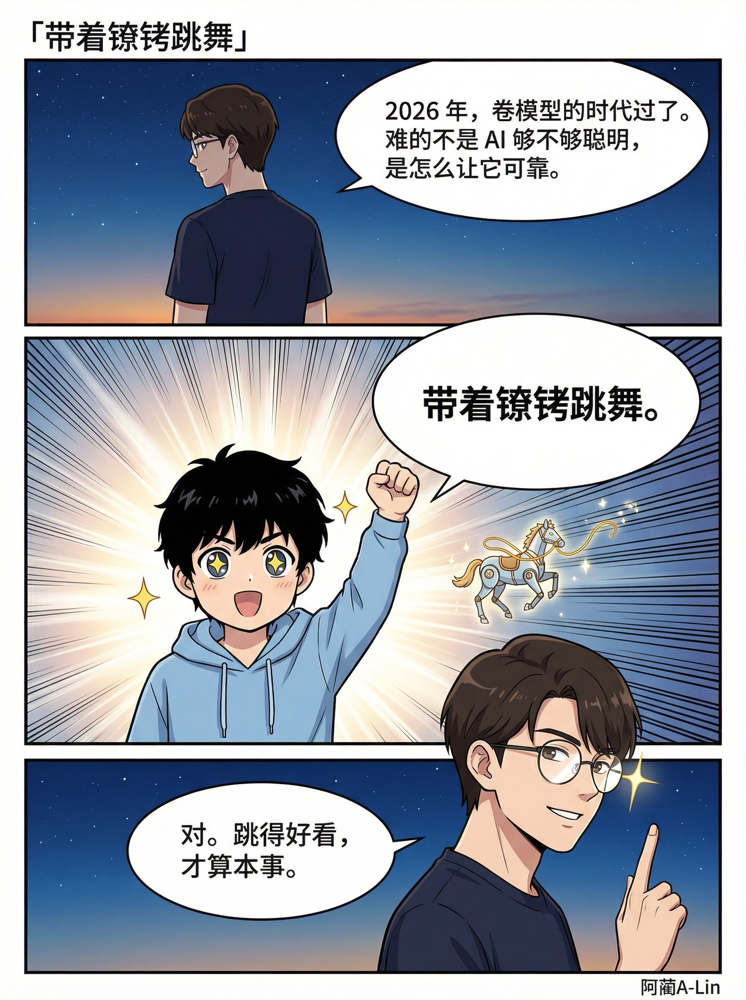

# 带着镣铐跳舞：2 分钟漫画搞懂Harness

**最近 Harness 这个词到处都是。 但大多数文章看完还是不知道它是啥。 今天用漫画讲清楚。**

---

> 来源：飞书 · AI Spark 知识库 ｜ 原文（最新版）：<https://lcnniolukk80.feishu.cn/wiki/ImtqwGexMii9kqkFMBCcMQHmnlb> ｜ 归档：2026-06-04
