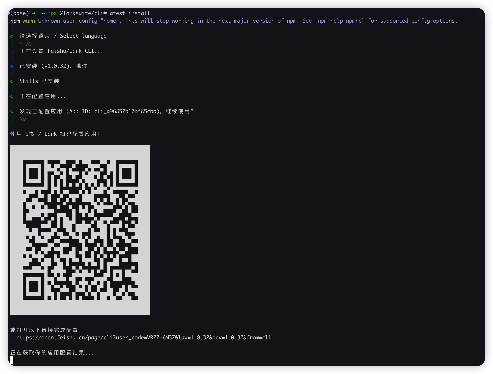
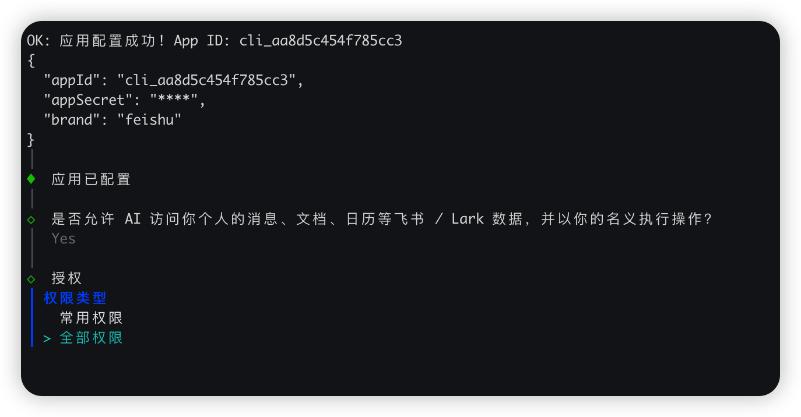
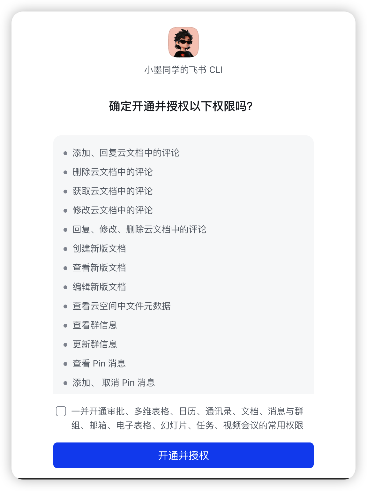
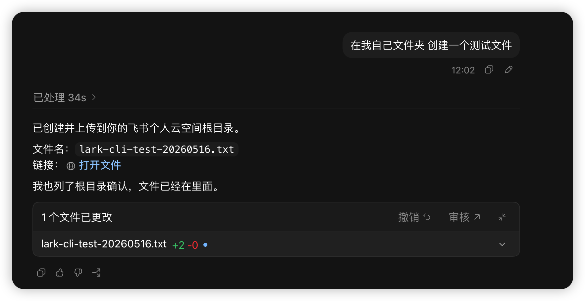
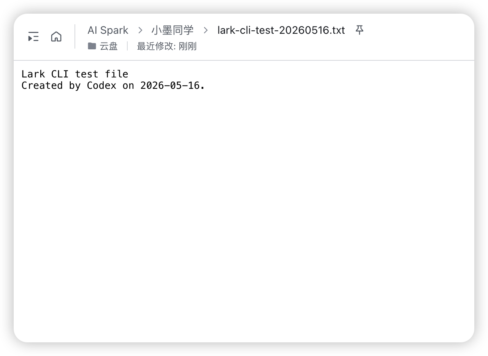
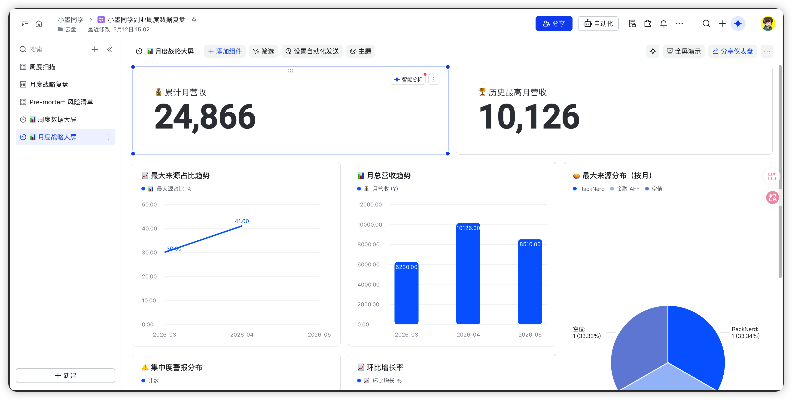

# GitHub 狂揽 10.7k Star！这款飞书神器配合 AI Agent，工作流彻底起飞了

飞书cli在github上开源，而且没多久就冲上了10.7k的star，我想去了解一下到底有什么过人之处，而且在工作中我也经常使用飞书，如果能让ai配合使用飞书。我想效率会大大提升。

这篇不教你一行行照着官方文档敲命令。走的是另一条路：让 Codex 配合飞书 CLI，把安装、授权、建表到出数据大盘整条链路串起来。我手上一堆网站、副业数据散着没人管，图的就是省精力、提 roi——这套要真能省下来，我肯定重度用。

看完这篇，你能照着把飞书 CLI 装上，然后让 AI 接手建表、算数据这些活。

---

## 飞书 CLI 是什么，为什么我没打算自己照文档装

飞书 CLI 是飞书官方的命令行工具，开源在 GitHub 上（仓库 larksuite/cli），可以用命令行直接操作多维表格、文档、消息这些东西。最看重的第一点就是图表能力，还有就是日程安排能力和业务对接能力。因为飞书的图表数据分析有天然的优势，我自己在工作和日常生活中也会去经常使用。

照官方文档自己装，要管 Node 版本、npm 全局权限、飞书这边的认证授权。单看每一步都不难，但碎，错一步还要回头翻文档对。这种"照着文档一步步敲、错一步回头查"的活，恰好是 AI Agent 的主场。

这篇默认你手上已经有一个能跑、能正常认证的 Codex。怎么装 Codex 不在这篇范围里，没有的话先把它跑通再回来。

---

## 装飞书 CLI：我没自己照着文档敲，整条交给了 AI

前置自检：本机有 Node 和 npm，我自己本地安装的node的24长期支持版，如果怕安装出现问题，最好和我的操作环境一致，然后就是手上要有一个能跑的 Codex，如果没有codex也不要紧，可以换其他的，比如Open Code也是一样的。

我没自己照着官方文档一步步敲，整条安装交给 Codex 跑——命令、扫码配置、授权都是它驱动，我配合。我丢给 Codex 的就一句话，把官方安装文档的链接甩给它：

```text
帮我安装飞书 CLI：https://open.feishu.cn/document/no_class/mcp-archive/feishu-cli-installation-guide.md
```

它读完这份文档，自己跑的就一条命令，交互式的，会一步步问：

```bash
npx @larksuite/cli@latest install
```

接着它先选语言、装好 CLI 本体（我这次装的是 v1.0.32）、再装上 Skills，然后走到"配置应用"这步——用飞书扫码，或者新建一个应用。



配置应用会跳到网页，让你建一个飞书 CLI 应用。我建的应用名叫"小墨同学的飞书 CLI"，头像随便挑一个，点创建。


回终端，应用配置成功会打印 App ID（appSecret 是打码的）。接着它问一句很关键的话："是否允许 AI 访问你个人的消息、文档、日历等飞书 / Lark 数据，并以你的名义执行操作？"我选 Yes，权限类型这里直接选了"全部权限"——图省事，把所有权限都给了飞书 CLI。



> 风险提示：选"全部权限"等于把消息、文档、多维表格、邮箱、日历这些一次性都开给这个 CLI 应用。图方便可以这么干，但你得清楚这意味着什么，介意就改成"常用权限"按需勾。

然后浏览器弹授权确认页，底下还有一个"一并开通审批、多维表格、日历、通讯录、文档、消息与群组、邮箱、电子表格、幻灯片、任务、视频会议的常用权限"的勾选框，勾上，点"开通并授权"。



这里我踩了一个坑，单独拉一节讲，先往下走。授权过了之后，CLI 就装好能用了。

验证我没有自己干，是直接让 Codex 去帮我验证和测试：让它"在我自己文件夹创建一个测试文件"。它处理了 34 秒，建了个 lark-cli-test-20260516.txt 上传到我的飞书个人云空间根目录，还自己列了根目录确认文件在里面。



去飞书云盘里打开，文件确实在，内容也写进去了。能从命令行一路把文件创建并推到飞书，那飞书的CLI还是真的能完成工作。



这一段主要是从装到验证的过程，命令基本上都是 Codex 在跑，我只在授权那步动了手，但是在控制台使用的时候，还是遇到了一个问题，后面我会仔细讲。

---

## 把要处理的数据和统计交给 AI 配合飞书 CLI

本篇教程最核心的观点就是教会你使用和安装飞书的cli。然后把你自己要处理的数据或者是要做统计的工作，都交给ai配合飞书 CLI完成

落到我自己的场景：副业的收入、AFF、选题、进度，本来散在好几个表里。装通之后，我直接让 Codex 拿我以往的数据生成了一份月度报表大盘。卡片和图表它自己设计，做出来一个"月度战略大屏"：累计月营收、历史最高月营收、月营收趋势、最大来源占比和按月分布这些都排上了，左边还分了周度扫描、月度战略复盘、Pre-mortem 风险清单几个视图。



- 数据源 / 生成方式：我平时都有记账的习惯，所以我自己都按周去做了周度统计，然后还有我的月度统计报表，不过这里的数据都是随机的。
- 字段 / 统计口径：我这里主要的设计是每周一个周报，然后每月一个月度统计报表，然后还设计了一些备选方案。

---

## 实际用下来卡壳的地方：授权失败那一下

我中间卡了一次，就卡在授权。第一次直接失败，终端给的是"授权失败。运行以下命令重试：lark-cli auth login"，上面还写着"本次新授予 scopes"只给了零星几个、其余没授予。


原因不是工具的问题，是我没切到自己的账号（我自己一般有个人账号和企业账号，两个账号。）——授权页用的不是我本人那个账号，scope 没授全就失败了。解决就是按提示重新走一遍，切回自己的账号，把权限重新授一遍（我还是选的全部权限），第二次就过了。

这里的话，如果你们也遇到相同的情况，要看清楚到底用的是哪个账号，只要切换回来，然后关掉控制台重新开启，再重新授权一下就可以了。

> 还有的时候会遇到权限授权问题，我们只需要给ai agent授权就可以了，如果本地安装了多个node环境，也需要去检查，可能启动的时候用错了node环境。

遇到问题也不用慌。从官方提供的资料来看，大多数原因还是我们自己的环境都操作不当。要不是账号没对、或者授权没走完。卡住先查这两处：

1. 授权页用的是不是你本人那个账号
2. 飞书那边的权限有没有真正授全（`lark-cli auth status` 可以看账号当前已授的 scope）

---

那飞书 CLI 这东西，到底值不值得你也花时间装一遍？

飞书的CLI，我整体测试还是非常方便的，没有遇到什么太大的问题。最主要的是解放了我的双手，不需要再去处理复杂的表格。

去设计框架和设计统计公式还有一些繁琐的计算，我都可以交给ai去处理了。这样的话，我只需要把我的工作重心放在业务上面。

这些数据的话，飞书会帮我去做分析。反哺过来的话，我也可以用这些数据给ai，然后做进一步的数据优化和内容数据的分析。

---

## 延伸阅读

- [我把「开源」这件事本身做成了 Skill：让 AI 全自动帮你发布 GitHub 仓库](我把「开源」这件事本身做成了%20Skill：让%20AI%20全自动帮你发布%20GitHub%20仓库.md) — 类似的自动化 Skill 案例
- [越用越强不是广告语：拆解 Hermes Agent 的三层学习机制](越用越强不是广告语：拆解%20Hermes%20Agent%20的三层学习机制.md) — Agent 自动迭代的底层机制
- [找不到高颜值视频素材？我用 Codex 与 Claude Code 跑通了 HyperFrames](../AI%20编程案例/找不到高颜值视频素材？我用%20Codex%20与%20Claude%20Code%20跑通了%20HyperFrames.md) — 另一种 Agent 跑业务流的玩法

---

> 来源：飞书 · AI Spark 知识库 ｜ 原文（最新版）：<https://lcnniolukk80.feishu.cn/wiki/S4Y0wf95qi0rW1k8ylAcVgAdnzb> ｜ 归档：2026-06-04
