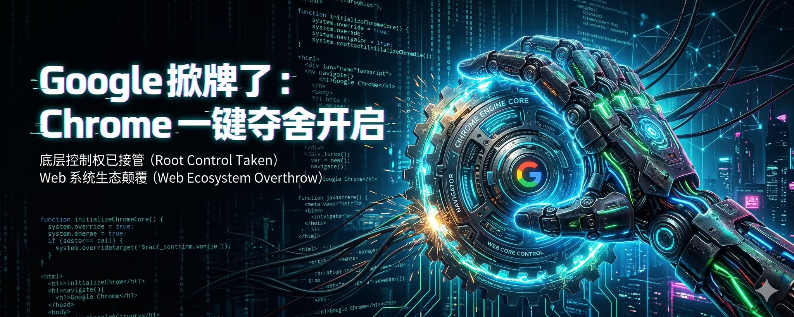
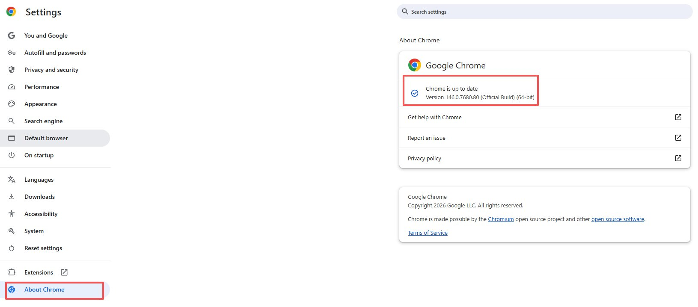
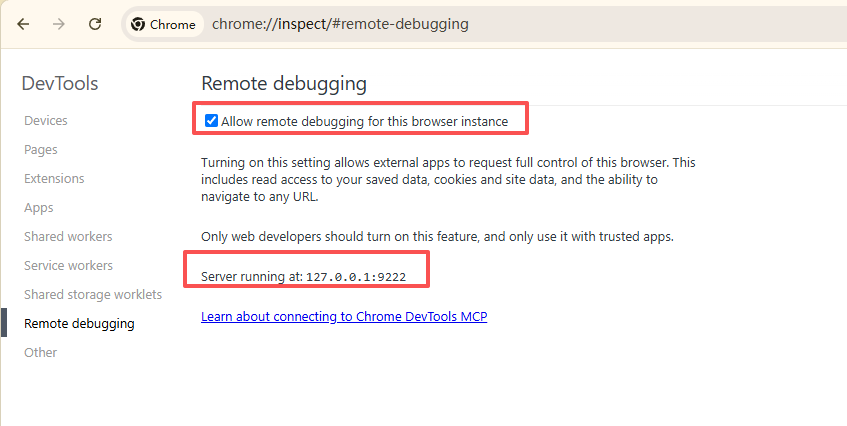
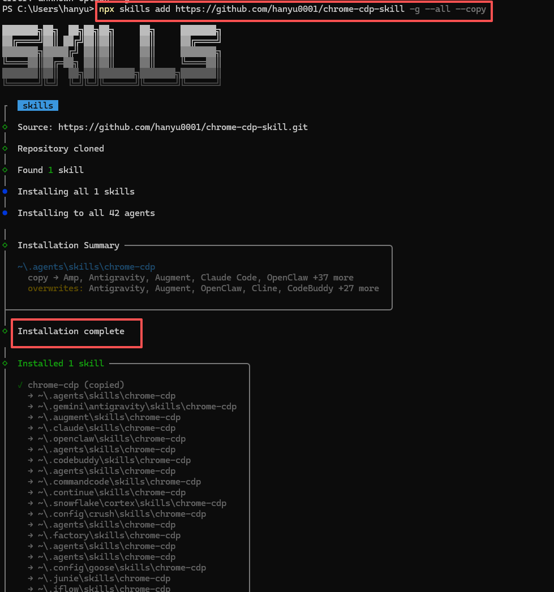
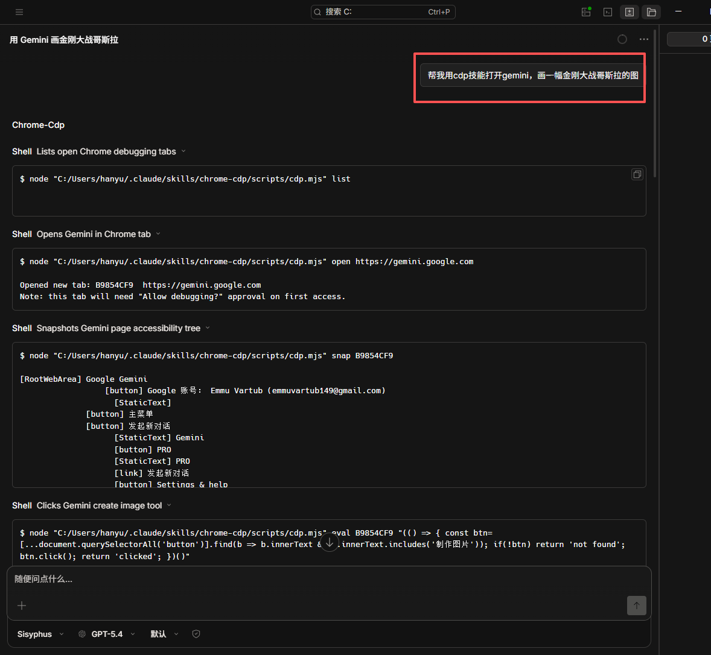
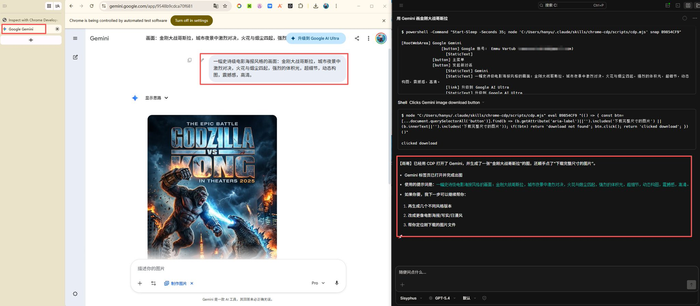

# Google 掀牌了：Chrome “一键夺舍”开启，AI 彻底接管浏览器（附极客避坑指南）



> 📖 **导读** 今天起，赶紧检查下你的 Chrome 浏览器，它可能要被“合法接管”了。 别紧张，这不是什么病毒入侵，而是 Google 悄悄给 AI 专门开的一个官方“后门”。 简单来说，以前的 AI 想帮你在网上订机票、抓数据，还得靠你写一堆复杂的启动脚本，跟防贼一样绕过各种验证。现在？**Chrome 146 官方版本**直接在界面里留了个“一键夺舍”的开关，完美支持当下最火的 **MCP (Model Context Protocol)**，把方向盘完完全全交给了你的私人贾维斯。这篇实操教程，将手把手教你如何开启这个“神仙开关”，让你的浏览器彻底进化为自动驾驶模式。

**【重要免责声明】**

本帖仅分享 Chrome 官方合法调试功能（chrome://inspect），供个人学习和本地使用。严禁用于任何非法、侵犯隐私或危害他人行为。使用前请阅读 Chrome 官方免责提示，用完立即关闭调试端口。作者不承担任何滥用后果。

## 告别繁琐脚本：Chrome 官方下场的降维打击

一直以来，让 AI 操作浏览器都是个极其痛苦的过程。 在过去（Puppeteer / Selenium 时代），你得敲代码配置无头浏览器，还得小心翼翼地伪装环境，稍不留神就被反爬虫规则无情封杀，满屏报错让你怀疑人生。 但现在，时代变了。**随着 Chrome 146 的正式推出**，官方直接放出了大招：原生级别的 **Remote debugging (远程调试)** 接口，并且完美拥抱了 **Chrome DevTools MCP** 协议。 这意味着像 Claude Code、Codex、Antigravity 这样的新一代智能 Agent，不再需要绕远路建立虚假环境，而是可以直接通过标准协议“看懂”可视 DOM 树，“听懂”原生能力调用。更有极其硬核的一点：它可以直接获取你已登录的 Cookie 状态，让你这台“被夺舍”的浏览器能够无感漫游各大网站！

## 🛠️ 保姆级实操：手把手教你开启 Chrome MCP 控制权

只需 1 分钟就能完成配置，告别一切繁杂代码！

**第一步：开启上帝视角，进入隐藏设置**

打开你的 **Chrome 146+** 浏览器（务必确保已更新至最新版），在地址栏复制并粘贴以下地址，然后回车：

```Plain Text
chrome://inspect/#remote-debugging

```

(注：这个页面通常是极客开发者用来调试网页的，但现在它成了 AI Agent 接管浏览器的官方合法通道。)



**第二步：勾选“一键夺舍”开关**

进入页面后，确保你停留在左侧菜单的 **Remote debugging（远程调试）** 选项卡上。 你会看到右侧出现了一个极其核心的开关： 👉 **☑️** **Allow remote debugging for this browser instance** (允许对此浏览器实例进行远程调试)

**果断打勾！** 开启这个选项后，你的浏览器就正式进入了被接管的**等待状态**。 (页面上也有官方明确的全量免责提示：开启此设置后，外部应用将有权请求该浏览器的完全控制权，包括任意读取保存的数据、Cookie、网站数据，以及随心所欲地导航到任何 URL。)



**第三步：连接你的 AI Agent**

当你打勾之后，页面上会立刻多出一行你当前本地机器的内网监听地址（通常是 Server running at: 127.0.0.1:9222）。这就对味了！

这行字意味着，你的浏览器大门已经向外敞开，随时可以接收外部 Agent 的协议指令。 接下来，你需要让你的 AI 助手（无论是你用的 VS Code / Cursor 里的 Antigravity 完整版插件，还是纯命令行的 Claude Code、Codex）与这个后门建立连接。

你可能会第一时间想到去装官方的 chrome-devtools-mcp 包。 **✋** **且慢！官方包目前有个致命痛点：** 官方版每次执行指令都会重新建立连接，导致 Chrome 的“允许远程调试”安全提示会**疯狂重复弹出**！而且如果你开着几十个标签页，Puppeteer 底层在穷举 Target 时极易超时卡死，血压飙升。

**极客的终极解法：丢掉官方包，拥抱直连平替** 为了解决这个痛点，极客圈更推崇通过 **WebSocket 直连**的平替方案：**chrome-cdp-skill**。 原项目本只支持 Mac / Linux，但为了让广大 Windows 玩家也能享受“零弹窗、秒级响应、百级标签页不卡顿”的神级体验，**我已经亲自为其编写了 Windows 的底层适配代码，并向原作者提交了 PR（Pull Request）！**

在官方合并之前，无论你是哪种端的用户，Windows 玩家可以直接用我 Fork 的增强分支尝鲜。

**只需一步导入，彻夜狂飙：** 它底层直接跑在原生 CDP WebSocket 上，**每个标签页仅需授权一次**（告别官方包疯狂连环弹窗的打扰）。点完“允许”后，AI 就能以此 Tab 为基站，在后台长驻极速接管。

> 🔥 **独家神级体验：** **1、静默控制，绝不绑架物理鼠标**：AI 在后台帮你自动拉取数据、敲字发送，完全不会抢夺你的系统鼠标焦点。你依然可以悠哉地按原来方式刷着别的网页甚至打着游戏，真正实现“数字分身”双线作战。 **2、DOM 级精准打击**：抛弃了慢半拍且极易点歪的“大模型截图猜坐标”，直接深入网页无障碍树（AX Tree）读取底层结构，实现了外科手术级别的 100% 精准点击与文本输入（甚至可以跨域 iframe 输入）。

（注意：以下命令适用于包含 Claude Code、Codex 或 Antigravity 等支持标准工具拓展的智能体。**极客提醒：请确保你的环境已安装 Node.js 22 或更高版本**，因为该项目完全抛弃了笨重的 Puppeteer，转而调用了 Node 22+ 原生的超轻量级 WebSocket API。）

**🖥️** **对于 Mac / Linux 用户（直接用原作者的官方源）：**

```Plain Text
npx skills add https://github.com/pasky/chrome-cdp-skill -g --all --copy

```

**🪟** **对于 Windows 用户（暂时使用我适配并提了 PR 的增强源）：**

```Plain Text
npx skills add https://github.com/hanyu0001/chrome-cdp-skill -g --all --copy

```

安装并连接成功后，你的 Agent 就彻底解锁了“上帝视角”。不管是微信网页版、内网 OA 系统还是复杂的股票看板，它都能直接继承你的已登录 Cookie 状态代为操作。



你只需在聊天框里下达自然语言指令体验其魔力，例如：

> “帮我打开 Gemini，画一张金刚大战哥斯拉的图”





## 时代真的变了

无论你是被无穷无尽的表单折磨的打工人，还是追求极致效率的极客玩家，这项更新都意味着：浏览器不再只是一个供人“观看”的工具，它正式成为了你可以随时向 AI 下发指令的**强大执行器**。不用再自己手动冲浪的爽感，一旦体验过，就再也回不去了。

> 💡 **互动时间**： **如果你的浏览器已经变成了全自动驾驶模式，你第一反应想让它帮你去代干什么脏活累活？** 👇 **欢迎在评论区大开脑洞！也别忘了把这个硬核技巧转发给身边每天还在手动复制粘贴数据的朋友们！**

---

> 来源：飞书 · AI Spark 知识库 ｜ 原文（最新版）：<https://lcnniolukk80.feishu.cn/wiki/DTxtw3Dc6iBH7hkawg2cHKE5nPf> ｜ 归档：2026-06-04
