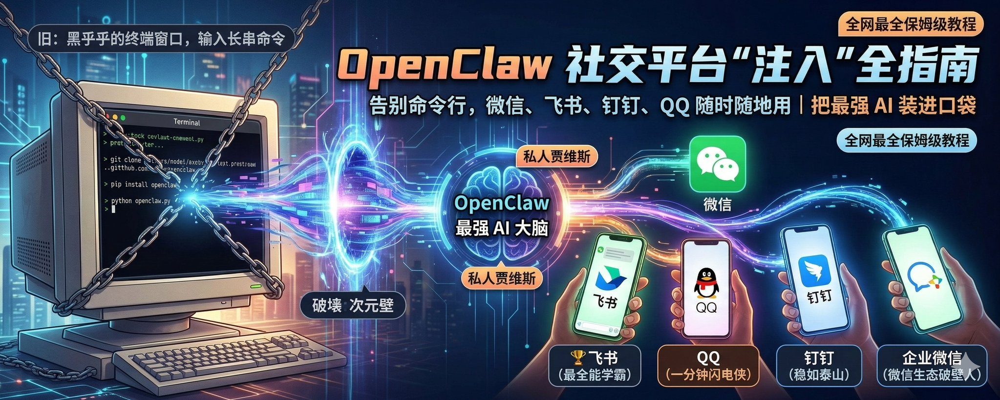
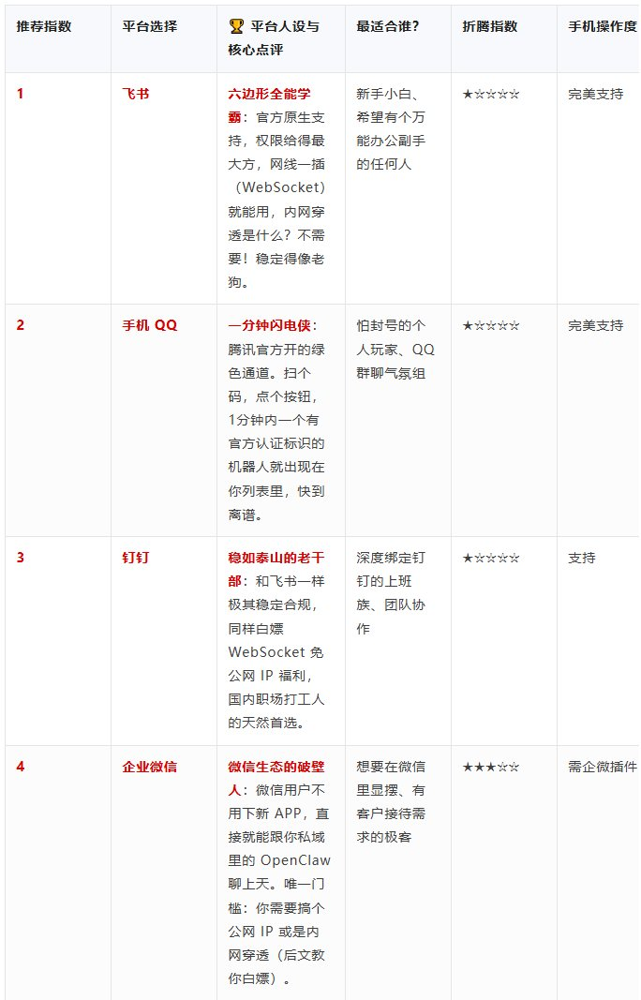

# OpenClaw 国内社交平台“注入”全指南：把最强 AI 装进口袋



**导读**

最近，被称作“地表最强 AI 助理”的 OpenClaw 火遍了整个朋友圈。 但现实是：你是不是每次想找它帮忙，都得正襟危坐地打开电脑，调出黑乎乎的终端窗口，输入一长串启动命令？要是人在外面、或者离开工位，它就彻底歇菜了。 **这哪里是随叫随到的 AI 助理，这简直是个得供着的小祖宗！**

今天，这篇**全网最全保姆级教程**要帮你彻底打破这个次元壁。我们要教你把这个「最强 AI 大脑」像加好友一样，直接塞进你每天离不开的**微信、飞书、钉钉、QQ** 里。 随时随地、掏出手机、发条语音或文字，你的「私人贾维斯」立马在后台疯狂搜资料、写代码、发报告。赶紧收藏这篇，彻底告别反人类的命令行！

## 🔝 哪个平台最适合你？懒人接入爽度大揭秘

我们完全站在普通人的视角，抛开枯燥的技术名词，按「**合规不封号 > 闭眼能接上 > 稳定不断联 > 手机操作爽度**」这四大硬核标准，帮你排好了各个平台的推荐指数。 强烈建议只选「一次搞定、长期能用、绝不踩坑」的平台，拒绝花里胡哨的高风险作死操作。




## 📖 四大平台全盘点：闭眼选指南

所有教程均适配国内网络，命令可直接复制粘贴，关键参数标注清晰，零技术基础也能一次成功。

**【强烈推荐】飞书（首推！零风险 最稳定 新手首选）**

**核心定位**

全场景通用，官方原生适配，WebSocket长连接免公网IP，内网就能用，完全合规无任何风控风险，一次配置长期稳定不掉线，新手小白闭眼冲。

**前置准备**

1. 一个飞书账号（个人免费账号即可，无需企业资质）
2. 已完成安装的OpenClaw环境

**保姆级分步教程**

**第一步：飞书开放平台配置（全程手机/电脑均可操作）**

1. 手机/电脑浏览器打开 [飞书开放平台](https://open.feishu.cn/)，用飞书APP扫码登录
2. 首页点击「创建应用」→ 选择**企业自建应用**，随便填应用名称、描述，点击「确定创建」
3. 左侧菜单找到「凭证与基础信息」，**复制保存2个核心参数：App ID、App Secret**（后面配置要用到，别漏）
4. 左侧菜单点击「权限管理」，搜索并开通3个核心权限（必须开，不然收不到消息）：im:message:send_as_bot（以机器人身份发送消息） im.message.receive_v1（接收用户消息） contact:user.employee_id:readonly（读取用户基础信息）
5. 左侧菜单点击「机器人与Webhook」→ 点击「启用机器人」，开启机器人能力
6. 左侧菜单点击「事件订阅」→ 订阅方式**必须选「WebSocket长连接」**（免公网IP，核心优势）
7. 同页面下滑，点击「添加事件」，搜索并添加「接收消息v2.0」事件，添加后会自动匹配权限，确认权限已开通
8. 页面右上角点击「发布版本」→ 填写版本号、更新说明，点击「提交发布」，等待审批（自己创建的应用，自己就是管理员，直接在飞书管理后台审批通过即可）

**第二步：OpenClaw侧配置（复制粘贴30秒搞定）**

打开OpenClaw终端，逐条执行以下命令，替换成你自己的App ID和App Secret即可：

```Plain Text
# 1. 安装飞书官方插件（国内网络优化版，自动适配镜像）
openclaw plugins install @openclaw/feishu --registry https://registry.npmmirror.com

# 2. 开启飞书渠道，配置核心参数（替换引号里的内容为你自己的）
openclaw config set channels.feishu.enabled true
openclaw config set channels.feishu.appId "你的飞书App ID"
openclaw config set channels.feishu.appSecret "你的飞书App Secret"

# 3. 重启网关，让配置立即生效
openclaw gateway restart

```

**第三步：成功验证**

打开飞书APP，在联系人里找到你创建的机器人，单聊发送「你好」，或者拉到群里@机器人发送消息，收到自动回复即为接入成功。


**必看避坑提示**

- 必须先发布应用并审批通过，不然机器人无法正常收发消息
- 事件订阅一定要选WebSocket长连接，不要选HTTP回调，不然需要公网IP
- 权限必须全部开通，少一个都会导致收不到消息

**【官方极速通道】手机QQ（1分钟搞定 手机端专属）**

**核心定位**

腾讯官方合作专属通道，个人QQ号直接用，零审核、零资质、零开发，全程手机1分钟搞定，完全合规无封号风险，是目前手机QQ接入的最优解。

**前置准备**

1. 一个实名的QQ号（和QQ钱包实名通用，个人号即可，无需企业资质）
2. 已完成安装的OpenClaw环境（电脑/服务器/手机Termux均可）

**保姆级分步教程**

**第一步：手机端一键创建QQ机器人（全程手机操作）**

1. 手机浏览器打开 **OpenClaw专属官方入口**：[https://q.qq.com/qqbot/openclaw/login.html](https://q.qq.com/qqbot/openclaw/login.html)
2. 点击页面的「QQ扫码登录」，用你要绑定的QQ号扫码登录，未实名的QQ号会自动跳转到实名页面，按提示完成实名（10秒搞定，无额外信息收集）
3. 登录成功后，点击页面中间的【创建机器人】，自定义机器人名称、头像，点击「确认创建」，**一键生成专属机器人**
4. 创建完成后，页面会自动生成3条填好你专属Token的预设命令，**直接全部复制保存**，无需自己手动修改任何内容，零出错概率

**第二步：OpenClaw侧配置（复制粘贴30秒搞定）**

打开OpenClaw终端，把刚才复制的3条命令逐条执行即可，无需修改任何内容：

```Plain Text
# 1. 安装QQ官方推荐插件（国内网络优化版）
openclaw plugins install @sliverp/qqbot@latest --registry https://registry.npmmirror.com

# 2. 绑定你的专属QQ机器人（命令里已自动填好你的Token，直接复制执行）
openclaw channels add --channel qqbot --token "你的机器人专属Token"

# 3. 重启网关生效配置
openclaw gateway restart

```

**第三步：成功验证**

打开手机QQ，机器人会自动出现在你的联系人列表里，直接私聊发送消息，或者拉到群里@机器人发送消息，收到自动回复即为接入成功。


**必看避坑提示**

- 一个QQ号最多可创建5个独立机器人，完全免费
- 机器人是QQ官方正规账号，有官方标识，无任何封号风险，放心使用
- 不要泄露你的机器人Token，避免被他人盗用

**【团队协作首选】钉钉（办公首选 稳定合规 免公网IP）**

**核心定位**

国内企业办公覆盖率最高，和飞书一样稳定合规，WebSocket免公网IP，接入门槛极低，适合团队/企业办公场景使用。

**前置准备**

1. 一个钉钉账号（个人免费账号即可，可创建个人团队）
2. 已完成安装的OpenClaw环境

**保姆级分步教程**

**第一步：钉钉开放平台配置**

1. 手机/电脑浏览器打开 [钉钉开发者平台](https://open-dev.dingtalk.com/)，用钉钉APP扫码登录
2. 顶部导航栏点击「应用开发」→ 选择「机器人」→ 点击「创建机器人」
3. 选择「内部机器人」，填写机器人名称、图标、简介，选择可见范围，点击「确认创建」
4. 机器人详情页，**复制保存3个核心参数：Webhook地址、AppKey、AppSecret**（后面配置要用到）
5. 左侧菜单点击「消息接收」→ 开启「消息接收能力」，接收模式**选择「WebSocket模式」**（免公网IP，核心优势）
6. 左侧菜单点击「权限管理」，确认已开启「消息接收与发送」全量权限，未开启的手动开启
7. 页面右上角点击「发布」，选择可见范围，点击「确认发布」，完成上线

**第二步：OpenClaw侧配置**

打开OpenClaw终端，逐条执行以下命令，替换成你自己的参数：

```Plain Text
# 1. 安装钉钉官方插件（国内网络优化版）
openclaw plugins install @openclaw/dingtalk --registry https://registry.npmmirror.com

# 2. 开启钉钉渠道，配置核心参数（替换引号里的内容）
openclaw config set channels.dingtalk.enabled true
openclaw config set channels.dingtalk.webhook_url "你的钉钉Webhook地址"
openclaw config set channels.dingtalk.app_key "你的钉钉AppKey"
openclaw config set channels.dingtalk.app_secret "你的钉钉AppSecret"

# 3. 重启渠道和网关，生效配置
openclaw channel restart dingtalk
openclaw gateway restart

```

**第三步：成功验证**

打开钉钉APP，把机器人添加到群里，@机器人发送消息，收到自动回复即为接入成功。

**必看避坑提示**

- 必须完成发布，机器人才能正常使用，未发布的机器人仅开发者自己可用
- 优先使用WebSocket模式，无需公网IP，稳定性远高于Webhook回调
- 可见范围要设置正确，不在可见范围内的用户/群聊无法使用机器人

**【微信生态破壁人】企业微信（唯一打通微信生态 私域首选）**

**核心定位**

唯一能直接对接微信用户的方案，微信用户无需下载企业微信，直接在微信里就能和机器人对话，适合有微信私域、客户对接需求的用户，唯一缺点是需要公网IP/内网穿透。

**前置准备**

1. 一个企业微信账号（个人可免费注册企业，无需营业执照）
2. 已完成安装的OpenClaw环境
3. 公网IP/内网穿透工具（推荐cpolar/frp，新手用cpolar，有免费额度）

保姆级分步教程

**第一步：提前搞定内网穿透（无公网 IP 必看补充）**

如果没有公网 IP，请先执行这一步；如果有，可直接跳过：

1. 电脑/服务器下载cpolar：[https://www.cpolar.com/](https://www.cpolar.com/)，注册账号并安装
2. 打开cpolar，执行命令映射OpenClaw默认端口：cpolar http 18789
3. 复制生成的公网地址（比如 [https://xxx.cpolar.io/](https://xxx.cpolar.io/)），后面回调URL要用到，格式为：你的公网地址/api/v1/channels/wecom

**第二步：企业微信管理后台配置**

1. 电脑浏览器打开 [企业微信管理后台](https://work.weixin.qq.com/)，用企业微信扫码登录
2. 顶部导航栏点击「应用管理」→ 点击「创建应用」
3. 填写应用名称、logo，选择可见范围，点击「创建应用」
4. 应用详情页，**复制保存3个核心参数：AgentId、Secret**；页面底部「我的企业」里可获取企业CorpID，一并保存
5. 应用详情页，找到「功能」→「接收消息」→ 点击「设置API接收」
6. URL填写：http://你的公网IP:18789/api/v1/channels/wecom（或cpolar生成的公网地址）
7. Token和EncodingAESKey点击「随机获取」，**复制保存下来**，后面配置要用到
8. 先不要点击「保存」，等OpenClaw侧配置完成后再回来保存
9. 左侧菜单点击「权限管理」→「应用权限」，开启「发送消息」「接收消息」全量权限
10. 「开发者接口」→「可信域名」，填写你的公网IP/域名，完成配置

**第三步：OpenClaw侧配置**

打开OpenClaw终端，逐条执行以下命令，替换成你自己的参数：

```Plain Text
# 1. 安装企业微信官方插件（国内网络优化版）
openclaw plugins install @openclaw/wecom --registry https://registry.npmmirror.com

# 2. 开启企业微信渠道，配置核心参数（替换引号里的内容）
openclaw config set channels.wecom.enabled true
openclaw config set channels.wecom.corp_id "你的企业CorpID"
openclaw config set channels.wecom.agent_id "你的应用AgentId"
openclaw config set channels.wecom.secret "你的应用Secret"
openclaw config set channels.wecom.token "你随机生成的Token"
openclaw config set channels.wecom.encoding_aes_key "你随机生成的EncodingAESKey"

# 3. 重启渠道和网关，生效配置
openclaw channel restart wecom
openclaw gateway restart

```

**第四步：完成验证&成功使用**

1. 回到企业微信「API接收」页面，点击「保存」，提示保存成功即为对接完成
2. 打开企业微信，进入应用发送消息，或在微信「企业微信插件」里找到应用，发送消息，收到自动回复即为接入成功。


**必看避坑提示**

- 必须先配置好OpenClaw侧并重启网关，再回到企业微信点击保存，不然会提示回调验证失败
- 内网穿透地址要保持稳定，cpolar免费版地址会24小时变化，变化后要同步更新企业微信里的URL
- 微信用户只能在「企业微信插件」里使用，无法直接在微信联系人里搜到机器人，这是微信平台的限制

> **互动时间不知道该怎么做微信图文排版？或者在配置哪个平台时卡壳了报错？** 👇 **关注我，在评论区留下你接入时碰到的问题，我手把手教你解决！** 如果觉得这篇全网最全保姆级教程有用，别忘了 **点赞 + 收藏 转发给你的极客朋友们**，大家一起光速部署私人 AI 助手！

---

> 来源：飞书 · AI Spark 知识库 ｜ 原文（最新版）：<https://lcnniolukk80.feishu.cn/wiki/RPoTwVQC3iar4pkCyC8cVMtqnrg> ｜ 归档：2026-06-04
