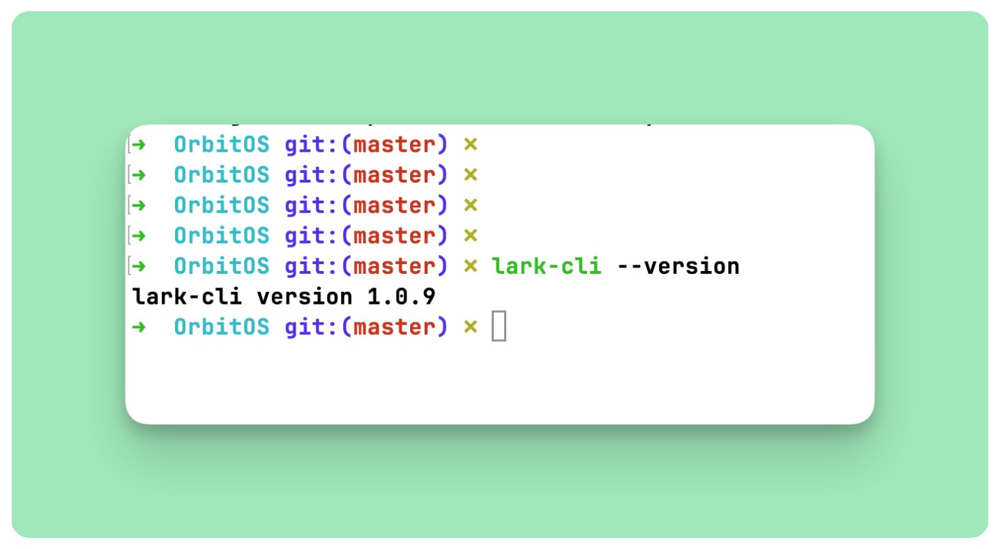
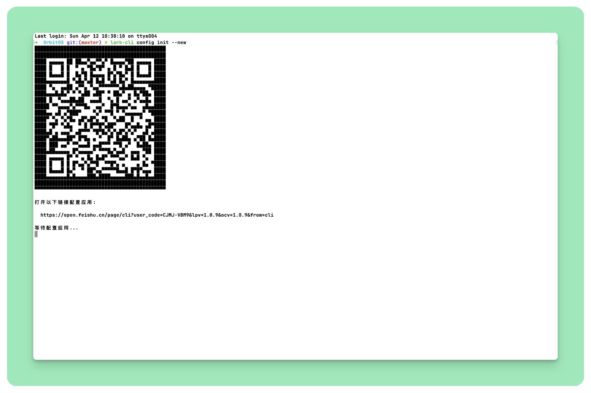
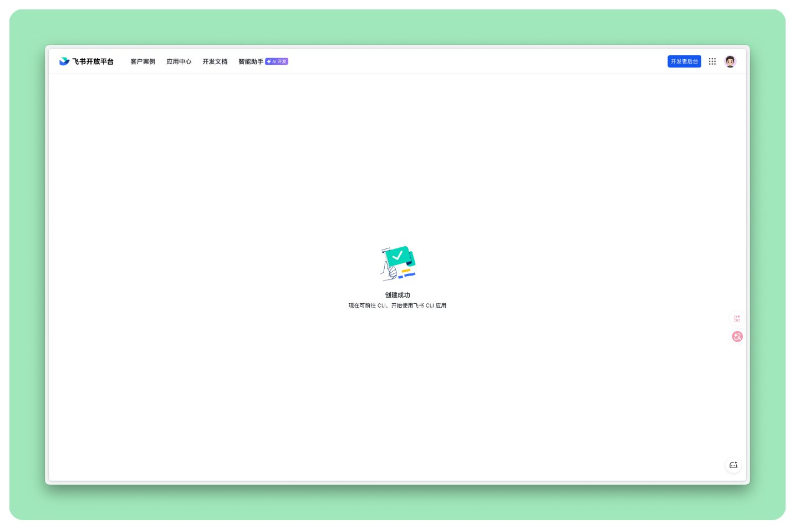
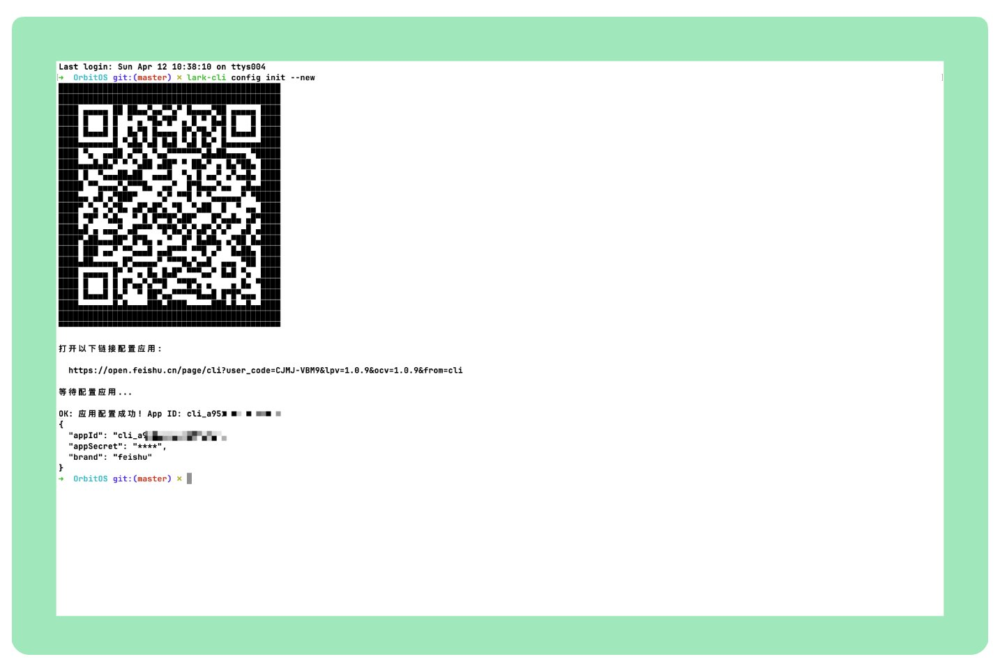
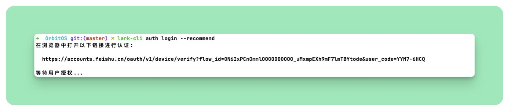
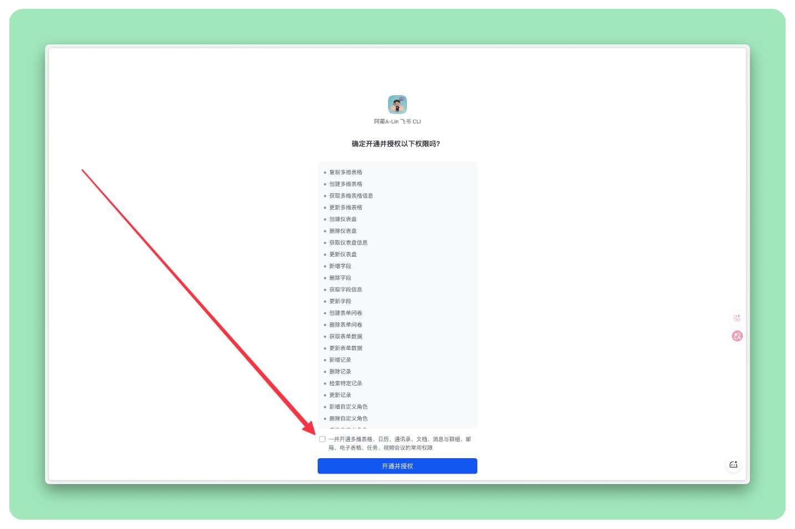
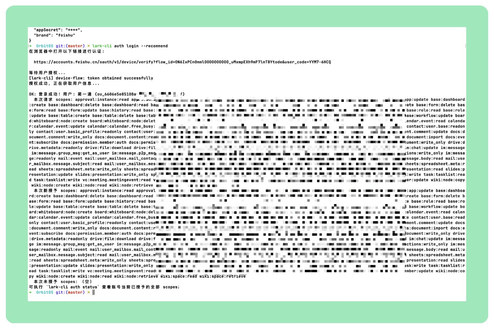
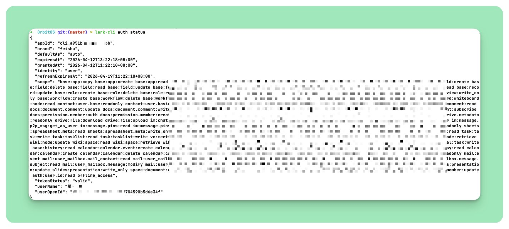
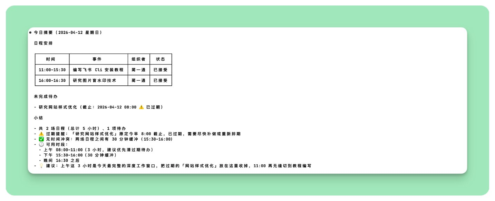

# 三行命令，让 Claude 直接操作你的飞书


三行命令装好 lark-cli，你的 Claude Code 就能直接操作飞书。发消息、查日历、建文档、管任务，不用切窗口。

飞书官方出的工具，专门给 AI Agent 设计。Claude Code、Cursor、Windsurf 都支持。

整个过程三步，5 分钟：

① 安装 lark-cli，1 分钟 ② 创建飞书应用，2 分钟 ③ 登录授权，1 分钟

跟着走就行。

## 𝟭 安装 lark-cli

前提：电脑上得有 Node.js。没有的话先装一个，Mac 用 brew install node，Windows 去官网下。

打开终端，两行命令：

```Bash
npm install -g @larksuite/cli

```

```Bash
npx skills add larksuite/cli -y -g

```

第一行装 CLI 本体，第二行装 23 个 AI Skills。

Skills 是什么？简单说就是"说明书"。lark-cli 本身只是个工具，Skills 告诉 AI "飞书有哪些能力、参数怎么传、返回什么格式"。没装 Skills 的话，AI 不知道怎么调用它。就像一台没装 App 的手机，硬件在那，但啥也干不了。

装完验证一下：

```Bash
lark-cli --version

```

看到版本号就行。我装的时候是 v1.0.9。



> Q：一定要全局安装（-g）吗？

> A：建议是的。AI 编辑器需要在任意目录下都能找到 lark-cli，全局安装最省事。

## 𝟮 创建飞书应用

这一步在浏览器里操作。lark-cli 需要一个飞书应用作为"身份证"，才能调用飞书的 API。

终端里跑：

```Bash
lark-cli config init --new

```

终端会弹出一个二维码和一个链接。



打开链接，进入飞书开放平台。页面很简单，选个头像，确认应用名称，点"创建"。


点完之后浏览器显示"创建成功"。



回到终端，已经自动检测到配置完成，App ID 也拿到了。



💡 应用的 App ID 和 Secret 会自动存到系统钥匙串里，不用你手动记。

## 𝟯 登录授权

应用创好了，还需要授权一次，告诉飞书"我允许这个应用以我的名义操作"。

```Bash
lark-cli auth login --recommend

```

终端会给你一个授权链接。



在浏览器打开，飞书会列出这个应用要申请的权限。



点同意。

授权完成后浏览器会提示成功。



回到终端验证一下：

```Bash
lark-cli auth status

```

看到你的飞书用户名和权限列表，搞定。



## 试一下：一句话看今天的安排

装好了，来点真正有用的。

每天早上打开电脑，第一件事是什么？翻日历看今天有几个会，再看一眼待办有没有过期的。两个 App 来回切，5 分钟就过去了。

有了 lark-cli，一句话搞定。

打开 Claude Code，跟它说：

> 帮我看看今天的日程和待办。

Claude 会自动干这几件事：

1. 调用 lark-cli calendar +agenda 拉今日日程
2. 调用 lark-cli task +get-my-tasks 拉未完成待办
3. 把结果整理成一份今日摘要，过期的待办还会标出来



整个过程我没碰过飞书客户端，没打开日历，也没看待办列表。一句话，今天该干嘛一目了然。

这只是最简单的用法。后续这个系列会持续更新，感兴趣的话关注一下。

## 能干什么

装好 lark-cli 之后，AI 能帮你操作的飞书功能比你想的多：查日程、创建会议、查空闲时间、发消息、回复、搜聊天记录、创建飞书文档、读取内容、建多维表格、写数据、创建待办、分配任务、读邮件、发邮件、查会议记录、拿会议纪要。

基本上你在飞书客户端里常用的功能，终端里都能干。

## 总结

三步：① 装 CLI 和 Skills ② 创建飞书应用 ③ 登录授权。5 分钟。

装完之后，你的 AI 编辑器就多了个飞书遥控器。不用切窗口，对话不中断。查日程、发消息、整理会议纪要这些琐事，直接在终端里顺手就做了。

这个系列后续会持续更新，比如怎么串成自动化工作流、怎么用机器人帮你处理消息。感兴趣的话关注一下。

---

> 来源：飞书 · AI Spark 知识库 ｜ 原文（最新版）：<https://lcnniolukk80.feishu.cn/wiki/QYkSwsVykiWALGkfLKNcNMDznod> ｜ 归档：2026-06-04
