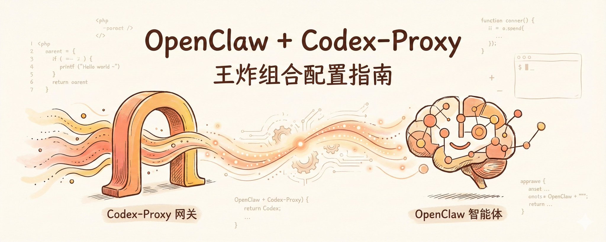
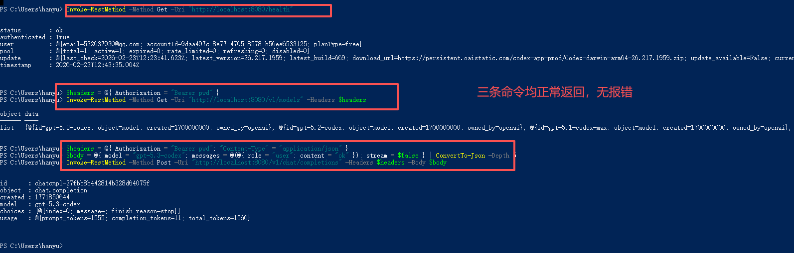
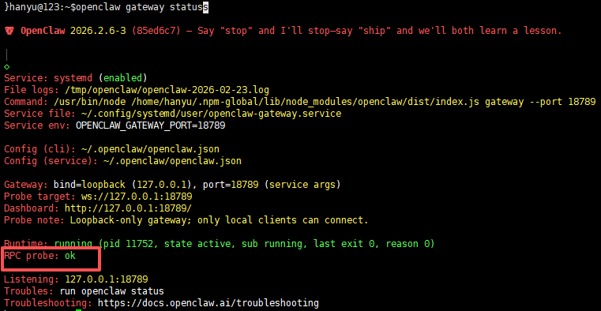
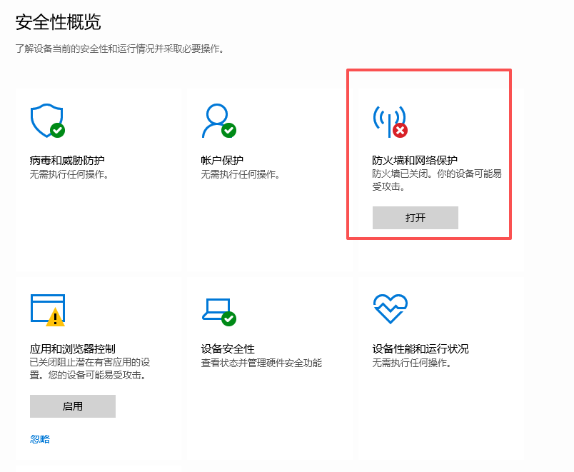
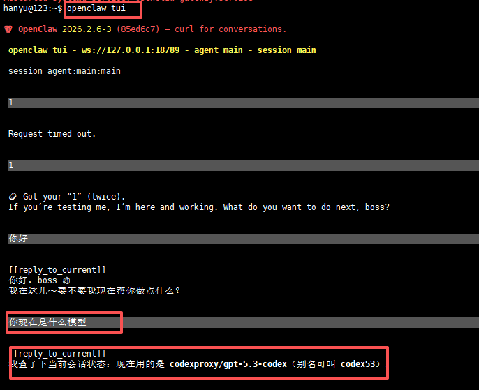

# 别让你的 ChatGPT 账号吃灰了，OpenClaw + codex-proxy 进阶实战



**导语**： 上一篇文章教大家把吃灰的 ChatGPT 账号通过 codex-proxy 变成了万能的本地 API 接口后，

> 2月22日

评论区里呼声最高的一个问题就是： “既然它转出的是标准的 OpenAI 接口，那大名鼎鼎的 **OpenClaw**（顶级 AI Agent 框架）是不是也能无缝用上它？” 答案是：**不仅能用，而且简直是绝配！** OpenClaw 需要强大的底层大模型来驱动其复杂的思维流，而 codex-proxy 刚好提供了一个免费、稳定还能多号轮询的本地接口池。但是，在实际对接这两位“神仙”时，很多老手都在一些配置细节上翻了车。 今天这篇进阶指南，专门教你如何把这对王炸组合丝滑地焊死在一起！

## 0. 磨刀不误砍柴工：先给 Proxy “打个神级补丁”

既然要把 proxy 接入 OpenClaw 这种复杂的特工框架，首先得保证我们的弹药库是满配状态。

**最新版本的 codex-proxy 恰好加入了一项杀手级特性：全面支持了 Tool Calling（工具调用协议）！** 这是 OpenClaw 能否流畅运行并自主调用各种插件的绝对核心前提。

所以，哪怕你前两天才刚装好 proxy，也强烈建议你花 1 分钟敲下这几行命令，给底座升个级：

打开你运行 proxy 的 Windows 终端，进入项目目录：

```Plain Text
cd "D:\claude code\codex-proxy"
# 先把你本地可能的瞎折腾备份一下
git stash push -u -m "before-update"
# 拉取最新代码
git pull --rebase origin master
# 重新构建并启动服务！
docker compose build --no-cache
docker compose up -d

```

(如果在 build 这里遇到一串红字的 502 网络波动的报错，别慌，重新执行一次 docker compose build --no-cache 即可顺利闯关。)

升级完，务必记得做一轮最小闭环验证（别只测 health）：

```Plain Text
curl http://localhost:8080/health
curl http://localhost:8080/v1/models
curl -sS "http://localhost:8080/v1/chat/completions" -H "Authorization: Bearer pwd" -H "Content-Type: application/json" -d '{"model":"gpt-5.3-codex","messages":[{"role":"user","content":"ok"}],"stream":false}'

```

三条都通过，再继续往下冲。

如果你在 Windows PowerShell 里验证，请不要直接用 curl -H -d 这种写法（会命中 curl 别名冲突）。 推荐用 Invoke-RestMethod：

```Plain Text
Invoke-RestMethod -Method Get -Uri "http://localhost:8080/health"

$headers = @{ Authorization = "Bearer pwd" }
Invoke-RestMethod -Method Get -Uri "http://localhost:8080/v1/models" -Headers $headers

$headers = @{ Authorization = "Bearer pwd"; "Content-Type" = "application/json" }
$body = @{ model = "gpt-5.3-codex"; messages = @(@{ role = "user"; content = "ok" }); stream = $false } | ConvertTo-Json -Depth 5
Invoke-RestMethod -Method Post -Uri "http://localhost:8080/v1/chat/completions" -Headers $headers -Body $body

```



## 1. 对接 OpenClaw 最大的配置坑：进错前门

很多小伙伴在拿到 proxy 的本地接口后，去 OpenClaw 里满心欢喜地填好配置，一启动却收到一盆冷水——**Unrecognized keys（无法识别的参数）**。

这是全网 80% 的人都会踩的坑：**概念混淆**。

大家往往会直觉性地把 proxy 接口填进了 auth.profiles（认证档案模式）下面，就像把客人请错了房间。 codex-proxy 对 OpenClaw 来说，不叫档案，叫**全新的模型渠道供应商**（必须要写进 models.providers 里）！

**正确对接姿势（直接抄作业）：** 请用代码编辑器打开你的 ~/.openclaw/openclaw.json 文件。干脆利落地把原来的错误尝试删掉，换成这套满配的 VIP 席位：

```Plain Text
{
  models: {
    providers: {
      codexproxy: {
        // 这个 IP 必须填你运行 Docker 的那台电脑地址
        baseUrl: "http://192.168.0.112:8080/v1",
        // 这里请填写你 config/default.yaml 中 server.proxy_api_key 的实际值
        apiKey: "pwd", 
        api: "openai-completions",
        models: [
          { id: "gpt-5.3-codex", name: "GPT-5.3 Codex (Proxy)" },
          { id: "codex", name: "Codex (Proxy)" }
        ]
      }
    }
  },
  agents: {
    defaults: {
      model: {
        // 指定默认主要使用我们刚配置好的模型
        primary: "codexproxy/gpt-5.3-codex"
      },
      models: {
        "codexproxy/gpt-5.3-codex": {
          alias: "codex53"
        }
      }
    }
  }
}

```

不习惯添加代码的，可以用命令行添加配置也可以：

```Plain Text
openclaw config set models.providers.codexproxy '{
  baseUrl: "http://192.168.0.112:8080/v1",
  apiKey: "pwd",
  api: "openai-completions",
  models: [
    { id: "gpt-5.3-codex", name: "GPT-5.3 Codex (Proxy)" },
    { id: "codex", name: "Codex (Proxy)" }
  ]
}'

```

```Plain Text
openclaw config set agents.defaults.model.primary "codexproxy/gpt-5.3-codex"

```

保存文件后，必须要重启网关让新配置生效：

```Plain Text
openclaw gateway restart

```

**极其关键的一手查房**： 紧接着，敲一下命令查看网关的运行脉搏：

```Plain Text
openclaw gateway status

```

当你看到屏幕吐出 RPC probe: ok 时，长舒一口气吧——你们的接头成功了！



## 2. 跨设备联调的“隐形高墙”：本地防火墙

这也是一个让人极度崩溃的典型场景：OpenClaw 通常跑在你的 Linux 或虚拟机（Ubuntu）里，而你的 codex-proxy 则安装在主力 Windows 电脑上。

你看着一通乱敲的终端叹气：“我虚拟机明明能 ping 通我的 Windows 呀，为什么 OpenClaw 就是连不上 API 接口？” 不要再去怀疑配置写错了。这大概率是因为 Windows 本地的“防火墙大爷”，把它当成陌生设备，直接把网络请求给掐断了。

**极客的排雷套路：先撤保安，看牌再上锁。** 在你运行代理的 **Windows 电脑**上，用管理员身份打开 PowerShell，执行这条硬核指令：

```Plain Text
Set-NetFirewallProfile -Profile Domain,Public,Private -Enabled False

```



此时，再去你的 Ubuntu 虚拟机上，让 OpenClaw 测一下接口。如果立马就通畅了——恭喜，精准定位病根！



## 结语：享受“免费智能大脑”的掌控快感

折腾这两篇教程、手搓 JSON 配置、跨系统排查网络……看似是在踩无数个坑，但这一切的终点，是你亲手将一个闲置的“聊天玩具”，熔铸成了一个能在 OpenClaw 这样高级 Agent 里飞速运转的智慧心脏。

这套“王炸组合”已经配好，接下来，是时候让你的 OpenClaw 开始疯狂吞吐代码，执行任务了！

> **💬** **文末彩蛋交流时间：** 你们的 OpenClaw 成功跑上 codex-proxy 的高速公路了吗？你们用这套黄金搭档干成了什么炫酷的事？或者是部署过程卡在了哪一步？直接把截图甩在评论区，咱们一起来盘它！

---

> 来源：飞书 · AI Spark 知识库 ｜ 原文（最新版）：<https://lcnniolukk80.feishu.cn/wiki/DCc8wVg3TiFioPkVbe5cowSMnMb> ｜ 归档：2026-06-04
