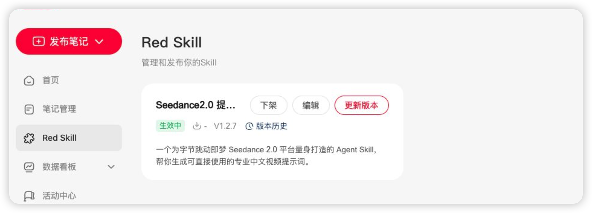
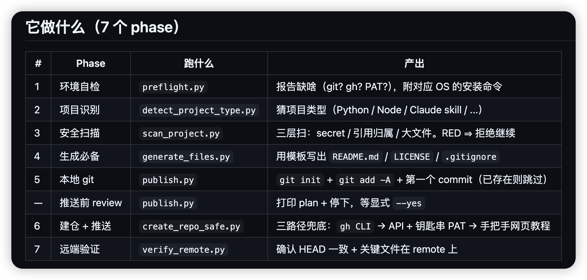
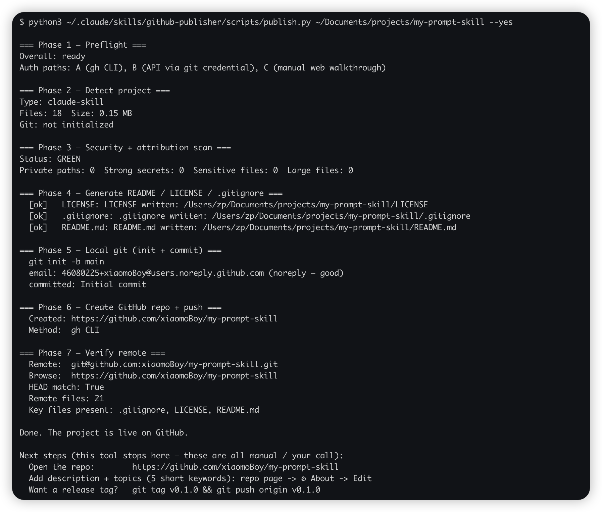
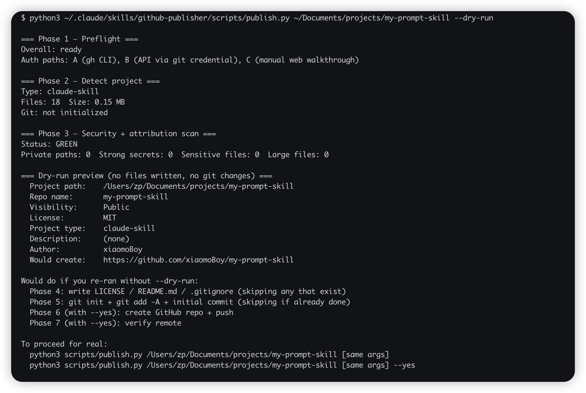
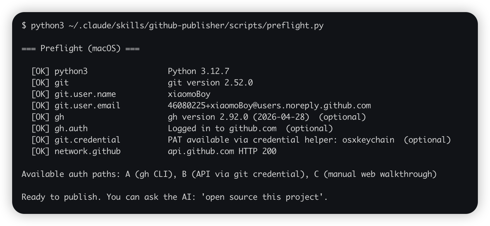

# 我把「开源」这件事本身做成了 Skill：让 AI 全自动帮你发布 GitHub 仓库

最近几天小红书出了可以上传自己的 skill 活动，虽然是内测阶段但是也代表着一个方向，Skill 公开化或者是可以变成自己的收益。

但是也有很多人想分享自己的 Skill，但是没有开源的概念，也不知道什么是 GitHub，也不会安装环境，

我就想设计一个开源小白也能上手的 skill，只需要让 AI 扫描你的电脑就可以把一些你自己沉淀的 Skill 选择性的开源出来，只需要 GitHub 账户就可以实现，

不了解 GitHub 也没关系，后面我有时间也会专门花时间去讲解一下 GitHub 出一篇文章。



---

## 小红书 Skill 上传开了内测，但有一群人卡在了"什么是 GitHub"

从小红书开放skill上传，你就可以明显的看出来，国内平台对ai尤其是skill的发展有多么重视。

但实际想分享的人，问到怎么发出去，回答经常是这几句：

- "GitHub 是什么"
- "我电脑要装什么东西吗"
- "命令行我不会用"

我评论区看到的最多的就是我想把我自己的skill分享出来，但是我不知道怎么办，我也不知道怎么开源。

---

## 我做的事：让 AI 扫你电脑，选择性把 Skill 开源出去，只要一个 GitHub 账号

直接介绍 skill 的模块内容、还有设计思路、对于小白来说我做了哪些优化，如果是一个不懂的小白上手需要注意哪些地方。分为哪几个阶段，讲清楚这些就可以了。

这个 skill 叫 **github-publisher**。你告诉 AI"开源这个文件夹"，AI 就替你把整套流程跑完。

我在设计时事先想好的几条是这样：

- **门槛只到 GitHub 账号**——你只需要去 github.com 注册一个号，不需要懂仓库、分支、提交是什么
- **不会装命令行也能用**——缺什么 AI 会问你"要不要装"，你点头它就装
- **不替你判断该不该开源**——只列证据：哪几个文件有 secret、哪些路径暴露了用户名、哪些文件超过 50MB，给你看，由你决定改不改
- **不动你的代码**——只新加 README / LICENSE / .gitignore 三个文件，不改你已有的 .py 或 .md 一行

其实做这么多工作，只是为了消除门槛，让小白直接能上手一条命令，就可以让ai帮你完成skill的开源工作，你只需要做的就是去注册一个Github账号。

---

## Skill 分成 7 个阶段，每一步 AI 替你跑

拆成 7 个阶段，主要是怕一路推到 GitHub 才发现 secret 已经泄出去。停在哪一步，错在哪、怎么修都看得见。



简单过一下每个阶段在做什么：

1. **体检环境**——git / gh / 网络通不通，缺啥告诉你装哪条命令
2. **识别项目**——决定后面给你哪份 `.gitignore` 模板
3. **三层安全扫描**——扫 secret（OpenAI key / GitHub token / AWS key 等 13 种）、扫硬编码用户路径、扫大文件。**标红就拒绝继续**
4. **生成必备文件**——README / LICENSE / .gitignore 按模板写
5. **本地 git**——init + add + commit。gmail / qq 邮箱会软提示
6. **建仓 + push**——必须你显式说"推"才推。gh CLI / 钥匙串里的 token / 网页教程，三路径兜底
7. **远端验证**——对一下本地和远端 HEAD 是不是一致

我自己在本地也跑过很多遍了，大大小小出过很多问题，比如说设置权限有问题、上传的skill没有过审、开源项目文档不够齐全，没有说清楚，具体是干嘛的。

不过最终我都处理了我多轮检查，也是为了让小白可以更放心的直接在自己电脑上运行，不需要处理技术问题的。



---

## 为零经验小白做了哪些预设

光把流程走通不够。一个从来没碰过 GitHub 的人，跑过一次就觉得"这玩意我搞不定"，那这个 skill 就白做了。下面这几条是专门为"零经验"做的：

**`--dry-run` 真的零副作用**

不带 `--yes` 也会停在推送之前，但已经默默给你 `git init` 了，也写了 LICENSE / README。`--dry-run` 是只跑前 3 步（体检、识别、扫描），打一份"如果真跑会怎样"的报告，**不写任何文件、不 git init、不 commit**。



**README 占位符发布前会醒目警告**

生成的 README 里如果还带着 `<install instructions go here>` 这种占位符，push 完会专门红字提醒你改。不会让你带着 `<…>` 推出去当众穿帮。

**邮箱是私人域名会软提示**

`git config user.email` 是 gmail / outlook / qq / 163 这些，preflight 不阻塞，但提醒一句"推上去拿到仓库 URL 的人都能看到这邮箱"。

**`examples/` 目录里放了 3 个试跑用的样本**

`minimal-python` / `minimal-claude-skill` / `with-secrets-fail-demo`（最后一个故意带假 OpenAI key 让你看扫描器怎么拒）。不用拿自己真项目当小白鼠。

**中英文双语文档全套**

README / INSTALL / USAGE / TROUBLESHOOTING / FAQ 都有 `.zh.md` 中文版。FAQ 集中答了几个最容易劝退人的问题——"我需要懂 git 吗"、"我邮箱会被看到吗"、"删仓库怎么办"、"Public 还是 Private"、"MIT 还是 Apache"。

其中我花费时间最多的，也就是隐私信息处理这部分，因为很多人的skill是自己使用的，可能里面夹杂的是自己的私人信息。如果没有处理好，可能把自己公开的信息也上传到github上去，导致自己的信息泄露。

---

## 第一次上手要注意的三件事

如果你以前没用过 GitHub，下面三件事按顺序做就行。

**一、先注册一个 GitHub 账号**

去 [github.com](https://github.com) 用邮箱注册一个号。**不需要懂仓库、分支、PR 这些概念**，账号是这个 skill 的最低门槛。

如果大家对这方面非常感兴趣，我可以专门讲一篇Github的教程，会把每一步都讲清楚，怎么注册账号，怎么使用怎么创建仓库。

**二、跑 preflight，缺啥按提示装**

```bash
python3 ~/.claude/skills/github-publisher/scripts/preflight.py
```

8 项检查，缺啥按提示装就行。



**三、第一次正式用，先跑 `--dry-run`**

```bash
python3 ~/.claude/skills/github-publisher/scripts/publish.py /path/to/你的项目 --dry-run
```

看完报告心里有数了再去掉这个参数正式跑。不带 `--dry-run` 默认也会停在推送之前，要你加 `--yes` 才会真推。这是硬约束——AI 不会替你说"yes"。

其实你看到这些命令也不用害怕，也可以直接让ai直接运行，不需要跑这些命令，也不需要测试，这是最简单的方式。我写这些，也只是为了懂的人，方便测试而已。

---

## 万物皆可 Skill 化，重复的事都该做成自己的 Skill

我也开源这个 Skill 的初衷就是想让大家也可以开源自己的 Skill，让更多人去使用它，

这个灵感也是因为我自己前面整理了五个 Skill 去开源，但是我觉得很繁琐和麻烦，虽然全程有 AI 协助但是有一些小细节会卡住你的操作，

我就萌生了把开源 Skill 这个动作也封装成一个单独的 Skill，

老话说的好"万物皆可 Skill 化"，只要这个劳动和操作是重复性的，下次你可能还是会出现一样的需求，那就可以总结成自己的 Skill 去使用，当完善的时候也就可以贡献出来给大家一起使用了。

项目地址：https://github.com/xiaomoBoy/github-publisher/tree/main

---

## 延伸阅读

- [AI Skill 到底是什么？搞懂这个，AI 才算真的用上了](../../02｜AI%20工具与大模型/AI%20工具教程/AI%20Skill%20到底是什么？搞懂这个，AI%20才算真的用上了.md) — Skill 概念基础
- [越用越强不是广告语：拆解 Hermes Agent 的三层学习机制](越用越强不是广告语：拆解%20Hermes%20Agent%20的三层学习机制.md) — Skill 在 Agent 里的运行机制
- [别让 AI 写得像 AI：83 篇博客训练专属写作助手](../../04｜AI%20内容创作/别让%20AI%20写得像%20AI：用自己的%2083%20篇博客训练专属写作助手，顺手做成了一个%20Skill.md) — 另一个 Skill 训练案例

---

> 来源：飞书 · AI Spark 知识库 ｜ 原文（最新版）：<https://lcnniolukk80.feishu.cn/wiki/WnOxwoICHiqqHRkLBqZcQOpYnQe> ｜ 归档：2026-06-04
