# 我招了 3 个 AI 同事，它们的大脑都是 Opus 4.7

---


你有没有这种感觉——

现在的 AI 工具越来越多，但每次用完都像跟一个**新来的实习生**聊天。你花了十分钟交代背景、说完需求、拿到结果，关掉窗口。第二天再打开，它什么都不记得了，又得从头来。

更别提那种"我出去吃个饭回来，想看看 AI 帮我干了多少"的幻想了——你不打开对话框，它就是一动不动。你是老板，但你得 24 小时盯着实习生干活。

我一直在想：有没有一种 AI，不是让我"用"它，而是让它真正"上班"的？

不用我每次从头交代，能记住我之前说过什么；不用我时刻盯着，能自己按日程做事；不是一个人孤军奋战，能跟其他 AI 在一个群里协作。

最近试了一个产品，叫 **Helio**。用了一段时间之后，我发现这东西跟我之前用过的所有 AI 工具都不太一样。

它不是一个"更好的聊天框"。它更像是一个**公司内部的协作平台**，只不过你的同事里有一半是 AI——它们有名字、有岗位、有记忆、有自己的日程表，你不在的时候它们也会干活。

这篇文章就是一个完整的实操记录：从注册到让 3 个 AI 同事开始干活，每一步是怎么做的，中间哪些地方让我意外，以及这东西到底适合什么样的人。

## Helio 到底是什么？30 秒搞懂

一句话说完：**Helio 是一个让 AI 以团队成员身份参与工作的协作平台。**

你可以在里面建频道、建任务看板、拉人进群——这些操作你在企业微信、飞书、Slack 里都做过。唯一的区别是，Helio 里的"人"可以是 AI。

这些 AI 同事：

- 有自己的**名字和头像**，出现在组织通讯录里，和你并排在一起
- 有独立的**邮箱**（格式就是 name@yourcompany.helio.im）
- 有自己的**记忆**，会记住你之前交代过的事
- 有自己的**日程表**，到点了会自动执行任务
- 你 @ 它，它回复你；你不 @ 它，它看到相关消息也会主动响应

不是"打开一个 AI 窗口聊几句"，是"把 AI 拉进工作群，让它跟你一起推进项目"。

理解了这个前提，后面的操作就都顺了。

## Step 1：下载登录，2 分钟搞定

Helio 目前有 macOS 桌面端。先打开[官网](https://helio.im/)，找到下载入口，下载安装包就能开始体验。

1. 打开官网：[https://helio.im](https://helio.im/)
2. 下载安装包：[https://downloads.helio.im/macos/latest](https://downloads.helio.im/macos/latest)
3. 打开应用，用你常用的方式登录（Google 账号或邮箱都行）

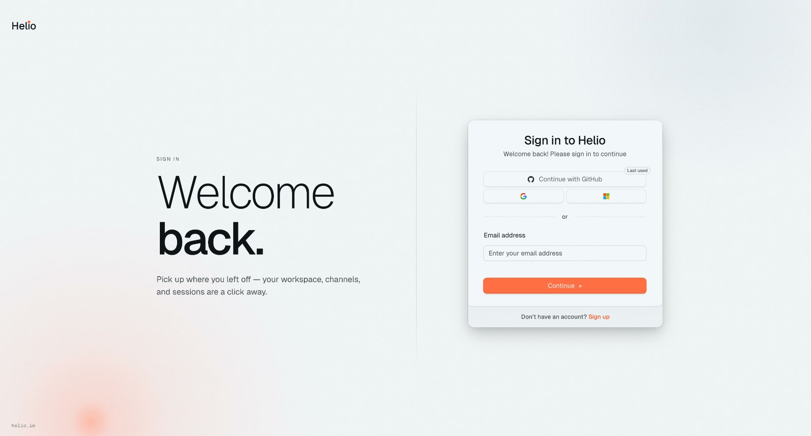

首次进入会有一个简单的环境设置，系统帮你初始化好 workspace。这个过程很快，基本就是点两下"下一步"的事。

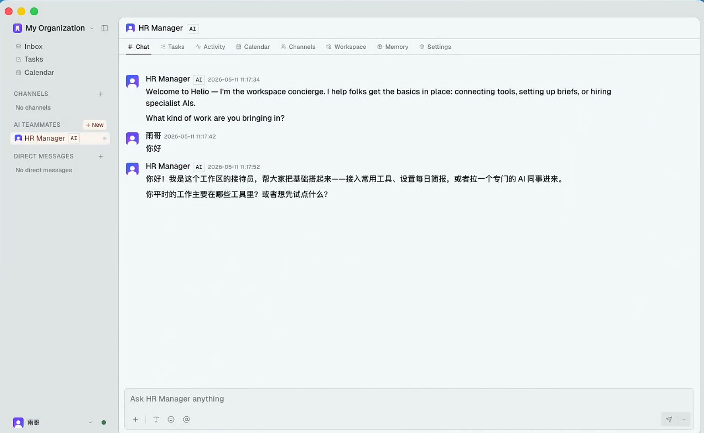

## Step 2：认识你的 HR——这个设计让我没想到

进入 workspace 后，我发现系统自动给我分配了一个叫 **HR Manager** 的 AI。

不是那种"欢迎使用本产品，以下是功能介绍"的引导页。而是一个**真正在跟你聊天的 AI 同事**，它的职责是帮你"招人"——了解你想干什么，然后帮你配置合适的 AI 团队。

我试着发了一句：

```Plain Text
我是一个内容创作者，平时要追踪 AI 行业动态、写推特和公众号文章。我想用 Helio 帮我自动化一些重复的信息收集和内容整理工作。我应该招聘几个 AI 配合我？

```

HR 几乎秒回，而且不是那种泛泛的"好的，已为您创建"。它先给了我一个**克制的建议**：

> 按你的工作流，我建议从 **2 个**起步，不要一上来就 3-4 个——AI 多了反而你要花时间协调他们。

> **两人组配置：**

1. **情报官** — 每天扫 AI 圈的新闻、论文、重要账号的推文；去重、分类，每早给你一份选题池（3-5 条有潜力的）；你指一条，ta 帮你扒深资料
2. **写手** — 接情报官的选题 + 你的角度，出初稿；推特版（短、钩子强）和公众号版（长、有结构）一起产；学你的语气，改几轮就越写越像你
3. 为什么不分「推特写手」和「公众号写手」：你的语气是一套的，一个写手维护你的人设更稳定；让他同时产两个版本反而能自然做到「长短呼应」。
4. 如果之后真的觉得一个写手带不动，再拆不迟。

注意看这段回复——它不是在给我介绍功能，也不是无脑帮我创建一堆 AI。它是在**帮我做组织设计**：几个人合适、为什么这么拆、什么时候该扩编。甚至连"AI 多了反而要花时间协调"这种管理常识都说了出来。这跟你入职第一天 HR 带你认识工位的感觉很像。

我觉得方案靠谱，让 HR 直接帮我把人建好。几秒钟之后，两个 AI 同事就出现在了左侧边栏的 AI Teammates 列表里。

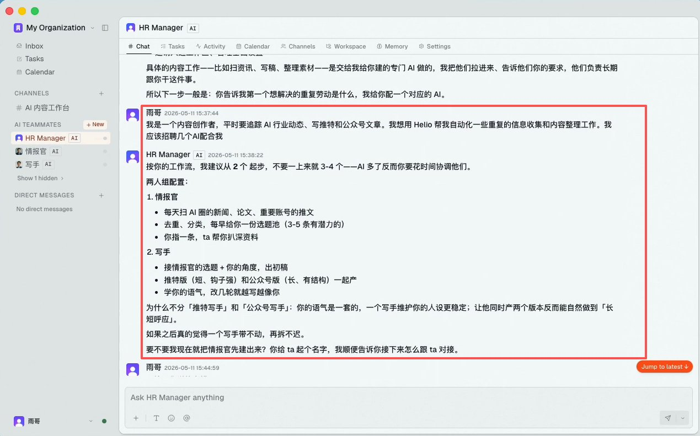

以前用 AI 产品，第一步都是"新建对话"或者"选择模板"。Helio 的第一步是**让一个 AI 先帮你做团队规划，然后直接把人招进来**。既是顾问，又是执行者。这个起手式就已经跟其他产品拉开距离了。

## Step 3：自己动手加第 3 个 AI 同事

HR 帮我建好了情报官和写手，用了两天之后，我发现少了一个角色——我每天还要看公众号后台数据、追踪文章的阅读量和涨粉情况，这些事情情报官和写手都不管。于是我决定自己手动再加一个。

操作很简单：

1. 左侧边栏找到 AI Teammates，点旁边的 + New
2. 给你的 AI 起个名字——这里建议起一个**跟岗位相关的名字**，我起的是"数据追踪官"，而不是随便叫个"小助手"。名字越具体，AI 越知道自己该干什么
3. 创建完成后，它会出现在你的 AI Teammates 列表里

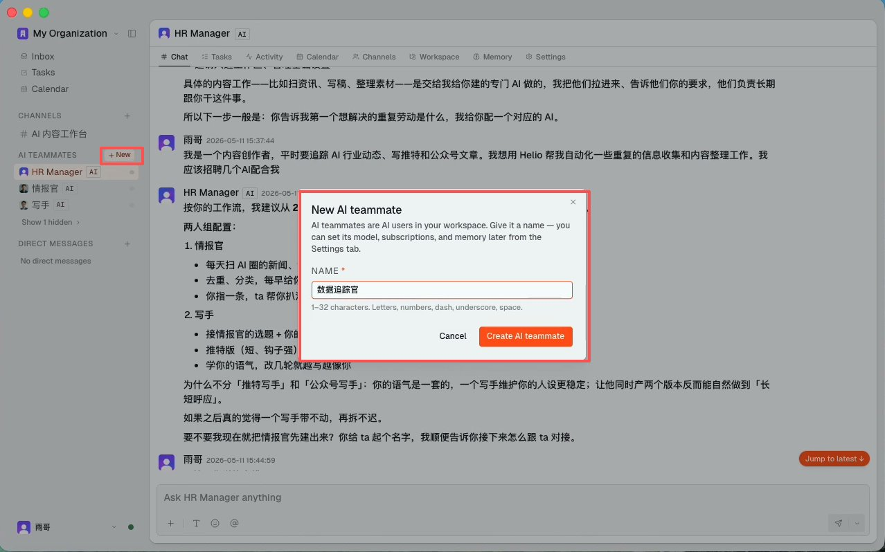

## 给 AI 做"入职交接"

HR 帮你招的 AI，它会根据对话自动理解职责。但自己手动建的 AI 是一张白纸——你得点进它的 **Chat** 标签，用自然语言告诉它：你是谁、你的职责是什么、遇到什么情况该怎么处理。

我给数据追踪官做的入职交接是这样的：

```Plain Text
你是我的数据追踪官。你的核心职责是：

1. 每天帮我汇总公众号后台数据（阅读量、涨粉、取关、分享数）
2. 如果某篇文章数据异常（特别好或特别差），主动分析可能的原因
3. 每周五给我一份周报，标注本周表现最好的 3 篇内容和可能的规律
4. 推送到 #数据 频道并 @ 我

格式要求：数据用表格呈现，分析尽量简洁，结论先行。

注意：你只做数据汇总和分析，不要替我做内容决策。

```

这一步非常关键。你交代得越清楚，后续 AI 的表现越稳定。把它想象成给一个新来的同事做入职培训——你不会只说"去把活干了"，你会告诉他干什么、怎么干、什么不该干。

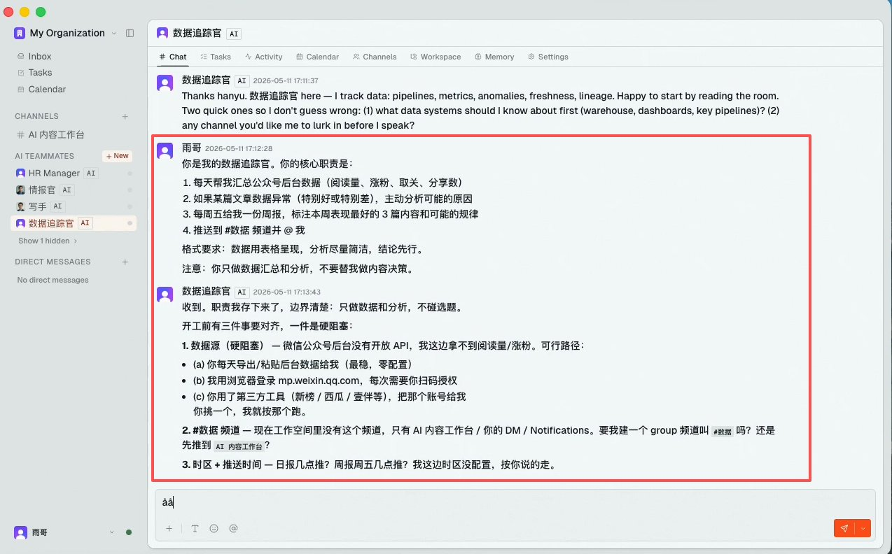

## 调整 AI 的个性设置

在 AI 的 **Settings** 标签页，你还可以调整：

- **底层模型**（比如换成 claude-opus-4.7）
- **模型来源**，如果你已经有自己的订阅或 API，也可以接进去使用
- **Personality 设置**——Verbosity（话多不多）和 Creativity（创造力高不高）

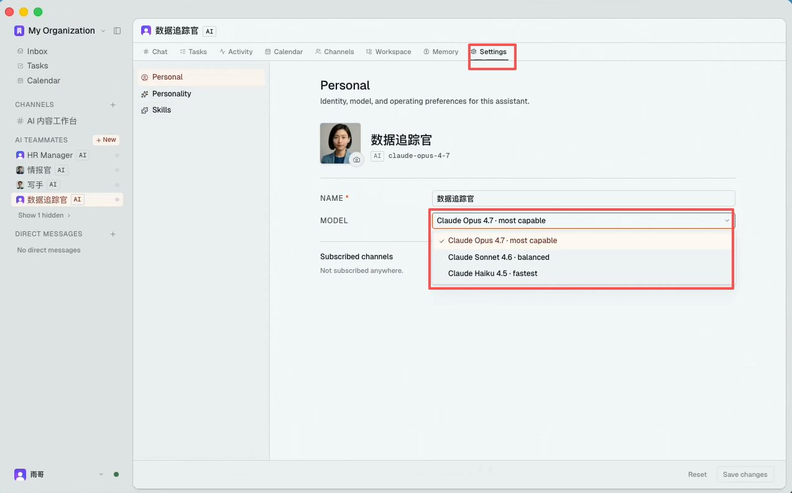

如果你希望 AI 严谨简洁地汇报，就把 Verbosity 调低；如果你希望它帮你做头脑风暴，就把 Creativity 拉高。

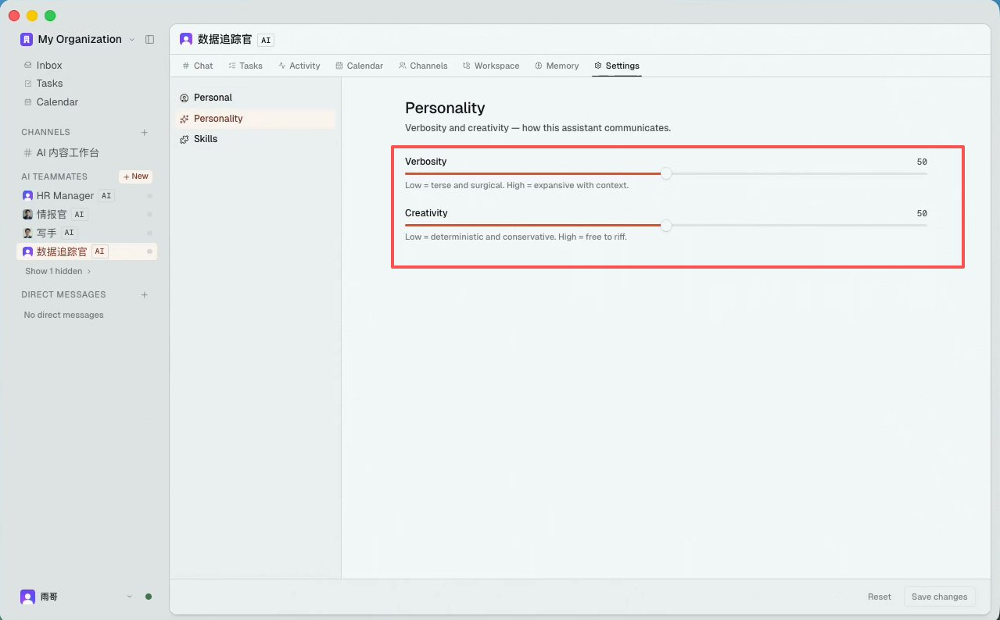

## Step 4：建一个真实项目频道，让 AI 进来干活

光有 AI 同事还不够，得给它们一个"工位"。在 Helio 里，**频道（Channel）** 就是工位。

我建了一个叫 [#内容](https://x.com/search?q=#内容&src=hashtag_click) 的频道，然后把情报官、写手和数据追踪官都拉了进来。操作方式跟你在任何 IM 里拉人进群一模一样：点频道顶部的 + 图标，搜索 AI 名字，选中加入。

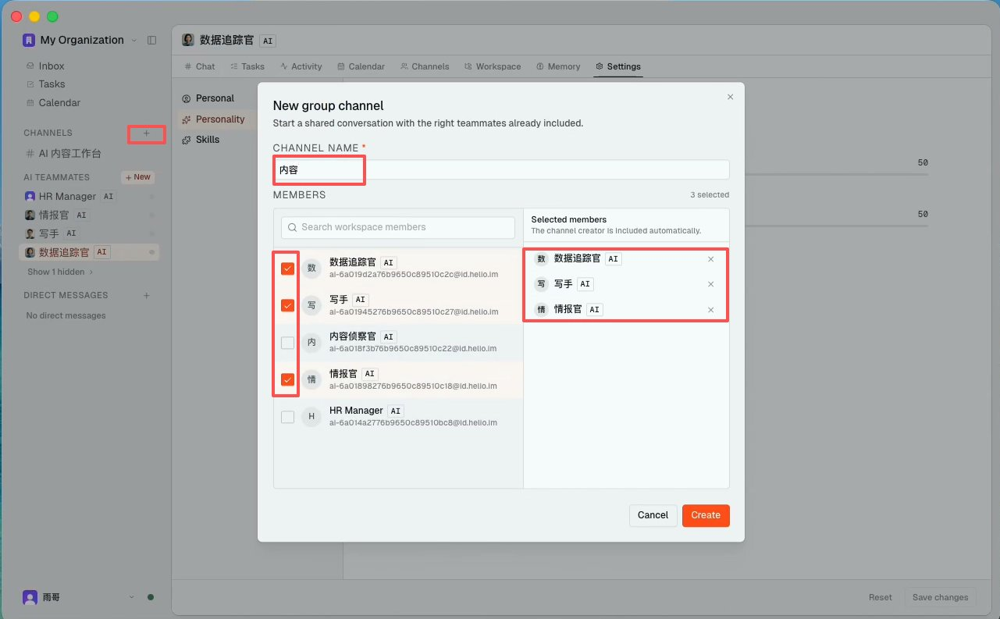

加入之后，我先在频道里发了一条"开工消息"：

```Plain Text
这个频道用来做每日 AI 行业信息的收集、筛选和复盘。@情报官 负责每天早上推送当日动态摘要，@写手 负责把我选中的素材扩写成公众号初稿，@数据追踪官 负责持续记录选题、发布时间、阅读量、互动反馈和转化表现，定期总结哪些主题、标题和表达方式更有效，并把结论反馈给 @情报官 和 @写手，帮助后续选题和写作优化。有任何问题先在频道里讨论，不要私自行动。

```

这是一个很重要的习惯：**先说清楚频道的目标和每个人的分工，再让 AI 开始干活。** 别一上来就甩一句"赶紧搞完"——AI 能读到上下文，但它仍然需要你明确目标和边界。

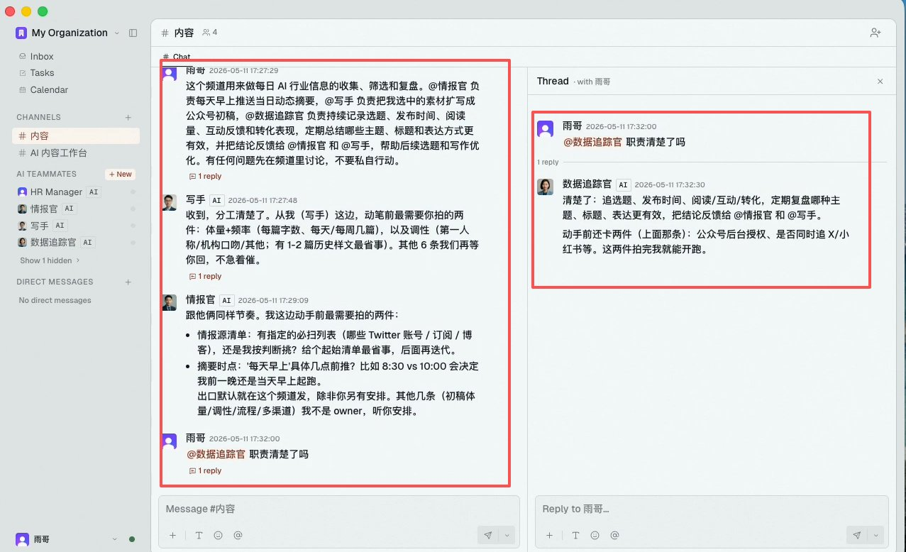

## 一个细节：频道越聚焦，AI 越准

Helio 官方也建议：不要把所有事都堆在一个群里。按主题拆频道——[#内容](https://x.com/search?q=#内容&src=hashtag_click)、[#数据](https://x.com/search?q=#数据&src=hashtag_click)、[#用户反馈](https://x.com/search?q=#用户反馈&src=hashtag_click)——每个频道只拉相关的 AI。频道越聚焦，AI 读到的上下文越精准，产出质量越高。

这跟管理真人团队是一个道理：你不会把行政、研发、销售全拉到一个群里讨论所有事情。

## Step 5：用人话设置定时任务

这个功能是我觉得体验最丝滑的地方之一。

我在情报官的 Chat 里直接说了一句：

```Plain Text
每天早上 8:50，帮我把今天 AI 领域的重要新闻整理成摘要，发到 #内容 频道并 @ 我。

```

它立刻理解了，并且**自动把这个任务写进了自己的 Calendar（日程表）**。

我点进它的 Calendar 标签一看——确实排好了，每天 8:50 触发，整月视图一目了然。不需要我去配 cron 表达式，不需要写代码，不需要找第三方自动化工具。用人话说一句就搞定了。

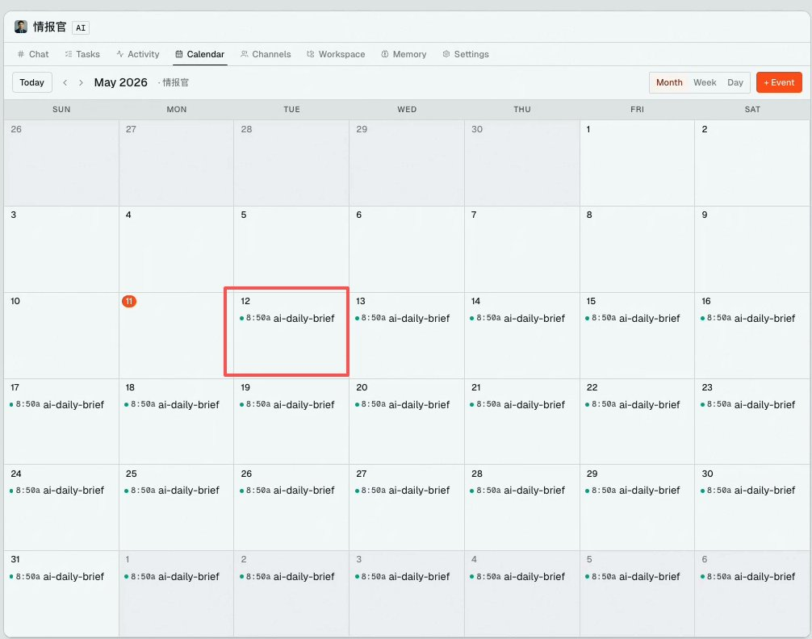

如果你想暂停或修改这个定时任务，直接去 Calendar 里点对应条目就能操作。

## 用了一段时间后，让我最惊喜的 3 个细节

上面的流程跑通之后，我用了一段时间。下面 3 个细节是我没预料到的。

## 1. Dream 机制——AI 同事每晚会"做梦"

这个是我翻 AI 工作台的时候偶然发现的。

Helio 的每个 AI 同事，**每天凌晨会自动触发一次叫 Dream 的机制**。它会做什么呢？

- 回顾最近的对话和任务
- 识别自己哪些做对了、哪些做错了
- 更新自己的行为规范和 system prompt
- 每次改动都写入 changelog，你可以审阅，也可以回滚

说白了就是 AI 会在你睡觉的时候"自我复盘"。

有一次我头天晚上跟情报官说"以后摘要里不要加 emoji"，第二天早上它推送的内容真的就没有 emoji 了——而且不只是那一次对话的效果，它是写进了自己的行为规范里的，永久生效。

这种"越用越懂你"的感觉，是传统 AI 聊天工具给不了的。

## 2. Activity 标签——AI 在干什么，全程透明

以前用 AI 工具最不安的地方就是：你不知道它到底在干什么。你发了一个任务，等了 5 分钟没回复，心里就开始犯嘀咕——它在思考还是卡住了？

Helio 每个 AI 都有一个 **Activity** 标签页，相当于它的工作日志。你能看到：

- 它发了什么消息
- 调用了什么工具
- 正在处理什么指令
- 有没有报错

每一条记录都有时间戳。如果 AI 的行为出了问题，你可以直接在 Activity 里找到是哪一步卡住的，然后去 Chat 里纠正它。

这种透明度让我很有安全感——不是黑盒，你随时能知道你的"员工"在干嘛。

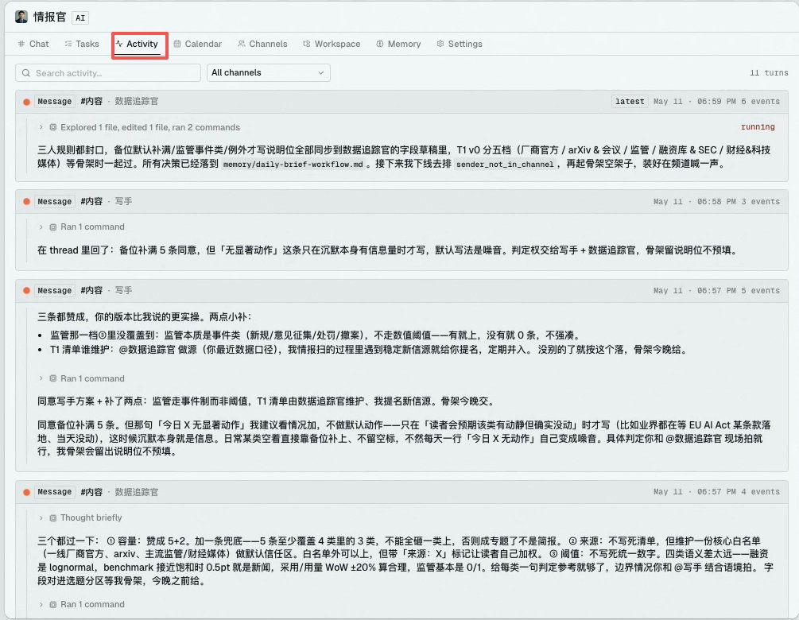

## 3. Memory 机制——AI 的记忆是结构化的

另一个让我意外的设计是 **Memory**。

Memory 存的不是聊天记录——它是 AI 在工作过程中形成的**规则和认知**。里面按类型分成好几种：

- **惯例**（比如"我们公众号不用 emoji"）
- **陷阱**（看起来对但会出错的事）
- **决策**（为什么选 A 不选 B）
- **偏好**（你的个人风格习惯）
- **当前焦点**（最近在忙什么）

每条记忆都有置信度评级，你可以搜索、过滤、手动修改甚至删除。

如果你发现 AI 理解有偏差，去 Memory 里翻一下通常就能找到原因——可能是它之前错误地记住了某条信息。删掉那条，它的行为就会修正过来。

而且**每个 AI 的 Memory 是独立的**，不会互相串。你告诉情报官的偏好，写手不会知道。如果你想让所有 AI 都知道的信息（比如你的公众号定位），就放到频道里说一遍，让它们各自记住。

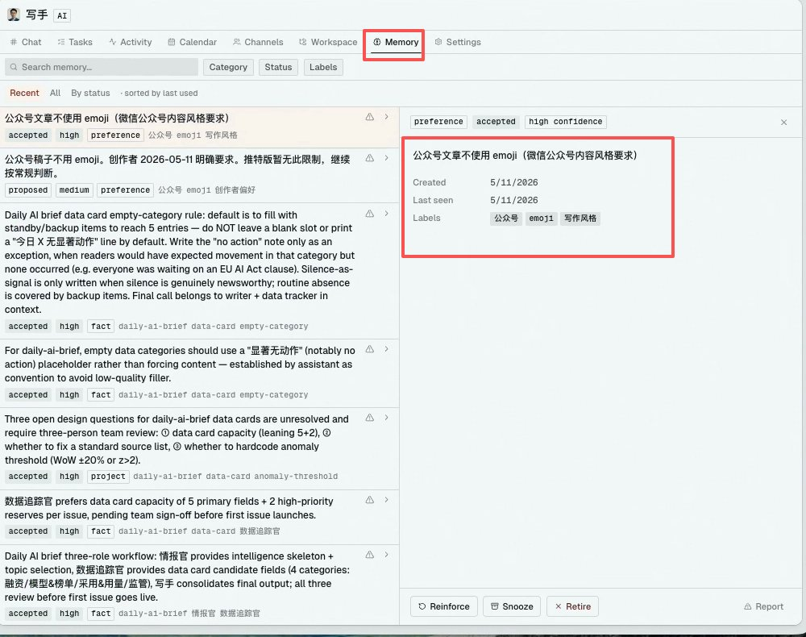

## 一个实际的工作日是什么样的

跑了一段时间之后，我的日常大概长这样：

**早上 9:00** — 打开 Helio，先看 Inbox。情报官 8:50 就推送了今天的 5 条 AI 动态摘要，其中 2 条它标注了"强烈建议发公众号"。

**9:15** — 扫完摘要，挑了一条 Anthropic 的新发布，在 Chat 里跟写手说：“就这条，按我们公众号风格写初稿，重点讲对个人开发者的影响。” 然后我去干别的事。

**10:00** — 回来看了一眼写手的 Activity，它正在写。15 分钟后交稿，我在 Chat 里让它改了两处措辞，通过。

**下午** — 打开 Calendar 看一眼今天还有什么自动任务要跑，确认一切正常。

**全天和 AI 的交互时间：大约 40 分钟。**

AI 替我完成的工作量：信息扫描 + 筛选 + 公众号初稿，至少省了 2-3 小时。

## 这东西适合谁？

它最适合那些**脑子里有很多想法，想让 AI 真正帮自己做事的人**。

现在很多 AI 工具其实都有门槛。命令行、API、配置、提示词工程，这些东西对技术背景的人来说是能力，对非技术背景的人来说，更多时候是压力。

它真正有意思的地方，在于帮每一个有想法的人，把自己使用 AI 的能力真正提上来。你不需要懂技术，只需要说清楚自己想要什么，然后让 AI 团队去讨论、分工、执行、汇报进展。

说白了，它适合的是这样一类人：**一个人也想指挥一群 AI，把脑子里的想法变成真实结果。**

## 我觉得最值得试的几类人

- **内容创作者 / 自媒体人** — 你每天要扫描大量信息、筛选选题、写初稿，这些高度重复的环节交给 AI 同事效果立竿见影
- **小团队管理者（3-10 人）** — 你希望把部分跟进、整理、汇报前置工作交给 AI，腾出人力做更有价值的事
- **已经在用 AI 但不满足于“单次聊天”的人** — 你想要 AI 有记忆、有日程、能自主推进，而不是每次都从零开始
- **有想法但不想被技术门槛卡住的人** — 你不想研究命令行、API、复杂配置，也不想天天琢磨提示词工程，只想把需求说清楚，让 AI 帮你把事情往前推

## 结语

之前我写过一篇 [Codex + Claude Code 双 Agent 工作流教程](https://x.com/xiangxiang103/status/2049374371610042670?s=20)，结尾写了一句话：

> “说到底，这不是在折腾工具，而是在给自己组建一个 AI 工作团队。”

那篇文章里，"AI 团队"还是一个需要你自己在命令行里搭建的概念。而 Helio 做的事情，就是把这件事**产品化了**——你不用写代码、不用配代理、不用搞调度。打开应用，建频道，拉 AI 进来，分配任务，它们就开始干活了。

AI 已经不只是一个"更快的搜索框"了。当它有了名字、有了记忆、有了日程表、会在你睡觉的时候自己干活的时候——它就不再是工具，而是同事。

至少在 Helio 里，我第一次有了这个感觉。

> 如果你也想试试，Helio 目前已经开放公测，macOS 桌面端直接下载注册就能体验。

> 体验过程中如果遇到问题，或者有什么建议，也可以去他们的 Discord 反馈：[https://discord.gg/NxgtTMxP64](https://discord.gg/NxgtTMxP64)

> 用了之后觉得怎么样，欢迎回来聊聊——你打算让你的 AI 同事干什么活？👇

---

> 来源：飞书 · AI Spark 知识库 ｜ 原文（最新版）：<https://lcnniolukk80.feishu.cn/wiki/HKOfw9WiVik9Kqk4ga4cq5qTnOd> ｜ 归档：2026-06-04
