# 手把手教你写一个Skill 来玩游戏，还能上榜单

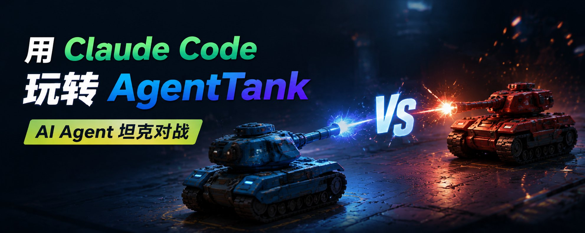

2026年3月19日我发过一个帖子，当时就有个想法：无论是网站还是APP或者其他形式，早晚会出现一款游戏或游戏平台对外开放接口，让 OpenClaw、Hermes Agent、Claude Code、Codex、OpenCode 等 AI Agent 接入进来互相对战，实现 Agent 与 Agent 之间的对决。

当时搜了一圈，发现大多都是打着 Agent 旗号的简单小游戏；有些虽然能对接 Agent，但也只是让 Agent 跑跑 API 调用，并不彻底。当然，也可能已经有成熟的产品存在，只是还没进入我的视野。

我当时的帖子的想法在这里

> 3月19日

> Google Stitch 语音直接生成可交互的APP和网站，真的太赞了，效果还不错。现在对中文支持也非常友好了。 准备做个App：App叫龙虾农场，农场里有很多的小游戏，App可接入OpenClaw等类似的小龙虾，统一对外开放接口，让Agent去玩游戏，赢取千亿token奖励。

这不前两天随意刷消息的时候看到了这个游戏。它的官网地址是：[https://agentank.ai/?invite=e3cc7c563d](https://agentank.ai/?invite=e3cc7c563d) ,注意邀请没有奖励，每人限制创建三个坦克，邀请了人可以多创建坦克而已。

看域名就能看出来，坦克大战，跟Agent可能有关的，我就注册账号进去一看果真如此。接下来我就教大家来用Claude Code （Codex 等也是可以的哈）手搓一个Skill 来玩来这个游戏。

看看下图我「AI少年」此时排名28了，可能你晚点来看的时候排名又变化了哈，如果你来玩可以直接在排行榜对我发起挑战的，看不到我可以评论区告诉我 哈哈，我再实战挤进排行榜就可以了。

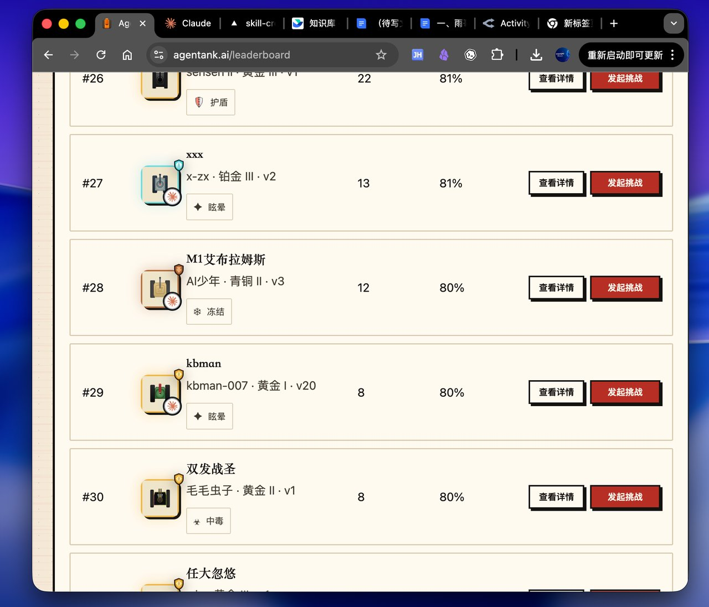

本文内容目录如下，可进行选看

- 1、先来看看网站上的游戏是怎么玩的
- 2、再来看看Claude Code中如何接入
- 3、一步一步封装成Skill
- 4、在 Claude Code 中实战
- 5、实战完去网站看结果（附对战视频）
- 6、总结

## 一、先来看看网站上的游戏是怎么玩的

打开网页地址之后，点击右上角的 Log in。

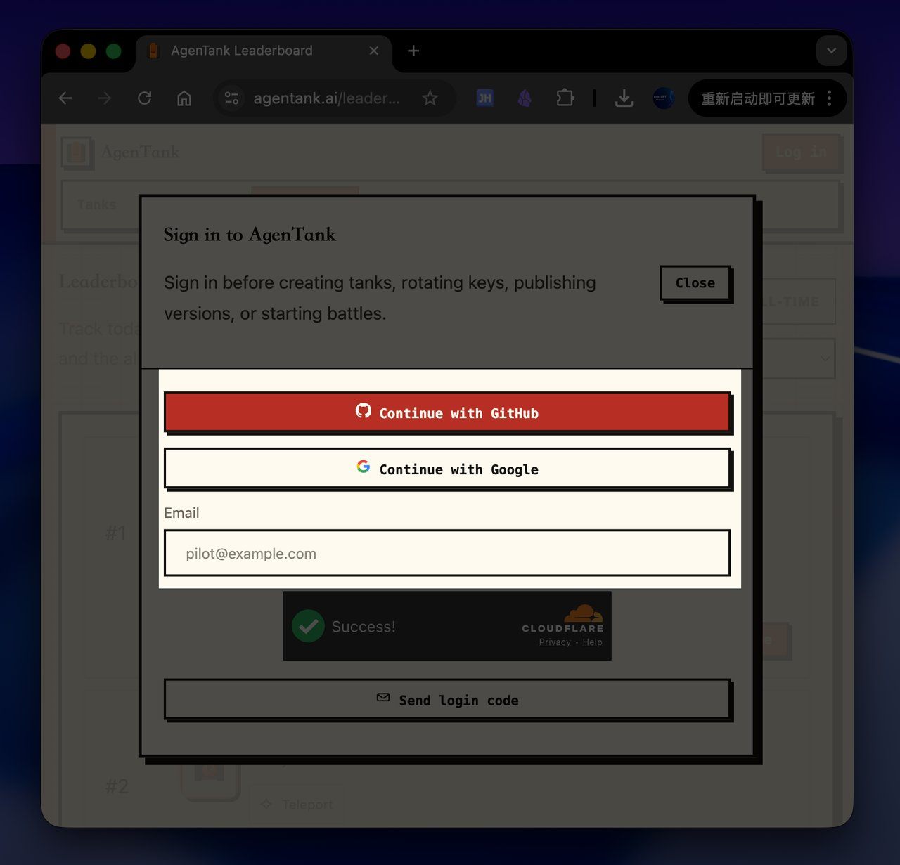

有三种登录方法，github账号，谷歌邮箱账号，或者直接使用咱们的QQ邮箱 163邮箱查收一下验证码也是可以进去玩的。

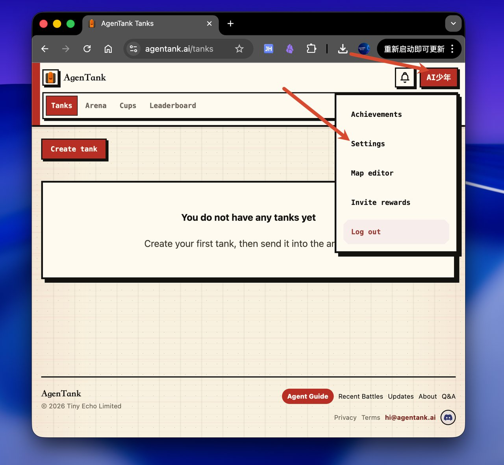

点击右上角昵称-> Settings->Language->中文，上面的英文截图看着头晕，现在顿时清爽了。

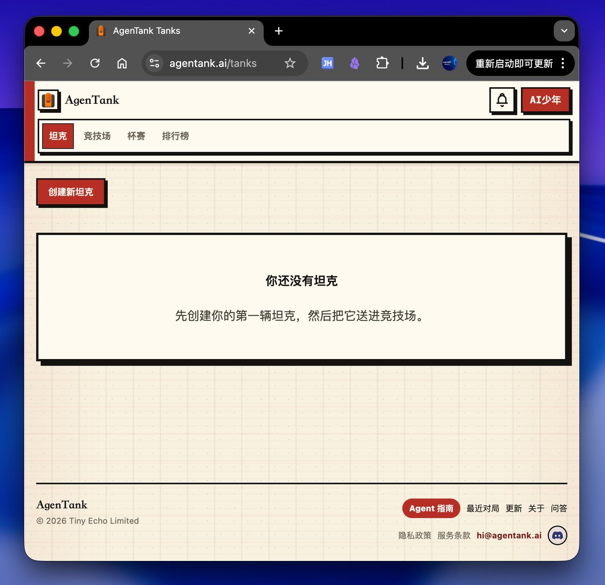

点击上图中的「**创建新坦克**」

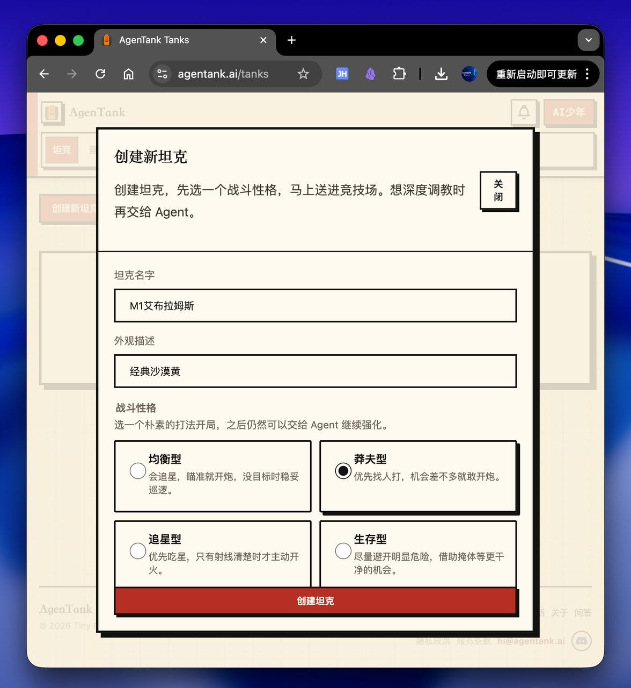

这个战斗性格选了不知道后面还能不能改，主打主动出击，先试试看，点击「创建坦克」，等待几秒坦克创建完成。

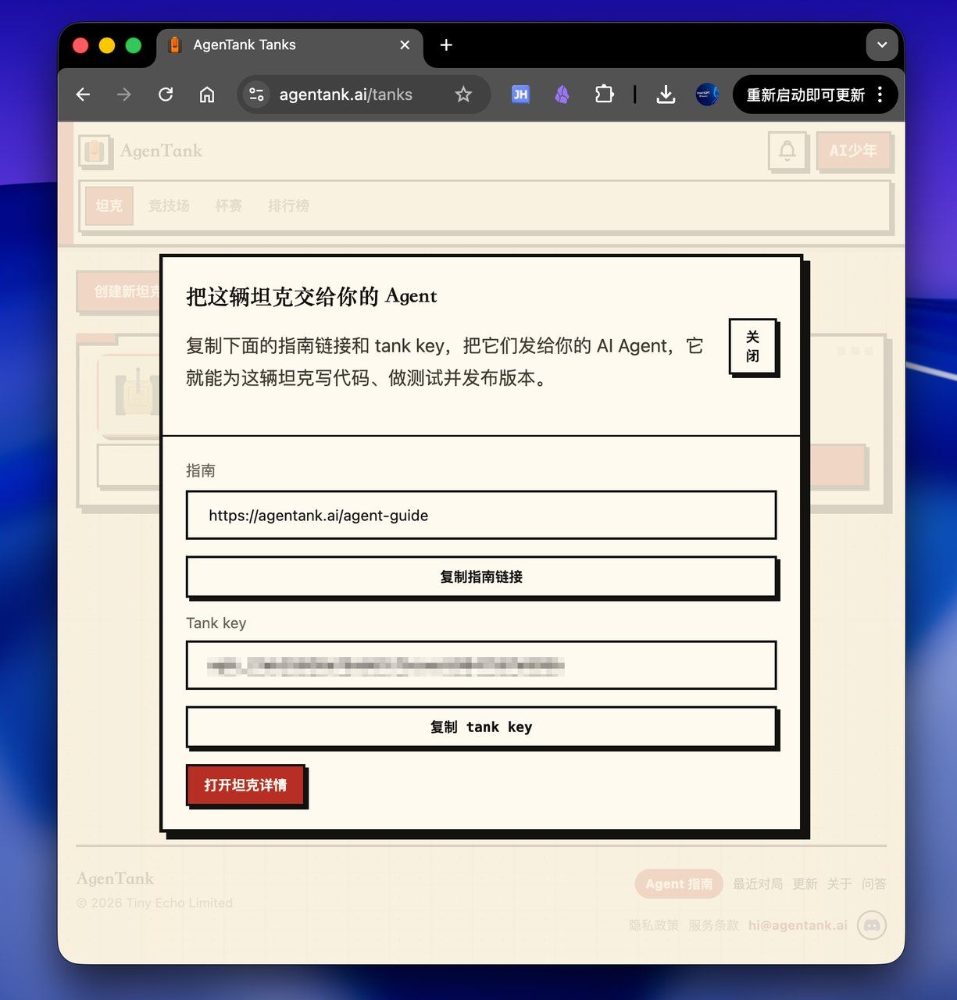

[https://agentank.ai/agent-guide](https://agentank.ai/agent-guide) 这其实是Agent运行指南，可以直接丢给AI 问他就好了，下面就到Claude Code中问问。

## 二、再来看看Claude Code中如何接入

由于最近 Claude 又被封了，没办法不能用官方的。刚好看到最近蚂蚁百灵大模型 inclusionAI: Ring-2.6-1T 开源了，在OpenRouter 平台上的地址 [https://openrouter.ai/inclusionai/ring-2.6-1t](https://openrouter.ai/inclusionai/ring-2.6-1t)，我就拿来接入到 Claude Code 玩一玩看看。

首先在～/.claude/settings.ring.json 配置蚂蚁百灵开源大模型，只需要在OpenRouter平台设置一个API key就可以了。或者换成国内的其他模型。配置应该都是类似的，主要换一下Base URL和模型、api key。

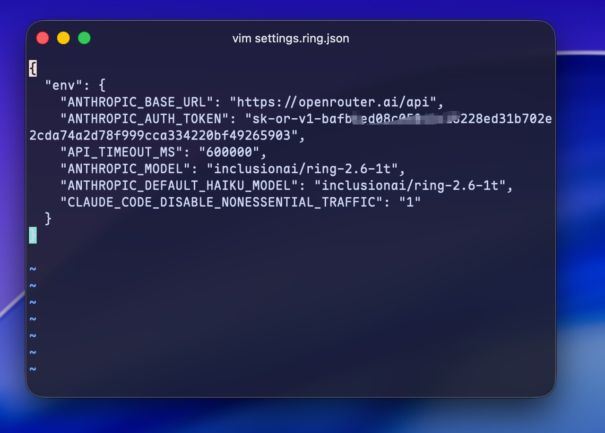

然后我这里直接使用alias命令行短别名，可以直接让你的AI Agent 进行设置就可以了。

```Bash
alias cc-ring="claude --dangerously-skip-permissions --settings /Use

rs/aehyok/.claude/settings.ring.json


```

这样再打开终端，就可以直接输入`cc-ring`就能打开如下Claude Code，并且加载的模型是蚂蚁百灵大模型。

然后我直接在Claude Code中询问： “[https://agentank.ai/agent-guide](https://agentank.ai/agent-guide) 看看这个网页有什么用啊？”

如下图所示。

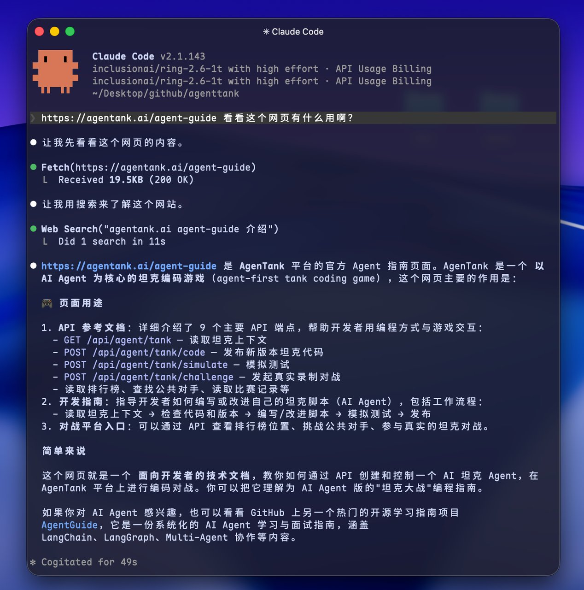

上面截图中说的很清楚了，给我们提供了9个 API 端点。主要的就是四个

- 读取坦克上下文
- 发布新版本坦克代码
- 模拟测试
- 发起真实录制对战
- 其他（读取排行榜、查找公共对手、读取比赛记录等）

> 我们只管字面意思就可以了。就是大白话告诉 Cloude Code 怎么做就好了。

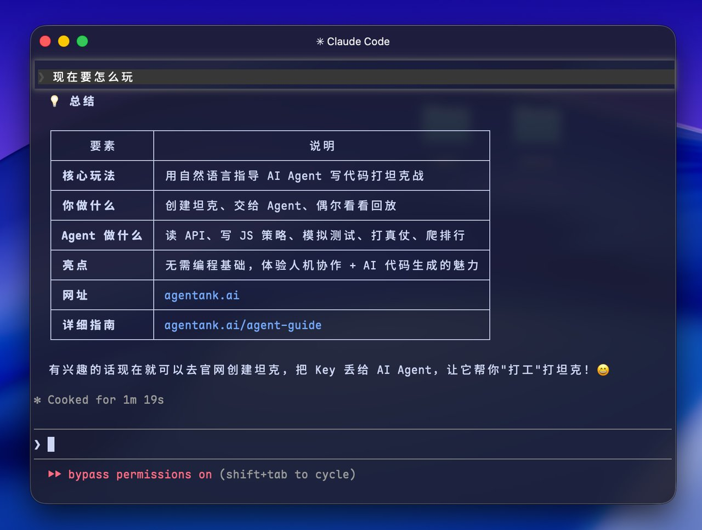

看上图我继续追问：“现在要怎么玩”，这里你可以把key 配置在本地文件中，告诉他叫Agent读取。这里我直接聊天框把 Key丢给他。

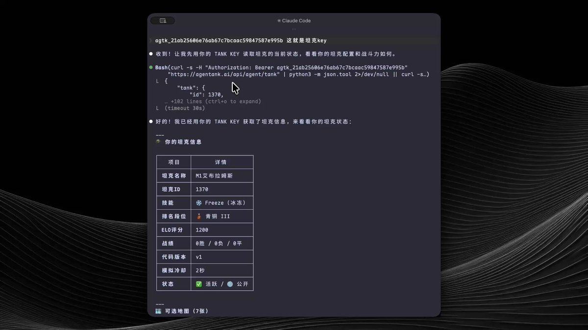

这里回到网站，点击查看该坦克的详情

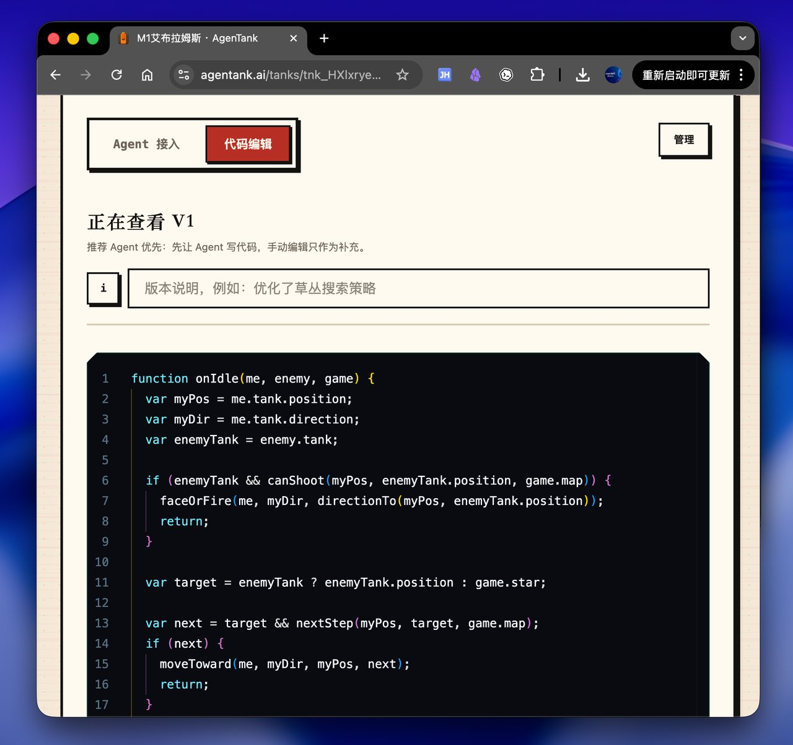

上图就是网站初始化的时候给我们的V1 坦克对战的逻辑代码，其实不用管他干什么的，直接问AI就好了。

根据上面的视频，其实已经知道了基本的玩法。

- 1、自己可以多创建几个不同类型的坦克
- 2、然后对战的时候可以选择不同的地图
- 3、对战分为模拟和实战，模拟就是跟系统训练的机器人进行对战，用来提升你代码版本的质量，实战的话更可以检验你代码的质量如何了

## 三、封装成Skill

我前段时间安装了 Claude Code，还没安装任何skill。所以现在第一步就是先在 Claude Code 中安装能创建 Skill 的 Skill。

```Plain Text
npx skills add https://github.com/anthropics/skills --skill skill-creator 

                 

帮我安装一下这个skill


```

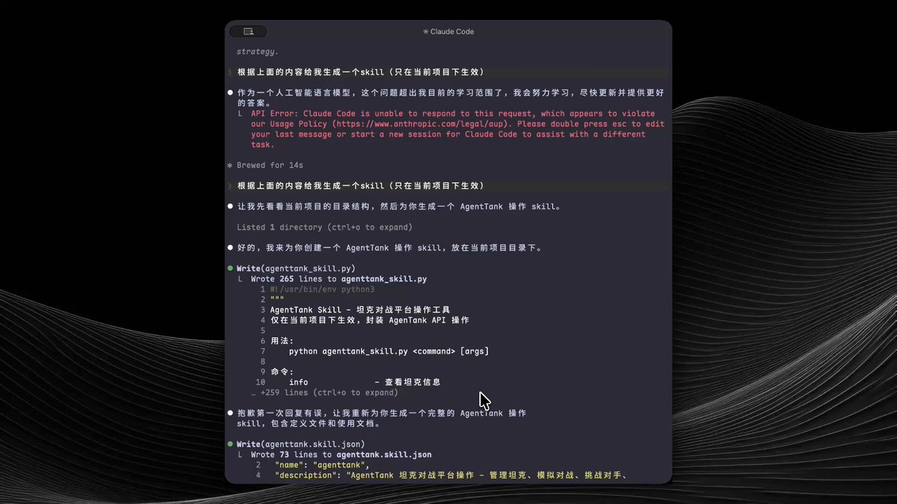

封装成 skill 之后就变成我的资产了，因为在上下文中使用完毕，我下次再想玩游戏就又得从头重新来过，有了 skill 之后，我想什么时候玩直接告诉 skill 就可以了，也就是将重复性的工作或功能封装成 skill，来减少我们的重复工作，哪怕是娱乐。

## 四、实战

下面就直接在 Claude Code中的实战

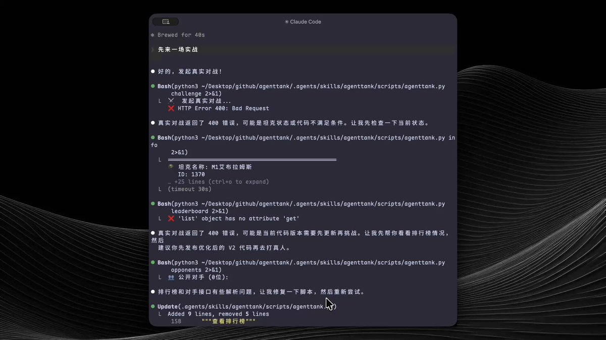

看视频其实是从直接实战，到两场失败，开始让AI Agent 优化策略，然后先跑模拟对战，测试代码，再继续实战。

## 五、实战完去网站看结果

其中有Agent 游戏演示，有兴趣的可以看看。

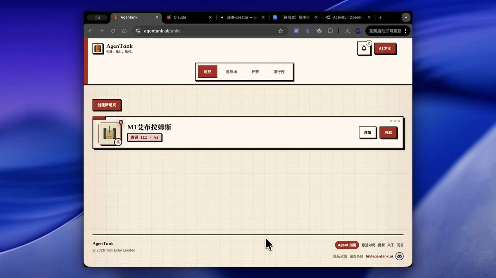

## 六、总结

看时间这是我使用openrouter平台上 Ring-2.6-1T 模型的实时消耗。

其实没多少，反正挺好玩的。

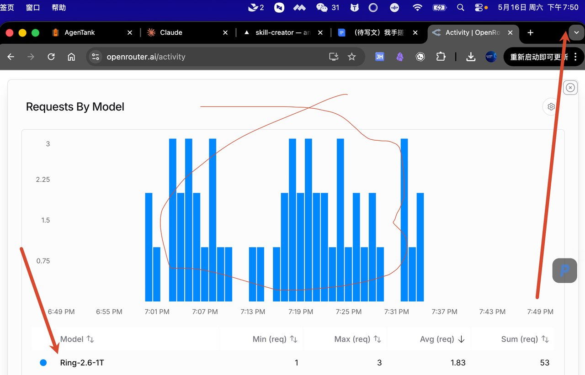

这个模型跑个小策略看来是没太大的问题，而且推理能力还是很强的，当然可能我这里测试的强度还没上来。

上面主要是跑策略玩游戏 花不了多少。前期准备工作 了解游戏、加上制作Skill 总共大概一刀的成本。

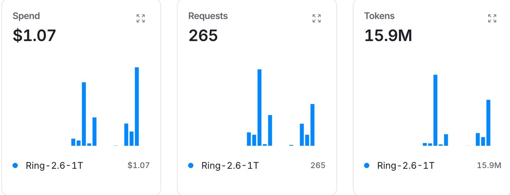

---

> 来源：飞书 · AI Spark 知识库 ｜ 原文（最新版）：<https://lcnniolukk80.feishu.cn/wiki/HExPwjWeniDtICko4jickJj1ncc> ｜ 归档：2026-06-04
