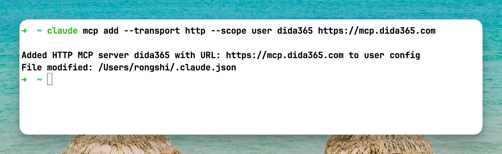
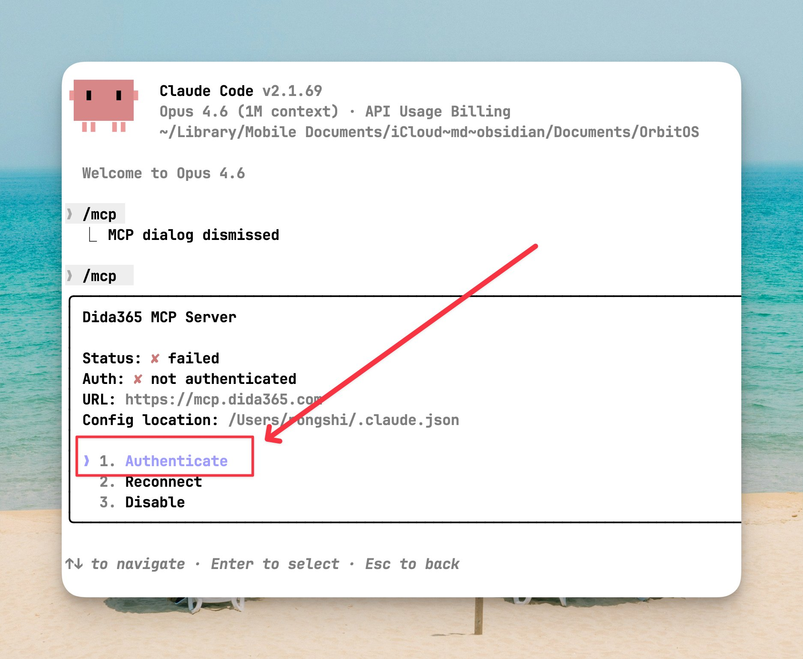
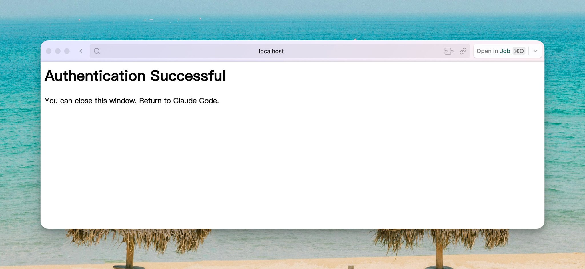
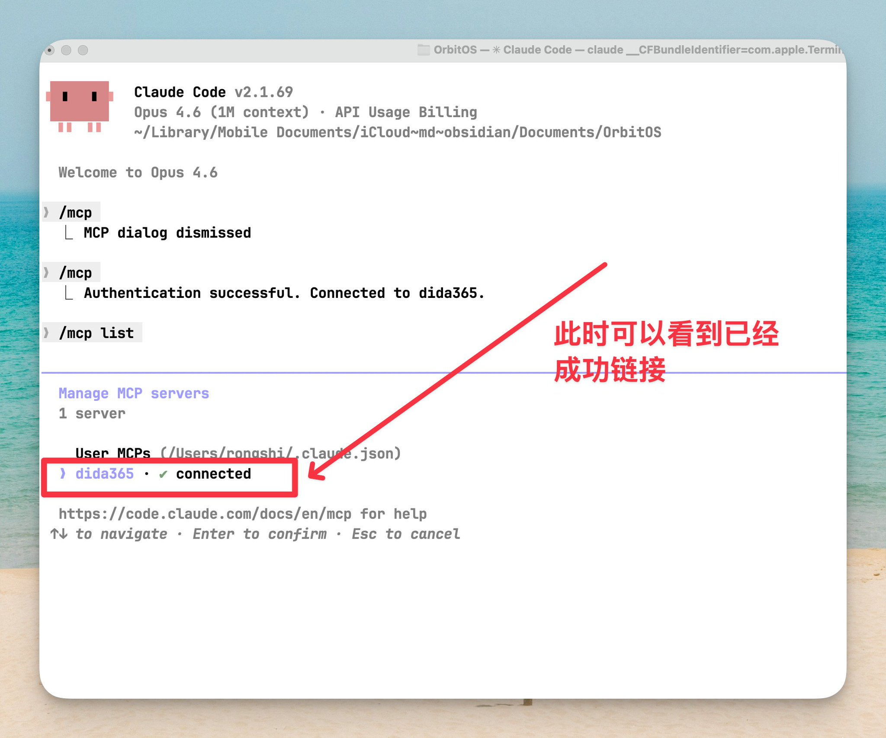
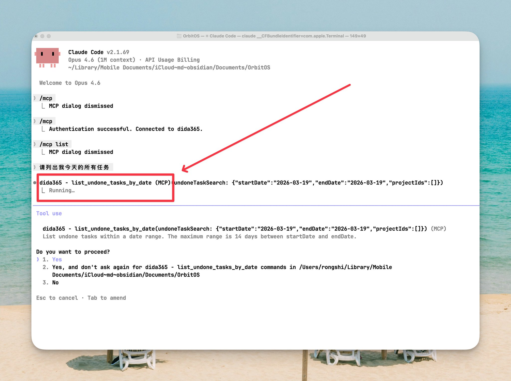
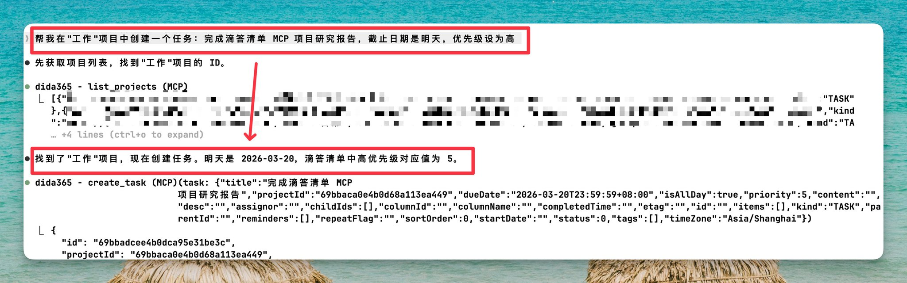
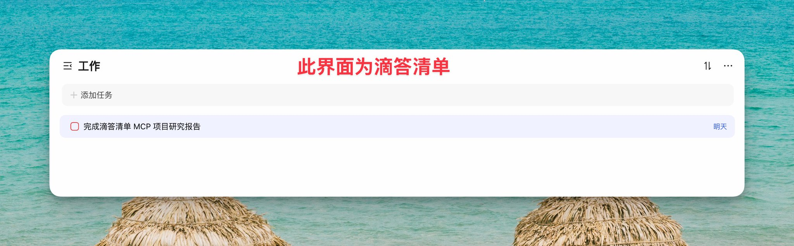
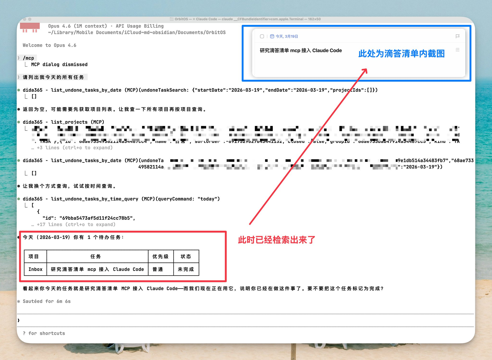
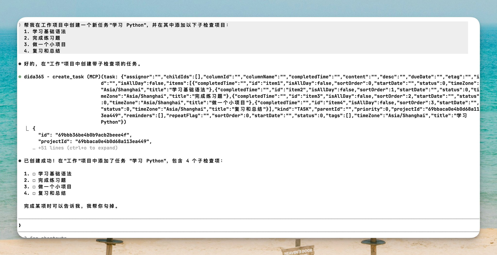
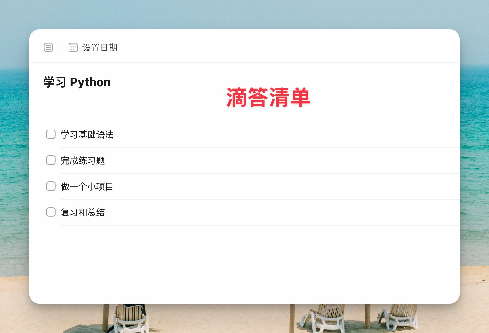

# 滴答清单 MCP 功能完全指南：在 Claude Code 中实现 AI 智能任务管理


跟 Claude 说了句「把这个开发计划拆成任务同步到滴答清单」，它直接拆好、建好了。

查待办、批量建任务、按日期筛选——全程不用切出终端。

滴答清单官方已经出了 MCP 服务，配置只需要一行命令。跟着走就行。

总共 3 步，5 分钟搞定：

① 一行命令添加服务器 — 1 分钟 ② 浏览器授权登录 — 1 分钟 ③ 验证 + 开始用 — 3 分钟

## 一、前置准备

使用滴答清单官方 MCP 服务非常简单，你只需要准备两样东西：

**1. 安装 Claude Code**

**2. 准备滴答清单账号**

确保你已拥有滴答清单账号

**就这么简单！** 使用官方 MCP 服务，你不需要安装 Node.js、Python 等其他依赖，也不需要申请开发者账号和 API 密钥。一切都由滴答清单官方服务器托管和处理。

## 二、连接滴答清单 MCP 到 Claude Code

使用官方 MCP 服务，整个配置过程只需要两个步骤，非常简单！

**步骤 1：添加 MCP 服务器**

打开终端（macOS/Linux）或命令提示符/PowerShell（Windows），运行以下命令：

```Bash
claude mcp add --transport http --scope user dida365 https://mcp.dida365.com

```

这个命令会将滴答清单官方 MCP 服务器添加到 Claude Code 的全局配置中。

**命令解释：**

- claude mcp add：添加 MCP 服务器
- --transport http：使用 HTTP 传输协议（滴答清单官方支持 Streamable HTTP）
- --scope user：添加到全局配置，在所有项目中都可使用（推荐）
- dida365：给这个服务器起的名字（你可以自定义）
- [https://mcp.dida365.com](https://mcp.dida365.com/)：滴答清单官方 MCP 服务器地址

**执行成功后，你会看到类似这样的提示：**

```Bash
Added HTTP MCP server dida365 with URL: https://mcp.dida365.com to user config
File modified: /Users/你的用户名/.claude.json

```

这表示 MCP 服务器已成功添加到配置文件中。✅



**💡** **关于** --scope **参数说明：**

- --scope user（推荐）：全局配置，在所有工作目录中都可使用
- --scope local：仅当前工作目录可用
- 如果不指定，默认为 local

**步骤 2：完成 OAuth 授权**

现在启动 Claude Code 会话：

```Bash
claude

```

在 Claude Code 交互界面中，运行 MCP 命令：

```Bash
/mcp

```

Claude Code 会检测到未授权的 MCP 服务器，并提示你完成授权流程：

1. **浏览器自动打开**：系统会自动打开浏览器，跳转到滴答清单授权页面
2. **登录账号**：使用你的滴答清单账号登录（如果尚未登录）
3. **确认授权**：查看授权信息，点击"授权"或"同意"按钮
4. **完成授权**：授权成功后，浏览器会显示成功提示，你可以关闭浏览器窗口





返回终端，Claude Code 会显示授权成功的消息。

**就这样！** 你已经成功连接了滴答清单 MCP。整个过程不超过 2 分钟。

## 三、验证连接

让我们验证一下配置是否成功。

检查 MCP 服务器列表

在 Claude Code 会话中运行：

```Bash
/mcp list

```

你应该能看到 dida365 出现在列表中，状态显示为已连接。



**测试 MCP 功能**

在 Claude Code 会话中（如果已退出，运行 claude 重新进入），尝试以下指令：

```Plain Text
请列出我今天的所有任务

```

如果配置成功，Claude 会调用滴答清单 MCP 工具，并返回你今天的任务列表。你会在输出中看到 🔨（工具）图标，表示 Claude 正在使用 MCP 工具。



## 四、实际使用示例

现在你可以开始使用 AI 管理滴答清单了！以下是一些实用的示例。

> **注意**：以下示例中使用的清单名称（如"工作"）需要在你的滴答清单账号中已经存在。目前 MCP 不支持创建新清单，只能在已有清单中创建任务。如果你不确定自己有哪些清单，可以先让 Claude 执行"列出我所有的清单"来查看。

**示例 1：创建新任务**

**你的指令：**

```Plain Text
帮我在"工作"项目中创建一个任务：完成项目报告，截止日期是明天，优先级设为高

```

**Claude 的操作：**

- Claude 会先查找名为"工作"的清单，确认其存在
- 自动识别任务标题、截止日期和优先级
- 调用 create_task 工具在该清单中创建任务
- 返回创建成功的确认信息





**示例 2：查看今日待办**

**你的指令：**

```Plain Text
显示我今天需要完成的所有任务

```

**Claude 的操作：**

- 查询今天到期的所有任务
- 列出任务详情（标题、清单、优先级等）
- 按优先级或清单分组显示



**示例 3：创建带子任务的任务**

**你的指令：**

```Plain Text
帮我在工作项目中创建一个新任务"学习 Python"，并在其中添加以下子检查项目：
1. 学习基础语法
2. 完成练习题
3. 做一个小项目
4. 复习和总结

```

**Claude 的操作：**

- 先在"工作"清单中创建主任务"学习 Python"
- 然后为该任务添加 4 个子任务（checklist 项）
- 返回完整的任务结构信息





## 五、可用的 MCP 工具列表

当你在 AI 对话中提出任务相关的需求时，AI 会自动调用滴答清单 MCP 提供的工具来完成操作。这些工具就像一组"能力"，让 AI 可以查询任务、创建任务或更新任务状态。

通常你不需要记住这些工具名称。只需用自然语言描述你的需求，AI 会自动选择合适的工具来执行。

以下是滴答清单 MCP 提供的全部 17 个工具：

**查询任务（6 个）**

- search_task — 关键词搜索任务
- get_task_by_id — 根据 ID 获取任务完整内容
- list_undone_tasks_by_time_query — 查询一段时间的未完成任务（支持：today, last24hour, last7day, tomorrow, next24hour）
- list_undone_tasks_by_date — 查询指定日期范围的未完成任务（跨度最大 14天）
- list_completed_tasks_by_date — 查询已完成任务
- filter_tasks — 多条件组合查询（按日期、清单、优先级、标签、状态等）

**清单查询（4 个）**

- list_projects — 获取所有清单
- get_project_by_id — 获取清单详细信息
- get_project_with_undone_tasks — 获取清单详情 + 未完成任务
- get_task_in_project — 获取清单中的特定任务

⚠️ 清单只能查，不能通过 MCP 创建、修改或删除。

**任务管理（7 个）**

- create_task — 创建任务（支持标题、描述、日期、优先级、清单、标签）
- batch_add_tasks — 批量创建任务
- complete_task — 完成指定任务
- complete_tasks_in_project — 批量完成任务（每次最多 20 个）
- update_task — 修改任务属性
- move_task — 移动任务到其他清单
- batch_update_tasks — 批量修改任务

💡 番茄钟、日历视图、习惯打卡等高级功能暂未支持。

## 六、常见问题和解决方案

**问题 1：添加 MCP 服务器时提示错误**

**可能原因：**

- Claude Code 版本过旧
- 命令格式不正确
- 网络连接问题

**解决方案：**

1. 确保 Claude Code 已更新到最新版本：claude --version
2. 检查命令是否完整复制，特别注意 --transport http 参数
3. 确认网络可以访问 [https://mcp.dida365.com](https://mcp.dida365.com/)
4. 如果使用代理，确保代理设置正确

**问题 2：OAuth 授权失败或浏览器无法打开**

**可能原因：**

- 浏览器被系统安全设置阻止
- 网络连接问题
- 防火墙拦截

**解决方案：**

1. 手动复制终端中显示的授权 URL，在浏览器中打开
2. 检查防火墙设置，确保允许浏览器访问
3. 尝试使用不同的浏览器
4. 如果使用 Windows，尝试以管理员身份运行终端

**问题 3：授权后 Claude Code 仍然无法使用 MCP 工具**

**可能原因：**

- 授权流程未完全完成
- MCP 服务器未正确连接
- Claude Code 缓存问题

**解决方案：**

1. 运行 claude mcp list 检查服务器状态
2. 运行 claude mcp get dida365 查看详细配置
3. 重启 Claude Code 会话
4. 重新运行 /mcp 命令检查授权状态
5. 如果问题持续，删除服务器后重新添加：claude mcp remove dida365 claude mcp add --transport http --scope user dida365 [https://mcp.dida365.com](https://mcp.dida365.com/)

**问题 4：Token 过期或认证失效**

**可能原因：**

- 长时间未使用导致 Token 过期
- 在滴答清单中主动撤销了授权

**解决方案：**

1. 重新运行 /mcp 命令，按照提示重新授权
2. OAuth 授权支持 Token 自动刷新，正常情况下无需重复登录
3. 如果频繁出现过期问题，检查系统时间是否正确

**问题 5：AI 操作没有按预期执行**

**可能原因：**

- AI 模型对描述理解有偏差
- 选择了不匹配的工具
- 传递的参数不正确

**解决方案：**

1. **更详细地描述需求**：例如，不要说"创建任务"，而是说"在'工作'清单中创建一个任务：完成报告，截止日期是明天下午 3 点"（请确保你的账号中已有该清单）
2. **明确指定清单名称**：如果任务需要放在特定清单中，务必说明清单名称
3. **分步操作**：对于复杂操作，可以分成多个简单步骤执行
4. **检查反馈**：仔细查看 AI 返回的结果，确认操作是否成功

**问题 6：不支持某些高级功能**

**说明：** 根据滴答清单官方文档，目前 MCP 主要支持任务和清单的基础操作，以下功能暂未支持：

- 清单（项目）的创建、修改和删除
- 番茄钟
- 日历视图
- 习惯打卡
- 协作功能（分享、评论等）

如果你需要这些功能，建议直接在滴答清单应用中操作。

## 七、进阶技巧

**技巧 1：每日任务报告**

你可以创建自己的任务管理工作流。例如，每天早上打开 Claude Code 后，输入以下指令快速生成当日任务报告：

```Plain Text
帮我生成一份今日任务报告，包括：
1. 今日到期任务
2. 高优先级任务
3. 已逾期任务
并给出优先级建议

```

**技巧 2：与其他 MCP 服务器配合**

你可以同时配置多个 MCP 服务器，例如：

- GitHub MCP：管理代码仓库
- TickTick MCP：管理任务
- Notion MCP：管理笔记

让 Claude 在不同工具之间协调工作。

技巧 3：使用项目范围配置

如果你在团队中工作，可以将 MCP 配置添加到项目的 .mcp.json 文件中，这样团队成员都可以使用相同的配置。

## 八、总结

回顾一下，这篇教程你做了三件事：

① 一行命令添加滴答清单 MCP 服务器 ② 浏览器里登录授权 ③ 开始用自然语言管理任务

整个过程不超过 5 分钟。

滴答清单 MCP 的强大之处在于，它让任务管理变得更加智能和自然。你不再需要记住复杂的操作步骤，只需要告诉 Claude 你想做什么，它就能帮你完成。

随着你对这个工具的深入使用，你会发现更多创造性的应用场景。祝你在 AI 驱动的任务管理之旅中取得成功！

---

> 来源：飞书 · AI Spark 知识库 ｜ 原文（最新版）：<https://lcnniolukk80.feishu.cn/wiki/J8bMwfGnMidqGLkqjDicfofnnVc> ｜ 归档：2026-06-04
