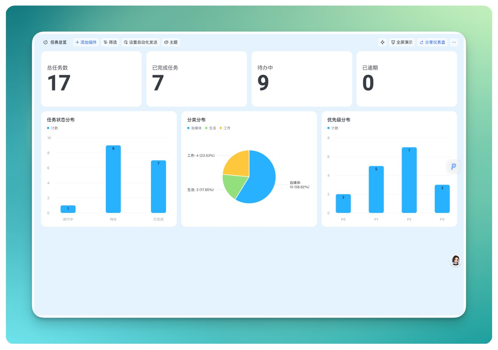
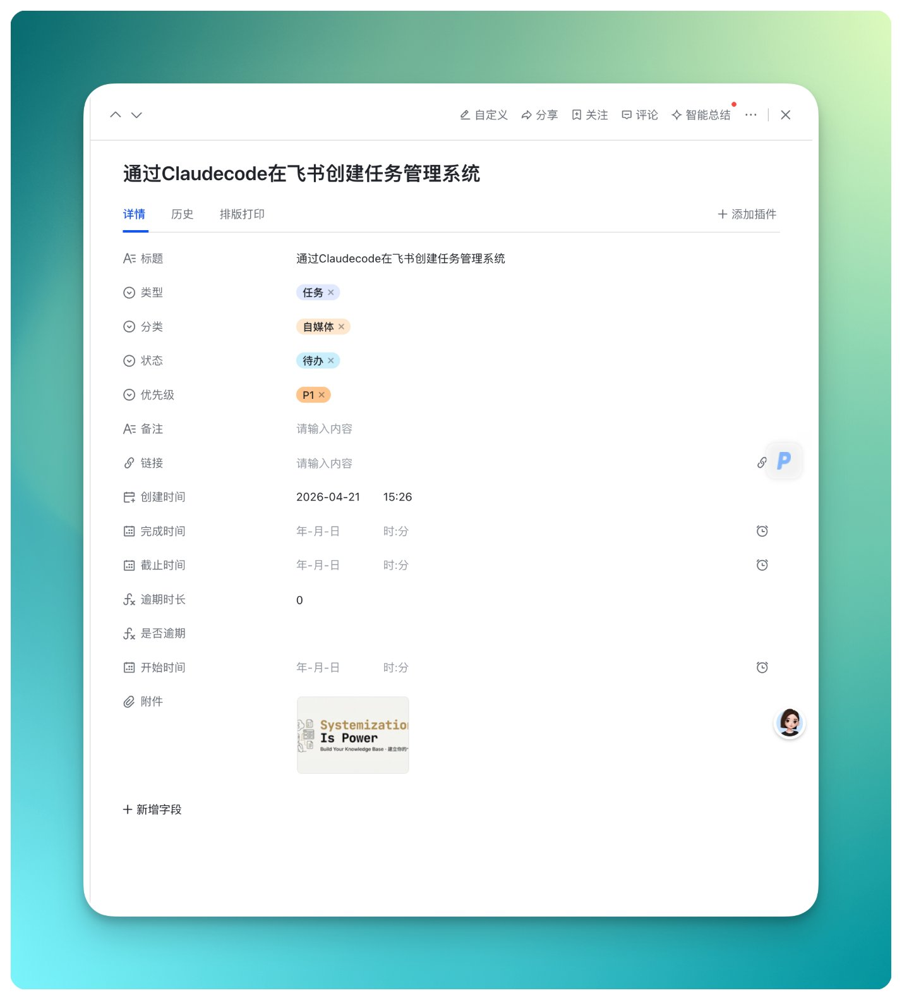
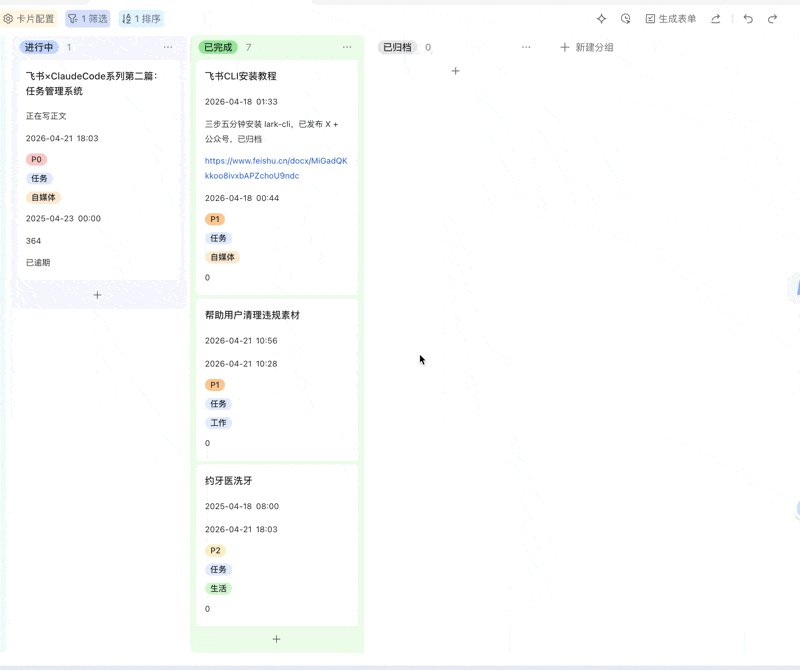
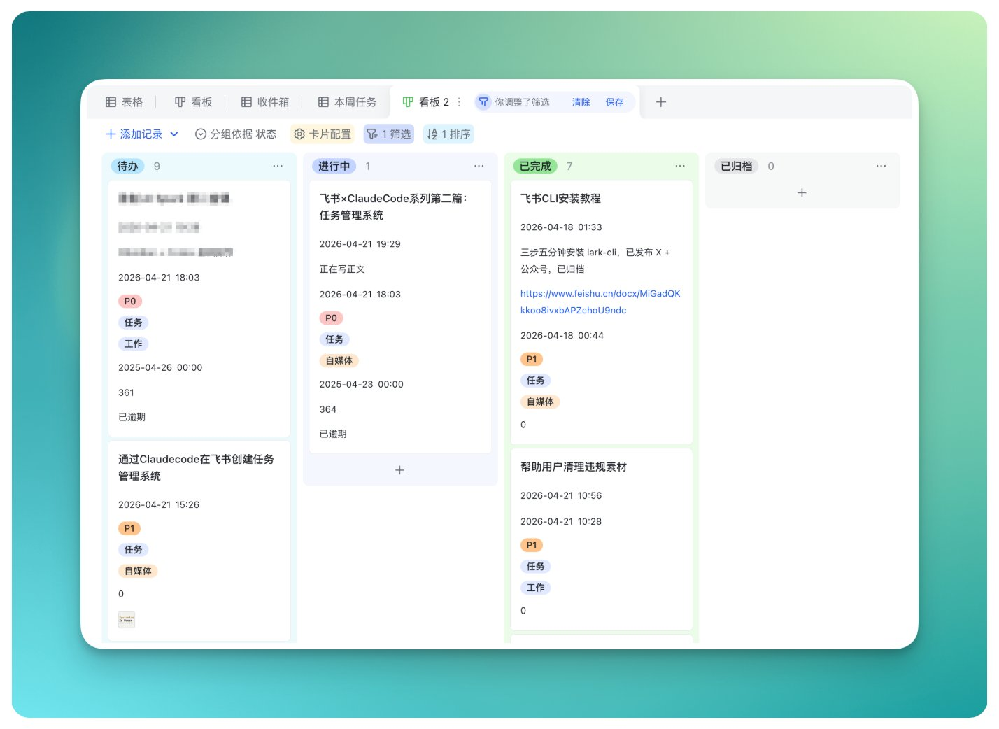

# 用 Claude Code 在飞书搭任务系统，14 个字段砍到 11 个才真正用起来


用 Claude Code 在飞书搭了个任务管理系统。

一开始搞了 14 个字段，用了两天发现一半没填过，砍到 11 个才真正用起来。

跟着做完你会得到：**一张带看板的任务表、3 个自动化（完成自动记时间、到期自动提醒）、一个数据仪表盘。文末附完整 prompt，粘贴一段话整套系统直接出来。**

我试过备忘录、试过滴答清单、试过 Notion 的看板。最长的一次坚持了两周。

不是工具不好，是每次记个任务都要打开 App、找到列表、点新建、填标题、选标签。六步。一个念头从冒出来到被记下来，中间隔了六步。隔得越多，记的越少。

后来想明白了一件事：功能多不多不重要，**录入摩擦低**才重要。

上周我跟 Claude Code 说了句"帮我在飞书建个任务管理表"。两分钟，表出来了。字段、自动化、看板、仪表盘，全配好了。我没打开过飞书后台，没点过一次界面。



用了一周，录了 30 多条任务。这是我用过所有任务工具里坚持最久的一次。

这是飞书 × AI 系列第二篇。上一篇讲怎么三步装好 lark-cli，这篇带你搭一个你真的会用的任务管理系统。

> 4月17日

## 建表：2 秒

打开 Claude Code，说一句：

```Plain Text
帮我在飞书建个多维表格叫"任务中心"。

```

2 秒。打开飞书，表在那了。

为什么不在飞书界面手动建？因为后面的字段、自动化、看板都可以继续"说"。飞书 UI 里加一个单选字段要点 5 步（新建字段 → 选类型 → 填名字 → 加选项 → 设颜色）。跟 AI 说一句，5 步变 0 步。11 个字段就是 55 步变 0 步。

这个差距在字段少的时候感觉不大。字段超过 5 个之后你就懂了。

## 字段：从 14 个砍到 11 个

这是我踩过最值得分享的一个坑。

第一版我设了 14 个字段。标题、类型、分类、状态、优先级、紧急度、开始时间、截止时间、完成时间、子任务进度、前置任务、后置任务、备注、链接。看起来很全面，像在搭一个正经的项目管理系统。

用了两天。打开录入页面，看到 14 个空格等着我填，直接关了。

这就是"全面"的代价。字段越多，每次录入的心理负担越重。任务管理系统不是设计好就完事了，你得每天愿意往里填东西。14 个字段的系统不如 5 个字段但你每天都用的系统。

砍掉了 3 个：

紧急度（四象限）。和优先级重复。P0 本身就是重要紧急，多一个字段多一次选择。两天里我填了 0 次。

子任务进度。进度条看着很酷，但个人任务根本用不到，那是团队管项目的东西。

前置后置任务。理论上"A 做完才能做 B"很合理，实际上我从来没填过。

最后留 11 个：标题、类型（任务/收件箱）、分类（工作/生活/自媒体）、状态（待办/进行中/已完成/已归档）、优先级（P0-P3）、开始时间、截止时间、完成时间、备注、链接、附件。

其中完成时间是自动填的，创建时间是系统生成的。你真正需要手动填的只有 5 个：标题、分类、优先级、截止时间、备注。最低限度可以只填标题。

录入摩擦从 14 个字段降到 1 个。这才是能坚持用下去的原因。



还有两个公式字段自动算，不用你管。逾期时长：过了截止时间自动开始计算差几天。是否逾期：超期了直接标红。看板上红的就是该赶紧处理的，一眼能看到。

## 自动化：3 句话

表有了，下面让它自己跑。

第一句：

```Plain Text
帮我建个自动化，状态改成已完成的时候自动把完成时间填上。

```

> 效果：把任务拖到"已完成"那一列，日期自动填。不用你记今天几号。

第二句：

```Plain Text
任务开始前一天早上 9 点提醒我。

```

> 效果：飞书消息自动发过来。不用设闹钟，不用翻日历。

第三句：

```Plain Text
截止前一天也提醒。

```

> 效果：该到期的任务，飞书会追着你。

3 句话，3 个自动化。全程没进过飞书的自动化配置页面。如果在 UI 里手动配，每个 Workflow 要点 8-10 步，3 个就是 30 步。

配好之后，你只管往里扔任务。到期了飞书追着你，完成了时间自动记，逾期了看板上直接标红。



GIF

## 看板：1 句话

```Plain Text
帮我建三个视图和一个仪表盘。看板按状态分组。收件箱只看捕获的内容。本周任务只看待办和进行中按优先级排。仪表盘放总任务数、已完成数、状态分布和分类占比。

```

看板是日常用得最多的。四列：待办、进行中、已完成、已归档。每天打开拖一拖就知道今天该干嘛。

仪表盘是给自己看的。干了多少活、积了多少没干的、哪个分类最多，数字不会骗人。



## 懒人模板

不想一步步来？把这段话丢给 Claude Code，整套系统直接出来：

```Plain Text
帮我在飞书创建一个多维表格叫"任务中心"，建一张"任务"表。字段：标题（文本）、类型（单选：任务/收件箱）、分类（单选：工作/生活/自媒体）、状态（单选：待办/进行中/已完成/已归档）、优先级（单选：P0/P1/P2/P3）、开始时间、截止时间、完成时间（日期）、备注（多行文本）、链接（URL）、附件。加两个公式字段：逾期时长和是否逾期。建三个自动化：完成自动填时间、开始前一天提醒、截止前一天提醒。建三个视图：看板、收件箱、本周任务。再建个仪表盘叫任务总览。

```

一段话，从建表到看板到自动化，全搞定。

从一句话到一个能用的任务管理系统。

回头看，真正让我坚持用下去的不是看板多好看，也不是自动化多酷，是录入变得足够轻。最低限度填个标题就行，念头不会丢。

之前那些工具为什么没用住？大概率不是工具的问题，是系统设计得太"完美"了，完美到你懒得打开。先把录入这件事搞舒服了，其他的慢慢加。

---

> 来源：飞书 · AI Spark 知识库 ｜ 原文（最新版）：<https://lcnniolukk80.feishu.cn/wiki/SLYawKB8Ei3cGlknOcBc7Of3n0d> ｜ 归档：2026-06-04
