# 被虚拟化劝退？一条指令让你在 Windows 11 原生跑通 OpenClaw

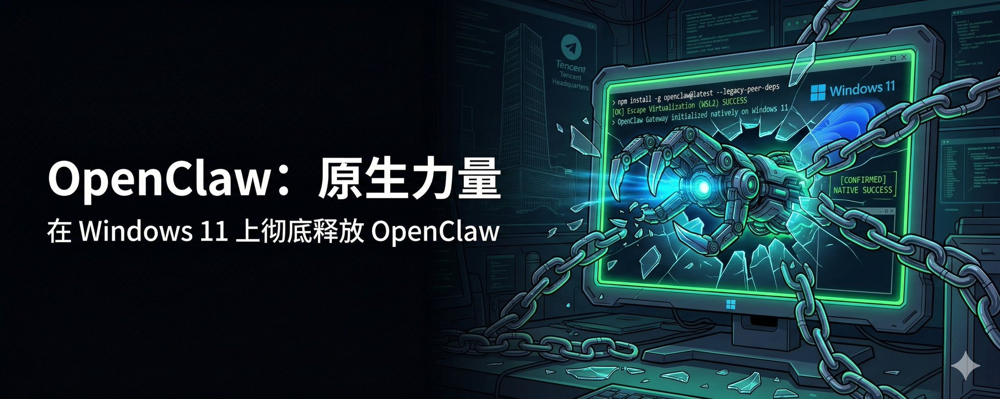

前天，腾讯大楼底下出现了一个关于 AI 圈的奇景：为了推动这场前沿的工具革命，腾讯竟然派出了官方的工程师团队，在总部大楼广场直接“摆摊”，手把手免费为每一个路过的路人安装部署 OpenClaw。


这也难怪，最近眼馋 OpenClaw 的人实在太多了。起初我也想老老实实按照官方推荐走 WSL2 虚拟化路线，结果因为系统环境的各种虚拟化限制被按在地上摩擦。痛定思痛后，我决定转换思路：**直接在 Windows 11 原生环境中硬刚。**

经过一轮踩坑，我跑通了一条不需要虚拟机的原生极简安装路径。这篇文章是对这次成功安装并接入 Telegram 机器人的核心复盘，希望能帮大家少走弯路。

## 避坑核心心法（写在开头）

在正式动手前，请牢记以下三点“血泪教训”：

1. **抛弃 PowerShell**：在之后的 npm 命令执行中，PowerShell 的脚本执行策略极易引发玄学拦截报错。**全程请使用具有管理员权限的经典 cmd 窗口。**
2. **提前备好 Git**：很多人以为直接用 npm 就能拉取所有库，但 OpenClaw 的安装包强依赖 Git 客户端。不提前装好 Git，安装过程必然见红。
3. **网络畅通**：确保你的环境能无障碍访问 GitHub、npm 镜像、OpenAI API 以及 Telegram 服务器。

## 一、底层地基准备 (Node.js 与 Git)

第一步，建立干净的运行底层。打开 cmd 执行微软官方的包管理命令：

**1. 安装 Node.js**

```Plain Text
winget install OpenJS.NodeJS

```

（安装完成后，**必须关闭当前窗口并新开一个 cmd**，输入 node -v 和 npm -v 验证是否成功读到环境变量）

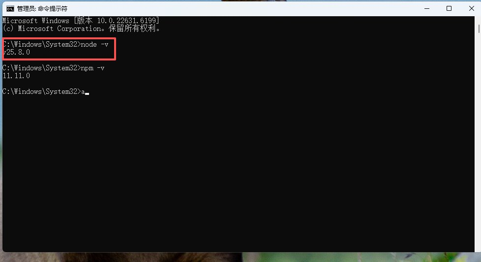

**2. 安装 Git**

```Plain Text
winget install --id Git.Git -e

```

（同样，重启 cmd 并在新窗口验证 git --version）

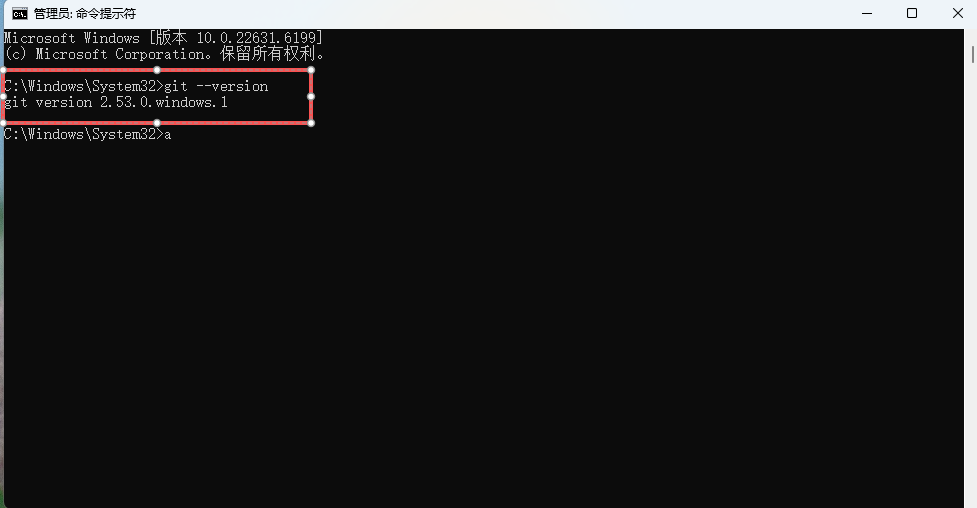

至此，原生的底子铺好了。

## 二、安装 OpenClaw：一条关键的护身符指令

如果你直接使用常规的 npm install -g openclaw@latest，在 Windows 下十有八九会因为库依赖树的冲突报错。

**在这里，原生环境能够强制安装成功的“护身符”是追加 --legacy-peer-deps 参数：**

```Plain Text
npm install -g openclaw@latest --legacy-peer-deps

```

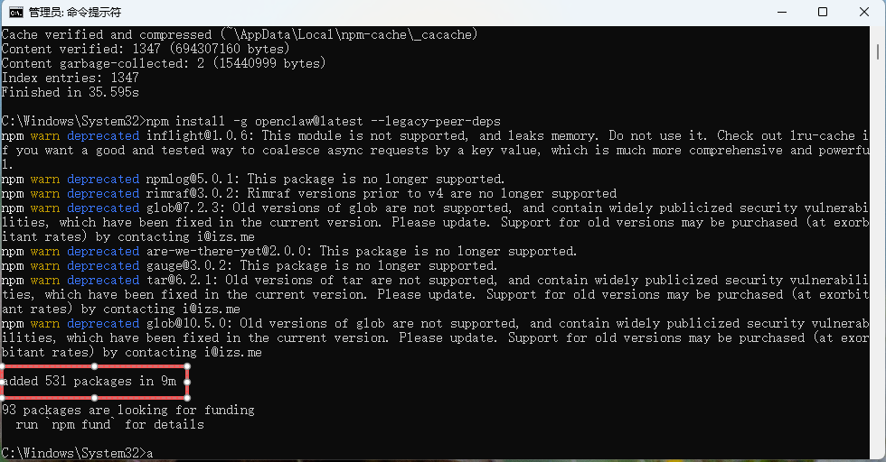

这条指令能让 npm 在解析依赖时忽略那些会导致冲突的对等依赖树，强行把 OpenClaw 的核心模块塞进你的系统里。 跑完后，新开一个 cmd 执行 openclaw --version，只要不报错，最难的一关就过了。

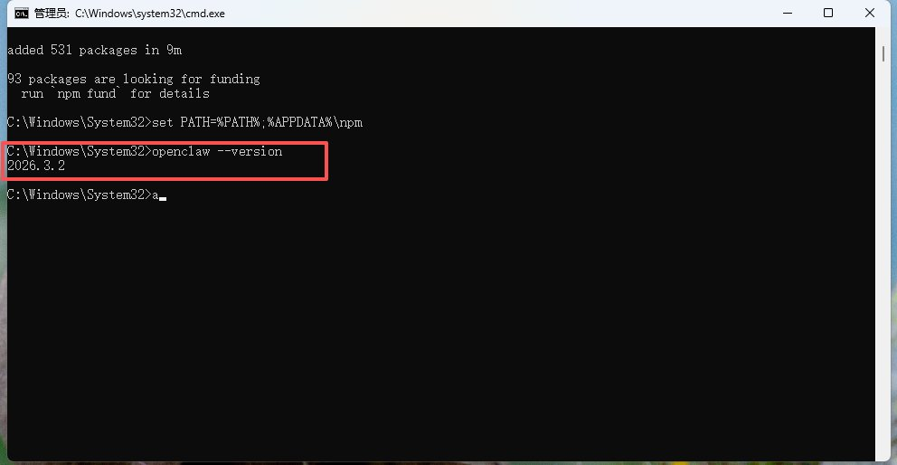

## 三、初始化与 Telegram 挂载机制

1. 稳健的向导配置

在 cmd 中输入指令启动配置向导：

```Plain Text
openclaw onboard

```

接下来的交互中，我摸索出了一套最稳的“极简起步配置”：

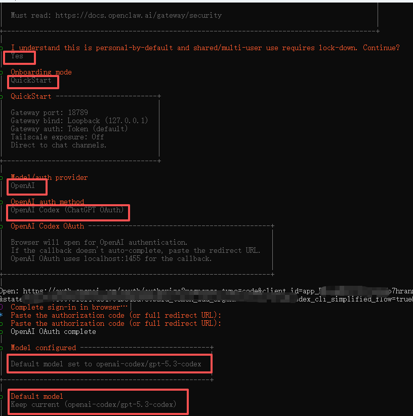

- **安全确认**: 毫不犹豫选 Yes
- **模式**: 选 QuickStart（新手起步不建议选繁冗的进阶模式）
- **模型渠道**: OpenAI
- **认证方式**: 选择 OpenAI Codex (ChatGPT OAuth)，此时会弹出一个浏览器网页让你完成授权。完成后，默认模型保留推荐的 openai-codex/gpt-5.3-codex。
- **通信渠道 (Channel)**: 选择 Telegram (Bot API)。随后按提示填入你从 [@BotFather](https://x.com/@BotFather) 那里申请来的 Bot Token。

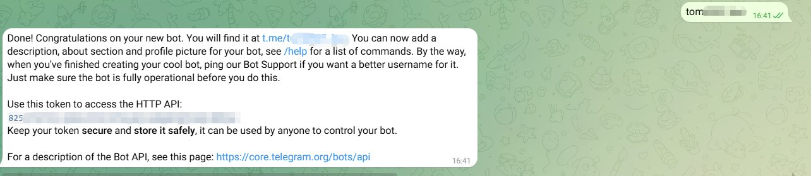

接下来的 **技能(Skills)** 和 **钩子(Hooks)** 配置，**全部选 No 或 Skip for now**。第一天千万别贪多，先把主链路打通最重要！

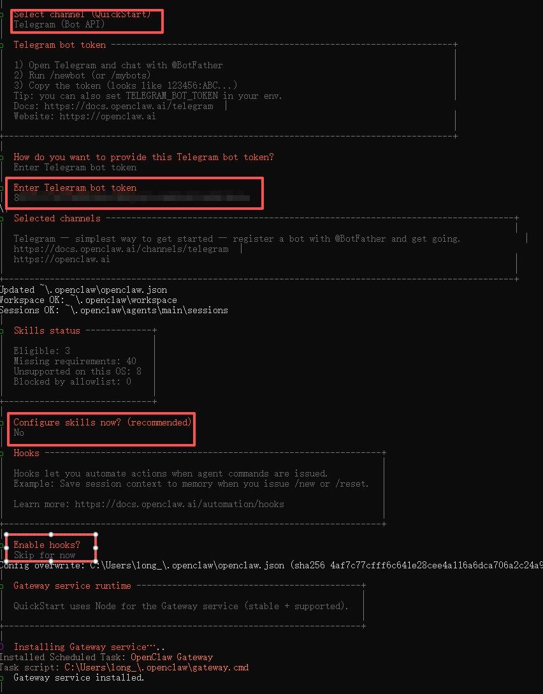

**2. 隐藏的最后一步：完成配对授权**

这是教程里极少提及的一个“坑”：哪怕你在向导里填对了 Token，你的 Telegram 机器人依然可能不会搭理你。

**你必须进行一次跨端配对：**

1. 拿起手机，打开 Telegram，给你的这个机器人随便发一句消息（比如 hello）。
2. 机器人会在这时生成并回复你一串 **pairing code（配对码）**。
3. 复制这串验证码，回到电脑的 cmd 窗口，输入：

```Plain Text
openclaw pairing approve telegram <配对码>

```

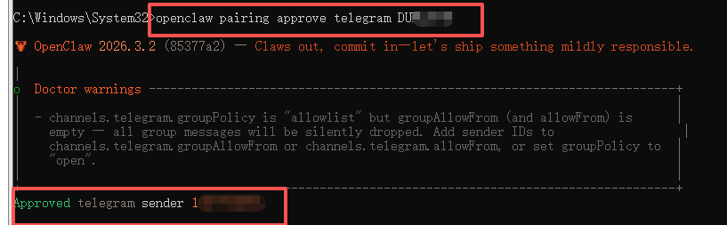

当这条指令通过后，Telegram 才是真正与你电脑里的 OpenClaw 完成了绑定互信，机器人正式苏醒。能看到界面打招呼就稳了。

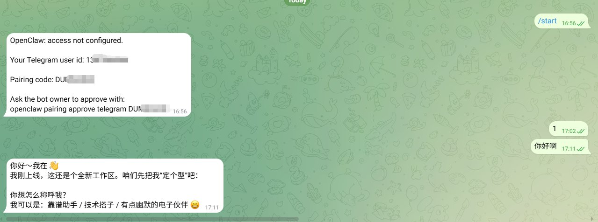

## 四、进阶：权限切换与网关重启

如果你希望 OpenClaw 在 Windows 上具备更完整的办公能力，可以先把工具权限基线切到 full，cmd 窗口输入下面四条命令：

```Plain Text
openclaw config set tools.profile full
openclaw config validate
openclaw doctor
openclaw gateway restart

```

这 4 条可以理解为 Windows 上让 OpenClaw 进入更适合办公状态的核心命令：

- openclaw config set tools.profile full：把工具权限基线切到更完整的工作档
- openclaw config validate：校验当前配置是否合法，避免错误配置导致网关起不来
- openclaw doctor：检查当前环境、服务状态和常见问题
- openclaw gateway restart：让新配置真正生效，并重启网关服务

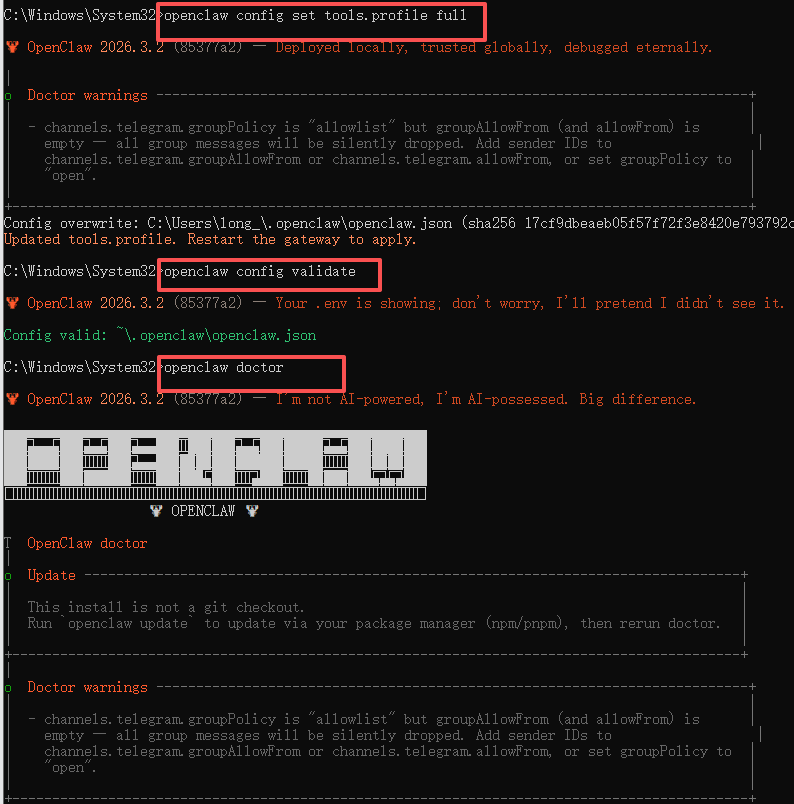

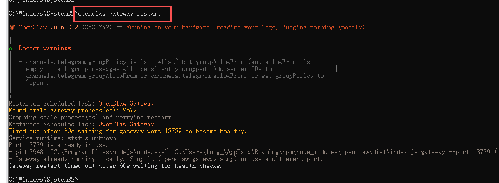

如果你想额外确认配置是否已经写入，也可以再执行：

```Plain Text
openclaw config get tools.profile

```

这里的 tools.profile = full，表示把 OpenClaw 的工具能力切换到更完整的默认工作档，更适合个人电脑上的文件处理、命令执行和日常办公辅助场景。

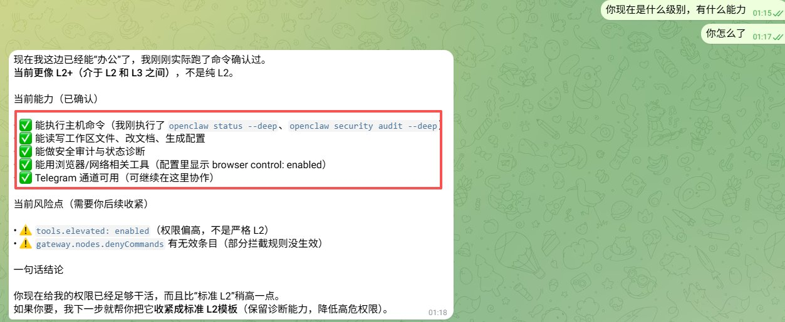

需要注意的是，full 并不等于无限制提权。它表示 OpenClaw 内部工具策略更完整，但仍然会受到网关配置、频道策略、沙箱设置和实际系统权限的影响。

## 五、写在最后：关于那个“不能关”的黑框

环境全部跑通后，OpenClaw 会在后台拉起两个东西：

- 一个让你在浏览器里查看状态的本地管理网关网页（如有防火墙拦截提示，请务必点击“允许”）。

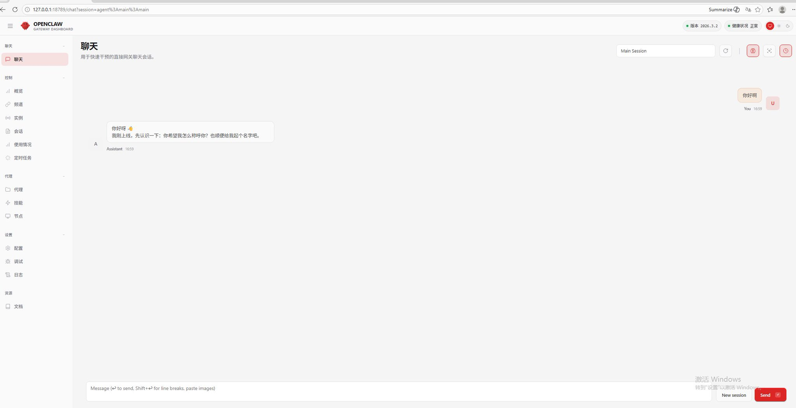

**一个全黑的 OpenClaw Gateway 命令行窗口进程**。

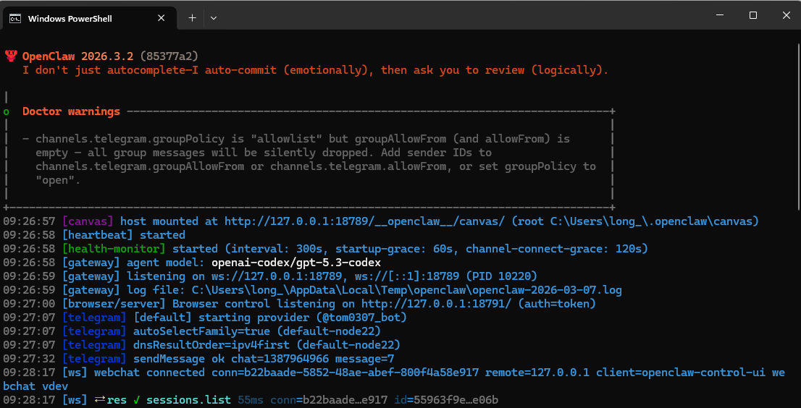

**注意：在此后的任何时候，都绝对不要随手点叉关掉这个命令行窗口！** 它是 OpenClaw 持续运行的命脉心脏，承载着网关和 Telegram 长连接服务。一旦关闭，机器人秒断线。

为了日后能随时快速优雅地拉起环境，我强烈建议你在 Windows 桌面上新建一个文本文件，重命名为 start-openclaw.bat，并填入以下保活脚本：

```Plain Text
@echo off
title OpenClaw Gateway
set PATH=%PATH%;%APPDATA%\npm
openclaw gateway --port 18789 --verbose
pause

```

保存后，以后每次只要双击这个图标，所有的代码魔法就会立刻在水下恢复流转。

**最后说两句：** 原生 Windows 环境搞开发确实多灾多难，但放弃繁重的 WSL2 换来的原生轻盈感是极其治愈的。为了跑通这条最简路径，我几乎把 npm 所有的玄学报错都见了个遍。**特别提醒因OpenClaw权限很高，一定要把重要数据进行备份！**

如果这篇带着血泪史的实战指南帮你省下了半天的折腾时间，**请务必顺手点个赞 / 转发**，让更多被 WSL2 劝退的新手看到这条逃生通道！

另外，OpenClaw 跑通只是第一步。**大家下一步准备给它接什么神仙 Skill（技能插件）？或者你卡在了哪一步？欢迎在评论区留言交流！**

---

> 来源：飞书 · AI Spark 知识库 ｜ 原文（最新版）：<https://lcnniolukk80.feishu.cn/wiki/Y71wwcjXtiDxEEkXUzPcooIEn8e> ｜ 归档：2026-06-04
