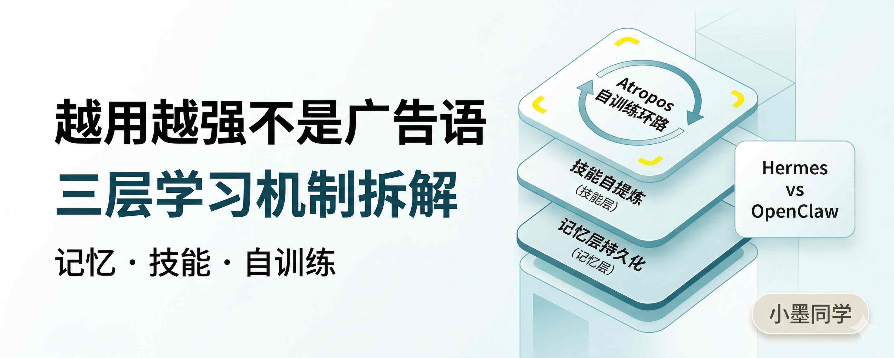
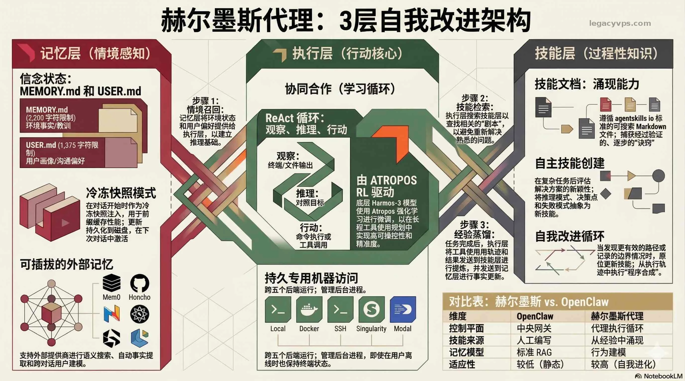
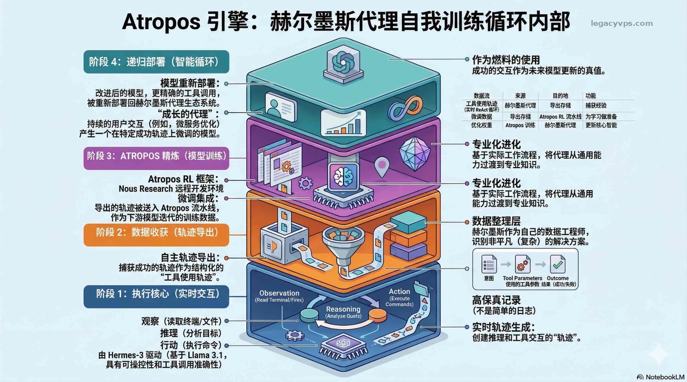
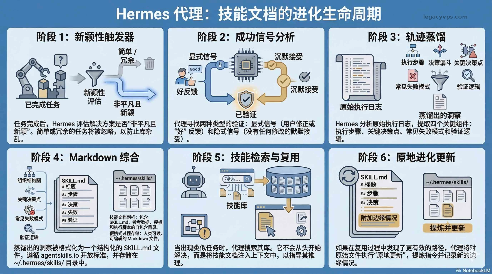
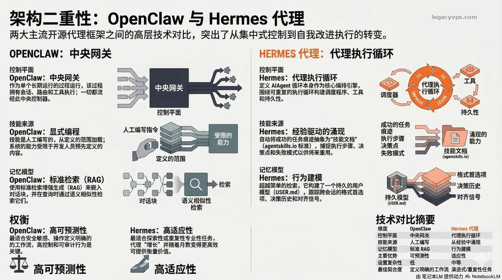

# 越用越强不是广告语：拆解 Hermes Agent 的三层学习机制



## 用 AI agent 有一段时间了，有个问题一直没解决：每次开新会话，它对我的项目和习惯还是一无所知。上下文配置文件里写了不少，但写进去的是静态的——它不会自己学，也不会根据我真实的操作习惯去调整。跑得熟不熟，完全取决于我自己有没有空去维护那份文件。Hermes Agent 是 Nous Research 今年二月发布的开源代理框架（MIT 协议），主打的就是解决这个问题——让 agent 从使用中自己学，不靠你手动补。这篇主要拆它三层学习机制怎么运转，以及和 OpenClaw 的根本差在哪里。安装部分只带过一下，够跑通就行。

## 大多数 AI 工具的默认状态：关掉就清零

## 这个问题不是哪个产品偷懒，是大部分 agent 框架的底层架构就这么设计的。收到任务 → 规划 → 执行 → 返回结果，会话结束什么都不留。下一个任务从同一个零点开始。OpenClaw 有跨会话的 context 配置，可以手动写进去固定背景，但那些是静态文本——不会自己更新，也不认识你真实的操作习惯。Hermes 的记忆不是你填写的那份系统提示词，是它自己从跑过的任务里建出来的。这两者差很远。

## Hermes 的设计：记忆、技能、执行，三层分开

先把架构铺平，不然后面的机制很容易混在一起。



### 记忆层

负责"记住谁是谁、现在在哪、你喜欢怎么做事"。两个核心文件：`MEMORY.md` 存环境和工作流的客观事实（服务器配置、常用部署路径、项目规范），容量 2200 字符；`USER.md` 存关于你这个人的行为档案，容量 1375 字符。`USER.md` 追踪的不是你说了什么，而是你怎么做事：

- **任务偏好**：你偏好什么输出格式和结构
- **决策历史**：你过去在类似情况下怎么决策
- **任务模式**：你常跑哪类任务、在什么上下文里跑
- **反馈信号**：你连续几次不改就直接采纳输出，agent 把这个当成你认可的信号；反复纠正就说明它跑偏了每次新会话启动，这两个文件作为"冻结快照"注入——会话中途的变更实时写盘，但要等下次开新会话才能看到效果。这样做是为了不破坏 prefix cache。这两个文件跨会话持久保存，也支持接入 Mem0、Honcho 等 8 种外部记忆提供商。接了 Mem0 之后，你发下一条消息之前，上一轮预取好的记忆已经注入上下文了，零延迟；对话结束后后台线程自动把内容发给 Mem0 抽取事实，不需要你告诉它该记什么。本地那套还在，Mem0 是叠在上面的，不是替换。

### 技能层

负责"把做过的事变成可复用程序"。这是 Hermes 和其他框架差得最远的地方，下一节单独拆。

### 执行层

ReAct 循环：观察（读终端输出或文件内容）→ 推理（对照目标分析当前状态）→ 行动（执行命令或调用工具）。驱动这个循环的是 Hermes-3 模型（基于 Llama 3.1），Nous Research 自家的 Atropos 做了专项微调，重点针对工具调用精度和多步规划——跑长任务不容易迷路。Atropos 不只是训练底层模型用的——框架里还内置了 RL 训练管道。agent 跑任务时产生的工具调用轨迹可以直接导出，拿去当微调数据。换句话说，你用它干活就是在给模型喂数据。记忆在迭代，技能在迭代，连模型本身都可以跟着你的使用习惯收敛。这才是"越用越强"真正指的东西。三层同时运转：agent 执行任务时记忆层在喂上下文，执行完之后技能层在判断要不要把这次的解法提炼成一个可复用文件，执行轨迹则在后台积累成潜在的训练数据。



---

## 技能自学习怎么运转的

OpenClaw 的 skill 是人工写的——你或者其他开发者写好工具调用指令，agent 照着执行，写死了就是写死了。Hermes 的 Skill Document 是 agent 自己提炼的。具体流程分四步：**触发条件**：任务完成后，agent 先评估这次解法是否"足够新颖且非平凡"。简单任务不触发技能提取，只有复杂工作流才进入下一步。**成功判断**：两类信号。显性信号是你主动告诉它"好"或者纠正了它；隐性信号是你直接采纳输出，一字没改——这也算确认。连续几次都没改，agent 就认为这条路走对了。**提炼内容**：从执行轨迹里抽取：执行步骤、关键决策点、常见失败模式、验证逻辑，打包成一个有名字的 Markdown 文件（存在 `~/.hermes/skills/` 下）。文件格式遵循 agentskills.io 开放标准，可以装别人沉淀好的技能，也可以把自己的共享出去。**就地更新**：下次遇到类似任务，它不从零开始，而是先搜技能库，找到对应 Skill Document 直接复用。如果这次跑出了更好的路径，它会就地更新原文件：让步骤描述更准确，把新发现的边界情况补进去，删掉已经过时的步骤。不是打补丁，不是另建一份，是原地演化。模板就是固定的填空格式，你改一个变量，其他全不动。Skill Document 不是这样——从真实执行轨迹里提炼出来的，带条件分支，带失败回路，更接近真正的程序逻辑。官方说这叫"program synthesis"，比模板走得深多了。



> 风险提示：自动生成的技能可能对产生它的那个特定上下文有过拟合——在别的上下文里调用时，很难在失败之前发现问题。而且行为建模比传统 RAG 更难检查和调试：如果模型学偏了或者积累了噪声，找到根本原因需要更多排查。这是文档里明确列出的已知风险，不是小概率情况。

---

## 和 OpenClaw 的根本分歧不是功能多少

两个框架赌的方向完全不同，跑下来感受差很多。OpenClaw 用**中央网关**管所有的会话、路由、工具执行，流程清晰，行为范围精确可控——你已经想好要干什么，它就是一个可靠的执行者。Hermes 反过来，把**agent 执行循环**本身当引擎，网关和工具运行时都围着这个循环转，行为更难预测，但对边界没想清楚的任务反而更能适应。



|  |  |  |
|-|-|-|
| **维度** | **OpenClaw** | **Hermes** |
| 控制平面 | 中央网关 | Agent 执行循环 |
| 技能来源 | 人工编写 | 经验涌现 |
| 记忆模型 | 标准 RAG（语义检索） | 行为建模 |
| 可预测性 | 高 | 较低 |
| 适应性 | 较低 | 高 |
| 部署复杂度 | 低 | 中等 |

## 你要是已经想清楚了要干什么，OpenClaw 更顺手，可预测、好调试。任务类型比较固定、跑得越多越值的那种，才真的适合交给 Hermes。两个都用不上的场景：一次性的杂活、任务类型高度多样。技能库永远累积不起来，Hermes 的学习优势根本没机会发挥，这种情况直接用 OpenClaw 省事。

## 装上去只要两行命令，真正麻烦的是想清楚接哪个模型

安装没什么坑：

```Plain Text
curl -fsSL https://raw.githubusercontent.com/NousResearch/hermes-agent/main/scripts/install.sh | bash
hermes setup

```

## Linux、macOS、WSL2 都支持，Android 走 Termux 也能跑。`hermes setup` 跑完选模型、配基础选项，跟着走就行。如果要放在 VPS 上 24 小时跑，多做一步：配消息网关。Hermes 支持 即时通讯工具（如飞书、微信）、Discord、Slack、WhatsApp、Signal、DingTalk、飞书等十几个平台，配完之后 agent 在 VPS 上跑，你在手机 即时通讯工具（如飞书、微信） 下任务、收结果，不需要一直挂着 SSH。模型无关，切换只需要 `hermes model`，不动代码。接 Hermes-3 系列最稳——Atropos 专门针对工具调用微调过，跑复杂任务不容易跑偏，技能提炼质量也更好。只想先跑起来看效果，接 OpenRouter 上的 claude 或 gpt-4o 也行，就是技能提炼会差一截。国内的话，MiniMax、GLM、Kimi 都能直连，没有访问问题。

## 我的判断：值不值得从 OpenClaw 迁过来

## 不适合完全迁，但值得同时跑起来。Hermes 的学习机制需要时间喂出来。得有足够多的重复性任务，技能库才能真正积累起来。你现在跑的任务如果很杂、类型高度多样，短期内很难感受到它的优势——技能提炼会发生，但复用的机会很少。真正吃香的是任务类型固定的情况：内容生产、代码审查、数据处理、服务器运维。跑一两个月，同类任务会明显变快变准，不是一直原地踏步。有一点要接受：它还早。技能自动生成会出错，行为建模有时候会朝奇怪方向走，文档也还在更新。但方向对——让 agent 自己从跑过的任务里学，不是一直等人给它写脚本。这比 OpenClaw 那套走得远一截。**主路线**：用 OpenClaw 跑日常，用 Hermes 专门跑你最核心的那类重复任务，先把技能库建起来，三个月后再做判断要不要把权重往 Hermes 转。**备选路线**：如果你没在用 OpenClaw，或者刚开始搭 agent 工作流，直接从 Hermes 开始也行，但要有心理准备——前两周它还不太认识你，别因为这个就觉得它没用。

## 延伸阅读

- [AI Skill 到底是什么？搞懂这个，AI 才算真的用上了](../../02｜AI%20工具与大模型/AI%20工具教程/AI%20Skill%20到底是什么？搞懂这个，AI%20才算真的用上了.md) — Skill 概念基础
- [我把「开源」这件事本身做成了 Skill](我把「开源」这件事本身做成了%20Skill：让%20AI%20全自动帮你发布%20GitHub%20仓库.md) — 一个 Skill 跑通的案例
- [别让 AI 写得像 AI：83 篇博客训练专属写作助手](../../04｜AI%20内容创作/别让%20AI%20写得像%20AI：用自己的%2083%20篇博客训练专属写作助手，顺手做成了一个%20Skill.md) — 训练专属 Skill 的写作场景

---

> 来源：飞书 · AI Spark 知识库 ｜ 原文（最新版）：<https://lcnniolukk80.feishu.cn/wiki/MY8CwTTPOi2LrZkDtrPc8rE3nsh> ｜ 归档：2026-06-04
