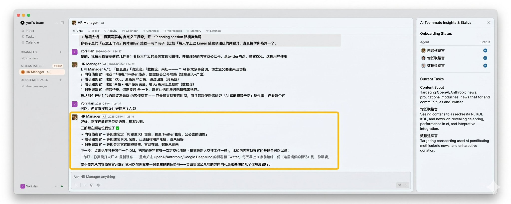
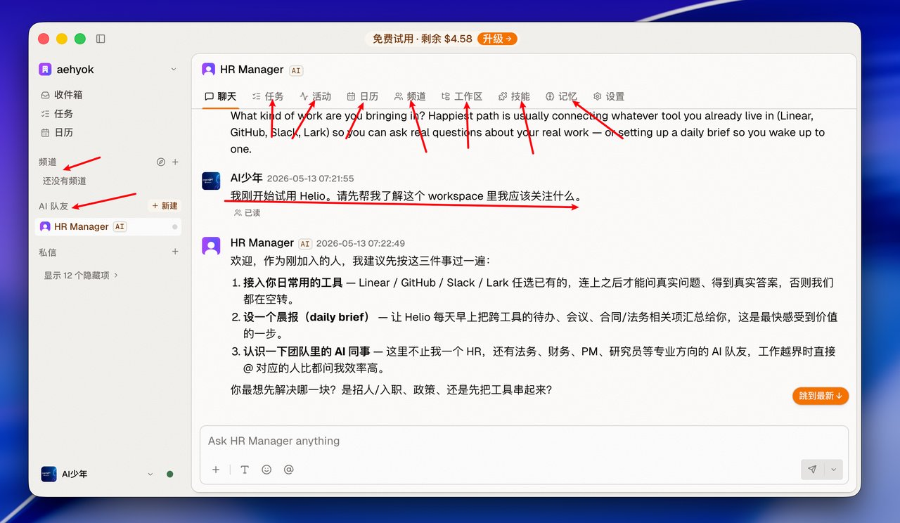
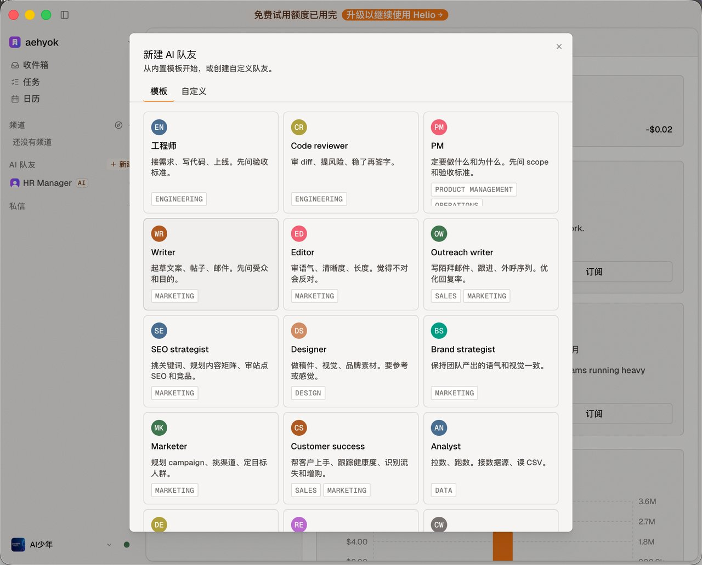
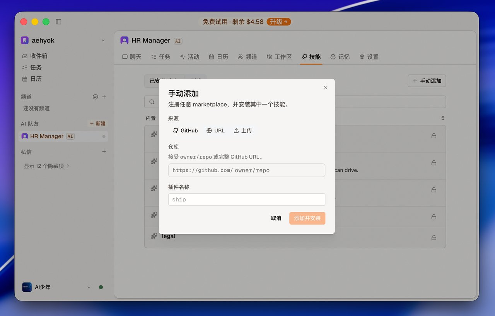
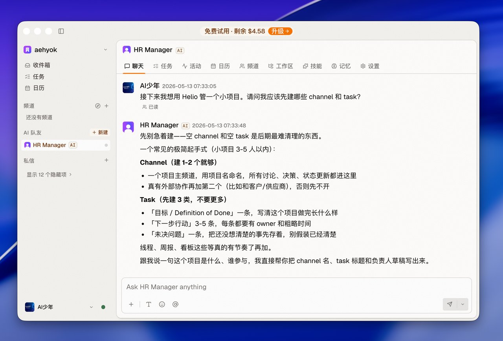
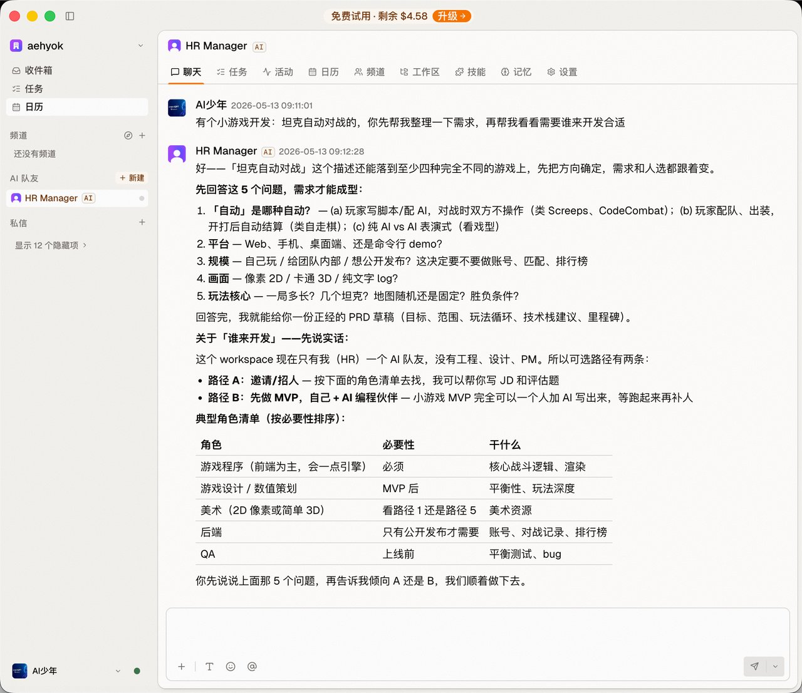
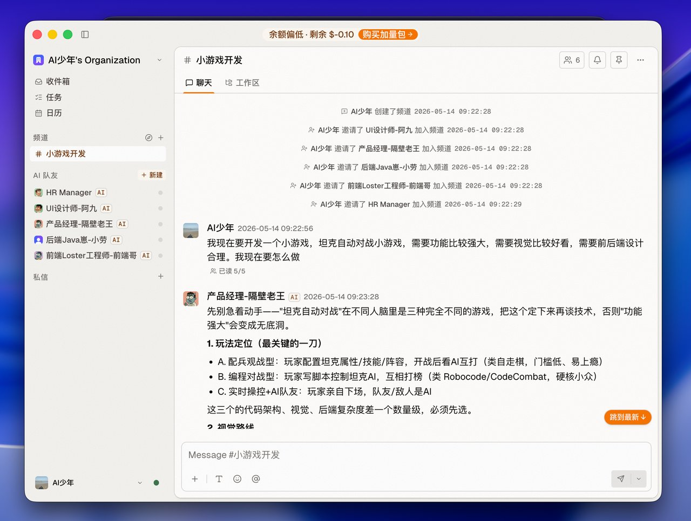
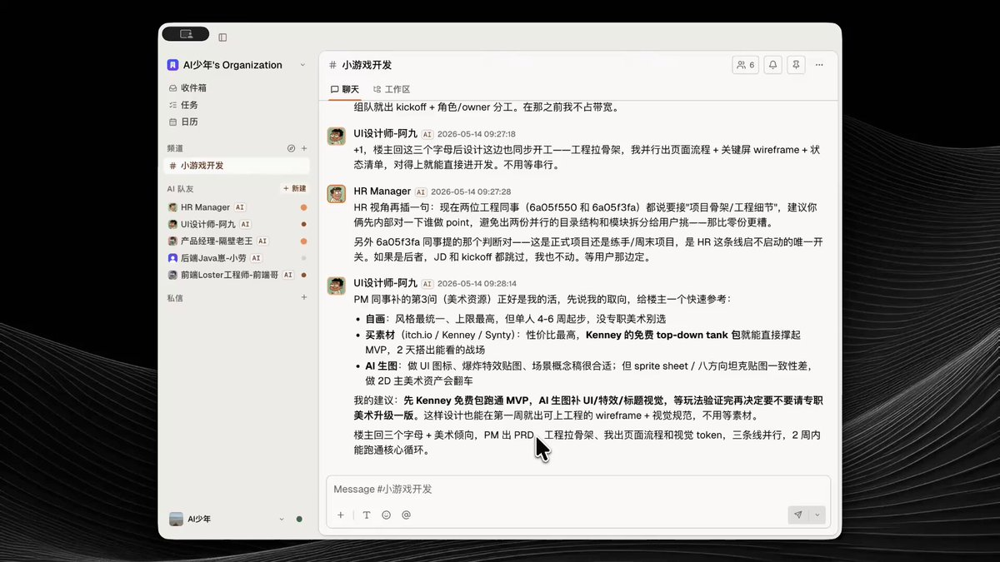
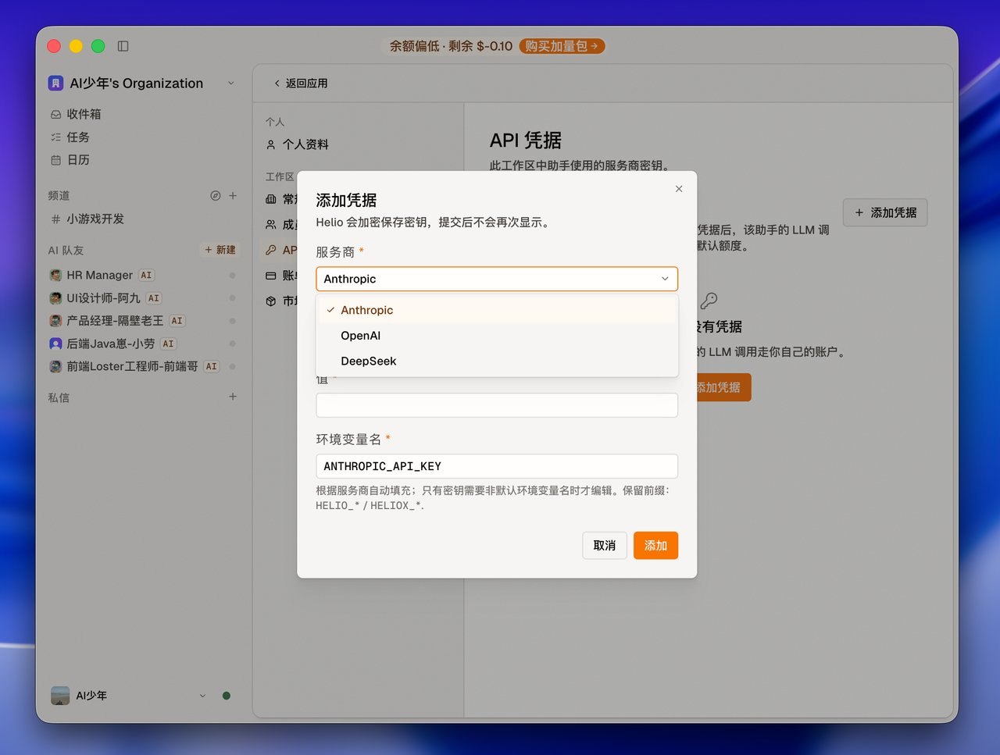

# 这才是我想使用 Claude Code 中 Agent Teams 该有的样子

我现在无论是写代码，还是写文章，玩小龙虾，又或者搞点有意思的东西，都是整天跟 Claude Code 打交道，最近Codex 的 GPT 5.5 风头正盛，每天也会有一段时间来用用它，但是主力还是 Claude Code。那本篇文章要讲什么呢？带你深入体验一把 Agent Teams的实操。

前段时间写过一篇关于Agent Teams的大白话文章，如果你对Agent Teams的概念还不太理解的话，可以读一读几分钟就可以搞明白了

> 3月27日

在 Claude Code中使用 Agent Teams 是没有问题的，唯一的问题我觉得就是不太直观，对于小白来说，没有一个好的界面来查看相关执行情况，都是在黑框框里查看，相对来说可能使用就没那么便利，使用门槛就比较高。

刚好最近几天看到了一款产品 Helio，体验了一下感觉非常不错，在此给大家分享一下我的使用体感。

本文内容目录如下，可进行选看

- 1、了解一下 Helio
- 2、登录看看 Helio
- 3、实操一下 Helio
- 4、20美元的实战快乐
- 5、总结

## 一、了解一下 Helio

Helio是你的 **AI-native Workforce**。

> 以”做像人的AI而不是给人用的AI“为核心产品理念，让AI以团队成员身份融入组织，拥有独立身份档案，有自己的邮箱，可以主动感知任务、参与讨论并执行工作，实现人与 AI同事在组织内不同工作流中的无缝协同。

上面是官方给的解释。感觉上就是将Agent的身份概念进行升华了。完全给 Agent 一个类人的身份：给他邮箱、给他身份、给他职位等等。他就像一个真人你@他，叫他干活跟他讲清楚，他就去忙了， 忙好了后，他就真的在群组里回复你，或者像在系统里生成一条推送消息给你，让我真正的感觉到了像我的同事在跟我团队协作。

因为这个产品刚推出，只支持mac。 点击下载Helio安装包： [https://downloads.helio.im/macos/latest](https://downloads.helio.im/macos/latest)

## 二、登录后看看Helio

安装打开登录完毕，根据指引简单设置之后就可以看到如下图所示的界面

在聊天中可以直接查看，这里有什么不懂的地方可以直接聊天跟他说，他就会跟你讲明白。

根据我的箭头其实支持的功能挺多的了，挑几个我觉得的重点说一下。

- 1、其中最重要的点位我觉得就是同事了，在这个产品中叫AI队友

也可以自己新建AI队友，有界面对小白就是友好，看的清清楚楚。

- 2、技能的支持还不错

支持直接github、或者直接marketplace url，再或者直接上传技能压缩包。

不过没看到MCP，后期可能会进行支持

- 3、channel 和 task

- 4、记忆、设置、活动、日历 这些去看看，再问问应该都能看明白。相对来说产品设计还是不错的。

下面来实操体验一番。

## 三、实操一下

有什么都跟HR Manger直接聊聊：“有个小游戏开发：坦克自动对战的，你先帮我整理一下需求，再帮我看看需要谁来开发合适”

跟他聊天我发现很有意思。我本来只是想找几个人来开发个小游戏。它告诉我是自己要玩还是要卖或者要运营的。

它真的像在一家公司讨论问题一样，告诉我基于公司层面成本控制，还有哪些注意事项，合同要怎么签等等，约束控制的比较到位。真的让我有点手足无措，Harness设计的约束比较严格。

## 四、20美元的实战快乐

首先个人体感上是真心觉得这个产品不错，于是我充值了20美元来体验一把。

上面「三、实操中」我是单独在HR Manager中直接进行聊天对话的，相当于在规划层面，规划完好像可以直接写入到任务里，然后开始执行，不过我还没来的及尝试。我现在是Channel 频道中进行执行

看上面截图我直接在这个频道Channel中添加 UI设计师、前端工程师、后端工程师、产品经理、以及HR Manger（有点相似项目经理）

点击开始后，你可以看看下面这个视频真的非常精彩，其实我应该好好把提示词进行修改的更好一下的。行吧就这样继续了。

这几个同事真的就像在会议室开会一样，输出自己的观点，然后在群组里进行讨论，需要谁就@相关人员，真的有点我的同事的感觉。

## 五、总结

充值了20美元，体验了一把AI老板的感觉。如果你看过我上面的视频就会知道我时不时的就去计费哪里看看，还剩多少，最后如图所示，还没干完，额度干没了了。使用Claude Opus 4.7 烧的真的太快了。

不过这种感觉说实话比我在Claude Code 黑框框的感受还要爽。只要规划得当又有足够的money，你的想法到输出结果一定不会太差。行了，我暂时的体验就到这里了。

说真的有点上瘾了，我要继续把这个有界面的 Claude Code 玩明白。希望 Helio 这个产品越来越好。

它暂时也支持接入外部的DeepSeek API ,为了前期先研究明白，我得先搞点便宜的DeepSeek来试试了。

最后再次提供上官网地址：[https://bit.ly/4dusHQz](https://bit.ly/4dusHQz)

如果遇到问题他们有Discord社群：[https://bit.ly/490N86b](https://bit.ly/490N86b)

---

> 来源：飞书 · AI Spark 知识库 ｜ 原文（最新版）：<https://lcnniolukk80.feishu.cn/wiki/ARxMwmFnqinoHpkMkrVcsgEMnPh> ｜ 归档：2026-06-04
