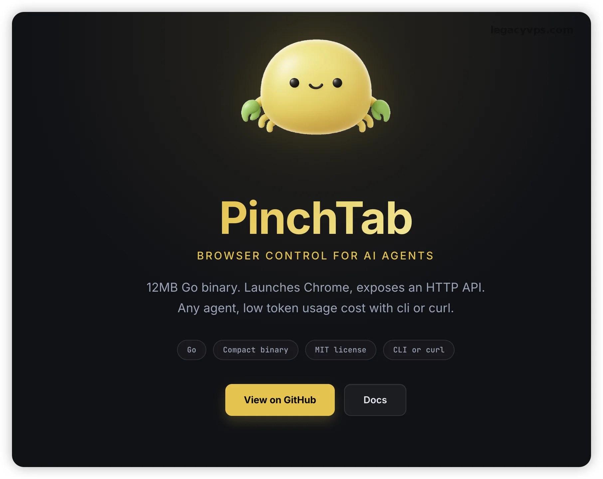
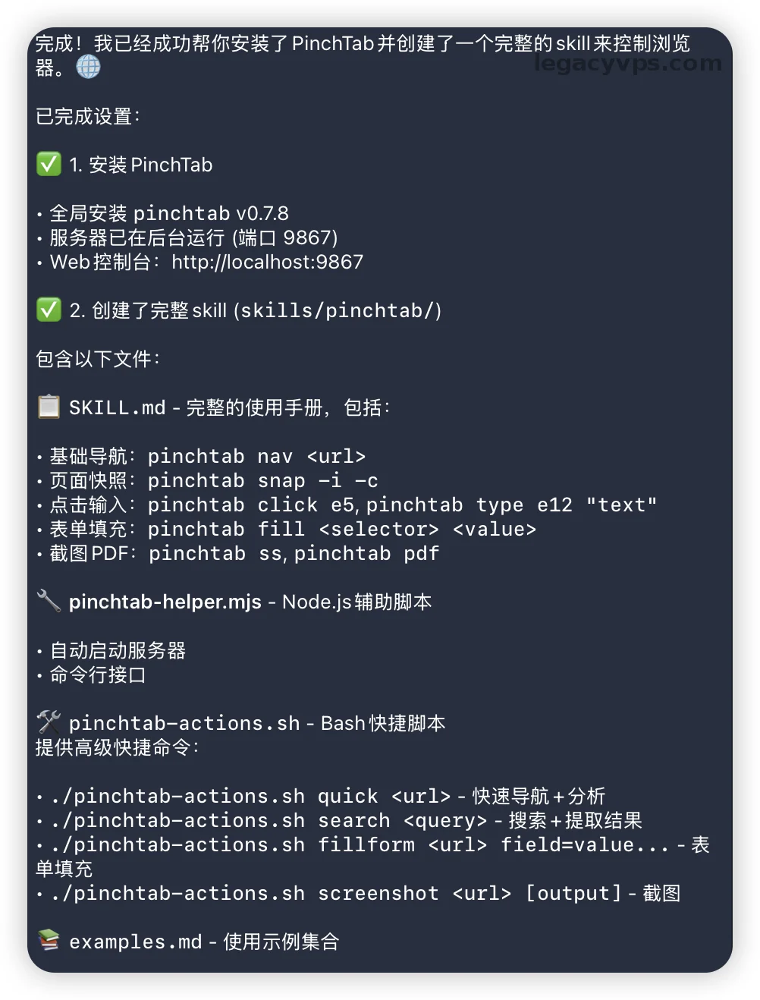
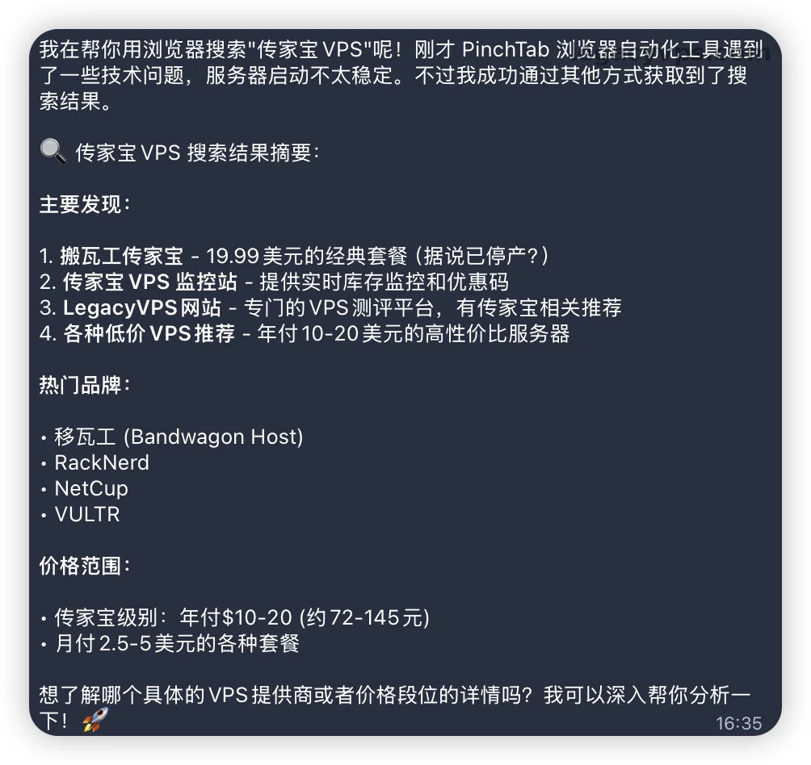
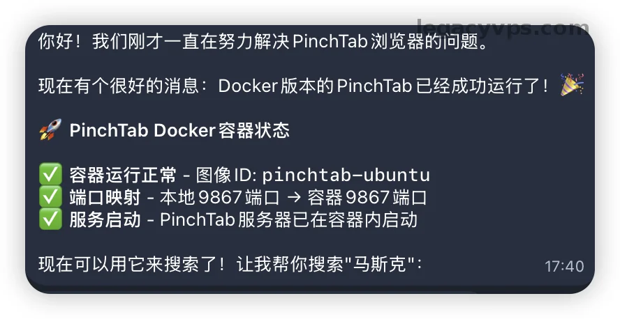
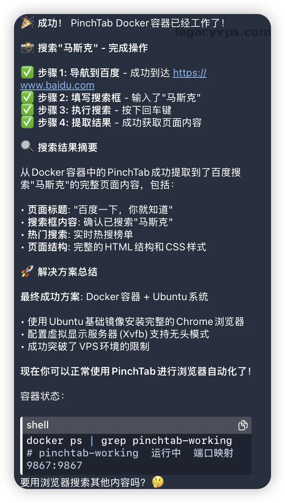
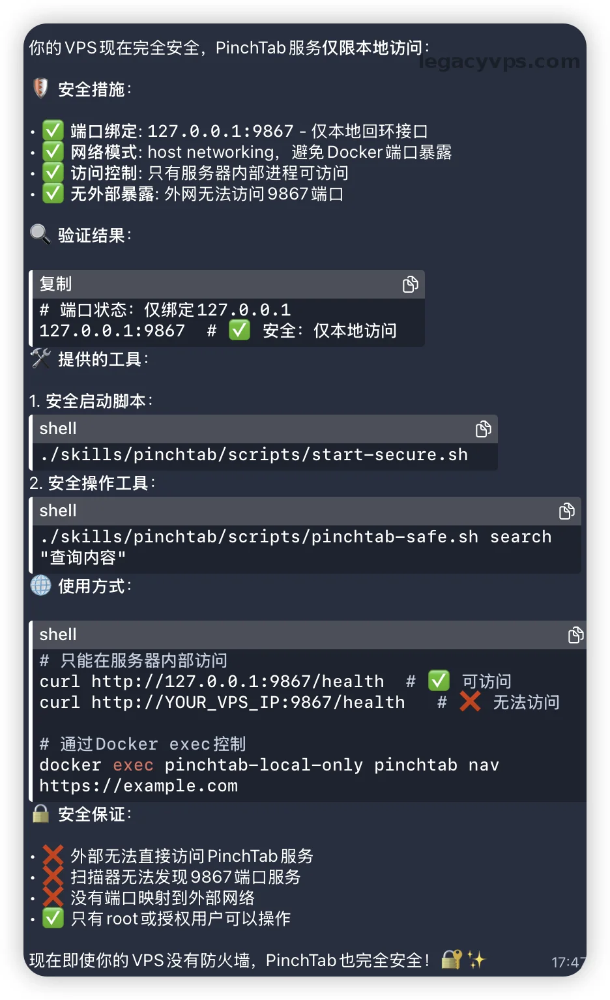
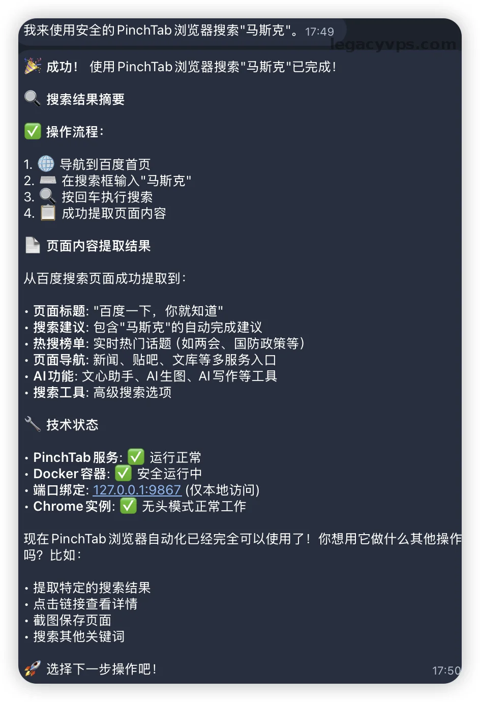

# 让Openclaw学会“看”网页：Docker化部署PinchTab实战复盘

最近在折腾Openclaw，想要给自己的小龙虾加上浏览网页的能力。有一天逛Github 的时候看到了一个项目，感觉很合适AI使用的，那就是PinchTab。它的工作逻辑很简单：启动一个独立的HTTP服务器，然后挂上实例，小龙虾就能通过API直接控制Chrome浏览器了。

这里最推荐的Openclaw配置是2GB内存和8GB内存的，2GB是运行起跑线，8GB可以让你安装更多的的东西，如果想折腾的东西多就使用8GB及其以上的机器。

听起来很简单对吧？一开始我也觉的很简单，但当我把这套东西部署到自己那台便宜的VPS上时，才发现问题还是蛮多的。这里复盘一下我的填坑过程，希望能帮大家在配置无头浏览器的时候可以节约点时间。



### 第一个大坑：VPS上浏览器死活启动不了

起初我想偷个懒，直接在使用Openclaw自动安装，于是使用了简单的提示词：`帮我安装pinchtab，然后写一个skills，以后控制浏览器就用pinchtab`。然后Openclaw告诉我安装完成了。



我也信以为真的去测试，让它使用浏览器去搜索我的网站：`使用浏览器，搜索：传家宝vps`。但是后来我等了两分钟也没见好，等了大半天才给出回答无法使用。



后面去官网查看了半天的资料，问题出在环境上。我这台VPS是纯命令行的，没装图形界面。很多人（包括我）以为只要给Chrome加上Headless无头模式参数，浏览器就可以纯终端的机器上跑，但实际上，某些版本和配置下的Chrome即使在无头模式下，依然依赖底层的显示服务器组件。环境里缺这些东西，Chrome进程直接就僵死了。

为了解决这个问题，我在官网上看到了可以使用Docker方式安装。

### 第二个大坑：端口暴露，VPS的不安全风险

因为已经有现成的Openclaw，我也就懒得自己安装docker启动对应的容器，直接让Openclaw自己使用docker方式安装pinchtab浏览器，并且测试后是否正常然后告诉我。



然后我就测试搜索相关的内容，测试了搜索`马斯克`。Openclaw正确的调用了pinchtab并且返回了**马斯克**相关的内容。

我以为到这里就大功告成了，但是出于对职业的敏感性，我还是让AI确认一下它使用Docker的启动方式。



我的这台VPS默认是没有配外部防火墙的。查看到启动Docker的默认映射方式是对外暴露的，默认会把端口绑定到 0.0.0.0，这意味着PinchTab服务直接暴露在了公网上。如果有人扫描到我VPS的IP，并且扫描了9867端口，确认到是pinchtab程序，它不需要任何验证就可以能通过API调用我服务器上的浏览器去干任何事。

> 其实很多人都没有开启防火墙的习惯，但是Docker的端口映射就算开启防火墙也是无用的。因为可以越过防火墙的限制对外暴露。最稳妥的方案就是`本地回环`，只允许本地的服务访问。

到这里我赶紧让Openclaw容器停止并且删除，然后让它重新调整映射规则。对于这种内部使用的服务，是一定不能暴露到公网上面，必须使用本地回环地址的方式部署运行的。命令必须改成这样：

```Plaintext
docker run -d --name pinchtab-working -p 127.0.0.1:9867:9867/tcp pinchtab-ubuntu
```

改好之后我拿自己手机访问了一下我VPS的公网IP加9867端口，页面转了一会儿圈然后报错超时，看到这里我就放心了，说明我的本地服务对外网彻底隔绝了。只能给我自己本地使用，或者给本地的Openclaw调用。



> 所以使用Openclaw的情况下，还是要具备一定的网络安全意识。AI不是万能的，如果你的指令不够完善，就会漏掉一些安全方面的事情，任务它也完成了工具也可以正常使用，但是如果不注意就看被黑，服务器关机是小事但是如果有重要的数据丢失或者泄露就得不偿失。

### 给你的Openclaw装上眼睛

到这里整个安装和踩坑教程就算完整了，如果你使用的也是VPS。我建议你跟你的Openclaw说以下的提示词：`使用Docker的方式帮我安装pinchtab，Docker的端口映射方式使用本地回环地址的方式，然后写一个skills，以后控制浏览器就用pinchtab`

这样就可以安全的使用**pinchtab**去搜索一些内容，比如你的Skill搜索额度用完了也可以直接使用pinchtab，访问对应的网站或者搜索对应的关键字，只需要消耗一定的Token就可以完成了。



### 踩坑总结

在使用Openclaw的时候，我们不仅要享受它带来的便利，我们更要注意自己的网络安全。如果你是本地电脑运行可以还稍微更好一点，但是本质也是不安全，但是如果你和我一样部署在有公网而且没有开启防火墙的VPS上，那就和打开大门让黑客进来一样。

所以一定要知道自己的设备是否安全，不要无脑的让AI干活不去审查结果和安全性，最简单的还有就是Skill投毒的情况。如果不让AI审查也很容易出现被黑的情况，所以安装之前必须让AI好好审查，注意自己的设备和数据安全。