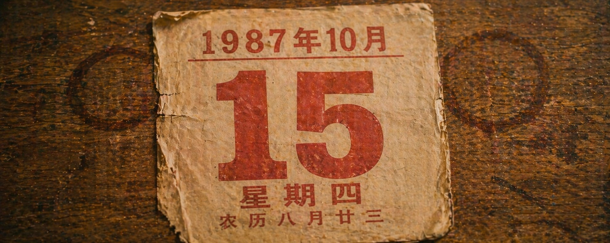
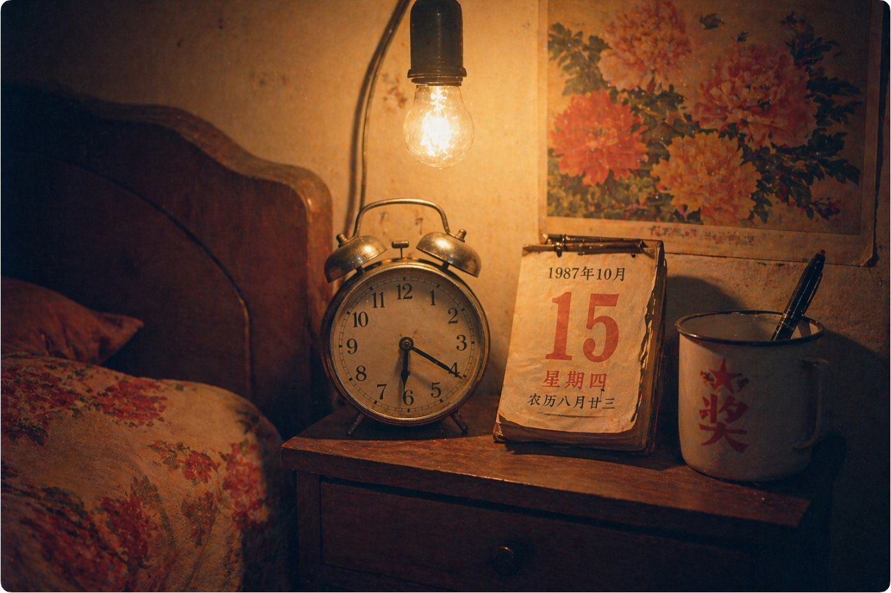
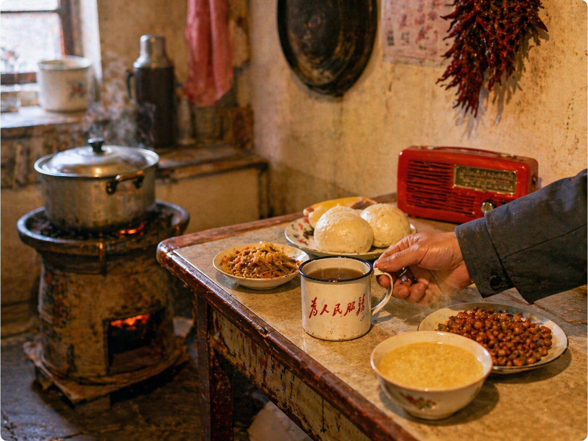
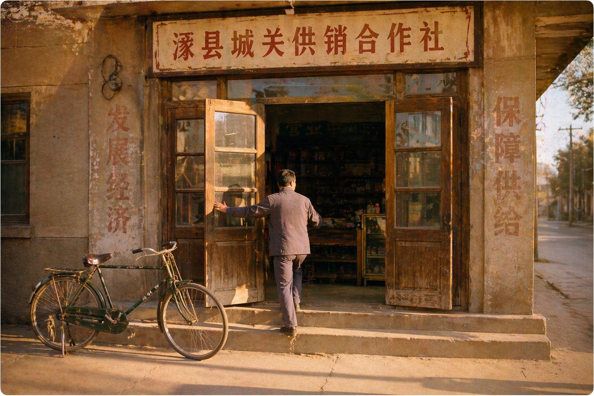
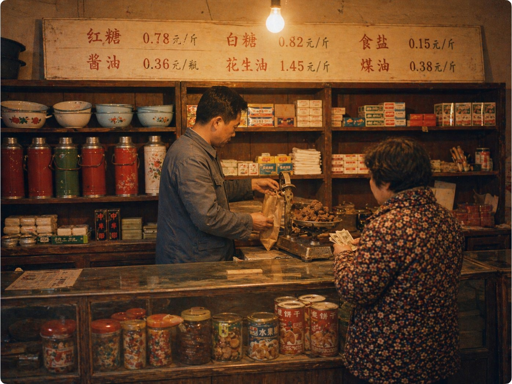
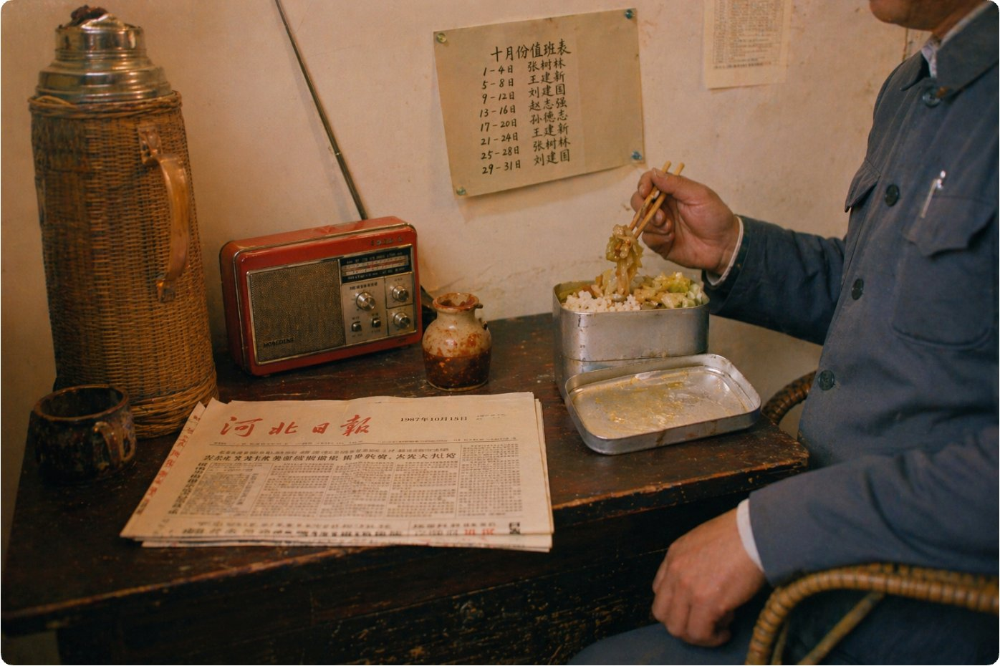
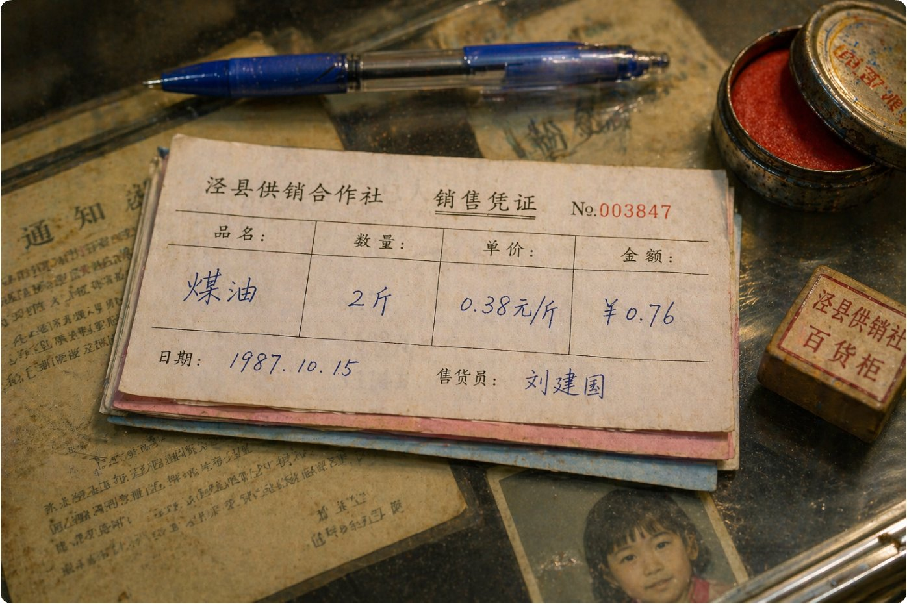
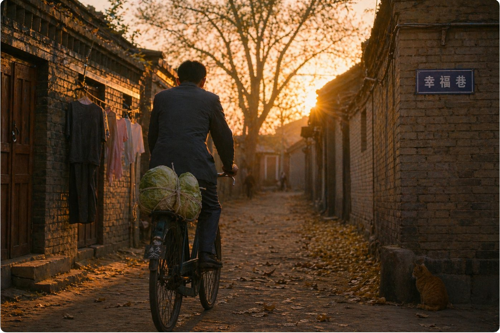
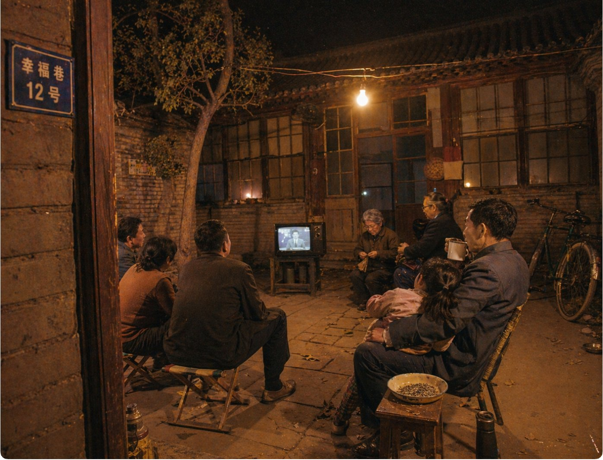

# GPT Image 2 上线：我伪造了 1987 年一个中国人的一天

1987 年 10 月 15 日，星期四。河北涿县。

一个叫刘建国的供销社售货员，早上六点二十被闹钟叫醒，晚上八点在四合院里看完新闻联播。

就是普普通通的一天。下面是他留下的 8 张照片。

这是他床头。

1987 年 10 月 15 日，星期四，农历八月廿三。

双铃闹钟指着六点二十。旁边搪瓷缸上印着个红色的"奖"字，里面插着支钢笔。墙上是一幅褪色的牡丹年画。十五瓦的白炽灯泡亮着，被子还没叠。

六点五十，他在厨房吃早饭。

蜂窝煤炉上煮着小米粥。桌上摆着两个馒头、一碟咸菜、一碟花生米。搪瓷缸上印着"为人民服务"，里面泡着浓茶。

旁边那台红色塑壳收音机开着，应该在放早间新闻。

七点半，他到了。

涿县城关供销合作社。他推开两扇木门，街上还没什么人。门口停着他那辆永久牌二八大杠。

门两边墙上刷着"发展经济""保障供给"，油漆已经褪了。

上午九点，上班。

玻璃柜台后面，他在给人称红糖。价目牌挂在墙上：

> 红糖 0.78 元/斤 白糖 0.82 元/斤 食盐 0.15 元/斤 酱油 0.36 元/瓶 花生油 1.45 元/斤 煤油 0.38 元/斤

货架上摆着搪瓷脸盆、热水瓶、肥皂、火柴。头顶白炽灯泡亮着。

中午十二点十分，他在后屋吃饭。

铝饭盒打开，米饭配炒白菜。桌上摊着一份《河北日报》，日期是 1987 年 10 月 15 日。收音机天线竖着。

墙上钉着十月份的排班表。他的名字在上面。

下午四点半。

涿县供销合作社，销售凭证，No.003847。

品名：煤油。数量：2 斤。单价：0.38 元/斤。金额：¥0.76。

日期：1987.10.15。售货员：刘建国。

旁边盖着"涿县供销社百货柜"的方章。玻璃板下面压着一张小女孩的照片，是他女儿。

傍晚六点，下班了。

他骑着那辆永久牌穿过幸福巷，后座绑着两颗白菜。夕阳把灰砖墙染成金色。胡同尽头那棵老槐树叶子快掉光了。

墙根蹲着一只橘猫。

晚上八点。

幸福巷 12 号。四合院里，四五家人围着一台 14 寸黑白电视看新闻联播。小板凳、马扎、藤椅。有人端着搪瓷缸喝茶，有人嗑瓜子。一个小女孩趴在她爸腿上。

头顶一只白炽灯泡挂在拉出来的电线上，照亮整个院子。角落里停着那辆自行车。

秋天的晚上有点凉，有人披着外套。

## 8 张图是怎么做的

我给每张图写了一段 prompt，约束不复杂：

1. 统一色温：全程暖黄，模拟白炽灯 + 柯达 Gold 200 胶卷
2. 统一质感：80 年代傻瓜相机随手拍，颗粒粗，构图不太正，边角发暗
3. 统一人物：灰蓝色中山装，不露正脸（所以你始终没看清他长什么样）
4. 每张图都包含具体的中文文字，我在 prompt 里逐字指定

8 张图，每张跑 2-3 次取最优。总共不到两个小时。

完整的 8 个 prompt 我放在下面，想试的可以自取。

## 附录：8 个 Prompt

**1️⃣** **6:20 床头闹钟与日历**

> 一张 1987 年中国北方小县城家庭卧室床头的照片，俯拍偏侧。木头床头柜上放着一只圆形双铃机械闹钟，指针指向 6:20，闹钟旁边立着一本翻页日历（那种每天撕一张的老式台历），今天这一页清晰显示"1987年10月15日 星期四 农历八月廿三"，红色数字"15"特别大。台历旁边是一只白色搪瓷茶缸（搪瓷上印着红色的"奖"字和一颗红星），茶缸里插着一支钢笔。床头柜上方墙上挂着一幅已经褪色的年画（牡丹花开）。天还没全亮，床头上方亮着一只裸露的白炽灯泡（15 瓦左右，光线昏黄偏橙）。被子是老式碎花棉被，露出一角。整体色调暖黄，柯达 Gold 200 胶卷质感，颗粒粗，暗部微微偏品红，边角有自然暗角。3:2 横版。

**2️⃣** **6:50 厨房早餐**

> 一张 1987 年中国北方县城家庭厨房的早餐场景照片。逼仄的小厨房，地上放着一个正在烧的蜂窝煤炉，炉子上坐着一只冒着热气的铝锅（煮着稀饭）。旁边的小方桌上摆着早餐：一碟咸菜丝、两个馒头、一碗冒热气的小米粥、一碟炒花生米。桌边一只白色搪瓷缸，缸身印着红色的"为人民服务"五个字，缸里泡着浓茶。一个男人的右手伸进画面，正端起搪瓷缸——只拍到小臂和手，穿着灰蓝色棉布中山装的袖子。桌角放着一台小型红色塑壳收音机。墙上挂着一串干辣椒。窗户透进来一点清晨的光，和白炽灯的暖黄光混在一起。柯达 Gold 200 质感，颗粒粗，暖黄偏橙，随手拍的构图，不太居中，对焦在搪瓷缸上，背景稍虚。4:3 横版。

**3️⃣** **7:30 供销社开门**

> 一张 1987 年秋天清晨的照片，中国北方一个小县城的街道上。一个穿灰蓝色中山装的中年男人正推开供销社的两扇旧木门，背影，稍微侧身，能看到半边脸的轮廓但看不清五官。门楣上方挂着一块木质横匾，白底红字写着"涿县城关供销合作社"（80 年代的美术字体，油漆有些斑驳）。门两侧的水泥墙上刷着已经褪色的标语残迹（"发展经济 保障供给"，只能看清几个字）。门半开着，能隐约看到里面昏暗的柜台和货架。门口台阶上停着一辆二八大杠自行车（永久牌，深绿色）。清晨的阳光从街道对面斜射过来，打在门楣和男人的肩上，地面有长长的影子。街上还没什么人。柯达 Gold 200 质感，暖黄色调，颗粒感，稍微有点逆光。3:2 横版。

**4️⃣** **9:00 柜台称红糖**

> 一张 1987 年中国县城供销社内部的照片。木质玻璃柜台后面，一个穿灰蓝色中山装的男人（侧面半身，看不清脸）正在用一台老式台秤称散装红糖，左手拿着一个牛皮纸袋接着。柜台前站着一个穿碎花棉袄的中年妇女（背影），手里攥着几张皱巴巴的纸币。柜台上方的墙上挂着一块白色木板价目牌，用红漆和黑漆手写着："红糖 0.78元/斤 白糖 0.82元/斤 食盐 0.15元/斤 酱油 0.36元/瓶 花生油 1.45元/斤 煤油 0.38元/斤"。柜台后面的木货架上整齐摆着搪瓷脸盆、热水瓶、肥皂、火柴盒、暖水瓶塞、毛巾。玻璃柜台里摆着饼干筒、水果糖罐。头顶一只白炽灯泡亮着，光线暖黄。柯达 Gold 200 质感，暖黄色调，颗粒感明显，室内白炽灯光。4:3 横版。

**5️⃣** **12:10 后屋午饭**

> 一张 1987 年供销社后屋的午休场景照片。狭窄的后屋，一张旧办公桌被临时当餐桌用。桌上放着一个打开的铝饭盒，里面是米饭和炒白菜，旁边一小瓶辣酱（土瓷瓶装的）。桌角摆着一只竹壳暖水瓶。男人坐在一把藤椅上（只拍到他的手和中山装胸口部分），正用筷子夹菜。桌上摊着一份报纸，报头区域能看到"河北日报"四个字和"1987年10月15日"的日期。报纸旁边放着一台老式收音机（红灯牌，有旋钮和布面喇叭），收音机天线竖着。墙上钉着一张手写的排班表（"十月份值班表"，下面是几行人名和日期，其中有"刘建国"三个字）。白炽灯光，暖黄，有一点窗户透进来的自然光。柯达 Gold 200 质感，随手拍的角度，稍微有点倾斜。3:2 横版。

**6️⃣** **16:30 手写销售票据**

> 一张微距特写照片，俯拍一张供销社柜台上的手写三联票据。票据是那种老式的薄纸三联单（白/粉/蓝三层），最上面一联用圆珠笔手写着："涿县供销合作社 销售凭证 No.003847 品名：煤油 数量：2斤 单价：0.38元/斤 金额：¥0.76 日期：1987.10.15 售货员：刘建国"。字迹是那种写了很多年的熟练圆珠笔字，不算好看但很利落。票据旁边放着一支蓝色圆珠笔、一个老式铁皮印泥盒（红色印泥露在外面）、一枚小方章（"涿县供销社百货柜"）。票据下面垫着玻璃板，玻璃板下压着几张泛黄的通知和一张小女孩的 1 寸彩色照片（他女儿，只露出一角）。白炽灯暖光从上方打下来。柯达 Gold 200 质感，对焦清晰在票据上，周围自然虚化。3:2 横版。

**7️⃣** **18:00 骑车穿过胡同**

> 一张 1987 年秋天傍晚的照片，中国北方小县城的一条老胡同。夕阳把胡同的灰砖墙染成了金色。一个穿灰蓝色中山装的男人骑着一辆深绿色二八大杠自行车（永久牌），背影，正骑进胡同深处。自行车后座用绳子绑着一个网兜，里面装着两颗大白菜。胡同两侧是灰砖墙和木门，有一户人家的门口晾着几件衣服。右侧墙上钉着一块蓝底白字的街道门牌"幸福巷"。地上有落叶，一只橘猫蹲在墙根。远处胡同尽头有一棵掉了大半叶子的老槐树，树后面是淡粉色的晚霞。整体逆光，暖金色调，男人和自行车是剪影感但不全黑，能看到衣服颜色。柯达 Gold 200 质感，暖黄，颗粒感，有一点镜头眩光。3:2 横版。

**8️⃣** **20:00 四合院看电视**

> 一张 1987 年秋天夜晚的照片，中国北方小县城一个四合院的院子里。院子中央摆着一台 14 寸黑白电视机（放在一张方凳上），电视屏幕亮着，画面上隐约是新闻联播的播音员（不需要太清晰，有个人形就行）。电视前的空地上，坐着四五家人——有的坐小板凳，有的坐马扎，有的搬了把藤椅。一个中年男人（侧坐，穿灰蓝色中山装）端着搪瓷缸喝茶，旁边一个小女孩趴在他腿上。一个老太太在旁边纳鞋底。有人嗑着瓜子。院子角落里停着那辆深绿色自行车。头顶一只裸露的白炽灯泡（挂在拉出来的电线上）照亮了整个院子，光线暖黄偏橙，人脸上有灯泡的暖光。院门半开着，门框旁的墙上钉着蓝底白字门牌"幸福巷 12 号"。夜空很暗，能看到一两颗星。秋天微凉，有人披着外套。柯达 Gold 200 质感，暖黄，颗粒粗，暗部偏品红，像谁家来串门时随手拍的一张。4:3 横版。

本文所有照片由 OpenAI GPT Image 2 生成。刘建国、王秀兰、刘小月均为虚构人物，涿县城关供销合作社为虚构机构。文中所有细节不代表任何真实存在的人物、机构或历史事件。

---

> 来源：飞书 · AI Spark 知识库 ｜ 原文（最新版）：<https://lcnniolukk80.feishu.cn/wiki/YhANwZYLJiMsm4k9axxcKeh4nyb> ｜ 归档：2026-06-04
