# 跟 AI 说句话，它就帮你画了张图


跟 AI 说了句"帮我画张图"，一分钟不到，出来了。

发个帖子想配张图，打开 Gemini 写了半天提示词，出来的总不是自己想要的。

今天教你一招：给 AI 装个画图技能。你不用写提示词——把内容丢给它，它自己分析该画什么、选什么风格，直接出图。

下面我用「给一篇文章生成封面图」做演示，但玩法不止于此。

别被下面的截图吓到——总共就三步，十分钟搞定： 𝟭 装技能 — 敲一行命令，30 秒 𝟮 配钥匙 — 注册+拿 API Key，最多 5 分钟 𝟯 画图 — 说一句话，1 分钟出图 全程复制粘贴，不用写代码。跟着走就行。

## 𝟭. 装一个画图技能

上一篇你看到了 CLAUDE.md 里注册的那些 skill——/start-my-day、/kickoff 这些。

它们是 OrbitOS 自带的。但 skill 不止这些，别人写的 skill 你也能装。

今天要装的是宝玉大佬开源的一个技能包，里面有专门帮你画图的 skill。

打开终端，进到你的 OrbitOS 仓库目录，敲一行命令：

```Bash
npx skills add jimliu/baoyu-skills --yes

```

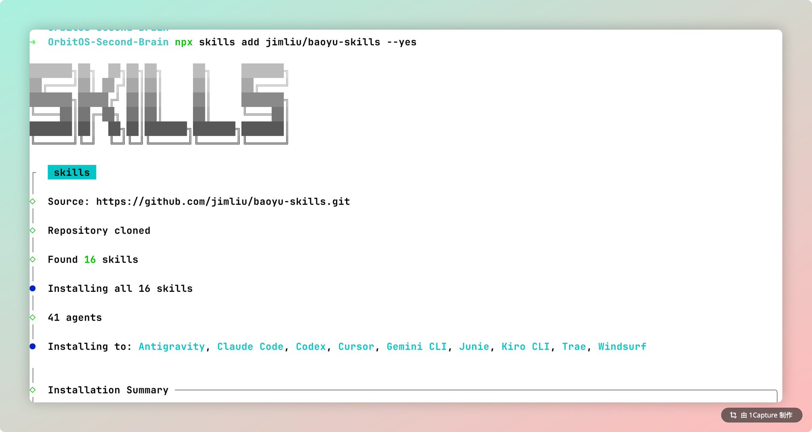

等几秒钟，装完了。16 个 skill 一次性全装上，包括我们要用的画图技能。

你可以打开 .agents/skills/ 文件夹看一眼，多了一堆 baoyu- 开头的文件夹：

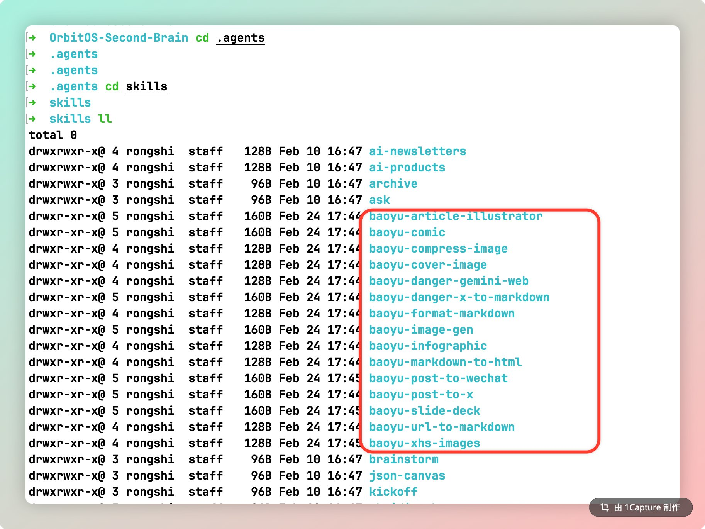

## 𝟮. 配一个图像生成的 API Key

图不是 AI 凭空画的——它需要调用图像生成 API。这步看着最长，但就是注册个账号拿把钥匙，跟注册微信差不多。

⚡ 已经有 Google Cloud API Key？直接跳到下面「把 Key 写进配置」那一步。

这里我用 Google Cloud 演示——新用户有 $300 免费赠金，90 天内随便用，不会自动续费。

💡 没有国际信用卡？也可以用通义 DashScope（手机号 + 支付宝开通，有免费额度），或者你自己的中转站 OpenAI Key（需支持 Image API）。配置方式见下方「把 Key 写进配置」。

去 [cloud.google.com](https://cloud.google.com/)，用 Gmail 登录，点「Get started for free」：

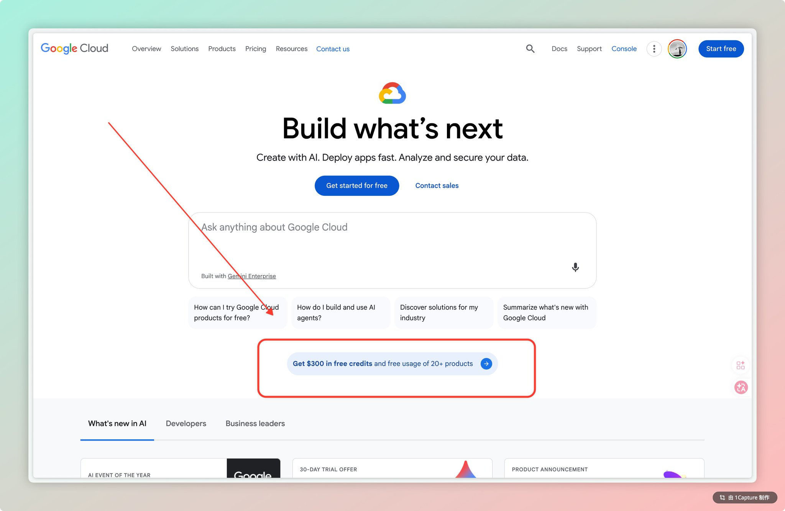

往下滚一下，能看到新用户 $300 赠金的详情：


注册两步搞定。第一步填账号信息：

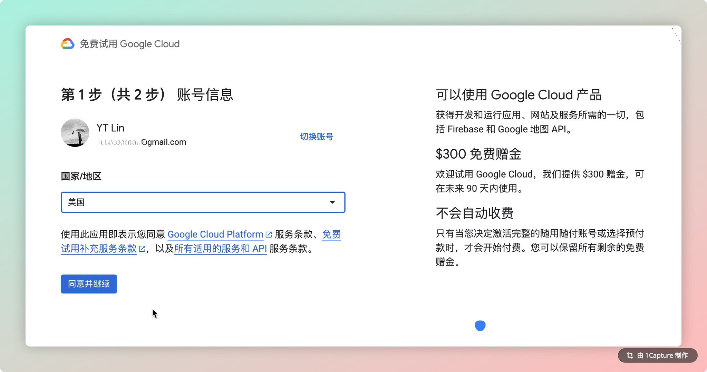

第二步绑卡验证。Visa / MasterCard / 招行信用卡都行：

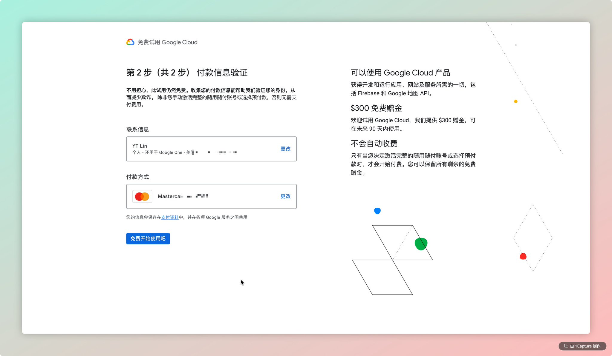

绑卡时 Google 会尝试扣一小笔钱（$1 左右）验证卡是否有效，不会真的扣款。然后会扣 $10 激活费。不用慌——开通完拿到赠金后，直接点「申请退款」把 $10 退回来：

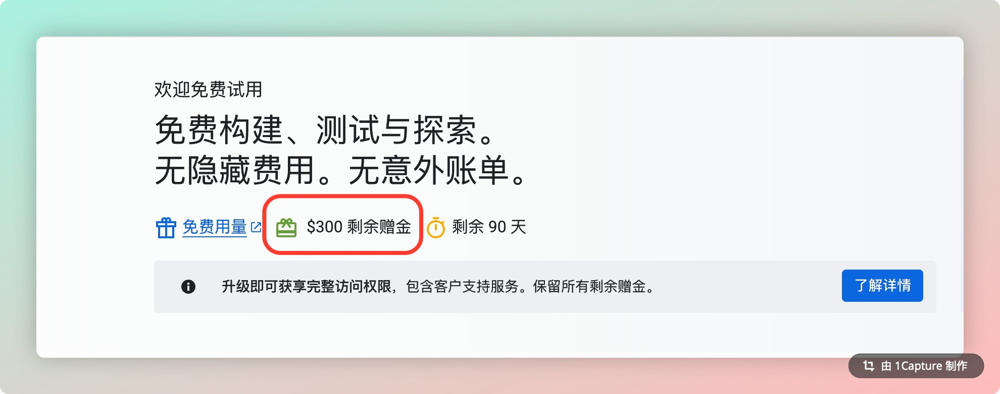

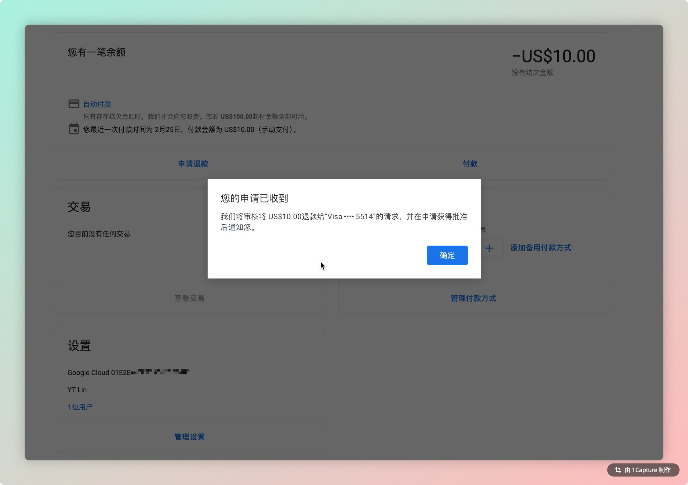

搞定。$300 赠金到手，90 天有效，生图绰绰有余。

接下来开启 Gemini API。跟着我的动图找到「API 库」，搜索「Gemini API」：

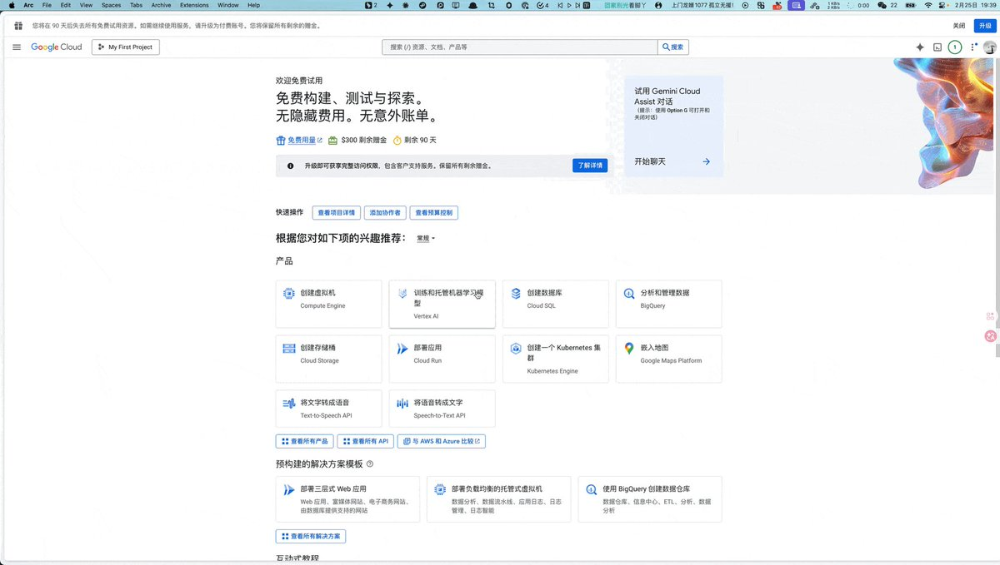

GIF

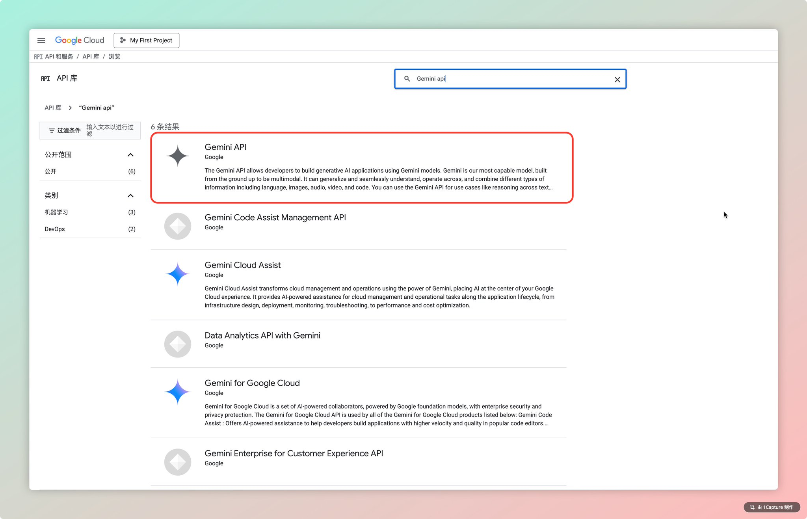

点进去，点「启用」：

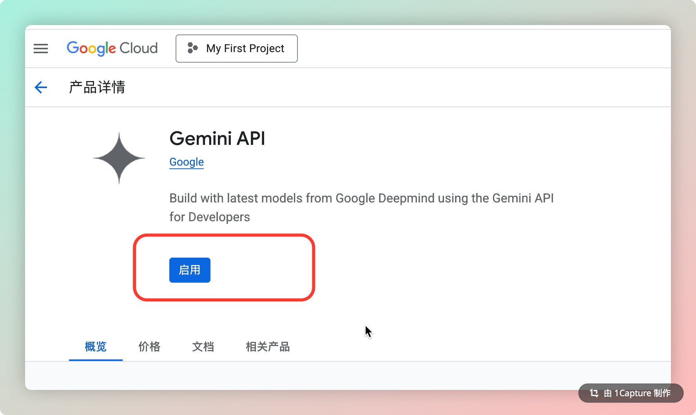

启用后，点左边侧栏的「凭证」，然后点顶部的「创建凭证」→「API 密钥」：

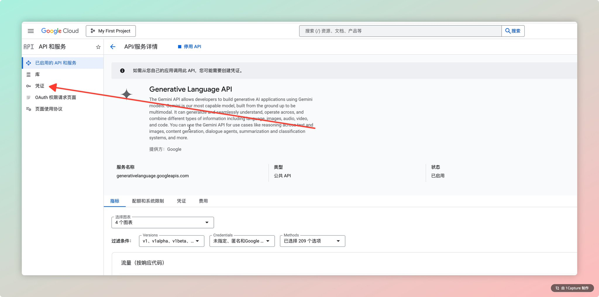

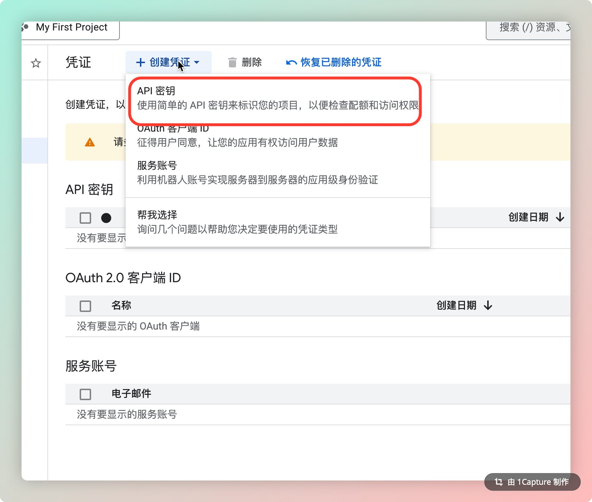

Key 生成了，复制保存好。

拿到 Key 了？接着往下。要告诉 skill 去哪里找它。

回到终端（刚才装 skill 的那个窗口还开着就行），先建个文件夹，再把 Key 存进去：

```Bash
mkdir -p ~/.baoyu-skills

```

然后把 Key 写进配置文件。下面三选一，看你用的是哪个：

Google Cloud：

```Bash
echo 'GOOGLE_API_KEY=你刚复制的Key' > ~/.baoyu-skills/.env

```

通义 DashScope：

```Bash
echo 'DASHSCOPE_API_KEY=你刚复制的Key' > ~/.baoyu-skills/.env

```

中转站 OpenAI：

```Bash
echo 'OPENAI_API_KEY=你的Key\nOPENAI_BASE_URL=https://你的中转站地址' > ~/.baoyu-skills/.env

```

存好之后验证一下，看到你的 Key 就说明配好了：

```Bash
cat ~/.baoyu-skills/.env

```

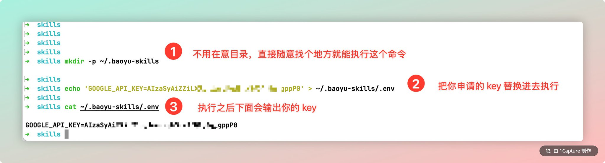

搞定，可以开始生成了。

## 𝟯. 一句话让 AI 画图

终于到了最爽的部分。打开 Obsidian，进 AI 面板，把你想配图的内容丢给它：

/baoyu-cover-image 20_项目/Obsidian-X文章.md

AI 会先读你的内容，然后问你一些偏好——要不要加水印、喜欢什么配色和渲染风格。你可以自己选，也可以全部选「自动推荐」，交给 AI 决定。

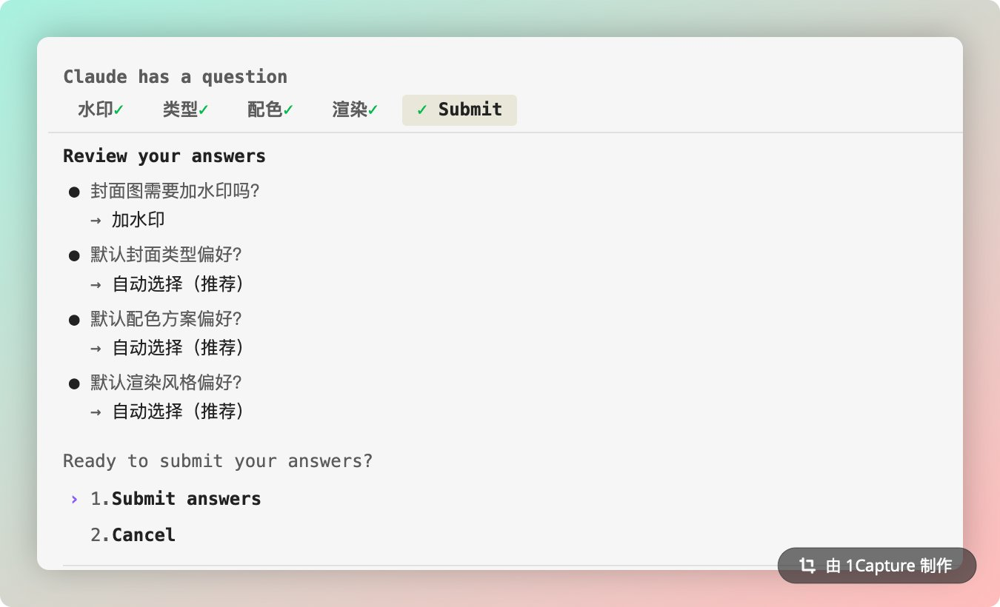

然后等几秒钟……AI 在后台分析内容、选风格、生成提示词、调 API 画图，整个过程自动完成：

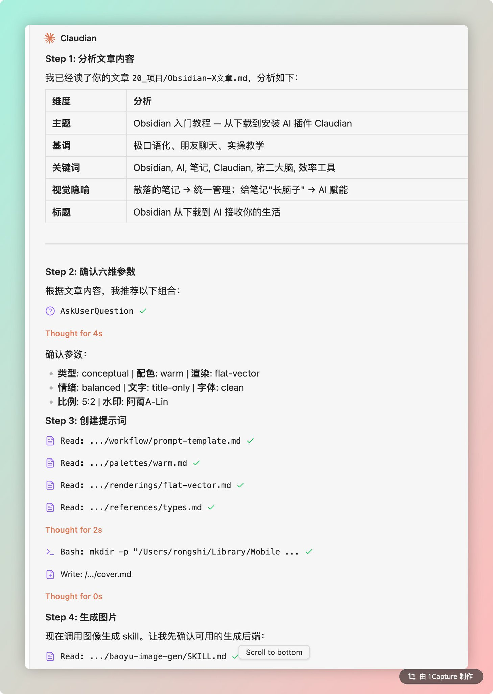

出来了：

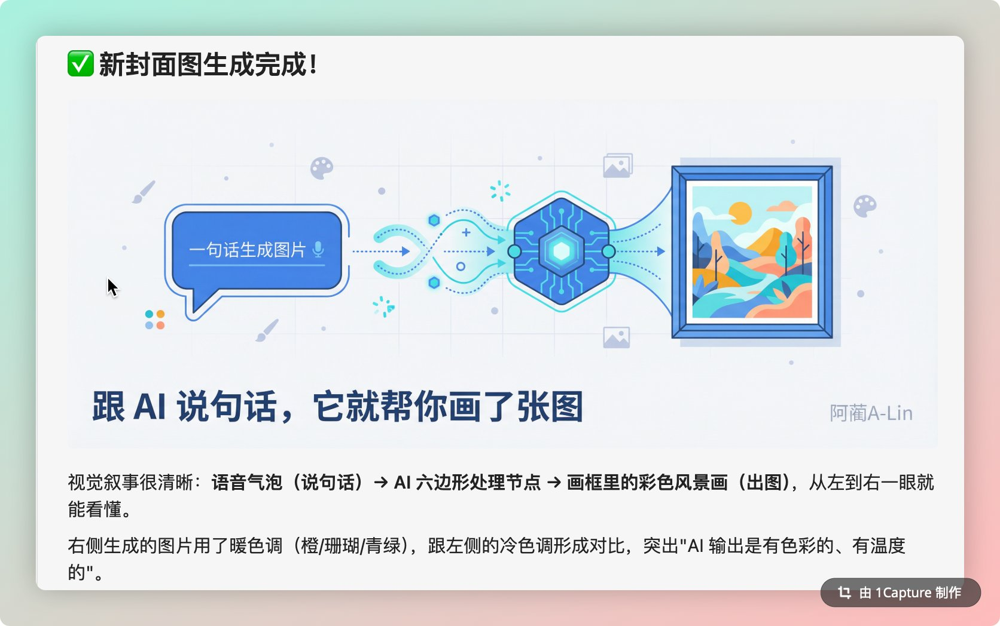

一张跟内容匹配的图，直接生成在目录里。从说一句话到拿到图，不到一分钟。

好奇它怎么知道该画什么？其实 skill 就是一份提示词文件（SKILL.md），告诉 AI 遇到这个指令该干嘛——读内容、选风格、写描述、调 API 画图。你上一篇看到的 /start-my-day、/kickoff 也是同样的原理。

## 𝟰. 这只是一个 skill

今天装的技能包里不只有画图——打开 .agents/skills/ 翻翻看，信息图、幻灯片、小红书卡片、漫画……十几个 skill，全都是一句话触发。自己玩玩看。

想看哪个 skill 的详细教程？评论区告诉我，票高的先写 👇

就这样，两件事搞定了：

① 给 AI 装了个画图技能 ② 跟它说句话，图就出来了

发帖配图、笔记封面、教程插图……以后都不用自己画了。

---

> 来源：飞书 · AI Spark 知识库 ｜ 原文（最新版）：<https://lcnniolukk80.feishu.cn/wiki/TjaTwAZdHiZTSykP2SncP2y3nDf> ｜ 归档：2026-06-04
