# kimi K2.5的发布，让Remotion制作视频的能力无限放大

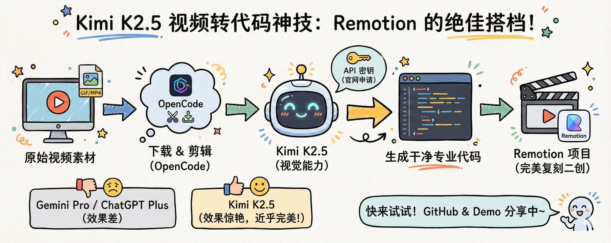

标题是我亲自实践后得出的结论，看看会有多少人来喷我，当然了我本身也没做过视频，有些场景可能确实很难复现出来，但是我短短几天的实践，它确实太强大了，至于放大的程度我相信会得到大家的验证。

昨天Kimi 发布了最新的K2.5，我在听杨植麟视频的时候，意外发现了一个很重要的点，K2.5通过视觉能力，录个屏给它，它就会用干净、专业的代码把我们上传的视频从头到尾的复现出来。这不简直就是给remotion 制造短视频提供了绝佳的demo例子嘛，这样我们就可以二创别人的视频风格或者复刻别人视频的某一个精彩画面。

记住了我没写一行代码哟。

下面这个视频就是我复刻一张GIF图片加一个视频的结合体。我只是随便凑起来的。当然里面肯定有一些瑕疵，效果出来后我就没去调整里面的细微差异了。你往下看就知道我对两个例子改了什么。

0:00 / 0:22

因为我一直使用的是OpenCode客户端。之前的文章也详细介绍过，关于如何下载视频，剪辑视频，这里我就不过多的进行介绍了。

剪辑出视频之后再让kimi的k2.5 给我们把视频用代码复刻一下，再把代码结合remotion让AI生成我们想要的场景就可以了。

那接下来我就来试试，K 2.5到底行不行？因为我前两天刚好用Gemini Pro、ChatGPT Plus试过视频来转代码的功能，效果都很差，也可能是我姿势调整的不对？

所以对这个功能非常期待。真巧不巧Kimi就来了。大半夜的我也必须得试试。下面先是我在OpenCode中配置Kimi的API的过程，大部分可以忽略。直接到下一节。

## 上菜

先打开OpenCode 客户端，直接在聊天对话窗口里面输入/model，或者使用下图中的快捷键。

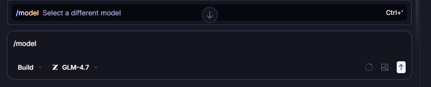

然后会弹出如下图所示的窗体

在弹窗中点击连接提供商

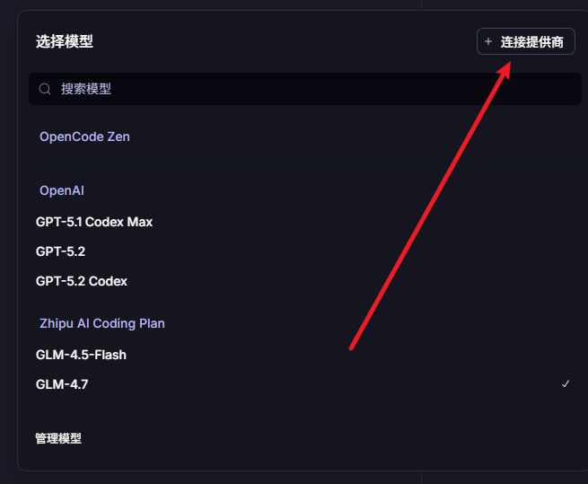

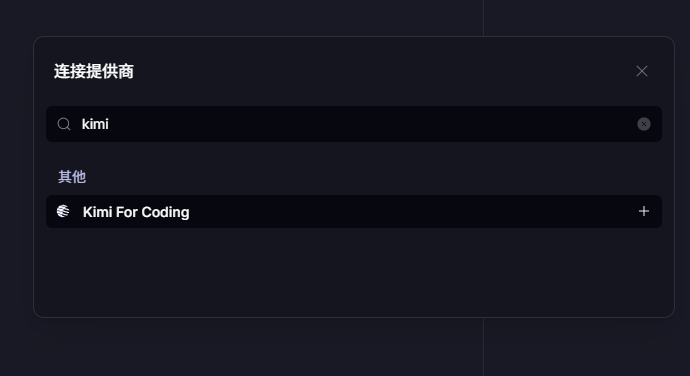

输入kimi，然后就输入API密钥了。

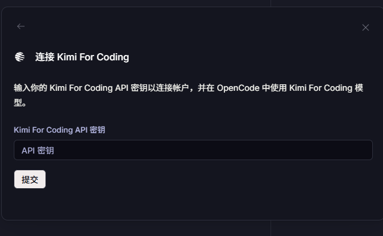

这个时候只需要去官网进行充钱申请就可以了。[https://www.kimi.com/](https://www.kimi.com/)

我看他有个7天试用包五元钱。但是记得要去取消自动续费。

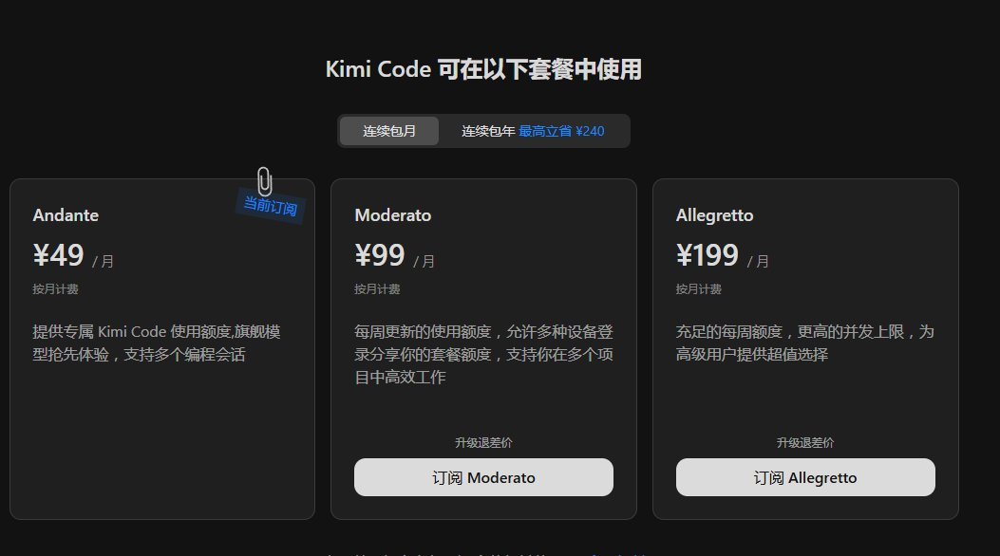

再到控制台[https://www.kimi.com/code/console](https://www.kimi.com/code/console) 进行新增API Key就可以使用了。

然后将API 密钥输入到OpenCode中，就会出现如下图所示的弹窗。

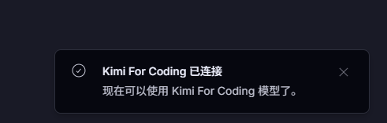

再去看模型有没有了，好家伙完蛋了。还没跟着更新。没关系去官网看看。

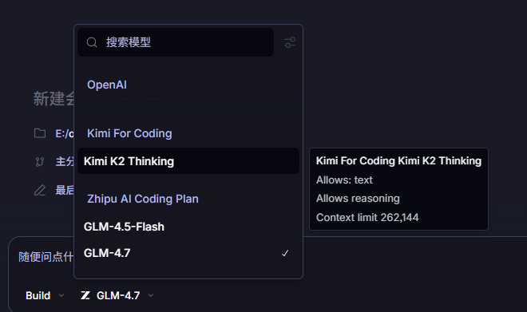

官网靠谱可以有的，等OpenCode对接后再来直接尝试。

## 第一个gif图片复刻

GIF

上面这个其实是一个GIF图片，因为Kimi官网是不支持上传GIF的，主要是我上传失败了。所以我把它转换成mp4再进行上传。

0:01 / 0:18

看上面视频代码出来了，也预览了，其实效果可以说是完美复刻了，你们看看有瑕疵吗？可能有点但简直一模一样吧。

接下来干嘛，复制上面的代码，加上你想要的效果给你的remotion 项目，去复刻这个场景就完事了。

我的提示词很简单

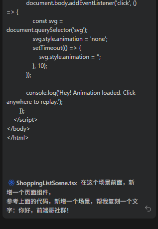

回读才发现我的提示词写的漂了一点，但是没影响我的效果

## 第二个短视频

我用OpenCode下载了一个推特视频

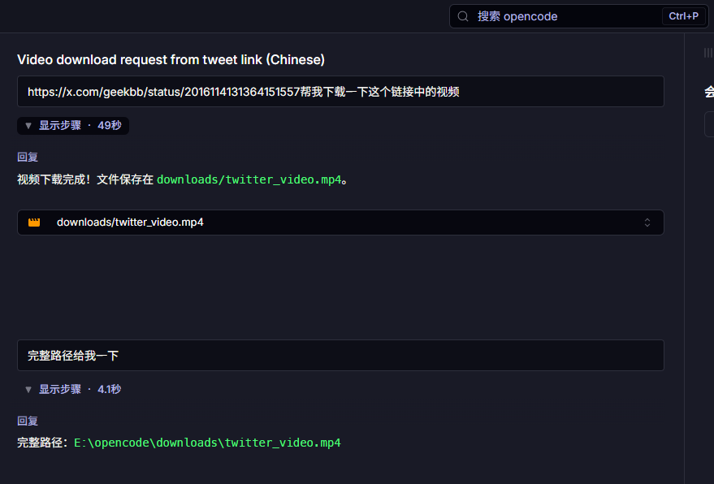

这个是视频直接丢给Kimi,然后叫它给我使用网页复刻视频。

0:00 / 0:19

同样的复制代码给我的remotion

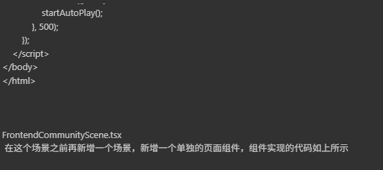

## 第三个短视频

0:13 / 0:39

实在想睡觉了，明天有时间再来复刻吧。

## ## 最后

如果你跟我着我操作，是绝对可以复刻出你自己的视频的。如果你有问题也可以留言，我给你看看能不能解决你的问题，或者我直接把我的remotion的demo 发给你。不过我也可以留到在github上，看有没有必要吧。[https://github.com/aehyok/remotion](https://github.com/aehyok/remotion)

---

> 来源：飞书 · AI Spark 知识库 ｜ 原文（最新版）：<https://lcnniolukk80.feishu.cn/wiki/ZO7cwdXgRi6zhmkLrhQc3gV2nob> ｜ 归档：2026-06-04
