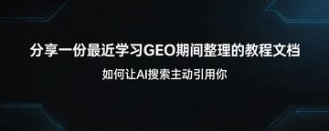
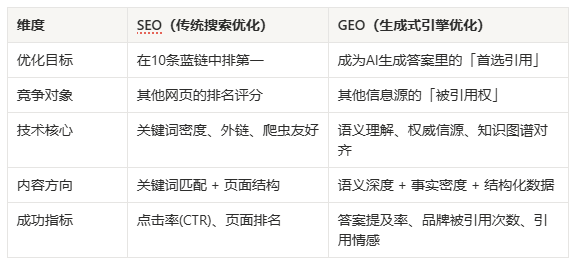
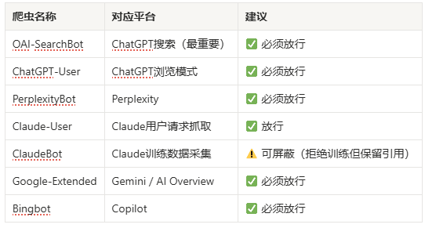
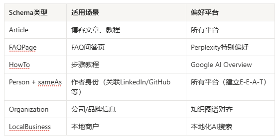
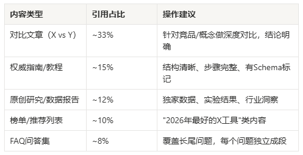
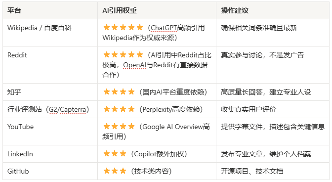
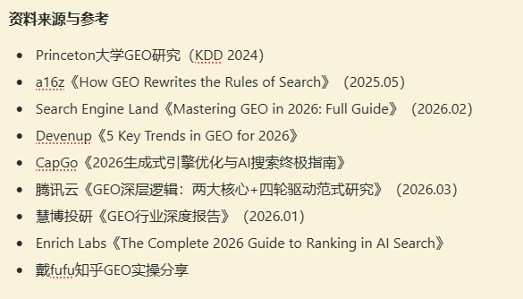

# 分享一份最近学习GEO期间整理的教程文档（如何让AI搜索主动引用你）



昨天看到国内315晚会曝光了AI大模型被投毒的产业链，其实GEO和SEO本身都是获取流量的方式，只不过现在没有SEO那么完善，所以容易发生一颗老鼠屎坏了一锅粥的情况。

刚好最近在学习关于SEO和GEO的营销策略，基于之前看的内容整理分享一份面向**内容创作者**、**个人IP**和**中小品牌**的GEO科普和基础实践指南，希望对大家了解GEO有所有帮助。

# 一、什么是GEO？——从「争排名」到「成为答案」

## 1.1 GEO的定义

GEO（Generative Engine Optimization，也叫生成式引擎优化）是一种针对AI搜索引擎的内容优化策略。核心目标不是让你的网页排名靠前，而是**让AI在回答用户问题时，直接引用你的内容、提及你的品牌**。

## 1.2 为什么要做GEO

- AI搜索引用的流量在近两年呈**爆发式增长**，传统搜索点击率因AI Overview出现了**显著下降**
- 超过50%的移动端查询在搜索结果页即告结束（零点击搜索），用户直接从AI摘要获取答案
- 中国GEO市场规模正在**快速扩张**，据慧博投研报告，预计2030年全球市场规模有望破千亿美元
- **关键发现：** 据eMarketer研究，被AI引用的来源中，绝大多数并不在Google传统搜索前10——**SEO做得好≠AI会引用你**

## 1.3 GEO vs SEO：核心区别



GEO和SEO是否互斥：**不互斥，SEO是GEO的基础，两者协同效果最佳。**

## 1.4 AI搜索引擎的工作原理

所有AI搜索引擎的核心流程：

1. **用户提问** → AI拆解问题为多个子查询
2. **检索阶段（RAG）** → 从索引库中检索相关网页/段落
3. **筛选阶段** → 基于语义向量匹配，选择最优段落
4. **生成阶段** → 组织成连贯回答，标注引用来源

**在这其中，你能干预：**

- 让AI搜到你（被索引）
- 让AI选中你的段落（结构清晰、语义匹配）
- 让AI准确转述你（表述精确、段落自包含）
- 让AI敢引用你（有权威背书、多源共识）

# 二、技术基建

技术基建是性价比比较高的一步，但前提是你要有独立网站类似的产品，如果没有产品，可以直接看2.5适合创作者的【无网站场景】替代方案

## 2.1 放行AI爬虫（robots.txt配置）

在网站根目录的 robots.txt 中，确保以下爬虫不被屏蔽：



**实操示例（robots.txt）：**

```JavaScript
User-agent: OAI-SearchBot

Allow: /


User-agent: ChatGPT-User

Allow: /


User-agent: PerplexityBot

Allow: /


User-agent: Claude-User

Allow: /


User-agent: ClaudeBot

Disallow: /


User-agent: Google-Extended

Allow: /


```

## 2.2 部署llms.txt——给AI的「VIP菜单」

这是2024年末推出的新标准，放在网站根目录，用Markdown格式告诉AI你是谁、有什么核心内容：

```JavaScript
# 你的品牌名

> 一句话描述你是谁、做什么。


## 核心内容

- [产品/服务A](URL): 简要描述

- [产品/服务B](URL): 简要描述


## 重要文档

- [核心教程](URL): 描述

- [案例研究](URL): 描述


```

如果有完整文档体系，做一个llms-full.txt，把所有核心文档合并成一个Markdown文件，因为Claude等模型偏好对统一数据集推理。

## 2.3 添加Schema标记（JSON-LD结构化数据）

Schema是你和AI的「握手协议」，**有Schema标记的内容，AI可见度提高30-40%。**

**优先添加的Schema类型：**



**FAQPage Schema示例：**

```JavaScript
{

  "@context": "https://schema.org",

  "@type": "FAQPage",

  "mainEntity": [{

    "@type": "Question",

    "name": "什么是GEO？",

    "acceptedAnswer": {

      "@type": "Answer",

      "text": "GEO是生成式引擎优化，指针对AI搜索引擎优化内容，让品牌被AI回答时引用。"

    }

  }]

}


```

## 2.4 确保SSR渲染 + 加载速度

- 关键内容必须在初始HTML中直接交付，AI爬虫不擅长处理复杂的客户端JavaScript渲染
- 页面加载目标控制在**2秒以内**（Copilot有明确阈值）
- 重要内容不要藏在JS渲染、Tab切换、手风琴折叠的交互组件里

## 2.5 无独立网站的替代方案（自媒体创作者必看）

如果你是自媒体创作者，没有独立网站，技术基建的重点转移到：

1. **选择AI友好的发布平台**：知乎专栏、Medium、Substack、GitHub Pages等自带结构化数据
2. **建立「实体身份」**：确保你的名字在多个权威平台一致出现（知乎、LinkedIn、GitHub、即刻等）
3. **利用第三方平台的Schema**：在知乎回答时使用清晰的Q&A格式，平台自带FAQPage结构
4. **PDF策略**：把核心内容做成公开可下载的文件（Perplexity高度偏好引用PDF）

# 三、内容优化——GEO的核心战场

Princeton大学GEO研究（KDD 2024）关键发现：引用权威来源（+40%）、加入统计数据（+37%）、专家引言（+30%）的提升最大。关键词堆砌反而降低引用率10%。

## 3.1 内容写作的四条铁律

**铁律一：结论前置**

- **44.2%的引用来自文章前1/3**
- 每个重要页面顶部放50-100字的TL;DR（太长不看版），直接给结论
- 每个章节的第一句话就是答案
- AI提取的最优段落长度是**40-60词**，一个段落只讲一个观点

**好的写法：**

> GEO（生成式引擎优化）是针对AI搜索引擎优化内容的策略。与传统SEO不同，GEO的目标是让ChatGPT、Perplexity等AI在回答用户问题时直接引用你的内容。

**差的写法：**

> 在当今数字化时代，随着AI技术的快速发展，搜索方式正在发生深刻变化……（300字后才说什么是GEO）

**铁律二：用问题做标题**

- **78.4%与问题相关的引用来自标题本身**
- 把H2/H3写成用户会问AI的问题："GEO是什么？" "GEO和SEO有什么区别？" "怎么让ChatGPT引用我的内容？"
- 这直接匹配AI拆解用户问题的方式

**铁律三：段落自包含**

- **每个段落脱离上下文也能被AI直接引用**
- **不要写："如上所述""正如前文提到"——AI抽取的是段落级别的内容块，不是整篇文章**
- **每个段落都是一个独立的「答案单元」**

**铁律四：用确定性语言**

- 使用"X是""X指的是"这类确定性表述，被引用概率是模糊表述的**2倍**
- 保持「专业分析师风格」——事实和解读混合，而不是纯推销或纯学术
- **避免**："也许""可能""据说"等弱化表达

## 3.2 最容易被AI引用的内容类型排名



**不会被引用的内容：** 无结构的通用博文、营销空话、付费墙内容、没有日期和作者的内容、纯关键词堆砌。

## 3.3 GEO内容优化九大策略（Princeton研究验证）

1. **引用权威来源**（+40%）——引用学术论文、官方报告、行业白皮书
2. **加入统计数据**（+37%）——具体数字、百分比、时间节点
3. **添加专家引言**（+30%）——引用具名专家的原话或观点
4. **使用确定性语言**（+25%）——"X是"代替"X可能是"
5. **内容结构化**（+20%）——清晰的标题层级、列表、表格
6. **增加内容全面性**（+18%）——覆盖话题的多个维度和子问题
7. **提供原创洞察**（+15%）——独特且权威的观点，AI觉得有价值
8. **保持内容时效性**（+12%）——30天内更新的内容被引用概率高3.2倍
9. **多媒体结合**（+10%）——配合图片alt文本、视频字幕、ImageObject/VideoObject Schema

## 3.4 语义深度优化：从关键词到概念

传统SEO优化关键词，GEO优化的是**语义概念**：

- **写自包含的段落**，每段回答一个具体问题
- **覆盖语义关键词/同义词**：AI匹配的是内容价值，不是某个单词
- **建立内容集群**（Topic Cluster）：围绕一个核心主题，用多篇内容覆盖各子问题
- **交叉验证**：同一个事实在多个页面/平台出现，AI会提高信任度

# 四、平台差异化策略——不同AI搜索引擎怎么优化

各平台的搜索和偏好存在较大的差异性，盲目优化就是浪费时间，以下是主流AI搜索平台的差异化策略。

## 4.1 ChatGPT（含ChatGPT Search）

- **搜索后端：** Bing索引
- **核心发现：** 内容结构越像ChatGPT的回答风格，越可能被引用——内容结构匹配度的权重**远超域名权重**
- **实操要点：**观察ChatGPT怎么回答某类问题，模仿那个结构写内容 30天内更新的内容被引用概率高3.2倍——竞争性内容至少月更一次 在Bing Webmaster Tools提交网站

## 4.2 Perplexity

- **搜索后端：** 自有索引 + Google索引
- **差异化杠杆：** FAQPage Schema（JSON-LD）和公开PDF
- **实操要点：**把白皮书/研究报告做成公开可下载的PDF，Perplexity优先引用 偏好高频发布和「原子化」的自包含段落 FAQ格式的内容特别受偏好

## 4.3 Google Gemini / AI Overview

- **搜索后端：** Google索引 + Knowledge Graph
- **独特机制：** 「扇出查询」——自动把用户问题拆成多个子问题分别搜索
- **实操要点：**围绕核心主题建设内容集群，用FAQ覆盖各种子问题 Schema标记是最大杠杆（+30-40%） 持续维护Google Business Profile（本地化场景）

## 4.4 Claude

- **搜索后端：** Brave Search
- **特点：** 极度选择性，处理大量内容但引用率极低，只选最准确的来源
- **实操要点：**先去 [search.brave.com](http://search.brave.com/) 确认你的内容能被搜到 最大化事实密度：具体数字、具名来源、带日期的统计 准确性 > 一切

## 4.5 Copilot（Microsoft）

- **搜索后端：** 完全依赖Bing索引
- **额外加权：** LinkedIn和GitHub上的内容
- **实操要点：**确保在Bing Webmaster Tools提交站点 使用IndexNow协议加快索引 维护好LinkedIn个人/公司主页

## 4.6 DeepSeek / 豆包等国内AI平台

- **搜索后端：** 各平台自有爬虫 + 国内搜索引擎索引
- **实操要点：**在知乎、CSDN、掘金等国内权威平台建立内容矩阵 百度站长平台提交网站 中文内容的语义深度和专业性是核心竞争力

## 4.7 Grok（X/Twitter）

- **独特之处：** 处理X（Twitter）的全量数据流
- **实操要点：**回复质量和深度占帖子总分的75%以上，回复权重是点赞的50倍 **注意：** 主帖放外链会让分数降低约50%，外链应该只放在回复中

# 五、第三方共识层——最容易被忽视的杠杆

说明：品牌通过第三方权威来源被AI引用的概率远高于自有网站。所以只优化自己的网站远远不够，你需要在多个权威平台建立「多源共识」

## 5.1 核心第三方平台及优先级



## 5.2 Reddit/知乎的GEO优化

- **不要发广告**，而是在相关社区/话题真实参与讨论
- 让品牌自然出现在高karma/高赞线程中
- OpenAI与Reddit有直接数据合作，社区共识是ChatGPT引用的主要信号之一
- 知乎同理——高赞、高收藏的专业回答是国内AI平台的重要数据源

## 5.3 「多源共识」策略

同一个事实/品牌信息出现在3个以上独立权威来源，AI会显著提高引用信任度：

1. 你的官网/博客（第一方）
2. 知乎/Reddit专业回答（第三方UGC）
3. 行业媒体报道或评测（第三方权威）
4. YouTube视频/播客（多媒体验证）

# 六、2026年GEO五大趋势

1. **语义深度 > 关键词密度**：AI从「关键词匹配」转向「概念理解」，写自包含段落回答具体问题
2. **实体权威成为核心**：不是优化排名，而是建立「实体权威」，通过Schema + sameAs建立跨平台身份
3. **多模态优化崛起**：AI开始理解视频、音频、图片，添加字幕、alt文本、ImageObject/VideoObject Schema
4. **个性化与本地化**：AI根据用户画像和位置定制答案，本地化内容 + LocalBusiness Schema变得关键
5. **程序化GEO**：批量生成针对长尾问题优化的页面，覆盖AI搜索中10词平均长度的详细查询

# 七、常见问题

## GEO会取代SEO吗？

不会。传统搜索流量仍占绝对主导地位，SEO是GEO的基础。两者不是有你没我的关系，最佳策略是协同优化。SEO做好了的内容，在GEO上也更容易被引用。

## 没有独立网站能做GEO吗？

可以。通过知乎、Medium、Substack等平台发布结构化内容，在Reddit等社区建立专业影响力，通过YouTube视频提供多媒体内容——这些都是有效的GEO策略。

## GEO多久能看到效果？

技术基建（robots.txt、Schema等）可以立即生效。内容优化通常2-4周开始看到引用率变化。第三方共识层的建设是长期工程，3-6个月逐步见效。

## 中文内容做GEO有用吗？

非常有用。DeepSeek、豆包、Kimi等国内AI平台大量依赖中文内容源。知乎、CSDN等平台是关键阵地。同时，Google Gemini和ChatGPT也在持续提升中文内容的理解和引用能力。

## GEO和AEO（Answer Engine Optimization）是一回事吗？

本质上是同一件事的不同叫法。GEO侧重「生成式引擎」，AEO侧重「答案引擎」。核心策略完全一致：让AI在回答问题时引用你的内容。

# 说在最后

315这次的曝光让更多人知道了GEO，但我相信GEO不会因此消亡，而是会更快的像SEO一样完善起来。

希望这篇文档可以帮助大家更清晰的了解GEO，如果有在实践中的GEO大佬，也欢迎补充、交流~

以下为这篇文档引用参考的资料，都写的很好，大家也可以自行查看：



---

> 来源：飞书 · AI Spark 知识库 ｜ 原文（最新版）：<https://lcnniolukk80.feishu.cn/wiki/BdgMwkUxTiByCWkPEhlcwfaWnEc> ｜ 归档：2026-06-04
