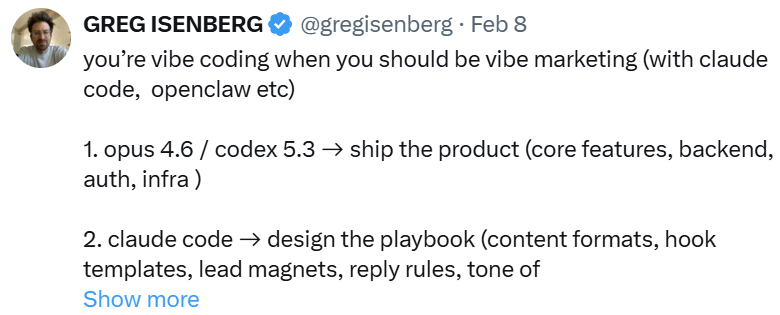
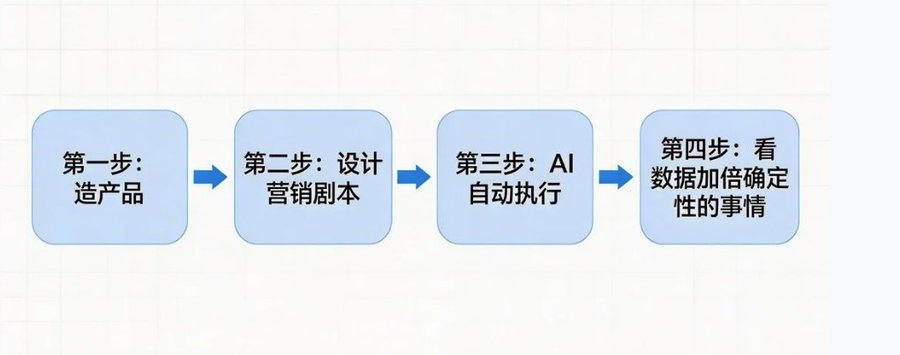
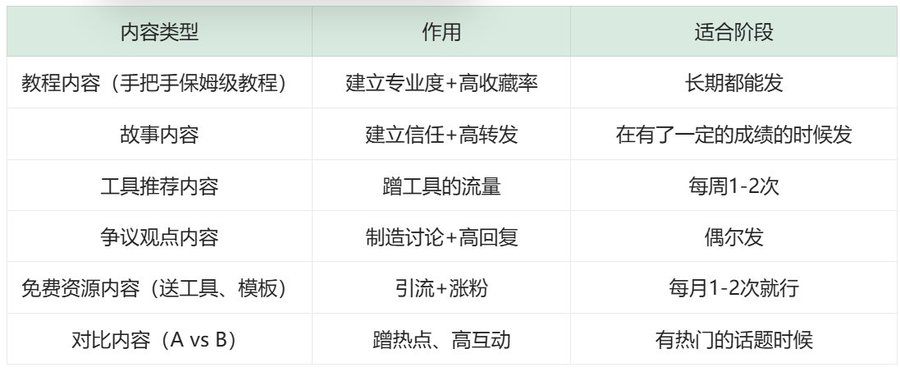
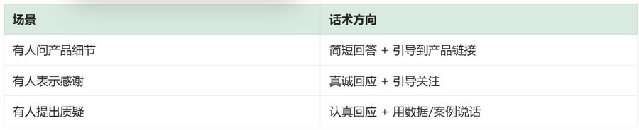
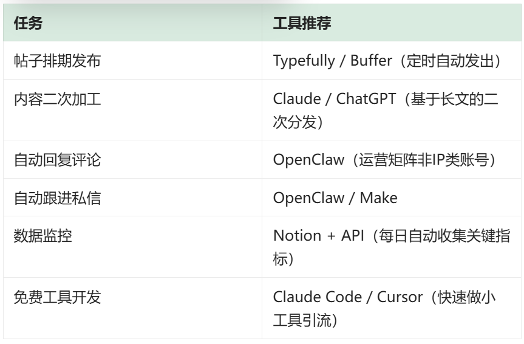

# 别天天vibe coding了，送你一份vibe marketing的实践指南

# 快速说清楚 vibe marketing是什么？

**一句话介绍就是：用AI来设计、执行并优化你的营销，就像你用AI写代码一样**

前段时间看硅谷创业大佬Greg Isenberg发了一条帖子，很多人转发：

> *"You're vibe coding when you should be vibe marketing."*
> 
> *（你还在用AI写代码，其实你该用AI做营销了。）*

做过产品的人基本都会踩过一个坑，就是把80%甚至更多的时间花在打磨产品上，觉得"做好了自然就会有人来"。结果往往却是产品上线了，内容发了、广告也投了，但是没什么大的水花。

现在AI把写代码的门槛降的很低，你三天做出来的产品别人几天也能搞出一个差不多的。但是会用AI做营销的人，现在极少。Greg的原话是：**媒体是当下最被低估的资产，不是代码。**

所以今天这篇文章，不讲Vibe coding，而是基于Greg的结构框架，再结合自己AI创业几年以来从0到1的经验，分享一份可以参考拿来用的 **vibe marketing 实践手册**。

# 第一步：用AI把产品做出来（但别在这里停太久）

**工具：Claude Code/Cursor**

这一步相信很多创业者、独立开发者已经非常熟了：用AI模型完成核心功能的开发：后端、认证、基础架构

但这里面有一个很大的陷阱：第一步是多巴胺，后面几步才是真正的生意。

因为写代码有即时的反馈—比如跑通一个功能、修好一个bug带来的爽感是实实在在的。但是营销的反馈周期更长，而且很模糊，所以大多数技术出身的创始人会不自觉地躲回到自己的代码里。

这里我的建议是：给自己定一个硬性的规则—产品开发的时间**不超过总时间的40%**。MVP能跑就行，别追求完美，追求完美会让你陷入到无尽的情绪当中。剩下的60%留给下面的几步。

注意：如果你发现你已经在第一步上花的时间超过了两周，请马上停下来，因为你不是在做产品，而是在逃避。

# 第二步：用AI设计一套营销剧本

**工具：Claude、ChatGPT、gemini、deepseek**

这一步是整个系统的大脑，你不是自己拍脑袋去做营销，而是在AI的协作下完成一整套的方案。

具体要设计的6个模块，以下六个模块都可以结合AI去策划内容，具体的Prompt需要结合自己的背景和业务测试优化

## 1、内容格式库（发什么类型的内容）

## 2、Hook模板库（开头怎么写才有人看）

内容的开头决定了80%的点击率。这是我测试下来数据最好的几种句式：

- 送你一份xxxx，别再XXX了
- 我用 [工具] 在 [时间] 做到了 [结果]，方法全公开：
- 大多数人在 [领域] 犯了这个错误……
- 别再用 [旧方法] 了。试试这个：
- [数字] 个AI工具，帮我省了 [结果]：
- 如果你正在做 [事情]，这篇能帮你少走3个月弯路。

## 3、引流钩子（用免费的高价值内容来换取关注或邮箱）

-  免费AI知识库资料、notion模板等
-  PDF指南（比如"10个AI工具搭配方案"）
-  免费小工具（用AI快速开发一个解决小痛点的工具）
- 视频教程（我之前验证过的爆款形式！）

## 4、回复话术模板（设定3种场景的回复模板）

## 5、品牌调性文档

一句话定义你的风格。比如：

> **"一个AI创业者的真实记录，只分享0到1过程中真正有用的东西。"**

## 6、每周实验清单

每周测试1-2个新变量：新话题、新格式、新发布时间、新Hook句式。快速试错，用数据说话。

# 第三步：让AI 24/7自动执行你的剧本

**工具：OpenClaw / Typefully / Buffer / Make / Zapier（工具选择因人而异）**

剧本有了，接下来让机器帮你跑。这一步是把你从"一个人干"变成"管一个AI营销团队"。

可以自动化的任务清单：

**建议**：不要一次全部自动化。先从**帖子排期 + 内容二次加工**开始，这两个投入产出比最高。跑顺了再加回复和跟进。

# 第四步：看数据，加倍押注已经有确定性结果的事情

**这一步是整个系统的眼睛。** 没有数据，一切都是在盲猜。

重点看这5个指标：

每周复盘模板（直接用）：

> **本周数据回顾**
> 
> 发了几条内容？
> 
> 数据最好的是哪条？为什么？（话题/格式/时间/Hook）
> 
> 数据最差的是哪条？为什么？
> 
> 下周要加倍做的：
> 
> 下周要停止做的：
> 
> 下周要测试的新变量：

## 最后想聊两句

写代码的快感是即时的——跑通了一个功能，那个爽感是实实在在的。但营销的反馈是延迟的，你发了一条内容可能三天后才起量，大部分情况甚至根本不起量。

这种延迟和不确定性，让大多数技术出身的创业者本能地逃回代码里，AI编程出来后，vibe coding就有了“成瘾性”。

但大多数人不知道的是：**当所有人都在 Vibe Coding 的时候，会 Vibe Marketing 的人才是稀缺的。**

AI 拉平了代码的门槛，但同时也给了你一个前所未有的机会——**用AI做营销杠杆，让一个人拥有一支营销团队的战斗力。**

不要只在"造产品"这个舒适区里打转。走出去，让世界看到你做的东西。

好了，先写到这里，喜欢的话不妨点个关注，**也欢迎各位大佬补充**，非常感谢您的观看~

---

> 来源：飞书 · AI Spark 知识库 ｜ 原文（最新版）：<https://lcnniolukk80.feishu.cn/wiki/URuKwLeOtiIgNVkkO7rc2h1pnPf> ｜ 归档：2026-06-04
