# 别抄作业，先搭好你的 AI 写作闭环

前段时间，dont 哥、宝玉等大佬都公开了自己的工作流。我看得热血澎湃，心里直呼：这不就是“违背祖宗的决定”，把祖传秘方公开了吗？

当时我特别笃定，只要用上他们的工作流，我也能日更十篇。就这样，“搭建工作流”的种子被我种下了。

临近春节放假，我终于有了更多时间折腾。

“中年男人啥都不爱，就爱折腾 AI。别人说是性欲低，我说他不懂 AI 的魅力。“

「张大婶：你看看那个人，每天都对着个电脑，时而傻笑时而不说话，敲几下键盘就一动不动盯着屏幕。」「李阿姨：是啊，最近几天都这样，是不是得了什么抑郁症啊？最近年轻人压力很大啊。」「王伯母：你们不知道吗？听说那个人最近染上了 AI。」

我自作聪明，把 dont 哥、宝玉老师的文章直接一起丢给 AI，说：

“总结他们工作流的优点，给我搭建一个我的工作流。”

看着 AI 一步步拆解内容、创建文件夹，我的期待值越来越高。最后确实出来了一堆工作目录，结构清晰、命名高级，仿佛我已经看到了自己未来大 V 的模样。

但理想和现实差距很大。

我认真看了每一个 md 文件，结果是：看不懂，理解不了为什么要有这些文件，也不知道它们怎么串起来跑。整个环境就像一个“纯黑箱”。

**做完这一切后，就像 Steam、PS5 下载了一堆游戏后的空虚感突然袭来。最好玩的其实是下载，不是玩。**

我心里有个声音一直在喊：**这啥玩意，我看不懂啊！**

我不知道草稿该放哪里，不知道如何开始一篇文章，也不知道有了灵感该往哪写，更不知道写完后怎么让 AI 接手润色和调试。

我拿到了大佬们的“躯壳”，却没有自己的“灵魂”。

## 顿悟时刻：第一版只做“最小可闭环”

我辗转反侧，想了好几天。

大佬们的自动化工作流，其实是这场游戏里的顶级装备。新手一上来就穿，等级不够，当然会别扭。这也是为什么大佬们愿意公开：他们并不怕你抄走，因为真正能跑通的人，本来就会在实践中形成自己的理解。

另外一点也很重要：很多大佬是为爱发电，因为他们知道，总有人看得懂，也总有人会顿悟。

那我们应该怎么用这些大佬工作流？

答案是：**一开始先别直接用整套。**

我们可以模仿思路，但不照搬细节。

如果你总盯着“大佬一天十篇”，就很容易被心态反噬。我们不能忽视他们的长期积累：这些流程是日日夜夜打磨出来的，不是复制粘贴出来的。

所以第一步不是“搭大而全”，而是先做一个**最小可闭环**的工作流。

搭好台，才好唱戏。

## 我是怎么搭的（一步步实操）

### 第一步：先写清楚自己的真实写作习惯

我的习惯是：

- 写草稿：先把想说的全部一股脑倒出来，不分结构，不管逻辑，这一步是疯狂输出你的内容。
- 优化结构：反复看草稿，补充内容，调整结构。
- 总结全文：思考主题、提炼标题（钩子、标题党思路），继续优化结构。
- 开始配图：按标题或分段把内容喂给 Nano Banana 生成配图，抽卡，然后搭配顶部配图和分段配图。
- 发布到平台：比如 X 平台，我还要手动复制到 X Article。平时写的是 MD，还要转成 X 平台富文本（粗体、标题、图片、链接等）。

### 第二步：把习惯压缩成第一版流程

[配图 2]

> 这其实是一个非常常规、非常简单的工作流，适合每个人拿来做自己的第一版。

### 第三步：让 AI 搭个“能跑”的简版系统

这篇文章主要是聊“怎么搭建工作流”。工具上你可以用 Codex、OpenCode、Antigravity、ClaudeCode 等。当前阶段用免费版本就够了。模型能力有差异，但搭建简单工作流只要带 Agent 都能做。

我这里用 Codex 演示：

1. 打开 Codex，创建工作目录。

> 提示词：这个是我常用的写作习惯：写草稿（或者想法）->结构优化->提炼标题->文章配图->发布平台，请根据这个帮我创建一个写作工作流，并且根据不同阶段创建不同的目录。

[配图 3]

[配图 4]初步生成的文件夹目录[配图 5]

1. 刚开始一切从简，先专注创作。

- 结构优化：刚开始没有存量数据，先让 AI 每次生成 A/B 两版供选择。
- 文章配图：让 AI 只留配图位置，方便后期粘贴。
- 发布平台：让 AI 生成符合平台格式的版本，方便直接粘贴，比如 X 平台富文本。

> 提示词：“这是我首次开始搭建工作流，我需要一切从简，专注于创作，后续持续迭代。结构优化：每次根据草稿目录下的最新一篇文章，优化文章结构，生成 A/B 不同版本供我选择，等待我回答；总结全文：根据上一步选择后的版本全文生成不同风格标题，并根据需要补充或完善小标题，提供 A/B 两个方案供我选择；文章配图：根据上一步选择后的版本，留出配图位置，并写入生成配图的参考提示词，方便后期粘贴和使用 AI 生成图片；发布平台：根据最终定稿文章，生成符合 X 平台文章格式的文件供我复制粘贴。”

[配图 6]

[配图 7]

1. 针对首版结果持续对话，优化工作流，直到满意并能顺利发布。

> **记住：完成永远比完美重要。** 首次搭建只要能跑起来、能发布就够了，不必追求完全自动化。

下面是我和 Codex 的对话过程（仅供思路参考）：

1. 提示词：优化每个目录名称，让它更符合工作流定义。[配图 8][配图 9]
2. 提示词：除了 X 平台发布稿外，再生成 MD 格式文件，方便后续作为历史文章参考。[配图 10][配图 11]

## 我把流程跑了一遍（真实记录）

### 1. 把草稿放进指定目录

这篇文章我是边演示边写、边写边截图。现在我把初稿 md 文件放到 AI 指定的位置作为草稿输入。[配图 12]

### 2. 给 AI 下执行指令

[配图 13][配图 14]

### 3. 先做结构优化 A/B 选择

[配图 15]另外附上我的草稿版本：[配图 16]

> 果然还是有一点 AI 味，有些地方我甚至觉得原稿更好。但这恰恰说明了 A/B 的价值。随着不断迭代，你迟早会做出专属于自己的工作流。后面也可以继续优化成：提供 A/B 版，或者直接提供“AI+ 我手动修改后的最终版”。

这里纯演示，我直接选了 A 版。[配图 17]

#### 4. 再做标题、小标题 A/B 选择

[配图 18]

> 这里也遇到了真实问题（真·实操教程）：我本来想要“根据上一步已选版本，直接替换标题，生成两版完整文章”。但当时给出的结果只有标题选项。这个坑正好印证了我们的主题：先完成，再迭代。先记下问题，发完文章再优化规则，流程先走通。

#### 5. 检查最终可发布状态

[配图 19]最后配上图片，基本已经是可发布状态。

#### 6. 按提示词逐张生成配图

初版提示词不一定完全贴合你的审美，这恰好就是可迭代空间。你可以把每次优化后满意的提示词沉淀下来，放到专属配图提示词 md 文件里，让 AI 后续每次生成都参考它。（这其实已经是 skill 的雏形了。）

> 当然你问：能不能直接用宝玉 Skill？当然可以。但“没跑通过”和“跑通过”是两种状态。工作流本质上是一个很私人的系统。

我这里演示用 Nano Banana Pro 生成后，直接替换文章中的提示词。

[配图 20]

其他提示词我也依次生成，第一轮效果已经不错，然后替换进文章。

最终效果就是你现在看到的这篇文章。

> 从截图也能看到，我的初版内容就是边写边做。后续发布前我还会继续迭代，所以文章和截图有些出入很正常。这也侧面证明了“先跑通，再迭代”的方法是对的。

最后附上我第一次跑通后，再次发给 AI 的优化建议：

[配图 21][配图 22]

恭喜你，你已经搭好了属于自己的工作流第一版。

接下来请持续输出、持续迭代，最后你会得到一个高度定制、非常好用的个人工作流。

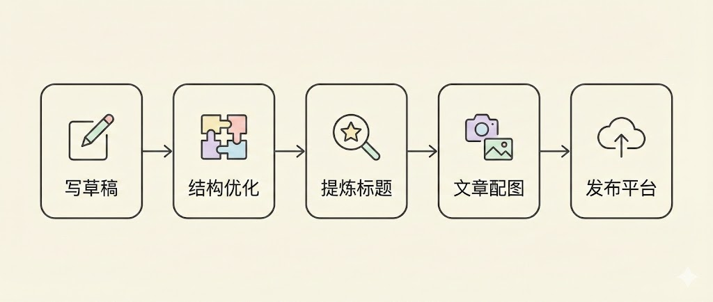

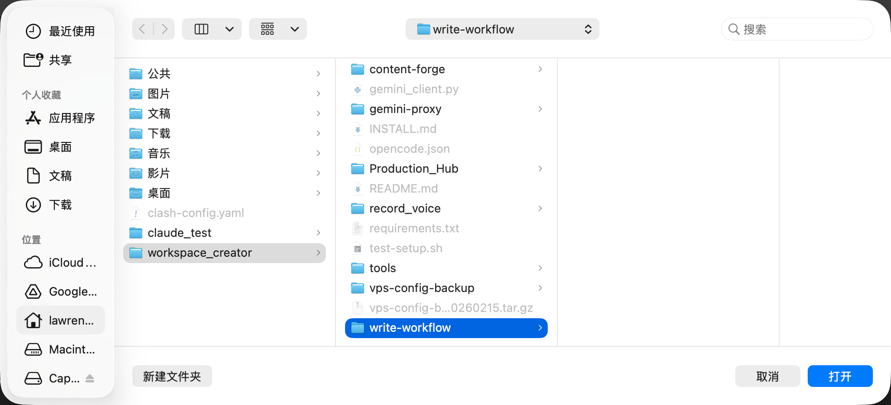

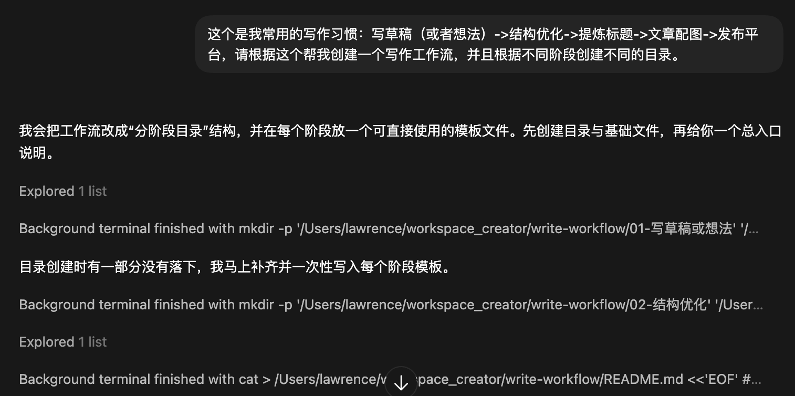

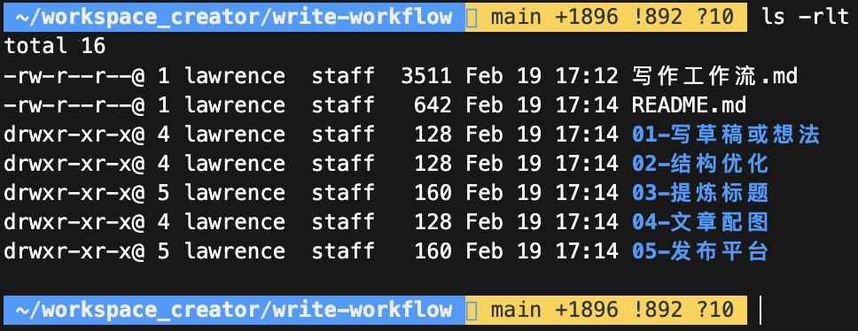

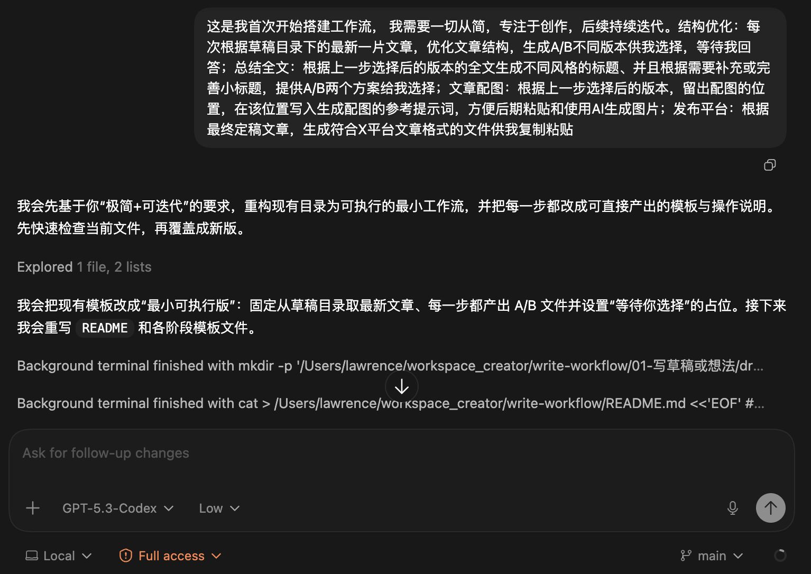

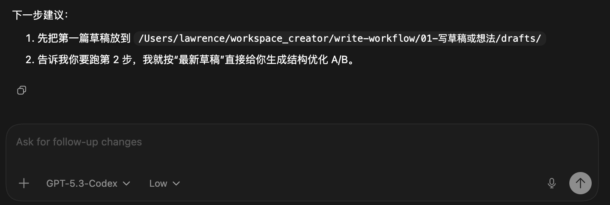

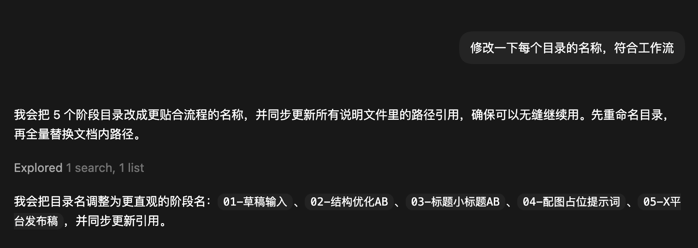

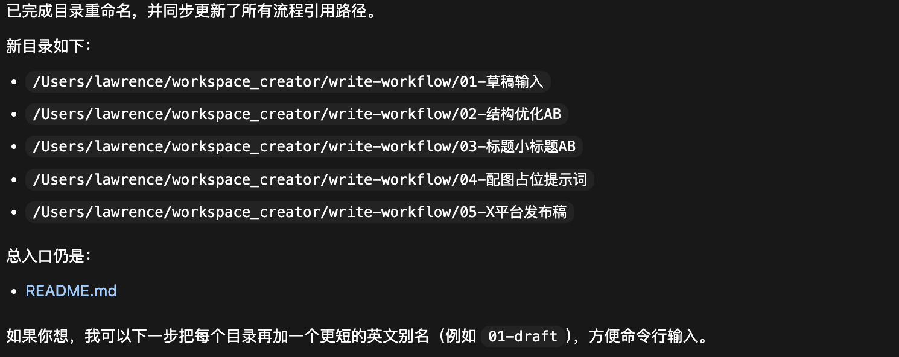

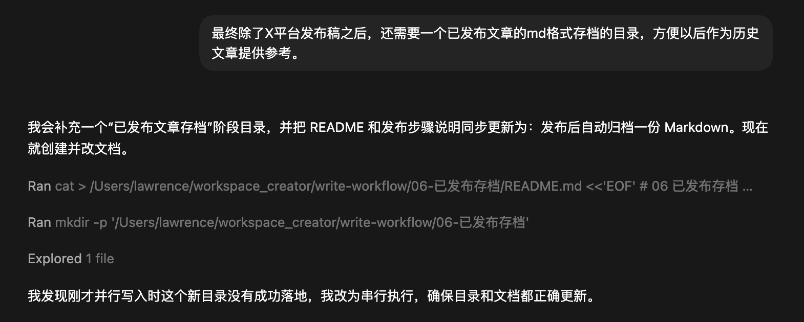

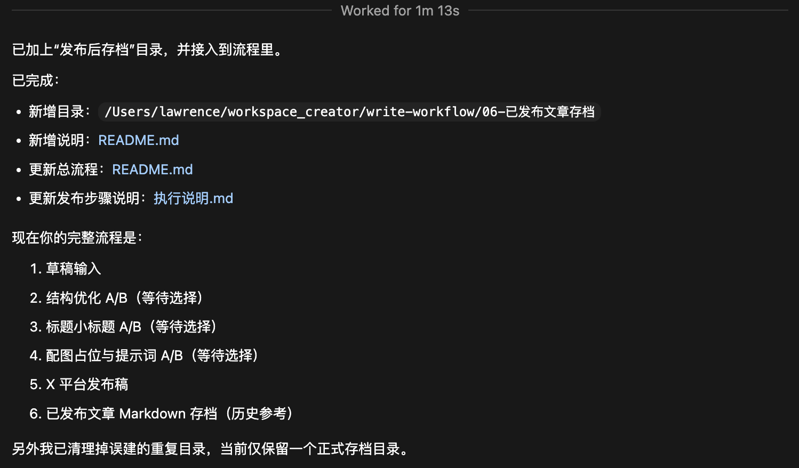

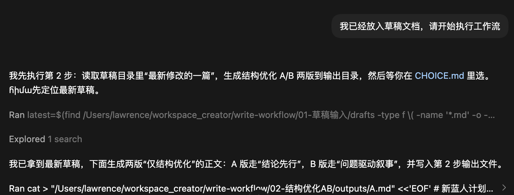

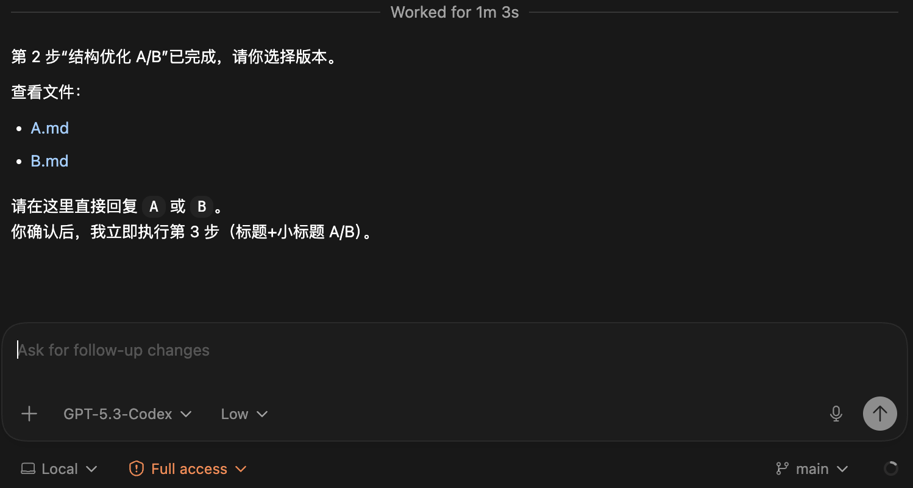

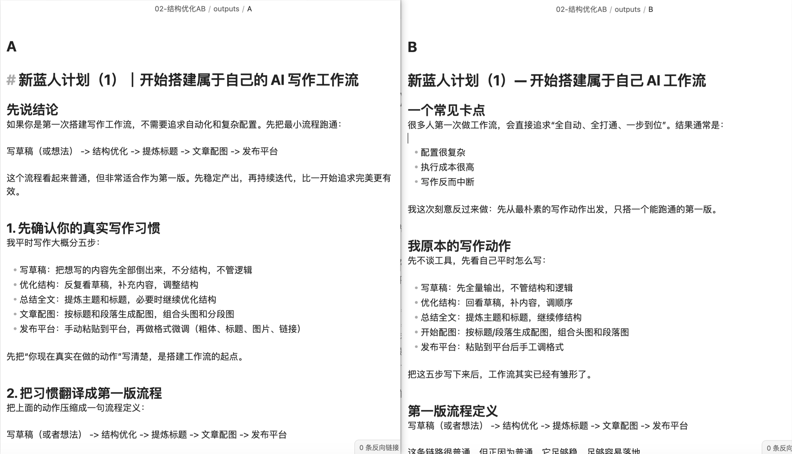

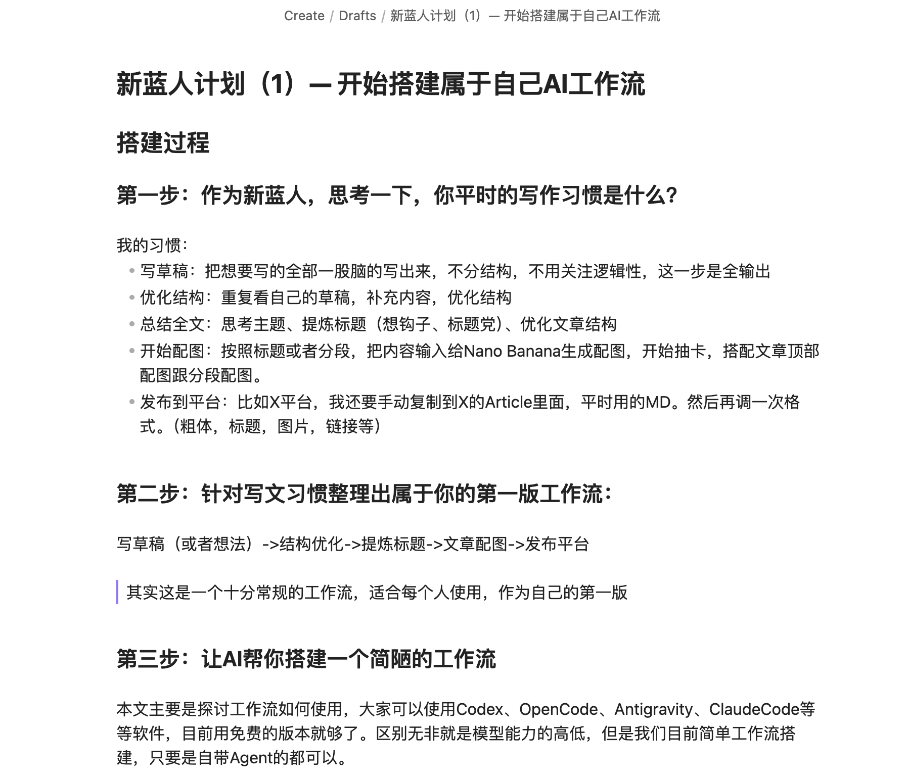

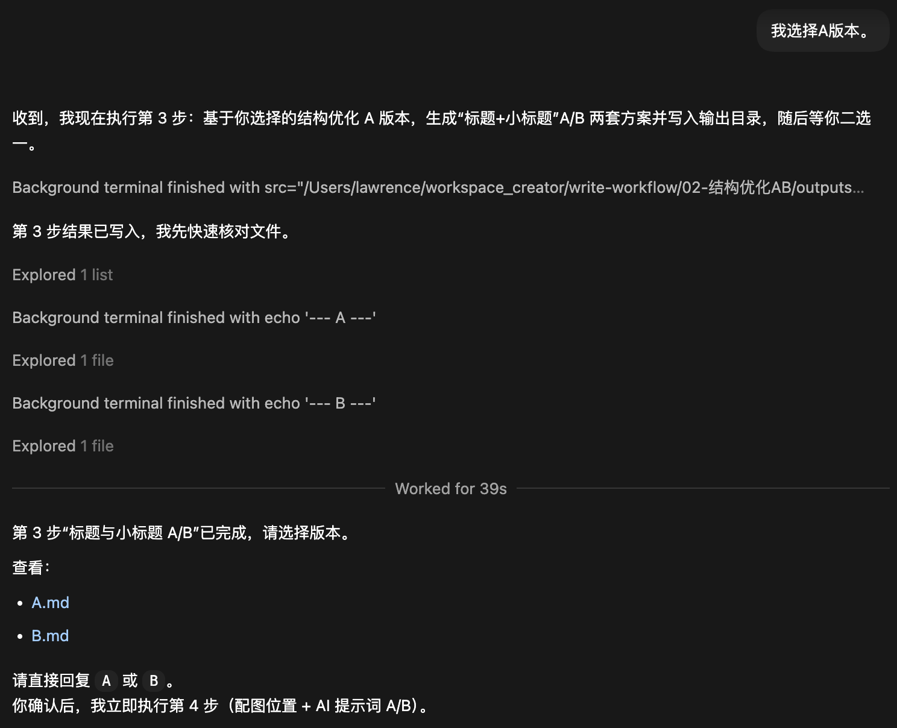

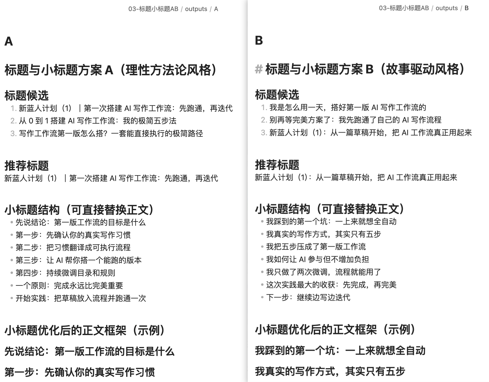

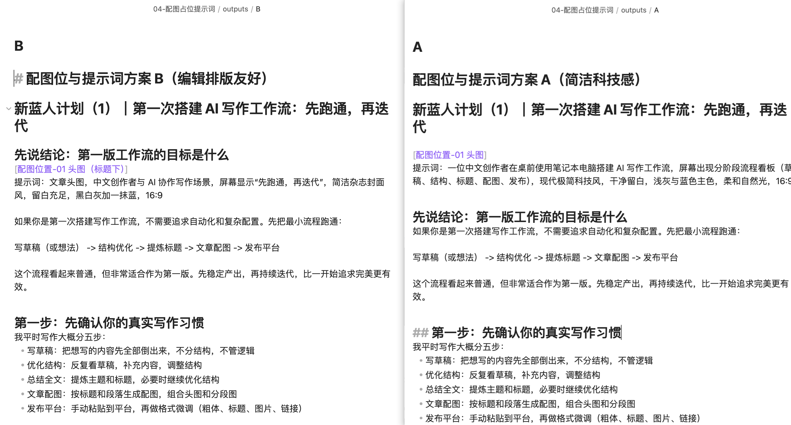

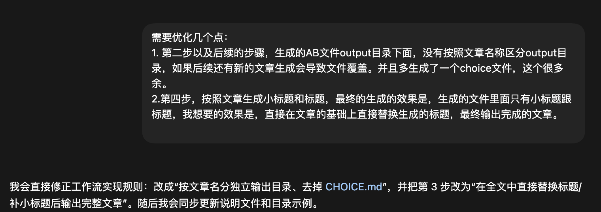

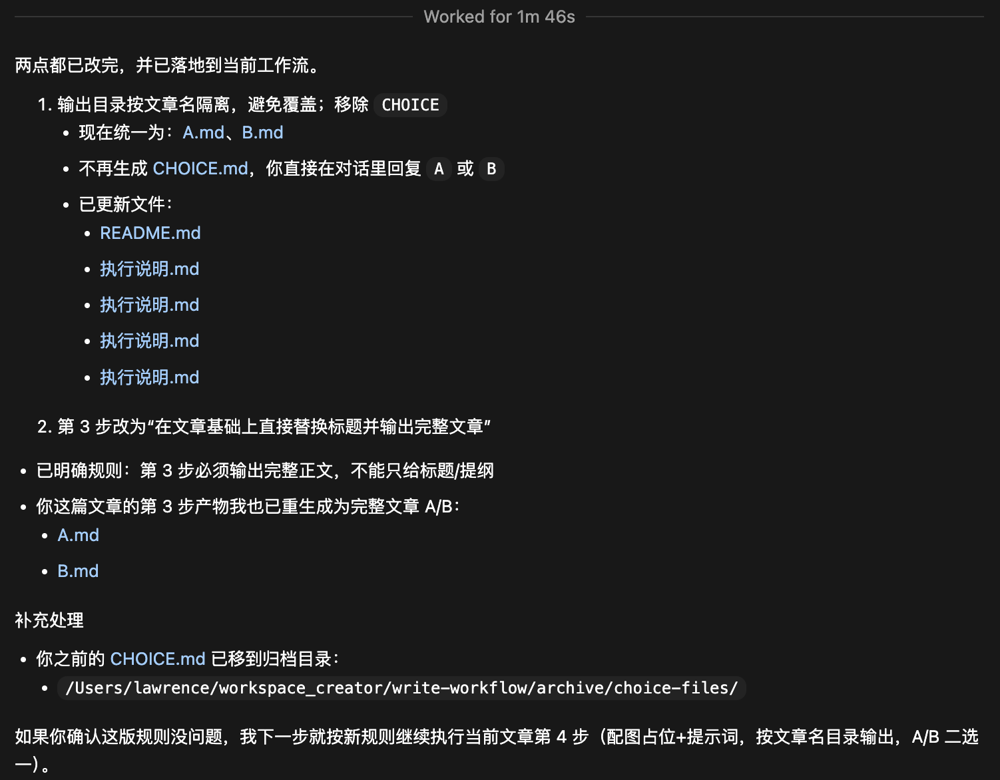

---

> 来源：飞书 · AI Spark 知识库 ｜ 原文（最新版）：<https://lcnniolukk80.feishu.cn/wiki/BjfJwdVjpi3h84k43JcceKtan3f> ｜ 归档：2026-06-04
