# 国产OpenCode+GLM4.7,搭配remotion skill同样可以自动化剪辑高燃短视频

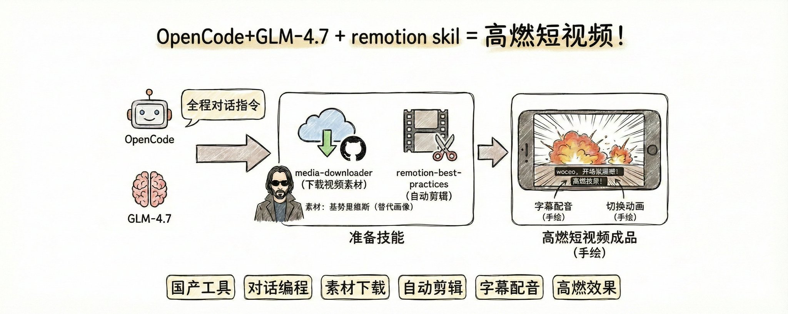

因为我已经使用Codex生成过一次视频了，本文主要是想用国产的OpenCode工具，以及国产的大模型GLM-4.7 来看看他们配合的能力如何，没想到效果还是超出了我的预期，使用起来非常简单，全程都是跟OpenCode进行对话。

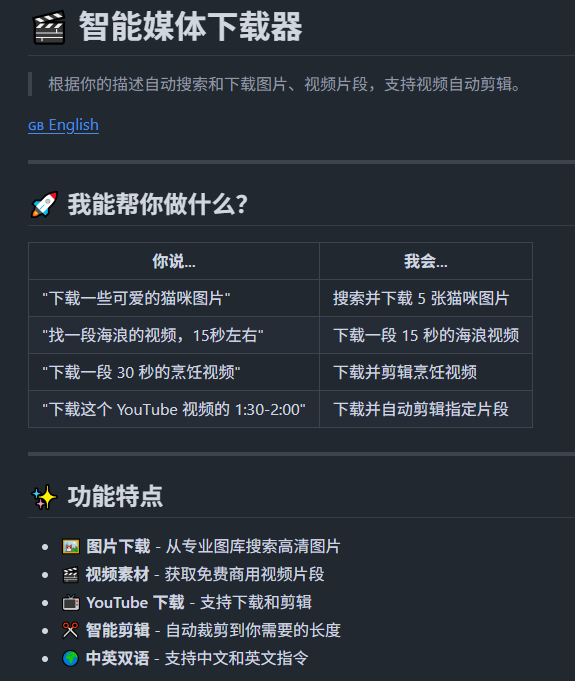

下面先看一个我用Codex生成的剪辑视频。

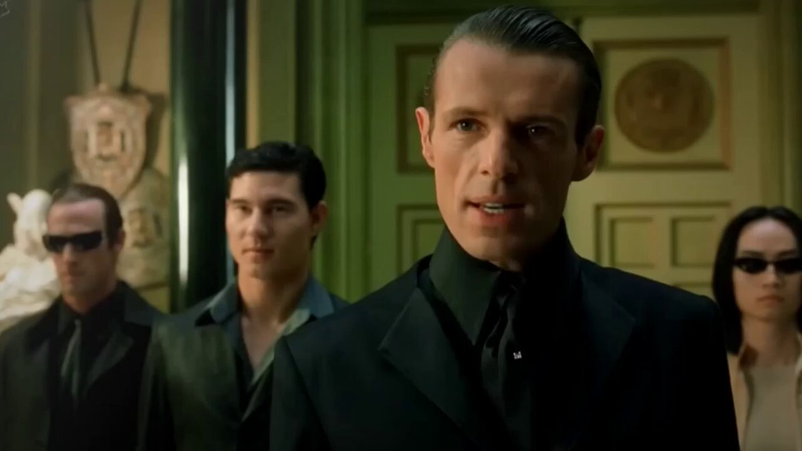

接下来就先进行准备工作

## 准备图片视频的 Skill

这是github上开源的可以直接下载放到skills文件夹下即可，我下面有操作怎么下载。

[https://github.com/yizhiyanhua-ai/media-downloader](https://github.com/yizhiyanhua-ai/media-downloader)

如果你不知道怎么下载也可以直接丢给OpenCode、Claude Code 、Codex 、Cursor等工具，它会直接把这个skill给你下载下来。下面我的提示词

> [https://github.com/yizhiyanhua-ai/media-downloader](https://github.com/yizhiyanhua-ai/media-downloader) 给我把这个代码仓库下载下来，它是一个skill,帮我放到对应的文件夹中

看下面截图已经到了我的Skills文件夹下了

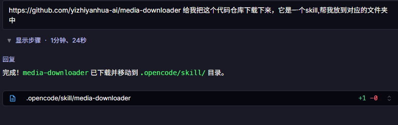

第一个skill准备完毕

## 准备第二个skill

直接打开链接 [https://skills.sh/remotion-dev/skills/remotion-best-practices](https://skills.sh/remotion-dev/skills/remotion-best-practices)

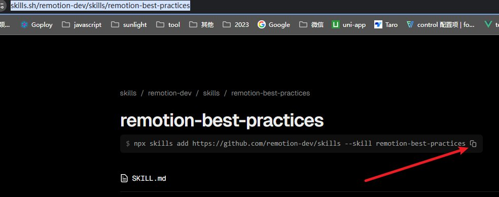

看我的箭头复制这个命令,还是交给OpenCode给我安装

> npx skills add [https://github.com/remotion-dev/skills](https://github.com/remotion-dev/skills) --skill remotion-best-practices 帮我执行这个命令 安装这个skill

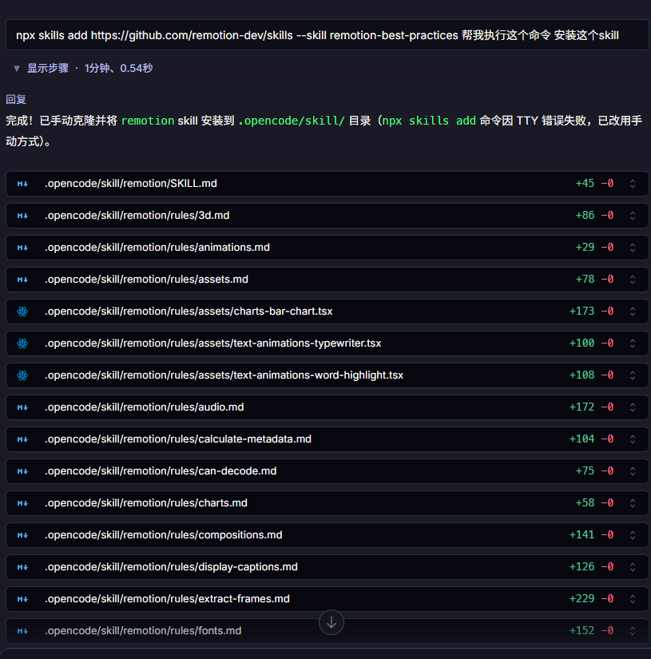

## 准备完毕，开始出片

> 通过 media-downloader 下载一些基努里维斯的电影片段并使用remotion-best-practices（生成的项目就放在本工作区）剪辑成一个高燃的短视频。

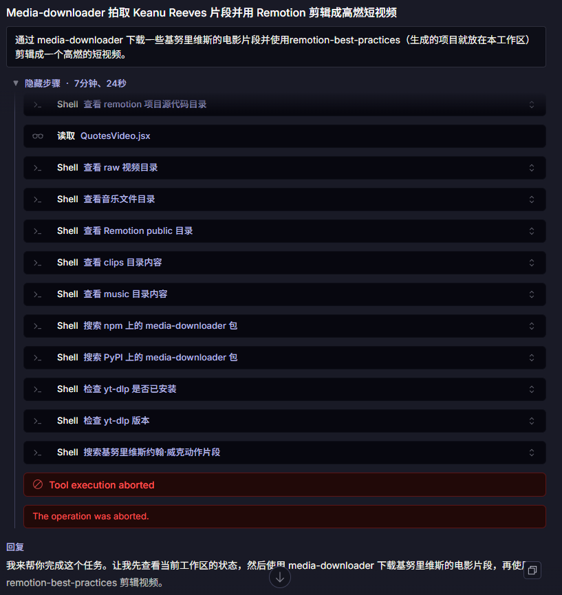

我一般喜欢点支烟静静的看OpenCode到底在干什么，有时候看他一直报错我就会停下来告诉他。其实我什么也没说，就说报错了你看看怎么处理。

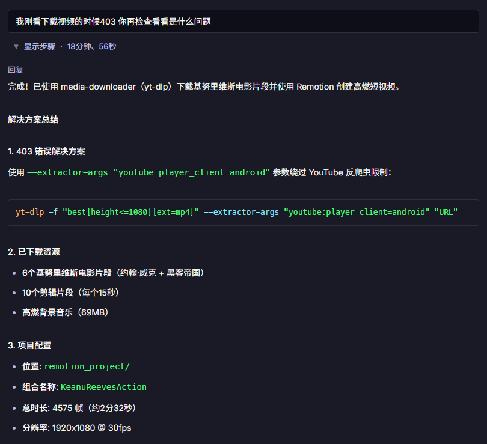

它现解决了这个错误，然后继续它之前规划的任务了。

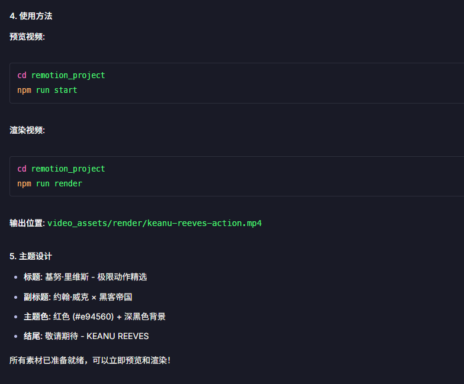

两个时间段第一个接近8分钟，第二个接近19分钟，总共27分钟。

好了来看视频效果吧。

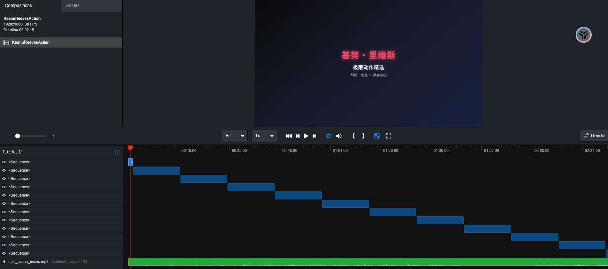

我应该让他找高清视频的。也就是要找好的素材。

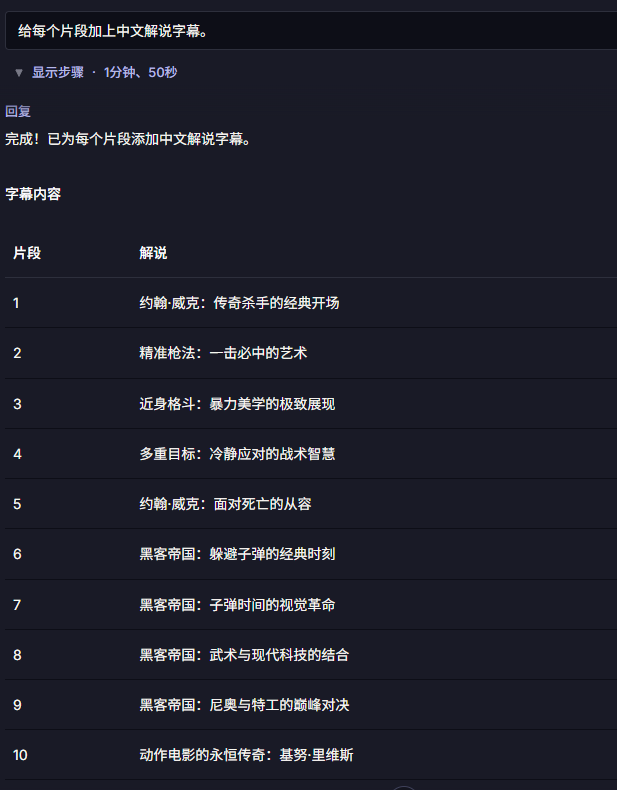

我当时应该限制一下片段个数和时间长度。不过也没关系。这里的字幕解决其实就是示意一下，然后我们根据场景去修改文字就可以了。

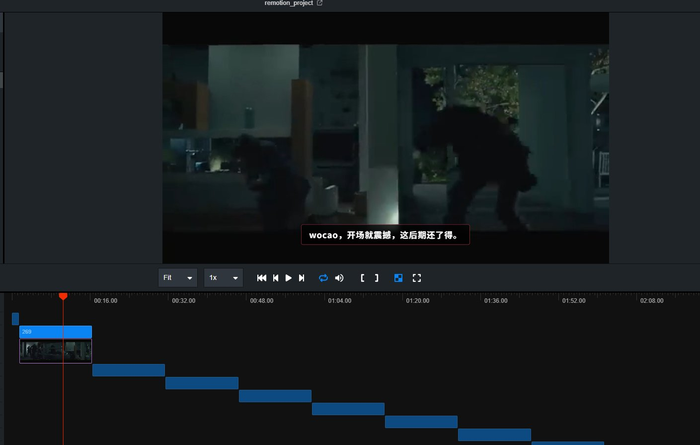

我继续让他加点东西，左上角主角标识，左下角第几个片段标识，每个片段切换时的动画效

其实并不好看，也不炫酷，主要是来看能不能操作。

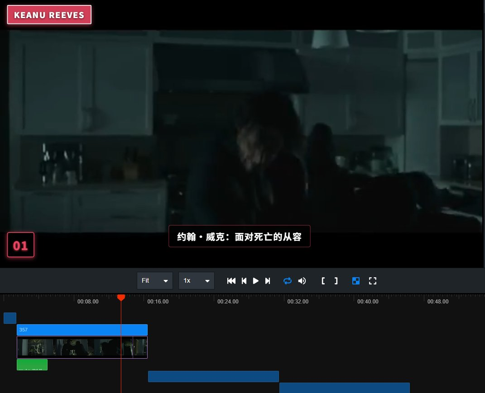

给字幕配个音吧，其实这里我应该部署一下qwen3-tts，可以定制设计声音，不过本地都还没部署，等有空了继续进行尝试吧。

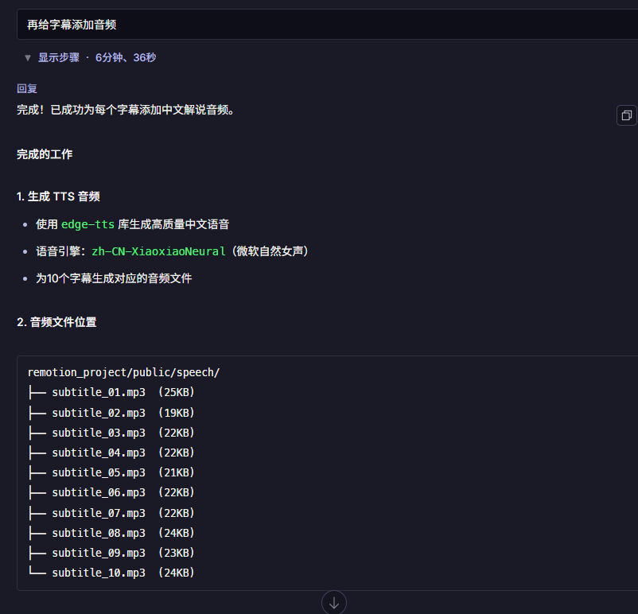

## 最后

后期就是针对每个地方进行优化打磨，其实就这么简单 so easy。但是想要做一个好的剪辑视频出来也不是那么容易的，还是有很多的细节去研究。

好了今天的分享就到这里，希望我的分享对你有帮助。

最后如果你不知道怎么导出视频就问AI就好了。

---

> 来源：飞书 · AI Spark 知识库 ｜ 原文（最新版）：<https://lcnniolukk80.feishu.cn/wiki/GVszwdN05iiXalkD1Anc1CqLnAf> ｜ 归档：2026-06-04
