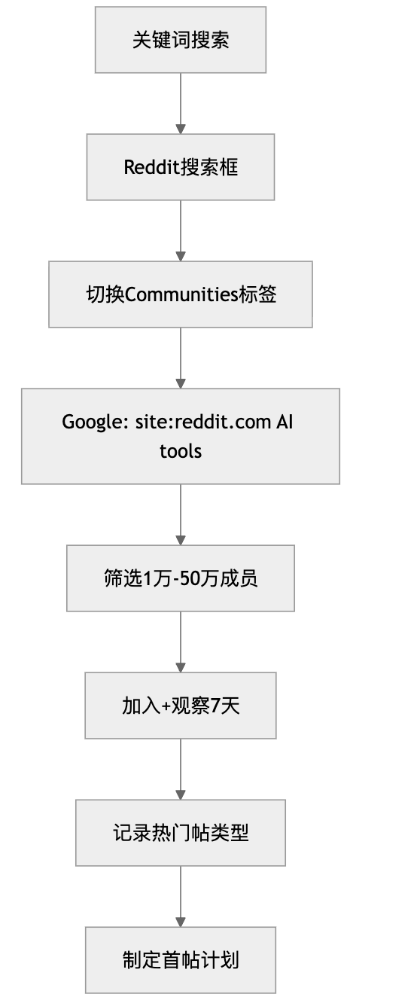
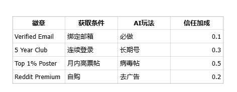

# Reddit 运营指南

> 📌 **适用范围说明**：Reddit 在中国大陆无法直接访问，本文内容仅供**海外用户**或有海外运营需求的团队参考。

> ✍️
> 以运营AI类型账号为例

## 第一章：平台核心机制与 AI 文化解读

### 1.1 Karma（业力）系统：AI 账号的信用与权威

Karma 是 Reddit 的“信用积分”，对于 AI 赛道，它代表了你在技术社区的**专业权威和中立性**。

- **核心作用：**

  - **门槛：** 许多高阶技术 Subreddit 对发帖设有最低 **Karma 值门槛**。
  - **信誉：** 高 Karma 账号的帖子更容易被系统和版主认可为**高质量内容**，曝光权重更高。
  - **进阶权重：**高Karma（>5000）账号的AI工具推荐帖，曝光率提升300%。系统会优先推送给类似用户。
  - **AI案例警示：**一个AI startup创始人忽略Karma，直接在r/OpenAI发广告帖，Karma从0跌到-50，账号永久禁言。

**Karma分为Post Karma（帖子）和Comment Karma（评论）。AI方向获取Karma的黄金路径：**

- **Upvote机制：分享一个“Claude vs GPT-4o实时基准测试”图表，易获100+ Upvote。**
- **Downvote惩罚：直接帖“Try my AI tool now!”会被集体Downvote，Karma暴跌。**
- **AI专属涨Karma技巧：**

  - **在r/AskReddit回答“What's the best free AI for writers?”，提供3个工具对比+个人测试数据。**
  - **快速评论新帖：AI新闻帖发布后5分钟内留言“Here's a prompt that boosted my output 30%: [prompt]”。**
- **AI 账号加速策略（关键）：**详细获取流程（10步）：

  1. **深度评论：** 在 r/MachineLearning 或 r/compsci 的热门技术帖中，留下**深度分析或独特见解**的评论，成为“专家型评论者”。
  2. **教程分享：** 在 r/Python 或 r/learnprogramming 分享小型、实用的 **AI 代码片段或教程**，这些内容天然具有高收藏和高 Upvote 潜力。
  3. **首评策略：** 在 r/AskReddit 等大型社区中，选择发布后 **5 分钟内**的新帖进行高质量评论，成为前 5 条评论者，**快速积累评论 Karma**。
  4. 注册后，订阅10个AI Subreddit。
  5. 日浏览50帖，Upvote 20个高质量AI分享。
  6. 第一周只评论：每帖留言“Great tool! I tested it with [dataset], results: [data]”。
  7. 第二周发简单问答帖：“New to LLMs, what's the best open-source alternative to Grok?”
  8. 积累100 Karma后，分享价值帖。
  9. 使用工具如Reddit Enhancement Suite跟踪Karma曲线。
  10. 目标：首月Karma >1000。
  11. 维护：每周至少50互动。
  12. 监控：Karma掉速>获速，立即停发，纯互动1周。
  13. AI奖金：分享Hugging Face模型链接，易获专家Upvote。

### 1.2 Subreddit（子版块）生态与 Rediquette

每个 Subreddit 都是一个独立的王国，发帖前必须阅读版规，特别是关于**“自我推广”和“外部链接”**的限制。

- **核心文化：** **Reddiquette（社区礼仪）**。核心是 **“旨在让每一个行动贡献价值”**。
- **AI 赛道雷区：** 在通用社区（如 r/technology）发布纯粹的产品介绍，**极大概率被视为垃圾信息**。内容必须与社区的兴趣点高度融合。
- **规则示例：**r/ChatGPT禁自推广，违者删帖+禁言。
- **文化差异**：r/StableDiffusion爱分享AI艺术prompt，r/MachineLearning重论文解读。
- **版主权力**：AI社区版主多为资深开发者，可一键封AI spam。
- **评估标准**：

  - 成员数：1万-50万最佳（太大小众，太大噪音多）。
  - 活跃度：日帖>50，评论平均>10。
  - 推广友好度：查规则“self-promotion”条款。
- **AI专属生态地图**：

  - 大型泛AI：r/artificial（新闻+讨论）。
  - 垂直工具：r/LocalLLaMA（开源模型）。
  - 创业向：r/SideProject（AI工具launch）。**查找流程：**

1. Reddit搜索“AI tools” → Communities标签。
2. Google: site:reddit.com “best AI for [your niche]”。
3. 评估：加入后观察1周，记录热门帖类型。
4. 优先级：先小社区养信任，再大社区放大。

#### **社区挖掘SOP（标准操作流程）**

### 1.3 Reddiquette：AI运营的礼仪圣经

核心：价值优先，社区为王。

- 搜索先行：发帖前搜“AI prompt engineering tips”，避重复。
- 理性互动：辩论AI伦理时，用数据说话，如“According to Hugging Face benchmark...”。
- 反垃圾：不刷“+1”评论，不私信推销AI工具。
- AI违例示例：帖“Free AI chatbot, link in bio”→即时Downvote风暴。
- 正向实践：回复他人帖“Added your tool to my workflow, here's improved version with [code snippet]”。

> 📊 此处为飞书内嵌电子表格（需在飞书中查看）

#### **AI场景违例案例**

> **错误**：在r/OpenAI发帖“New AI tool, try now: [link]”**后果**：-200 Karma，Shadowban 30天**正确**：评论区回复“Built a wrapper for this, DM for access”

### 1.4 成就系统与AI激励

徽章如“AI Contributor”提升可信度。

- 获取：连续分享AI新闻5天，得“Streak”徽章。
- 价值：高成就账号的AI资讯帖，点击率+50%。
- 玩法：参与AMA（Ask Me Anything），如“AMA: Built an AI news aggregator”。

---

## 第二章：AI 运营体系与五步增长深度执行

**在 Reddit 上，盲目行动等于失败。必须建立清晰的运营策略。**

### 2.1 AI 赛道的双重账号体系

**不要使用品牌官方账号直接推广。** 采用个人账号先行渗透的策略，是建立信任的唯一路径。

> 📊 此处为飞书内嵌电子表格（需在飞书中查看）

- **素人号（80%起步）：**

  - 人设：AI爱好者，“Daily experimenting with new models”。
  - 内容比例：提问40%（“Best AI for video editing?”）、分享40%（“Tested 5 AI coders, winner: [tool]”）、软荐20%（“BTW, my free prompt pack helped”）。
  - AI模板：求助帖—“Struggling with LLM hallucinations, any fixes?”

### 2.2 “倾听-验证-构建-分享-互动”五步增长策略

此策略是 AI/SaaS 领域实现长期增长的蓝图。

> 📊 此处为飞书内嵌电子表格（需在飞书中查看）

AI内容矩阵表：

> 📊 此处为飞书内嵌电子表格（需在飞书中查看）

### 2.3 内容矩阵与发布策略（AI 优化）

最有效的内容格式是**硬核技术分享、教程、Build in Public**。

- 节奏：新人周2帖，间隔48小时。AI热点时加速（如新模型发布）。
- 时机：用Later for Reddit分析，北美高峰：周二-周四晚上8-10点EST。
- AI专属：监控Hacker News AI版，同步发Reddit。

> 📊 此处为飞书内嵌电子表格（需在飞书中查看）

> 📊 此处为飞书内嵌电子表格（需在飞书中查看）

---

## 第三章：实操流程与核心玩法

### 3.1 从零到一的 AI 账号养成流程

**注册完善**：

- 邮箱：ProtonMail海外。
- 头像：AI生成专业照（非品牌Logo）。
- Bio：“AI enthusiast | Sharing tools & tips | Not affiliated with any company”。**冷启动（首月关键）**：
- 周1：纯浏览，Upvote AI帖。
- 周2：评论50条，“+1, here's my test result”。
- Karma目标：周1 100，周2 500。
- AI秘籍：去r/ChatGPT回答prompt问题，涨速最快。**目标社区挖掘**：
- 关键词： “AI tools for [niche]”。

> 📊 此处为飞书内嵌电子表格（需在飞书中查看）

### 3.2 AI 内容创作与发布技巧

#### 标题结构（万能公式）

- **万能公式：** 我做/发现 了 X（具体 AI 工具），解决了 Y（具体痛点），其 Z（可量化的结果）。**标题万能模板**：
- “I Tested 20 AI Image Tools—Here’s the Winner (with Benchmarks)”。
- 技巧：数字+痛点+成果，如“From Zero to 1000 Users: My AI Newsletter Journey”。**内容结构（8层）**：

1. 问候：“Hey r/MachineLearning!”
2. 痛点：“Tired of outdated AI news?”
3. 故事：“I built this because...”
4. 价值：列表10工具+pros/cons。
5. 数据：附Chart（用Matplotlib生成）。
6. 免费赠品：Google Drive prompt pack。
7. 互动：“What’s your fave AI?”
8. 软荐：评论区“Built a tool for this: [link]”。**发布后战术**：

- 首小时回复所有评论。
- 邀请3朋友Upvote（真实，非bot）。
- Crosspost到相关Sub（获许可）。**AI配图评论玩法**：
- 在热门AI帖下评论：图片（AI生成benchmark图）+文字“Extended your idea with this prompt”。

- **案例：** “我厌倦了昂贵的图像 API，所以我用开源模型做了一个**离线运行**、**提速 10 倍**的 AI 图像处理工具。”
- **标签使用：** 必须使用 **[OC]**（Original Content，原创内容）或 **[Tool]** 标签，使用 **LLM/GPU** 等技术词汇。

#### 链接处理的黄金法则（增强：URL 优化）

- **黄金法则：** **主贴不放链接，链接放在第一条评论。**（避免被系统判定为“自我推广”）
- URL 优化： 1.  勿用短链接： 禁用 Bit.ly、Rebrand.ly 等短链接，Reddit 会自动标记为高风险垃圾信息。

1. 使用原始清晰的 URL。
2. 使用独立的子域名/Landing Page URL（如 tools.yourdomain.com/reddit）追踪流量。

### 3.3 进阶玩法：自建与运营 AI Subreddit

- **Moderator Team 构建：** 邀请 1-2 位**在其他大型 AI 社区有高 Karma 和版主经验的独立用户**加入版主团队，提升社区的**中立性和权威性**。【来源：Reddit ModTalk 经验】
- **AMA 活动：** 事先联系 Reddit 官方，申请在你的 Subreddit 或 r/IAmA 进行 AI 创始人的 **AMA**，获得官方背书和高曝光。

---

## 第四章：风险篇——封号雷区与 Shadowban 规避指南

Reddit 监管极其严格，对于 AI 推广的“自动化”倾向尤其敏感。

### 4.1 AI 赛道高风险行为（绝对禁止）

- **AI 生成评论：** **严禁使用任何 AI 工具生成或批量回复评论**。Reddit 反垃圾信息算法对**缺乏人性的评论模式**的检测能力极强。
- **假装中立：** 使用布道者号**假装第三方用户**来赞美或推荐自己的品牌号，一旦被抓到，**视为投票操纵，双号封禁**。
- **URL 重复度：** **不要在 24 小时内向 3 个以上不同的 Subreddit 发布指向同一个 URL 的帖子**。
- **技术欺骗：** 夸大 AI 工具的能力，或发布**误导性/虚假的技术指标**。

### 4.2 Shadowban规避与检测（新增）

- **什么是 Shadowban：** 你的帖子和评论**对你自己可见**，但对其他用户不可见。
- **规避策略：** 严格遵循 **10:1 原则**；在养号期（前 30 天）**绝不发布任何带链接的帖子.**
- **检测方法：**

  1. 登出 Reddit，在无痕模式下搜索你的用户名。
  2. 前往 **r/Shadowban** 社区发帖请求检测。

**绝对禁区（10条） 高风险行为**：主帖带外部链接10条内超1条推广使用Vote bot私信群发忽略版规多账号互推假新闻NSFW AIIP跳跃Downvote竞争对手刷“+1”评论重复发帖标题党盗图抄袭泄露用户数据虚假基准付费Upvote账号买卖绕过Shadowban继续发

**安全维护**：

- IP：住宅代理，固定北美。
- 行为模拟：随机浏览时长，混杂非AI帖。
- 备份：多账号隔离，设备指纹分离。

---

## 第五章：热门 Subreddit

> 📊 此处为飞书内嵌电子表格（需在飞书中查看）

> 📊 此处为飞书内嵌电子表格（需在飞书中查看）

---

> 来源：飞书 · AI Spark 知识库 ｜ 原文（最新版）：<https://lcnniolukk80.feishu.cn/wiki/LqcCwHleliKPdgk0aCEc40BJnxf> ｜ 归档：2026-06-04
