# 四大自媒体平台流量与商业化全景

## 概述：

四大平台主要包含：抖音、小红书、微信、X四个平台，主要拆解其底层逻辑的变化。各个平台的规则千差万别，但是终局都在指定一个方向：以内容为基础，以信任为资产。

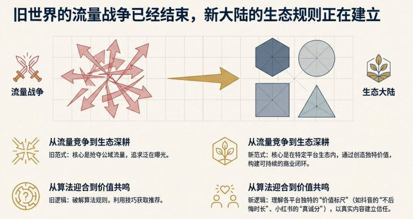

## 抖音

抖音的算法核心从最开始的【停留时长】变为【不后悔时长】，长评、主动转发等高成本互动权重大大提升，而博眼球的泛内容正在被限流

对于创业者、超级个体的指南：

（1）垂类IP+私域转化，构建【内容引流→私域→高客单交付】闭环

（2）AI赋能内容规模化，一人管理多账号矩阵

（3）深耕本地生活服务，同城流量转化路径将最短

（4）轻资产电商/分销，专注于选品和流量

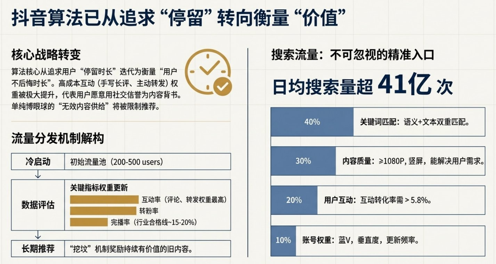

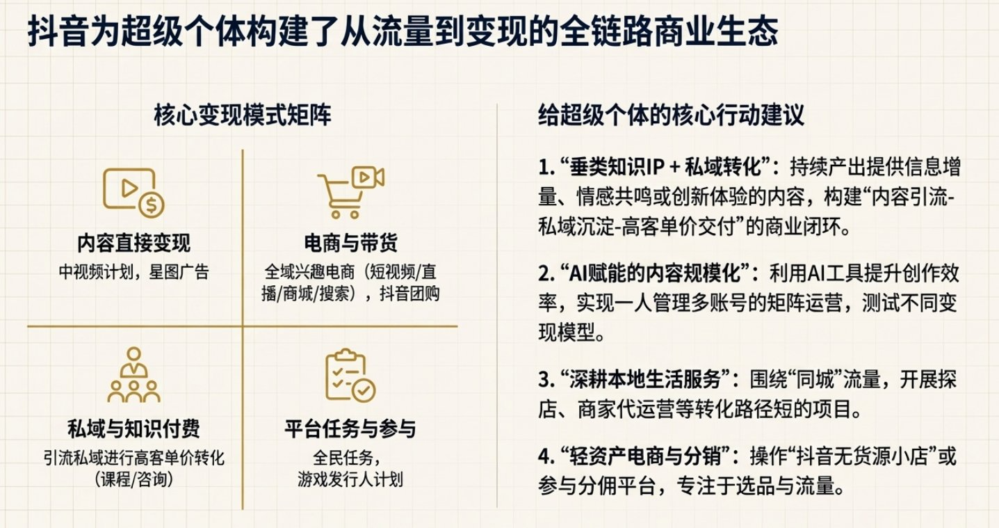

## 小红书

小红书正在从【种草社区】进化成【决策大脑】，平台的生态核心将会倾向于种草和销售能力的【买手】

流量分发：【阶梯赛马】机制。账号的【真诚分】直接影响内容的初级流量池，同质化/过渡营销可能导致账号清退。

对于创业者、超级个体的指南：

    内容定位：极度垂直+真实专业

    三条变现路径：素人买手带货/知识IP付费转化/本地服务团购

    核心是深耕垂类，然后价值为王。

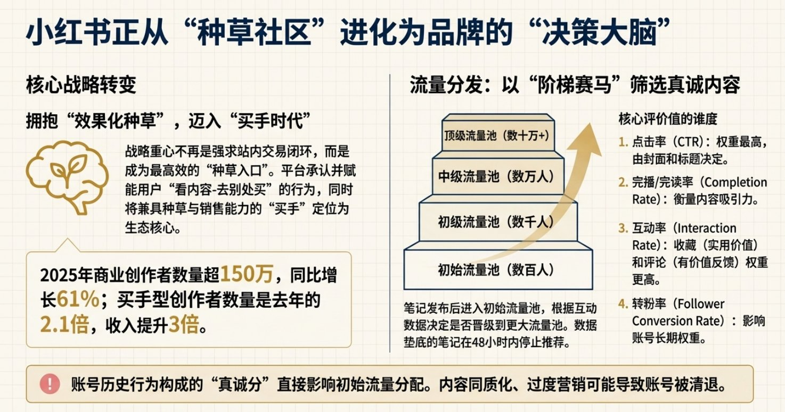

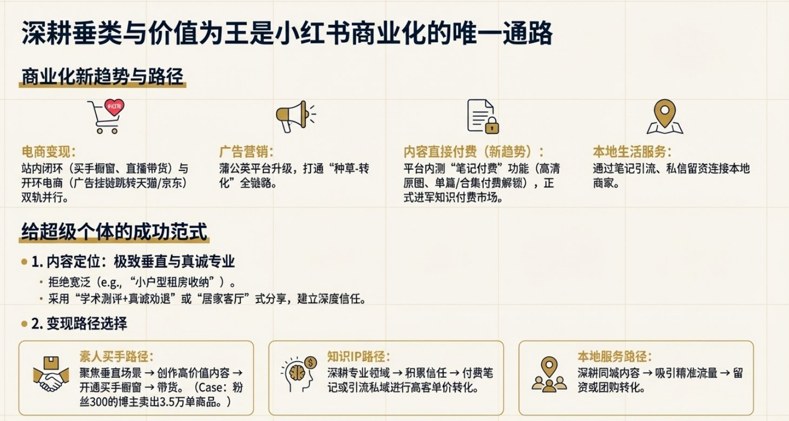

## 微信生态

微信生态本质上是基于信任关系的商业系统，核心是四大场域：视频号（内容）、公众号（深度）、企业微信/社群（关系）、小程序（服务）

流量逻辑：社交推荐为主→算法推荐加码→搜索流量深耕

注意：微信生态平台严格限制同质化以及纯AI生成内容，我们多个做AI内容的视频号已经被限制功能

对创业者、超级个体的指南：

    路径一：知识IP+深度社群→高客单价服务

    路径二：全域兴趣电商→微信小店成交

    路径三：专业服务与品牌合作

 核心是：公域做内容筛选，私域做信任变现。

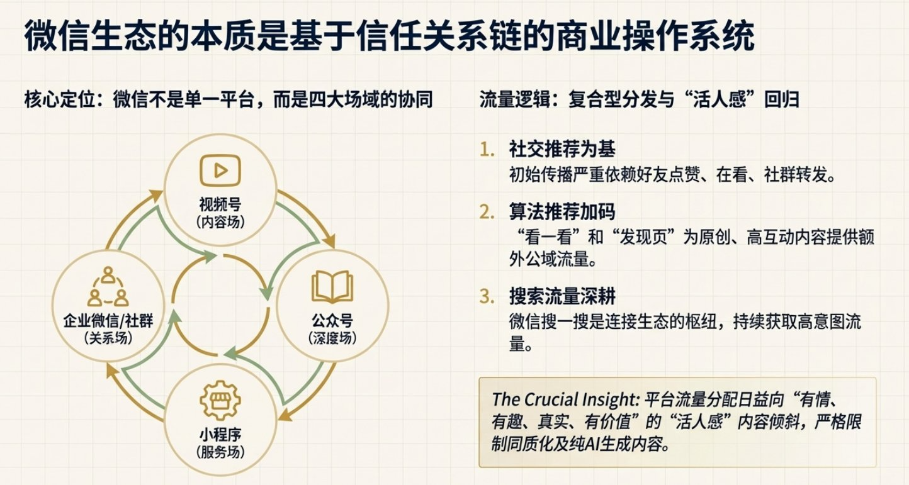

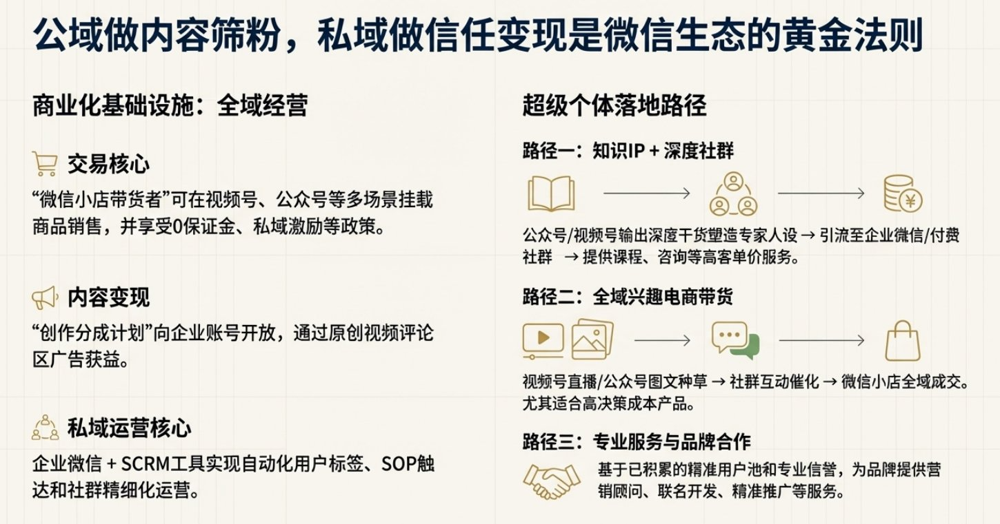

## X平台

由于刚开始接触X，了解很浅，就以自己研究内容展开介绍。X平台正从原本的【规则裁判】全面转向【AI编辑】。

内容的内在价值和真实性=曝光首要前提。账号将会存在【声誉评分】，负反馈将会出发长达3个月的算法惩罚。

对于创业者、超级个体的指南：

（1）内容策略：放弃技巧，回归真实。定位垂直，拥抱【Living in Public】，分享学习过程、失败与思考。

（2）商业化路径：订阅Premium → 广告分成 → Super Follows/Tips拓展收入纵深

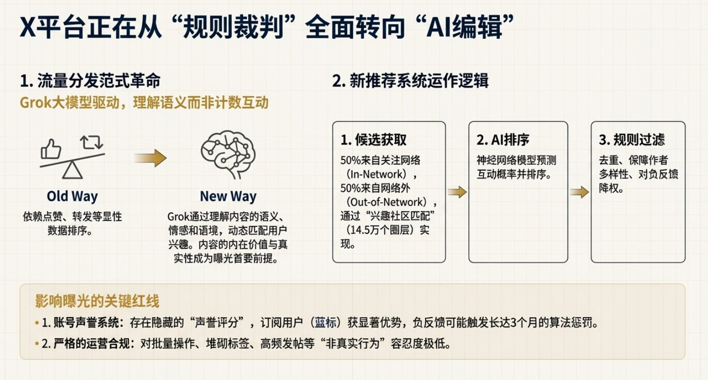

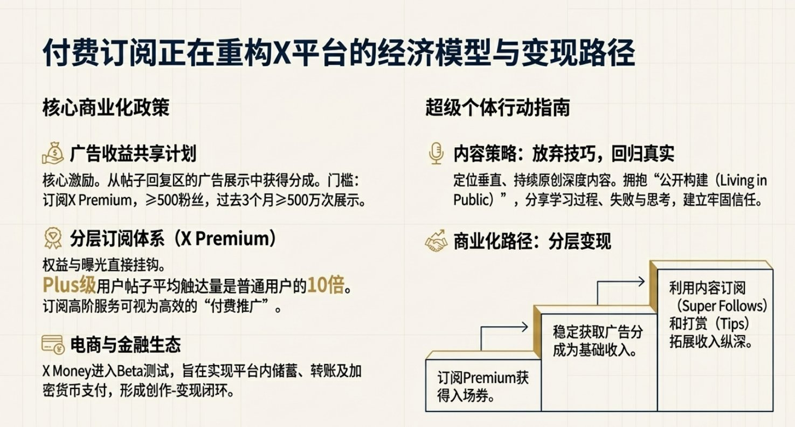

## 总结

各个内容平台看似变现规则都不一样，但是实际上有四条通用的变现逻辑：

（1）内容价值直接货币化（广告分成/商单/IP授权）

（2）电商与带货（兴趣电商/直播/本地生活）

（3）私域沉淀与知识服务（课程/咨询/1V1）

（4）低门槛平台任务（分销/推广）

总结下来，核心的竞争在于信任构建的速度，是否能够提炼出一套适合自己的底层方法论，灵活适配不同的平台规则，驱动个人品牌的增长飞轮。

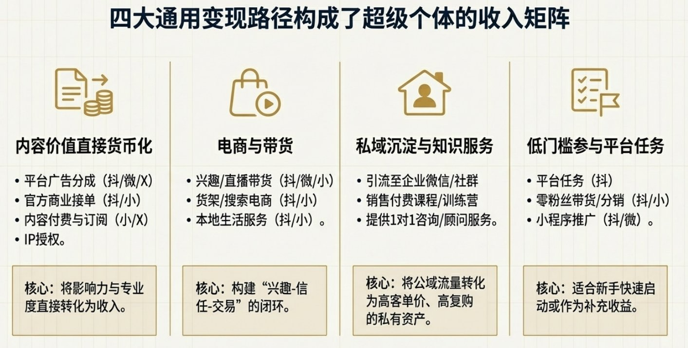

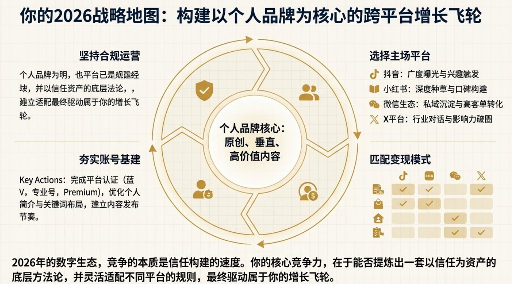

---

> 来源：飞书 · AI Spark 知识库 ｜ 原文（最新版）：<https://lcnniolukk80.feishu.cn/wiki/DVGWwzS1oiNJyYkN7mwcscaonCd> ｜ 归档：2026-06-04
