# 自媒体万字保姆级教程-上

# 前沿：

> 📌
> 自媒体理论上讲只是一种方法、一种技能，你通过自媒体去放大什么才是核心，可以是自己的产品，也可以把自己当成产品；
> 该教程的核心是帮你整体去了解平台、内容等基础知识和体系化的实践，但是如果你想深入了解还是要大量的实践，急于速成的本质就是想不劳而获。大量的实践与学习，有效的复盘是你学会任何一件事情最有效也是最快的方式。

> 👍
> # 说明
> ## 谁适合看这篇教程
> ✅ 初创者：想通过自媒体增加营销渠道但不知道怎么开始的
> ✅ **超级个体**：独立开发者、个人IP通过自媒体增加自身杠杆的
> ✅ **打造第二副业**：有正职但想增加副业收入
> ✅ **转型迷茫者**：做了一段时间但没起色，想系统梳理
> ## 你能收获什么？
> 🎯 **避坑能力**：了解平台红线，规避90%新手会犯的错误
> 🎯 **底层认知**：理解算法逻辑，不再盲目试错
> 🎯 **实操方法**：从起号到变现的完整操作流程
> 🎯 **系统思维**：建立可持续的内容生产与运营体系
> 🎯 **商业能力**：掌握多种变现路径，实现从0到1
> ## 阅读说明
> ⏱️ **预计阅读时长**：35-40分钟
> 📊 **内容深度**：保姆级，每个环节都有具体方法
> 🔄 **学习建议**：建议收藏本知识库后学习，边学边实践
> ## 教程导航
> 本教程共分为6大模块：
> **🚫 闭坑指南** → 开始前必知的红线，避免踩坑
> **🧠 认知篇** → 看懂平台逻辑和底层规则
> **🚀 起号篇** → 从0到1搭建账号基础
> **✍️ 内容篇** → 高效创作与数据复盘
> **📈 运营篇** → 系统化涨粉与粉丝维护
> **💰 商业化篇** → 多元变现路径与IP打造

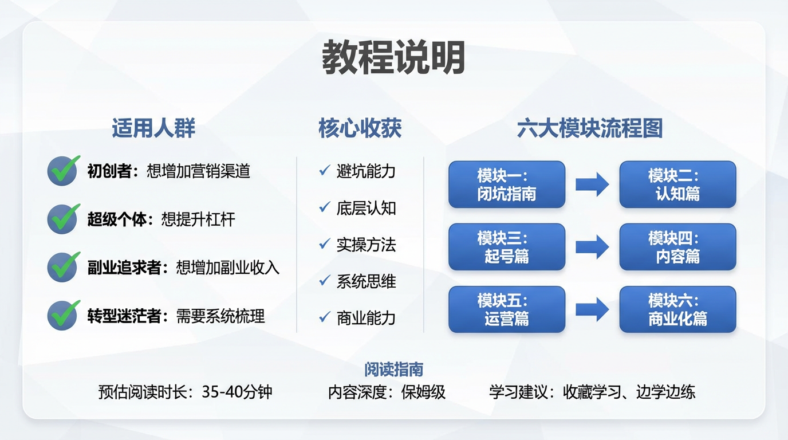

# 小白闭坑指南：开始前必看的红线

核心原则：积极拥抱平台和规则的监管，将错误扼杀在摇篮里比时候补救要重要；

## 1、账号红线

致命错误：

头像/昵称违规：严禁使用国旗、国徽、党徽；严禁冒充官方和名人；严禁黄赌毒

简介违规：新号先别直接放联系方式（微信/手机号登），等起量了再寻求隐晦的引流方式

刷量行为：绝对不要买粉、买赞、刷播放量，采用一些邪修引流方式，会让标签变乱，专心做内容才是王道

## 2、内容红线

直接搬运：不要直接下载搬运别人的作品

AI标识：所有AI生成的内容必须开启“内容由AI生成”标识，否则会被强制打标“疑似AI”，有时候会限流；

画质模糊：分辨率低于1080P视为低质内容

## 3、操作红线

频繁修改资料：前期不需要频繁不要在这上面浪费时间，专心做内容最重要；

大量删除视频：如果真的想删除，先设置为“仅自己可以”，但是也别一天大规模删除；

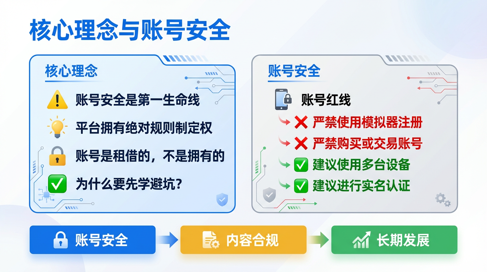

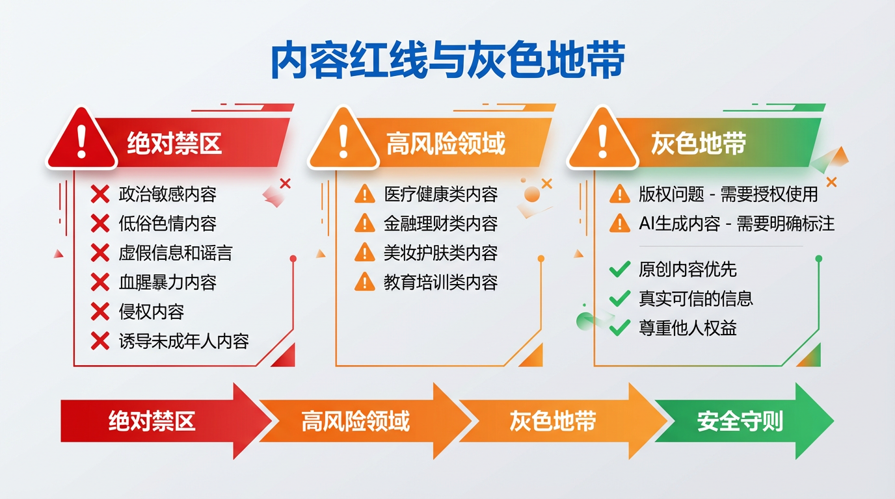

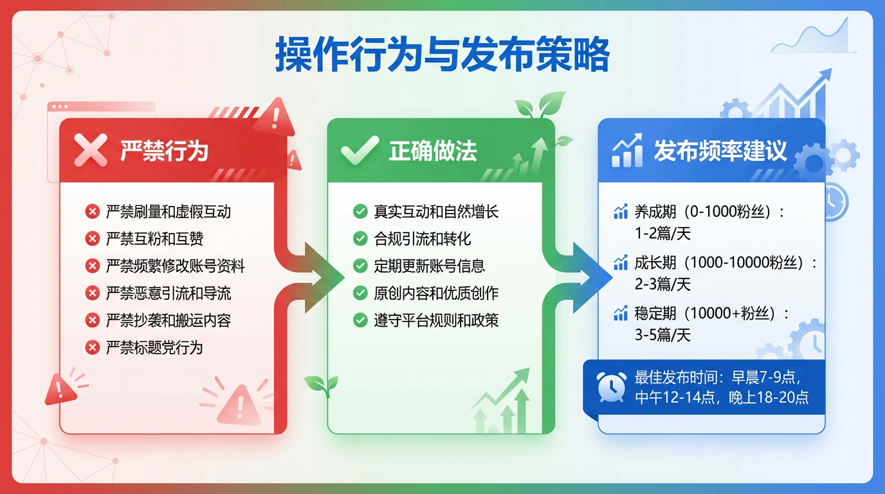

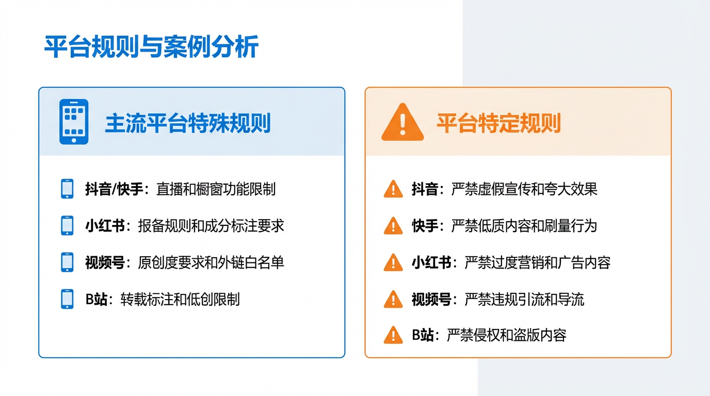

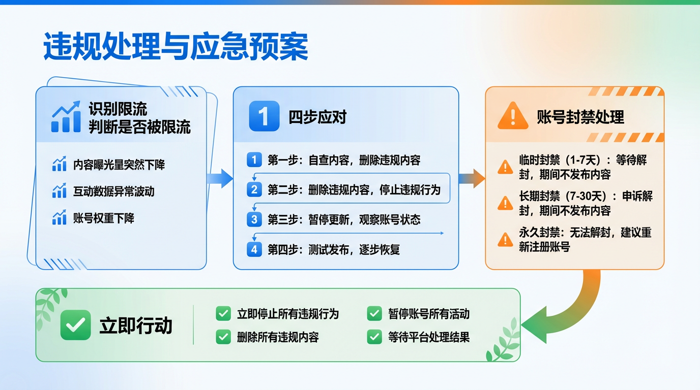

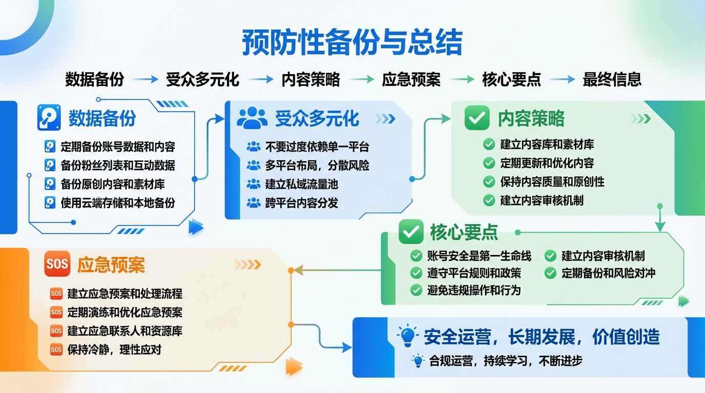

# 一、认知篇-------看懂选择很重要

## 为什么认知比技巧更重要？

很多人做自媒体失败的原因，其实不是自己不够努力，而是方向错了

- 有人每天发10条内容，但是从来没有进入过平台大的流量推荐池里面
- 有人每天追热点追的要猝死，但却从来没考虑过自己的人设是什么样的
- 有人粉丝早已经过万甚至过十万，但却不知道如何设计自己的商业模式，如何开始变现

所以，**认知决定了你的上限**。只有懂平台逻辑、懂用户心理、懂商业本质，你才能走的更远、更稳。

## 1、自媒体的商业本质

**自媒体=流量生意*信任经济**

我们近一步拆解一下这个公式：

**收入=流量*转化率*客单价*复购率**

什么意思呢？我们来具体解释下：

###      （1）流量（曝光量）

也就是你的内容能被多少人看到，这由平台算法决定，而流量也是一切变现的基础

### （2）转化率（信任度）

有多少人愿意相信你，购买你推荐的产品。这由你人设、专业度、内容质量决定。要记住，一万粉丝的信任有可能比10万泛粉更值钱。

### （3）客单价（产品价格）

你卖的产品/服务值多少钱，这其中包括带货佣金、课程定价、咨询费用等。

### （4）复购率（长期价值）

你的用户会不会在你这长期消费，这决定了你的生意是一锤子买卖还是长期事业。

> 💡
> **关键认知**
> - 新手阶段的重点是做流量（要提高曝光度）
> - 中期阶段重点是做转化（建立信任）
> - 成熟阶段是做复购（逐步提供你的客单价和用户生命周期价值）

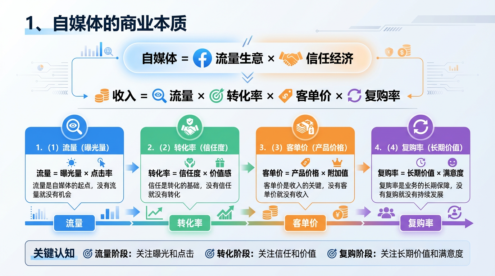

## 2、平台推荐机制

在开始说平台推荐机制之前，我们要知道一个底层逻辑：所有内容平台都遵循一个原则：就是让用户尽可能长时间停留在平台上。

因此，算法会推荐那些能留住用户的内容，也就是：

让用户看完（完播率）

让用户互动（点赞/评论/分享）

让用户持续刷（停留时长）

**而你的任务就是能够创作出符合这三点的内容。**

而要实现这个目标，你要深刻理解你的用户和平台算法之间的关系，这里面平台算法会根据用户的变化进行调整。

- 短视频初期，用户看重新鲜感，所以算法就会着重根据数据（开头、留存等）去判断内容价值
- 短视频中后期也就是当前阶段，用户更看重价值，所以算法会变成“用户需求预测”导向，也就是更看重长期价值。

### **流量池的分层**

初始流量池→小流量池→中流量池→大流量池

相应的每个流量池的考核标准不一样，初期的算法会更考验完播率、点赞率、评论率、收藏率、分享率等

### **对应的策略**

- 前3秒定生死：开头必须抓人，直接给冲突/悬念/价值
- 黄金时长：视频15-60秒最佳，太短没深度，太长完播率低
- 引导互动：结尾设置问题、争议
- 发布时间：选择目标用户活跃的时段

但是随着用户对短视频猎奇感转向价值获取后，从抖音等相关平台逐渐调整算法，可以预测到核心从相对静态的数据驱动转向了更智能、更前瞻的“用户需求预测”。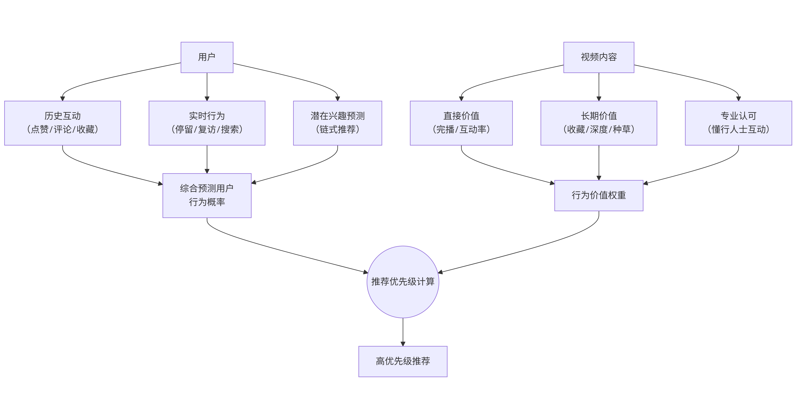

### 新旧算法的核心差异

我们可以看到，新算法对视频本身的评估也更全面，不再只是回应用户“过去”喜欢什么，而是试图预测他们“未来”需要什么。它通过分析你的**历史互动、实时行为（如是否看完、是否返回重复观看）以及更深层的兴趣线索（如搜索关键词）**，来综合判断你接下来可能对什么内容产生深度互动。

所以，算法不仅是看直接的互动数据，更看重长期价值和专业认可度。

### 如何适应新的算法

首先，内容策略需要从“流量思维”彻底转向“用户价值思维”。单纯追求爆款模板的捷径变窄了，但深耕价值的道路更宽了，可以从以下三个方面调整：

####     （1）**重新设计内容钩子**

前3秒的“钩子”依旧至关重要，但重点从“博眼球”转向了“承诺价值”

- **从悬念到价值承诺**：不要只制造空洞的悬念。直接告诉用户看完视频能解决什么具体问题、带来什么明确好处。例如，“三个月轻松减重10斤的两个习惯”比“你绝对想不到的减肥秘诀”更具价值吸引力。
- **展示专业性与真实性**：快速展示你的专业依据、独家资源或真实的体验过程，快速建立信任。例如，开篇就说“作为有十年经验的营养师，我总结了一个不挨饿的饮食法……”
- **利用“进度条奖励”**：明确告知视频的关键信息点分布，如“视频后半段有福利”，能有效提升完播率。

#### （2）**提升内容的价值密度与获得感**

算法现在更青睐能让用户感到“有用”并愿意反复观看或收藏的内容。

- **结构化表达**：将信息梳理成清晰的步骤、清单或模型。比如“3个步骤”、“5个技巧”，帮助用户快速抓取要点。
- **创造“可搜索”的内容**：关注抖音热搜榜和用户常搜的关键词，将答案融入你的视频。当用户主动搜索时，你的高质量解答更容易被优先推荐。
- **重视“结尾”设计**：结尾不再是简单的“求关注”，而应引导有深度的互动，如提出一个能引发讨论的问题，或设置一个投票，鼓励用户分享自己的看法。

#### （3）**关注长期价值，深耕垂直领域**

新算法鼓励深度耕耘，打击浅尝辄辄的搬运行为。

- **建立内容体系**：不要东一榔头西一棒槌。围绕你的专业领域，规划系列性内容，形成自己的“知识体系”，让用户有持续关注的理由。
- **维护铁粉互动**：新算法大幅提升了“铁粉互动频次”的权重。认真回复评论区的高质量留言，甚至根据粉丝反馈定制内容，是激活推荐的关键。
- **让数据指导优化**：定期复盘数据看板，重点关注**完播率、播赞比、收藏率**和**粉丝净增率**。如果3秒完播率低，优化开头；收藏率低，加强内容的干货密度。

## 3、用户心理学

### （1）用户的三大核心需求

**痛点、爽点、痒点**

| 类型 | 定义 | 用户感受 | 内容方向 | 案例 |
|-|-|-|-|-|
| **痛点** | 恐惧、焦虑、问题 | "我太难了" | 解决方案类 | "30岁还没存款怎么办？" |
| **爽点** | 即时满足、情绪释放 | "太爽了！" | 情绪价值类 | "怼回去的10句话" |
| **痒点** | 好奇、向往、追求 | "我也想要" | 向往生活类 | "我的早C晚A护肤routine" |

**爆款内容公式：**

标题戳痛点→内容给爽点→结尾留痒点

> 💡
> **示例**
> 标题：“年薪10万和年薪100万的人差在哪里？”（痛点）
> 内容：拆解高收入人群的3个思维模型（爽点-学到了）
> 结尾：关注我，下期讲如何跳槽涨薪30%（痒点）

###   （2）7秒注意法则

**用户刷内容的真实状态：**

- 平均停留时间：**3-7秒**
- 决策时间：**前0.5秒**（看标题/封面）
- 继续看的决策点：**前3秒**（开头是否吸引）

因此，你的**内容结构**应该是：

0-3秒：抛出钩子（冲突/悬念/反转/利益） 

3-30秒：核心内容（快速给价值） 

30-60秒：深化内容（具体方法/案例） 

最后5秒：引导互动（关注/点赞/评论）

如果你做的是长教程，那开头需要1句话讲清楚你的视频内容，中间的教程需要具备手把手的教学价值，结尾可以通过设置系列来构建吸引点。

### （3）价值感知公式

用户觉得内容由价值，取决于：

感知价值=（实际收货+情绪体验）/付出成本

  提升感知价值的方法：

**提高实际收获**

- 给干货（具体方法、模板、清单）
- 给新知（打破认知、揭秘内幕）
- 给结果（前后对比、数据证明）

**提升情绪体验**

- 共鸣（"说出了我的心声"）
- 解气（"帮我说了想说的话"）
- 治愈（"看完心情好多了"）

**降低付出成本**

- 时间成本：内容简短、节奏快
- 理解成本：大白话、避免专业术语
- 决策成本：直接给结论，不要模棱两可

### 一图总结

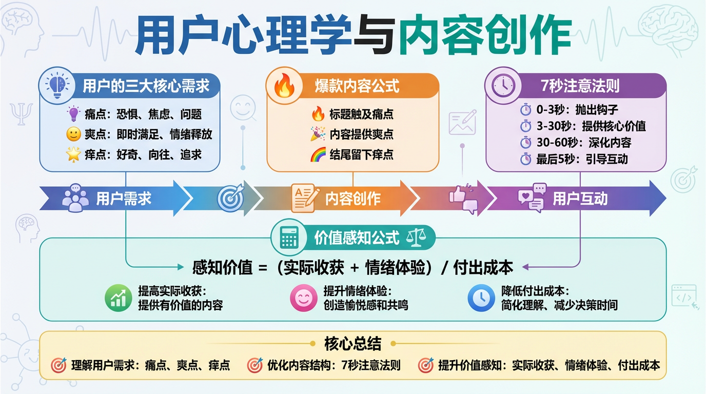

## 4、赛道选择方法论（定位）

### （1）三维评估模型

**选赛道要看三个维度的交集**：个人兴趣、变现能力、市场需求

具体评估：

| 维度 | 评估问题 | 举例 |
|-|-|-|
| **个人兴趣** | 我能不能持续输出3年？ | 喜欢护肤、研究数码、爱看电影 |
| **市场需求** | 有没有足够多的人关心？ | 搜索量、话题热度、竞品数量 |
| **变现能力** | 能不能赚到钱？ | 广告价值、带货空间、付费意愿 |

**选择策略**：

理想赛道（无脑选）：兴趣高+需求高+变现高

发育赛道（可以选，需要发展时间）：兴趣高+需求高+变现低

短期赛道（赚快钱，但是不长久）：兴趣低+需求高+变现高

其它组合则不建议进入

### （2）赛道竞争分析

**红海赛道（竞争激烈）**

- 特征：博主多、内容同质化、新人难出头
- 例如：美妆、美食、穿搭、影视剪辑
- 策略：**差异化切入**（细分人群、独特视角、极致人设）

**蓝海赛道（竞争较小）**

- 特征：内容少、需求未被满足、机会大
- 例如：冷门技能、小众兴趣、新兴行业
- 风险：变现难、受众少、天花板低

**垂直细分（推荐）**

- 从大赛道找细分方向
- 例如：美妆 → 敏感肌护肤 → 30+敏感肌抗老
- 好处：竞争小、精准度高、转化率高

### （3）验证赛道可行性的3个方法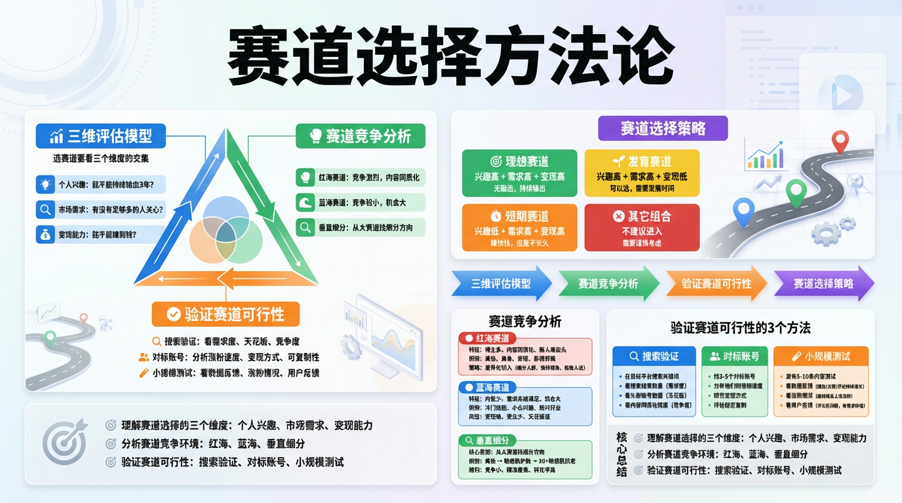

#### 方法1：搜索验证

- 在目标平台搜索关键词
- 看搜索结果数量（需求度）
- 看头部账号数据（天花板）
- 看内容同质化程度（竞争度）

#### 方法2：对标账号

- 找3-5个对标账号
- 分析他们的涨粉速度
- 研究变现方式
- 评估能否复制

#### 方法3：小规模测试

- 发布5-10条内容测试
- 看数据反馈（播放/点赞/评论持续增长）
- 看涨粉情况（能持续且上涨涨粉）
- 看用户反馈（评论区问题，有需求价值）

### 一图总结

## 5、常见误区

误区1：**只要内容好机会火**

真相：内容好只是基础，还需要懂平台规则、选题技巧、内容策略。

误区2：**追热点就能涨粉**

真相：盲目追热点会导致人设混乱、粉丝不精准。要追与定位相关的热点。

误区3：**粉丝越多越赚钱**

真相：1万精准粉丝的变现能力 > 10万泛粉。关键是粉丝质量。

误区4：**对标模仿就能成功**

真相：别人的成功有时效性和不可复制性。要学逻辑，不要抄形式，同样要结合自己的风格。

误区5：**自媒体是快钱**

真相：90%的人前3个月赚不到钱，需要积累期。做好长期准备。

> 💯
> **认知篇核心要点总结**
> ✅ **商业本质**：自媒体是流量×信任的生意
> ✅ **算法逻辑**：前3秒决定生死，数据好就持续推荐
> ✅ **用户心理**：痛点、爽点、痒点
> ✅ **赛道选择**：兴趣+需求+变现，三者交集是最优解
> ✅ **验证方法**：先小规模测试，再全力投入

# 二、基建篇-------开始很重要

## 打好内容基建的重要性

### **账号的基建，决定了后续的发展高度**

- 定位错了，后期调整成本大（粉丝流失、人设崩塌）
- 基础没打好，内容再好也难以突破
- 方向不清晰，越做越迷茫，最终会放弃

### **基建阶段的核心目标：**

- 明确定位（知道自己要做什么）
- 搭建框架（建立内容生产体系）
- 完成冷启动（获得第一批种子用户）

## 1、内容定位四件套（最重要）

###   （1）**目标人群—你的内容是给谁看的？**

**千万别说所有人，你越精准越有价值，这是核心，你要牢记住。**

#### 用户画像模板：

可以尝试使用这个用户画像模板尝试定位

> 💡
> **【基础信息】**
> - 年龄段：25-35岁
> - 性别：女性为主
> - 地域：一二线城市
> - 职业：白领/新媒体从业者
> - 收入：月入8K-2W
> **【痛点需求】**
> - 想做副业但不知道从哪开始
> - 时间有限，需要高效方法
> - 缺乏系统的学习路径
> **【内容偏好】**
> - 喜欢干货教程
> - 偏好图文+短视频结合
> - 关注实操案例
> **【消费能力】**
> - 愿意为知识付费
> - 客单价100-500元可接受
> - 信任后有复购意愿

#### 如何快速定位你的目标人群：

**问自己**：身处于客户的角度，我需要什么？（这个最容易吸引共鸣）

**看对标博主的账号中粉丝评论**，他们问什么最多，这个也是价值

**小规模的测试**：发3-5条内容，看看互动的粉丝画像

### （2）内容方向

#### 内容地图绘制方法：

我们以“职场成长”为例：

> 💡
> **核心方向：职场成长**
>     ↓
> 一级分支：
> ├─ 技能提升（Excel/PPT/写作）
> ├─ 职场人际（向上管理/跨部门沟通）
> ├─ 求职跳槽（简历优化/面试技巧）
> └─ 副业赚钱（自媒体/接单/投资）
>     ↓
> 二级分支（以副业赚钱为例）：
> ├─ 自媒体起号
> ├─ 接单平台推荐
> ├─ 时间管理方法
> └─ 收入增长案例

####     **内容策划：**

- 主线内容（70%）：核心定位，持续深耕
- 热点内容（20%）：蹭热度，扩大曝光
- 个人生活（10%）：增加人设温度

#### **避坑提示：**

- 不要什么热点都追，只追与定位相关的
- 前期内容越垂直越好，建立专业度后再横向扩展
- 每条内容问自己："这符合我的定位吗？"

### （3）人设打造——你是谁？想成为谁？

#### 差异化人设公式：

**人设=身份标签+性格特点+价值主张**

示例：

| 要素 | 普通人设 | 差异化人设 |
|-|-|-|
| **身份标签** | 美妆博主 | 95后国货美妆测评师 |
| **性格特点** | 分享护肤 | 毒舌直言+理性科普 |
| **价值主张** | 变美 | "不花冤枉钱也能养好皮肤" |

#### 人设的四个关键点：

**真实性**：别装，装不久

- 内向就做"安静"人设
- 外向就做"热情"人设

**识别度**：让人记住你

- 固定口头禅（语言钉）
- 固定开场/结尾方式
- 标志性穿搭/妆容/背景（视觉锤）

**一致性**：内容风格统一

- 语言风格：专业/幽默/治愈
- 视觉风格：配色/字体/封面
- 价值观：始终如一

**成长性**：可持续发展

- 别给自己设限（"只做新手教程"会遇天花板）
- 预留升级空间（新手→进阶→高手）

### （4）变现路径—提前规划好赚钱方式

**新手起号就要想清楚怎么赚钱，否则做到1万粉也不知道变现。**

#### 常见变现路径对照表：

| 变现方式 | 适合阶段 | 优点 | 缺点 | 收入预期 |
|-|-|-|-|-|
| **平台分成** | 5k+（具体根据平台，这里是以抖音为例） | 门槛低，自动结算 | 收益低 | 几百元/月   （粉丝量特别大的在几万块） |
| **广告合作** | 1W-10W粉 | 收益稳定 | 需要商务谈判 | 200-几千不等 |
| **带货佣金** | 5K+粉 | 收益可观 | 需选品能力 | 几千-说不准（配合直播更佳） |
| **知识付费** | 1W+粉 | 利润高 | 需要专业度 | 几千-说不准（前期短视频涨粉是为了积累专业度，后续直播是直接转化途径，收入看怎么设计商业模式，保底几千块是有的） |
| **私域变现** | 5K+粉 | 复购率高 | 运营成本高 |  |

#### **起号阶段的建议：**

- 主攻平台分成+广告（稳定现金流）
- 埋带货钩子（推荐好物建立信任，如果是知识技能类主播，就推荐使用工具）
- 规划知识产品（课程/咨询的雏形，针对知识技能类博主）

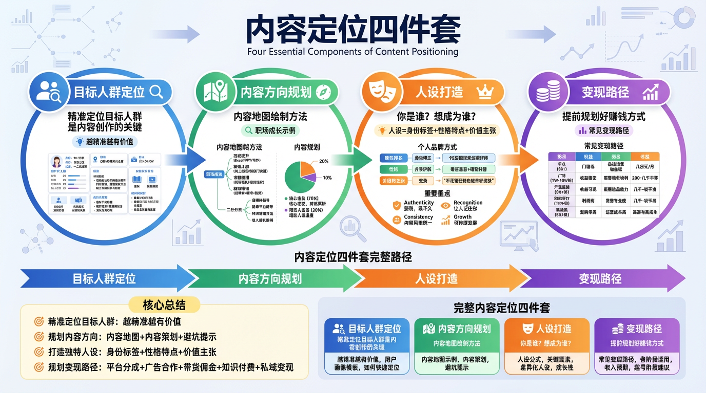

## 2、账号装修

#### （1）头像设计三原则

**识别度**

- 真人照片 > 卡通头像 > 风景物品
- 面部清晰、有眼神交流
- 色彩鲜明，不要灰暗

**专业度**

- 与定位匹配（程序员穿休闲，美妆博主精致妆容）
- 背景简洁，不要杂乱
- 画质高清

**记忆点**

- 固定元素（标志性配饰/造型）
- 特殊构图（侧脸/仰拍/特写）

**避坑：**

- 不要频繁更换头像（降低识别度）
- 不要用明星/网红照片（侵权+人设崩塌）
- 不要过度美颜（真人出镜会反差）

#### （2）昵称取名的5个技巧

**公式：定位词 + 记忆点**

**技巧1：职业/领域前置**

- ❌ "小红"
- ✅ "小红老师说职场"

**技巧2：数字具体化**

- ❌ "副业博主"
- ✅ "90天副业收入3W"

**技巧3：人群标签**

- ❌ "穿搭分享"
- ✅ "155cm小个子穿搭"

**技巧4：价值承诺**

- ❌ "理财知识"
- ✅ "每天3分钟学理财"

**技巧5：制造反差**

- ❌ "美食博主"
- ✅ "月薪3K吃出米其林"

**⚠️ 注意事项：**

- 12个字以内（太长记不住）
- 避免生僻字、符号
- 方便搜索（别用纯符号）
- 全平台统一（方便引流）

#### （3）简介撰写AIDA模型

**AIDA = Attention（吸引）→ Interest（兴趣）→ Desire（渴望）→ Action（行动）**

> 💡
> 模板示例
> 【Attention】95后｜月入5W副业博主
> 【Interest】分享自媒体从0到1全攻略
> 【Desire】帮助1000+小白实现副业收入
> 【Action】关注我，不花冤枉钱少走弯路👇

**不同定位的简介参考：**

**知识博主：**

> 前腾讯产品经理｜8年互联网经验
> 
> 用大厂方法论，解决职场实际问题
> 
> 已帮助500+人成功跳槽涨薪
> 
> 私信"资料"领职场工具包

**带货博主：**

> 专业测评5年｜拒绝广告只推好物
> 
> 花小钱买对东西，帮你避坑省钱
> 
> 合作vx：xxxxx（备注品牌名）

**生活博主：**

> 90后独居女孩｜坐标上海
> 
> 记录一人食一人居的松弛感生活
> 
> 偶尔分享省钱好物和独处思考

#### （4）背景图/置顶内容策略

**背景图用途：**

- 强化人设（个人照片/工作场景）
- 展示成果（粉丝内容反馈等）
- 号召行动（一起成为XXXX）

**置顶内容选择：**

- 新人必看（个人介绍、故事经历等）
- 爆款内容（数据最好的作品）
- 价值内容（能够体现专业度的内容）

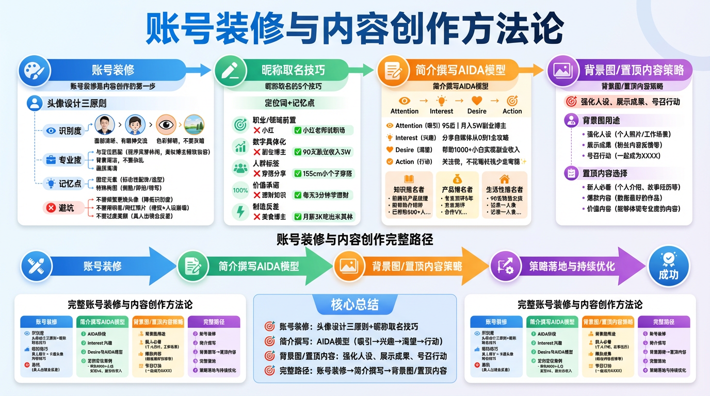

## 3、内容框架体系（建立体系化的生产体系）

### （1）选题库的建立

选题的六大来源渠道：

**① 用户提问**

- 评论区高频问题
- 私信咨询内容
- 社群讨论话题

**② 对标账号**

- 爆款内容拆解
- 选题角度借鉴（注意，可不是抄袭）
- 缺失内容补充

**③ 热点事件**

- 微博热搜
- 知乎热榜
- 行业新闻
- 抖音热榜

**④ 搜索下拉词**

- 平台搜索框输入关键词，看下拉提示（都是用户真实需求）

**⑤ 工具辅助**

- 巨量算数（抖音数据）
- 新榜（全平台热点）

**⑥ 个人经历**

- 工作中的坑
- 生活中的发现
- 学习心得总结

**提供一个简单的初期使用的选题库管理表格**

| 选题标题 | 内容类型 | 热度 | 难度 | 预期效果 | 状态 |
|-|-|-|-|-|-|
| 新手起号3大坑 | 干货教程 | 中 | 低 | 高互动 | 待制作 |
| 我的涨粉复盘 | 个人故事 | 低 | 低 | 高信任 | 已发布 |

### （2）素材库整理系统

根据我的经验，可以整理四个文件夹来构建初期的素材库，后面随着发展再进行优化调整：

**📁 文案素材库**

- 金句/名言
- 标题模板
- 开头/结尾话术
- 爆款文案拆解

**📁 视觉素材库（可以预先在剪辑软件库中分类就行）**

- 图片（按主题分类）
- 视频片段
- 转场特效
- 字体/贴纸

**📁 BGM音乐库（也可以在剪辑软件中设置分类）**

- 励志类
- 治愈类
- 搞笑类
- 悬疑类

**📁 灵感素材库**

- 截图（看到好的内容随手保存）
- 语音备忘（灵感即时记录）
- 对标账号作品收藏
- 

**💡 管理技巧：**

- 简单的话可以先使用本地或者网盘进行管理，但是我无比推荐使用AI知识库进行管理，非常适合后期提效（比如ima、notion等AI知识库工具）
- 一定要建立清晰的文件夹结构，定期整理，删除无用素材

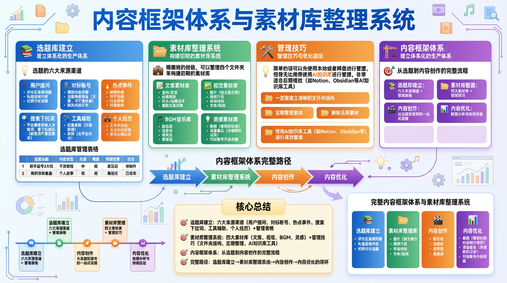

## 4、工具准备

### （1）拍摄设备

新手期准备手机就行了（这里比较推荐苹果手机，但也不是必选），一定预算范围内可以花几十上百块钱买个三脚架或者小型补光灯就行。

后期再考虑上相机、领夹麦克风等（避免选择困难症，这里就不展开讲）

注意：设备不是限制因素，很多百万大V基本还在用手机拍摄，内容为王。

### （2）剪辑软件

无论是移动端还是电脑端，新手一律用剪映就行，功能强大，新手友好。如果你有预算，推荐开通剪映SVIP（注意，需要时电脑手机都能用的那个会员版本）

### （3）图文工具

Canva(模板丰富)

稿定设计

需要开会员，如果你有条件，也可以用AI生图模型Nano Banana Pro来实现

### （4）数据分析工具

平台自带创作者中心前期足够用了，如果你有预算可以去开通蝉妈妈、西瓜数据那些（开通之前建议去某鱼平台开通体验卡先试几天）

### （5）效率工具

我建议使用AI效率工具，推荐ima、飞书文章，进阶一点的话可以使用notion。

---

> 来源：飞书 · AI Spark 知识库 ｜ 原文（最新版）：<https://lcnniolukk80.feishu.cn/wiki/SgRdwoO5ii1d5HkWCGycUno2n6g> ｜ 归档：2026-06-04
