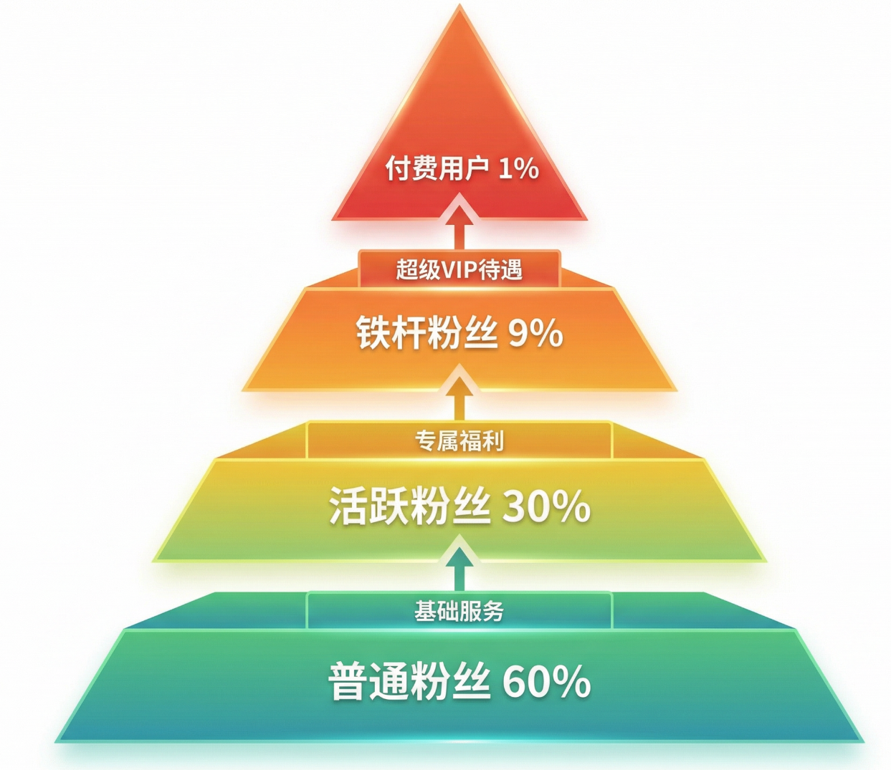

# 自媒体万字保姆级教程-下

# 三、内容篇-------高效方法+有效复盘

在自媒体领域，**内容质量决定你能走多远，**为什么这么说：

- 算法再懂你，你的内容不行一切白搭；
- 运营再精细，没有好的内容也留不住人；
- 变现再强，如果内容差粉丝也不会买账。

在内容篇，我们主要会讲两大部分：

A部分，我会讲高效创作的方法：如何生产优质的内容

B部分，我会讲一下有效的复盘方法：如何通过数据迭代优化

## Part A 高效创作方法

### 1、选题策划

#### （1）热点追踪平台

**实时热点平台**:微博热搜、知乎热榜、抖音热点，也可关注海外的类似X等平台

**行业热点平台**：虎嗅/36氪商业科技平台、自媒体行业的新榜以及抖音自己的巨量算数

注意，追热点的原则：

相关性：与你的定位相关才适合

时效性：同一热点要找不同视角，能够体现补充价值

#### （2）选题评估模型

发布前从这个5个维度来评估选题：

| 维度 | 评估标准 | 说明 |
|-|-|-|
| 话题度 | 是否有热度 | 搜索量、讨论度 |
| 共鸣度 | 是否能引发情绪共鸣 | 痛点/爽点/痒点 |
| 独特性 | 是否有差异化角度 | 避免同质化 |
| 实操性 | 是否有实用价值 | 能否落地执行 |
| 传播力 | 是否愿意转发给他人 | 利他性、表达欲 |

#### （3）爆款选题的几个公式

> 💡
> **仅供参考**
> **公式1：反常识**
> - 模板：你以为XXXX，其实是XXXXX
> - 案例：你以为早起就能成功？其实早起毁了90%的人。
> **公式2：痛点+解决方案**
> - 模板：XXXX人的痛，我找到了解决方法
> - 案例：月薪1万却始终存不下去钱？3个方法让你一年存下五万。
> **公式3：数字具体化**
> - 模板：用XXXX方法，XX天实现XXXX
> - 案例：用这3个技巧，30天涨粉5000+
> **公式4：对比冲突**
> - 模板：XXX和XXX的差距在哪？（带具象化的数据）
> - 案例：同样做自媒体，为什么她三个月就能变现，而你还在0粉阶段？
> **公式5：闭坑指南**
> - 模板：XXXX的N大坑，千万别踩（或者给代价，踩了你就XXXX）
> - 案例：新手做自媒体常犯的10个致命错误
> **公式6：揭秘内幕**
> - 模板：XXX行业不会告诉你的秘密
> - 案例：二手车老板不会告诉你的5个行业套路
> **公式7：情绪共鸣**
> - 模板：XXXX的X个瞬间，看完就哭了
> - 案例：30岁女生最扎心的10个瞬间
> 更新说明：以上为比较详细的公式指南，归纳一下通用的公式
> 公式一：痛点场景具象化=具体人群+高频痛点场景+颠覆性/可操作方法
> 示例：打工人每天加班到九点，如何用30分钟健身保持健康？教你3个办公室常用动作
> 公式二：认知颠覆与权威重构=反常识结论+权威数据/专家背书+新方法论
> 示例：“每天睡够八个小时”才是最大的误区。斯坦福教授告诉你：关键在于睡够睡眠周期
> 公式三：情感共振与群体归属=高辨识群体标签+细节化情感场景+共鸣后的出路
> 示例：35岁大厂被裁，我终于放下了房贷、体面和头发，找到了真正的生活

### 2、内容创作：详细的内容创作全流程指南

#### （1）爆款标题的16种万能模板

> 💡
> **爆款标题的16种万能模板**
> **疑问式**：                   **数字式**：                        **对比式**：                            **利益式**：                 
> “为什么XXX？”            “XXX的N个方法”             “XXX vs XXX,哪个更好？”      “让你XXX的N个技巧”
> “如何做到XXX?”          "N天实现XXX"                 “做XXX前vs做XXX后”            “不花钱也能XXX”
> “XXX真的有用吗？”      “只需N步，轻松XXX”
> **反转式**：                    **稀缺式**：                                 **带入式**：
> “别再XXXX了！”           “99%的人不知道的XXXX”          “给XXX人的建议”
> “XXX竟然是错的？”       “终于找到XXX的方法了”            “如果你也XXX，一定要看”
> **优化标题标题的一些注意事项**：
> - 字数控制在20字以内，方便手机屏幕可以完整显示；
> - 标题中要包含核心关键字，通过主动搜索获取流量；
> - 制造悬念，不说破，引发用户好奇；
> - 一定要避免标题党，所给的承诺要兑现。

#### （2）开头3秒抓人的8个钩子

| 钩子1：直接抛出结构 | 用这个方法，我30天涨粉1万       |
| ---------- | -------------------- |
| 钩子2：制造冲突反差 | 月薪三千的我，是怎么买到LV的？     |
| 钩子3：提出尖锐问题 | 为什么你这么努力，还是很穷        |
| 钩子4：展示前后对比 | 3个月前我还在负债，现在已经...... |
| 钩子5：颠覆认知   | 别再早起了！这才是成功的关键。      |
| 钩子6：营造紧迫感  | 不在不知道就晚了！平台规则早就变了。   |
| 钩子7：引发共鸣   | 30岁了还没存款的，举个手        |
| 钩子8：讲故事开场  | 凌晨3点，我收到了辞退通知.....   |

#### （3）正文结构的黄金三段论

第一段：抛出问题/现象

- 描述痛点场景
- 引发情绪共鸣
- 铺垫解决方法  

第二段：给出方法/观点

- 核心干活内容
- 分点讲解（3-5个要点）
- 案例佐证

第三段：总结升华/行动指引

- 快速总结要点
- 给出行动建议
- 引导互动

> 💡
> **结构示例**：
> 开头：“99%的人做自媒体3个月还是0收入”
> 第一段：“因为他们大部分做的都是无效努力，比如......”
> 第二段：“真正影响变现的3个关键因素是：1...2...3...”
> 第三段：“记住这3个点，关注我，下个视频我会分享如何XXX”

#### （4）结尾引导互动的CTA话术

**CTA=Call To Action（行动号召）**

**类型1：提问互动**

你遇到过这种情况吗？评论区说说

**类型2：投票选择**

下期想看A还是B？想看A的可以扣1，想看B的可以扣2

**类型3：引导关注**

更多干货教程，关注我不迷路

**类型4：福利钩子**

想要完整的资料，私信我XX自动发送（要看账号是否符合私信引流的平台规则）

**类型5：制造悬念**

最重要的第四点，我们下期会讲

**类型6：引发争议**

不信的可以试试，有效果来评论区交作业

**注意**：

每条内容最好只用1个CTA，用了太多会分散用户的注意力

要根据自己内容自然的融入，不要太生硬

不同的内容更换不同的CTA

### 3、视频制作/图文排版

#### （1）视频制作的关键要素

镜头语言基础：

特写镜头：强调情绪、细节


中景镜头：展示人物和环境


全景镜头：交代整体场景


画面构图：

- 三分法：主体放在画面1/3处
- 对称构图：稳定、正式感
- 引导线：利用线条引导视线

#### （2）BGM选择技巧

根据内容情绪选择

| 内容类型 | 音乐风格 | 推荐曲风 |
|-|-|-|
| 干货教程 | 轻快、简洁 | 钢琴、电子 |
| 情感故事 | 治愈、温暖 | 吉他、弦乐 |
| 搞笑段子 | 欢快、魔性 | 流行、鬼畜 |
| 悬念反转 | 紧张、神秘 | 电音、悬疑 |

注意：

- 音量适中（不要盖过人声）
- 全程一致（不要中途换BGM）
- 版权合规（用平台音乐库）

#### （3）图文排版的美学原则

**排版四大原则：**

**① 对齐**

- 文字左对齐或居中
- 图片统一对齐方式
- 避免杂乱无章

**② 对比**

- 标题与正文大小对比
- 颜色深浅对比
- 关键信息突出

**③ 重复**

- 统一字体（不超过3种）
- 统一配色（主色+辅色）
- 统一风格元素

**④ 亲密**

- 相关内容靠近
- 段落间留白
- 分组清晰

**配色建议：**

- 主色：品牌色，贯穿全文
- 辅色：1-2种，配合主色
- 避免：花哨、刺眼、对比度过低

### 4、AI辅助创作的正确姿势

**AI可以帮你做什么：**

✅ 选题灵感（输入关键词生成选题）

✅ 文案框架（生成大纲和结构）

✅ 标题优化（批量生成标题备选）

✅ 文字润色（提升表达）

✅ 数据分析（总结爆款规律）

**AI不能代替的：**

❌ 真实经历和个人观点

❌ 情绪表达和人设温度

❌ 独特洞察和深度思考

❌ 与粉丝的真实互动

**使用原则：**

- AI生成的内容要人工审核和优化
- 添加个人经历和真实案例
- 标注AI生成（部分平台要求）
- 保持内容的人性化和温度

## Part B 高效复盘方法

### 1、数据分析维度

#### （1）核心数据指标解读

播放数据

| 指标 | 健康标准 | 问题诊断 |
| --- | --- | --- |
| 播放量 | 健康标准是根据内容类型调整的，这块可以筛选大盘数据获得 | 低于标准=被限流或内容质量差 |
| 完播率 | 低=开头不吸引或内容冗长 |  |
| 平均播放时长 | 低=中间内容不吸引 |  |

互动数据

| 指标 | 健康标准 | 提升方法 |
|-|-|-|
| 点赞率 | >3% | 内容有价值、引发共鸣 |
| 评论率 | >0.5% | 设置争议点、提问互动 |
| 转发率 | >0.3% | 利他性强、有表达欲 |
| 收藏率 | >1% | 实用干货、需要保存 |

**粉丝数据：**

- 涨粉率：每条内容带来的新增粉丝
- 粉丝活跃度：粉丝互动比例
- 粉丝粘性：老粉回访率

#### （2）用户画像分析

**查看平台提供的数据：**

- 年龄分布
- 性别比例
- 地域分布
- 活跃时段
- 兴趣偏好

**根据画像调整策略：**

- 内容风格（年轻人→轻松幽默，中年人→稳重实用）
- 发布时间（根据活跃时段）
- 选题方向（根据兴趣偏好）

#### （3）流量来源拆解

**流量来源类型：**

- **推荐流量**：算法推荐（占比越高越好）
- **搜索流量**：关键词搜索（说明有长尾价值）
- **主页流量**：粉丝主动访问（说明粘性高）
- **其他流量**：转发、合集等

**优化策略：**

- 推荐流量低→优化标题和开头3秒
- 搜索流量低→增加关键词和SEO优化
- 主页流量低→提升人设吸引力和内容质量

#### （4）竞品对比分析

建立竞品分析表：

| 对标账号 | 粉丝数 | 内容类型 | 发布频率 | 爆款特征 | 变现方式 |
|-|-|-|-|-|-|
| 账号A | 10W | 干货教程 | 日更2条 | 标题数字化 | 带货+课程 |
| 账号B | 8W | 案例故事 | 隔天1条 | 情感共鸣 | 广告+咨询 |

**对比维度：**

- 他们的爆款有什么共同点？
- 他们的内容结构是怎样的？
- 他们如何与粉丝互动？
- 他们的变现方式可以借鉴吗？

### 2、复盘迭代流程（适用于稳定阶段或者有了一定的团队规模的情况）

#### (1) **每日复盘**

**复盘内容：**

✅ 今日发布内容的数据表现

✅ 与昨日对比（涨/跌）

✅ 评论区反馈

✅ 新增粉丝数

✅ 私信咨询情况

**记录表格：**

| 日期 | 标题 | 播放量 | 点赞 | 评论 | 转发 | 涨粉 | 备注 |
|-|-|-|-|-|-|-|-|
| 1/14 | XXX | 5000 | 150 | 20 | 5 | 30 | 数据较好 |

#### (2) **每周复盘**

**复盘重点：**

1. **数据汇总**：本周总播放、总涨粉、平均数据
2. **爆款分析**：本周表现最好的3条内容，共同点是什么？
3. **失败分析**：表现差的内容，问题在哪里？
4. **粉丝反馈**：高频问题、需求、建议
5. **下周计划**：根据数据调整选题和策略

---

#### (3) **每月复盘**

**深度复盘：**

1. **月度数据报告**：总播放、总涨粉、增长曲线
2. **内容分类统计**：哪类内容表现最好？占比多少？
3. **粉丝画像变化**：新增粉丝的特征
4. **变现数据**：收入来源、金额、转化率
5. **竞品动态**：对标账号的新动向
6. **战略调整**：是否需要调整定位、内容方向？

---

#### (4) **A/B测试的实施方法**

**什么是A/B测试？**

同一内容的不同版本，测试哪个效果更好。

**可测试的元素：**

- 标题（2个版本）
- 封面（2个版本）
- 开头方式（直接开门见山 vs 故事引入）
- 视频时长（30秒 vs 60秒）
- 发布时间（早上 vs 晚上）

**测试方法：**

1. 同一内容，制作2个版本
2. 在不同时间或平台发布
3. 对比数据
4. 保留效果好的版本

**案例：**

> 标题A："新手做自媒体的5个技巧"→播放3000
> 
> 标题B："为什么你做自媒体3个月还不赚钱？"→播放8000
> 
> 结论：问题式标题更吸引人

---

#### (5) **爆款内容的拆解还原**

**拆解步骤：**

**第1步：数据确认**

- 播放量是平时的几倍？
- 哪个数据维度特别突出？

**第2步：选题分析**

- 选题是什么类型？（干货/情感/热点）
- 切中了什么痛点/爽点/痒点？

**第3步：结构拆解**

- 标题用了什么公式？
- 开头前3秒说了什么？
- 正文如何展开的？
- 结尾如何引导的？

**第4步：细节研究**

- BGM选择
- 画面节奏
- 文案金句
- 互动设计

**第5步：复制迭代**

- 提取可复用的元素
- 应用到新内容中
- 持续测试优化

---

#### (6) **失败内容的问题诊断**

**诊断清单：**

**播放量低？**

- ❌ 标题不吸引
- ❌ 封面不清晰
- ❌ 发布时间不对
- ❌ 话题标签不精准

**完播率低？**

- ❌ 开头3秒没抓住人
- ❌ 内容冗长拖沓
- ❌ 节奏太慢
- ❌ 信息密度低

**互动率低？**

- ❌ 内容没有价值感
- ❌ 缺少互动引导
- ❌ 观点不够鲜明
- ❌ 没有引发情绪

**涨粉少？**

- ❌ 人设不清晰
- ❌ 内容没有差异化
- ❌ 缺少关注理由
- ❌ 简介不吸引

# 四、运营篇-------系统化的形成

> 💡
> 为什么需要系统化的运营
> **内容是基础，运营是放大器**
> - 同样的内容，会运营的人能涨粉3倍
> - 同样的粉丝，会运营的人变现能力强5倍
> - 系统化运营让你从个体户变成正规军
> **运营篇包含X个核心板块：**
> 1. 粉丝运营：建立信任，提高粘性
> 2. 涨粉策略：突破增长瓶颈
> 3. 平台规则：适配不同平台
> 4. 危机公关：应对突发情况
> 注意：运营篇适合有一定规模的IP个人或者团队，小白先从头开始。

## 1、粉丝运营

### （1）评论区互动的黄金24小时

**为什么评论区如此重要？**

- 算法会根据评论数量和质量判断内容价值
- 评论区是与粉丝建立关系的最佳场所
- 评论区的二次创作能带来额外流量

**黄金24小时运营法：**

**0-1小时（关键期）**

✅ 立即回复前10条评论（提高互动率）

✅ 点赞所有评论（让用户有被看见的感觉）

✅ 精选优质评论置顶（引导讨论方向）

✅ 自己发1-2条引导性评论（抛出话题）

**1-6小时（黄金期）**

✅ 每小时检查1次，回复新增评论

✅ 对提问类评论详细回答

✅ 对质疑类评论理性解释

✅ 对赞美类评论真诚感谢

**6-24小时（持续期）**

✅ 每3-4小时检查1次

✅ 持续互动保持活跃度

✅ 挖掘高质量评论作为下期选题

**24小时后**

✅ 重要评论仍需回复

✅ 关注数据变化

✅ 记录典型问题

### （2）私信管理的标准话术库

注意：私信的处理方式各个平台各不相同，如果不是规模化用户，且是蓝V或者矩阵的，稳妥起见还是私信以日常交流为主。

**私信分类处理：**

**类型1：咨询类（60%）**

- 问题："怎么开始做自媒体？"
- 回复模板：

```Plain Text
感谢关注！🌟
新手起号建议：
1. 先确定定位（看我置顶视频）
2. 准备10条选题
3. 坚持更新30天

我整理了一份《新手起号手册》
需要的话可以私信"起号"自动获取～   （结尾要注重合规，个人账号就不用发这个了）
```

**类型2：合作类（20%）**

- 问题："能合作推广吗？"
- 回复模板：

```Plain Text
##注意：这块的合作走平台或者主页联系方式引导到私域再谈，具体话术可以通过下方的模板，注意不要直接私信发送，
你好！合作请发送：
1. 品牌/产品介绍
2. 合作形式
3. 预算范围
我会在2个工作日内回复
```

**类型3：求资料类（15%）**

- 问题："有XXX资料吗？"
- 回复模板：

```Plain Text
有的！私信回复关键词"XXX"
系统自动发送给你～
记得关注不迷路哦💕
```

**类型4：质疑/投诉类（5%）**

- 问题："你说的不对..."
- 回复模板：

```Plain Text
感谢你的反馈！
确实每个人情况不同
我分享的是我的经验和观点
仅供参考，欢迎理性讨论～
```

**💡 私信管理技巧：**

- 设置快捷回复（常见问题模板化）
- 每天固定时间集中回复（早晚各1次）
- 重要私信单独标记跟进
- 用自动回复工具提高效率(注意合规)

### （3）粉丝运营

粉丝金字塔模型



不同层级的运营策略：

**普通粉丝（泛关注）**：

策略：持续输出优质内容

目标：提高触达率和互动率

方法：优化标题和选题方法

**活跃粉丝（高互动）**：

策略：增加互动频次

目标：培养铁粉

方法：评论区特别回复、专属话题等等

**铁杆粉丝、付费用户**

策略：建立深度链接，提供超预期的服务

目标：提高付费率或者成为传播者

方法：专属社群、1对1服务、独家资源、线下会谈等等

识别方法：

普通粉丝：看了就走

活跃粉丝：经常点赞评论

铁杆粉丝：每条内容必评论，主动分享

付费用户：购买产品/服务

### （4）社群搭建与维护

要不要搭建社群，以下几种场景适合搭建社群：

✅ 知识付费（课程、咨询）

✅ 会员制（提供持续服务）

✅ 垂直领域（强需求、高粘性）

✅ 已有铁杆粉丝基础（1000+活跃粉）

不适合建群：

❌ 纯带货账号（转化路径短）

❌ 泛娱乐账号（粉丝粘性低）

❌ 粉丝基数小（<1000人）

❌ 没有运营能力（群会很快死掉）

社群运营SOP：

**日常运营（每天）**

- 早安问候+今日话题
- 回答群内提问
- 分享1条干货/资讯
- 晚安总结

**每周活动**

- 周一：本周计划发布
- 周三：案例拆解/经验分享
- 周五：答疑专场/直播预告
- 周日：本周总结+下周预告

**每月福利**

- 专属资料包更新
- 线上分享会

**群规设置：**

1. 禁止广告（除指定时间）
2. 禁止人身攻击
3. 鼓励提问和分享
4. 违规3次移出

## 2、涨粉策略（突破增长瓶颈）

### （1）**自然涨粉 vs 付费投流**

**自然涨粉（免费）**

**优势：**

✅ 零成本

✅ 粉丝质量高

✅ 可持续

**劣势：**

❌ 速度慢

❌ 依赖内容质量

❌ 有运气成分

**方法：**

- 持续输出优质内容
- 追热点蹭流量
- 与用户深度互动
- 利用平台扶持政策

---

**付费投流（花钱）**

**优势：**

✅ 速度快

✅ 可控性强

✅ 突破冷启动

**劣势：**

❌ 需要成本

❌ 粉丝可能不精准

❌ ROI难把握

**投放平台：**

- 抖音：DOU+
- 小红书：薯条
- B站：充电推广
- 视频号：付费推广

**投放策略：**

```Plain Text
第1步：选择已有数据的优质内容（点赞>100）
第2步：小额测试（投100-200元）
第3步：观察数据（涨粉成本、互动率）
第4步：ROI合适就加大投入，不合适就停止
```

**ROI计算：**

```Plain Text
涨粉成本 = 投放金额 / 新增粉丝数
建议：涨粉成本<2元可持续投放
```

切片涨粉：

最近新出的一种打法，当你有了一定的声量和铁粉之后，可以通过你的商业化产品，引导并培养切片团针对你的短视频、直播内容进行切片，发出去后引流。

### （2）互推合作

什么是互推？

两个账号互相推荐对方，实现粉丝互换。抖音官方有个共创功能，不过对粉丝有一定的要求。

互推对象筛选的五个标准

a.粉丝量相当

如果你有一万粉，那就找5000-15000上下差距不大的，差距太大的别人很难跟你合作。

b.定位相关但不涉及直接竞争的

比如你们都是AI领域的，你是做智能体的，他是做AI绘画的这样的。

c.粉丝画像相似

年龄、性别、兴趣、消费能力相近，可以通过看对方评论区粉丝画像看到。

d.数据、内容健康

互推形式：

可以通过共创，主页介绍等方式，深度合作也可以通过视频、直播连麦。

### （3）矩阵账号的协同运营

什么是账号矩阵？

围绕主账号，建立多个子账号，形成矩阵效应。

矩阵类型：

类型1：垂直细分矩阵

主账号：自媒体成长

账号2：小红书运营专项

账号2：视频号运营专项

账号3：抖音运营专项

类型2：人设矩阵

主账号：个人IP（真人出镜）

账号2：知识分享（纯干货）

账号3：日常vlog（生活分享）

账号4：案例拆解（深度认知）

类型3：平台矩阵

抖音账号（主阵地）

小红书账号（同步原则）

视频号账号（同步内容）

B站账号（长视频版本）

协同策略：

主账号导流到子账号

子账号相互引流

内容复用降低成本

风险分散（一个账号出问题不影响全局）

有了一定规模可以通过规模化切片方式扩大矩阵团队

注意事项：

一机一号原则

账号要保持人设

不要过度导流导致违规

### （4）跨平台引流玩法

**引流路径设计：**

```Plain Text
公域流量（短视频平台）
    ↓ 内容吸引
半私域（个人主页/社群）
    ↓ 信任建立
私域流量（微信/企微）
    ↓ 深度服务
付费转化（产品/服务）
```

各平台引流方法

**抖音→微信（导流管理最严重，最好通过销售引流）**

- 简介：留"合作私信"等引导语（注意VX号不能太像微信）
- 评论区：引导主页或者橱窗商品
- 直播间：口播引导购买商品（人数不是很多的话适当引导主页导流）
- 橱窗：挂自己的课程/服务

**小红书→微信**

- 私信：谐音字（VX、薇信、wēi xìn）
- 图片：水印、暗号（图片里藏信息）
- 留钩子："需要详细资料的dd我"

**视频号→微信**

- 直接引导关注公众号
- 公众号自动回复加微信

**B站→微信**

- 个人动态：可留联系方式
- 视频简介：可留邮箱等信息
- 充电专属：付费用户给微信

**⚠️ 引流注意：**

- 各平台规则不同，要严格遵循规则，一旦被警告，第一时间停止导流行为
- 不要太急，先建立信任
- 给用户加你的理由（福利、资料、服务）

## 3、平台规则（各平台特殊机制）

### （1）抖音

**平台特点：**

- 最大流量池
- 推荐算法强
- 商业化完善

**特殊规则：**

✅ 完播率>点赞率（根据视频时长）

✅ 前5秒极其关键

✅ 话题标签必须带（增加曝光）

✅ 发布时间：在有了一定的粉丝基数的时候，根据自己的粉丝画像决定发布时间。

**涨粉技巧：**

- 多拍和定位相关的活动、热点（蹭流量）
- 开直播（推荐会加权）
- DOU+助推爆款

**变现路径：**

广告、带货、打赏、知识付费

### （2）小红书

**平台特点：**

- 女性用户为主（70%）
- 种草属性强
- 前期图文为主，现在也在推视频和长文

**特殊规则：**

✅ 标题要有搜索关键词

✅ 严禁软广不报备

✅ 首图最关键（决定点击率）

**涨粉技巧：**

- 做爆款笔记（收藏数很重要）
- 合集专栏（提高粘性）
- 评论区运营（小红书评论区流量大）

**变现路径：**

品牌合作、直播带货、专业号挂链接、知识付费

### （3）视频号

**平台特点：**

- 微信生态内
- 私域流量强
- 中年用户多

**特殊规则：**

✅ 社交推荐为主（朋友点赞你能看到）

✅ 与公众号打通（互相导流）

✅ 直播权重高

✅ 转发到群聊/朋友圈有加权

**涨粉技巧：**

- 引导点赞转发（裂变传播）
- 公众号导流（文章嵌入视频）
- 直播连麦（互相导流）

**变现路径：**

直播带货、公众号引流、企业微信转化

### （4）B站

**平台特点：**

- 年轻用户（Z世代）
- 长视频为主
- 社区氛围强

**特殊规则：**

✅ 播放完成度很重要（做长视频要有节奏）

✅ 投币/收藏权重高

✅ 标题、封面、标签要精准

✅ 转载必须标注来源

**涨粉技巧：**

- 做系列内容（连续性强）
- 参与话题活动
- UP主互动（评论区互动）

**变现路径：**

创作激励、充电计划、广告植入、知识付费

### （5）算法更新的应对策略

平台算法会经常调整，针对变化我们该怎么办？

应对原则：

- 以不变应万变：优质内容永远是核心
- 快速测试：快速迭代测试，算法变得时候，保证自己一直在测试新内容
- 多平台布局：不要把鸡蛋放一个篮子里
- 关注官方公告：第一时间了解规则变化

信息来源：

- 平台创作者中心公告
- 官方创作者社群
- 行业媒体（新榜、卡思数据等）
- 同行交流群

### （6）违规处理的申诉流程

被平台处罚后：

<1>了解原因

查看违规通知

确认具体违反了哪条规则（会有没有具体规则的情况，如果没有，直接进入第二条）

<2>评估申诉价值

确认违规→认罚，不再申诉

误判或者模糊违规→立即申诉（申诉两次不通过之后，有隐形规则，别再申诉了）

<3>准备申诉材料

- 说明情况（客观、简洁）
- 提供证据（截图、数据）
- 承诺整改（表明态度）

<4>:提交申诉

- 通过平台申诉入口
- 等待审核（一般3-7天左右）
- 持续跟进

**申诉模板：**

```Plain Text
尊敬的XXX平台审核团队：

我的账号【XXX】于XX月XX日收到违规通知，
原因是【XXX】。

经核实，该内容【说明情况，如：
引用已标注来源/使用平台音乐库音乐/无违规内容等】。

附上相关证明材料【附图】。

请求平台重新审核，恢复内容/解除处罚。
今后将更加严格遵守平台规则。
```

**💡 申诉技巧：**

- 态度诚恳
- 逻辑清晰
- 证据充分
- 不卑不亢

# 五、商业化篇

商业化是最后的大考，它关系着你能不能长久且健康的活下去。

做自媒体不谈钱，就是在耍流氓。

没有变现，做不长久，热情会在时间中被消耗；

没有收入，就没办法全力投入，持续增长，最后就会变成一个持续玩玩

商业化并不可耻，提供价值就应该获得回报

**商业化的核心原则：**

✅ **先价值后变现**：先给用户价值，再考虑赚钱

✅ **多元化收入**：不要单一变现渠道

✅ **长期主义**：不做一锤子买卖

✅ **真诚透明**：推荐的东西自己要用过

## 1、变现模式全盘点

### （1）平台分成（平台规则和要求一直在变，具体以官方为主，仅供参考）

适合阶段：0-5000粉

| 平台 | 计划名称 | 开通条件 |
|-|-|-|
| 抖音 | 伙伴计划、种草计划等 | 5000有效粉  <br/>实名认证  <br/>公开作品数大于20 |
| B站 | 创作收益 | 1000粉+播放10万 |
| 视频号 | 创作者分成 | 1000粉 |
| 小红书 | 创作者中心 | 500粉 |
| 公众号 | 流量主 | 粉丝100 |

收益预估（仅供参考）：

日均10万播放≈300-500/月

日均50万播放≈1500-2500/月

日均100万播放≈3000-5000/月

提升技巧：

有效粉丝、互动率的收益更高

抖音的话，抖音精选的收益系数更高一点

### （2）广告合作（稳定，但是对账号数据要求高）

适合阶段：1万-10万粉

广告类型：

<1>品牌植入

形式：在内容中植入品牌或者产品

报价：500-5000/条（具体看粉丝量和数据）

<2>口播广告

形式：专门介绍产品

报价：1000-10000/条

<3>定制广告

形式：为品牌定制一整条广告

报价：2000-2w+

报价参考公式：

```Plain Text
基础报价 = 粉丝数 × 0.05-0.1元
实际报价 = 基础报价 × 数据系数 × 行业系数

数据系数：
- 互动率>5%：1.5倍
- 互动率3-5%：1.2倍
- 互动率<3%：0.8倍

行业系数：
- 美妆护肤、数码科技：1.5-2倍
- 母婴教育、职场成长：1.2-1.5倍
- 泛娱乐：0.8-1倍
```

接广告渠道：

- 星图（抖音官方）
- 蒲公英（小红书官方）
- 微播易（第三方平台）
- 平台方或者第三方媒介公司直接联系

### （3）带货

**适合阶段：** 5000粉以上

**带货形式：**

**① 橱窗带货（抖音/快手）**

- 开通条件：1000粉+缴纳保证金（现在有些应该先不缴纳，后续通过货款补齐）
- 佣金比例：10-50%
- 月收入：3000-10万+（差距极大）

**② 直播带货**

- 开通条件：1000粉+实名
- 佣金比例：10-50%
- 月收入：5000-50万+

**③ 种草带货（小红书）**

- 开通条件：专业号+1000粉
- 佣金比例：10-30%
- 月收入：2000-5万+

**选品策略：**

| 选品维度 | 标准 |
|-|-|
| **佣金率** | >30%（低于30%不值得推） |
| **价格** | 50-300元（转化率最高） |
| **评分** | >4.7分（低了伤口碑） |
| **类目** | 与定位相关 |
| **复购** | 优先选消耗品 |

**带货公式：**

```Plain Text
带货收入 = 曝光量 × 点击率 × 转化率 × 客单价 × 佣金率

提升关键：
- 曝光量：内容质量+投流
- 点击率：产品吸引力+话术
- 转化率：信任度+价格优势
```

**💡 带货技巧：**

- 自己先用，真实体验
- 展示效果，前后对比
- 限时福利，制造稀缺
- 粉丝专属，增强归属感

### （4）知识付费（利润最高）

**适合阶段：** 1万粉以上+有专业度

**产品形式：**

**① 付费社群**

- 定价：99-599元/年
- 内容：专属资料+答疑+人脉
- 转化率：1-3%
- 案例：自媒体成长社群，299元/年

**② 线上课程**

- 定价：99-2999元
- 形式：录播课/训练营
- 转化率：0.5-2%
- 案例：《30天自媒体起号特训营》，999元

**③ 1对1咨询**

- 定价：500-5000元/小时
- 形式：语音/视频咨询
- 转化率：0.1-0.5%
- 案例：个人IP咨询，1500元/次

**④ 陪跑服务**

- 定价：3000-3万元
- 形式：长期指导+作业批改
- 转化率：0.1-0.3%
- 案例：90天自媒体陪跑，9999元

注意：线下培训涉及到的流程、服务比较复杂，这里先不过多阐述。

**知识付费要点：**

- 先免费输出建立信任
- 课程质量>营销话术
- 提供超预期服务
- 持续迭代优化

### (5）私域变现（可持续）

**什么是私域？**

把粉丝从公域平台（抖音、小红书）导入私域（微信、企微），进行深度运营和多次变现。

**私域变现路径：**

```Plain Text
公域引流（短视频、直播、图文吸引）
    ↓
添加微信/企微（福利钩子）
    ↓
朋友圈种草（建立信任）
    ↓
社群转化（限时优惠）
    ↓
持续复购（会员制/新品）
```

**私域变现产品：**

- 课程/咨询
- 社群会员
- 带货推荐
- 定制服务

**优势：**

- 不受平台限制
- 可反复触达
- 转化率更高（有信任基础）
- 终身价值大

**💡 私域运营要点：**

- 不要一加就卖货（养熟周期14-30天）
- 朋友圈内容比例：价值70%+生活20%+广告10%
- 社群要有仪式感（入群欢迎、日常互动）
- 提供超预期服务（VIP待遇）

劣势：平台针对私域会越来越严，毕竟不可控性太强。

## 2、各阶段变现策略

### **0-1000粉：冷启动期**

**变现重点：** 先不急着赚钱，专注内容和涨粉

**可做：**

✅ 开通平台分成（满足门槛的可以开）

✅ 测试选题和内容方向

✅ 建立内容生产流程

**不建议：**

❌ 接低价广告（伤口碑）

❌ 着急做付费产品（没人买）

❌ 卖三无产品（账号会废）

**心态：** 投资期，积累势能

### **1000-1万粉：成长期**

**变现重点：** 小额变现，验证商业模式

**主要收入：**

- 平台分成：500-2000元/月
- 小额广告：500-2000元/条
- 低价产品：99-299元

**策略：**

✅ 接与定位相关的广告（选择性接）

✅ 推出低价产品测试市场

✅ 开始养私域

**月收入预期：** 3000-8000元

### **1万-5万粉：突破期**

**变现重点：** 多元化变现，提高单粉价值

**主要收入：**

- 品牌广告
- 带货佣金
- 知识付费

**策略：**

✅ 提高报价（有议价权了）

✅ 推出中高价产品（599-1999元）

✅ 初步建立私域流量池

**月收入预期：** 1万-5万元

### **5万-10万粉：稳定期**

**变现重点：** 规模化变现，建立团队

**主要收入：**

- 品牌广告
- 带货/直播
- 知识付费：5万-20万/月

**策略：**

✅ 招助理（运营、剪辑）

✅ 矩阵化（多账号）

✅ 标准化（SOP流程）

**月收入预期：** 5万-30万元

### **10万+粉：商业化期**

**变现重点：** IP化运营，打造商业闭环

**主要收入：**

- 品牌广告：10万-50万/年
- 直播/带货：10万-100万/月
- 知识付费/私域：10万-50万/月
- IP授权/衍生：5万-50万

**策略：**

✅ 成立公司/工作室

✅ 打造个人品牌

✅ 开发自有产品

✅ 投资孵化（帮助其他创作者）

**月收入预期：** 30万-100万+元

## 3、长期价值打造

### （1）个人IP的护城河

**什么是护城河？**

别人无法轻易复制的竞争优势。

**打造护城河的5个维度：**

**① 专业度**

- 持续学习精进
- 成为细分领域专家
- 用结果证明实力

**② 独特性**

- 差异化人设
- 独特的表达风格
- 标志性的视觉符号

**③ 信任度**

- 长期真诚输出
- 推荐的东西都靠谱
- 言行一致

**④ 系统化**

- 完整的内容体系
- 成熟的商业模式
- 可复制的方法论

**⑤ 影响力**

- 行业地位
- 媒体曝光
- 学员/粉丝成果

### （2）商业模式的升级路径

**Level 1：出卖时间**

- 接广告、做咨询
- 收入=时间×单价
- 天花板：个人精力

**Level 2：产品化**

- 做课程、卖产品
- 收入=产品×销量
- 天花板：市场规模

**Level 3：规模化**

- 建团队、做矩阵
- 收入=账号数×单账号收入
- 天花板：管理能力

**Level 4：平台化**

- 做MCN、孵化IP
- 收入=签约IP数×分成
- 天花板：资源整合能力

**升级时机：**

- Level 1→2：月收入稳定3万+
- Level 2→3：月收入稳定10万+
- Level 3→4：年收入稳定500万+

### （3）多元化布局策略

**不要把鸡蛋放在一个篮子里**

**横向扩展：**

- 多平台布局（抖音+小红书+视频号+公众号）
- 多账号矩阵（主号+垂直号）
- 多内容形式（图文+短视频+直播）

**纵向延伸：**

- 上游：内容生产工具/课程
- 中游：个人IP打造
- 下游：变现服务/资源对接

**跨界合作：**

- 与其他领域KOL联名
- 开发联名产品
- 打造IP生态

**风险对冲：**

- 收入来源多元化（广告+带货+课程+私域）
- 资产配置多元化（现金+投资+固定资产）
- 时间分配多元化（创作+运营+学习+休息）

### （4）团队化运作的时机

**什么时候需要招人？**

**信号1：** 自己忙不过来，影响内容质量

**信号2：** 月收入稳定5万+，能覆盖人力成本

**信号3：** 有明确的团队分工需求

**团队配置建议：**

**阶段1：个人单干（0-3万/月）**

- 全部自己做
- 外包低价值工作

**阶段2：1-2人小团队（3-10万/月）**

- 你：内容创作+出镜
- 助理：剪辑+运营

**阶段3：3-5人核心团队（10-30万/月）**

- 你：内容策划+出镜
- 编导：选题+脚本
- 摄影/剪辑：拍摄+后期
- 运营：数据+商务

**阶段4：10人+专业团队（30万+/月）**

- 内容：策划/编导/摄影/剪辑
- 运营：平台运营/社群运营
- 商务：商务合作/品牌对接
- 行政：财务/人事

**💡 招人原则：**

- 宁缺毋滥
- 能力>学历
- 价值观匹配>技能
- 给股权/分成（留住核心人才）

---

> 来源：飞书 · AI Spark 知识库 ｜ 原文（最新版）：<https://lcnniolukk80.feishu.cn/wiki/FlG1wjOfwiay5VkNwDdcGahknhf> ｜ 归档：2026-06-04
