# Agent Skill时代不写代码也该懂的工具: Git，其实就是程序员经常喝的一瓶后悔药


git 可以说是程序员的必备工具，但它并不是只有程序员才需要。在当前Vibe Coding不仅仅为了程序员而设计的情况下，很多对文件比如word ppt excel、md、txt等等众多文件编辑领域，由于在AI的加持下，它的变化太多了，有时候随便聊聊，可能文件中的内容就变了，但是有时候又想回看之前的版本。就变得毫无章法了。这里就跟程序员的代码类似，程序员只要提交过，就可以随时进行追溯查看。

你看，程序员都可以吃**后悔药**，我们普通人为什么不可以呢？

既然要深入讲**后悔药**这个点，那我们就把 Git 想象成一瓶药效极其强大，不但能治病还能预防的神奇后悔药。

普通的撤销（Ctrl+Z）只能让你退回几步，一旦软件关了、或者电脑重启了，后悔药就失效了。

而 Git 这瓶后悔药，有以下 4 种不同维度的吃法，专治各种早知今日，何必当初呢

## 第一种吃法：定点穿越药（存档回滚）

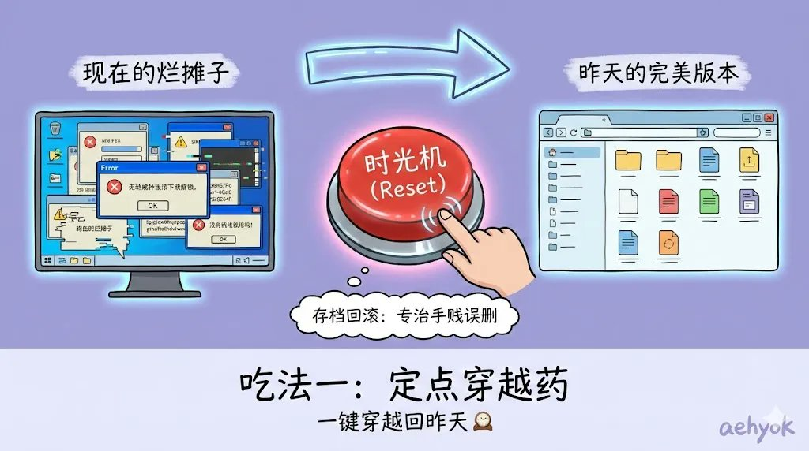

专治：哎呀！手贱把昨天写好的那段最精彩的剧情删了，而且已经保存覆盖了！

我们平时写文档，点击保存，旧的内容就被新的覆盖了，旧的就死了，找不回来了。

但在 Git 的世界里，并没有覆盖这个概念，只有叠加。

每次你操作Git 的保存（提交），它不是覆盖旧文件，而是给当前所有文件的状态拍了一张快照，并生成一个编号。

药效：一个月后，你发现今天改的内容全是垃圾，想找回一个月前的版本。你只需要告诉 Git：我要吃那颗编号为 X 的后悔药。

结果：哪怕中间你改了一万次，Git 也能瞬间把你带回到一个月前那个下午的状态，连标点符号都不差。

## 第二种吃法：成分分析药（差异对比）

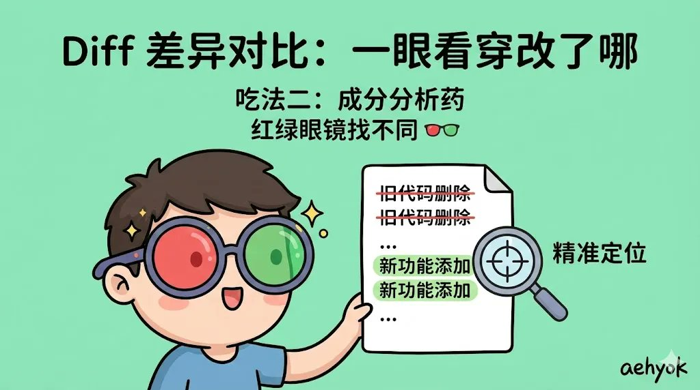

专治：我觉得现在的版本不对劲，但我忘了到底改了哪里，也不记得原来的版本是啥样了。

很多时候，我们的后悔不是全盘推翻，而是想不起来。比如你觉得文章读起来变别扭了，但不知道是哪句话的问题。

药效：Git 这颗药吃下去，它会给你一副红绿眼镜。

结果：它会把“现在的你”和“昨天的你”放在左右两边对比,或者上下。

你删掉的字，它用红色标出来。

你新增的字，它用绿色标出来。

你一眼就能看到：哦！原来我把这句关键的形容词给删了！然后只把这一句抓回来就行，不用整个文件回退。

## 第三种吃法：处方说明书（提交日志）

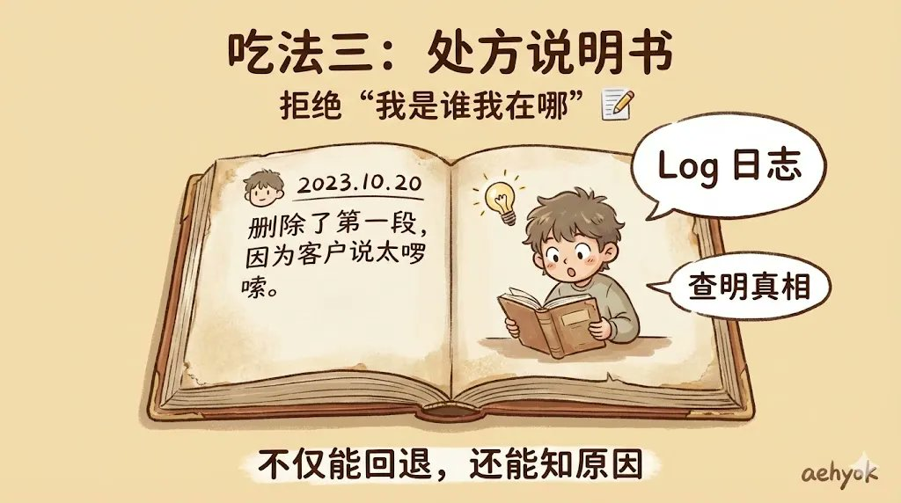

专治：这行奇怪的代码（或这段文字）是谁写的？为什么要这么写？我是脑子进水了吗？

几个月后，你看到自己写的一段东西，可能会感到莫名其妙，后悔当初没写个备注。

药效： Git 强制要求你在每次存后悔药的时候，写一张病情描述（也就是备注，比如：删除了第一段，因为客户说太啰嗦）。

结果： 一年后的你，看着这行被删掉的字发呆时，翻开 Git 的病历本，上面清楚地写着你当时的理由。你就会释怀：哦，原来是客户要求的，那没事了。——它治好了你不明不白的后悔。

## 第四种吃法：试错安慰剂（分支隔离）


专治：我想大改一下，但万一改废了，原来的也回不来了，所以我不敢动。

这种后悔叫做因为害怕而没敢去尝试的后悔。

药效： Git 允许你把当前的完美版本冷冻起来，然后复制一个一模一样的克隆体给你去折腾。

结果： 你在克隆体上随便乱改，改得天翻地覆。

改废了？没事，一键销毁克隆体，把冷冻的本体解冻，就像什么都没发生过。

改好了？太棒了，把克隆体的内容吸收到本体里。

作用：它让你在做任何危险操作前，都拥有一颗绝对兜底的后悔药，让你敢于去作死。

## 准备吧

上面简单介绍了git的伟大作用，让我们来切实的体验一下吧

1、首先安装git，安装包地址：[https://git-scm.com/install/windows](https://git-scm.com/install/windows)，一直默认下一步就可以。

```Plain Text
// window下 使用快捷键 Win + R 打开运行

git --version

// 如果出现类似的字符串说明安装成功

git version 2.52.0.windows.1


```

2、然后再装个可视化工具，[https://github.com/gitextensions/gitextensions/releases/tag/v6.0.5](https://github.com/gitextensions/gitextensions/releases/tag/v6.0.5)

也是一直默认就可以了，安装完毕打开桌面的gitextensions。这里我是window下的，当然也有很多种可视化的工具。

再点击下载安装就可以了，再次打开就出现如下所示界面

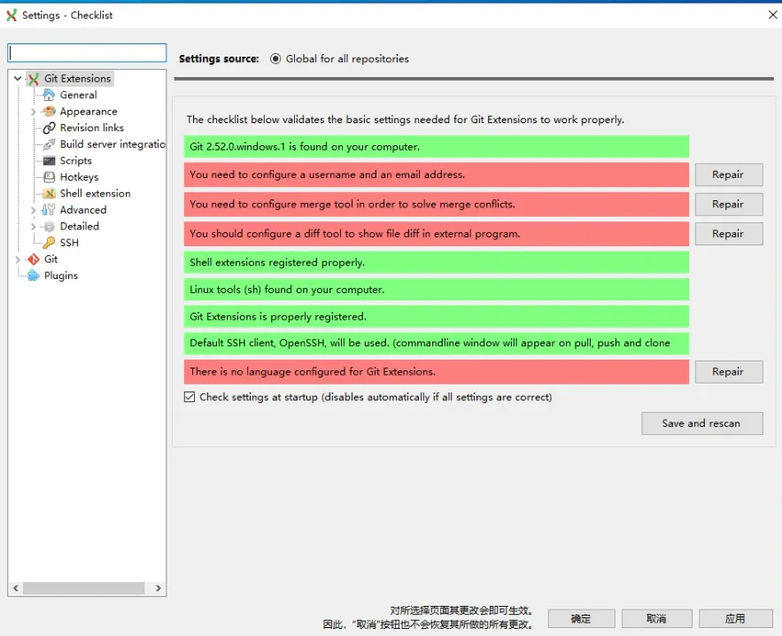

先点击设置第一个红色的用户名邮箱，你常用的就可以了。

3、如果你无法下载也可以直接在评论区留言，我会单独把安装包发给你。

4、安装好之后，有一个问题，我们的东西到底是存到哪里呢？这里也就是需要一个远程仓库。

可以选择Github 这个当然懂得都懂。也可以选择码云 [https://gitee.com/](https://gitee.com/) 这个国内的也不错。当然也可以选择阿里的[https://codeup.aliyun.com](https://codeup.aliyun.com/)。

当然这些都是免费的哈。

不过这里我选择的码云:[https://gitee.com](https://gitee.com/)。

5、git 跟码云之间如何交互提交呢，就是如何进行通讯呢，就需要设置密钥

```Plain Text
///Win+R，输入cmd,然后复制如下邮箱改一下

ssh-keygen -t rsa -C "你的邮箱"


// 然后连续回车三次，使用默认设置，不用设置密码即可


// 然后到Windows: C:\Users\你的用户名\.ssh\id_rsa.pub


// 将id_rsa.pub文件中的内容复制到你的远程仓库的SSH公钥设置中即可。


```

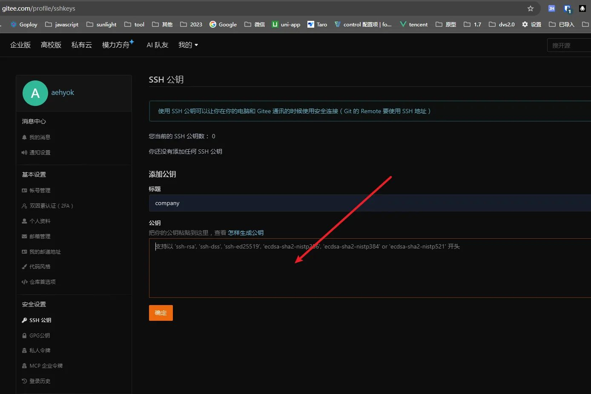

复制到公钥中即可，保存即可，然后进行测试

```Plain Text
// 运行命令进行测试是否成功

ssh -T git@gitee.com


```

再在[gitee.com](https://gitee.com/)上创建一个仓库

点击新建仓库

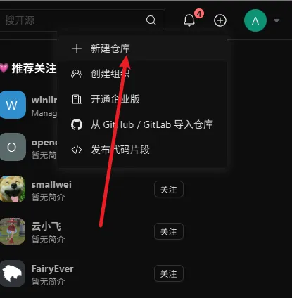

6、填写仓库名称，路径，仓库介绍，选择开源或者私有，然后创建即可

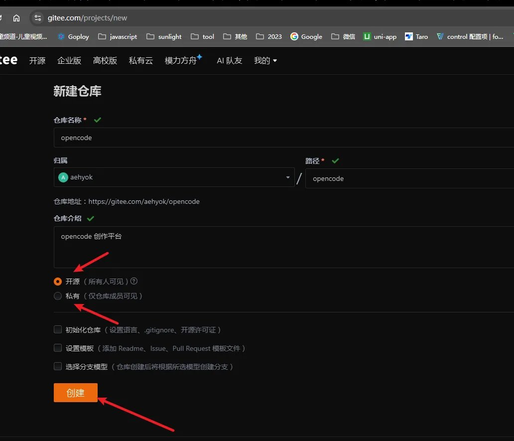

然后初始化一下仓库。点击复制克隆仓库的命令

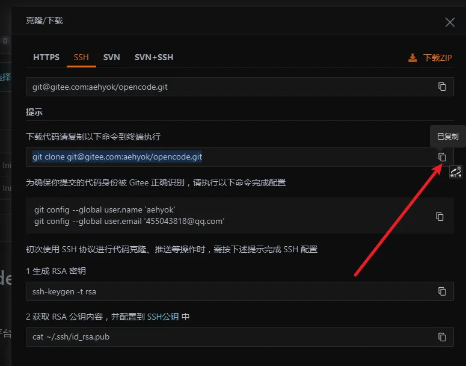

然后再到想去的文件夹进行执行命令就可以了

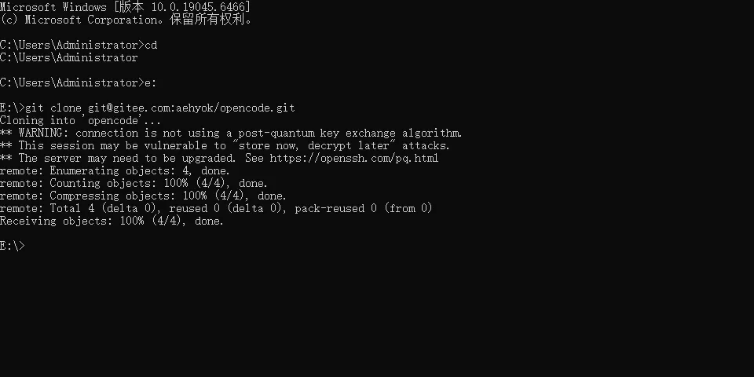

看到如上图所示的命令，说明配置成功了。

## 回到OpenCode工具

在这之前我是把之前可以看千年两篇文章中的`公众号文件夹`下的内容搬移到新的文件夹中，然后再OpenCode工具中重新打开新的文件夹。因为这个文件夹相当于有了git环境。

接下来我们继续跟AI聊聊天看看我接下来将会干什么

```Plain Text
// 我的提示词如下

现在不写文章，帮我写一个工作流或者skil我用它来提交我当前这个项目到代码仓库


```

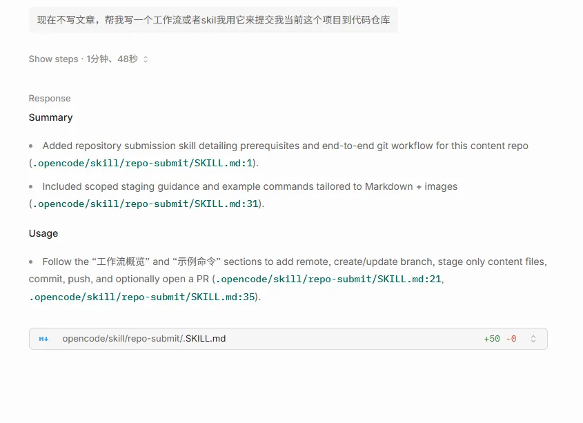

这里它直接给我创建了一个skill。既然它创建好了那就直接提交测试一下

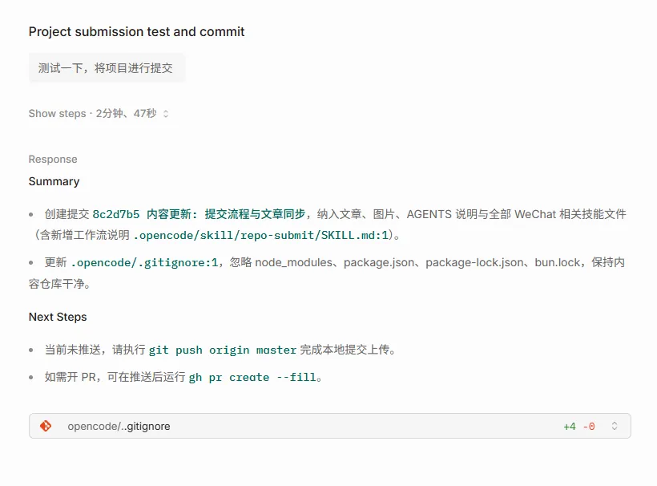

这里已经提交成功了，但是还没有推送大码云服务器上。也就是在本地有了提交历史，其实丢失的问题就解决了，看什么时候推送大服务器上而已。

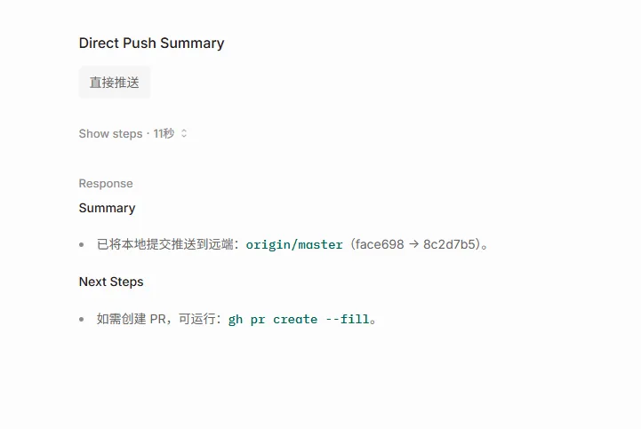

我们再到服务器上去看看

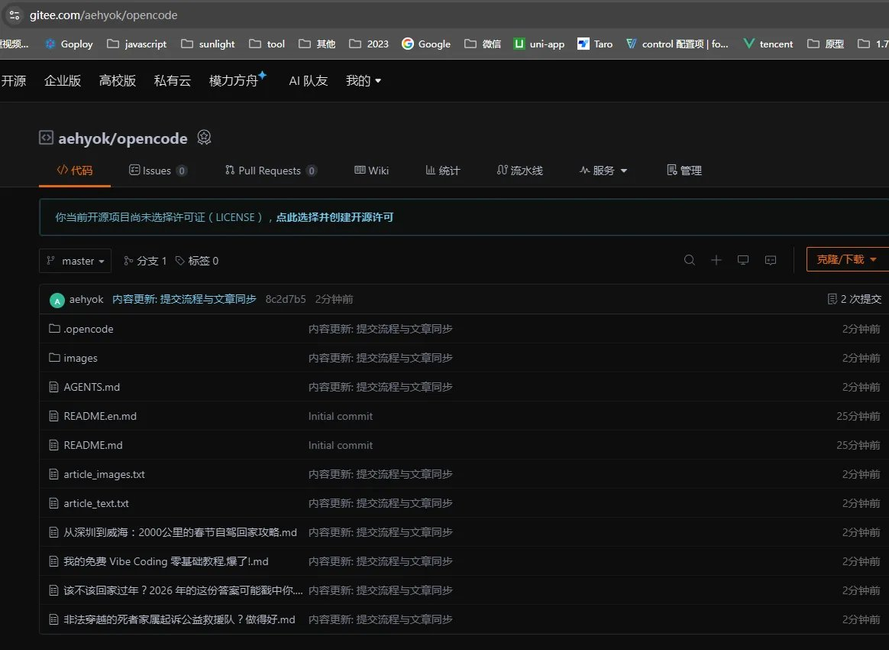

看到服务器上也有了项目文件，初步大功告成了。

## 总结

也就是你是不是的就可以直接在聊天框中输入 “提交项目文件” 或者“推送项目文件”，它就会识别到这个skill来为我们生成提交历史，并备份到服务器。

通过我们安装的可视化工具也是可以看到提交记录

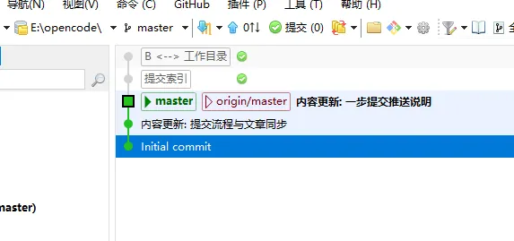

并且想查找历史也可以通过这个工具一目了然。当然git的功能其实非常强大，你有兴趣也可以借助AI进行了解和学习。

---

> 来源：飞书 · AI Spark 知识库 ｜ 原文（最新版）：<https://lcnniolukk80.feishu.cn/wiki/BAJQwzZdFiKGPdklB22crs2nnjh> ｜ 归档：2026-06-04
