# Mac使用指南系列文章：从零搭建Codex App桌面端结合GitHub CLI，体验 AI 自动化克隆与提交

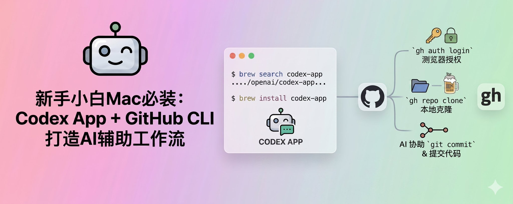

这是这个系列第二篇文章，我会把自己最近从零开始梳理，整理 Mac 使用过程中的经验与步骤记录下来，作为留存与分享。如果拿到一款新的Mac，我最先安装的AI工具就是Codex App了，因为它无需其他依赖直接下载安装即可使用。

它不仅操作简单，安装方便，更易于操作使用。

我的Mac使用指南系列文章：

> 4月10日

本文主要的内容如下目录

- 通过Homebrew安装Codex App
- 使用Codex App 安装GitHub Cli
- 准备克隆代码
- 修改仓库内容，并提交
- 最后，附新建仓库指引

## 1、通过Homebrew 安装Codex App

如果你还没有安装Homebrew可以看看我上面的系列文章的第一篇。

Codex App就是OpenAI 推出的AI Agent 桌面客户端，打开终端使用brew执行如下命令。

```Bash
## 先查找 codex-app有没有

brew search codex-app


## 查找完了 一般最好确认一下是不是openai的codex app

brew info codex-app


## 找到后安装

brew install codex-app


```

命令执行完毕之后，到App中查看Codex App 是否已经有了。安装成功如下图所示，点击打开即可。

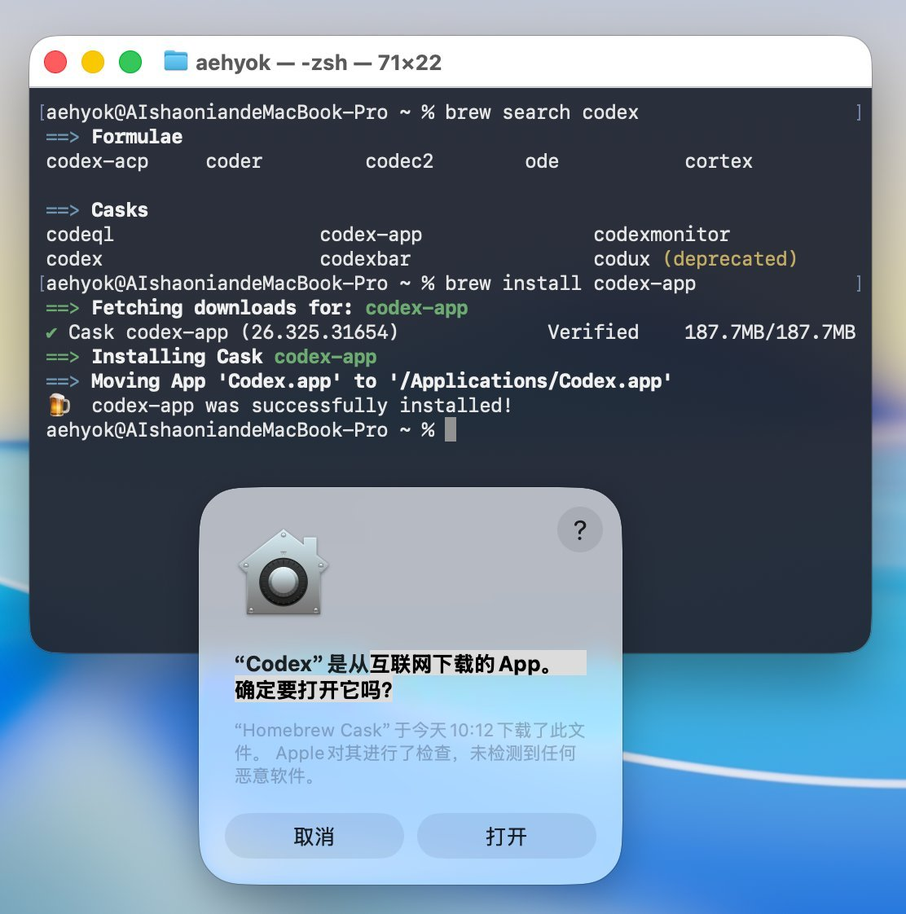

打开之后，点击继续使用ChatGPT登录，就会打开浏览器进行授权登录，登录完毕就可以跟AI进行对话了。

## 2、使用Codex App安装GitHub CLI

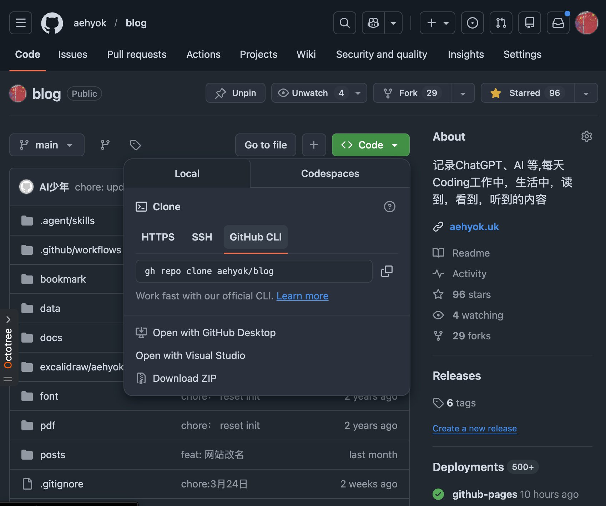

看上面截图发现自己的仓库，在克隆代码的地方多了一个标签。所以直接点击Learn more, 把链接交给了Codex App。

> 如果你没有建过Github仓库也没关系，我之前写过单独创建新仓库相关的文章，欢迎到文末查看。

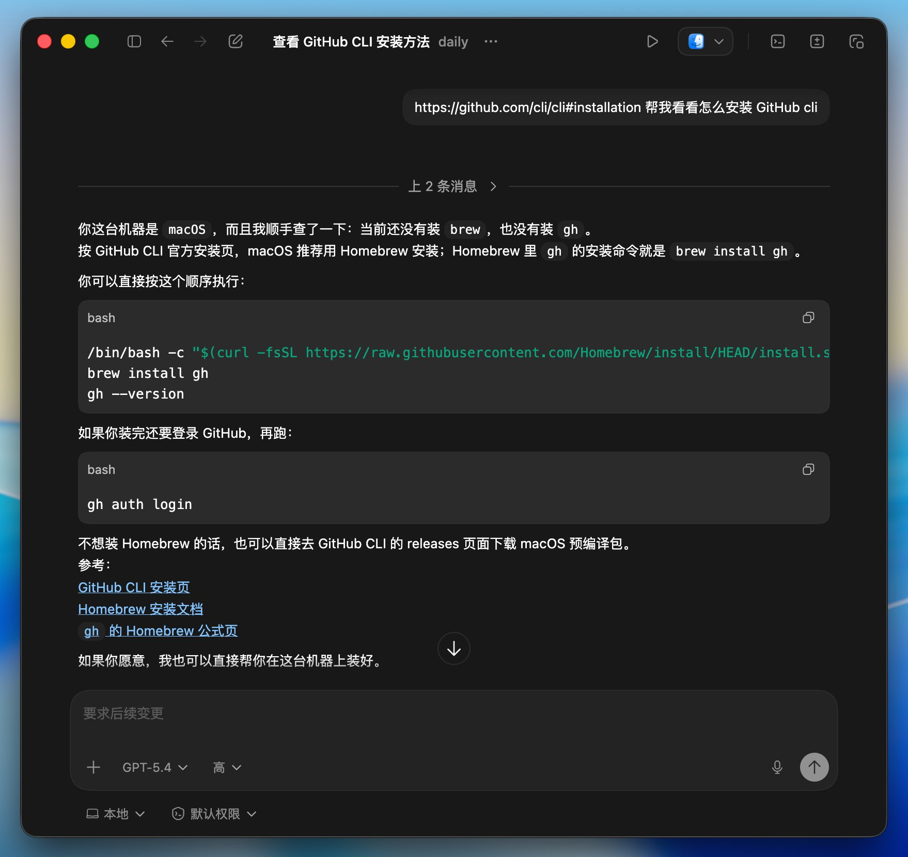

**如果没有安装Homebrew,可以点击我上面的系列文章进行查看安装使用。**

安装Homebrew之后，继续根据上图来安装gh。

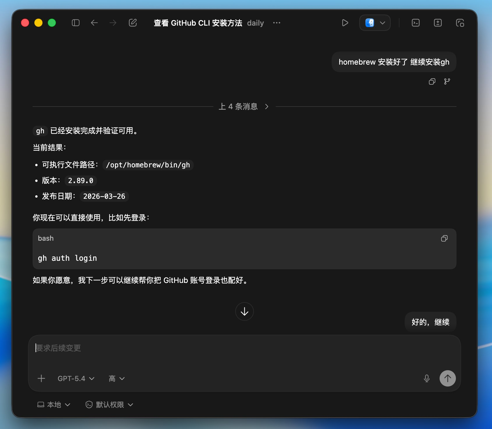

就会开始后台执行gh auth login，然后打开浏览器进行授权登录，比之前的SSH还是方便了很多。

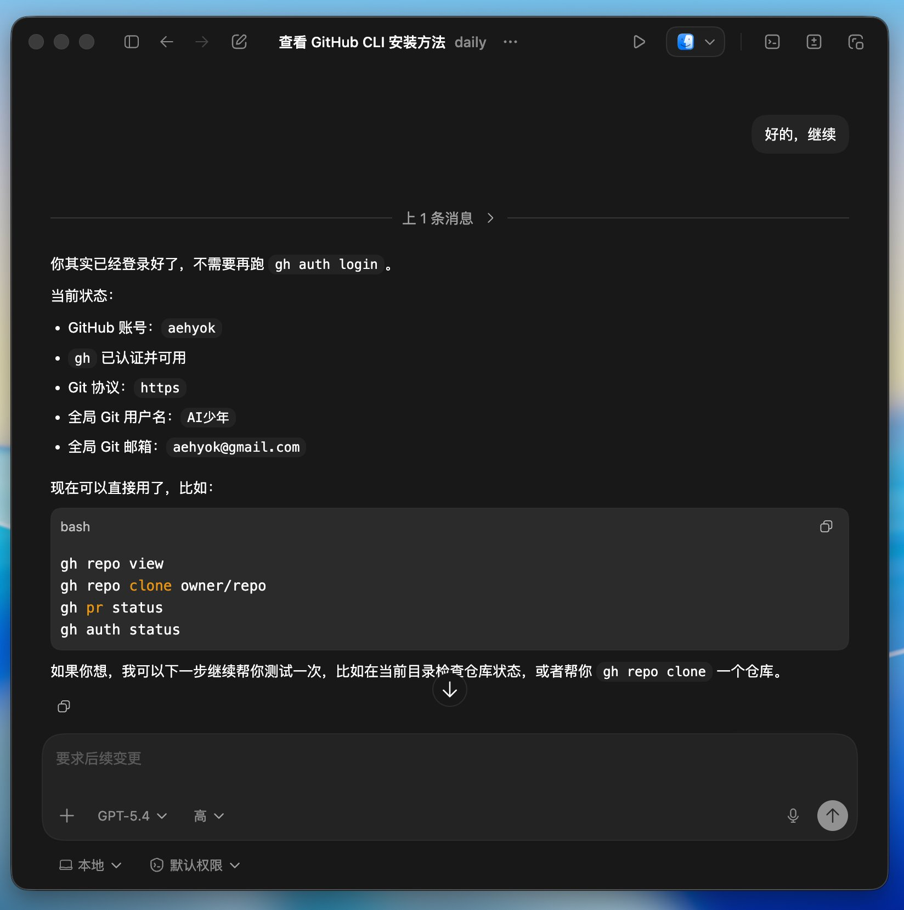

## 3、准备克隆代码

首先需要找到一个本地路径，存放克隆仓库的代码。

然后从github上复制使用GitHub CLI标签下的命令行。

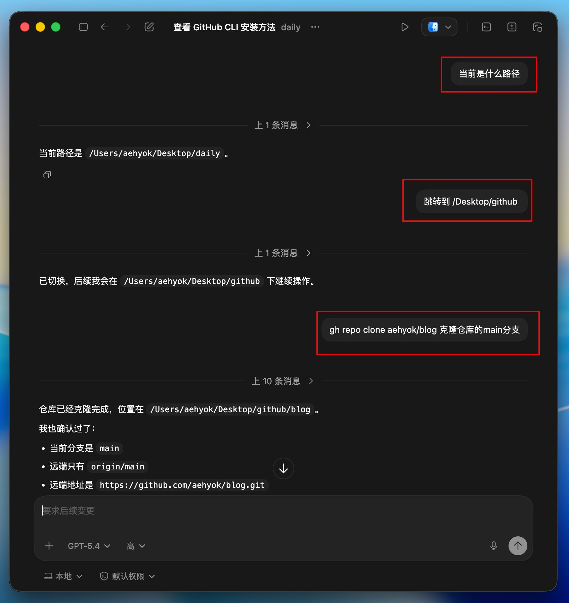

## 4、修改仓库内容，并提交

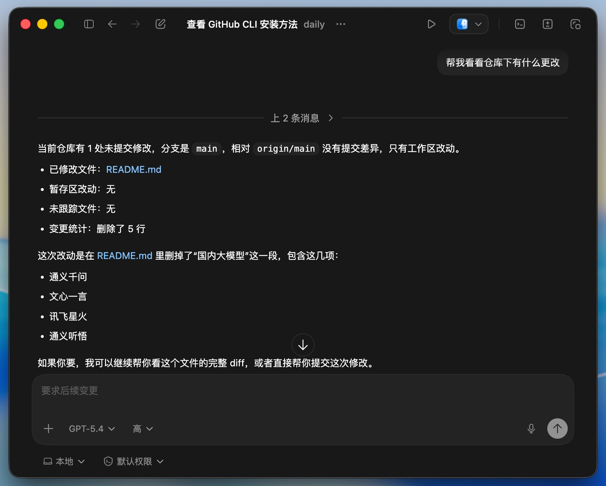

我随便将README.md中的内容，删减了一点，然后跟他说提交内容。

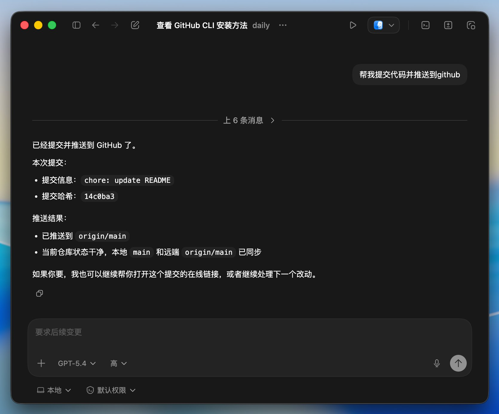

到github看效果

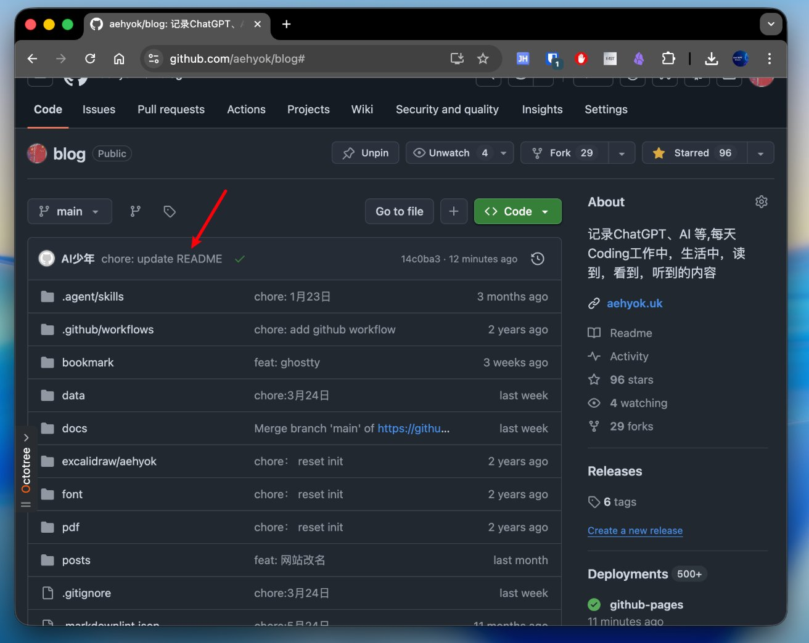

## 5、最后

GitHub CLI 支持的功能还有非常多，可以结合本地的Agent 客户端体验很多功能。

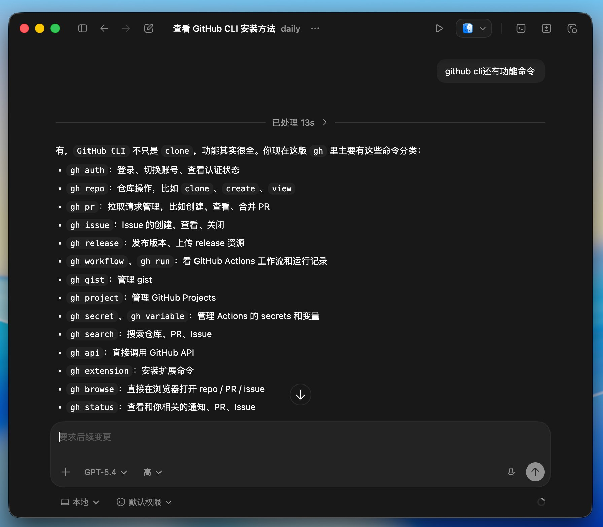

当然了，上面我是直接把原来有的仓库文件进行克隆本地，你也可以直接创建一个新的仓库，然后与本地文件直接进行关联上传提交，思路其实是一样的。

> 3月22日

这篇文章中的“**4、将代码上传github**”，演示的就是新建仓库并上传项目文件的过程，可以参考并结合上面的功能命令进行实测，也是一个不错的尝试。

---

> 来源：飞书 · AI Spark 知识库 ｜ 原文（最新版）：<https://lcnniolukk80.feishu.cn/wiki/QKCZwzUPBilOBzkdgoKckEITnme> ｜ 归档：2026-06-04
