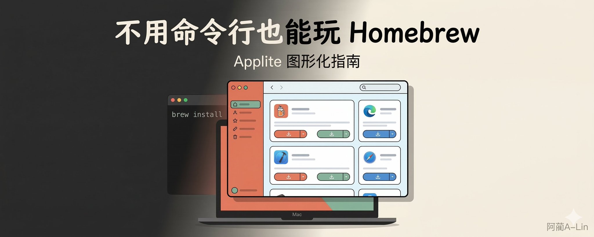
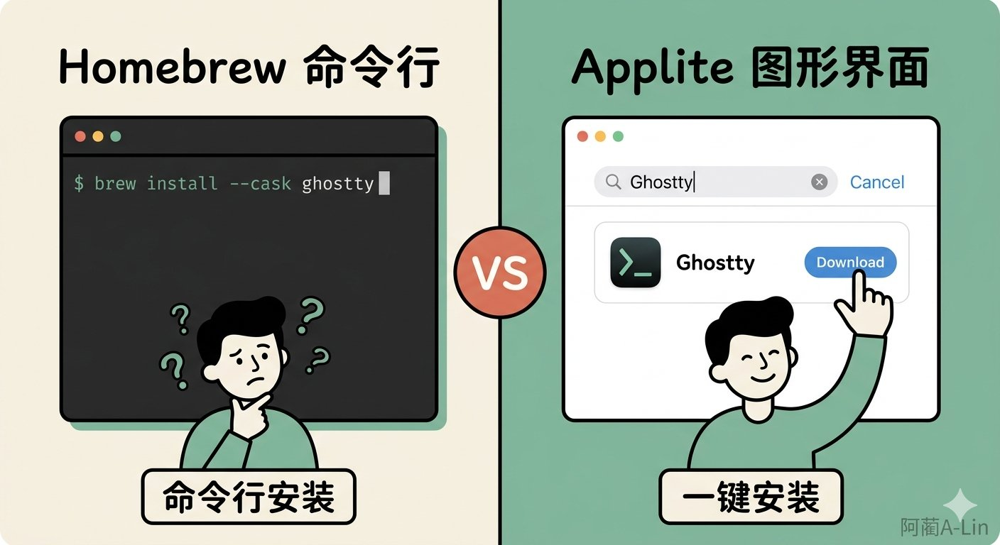
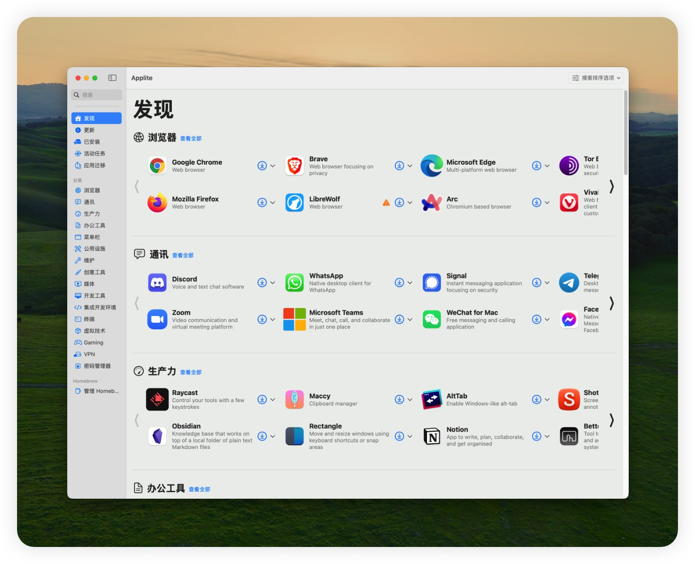
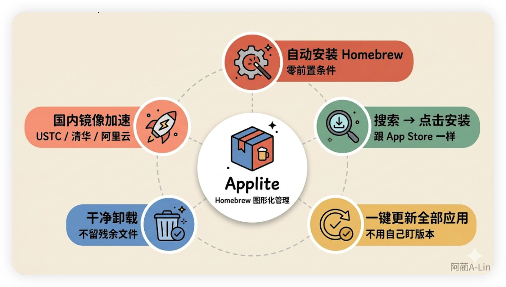
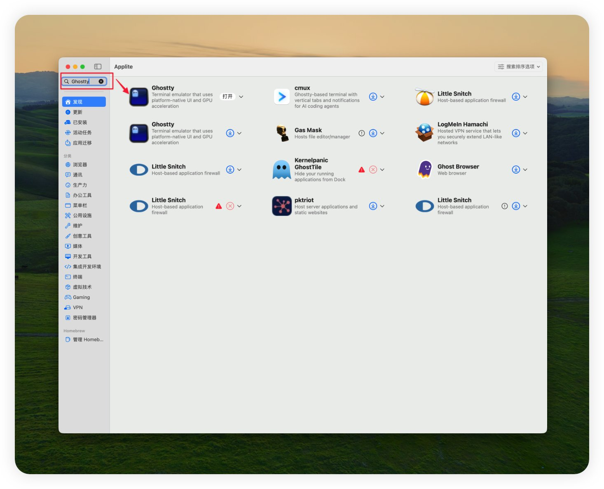
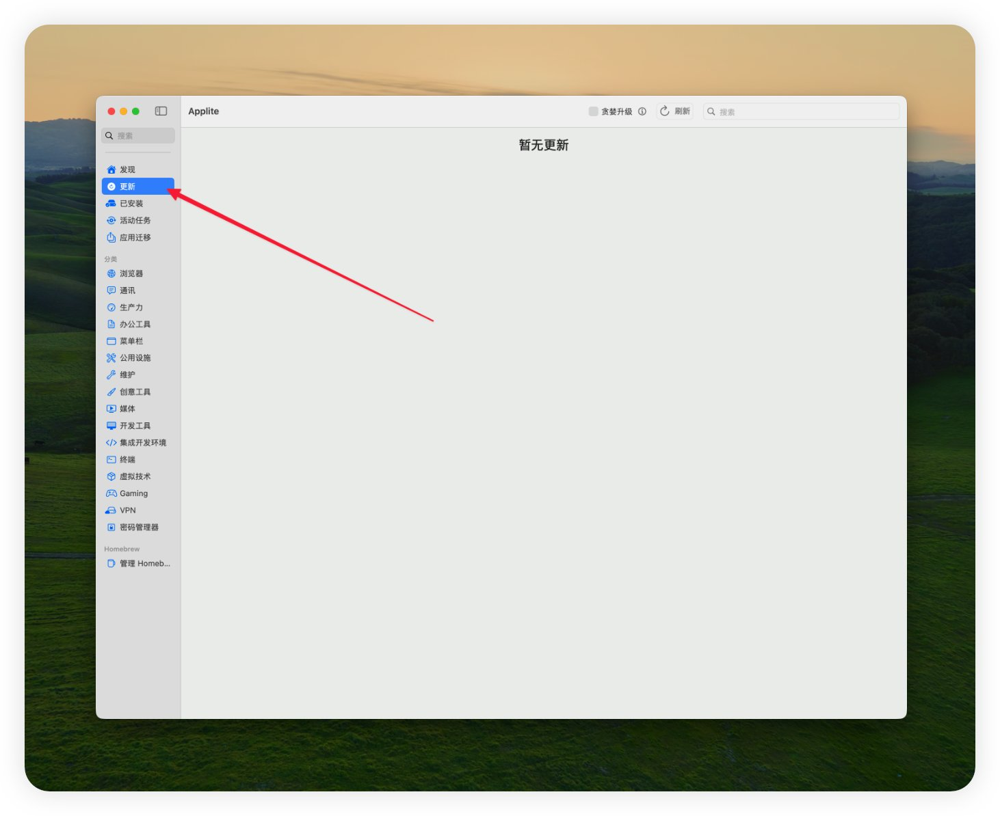
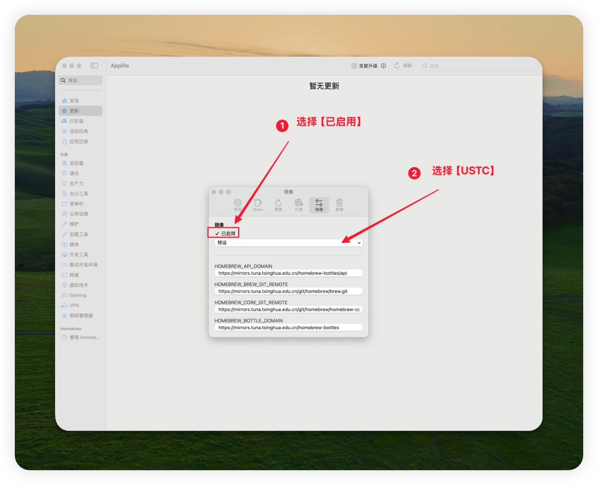

# 不用命令行也能玩 Homebrew：Applite 图形化指南



## Homebrew 是什么

如果你看过任何 Mac 软件教程，大概率见过这种命令：

```Bash
brew install --cask ghostty

```

这里的 brew 就是 Homebrew——Mac 上的一个软件包管理器。你可以把它理解成**一个隐藏的 App Store**，里面有几千个应用，很多是 Mac App Store 里找不到的。

问题在于：Homebrew 是命令行工具。你得打开终端、敲命令、等输出。对于习惯点鼠标的人来说，这不太友好。

所以这篇文章要做的事很简单：**让你不碰终端也能用上 Homebrew。**

工具叫 Applite。



## Applite：把 Homebrew 变成 App Store

Applite 是一个免费开源的 macOS 应用，做的事情就一个——给 Homebrew 套一层图形界面。

打开它，你看到的不是黑底白字的终端，而是跟 App Store 差不多的界面：分类浏览、搜索框、安装按钮。点一下就装，再点一下就删。

几个关键点：

- **不用先装 Homebrew**。Applite 首次启动会自动帮你装好，零前置条件
- **不用碰终端**。搜索 → 点安装，跟在 App Store 里装应用一样
- **免费开源**。MIT 协议，不收费，不追踪你的数据
- **支持国内镜像**。设置里一个开关，下载速度直接起飞（后面会讲）

系统要求：**macOS 13（Ventura）或更高版本。**

## 下载和安装

两种方式，选一个就行。

方式一：官网下载 DMG（推荐）

去 [Applite 官网](https://aerolite.dev/applite) 或者 [GitHub Releases](https://github.com/milanvarady/applite/releases/latest/download/Applite.dmg) 下载 DMG 文件，双击打开，把 Applite 拖到应用程序文件夹。

这是推荐方式，因为不需要你先有 Homebrew。

方式二：用 Homebrew 安装

如果你已经有 Homebrew 了（比如之前跟着某个教程装过），直接一条命令：

```Bash
brew install --cask applite

```

## 第一次打开

macOS 会弹一个安全提示——"Applite 是从互联网下载的应用"。点**打开**就行，这是 macOS 对所有非 App Store 应用的标准行为（Gatekeeper）。

打开后 Applite 会做两件事：

1. **检测你有没有 Homebrew**。有的话直接用，没有的话帮你装一个
2. **拉取应用目录**。第一次可能要等几秒到几十秒，取决于网络



如果你电脑上已经有 Homebrew，Applite 会问你：用已有的安装，还是创建一个独立的。**选"用已有的"就行**，这样之前用命令行装的应用也会出现在 Applite 里。

如果你选了创建独立安装，Homebrew 会装在 ~/Library/Application Support/Applite/homebrew，跟系统的互不干扰。

## 基本使用



**浏览和搜索**

Applite 把应用分成了十几个类别：浏览器、通讯、生产力、办公工具、开发工具、终端、媒体……点进去就能看到该分类下的所有应用。

懒得翻？直接用顶部的搜索框。输入应用名或关键词，结果实时出来。



**安装应用**

找到你要的应用，点下载⏬按钮。等一会儿，装完了。

拿 Ghostty 举个例子——如果你对这个终端感兴趣，可以看看 [Ghostty 入门教程](https://x.com/alin_zone/status/2033524177295274496?s=20)：

1. 搜索框输入 Ghostty
2. 你会看到两个结果，都叫 **Ghostty**。选第一个就对了——那是稳定版。第二个是 tip 开发版（跟踪最新代码提交），普通用户不需要
3. 点 下载⏬，等安装完成
4. 去 Launchpad 或应用程序文件夹就能找到 Ghostty 了

整个过程没有一行命令。

**更新应用**

Applite 侧边栏有个**更新**分区。有应用需要更新时，这里会显示出来。

点单个应用旁边的更新按钮逐个更新，或者点顶部的**完整升级**一键全部更新。



这个功能对那些没有内置自动更新的应用特别有用——比如你装了好几个开发工具，全靠自己记着去官网下新版本，现在 Applite 帮你盯着。

**卸载应用**

在**已安装**分区找到要删的应用，点卸载按钮。干净卸载，不留残余文件。

⚠️ 注意：只有通过 Homebrew（包括 Applite）安装的应用才会出现在这里。你手动下载 DMG 装的应用不会显示。

**导出和导入**

换了新电脑？Applite 支持把已安装的应用列表导出成文件。在新电脑上导入这个文件，一键把所有应用装回来。比自己一个一个找方便太多。

## 国内用户加速：镜像设置

**为什么下载慢**

Homebrew 的软件源托管在 GitHub 上，服务器在国外。国内直连的话，拉取应用目录和下载安装包都可能很慢，有时候直接超时。

**Applite 内置镜像（推荐）**

好消息是 Applite 直接内置了镜像配置，不用碰命令行。

打开 Applite → **Settings**（设置）→ 点顶部的 **镜像** Tab：

1. 勾选 **已启用**
2. **预设** 下拉框里选一个镜像源——内置了三个：**USTC**（中科大）、**Tsinghua University**（清华）、**Aliyun**（阿里云），选一个就行，下面四个地址会自动填好
3. 关掉设置，完事



四个地址分别对应 HOMEBREW_API_DOMAIN、HOMEBREW_BREW_GIT_REMOTE、HOMEBREW_CORE_GIT_REMOTE、HOMEBREW_BOTTLE_DOMAIN——其实就是命令行用户手动配的那些环境变量，Applite 帮你做成了图形界面。国内用户开了之后体感差别很大，从"转圈超时"变成"几秒装完"。

预设不合适的话，也可以手动改地址。

## 补充：命令行 Homebrew 设镜像

上面的镜像设置只对 Applite 生效。如果你还直接在终端里用 brew 命令，需要单独给命令行配镜像。推荐同样用中科大 USTC 镜像，跟 Applite 保持一致：

```Bash
export HOMEBREW_BREW_GIT_REMOTE="https://mirrors.ustc.edu.cn/brew.git"
export HOMEBREW_CORE_GIT_REMOTE="https://mirrors.ustc.edu.cn/homebrew-core.git"
export HOMEBREW_BOTTLE_DOMAIN="https://mirrors.ustc.edu.cn/homebrew-bottles"
export HOMEBREW_API_DOMAIN="https://mirrors.ustc.edu.cn/homebrew-bottles/api"

```

把这四行加到 ~/.zshrc，重开终端生效。

只用 Applite 不用命令行的话，忽略这段就行。

## 写在最后

Homebrew 是 Mac 上装软件最方便的方式之一，但命令行确实劝退了不少人。Applite 把这个门槛拉到了几乎为零——会用 App Store 就会用 Applite。

---

> 来源：飞书 · AI Spark 知识库 ｜ 原文（最新版）：<https://lcnniolukk80.feishu.cn/wiki/BF9Vw0D8ainzqVkzDnvca9qxnkf> ｜ 归档：2026-06-04
