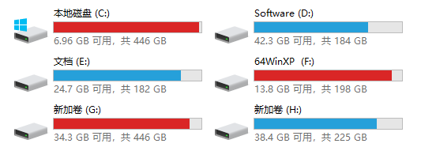
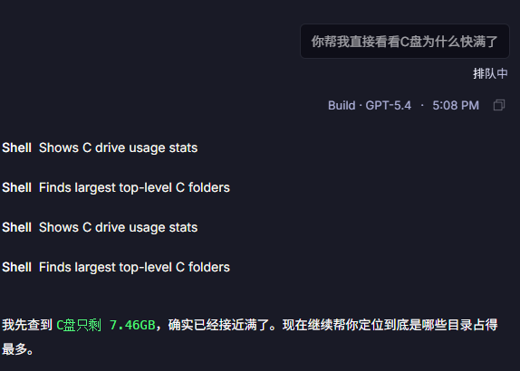
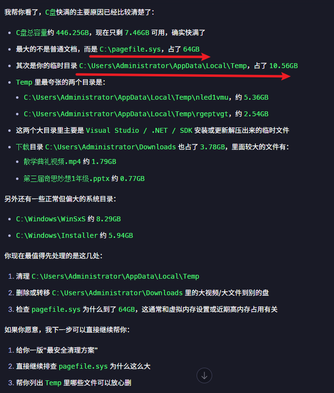
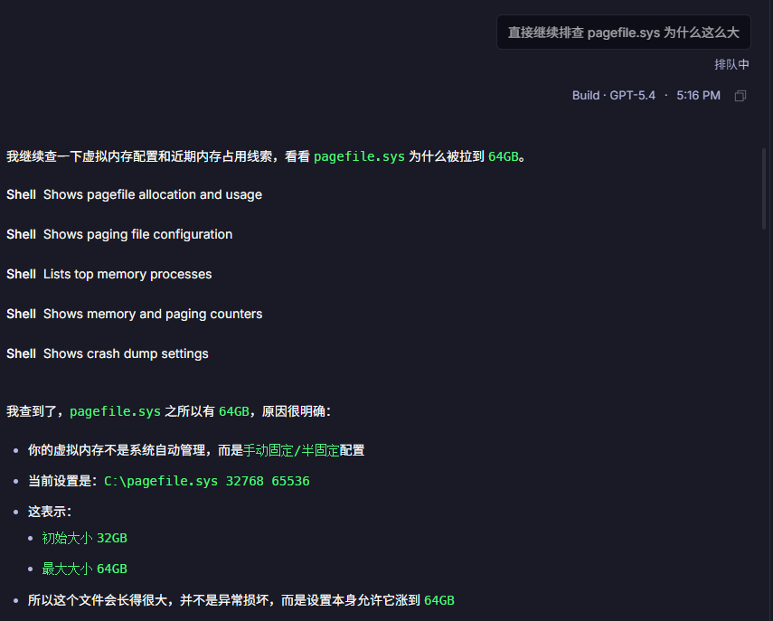
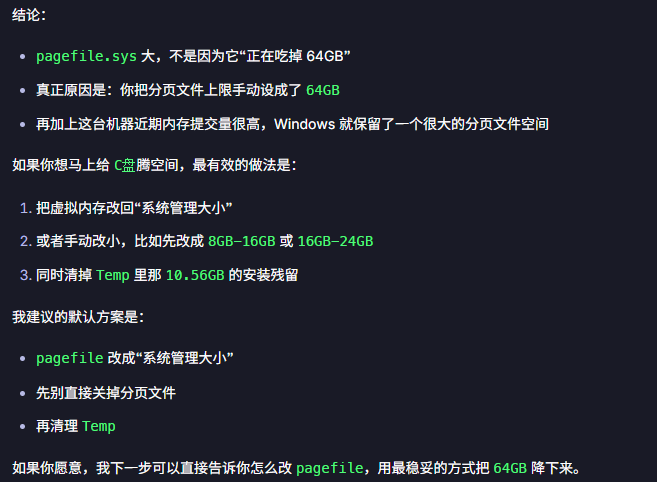
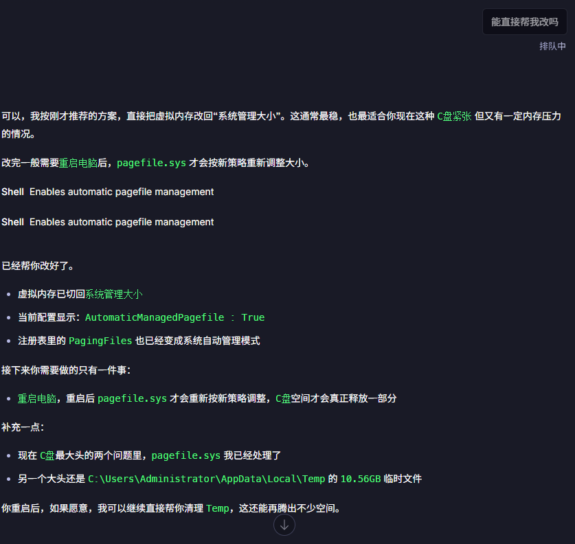
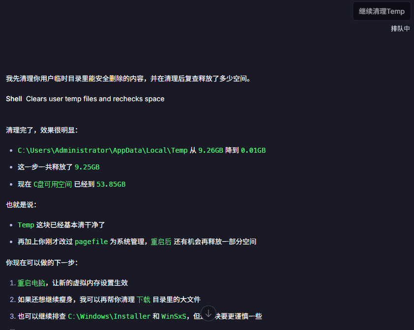
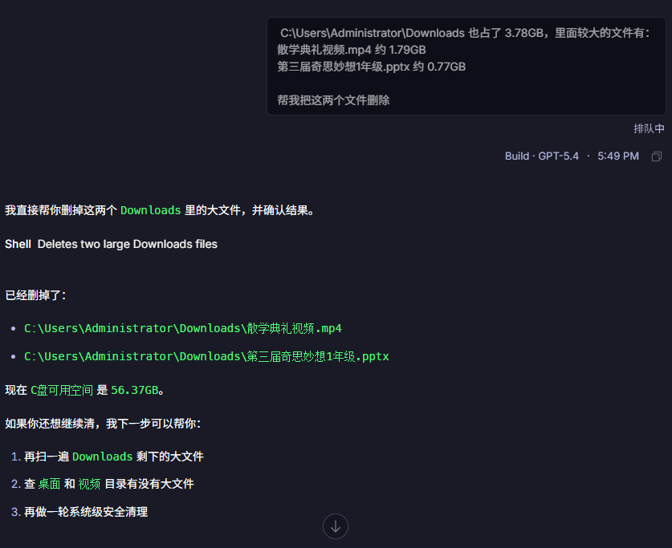
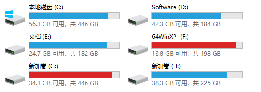

# 大早晨起来发现window巨慢，原来是C盘快满了，于是我就让OpenCode检查干干干，OpenCode一顿操作50G就有了

最近Codex桌面客户端mac和window都支持了，体感上身边用的人会越来越多，不知道4月2日活动结束后会怎么样，还有接近一个月的时间能piao的快去。

我的电脑上一直还是装着OpenCode 的客户端，相信使用的人也不少。今天就还是让OpenCode来看看，我Window电脑突然慢了很多，然后我才发现原来C盘快满了。

500G的C盘为什么也快满了，最近也没干什么怎么就满了，导致我电脑最近都慢了。

这是过年期间我收藏的雨神的解决方案:

> 2月26日

刚刚看了，但是我用不了呢: 它的核心逻辑是将其他盘的闲置空间迁移到C盘。而我这几个盘基本都要红了，没什么空间了。而且我的C盘是固态硬盘，其他是机械硬盘，两个也没办法合并。

我该怎么办？

我该怎么办？

我该怎么办？

对呀，现问问AI啊。

## “你帮我直接看看C盘为什么快满了”

这是事实，还好你判断对了，继续高看你一眼。

看来OpenCode还有点东西，主要有以下几个原因

- pageFile.sys 占了64GB
- Temp占了10.56GB
- Downloads 占了3.78GB
- WinSxs 占了8.29GB
- InStaller 占了5.94GB

光这些就不少了，口算一下好像大致有90G。

## “直接继续排查pagefile.sys 这个文件为什么这么大”

看他这意思是可以降下来的。

## “能直接帮我改吗”

牛逼很快就改好了，简直太强了，它上面说叫我重启，算了我重启一下吧。

“继续清理Temp”

让他继续帮我删掉两个大文件

## “帮我把这两个文件删除”

最后回到我的电脑看看效果

刚好50个G就这么轻松的挤出来了，到底是OpenCode强还是GPT-5.4强，我觉得可能都有原因吧。

行了先用一段时间看看后续还会满不？

如果你也有类似的问题也可以让AI进行检查一下。但是请记住了，执行前一定要确认对电脑的影响，如果不清楚影响可以多几个AI进行确认，因为有些操作可能是不可逆的，一旦执行导致电脑不能用了，也就很尴尬了。

好了，今天就分享到这里，希望我的思路对你有帮助。

---

> 来源：飞书 · AI Spark 知识库 ｜ 原文（最新版）：<https://lcnniolukk80.feishu.cn/wiki/XVAJwNT7jimTB2kfesYcAs55n7L> ｜ 归档：2026-06-04
