# 大模型 Token 告急？一文教你用 CF 零成本实现“邮箱自由”与多开储备

昨晚我熬夜实测了几个几十块钱的冷门域名，发现这套野路子不仅行得通，而且防封率极高。

最近 OpenAI 突然对免费用户开放了 Codex (GPT-5.4) 模型，加上今天微信正式接入 OpenClaw，可以预见大家日常的 Token 消耗量会直线上升。

想要不受限制地使用这些顶级模型，最简单粗暴的方法就是多注册几个账号囤 Token。但批量注册最大的门槛是邮箱：自己的几个实名邮箱早就注册完了，去买批量号又要担心随时被封，花钱还不省心。其实不仅是这次的 AI 注册潮，平时试用各种 SaaS 服务、做多账号隔离运营，同样很缺干净的邮箱。

只要你手里有一个闲置域名，完全可以不花一分钱，利用 Cloudflare 的邮件路由功能，给自己搭一个“无限邮箱生成器”。你可以在注册时随便编造无数个前缀（比如 gpt01@你的域名.com），而收到的验证码最后都会自动汇聚到你的一个主邮箱（比如 Gmail）里。

## CF 邮件路由是怎么工作的？

利用 Cloudflare 免费的 Email Routing（邮件路由）服务，能很优雅地解决多账号注册时邮箱不够用的问题。

比如在你注册大模型账号时，可以随手填 chat001@xxx.com、chat002@xxx.com。不管这里填什么，这些接收到的验证码邮件都会瞬间转发到你指定的真实主邮箱收件箱里。

**⚠️** **唯一限制：** 由于是路由转发，这套方案只会作为单向通道——**只能收信，不能发信**。不过对于我们拿来接验证码的需求来说，完全够用了。

## 准备工作

门槛很低，只需要：

1. **一个域名**（几十块钱随便买个便宜后缀就行）
2. **域名 DNS 托管在 Cloudflare**（如果你的网站已经托管在 CF，这一步都不用管）；如果已经有域名，可以参考小墨同学这篇CF域名托管教程。
3. **一个真实可用的主邮箱**（推荐 Gmail 或 Outlook 等），用来接收所有的转发邮件

## 具体配置步骤

第一步：开启域名邮件路由

进入 Cloudflare 控制台，点进你要用的那个域名。 在左侧菜单里依次点击 **“电子邮件服务”** -> **“电子邮件路由”**。

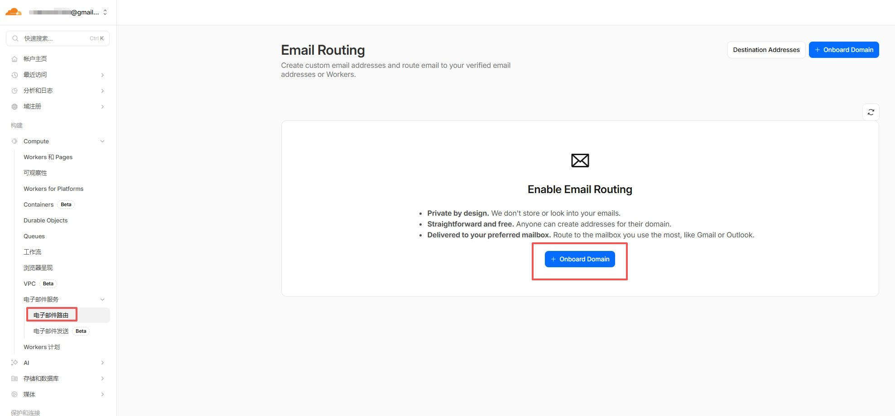

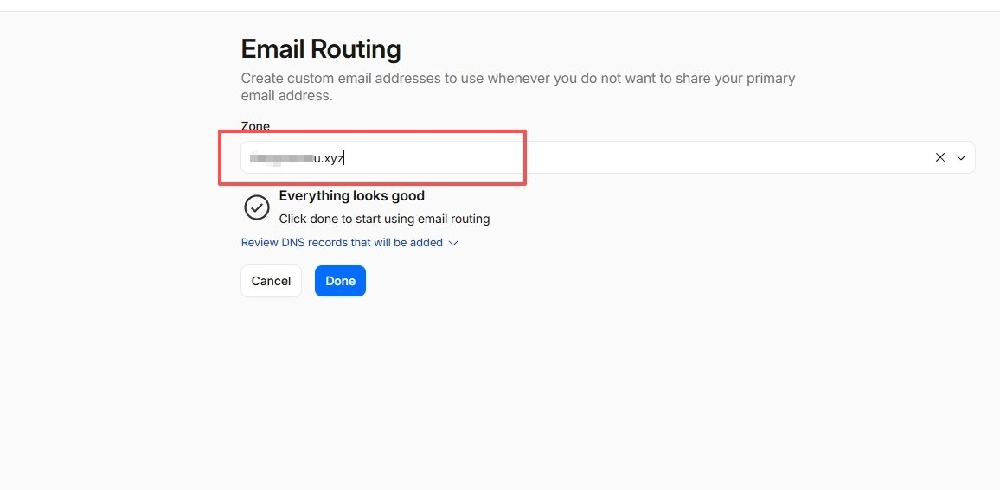

**第二步：绑定你的接收邮箱**

所有的影子邮箱都需要一个真实邮箱来接信。

1. 点击 **Destination address**（目标地址）。
2. 在这里填上你的真实大号邮箱（比如你的 Gmail）。

**提醒**：如果这个接收邮箱和你登录 Cloudflare 是同一个邮箱，系统会直接放行。如果是别的独立的邮箱，CF 会发一次验证邮件过去，你去点下确认链接即可。

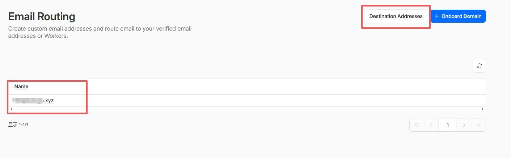

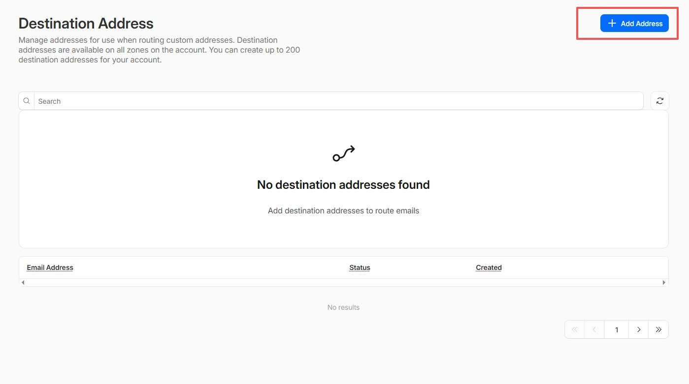

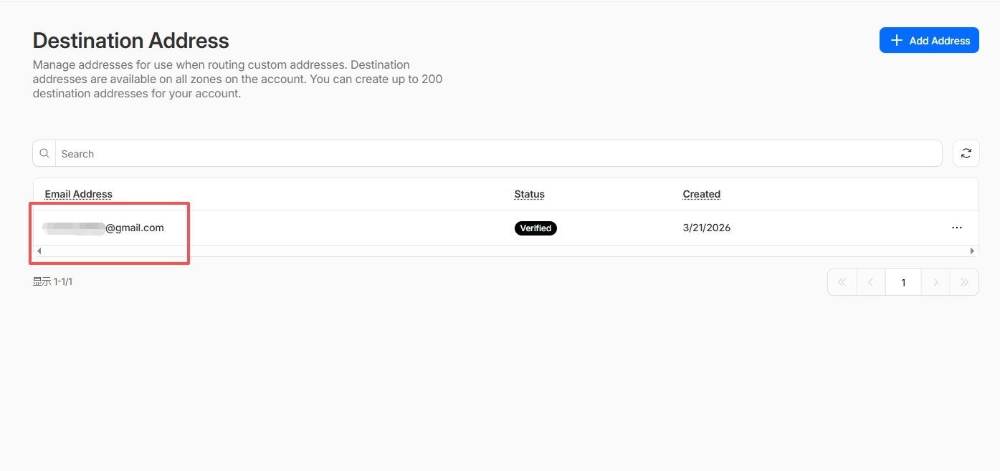

**第三步：创建自定义前缀**

现在开始给自己配邮箱前缀。

1. 切换到 **Routes**（路由规则）标签页。
2. 点击 **Create address**（创建地址）。
3. 自定义前缀随便填（比如 gpt-token、contact）。
4. 在目标邮箱处，选刚才验证过的那个真实邮箱。

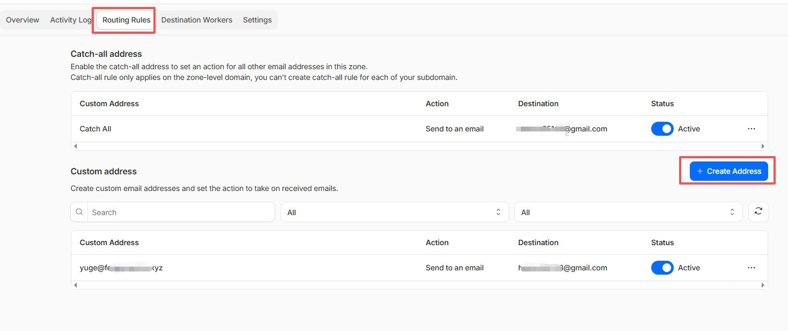

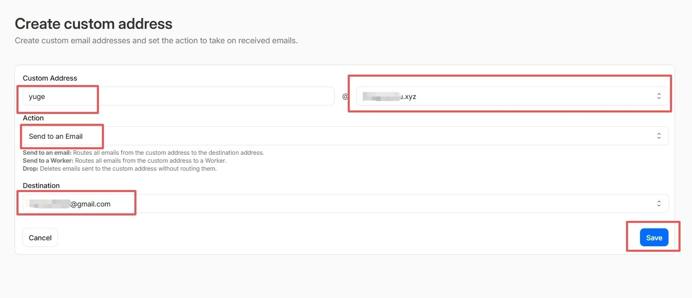

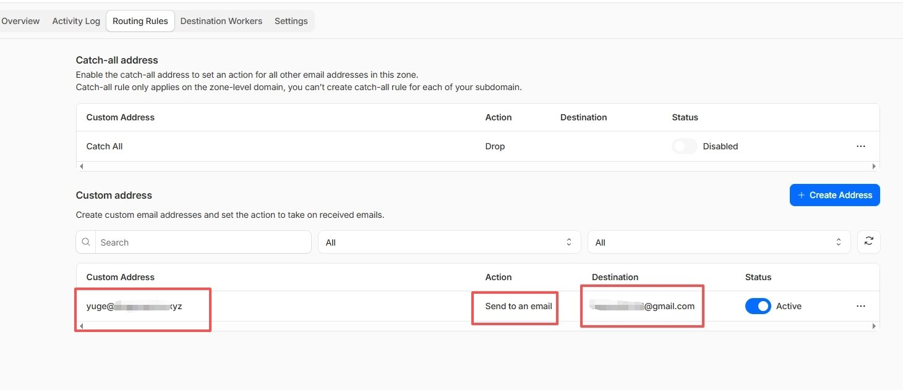

配置完之后，转发规则其实就是这样的：

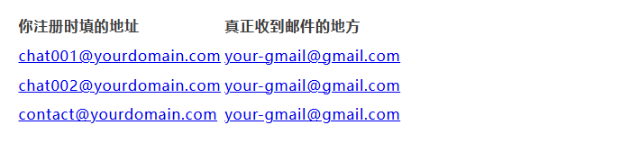

**第四步：发邮件测一下**

配置完保险起见，拿别的朋友邮箱或者你自己的小号，往刚建好的地址（如 chat001@yourdomain.com）发封测试邮件。然后去你的 Gmail 等着看能不能收到（如果是第一次配，偶尔可能会进垃圾箱，注意看下一眼）。

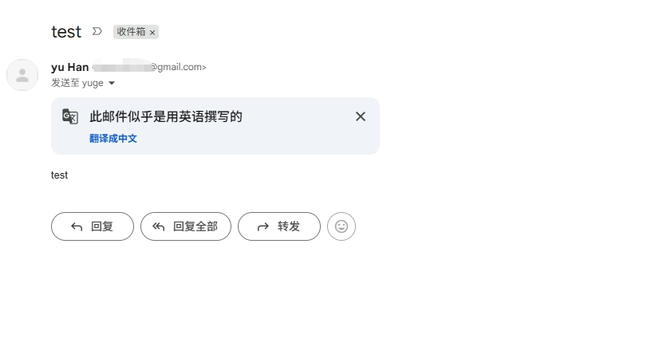

**第五步：开启 Catch-all（重点推荐）**

如果每次要用新邮箱都得回 CF 后台配一条规则，那也稍微有点麻烦。Cloudflare 有个一劳永逸的功能：**Catch-all（万能接收地址）**。

开启后，别人往 [@yourdomain](https://x.com/@yourdomain).com 发送任何前缀的邮件（哪怕你从来没在后台设置过这个前缀），CF 也会照单全收，并且原封不动地全部转发到你的主邮箱。

1. 在 **Routes** 页面往下拉，找到 **Catch-all address**。
2. 点击 **Edit**。
3. 把操作选为 **Send to an email**（发送到电子邮件）。
4. 指定你的那个接收目标邮箱。

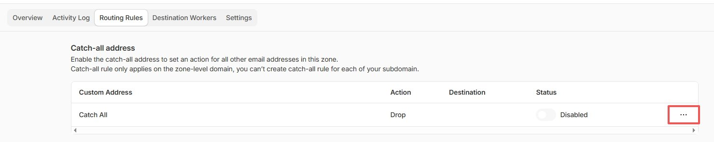

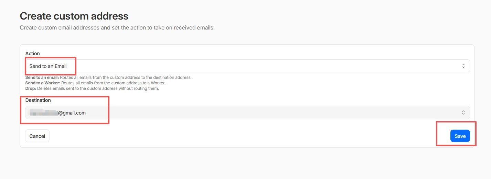

最后一步，别忘了回到页面上方点击 **Active** 激活配置（系统会自动帮你把必需的 DNS 解析记录加上）：

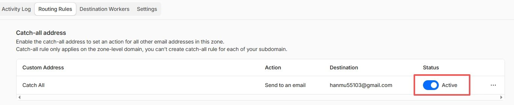

## FAQ

**Q: 从平台发验证码过来，延迟大吗？** A: 基本在几秒到一分钟以内就能收到，体验很丝滑。

**Q: 会不会漏信？能收带图的附件吗？** A: 稳定性不错。单封邮件最高支持 **25MB** 的附件转发，接点普通带图邮件没问题。

**Q: 能不能用这些自建邮箱对外发邮件？** A: **不行**。CF Email Routing 只有接收和转发功能。如果有真实的双向收发邮件需求，得去搭配 Resend 或 AWS SES 这种专业的发信服务。

**Q: 可以把不同前缀的邮件，分发给几个不同的邮箱吗？** A: 可以。你可以给同一个域名建无数条路由规则（比如把 gpt@ 的邮件转发给邮箱 A，wechat@ 的邮件转发给邮箱 B）。

## 写在最后

用 Cloudflare 的邮件路由，基本算是零成本解决了大模型多账号注册缺邮箱的燃眉之急。

那么问题来了，**你会用今天这套“无限发号器”囤多少个大模型账号，准备用来做些什么硬核应用呢？欢迎在下方评论区告诉我，我们一起交流探讨。**

如果觉得这篇教程有用，**记得点个赞或分享给身边被“Token 焦虑”困扰的朋友。关注我，持续分享更多实用的效率技巧！**

---

> 来源：飞书 · AI Spark 知识库 ｜ 原文（最新版）：<https://lcnniolukk80.feishu.cn/wiki/Bw1wwmZ2uia3tjkl3QzcahwEnEd> ｜ 归档：2026-06-04
