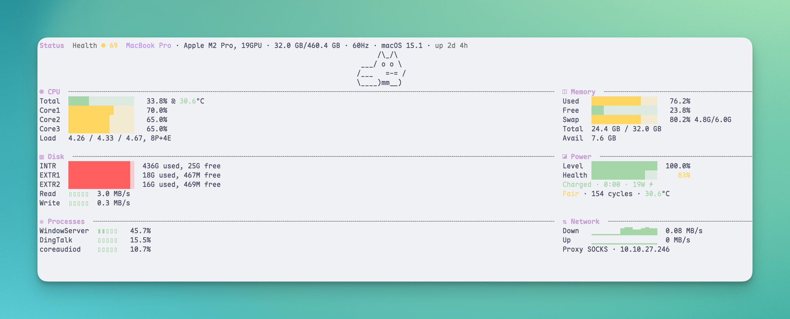
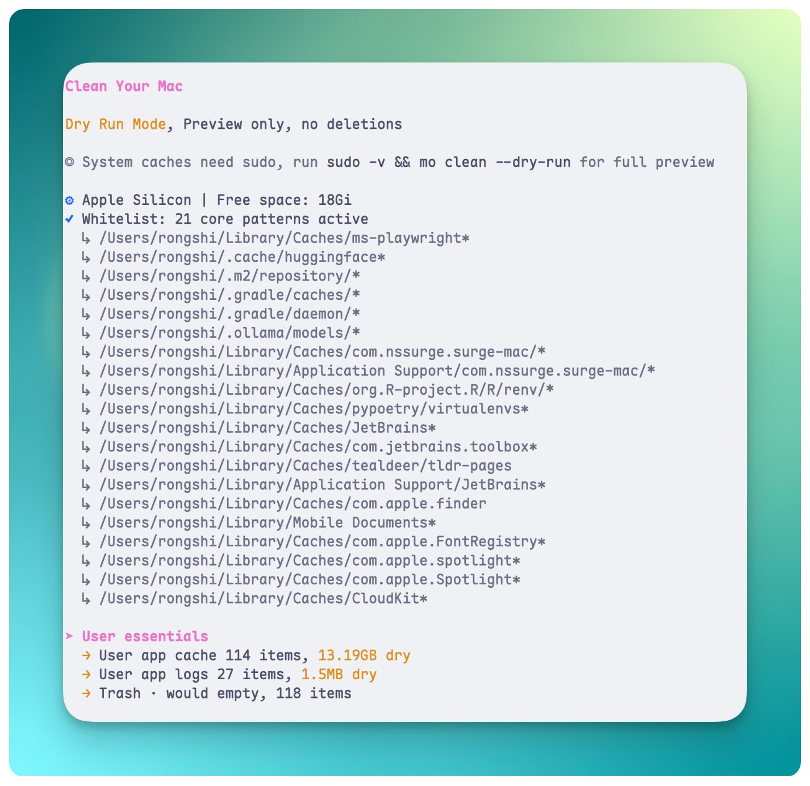
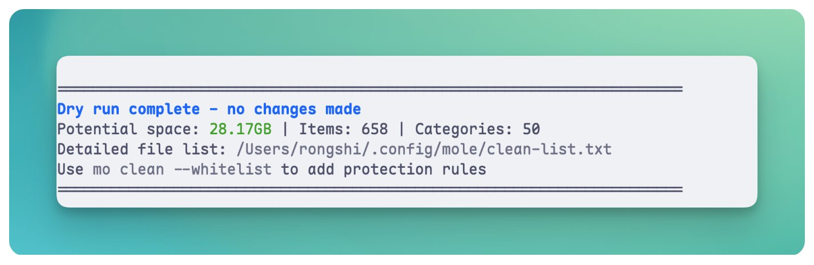
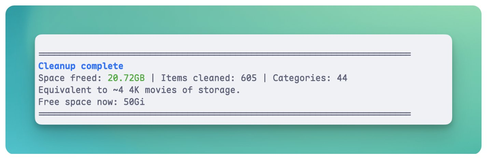
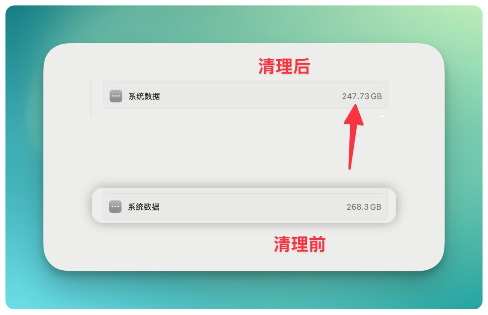
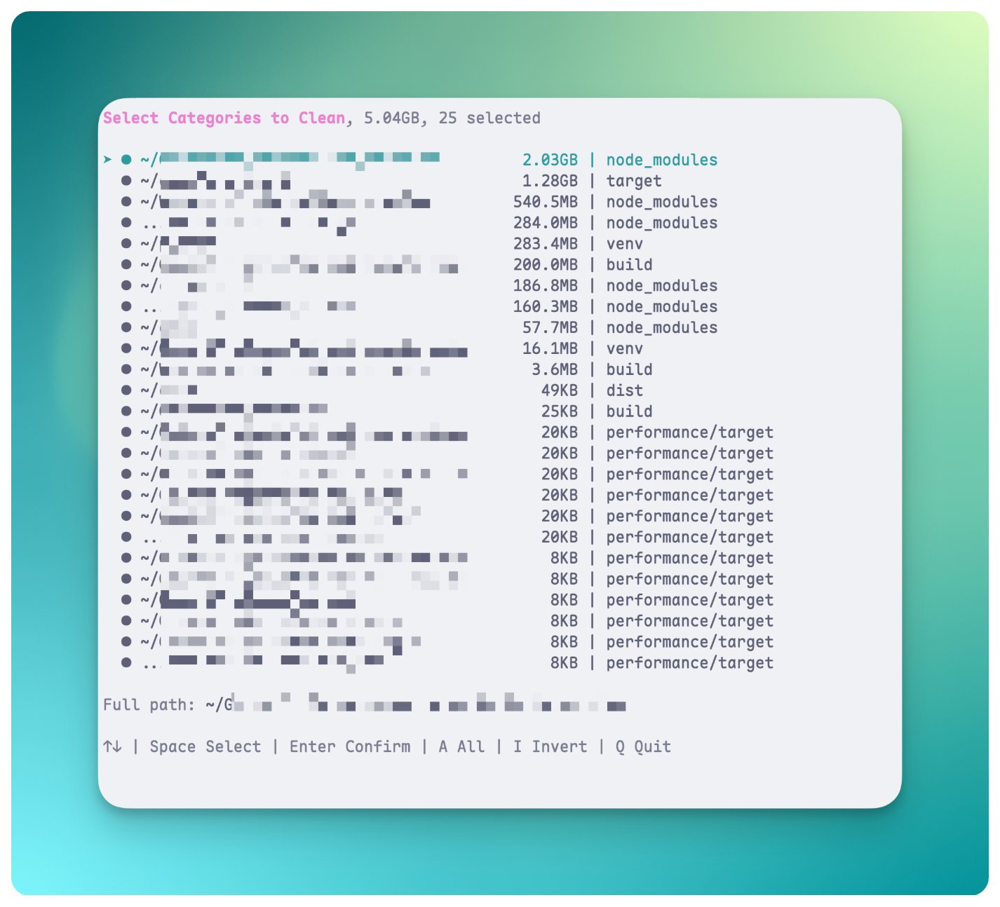
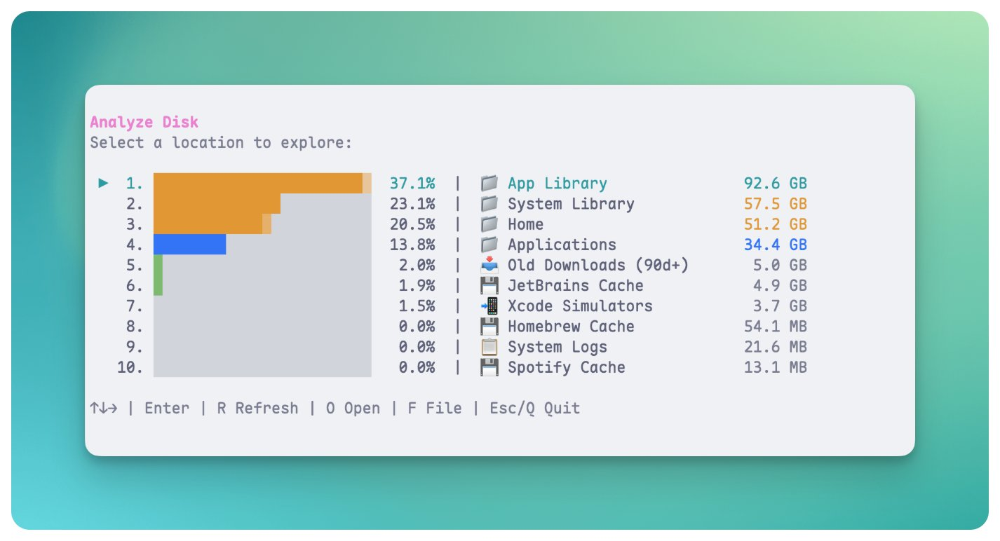

# 我把 CleanMyMac 卸了，换成这个 GitHub 4.6w 星的开源工具


电脑越用垃圾越多，甚至我系统数据已经用了 268GB，实在是令人匪夷所思。

CleanMyMac 我用过一段，效果很难评价。macOS 自带的存储管理更是差劲

这两年 AI 强大之后，大家用 AI 清电脑也分了两派：一派放得很开，一句"帮我清垃圾"就让 AI 自由发挥；另一派完全不敢碰，怕它误删重要东西，宁可手动翻文件夹。

两派都有点矫枉过正。AI 黑盒摸不到边界，纯手动又太累。

中间其实有更稳的做法，用大神写的、逻辑清晰、边界明确的开源工具。今天这个 Mole 就是这种。

站在巨人肩膀上，比两个极端都稳。

操作很简单，跟着走就行，核心就三个命令：

```Bash
brew install mole      # 安装
mo clean --dry-run     # 预览能清多少，不动手
mo clean               # 确认后执行

```

下面详细讲怎么用，还有两个必须提醒的安全点。

## 1️⃣ 安装

终端里敲：

```Bash
brew install mole

```

没装 Homebrew 的用这个：

```Bash
curl -fsSL https://raw.githubusercontent.com/tw93/mole/main/install.sh | bash

```

装完就能用 mo 这个命令了。

## 2️⃣先看看你的 Mac 现在什么状况

```Bash
mo status

```



我这台机器 Health 评分 69 分。磁盘 436G 用掉了，只剩 25G；内存 76%，Swap 用到 4.8GB。

## 3️⃣预览能清多少（dry-run）

⚠️ **这一步不能跳。**

```Bash
mo clean --dry-run

```

dry-run 是"假装跑一遍"，只告诉你能清哪些、一共多少 GB，不真的删。





我这次扫出 28GB 可以清，大概分这几类：

- 应用缓存：13GB
- 开发工具缓存：13GB（npm、Homebrew、Xcode 模拟器这些）
- 浏览器缓存：几百 MB
- 系统日志、孤立应用残留：加起来几 GB

看一眼列表，没啥意外就可以下一步。**如果看到不认识的应用名或者不确定的条目，先停一下查一下，别急着 clean。**

## 4️⃣确认没问题，执行清理

⚠️ **mo clean 是直接删除，不走废纸篓，不可撤销。**

所以上一步 dry-run 不是走形式。执行前再看一眼预览结果。

两个小建议：

- 清理前先关掉 Chrome、Arc 这些浏览器，清得更彻底
- 执行时会要 sudo 密码（清系统级缓存需要权限），这是正常的

```Bash
mo clean

```



实际释放了 20.72GB

清完之后有些 App 第一次打开会稍慢，缓存要重建，用两分钟就恢复了。

## 5️⃣前后对比

268.3 GB → 247.73 GB，清掉了约 20.6GB。



## 6️⃣清构建产物（开发者专属，非专业人员紧急避让）

如果你电脑上有代码项目，node_modules、target、dist 这些可能偷偷吃了几十 GB 你都不知道。

```Bash
mo purge --dry-run

```



我扫出 5GB 构建产物，25 个目录。

mo purge 和 clean 不一样，它删的是项目依赖和编译产物。删完后项目要重新 npm install 才能跑，但不会丢源代码。7 天内活跃的项目默认不勾选，不会误删你正在开发的东西。

我看列表里有几个还在开发的项目，就没执行。这也是 purge 的好处：不是无脑清，让你逐个挑。

确认没问题，就：

```Bash
mo purge

```

## 7️⃣可视化看磁盘

```Bash
mo analyze

```

可视化界面，能看出磁盘被谁占了，类似 DaisyDisk 但免费。



## 8️⃣关于安全性

Mole 的设计比较克制：

- 系统目录（/System、/usr 这些）硬编码保护，不删
- 所有清理命令都支持 --dry-run 预览
- 每次操作写日志到 ~/Library/Logs/mole/operations.log，出问题能查

但除了 mo analyze，其他清理命令都是直接删，**没有后悔药**。所以 dry-run 必须看。

## 最后

回头看，核心就这三步：

```Bash
brew install mole
mo clean --dry-run
mo clean

```

status、purge、analyze 是按需加的进阶玩法。

一个原则记住就行：**带 --dry-run 的放心跑，不带的先想三秒。**

---

> 来源：飞书 · AI Spark 知识库 ｜ 原文（最新版）：<https://lcnniolukk80.feishu.cn/wiki/TOnWwfYgrinpL2kt9picQHbDn3g> ｜ 归档：2026-06-04
