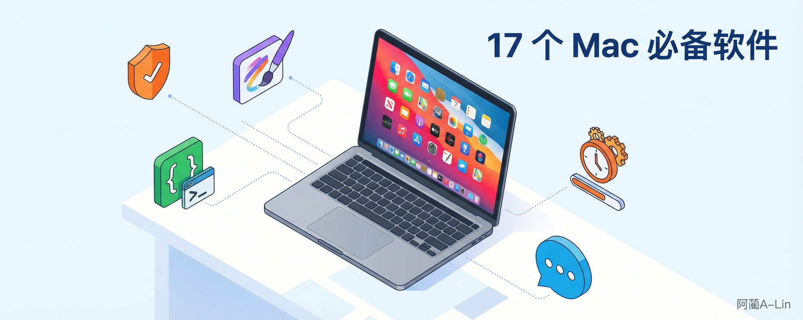
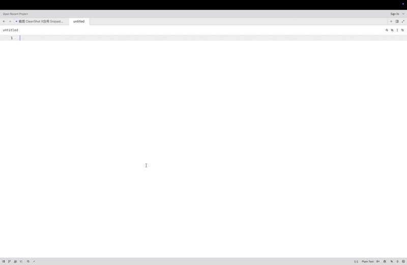

# 新 Mac 到手先装什么？我的 17 个必装清单



后台好多人问我 Mac 上都装了什么软件，一直没来得及整理。这篇就是那份清单。

17 个我真在用的软件，付费的都帮你找了免费替代，结尾附一键安装命令。

## 日常基础

**1️⃣** **浏览器：Arc** 免费。用空间（Space）管理标签页，工作、个人、临时浏览分开放，竖向的标签页让你开 100 个 tab 也不会出现找不到哪个是哪个的情况，而且还有浏览器临时小窗模式，临时开网页很舒服。

```Bash
brew install --cask arc

```

**2️⃣** **启动器：Raycast** 免费版够用。启动应用、剪贴板历史、计算器、翻译、窗口管理，一个快捷键搞定。

Q：和 Alfred 比呢？ A：Raycast 免费版已经覆盖 Alfred 付费版 90% 的功能。我两个都装过，最后留了 Raycast。

```Bash
brew install --cask raycast

```

**3️⃣** **菜单栏管理：Bartender** 付费。菜单栏图标太多看着烦，Bartender 帮你折叠起来，干净。 免费替代：**iBar**，只需要隐藏图标的话完全够用。

```Bash
brew install --cask bartender
# 免费替代
brew install --cask ibar

```


GIF

**4️⃣** **剪贴板：Paste** 订阅 ¥99/年。剪贴板历史 + 可视化预览，操作很丝滑，打开剪贴板 + 搜索历史 + 回车粘贴，秒级操作。 免费替代：**iCopy**，免费够用。



GIF

**5️⃣****压缩：Keka** 官网 [keka.io](https://keka.io/) 免费下载，App Store $4.99（花钱 = 支持开发者）。支持所有格式，右键压缩解压，不弹广告。 免费替代：**FastZip**。

```Bash
brew install --cask keka

```

**6️⃣****卸载：XApp** 免费。卸载应用时连带清理残留文件。Mac 直接拖废纸篓会留一堆缓存和配置，XApp 帮你清干净。

## 内容创作

**7️⃣****截图：CleanShot X** 截图、标注、滚动截图、GIF 录制、历史截图、图片上云，该有的全有，一个软件搞定。 免费替代：**Snipaste**，截图贴图够用，但没有标注和录屏。我用 Win 的时候一直在用 Snipaste，转 Mac 之后换了 CleanShot X，回不去了。

```Bash
brew install --cask cleanshot
# 免费替代
brew install --cask snipaste

```

**8️⃣****录屏：Screen Studio** 订阅 $108/年。录屏自动加动效、放大鼠标点击区域、加背景和圆角，跟踪鼠标进行缩放很好用，缩放大小录完还能调。不用再开剪辑软件，录完直接能发。 免费替代：**OpenScreen**（开源）/ **OBS**。

[https://github.com/siddharthvaddem/openscreen](https://github.com/siddharthvaddem/openscreen)

**9️⃣****笔记：Obsidian** 免费。本地 Markdown 文件，数据在自己手里，插件生态极其强大。我用它搭了一套内容创作系统，配合 Claude Code 从选题到发布全流程自动化。

```Bash
brew install --cask obsidian

```

**1️⃣0️⃣语音转文字：Typeless** 有免费额度（每周约 8000 字），Pro 版 ¥1000/年。按住说话自动转文字，AI 帮你去掉"嗯""啊""那个"这些口头禅，还能帮你把说的内容梳理成结构化文本。 免费替代：**豆包输入法**语音功能 / **闪电说**（基于豆包 API）。豆包完全免费，是我目前的主力。闪电说需要配和豆包 API，豆包 API 可以领 20 小时免费额度。

我之前写过一个我的使用方案，感兴趣的可以看下

> 3月3日

## 开发工具

**1️⃣****1️⃣** **终端：Ghostty** 免费开源。GPU 渲染，启动快，字体渲染清晰。配置文件就是一个纯文本，比 iTerm2 的 plist 清晰十倍。我之前分享过配置文件，三步用上和我一样的配置。 替代：**iTerm2**（免费）/ **Warp**（有免费 tier）。

```Bash
brew install --cask ghostty

```

> 3月16日

**1️⃣****2️⃣** **代码编辑器：GoLand** JetBrains 全家桶，写 Go 体验最好的 IDE。 免费替代：**VS Code**，不写 Go 的话 VS Code + 插件覆盖绝大部分语言。 说实话现在写代码主要靠 Claude Code 在终端里，编辑器打开的时间越来越少了。

```Bash
# VS Code 免费
brew install --cask visual-studio-code

```

**1️⃣****3️⃣** **AI 助手：Claude** Claude Code 需要付费订阅，月付价格：Pro $20，Max 5x $100，Max 20x $200。 模型好用，公司如神经病。

```Bash
# Claude Code
curl -fsSL https://claude.ai/install.sh | bash
# Claude 桌面版
brew install --cask claude

```

**1️⃣****4️⃣** **Token 监控：ClaudeBar** 免费。菜单栏实时显示 Claude Code 剩余额度，不用登网页查。重度 Claude Code 用户必备，普通用户不需要。 还有个 CodexBar，不推荐，有 bug，频繁弹钥匙串权限申请，烦死。

```Bash
brew install --cask claudebar

```

## 影音翻译

**1️⃣****5️⃣** **翻译 & OCR：Bob** App Store 付费（约 ¥30）。划词翻译 + 截图 OCR + 输入翻译，三种模式一个快捷键切换。 免费替代：**Easydict**（开源），日常翻译够用，OCR 准确度和 Bob 有差距。

```Bash
# 免费替代
brew install --cask easydict

```

**1️⃣7️⃣视频播放：IINA** 免费开源。Mac 上最好看的播放器，原生 macOS 风格，支持所有格式。装上就不想用别的了。

```Bash
brew install --cask iina

```

## 效率管理

**1️⃣****7️⃣** **待办：滴答清单** 免费版够用。跨平台同步，日历视图、番茄钟、习惯打卡都有。高级版 App Store ¥169/年，官网 ¥139/年，想买的话走官网更划算。免费版日常管理完全够。

## 总结

17 个品类，10 个免费或免费够用，7 个付费（全部附了免费替代）。

如果你刚买 Mac，先把免费的装上，用一阵子觉得不够再考虑付费的。大部分人免费的完全够用。

懒人一键安装（免费的那些）：

```Bash
brew install --cask arc raycast keka iina ghostty obsidian visual-studio-code easydict snipaste

```

一条命令，9 个软件，搞定。

---

> 来源：飞书 · AI Spark 知识库 ｜ 原文（最新版）：<https://lcnniolukk80.feishu.cn/wiki/RDGVwTFYEiZzLUk8W44cAPyonne> ｜ 归档：2026-06-04
