# 玩尽各种AI大模型导致C盘爆满全红？教你一招无损借空间，彻底告别焦虑！（附实操图解）

电脑用久了，尤其是最近跟着教程折腾各种 AI 模型、安装复杂的环境依赖，不管把主程序装在哪里，C盘空间总是越用越小，最后防不胜防地变成扎眼的全红色。C盘爆满不仅让人心怀焦虑，还会拖慢整个系统的运行速度。

今天，就来教大家如何使用**傲梅分区助手（绿色版）**，在**不重装系统、不丢失数据**的情况下，轻松从空闲的D盘（或其他盘）“借”出空间，完美拯救你的C盘！

**⚠️** **温馨提示：**虽然本教程的操作是“无损”的，但由于涉及到磁盘底层的调整，**强烈建议在操作前备份极其重要的数据**，并确保操作期间电脑不会断电。

## 第一步：获取并运行软件

我们使用的是“绿色版”的傲梅分区助手。解压即用，不需要安装，用完直接删掉，完全不会给系统留下多余的垃圾注册表或文件，非常清爽。

双击运行软件图标，打开傲梅分区助手：

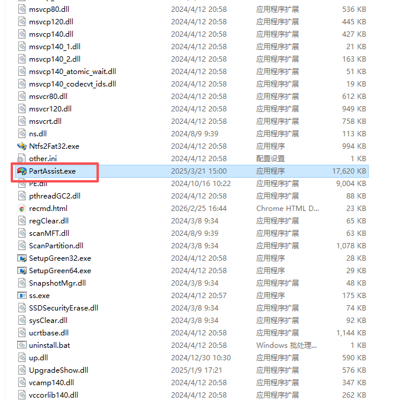

## 第二步：找到闲置空间，分配给C盘

进入软件主界面后，你能直观地看到所有磁盘的使用情况。找到你空间比较充裕的盘（在这个例子中是D盘），右键点击它，或者在左侧操作栏中选择**“分配空闲空间”**。

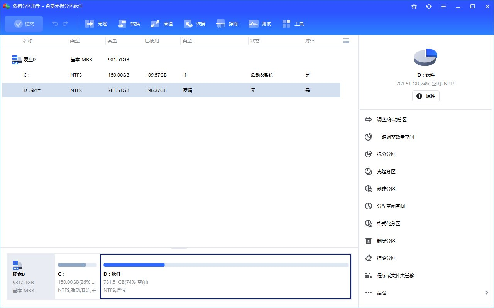

在弹出的对话框中，设置你想从D盘划出多少空间（比如填写 100.00 GB），并将目标划给 **C盘**，然后点击确定。

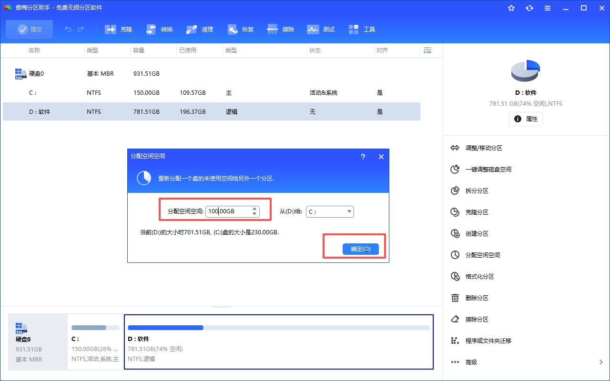

## 第三步：提交计划并准备执行

点击确定后，你会发现主界面的C盘容量已经“预览”变大了，但这只是一个待执行的计划。你需要点击左上角的**“提交”**按钮，才能真正让它生效。

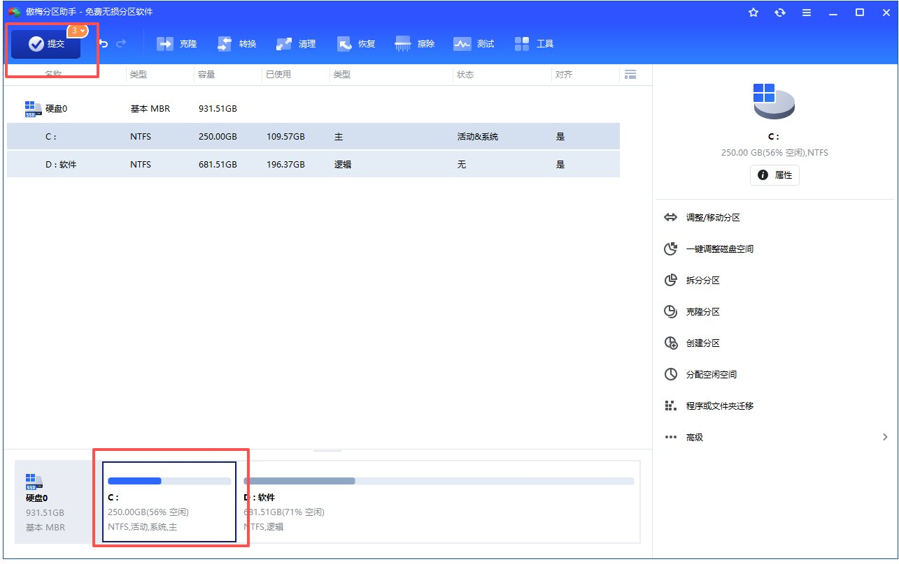

## 第四步：进入 WinPE 环境自动处理

因为我们要调整的是正在运行着操作系统的C盘，软件会先在后台创建一个 **WinPE 环境**（一种微型操作系统），并在重启后进入这个环境完成底层操作。

软件在后台创建 WinPE 环境：

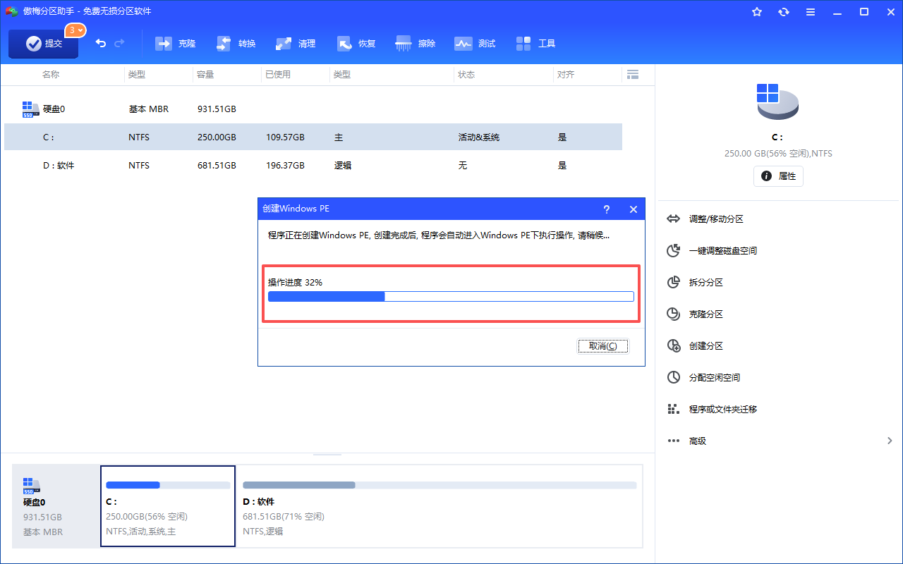

创建完成后，会提示你是否重启进入 PreOS 模式执行操作，点击“是”。

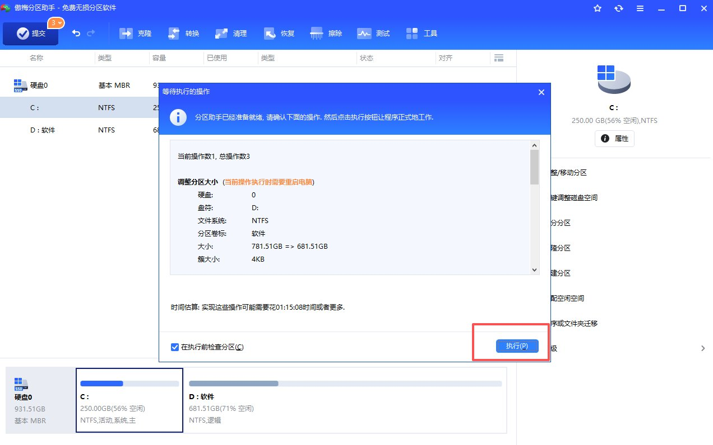

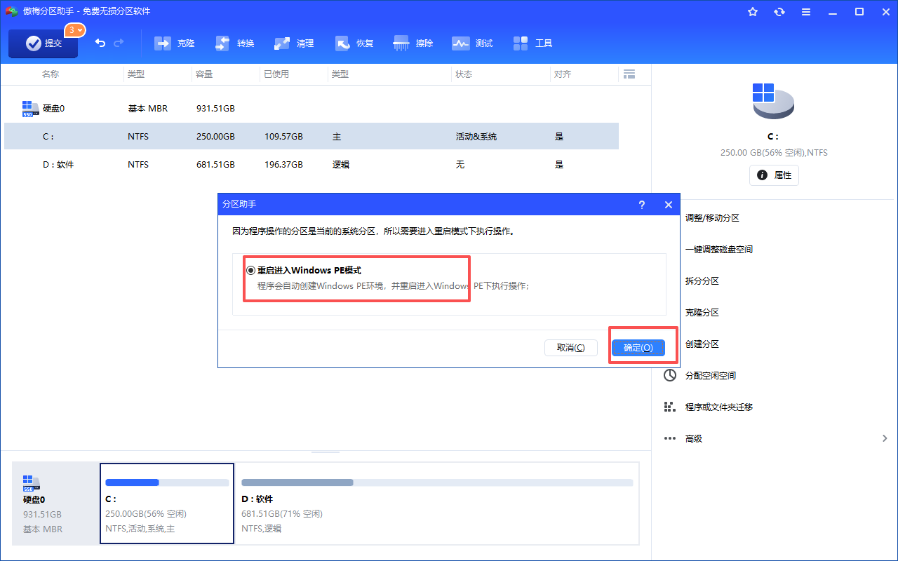

## 第五步：耐心等待读条（切勿断电）

电脑重启后会进入傲梅的加载界面。加载磁盘驱动可能需要花费几分钟的时间。

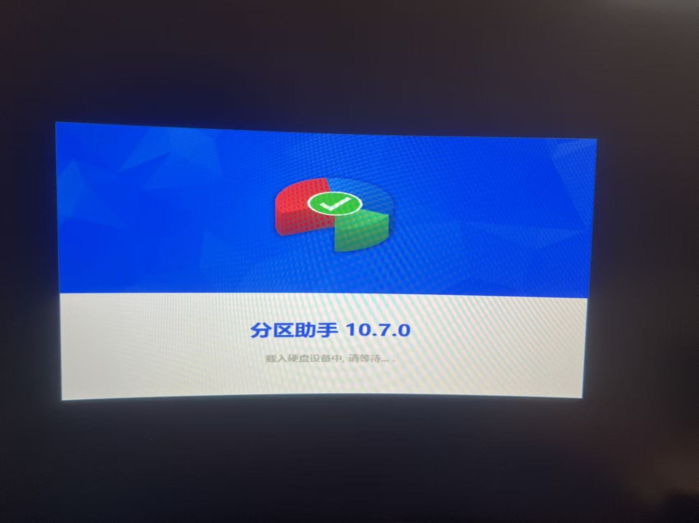

随后会出现实时的分区进度条。这个阶段它正在无损挪动和合并空间，**在此期间绝对不能强制关机或断电！** 耐心等待即可。

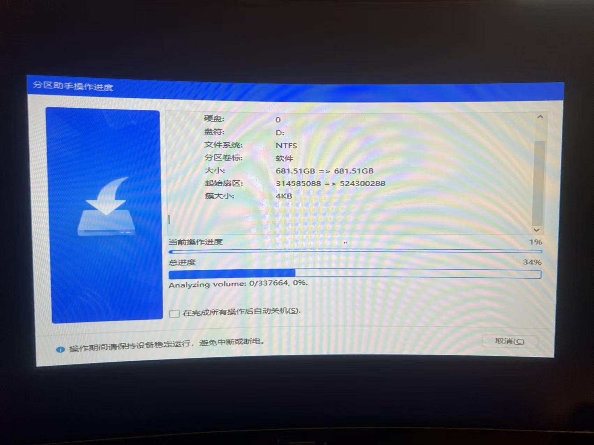

当进度条跑完后，电脑会自动再次重启。

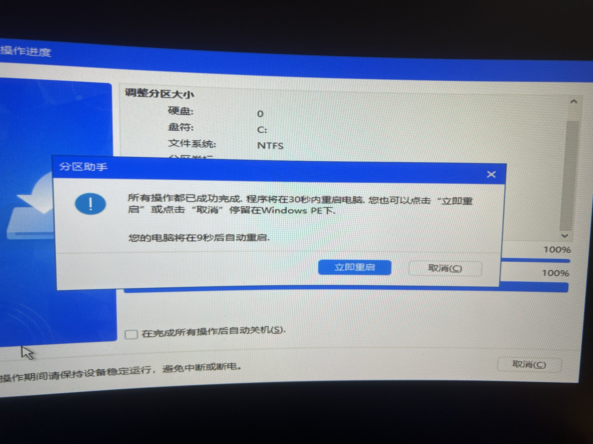

## 第六步：验证战果，告别焦虑！

电脑重新进入熟悉的 Windows 系统后，再次打开资源管理器，你会惊喜地发现——C盘的空间瞬间变得十分宽裕！那扎眼的红色终于消失了！

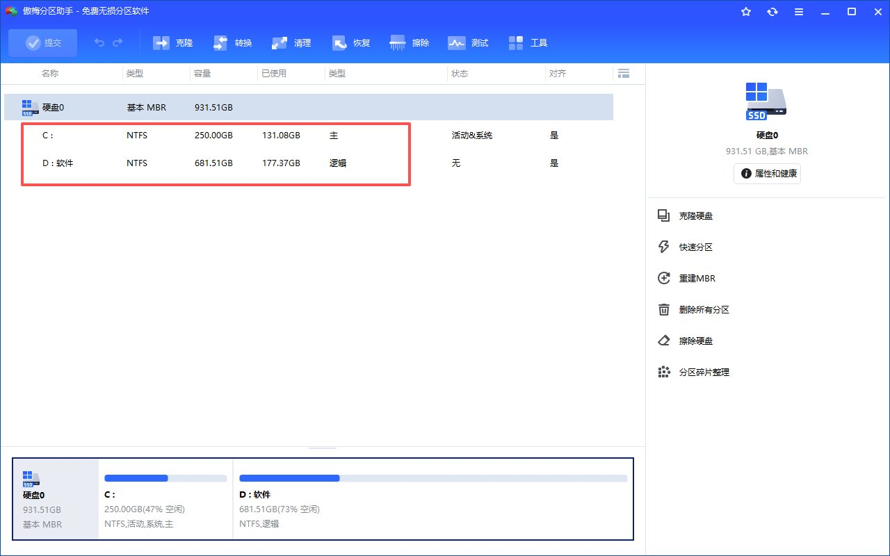

现在，你又可以愉快地继续折腾各种 AI 大模型和软件了！

---

> 来源：飞书 · AI Spark 知识库 ｜ 原文（最新版）：<https://lcnniolukk80.feishu.cn/wiki/LirDwFJtQit7UrkmsB5cxgz9n6V> ｜ 归档：2026-06-04
